# AI/ML Integration

<cite>
**Referenced Files in This Document**
- [aiService.js](file://backend/src/services/aiService.js)
- [aiAnalyticsService.js](file://backend/src/services/aiAnalyticsService.js)
- [aiTrendEnhancer.js](file://backend/src/services/aiTrendEnhancer.js)
- [aiOptimizationService.js](file://backend/src/services/aiOptimizationService.js)
- [platformFusionEngine.js](file://backend/src/services/platformFusionEngine.js)
- [graphEngine.js](file://backend/src/services/graphEngine.js)
- [trendPredictionEngine.js](file://backend/src/services/trendPredictionEngine.js)
- [aiController.js](file://backend/src/controllers/aiController.js)
- [aiChatController.js](file://backend/src/controllers/aiChatController.js)
- [AIExplainability.tsx](file://AITrendTracker7/src/components/ai/AIExplainability.tsx)
- [ConfidenceRing.tsx](file://AITrendTracker7/src/components/ai/ConfidenceRing.tsx)
- [PlatformIntelligenceBadges.tsx](file://AITrendTracker7/src/components/ai/PlatformIntelligenceBadges.tsx)
- [RelationshipGraph.tsx](file://AITrendTracker7/src/components/ai/RelationshipGraph.tsx)
- [corePipeline.test.js](file://backend/src/tests/corePipeline.test.js)
- [trendClusteringEngine.test.js](file://backend/src/tests/trendClusteringEngine.test.js)
</cite>

## Table of Contents
1. [Introduction](#introduction)
2. [Project Structure](#project-structure)
3. [Core Components](#core-components)
4. [Architecture Overview](#architecture-overview)
5. [Detailed Component Analysis](#detailed-component-analysis)
6. [Dependency Analysis](#dependency-analysis)
7. [Performance Considerations](#performance-considerations)
8. [Troubleshooting Guide](#troubleshooting-guide)
9. [Conclusion](#conclusion)
10. [Appendices](#appendices)

## Introduction
This document explains AITrendTracker’s AI/ML integration architecture with a focus on external API integrations, confidence scoring, explainability, platform trust matrices, and the end-to-end machine learning pipeline. It covers how the system leverages Gemini and OpenRouter for trend analysis and natural language processing, how AI confidence is computed and visualized, and how predictive intelligence is delivered through lifecycle modeling, historical calibration, and regional migration forecasting. It also documents performance optimizations, cost controls, fallback mechanisms, ethical safeguards, and extension guidelines for adding new models and capabilities.

## Project Structure
The AI/ML stack spans backend services and frontend components:
- Backend services orchestrate external LLM APIs, internal ML engines, caching, and persistence.
- Frontend components visualize AI confidence, platform trust, and relationship graphs.

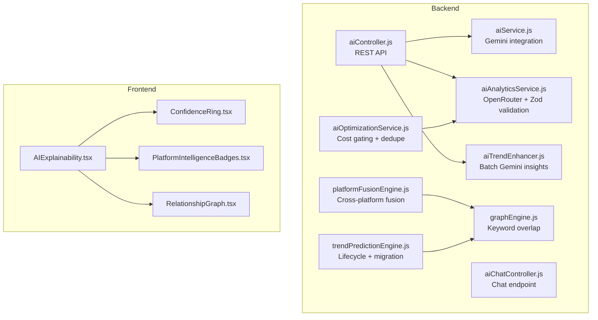

**Diagram sources**
- [aiService.js:1-168](file://backend/src/services/aiService.js#L1-L168)
- [aiAnalyticsService.js:1-203](file://backend/src/services/aiAnalyticsService.js#L1-L203)
- [aiTrendEnhancer.js:1-187](file://backend/src/services/aiTrendEnhancer.js#L1-L187)
- [aiOptimizationService.js:1-120](file://backend/src/services/aiOptimizationService.js#L1-L120)
- [platformFusionEngine.js:1-268](file://backend/src/services/platformFusionEngine.js#L1-L268)
- [graphEngine.js:15-47](file://backend/src/services/graphEngine.js#L15-L47)
- [trendPredictionEngine.js:1-573](file://backend/src/services/trendPredictionEngine.js#L1-L573)
- [aiController.js:1-47](file://backend/src/controllers/aiController.js#L1-L47)
- [aiChatController.js:1-22](file://backend/src/controllers/aiChatController.js#L1-L22)
- [AIExplainability.tsx:1-210](file://AITrendTracker7/src/components/ai/AIExplainability.tsx#L1-L210)
- [ConfidenceRing.tsx:1-137](file://AITrendTracker7/src/components/ai/ConfidenceRing.tsx#L1-L137)
- [PlatformIntelligenceBadges.tsx:1-83](file://AITrendTracker7/src/components/ai/PlatformIntelligenceBadges.tsx#L1-L83)
- [RelationshipGraph.tsx:1-170](file://AITrendTracker7/src/components/ai/RelationshipGraph.tsx#L1-L170)

**Section sources**
- [aiService.js:1-168](file://backend/src/services/aiService.js#L1-L168)
- [aiAnalyticsService.js:1-203](file://backend/src/services/aiAnalyticsService.js#L1-L203)
- [aiTrendEnhancer.js:1-187](file://backend/src/services/aiTrendEnhancer.js#L1-L187)
- [aiOptimizationService.js:1-120](file://backend/src/services/aiOptimizationService.js#L1-L120)
- [platformFusionEngine.js:1-268](file://backend/src/services/platformFusionEngine.js#L1-L268)
- [graphEngine.js:15-47](file://backend/src/services/graphEngine.js#L15-L47)
- [trendPredictionEngine.js:1-573](file://backend/src/services/trendPredictionEngine.js#L1-L573)
- [aiController.js:1-47](file://backend/src/controllers/aiController.js#L1-L47)
- [aiChatController.js:1-22](file://backend/src/controllers/aiChatController.js#L1-L22)
- [AIExplainability.tsx:1-210](file://AITrendTracker7/src/components/ai/AIExplainability.tsx#L1-L210)
- [ConfidenceRing.tsx:1-137](file://AITrendTracker7/src/components/ai/ConfidenceRing.tsx#L1-L137)
- [PlatformIntelligenceBadges.tsx:1-83](file://AITrendTracker7/src/components/ai/PlatformIntelligenceBadges.tsx#L1-L83)
- [RelationshipGraph.tsx:1-170](file://AITrendTracker7/src/components/ai/RelationshipGraph.tsx#L1-L170)

## Core Components
- Gemini integration for trend analysis and conversational chat.
- OpenRouter integration with DeepSeek and GPT-4o-mini fallbacks, plus Zod validation.
- Batch AI trend enhancer leveraging Gemini for aggregated insights.
- AI optimization service for cost control and duplicate avoidance.
- Platform fusion engine for cross-platform deduplication and trust-weighted merging.
- Graph engine for keyword extraction and relationship scoring.
- Trend prediction engine for lifecycle classification, historical calibration, and regional migration.
- Frontend explainability UI with confidence ring, platform trust badges, and relationship graph.

**Section sources**
- [aiService.js:1-168](file://backend/src/services/aiService.js#L1-L168)
- [aiAnalyticsService.js:1-203](file://backend/src/services/aiAnalyticsService.js#L1-L203)
- [aiTrendEnhancer.js:1-187](file://backend/src/services/aiTrendEnhancer.js#L1-L187)
- [aiOptimizationService.js:1-120](file://backend/src/services/aiOptimizationService.js#L1-L120)
- [platformFusionEngine.js:1-268](file://backend/src/services/platformFusionEngine.js#L1-L268)
- [graphEngine.js:15-47](file://backend/src/services/graphEngine.js#L15-L47)
- [trendPredictionEngine.js:1-573](file://backend/src/services/trendPredictionEngine.js#L1-L573)
- [AIExplainability.tsx:1-210](file://AITrendTracker7/src/components/ai/AIExplainability.tsx#L1-L210)
- [ConfidenceRing.tsx:1-137](file://AITrendTracker7/src/components/ai/ConfidenceRing.tsx#L1-L137)
- [PlatformIntelligenceBadges.tsx:1-83](file://AITrendTracker7/src/components/ai/PlatformIntelligenceBadges.tsx#L1-L83)
- [RelationshipGraph.tsx:1-170](file://AITrendTracker7/src/components/ai/RelationshipGraph.tsx#L1-L170)

## Architecture Overview
The AI/ML pipeline integrates external LLM providers with internal engines to deliver robust, explainable, and cost-aware trend intelligence.

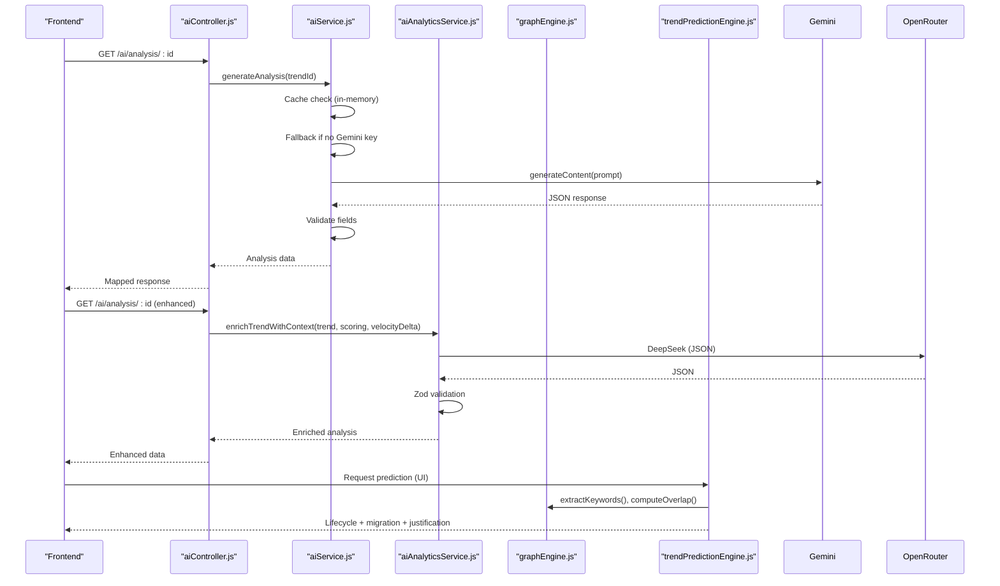

**Diagram sources**
- [aiController.js:1-47](file://backend/src/controllers/aiController.js#L1-L47)
- [aiService.js:1-168](file://backend/src/services/aiService.js#L1-L168)
- [aiAnalyticsService.js:1-203](file://backend/src/services/aiAnalyticsService.js#L1-L203)
- [graphEngine.js:15-47](file://backend/src/services/graphEngine.js#L15-L47)
- [trendPredictionEngine.js:1-573](file://backend/src/services/trendPredictionEngine.js#L1-L573)

## Detailed Component Analysis

### Gemini Integration (aiService.js)
- Initializes Gemini only when the API key is present, preventing startup failures.
- Implements an in-memory cache with TTL to reduce repeated calls.
- Parses and validates AI responses to guard against hallucinations.
- Provides a fallback object when the API is unavailable.
- Supports conversational chat with a Hinglish system prompt and rate-limit handling.

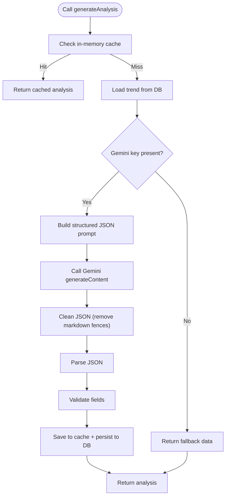

**Diagram sources**
- [aiService.js:17-100](file://backend/src/services/aiService.js#L17-L100)

**Section sources**
- [aiService.js:1-168](file://backend/src/services/aiService.js#L1-L168)

### OpenRouter + Zod Validation (aiAnalyticsService.js)
- Integrates OpenRouter with DeepSeek and falls back to GPT-4o-mini if needed.
- Enforces strict JSON output with explicit formatting arrays and Zod schema validation.
- Includes a coercion mechanism to salvage partial results and a deterministic fallback.
- Provides a rich prompt with scoring context, velocity delta, and geographic context.

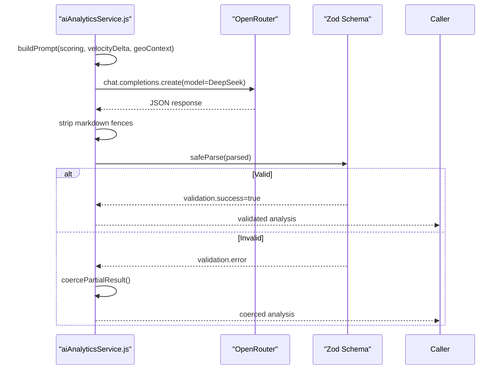

**Diagram sources**
- [aiAnalyticsService.js:62-96](file://backend/src/services/aiAnalyticsService.js#L62-L96)

**Section sources**
- [aiAnalyticsService.js:1-203](file://backend/src/services/aiAnalyticsService.js#L1-L203)

### Batch AI Trend Enhancer (aiTrendEnhancer.js)
- Performs batch analysis using a single Gemini call to minimize API costs.
- Uses an in-memory cache keyed by title hash with TTL to avoid redundant calls.
- Separates cached and uncached trends, batch-analyzes the latter, and merges results.
- Provides a keyword-based fallback when the API is unavailable.

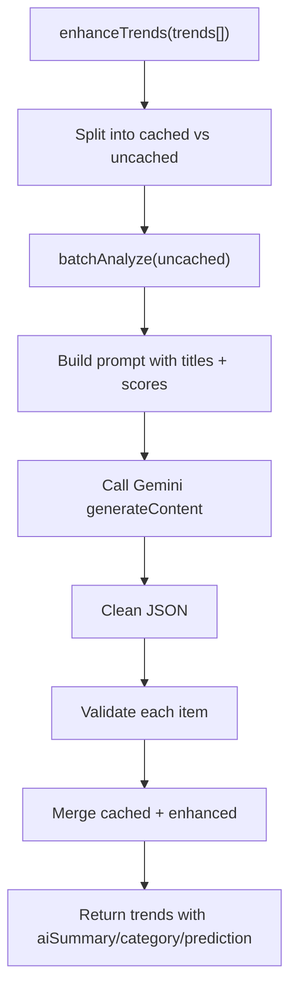

**Diagram sources**
- [aiTrendEnhancer.js:35-94](file://backend/src/services/aiTrendEnhancer.js#L35-L94)
- [aiTrendEnhancer.js:100-152](file://backend/src/services/aiTrendEnhancer.js#L100-L152)

**Section sources**
- [aiTrendEnhancer.js:1-187](file://backend/src/services/aiTrendEnhancer.js#L1-L187)

### AI Optimization Service (aiOptimizationService.js)
- Gatekeeping: only enqueues LLM enrichment for trends with viralScore above threshold.
- Duplicate detection: compares incoming keywords with recently enriched trends and mirrors analysis to avoid redundant calls.
- Keyword extraction and overlap computation use Jaccard-like similarity.

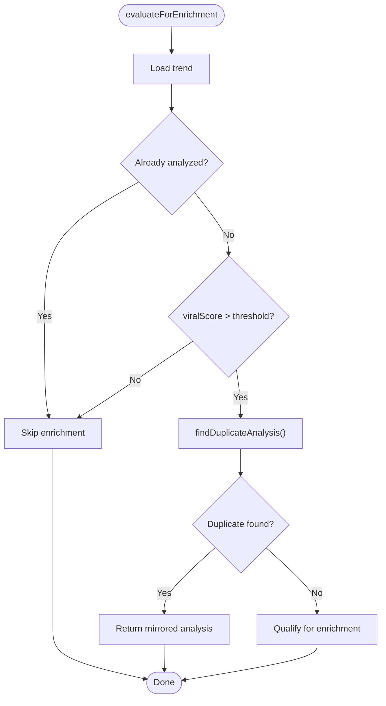

**Diagram sources**
- [aiOptimizationService.js:21-47](file://backend/src/services/aiOptimizationService.js#L21-L47)
- [aiOptimizationService.js:54-83](file://backend/src/services/aiOptimizationService.js#L54-L83)

**Section sources**
- [aiOptimizationService.js:1-120](file://backend/src/services/aiOptimizationService.js#L1-L120)

### Platform Fusion Engine (platformFusionEngine.js)
- Deduplicates incoming trends within a 30-minute window using keyword overlap.
- Merges sources across platforms and applies a cross-platform multiplier to composite scoring.
- Builds initial source entries for new trends and supports Reddit, YouTube, and Google News.

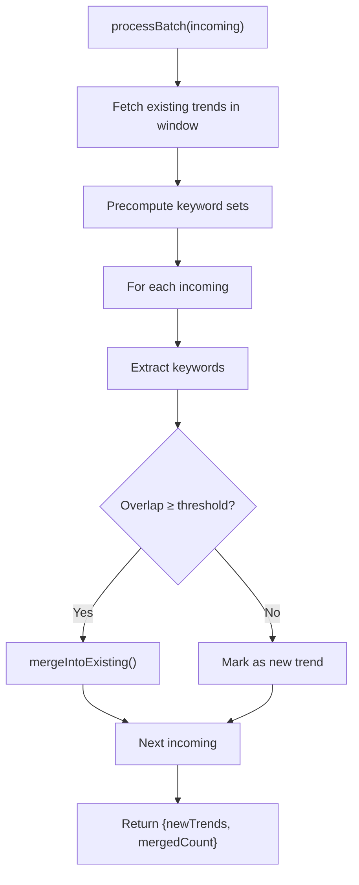

**Diagram sources**
- [platformFusionEngine.js:84-152](file://backend/src/services/platformFusionEngine.js#L84-L152)
- [platformFusionEngine.js:159-201](file://backend/src/services/platformFusionEngine.js#L159-L201)

**Section sources**
- [platformFusionEngine.js:1-268](file://backend/src/services/platformFusionEngine.js#L1-L268)

### Graph Engine (graphEngine.js)
- Extracts significant keywords from text while filtering stop words.
- Computes overlap between keyword sets to determine contextual relationships.

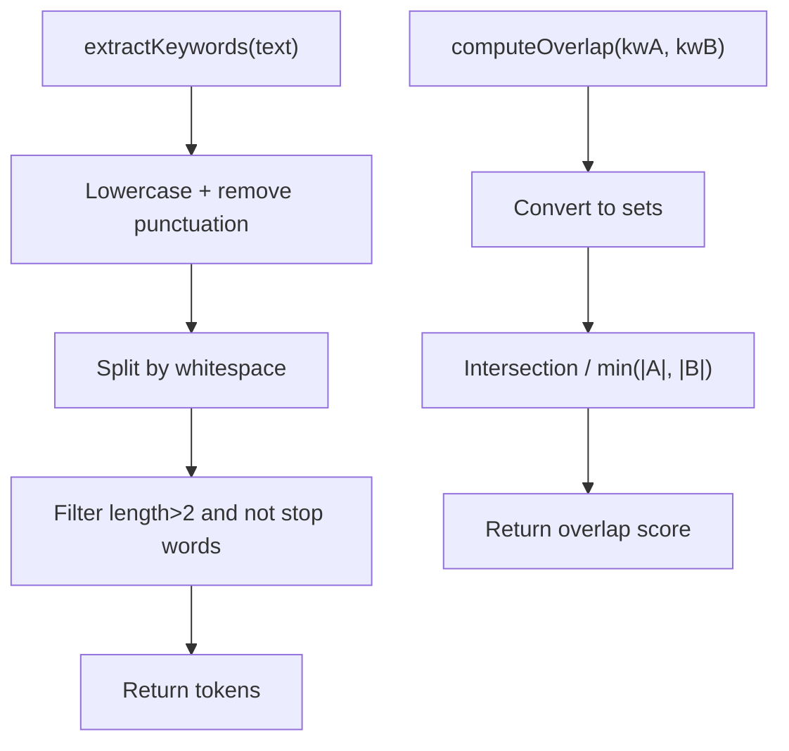

**Diagram sources**
- [graphEngine.js:40-47](file://backend/src/services/graphEngine.js#L40-L47)
- [graphEngine.js:15-47](file://backend/src/services/graphEngine.js#L15-L47)

**Section sources**
- [graphEngine.js:15-47](file://backend/src/services/graphEngine.js#L15-L47)

### Trend Prediction Engine (trendPredictionEngine.js)
- Lifecycle state machine: emerging, accelerating, viral, declining, dead.
- Historical calibration: scans past trends for semantically similar matches and computes a calibrated confidence score.
- Regional migration: predicts propagation paths with time lag and probability, adjusted by lifecycle, confidence, and platform spread.
- Explainable justification: builds a human-readable explanation incorporating lifecycle, historical match, migration forecast, and cross-platform verification.

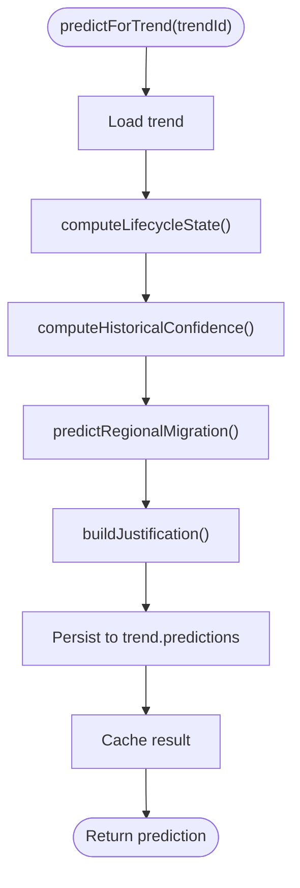

**Diagram sources**
- [trendPredictionEngine.js:486-537](file://backend/src/services/trendPredictionEngine.js#L486-L537)

**Section sources**
- [trendPredictionEngine.js:1-573](file://backend/src/services/trendPredictionEngine.js#L1-L573)

### Frontend AI Explainability Components
- AIExplainability.tsx: Collapsible panel showing confidence ring, platform trust badges, anomaly/bot filters, and relationship graph.
- ConfidenceRing.tsx: Animated SVG ring with gradient color coding and smooth transitions.
- PlatformIntelligenceBadges.tsx: Trust score and weight badges per platform with icons.
- RelationshipGraph.tsx: Static SVG graph with radial layout, edges sized by weight, and accessibility support.

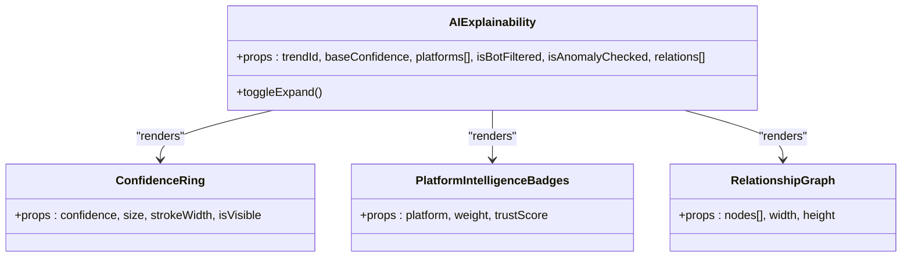

**Diagram sources**
- [AIExplainability.tsx:26-120](file://AITrendTracker7/src/components/ai/AIExplainability.tsx#L26-L120)
- [ConfidenceRing.tsx:24-117](file://AITrendTracker7/src/components/ai/ConfidenceRing.tsx#L24-L117)
- [PlatformIntelligenceBadges.tsx:12-44](file://AITrendTracker7/src/components/ai/PlatformIntelligenceBadges.tsx#L12-L44)
- [RelationshipGraph.tsx:24-162](file://AITrendTracker7/src/components/ai/RelationshipGraph.tsx#L24-L162)

**Section sources**
- [AIExplainability.tsx:1-210](file://AITrendTracker7/src/components/ai/AIExplainability.tsx#L1-L210)
- [ConfidenceRing.tsx:1-137](file://AITrendTracker7/src/components/ai/ConfidenceRing.tsx#L1-L137)
- [PlatformIntelligenceBadges.tsx:1-83](file://AITrendTracker7/src/components/ai/PlatformIntelligenceBadges.tsx#L1-L83)
- [RelationshipGraph.tsx:1-170](file://AITrendTracker7/src/components/ai/RelationshipGraph.tsx#L1-L170)

## Dependency Analysis
- Controllers depend on services for AI analysis and chat.
- Services depend on external providers (Gemini, OpenRouter) and internal engines (graph, prediction).
- Frontend components depend on props passed from controllers/services and render visualizations.

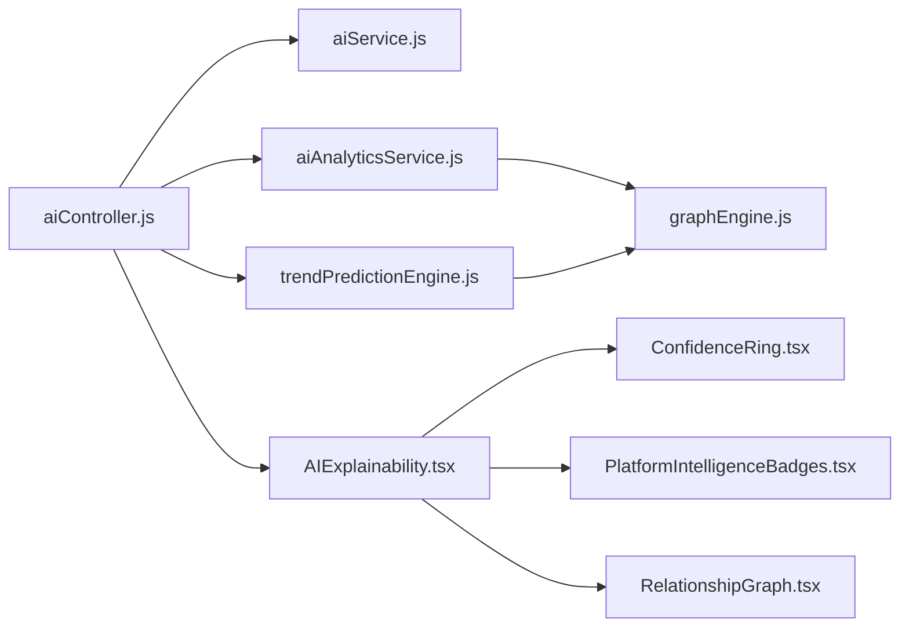

**Diagram sources**
- [aiController.js:1-47](file://backend/src/controllers/aiController.js#L1-L47)
- [aiService.js:1-168](file://backend/src/services/aiService.js#L1-L168)
- [aiAnalyticsService.js:1-203](file://backend/src/services/aiAnalyticsService.js#L1-L203)
- [trendPredictionEngine.js:1-573](file://backend/src/services/trendPredictionEngine.js#L1-L573)
- [graphEngine.js:15-47](file://backend/src/services/graphEngine.js#L15-L47)
- [AIExplainability.tsx:1-210](file://AITrendTracker7/src/components/ai/AIExplainability.tsx#L1-L210)
- [ConfidenceRing.tsx:1-137](file://AITrendTracker7/src/components/ai/ConfidenceRing.tsx#L1-L137)
- [PlatformIntelligenceBadges.tsx:1-83](file://AITrendTracker7/src/components/ai/PlatformIntelligenceBadges.tsx#L1-L83)
- [RelationshipGraph.tsx:1-170](file://AITrendTracker7/src/components/ai/RelationshipGraph.tsx#L1-L170)

**Section sources**
- [aiController.js:1-47](file://backend/src/controllers/aiController.js#L1-L47)
- [aiChatController.js:1-22](file://backend/src/controllers/aiChatController.js#L1-L22)
- [aiService.js:1-168](file://backend/src/services/aiService.js#L1-L168)
- [aiAnalyticsService.js:1-203](file://backend/src/services/aiAnalyticsService.js#L1-L203)
- [trendPredictionEngine.js:1-573](file://backend/src/services/trendPredictionEngine.js#L1-L573)
- [graphEngine.js:15-47](file://backend/src/services/graphEngine.js#L15-L47)
- [AIExplainability.tsx:1-210](file://AITrendTracker7/src/components/ai/AIExplainability.tsx#L1-L210)
- [ConfidenceRing.tsx:1-137](file://AITrendTracker7/src/components/ai/ConfidenceRing.tsx#L1-L137)
- [PlatformIntelligenceBadges.tsx:1-83](file://AITrendTracker7/src/components/ai/PlatformIntelligenceBadges.tsx#L1-L83)
- [RelationshipGraph.tsx:1-170](file://AITrendTracker7/src/components/ai/RelationshipGraph.tsx#L1-L170)

## Performance Considerations
- Caching
  - Gemini analysis cache (30 min TTL) and title-hash cache for batch enhancer (1 hour TTL) reduce API calls.
  - Prediction results cached for 5 minutes.
- Cost Control
  - Enrichment gate: only processes trends with viralScore above threshold.
  - Duplicate detection mirrors analysis to avoid redundant LLM calls.
- Batch Processing
  - Single batch Gemini call for trend enhancements minimizes overhead.
- Frontend Rendering
  - Static SVG graphs with precomputed positions and memoization reduce layout thrash.
  - Animated transitions use shared values and easing for smooth updates.

[No sources needed since this section provides general guidance]

## Troubleshooting Guide
- Gemini API Unavailable
  - Behavior: Fallback data returned; chat returns rate-limit guidance.
  - Mitigation: Verify API key; monitor rate limits; retry after cooldown.
- OpenRouter/DeepSeek Failures
  - Behavior: Falls back to GPT-4o-mini; on total failure, deterministic fallback.
  - Mitigation: Inspect logs for JSON parse/Zod validation errors; adjust prompts or retry.
- Prediction Justification Tests
  - Behavior: Justification includes lifecycle, historical match, migration forecast, and cross-platform verification.
  - Mitigation: Validate inputs (composite score, history, platform count); ensure category and region data are present.
- Clustering and Security
  - Behavior: Anomaly firewall quarantines suspicious trends; bot-like spikes are filtered.
  - Mitigation: Review engagement patterns and moderation status; adjust thresholds if needed.

**Section sources**
- [aiService.js:35-85](file://backend/src/services/aiService.js#L35-L85)
- [aiAnalyticsService.js:37-56](file://backend/src/services/aiAnalyticsService.js#L37-L56)
- [corePipeline.test.js:808-960](file://backend/src/tests/corePipeline.test.js#L808-L960)
- [trendClusteringEngine.test.js:316-350](file://backend/src/tests/trendClusteringEngine.test.js#L316-L350)

## Conclusion
AITrendTracker’s AI/ML integration combines resilient external API usage with robust internal engines to deliver accurate, explainable, and cost-efficient trend intelligence. The system employs layered caching, validation, and fallbacks to maintain reliability, while lifecycle modeling, historical calibration, and migration forecasting provide predictive insights. The frontend presents trust matrices, confidence scores, and relationship graphs to make AI outputs transparent and actionable.

[No sources needed since this section summarizes without analyzing specific files]

## Appendices

### API Definitions
- GET /ai/analysis/:id
  - Purpose: Retrieve AI analysis for a trend.
  - Response: Maps DeepSeek schema to frontend fields; includes sentimentScore, viralityScore, keyDrivers, aiPrediction, confidence.
  - Notes: Returns pending state if analysis is not yet completed.

**Section sources**
- [aiController.js:1-47](file://backend/src/controllers/aiController.js#L1-L47)

### Ethical Considerations, Bias Mitigation, and Transparency
- Hallucination Safeguards
  - Gemini: Field validation and fallbacks.
  - OpenRouter: Zod schema validation and partial-result coercion.
- Transparency
  - Explainable justifications enumerate lifecycle state, historical calibration, migration forecasts, and cross-platform verification.
- Bias Mitigation
  - Keyword extraction uses stop-word filtering; historical calibration weights category consistency and platform verification to reduce skewed predictions.
- Cost and Accessibility
  - Cost gating and duplicate mirroring ensure responsible spending; fallbacks keep the system functional without LLMs.

**Section sources**
- [aiService.js:88-100](file://backend/src/services/aiService.js#L88-L100)
- [aiAnalyticsService.js:85-96](file://backend/src/services/aiAnalyticsService.js#L85-L96)
- [trendPredictionEngine.js:443-473](file://backend/src/services/trendPredictionEngine.js#L443-L473)

### Extending the AI System
- Adding a New Model
  - Implement a new service similar to aiAnalyticsService with provider-specific client initialization, prompt building, and validation.
  - Integrate a fallback chain and logging for resilience.
- Enhancing Explainability
  - Extend trendPredictionEngine to incorporate additional factors (e.g., sentiment polarity, domain experts).
  - Update frontend components to render new signals.
- Optimizing Costs
  - Introduce adaptive thresholds for enrichment gates.
  - Expand duplicate detection to include semantic similarity beyond keywords.
- Improving Relationships
  - Enhance graphEngine with entity linking and co-occurrence weighting.
  - Add dynamic node budgets and interactive layouts for larger graphs.

[No sources needed since this section provides general guidance]