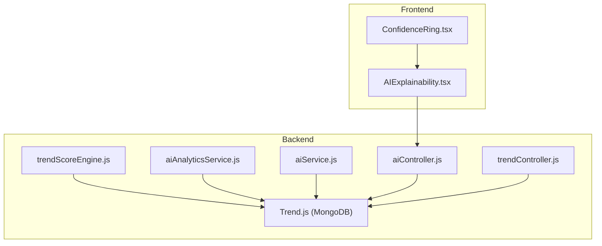
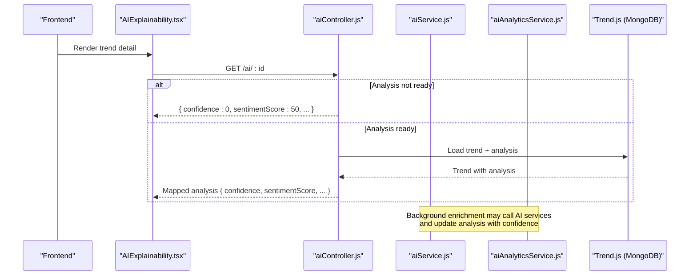
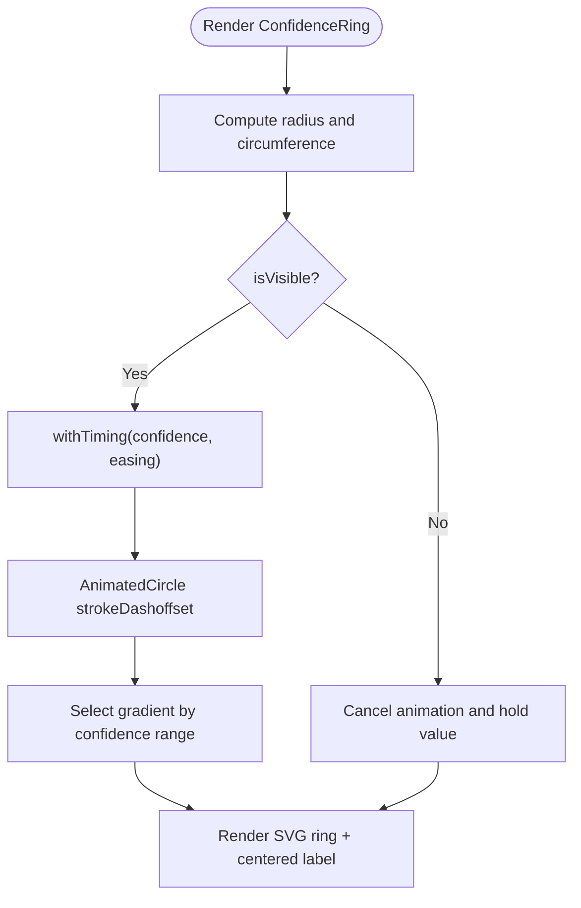
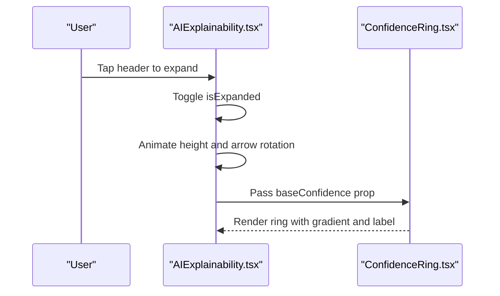
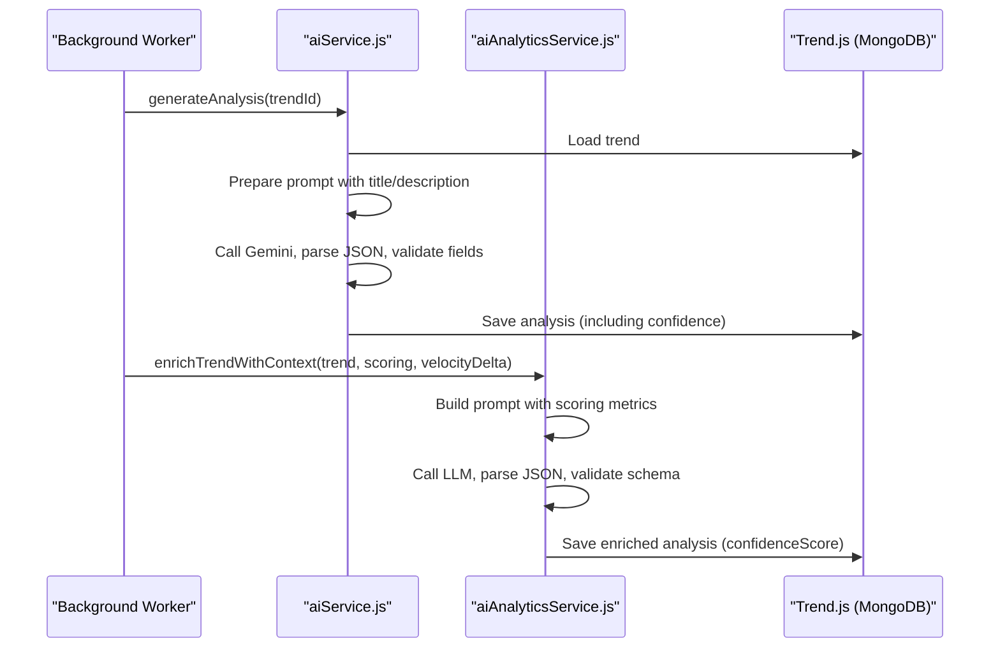
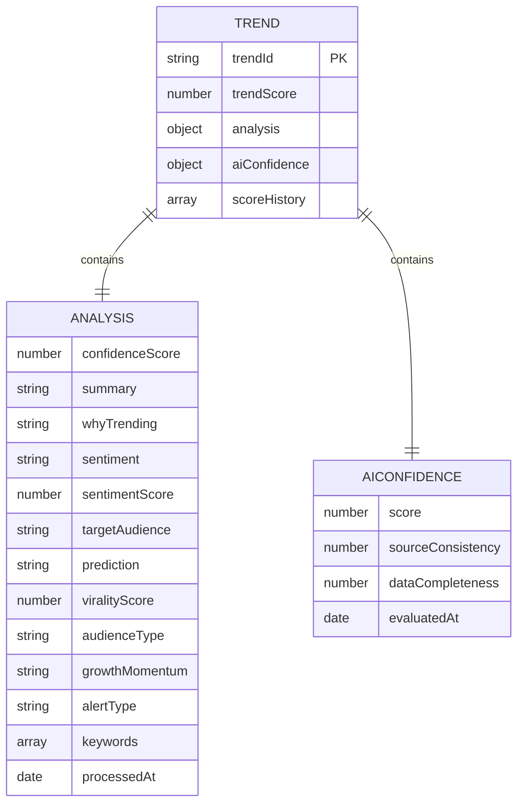
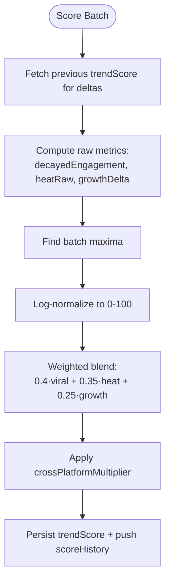
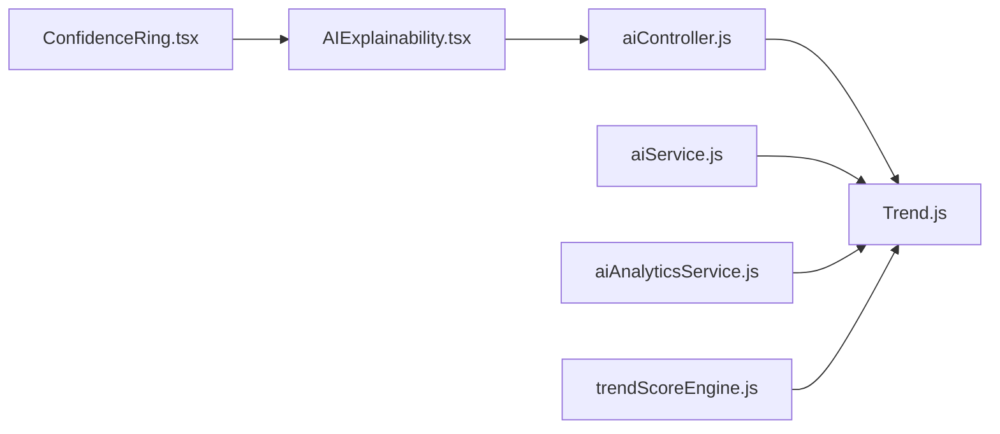

# Confidence Scoring System

<cite>
**Referenced Files in This Document**
- [ConfidenceRing.tsx](file://AITrendTracker7/src/components/ai/ConfidenceRing.tsx)
- [AIExplainability.tsx](file://AITrendTracker7/src/components/ai/AIExplainability.tsx)
- [trendScoreEngine.js](file://backend/src/services/trendScoreEngine.js)
- [aiService.js](file://backend/src/services/aiService.js)
- [aiAnalyticsService.js](file://backend/src/services/aiAnalyticsService.js)
- [Trend.js](file://backend/src/models/Trend.js)
- [aiController.js](file://backend/src/controllers/aiController.js)
- [trendController.js](file://backend/src/controllers/trendController.js)
</cite>

## Table of Contents
1. [Introduction](#introduction)
2. [Project Structure](#project-structure)
3. [Core Components](#core-components)
4. [Architecture Overview](#architecture-overview)
5. [Detailed Component Analysis](#detailed-component-analysis)
6. [Dependency Analysis](#dependency-analysis)
7. [Performance Considerations](#performance-considerations)
8. [Troubleshooting Guide](#troubleshooting-guide)
9. [Conclusion](#conclusion)

## Introduction
This document explains AITrendTracker’s AI confidence scoring system. It covers how confidence scores are calculated, stored, and surfaced in the UI, focusing on the ConfidenceRing component and the broader AI analysis pipeline. The confidence score is a 0–100 metric that reflects the reliability of AI-generated trend insights, derived from multiple data sources and safeguards.

## Project Structure
The confidence scoring spans backend services and frontend components:
- Backend services compute trend scores and generate AI analyses with confidence.
- The database schema stores trend metrics, AI analysis, and confidence-related fields.
- Frontend components render confidence visually and integrate with AI explainability.

**Diagram sources**
- [trendScoreEngine.js:1-231](file://backend/src/services/trendScoreEngine.js#L1-L231)
- [aiService.js:1-168](file://backend/src/services/aiService.js#L1-L168)
- [aiAnalyticsService.js:1-203](file://backend/src/services/aiAnalyticsService.js#L1-L203)
- [Trend.js:1-188](file://backend/src/models/Trend.js#L1-L188)
- [aiController.js:1-47](file://backend/src/controllers/aiController.js#L1-L47)
- [trendController.js:1-407](file://backend/src/controllers/trendController.js#L1-L407)
- [ConfidenceRing.tsx:1-137](file://AITrendTracker7/src/components/ai/ConfidenceRing.tsx#L1-L137)
- [AIExplainability.tsx:1-210](file://AITrendTracker7/src/components/ai/AIExplainability.tsx#L1-L210)

**Section sources**
- [trendScoreEngine.js:1-231](file://backend/src/services/trendScoreEngine.js#L1-L231)
- [aiService.js:1-168](file://backend/src/services/aiService.js#L1-L168)
- [aiAnalyticsService.js:1-203](file://backend/src/services/aiAnalyticsService.js#L1-L203)
- [Trend.js:1-188](file://backend/src/models/Trend.js#L1-L188)
- [aiController.js:1-47](file://backend/src/controllers/aiController.js#L1-L47)
- [trendController.js:1-407](file://backend/src/controllers/trendController.js#L1-L407)
- [ConfidenceRing.tsx:1-137](file://AITrendTracker7/src/components/ai/ConfidenceRing.tsx#L1-L137)
- [AIExplainability.tsx:1-210](file://AITrendTracker7/src/components/ai/AIExplainability.tsx#L1-L210)

## Core Components
- ConfidenceRing renders a 0–100 confidence score as an animated SVG ring with gradient coloring and centered numeric label.
- AIExplainability integrates confidence into a collapsible card UI, exposing platform trust matrices and anomaly checks alongside the ring.
- Backend services compute trend scores and produce AI analyses with confidence, persisting them to the database.

Key responsibilities:
- ConfidenceRing: visual rendering, animation, and color mapping by confidence range.
- AIExplainability: progressive disclosure UI and integration of confidence with platform intelligence badges and relationship graph.
- trendScoreEngine: computes viral, heat, growth, and composite scores; persists to MongoDB.
- aiService and aiAnalyticsService: generate and validate AI analyses with confidence; fallbacks when LLMs are unavailable.
- Trend model: schema for storing trend metrics, AI analysis, and confidence-related fields.

**Section sources**
- [ConfidenceRing.tsx:17-117](file://AITrendTracker7/src/components/ai/ConfidenceRing.tsx#L17-L117)
- [AIExplainability.tsx:17-120](file://AITrendTracker7/src/components/ai/AIExplainability.tsx#L17-L120)
- [trendScoreEngine.js:102-216](file://backend/src/services/trendScoreEngine.js#L102-L216)
- [aiService.js:17-86](file://backend/src/services/aiService.js#L17-L86)
- [aiAnalyticsService.js:29-96](file://backend/src/services/aiAnalyticsService.js#L29-L96)
- [Trend.js:37-43](file://backend/src/models/Trend.js#L37-L43)

## Architecture Overview
The confidence scoring pipeline connects data ingestion, trend scoring, AI analysis, persistence, and UI rendering.

**Diagram sources**
- [AIExplainability.tsx:56-119](file://AITrendTracker7/src/components/ai/AIExplainability.tsx#L56-L119)
- [aiController.js:3-46](file://backend/src/controllers/aiController.js#L3-L46)
- [aiService.js:17-86](file://backend/src/services/aiService.js#L17-L86)
- [aiAnalyticsService.js:29-96](file://backend/src/services/aiAnalyticsService.js#L29-L96)
- [Trend.js:113-129](file://backend/src/models/Trend.js#L113-L129)

## Detailed Component Analysis

### ConfidenceRing Component
ConfidenceRing displays a dynamic SVG ring representing a 0–100 confidence score:
- Props: confidence (required), size (default 60), strokeWidth (default 6), isVisible (default true).
- Animation: smooth interpolation using timing with easing; offscreen-aware cancellation.
- Visual mapping:
  - 80–100: cyan-to-purple gradient (high confidence).
  - 50–80: green-to-cyan gradient (moderate-high).
  - 20–50: yellow gradient (moderate-low).
  - 0–20: red gradient (low confidence).
- Center label shows rounded confidence percentage.

**Diagram sources**
- [ConfidenceRing.tsx:24-117](file://AITrendTracker7/src/components/ai/ConfidenceRing.tsx#L24-L117)

**Section sources**
- [ConfidenceRing.tsx:17-117](file://AITrendTracker7/src/components/ai/ConfidenceRing.tsx#L17-L117)

### AIExplainability Integration
AIExplainability wraps ConfidenceRing in a collapsible card:
- Base summary shows the confidence ring and “Verified Signals” subtitle.
- Expanded content includes platform trust badges, anomaly/bot filters, and a relationship graph placeholder.
- Uses reanimated for smooth expand/collapse transitions and arrow rotation.

**Diagram sources**
- [AIExplainability.tsx:26-119](file://AITrendTracker7/src/components/ai/AIExplainability.tsx#L26-L119)
- [ConfidenceRing.tsx:24-117](file://AITrendTracker7/src/components/ai/ConfidenceRing.tsx#L24-L117)

**Section sources**
- [AIExplainability.tsx:17-120](file://AITrendTracker7/src/components/ai/AIExplainability.tsx#L17-L120)

### Backend Confidence Generation and Storage
Two pathways produce confidence scores:
1) aiService.js: Generates a confidence score via Gemini and persists analysis to the Trend document.
2) aiAnalyticsService.js: Enriches trends with a validated confidenceScore using structured JSON and schema validation; falls back deterministically.

**Diagram sources**
- [aiService.js:17-86](file://backend/src/services/aiService.js#L17-L86)
- [aiAnalyticsService.js:29-96](file://backend/src/services/aiAnalyticsService.js#L29-L96)
- [Trend.js:113-129](file://backend/src/models/Trend.js#L113-L129)

**Section sources**
- [aiService.js:17-100](file://backend/src/services/aiService.js#L17-L100)
- [aiAnalyticsService.js:29-166](file://backend/src/services/aiAnalyticsService.js#L29-L166)
- [Trend.js:113-129](file://backend/src/models/Trend.js#L113-L129)

### Database Schema and Persistence
The Trend model defines confidence-related fields:
- analysis.confidenceScore: 0–100 numeric confidence from AI analysis.
- aiConfidence: separate confidence sub-document with score, sourceConsistency, dataCompleteness, and evaluatedAt.
- trendScore: composite score from trendScoreEngine.
- scoreHistory: rolling snapshots of viral, heat, growth, and composite scores.

**Diagram sources**
- [Trend.js:37-43](file://backend/src/models/Trend.js#L37-L43)
- [Trend.js:113-129](file://backend/src/models/Trend.js#L113-L129)
- [Trend.js:140-159](file://backend/src/models/Trend.js#L140-L159)

**Section sources**
- [Trend.js:20-43](file://backend/src/models/Trend.js#L20-L43)
- [Trend.js:113-129](file://backend/src/models/Trend.js#L113-L129)
- [Trend.js:140-159](file://backend/src/models/Trend.js#L140-L159)

### Scoring Algorithm Inputs and Methodology
The backend trendScoreEngine computes three discrete metrics (0–100) and a composite score:
- viralScore: cross-platform engagement acceleration using logarithmic time-decay and log-normalization.
- heatScore: recency plus source-type bonus plus log-compressed engagement.
- growthScore: positive delta from previous composite score.
- compositeScore: weighted blend (viral 40%, heat 35%, growth 25%) with optional cross-platform multiplier.

These metrics are persisted to the Trend document and used by AI services to contextualize confidence generation.

**Diagram sources**
- [trendScoreEngine.js:102-216](file://backend/src/services/trendScoreEngine.js#L102-L216)

**Section sources**
- [trendScoreEngine.js:102-216](file://backend/src/services/trendScoreEngine.js#L102-L216)

### Confidence Interpretation Guidelines and Thresholds
- 80–100: Highly confident predictions; strong signal.
- 50–80: Moderately confident; suitable for action with caution.
- 20–50: Low to moderate; use with significant scrutiny.
- 0–20: Unreliable; avoid prioritizing decisions.

Threshold configurations:
- UI thresholds drive gradient color bands in ConfidenceRing.
- Controllers may treat pending/empty analysis as low confidence (e.g., returning confidence 0).

Adjustment strategies:
- Increase confidence when multiple signals align (e.g., rapid growth momentum, verified multi-source).
- Decrease confidence when anomalies are detected or data completeness is low.
- Use cross-platform multiplier to reflect verified multi-source corroboration.

Edge cases:
- No LLM key: fallback confidence values are returned.
- Empty or invalid analysis: controller returns minimal confidence and placeholder content.
- Unavailable or stale data: UI may show a neutral confidence ring while background processes refresh.

**Section sources**
- [ConfidenceRing.tsx:67-72](file://AITrendTracker7/src/components/ai/ConfidenceRing.tsx#L67-L72)
- [aiController.js:12-42](file://backend/src/controllers/aiController.js#L12-L42)
- [aiService.js:88-113](file://backend/src/services/aiService.js#L88-L113)
- [aiAnalyticsService.js:146-166](file://backend/src/services/aiAnalyticsService.js#L146-L166)

## Dependency Analysis
- ConfidenceRing depends on theme colors and reanimated for animations.
- AIExplainability composes ConfidenceRing and platform badges; it orchestrates progressive disclosure.
- aiController maps backend analysis to frontend-friendly shape, including confidence.
- aiService and aiAnalyticsService depend on Trend model and external LLM APIs; they validate and persist confidence.
- trendScoreEngine depends on Trend model and writes batch updates with capped scoreHistory.

**Diagram sources**
- [ConfidenceRing.tsx:13](file://AITrendTracker7/src/components/ai/ConfidenceRing.tsx#L13)
- [AIExplainability.tsx:13](file://AITrendTracker7/src/components/ai/AIExplainability.tsx#L13)
- [aiController.js:1](file://backend/src/controllers/aiController.js#L1)
- [Trend.js:1](file://backend/src/models/Trend.js#L1)
- [aiService.js:1](file://backend/src/services/aiService.js#L1)
- [aiAnalyticsService.js:1](file://backend/src/services/aiAnalyticsService.js#L1)
- [trendScoreEngine.js:9](file://backend/src/services/trendScoreEngine.js#L9)

**Section sources**
- [ConfidenceRing.tsx:1-137](file://AITrendTracker7/src/components/ai/ConfidenceRing.tsx#L1-L137)
- [AIExplainability.tsx:1-210](file://AITrendTracker7/src/components/ai/AIExplainability.tsx#L1-L210)
- [aiController.js:1-47](file://backend/src/controllers/aiController.js#L1-L47)
- [Trend.js:1-188](file://backend/src/models/Trend.js#L1-L188)
- [aiService.js:1-168](file://backend/src/services/aiService.js#L1-L168)
- [aiAnalyticsService.js:1-203](file://backend/src/services/aiAnalyticsService.js#L1-L203)
- [trendScoreEngine.js:1-231](file://backend/src/services/trendScoreEngine.js#L1-L231)

## Performance Considerations
- Reanimated animations: use withTiming with easing for smoothness; cancel on visibility change to save CPU/GPU.
- LLM calls: cache analysis results and apply TTL to reduce repeated API calls.
- Batch scoring: trendScoreEngine computes metrics once per batch and persists efficiently with capped history.
- UI rendering: ConfidenceRing memoization avoids unnecessary re-renders.

## Troubleshooting Guide
Common issues and resolutions:
- Missing LLM API key:
  - aiService returns fallback confidence; aiAnalyticsService falls back deterministically.
  - Action: configure environment variables for Gemini/OpenRouter.
- Invalid or empty analysis:
  - aiController returns minimal confidence and placeholder content.
  - Action: trigger background enrichment or verify LLM response parsing.
- Stale or missing confidence:
  - UI shows neutral ring; ensure background workers are running and database writes succeed.
  - Action: check worker logs and Trend persistence.

**Section sources**
- [aiService.js:35-86](file://backend/src/services/aiService.js#L35-L86)
- [aiAnalyticsService.js:30-56](file://backend/src/services/aiAnalyticsService.js#L30-L56)
- [aiController.js:12-42](file://backend/src/controllers/aiController.js#L12-L42)

## Conclusion
AITrendTracker’s confidence scoring system combines robust trend metrics with AI analysis and defensive validation. The ConfidenceRing provides immediate, intuitive feedback, while backend services ensure reliable, persisted confidence values. By understanding thresholds, inputs, and safeguards, teams can interpret confidence accurately and adjust strategies accordingly.