# Explainability Features

<cite>
**Referenced Files in This Document**
- [AIExplainability.tsx](file://AITrendTracker7/src/components/ai/AIExplainability.tsx)
- [ExplainabilityCard.tsx](file://AITrendTracker7/src/components/feed/ExplainabilityCard.tsx)
- [PlatformIntelligenceBadges.tsx](file://AITrendTracker7/src/components/ai/PlatformIntelligenceBadges.tsx)
- [ConfidenceRing.tsx](file://AITrendTracker7/src/components/ai/ConfidenceRing.tsx)
- [RelationshipGraph.tsx](file://AITrendTracker7/src/components/ai/RelationshipGraph.tsx)
- [aiService.js](file://backend/src/services/aiService.js)
- [aiTrendEnhancer.js](file://backend/src/services/aiTrendEnhancer.js)
- [aiController.js](file://backend/src/controllers/aiController.js)
- [TrendDetailScreen.tsx](file://AITrendTracker7/src/navigations/screens/TrendDetailScreen.tsx)
- [trendsSlice.ts](file://AITrendTracker7/src/store/slices/trendsSlice.ts)
- [aiNormalization.ts](file://AITrendTracker7/src/utils/aiNormalization.ts)
</cite>

## Table of Contents
1. [Introduction](#introduction)
2. [Project Structure](#project-structure)
3. [Core Components](#core-components)
4. [Architecture Overview](#architecture-overview)
5. [Detailed Component Analysis](#detailed-component-analysis)
6. [Dependency Analysis](#dependency-analysis)
7. [Performance Considerations](#performance-considerations)
8. [Troubleshooting Guide](#troubleshooting-guide)
9. [Conclusion](#conclusion)

## Introduction
This document explains AITrendTracker’s AI explainability features with a focus on:
- How AI-generated insights are produced and validated
- How key drivers, sentiment analysis, and virality predictions are surfaced
- The explainability data format and validation pipeline
- Frontend rendering patterns for user-friendly presentation
- Guidelines for incomplete or limited AI output
- Transparency and trust-building mechanisms

The goal is to help both technical and non-technical readers understand how explainable AI is implemented and how it contributes to user trust.

## Project Structure
Explainability spans both frontend UI components and backend AI services:
- Frontend: AIExplainability card, platform badges, confidence ring, relationship graph, and a dedicated reasoning card
- Backend: AI service orchestrating Gemini, validation, and fallbacks; trend enhancer for batch enrichment; controller mapping and exposure

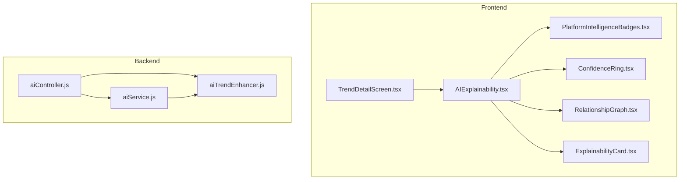

**Diagram sources**
- [AIExplainability.tsx:1-210](file://AITrendTracker7/src/components/ai/AIExplainability.tsx#L1-L210)
- [PlatformIntelligenceBadges.tsx:1-83](file://AITrendTracker7/src/components/ai/PlatformIntelligenceBadges.tsx#L1-L83)
- [ConfidenceRing.tsx:1-137](file://AITrendTracker7/src/components/ai/ConfidenceRing.tsx#L1-L137)
- [RelationshipGraph.tsx:1-170](file://AITrendTracker7/src/components/ai/RelationshipGraph.tsx#L1-L170)
- [ExplainabilityCard.tsx:1-117](file://AITrendTracker7/src/components/feed/ExplainabilityCard.tsx#L1-L117)
- [TrendDetailScreen.tsx:1-284](file://AITrendTracker7/src/navigations/screens/TrendDetailScreen.tsx#L1-L284)
- [aiService.js:1-168](file://backend/src/services/aiService.js#L1-L168)
- [aiTrendEnhancer.js:1-188](file://backend/src/services/aiTrendEnhancer.js#L1-L188)
- [aiController.js:1-47](file://backend/src/controllers/aiController.js#L1-L47)

**Section sources**
- [AIExplainability.tsx:1-210](file://AITrendTracker7/src/components/ai/AIExplainability.tsx#L1-L210)
- [aiService.js:1-168](file://backend/src/services/aiService.js#L1-L168)
- [aiTrendEnhancer.js:1-188](file://backend/src/services/aiTrendEnhancer.js#L1-L188)
- [aiController.js:1-47](file://backend/src/controllers/aiController.js#L1-L47)
- [TrendDetailScreen.tsx:1-284](file://AITrendTracker7/src/navigations/screens/TrendDetailScreen.tsx#L1-L284)

## Core Components
- AIExplainability: Collapsible card presenting confidence, platform trust matrices, anomaly/firewall indicators, and a relationship graph
- PlatformIntelligenceBadges: Renders per-platform weights and trust scores
- ConfidenceRing: Animated SVG ring indicating confidence with gradient coloring
- RelationshipGraph: Static SVG graph showing central trend and related nodes
- ExplainabilityCard: Dedicated card for AI reasoning and metrics grid
- Backend AI orchestration: Gemini-powered generation, validation, caching, and fallbacks

**Section sources**
- [AIExplainability.tsx:17-120](file://AITrendTracker7/src/components/ai/AIExplainability.tsx#L17-L120)
- [PlatformIntelligenceBadges.tsx:6-44](file://AITrendTracker7/src/components/ai/PlatformIntelligenceBadges.tsx#L6-L44)
- [ConfidenceRing.tsx:17-117](file://AITrendTracker7/src/components/ai/ConfidenceRing.tsx#L17-L117)
- [RelationshipGraph.tsx:13-162](file://AITrendTracker7/src/components/ai/RelationshipGraph.tsx#L13-L162)
- [ExplainabilityCard.tsx:8-55](file://AITrendTracker7/src/components/feed/ExplainabilityCard.tsx#L8-L55)
- [aiService.js:16-100](file://backend/src/services/aiService.js#L16-L100)
- [aiTrendEnhancer.js:26-140](file://backend/src/services/aiTrendEnhancer.js#L26-L140)

## Architecture Overview
The explainability pipeline integrates frontend UI with backend AI services:
- Frontend requests trend analysis via the AI controller
- Backend AI service validates and enriches data, caches results, and falls back safely
- Frontend renders confidence, platform trust, and reasoning in user-friendly cards

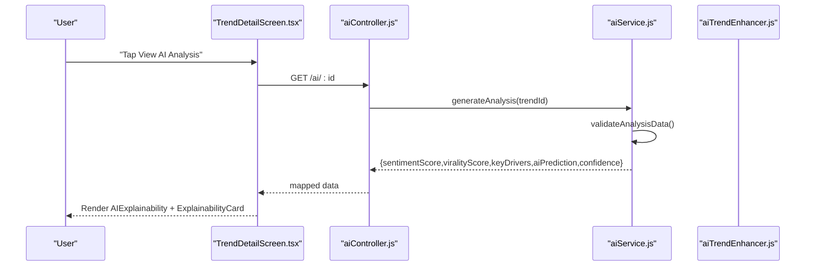

**Diagram sources**
- [TrendDetailScreen.tsx:129-144](file://AITrendTracker7/src/navigations/screens/TrendDetailScreen.tsx#L129-L144)
- [aiController.js:3-46](file://backend/src/controllers/aiController.js#L3-L46)
- [aiService.js:17-100](file://backend/src/services/aiService.js#L17-L100)
- [aiTrendEnhancer.js:35-94](file://backend/src/services/aiTrendEnhancer.js#L35-L94)

## Detailed Component Analysis

### AIExplainability Card
The AIExplainability card is a progressive disclosure component that:
- Shows a confidence ring and summary
- Expands to reveal platform trust badges, anomaly/firewall chips, and a relationship graph
- Uses animations for smooth expansion and arrow rotation

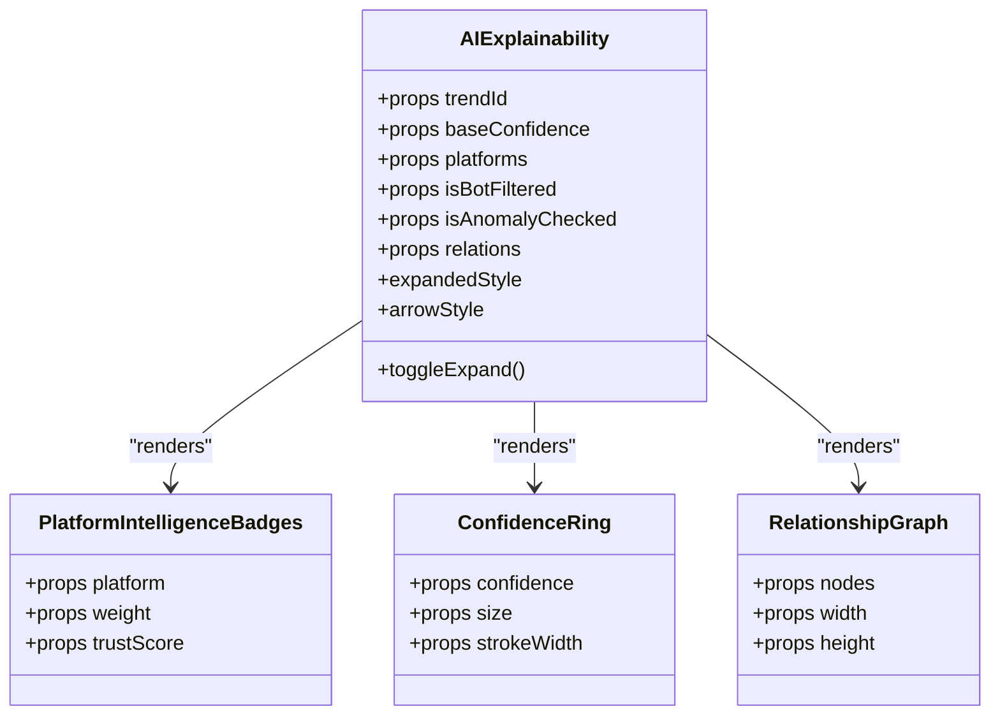

**Diagram sources**
- [AIExplainability.tsx:26-120](file://AITrendTracker7/src/components/ai/AIExplainability.tsx#L26-L120)
- [PlatformIntelligenceBadges.tsx:12-44](file://AITrendTracker7/src/components/ai/PlatformIntelligenceBadges.tsx#L12-L44)
- [ConfidenceRing.tsx:24-117](file://AITrendTracker7/src/components/ai/ConfidenceRing.tsx#L24-L117)
- [RelationshipGraph.tsx:24-162](file://AITrendTracker7/src/components/ai/RelationshipGraph.tsx#L24-L162)

**Section sources**
- [AIExplainability.tsx:26-120](file://AITrendTracker7/src/components/ai/AIExplainability.tsx#L26-L120)
- [PlatformIntelligenceBadges.tsx:12-44](file://AITrendTracker7/src/components/ai/PlatformIntelligenceBadges.tsx#L12-L44)
- [ConfidenceRing.tsx:24-117](file://AITrendTracker7/src/components/ai/ConfidenceRing.tsx#L24-L117)
- [RelationshipGraph.tsx:24-162](file://AITrendTracker7/src/components/ai/RelationshipGraph.tsx#L24-L162)

### Platform Intelligence Badges
Each badge displays:
- Platform icon
- Weight multiplier
- Trust score percentage with color-coded severity

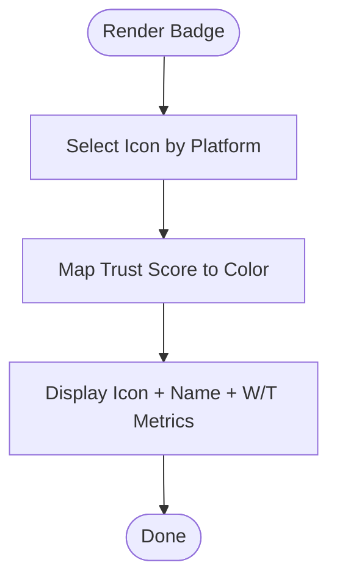

**Diagram sources**
- [PlatformIntelligenceBadges.tsx:13-44](file://AITrendTracker7/src/components/ai/PlatformIntelligenceBadges.tsx#L13-L44)

**Section sources**
- [PlatformIntelligenceBadges.tsx:12-44](file://AITrendTracker7/src/components/ai/PlatformIntelligenceBadges.tsx#L12-L44)

### Confidence Ring
The confidence ring:
- Animates to reflect current confidence
- Uses a gradient based on confidence thresholds
- Supports reduced motion and offscreen freezing

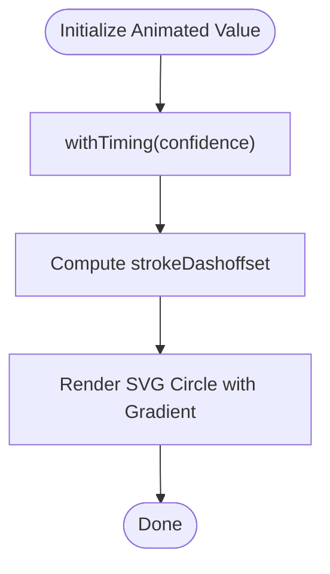

**Diagram sources**
- [ConfidenceRing.tsx:37-64](file://AITrendTracker7/src/components/ai/ConfidenceRing.tsx#L37-L64)

**Section sources**
- [ConfidenceRing.tsx:24-117](file://AITrendTracker7/src/components/ai/ConfidenceRing.tsx#L24-L117)

### Relationship Graph
The relationship graph:
- Enforces a node budget and identifies a center node
- Computes static positions using trigonometry
- Provides an accessibility summary for screen readers

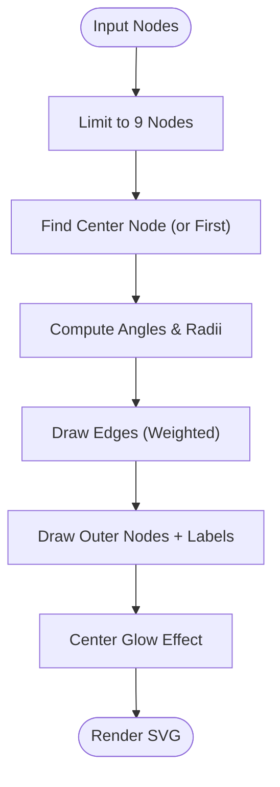

**Diagram sources**
- [RelationshipGraph.tsx:30-161](file://AITrendTracker7/src/components/ai/RelationshipGraph.tsx#L30-L161)

**Section sources**
- [RelationshipGraph.tsx:19-162](file://AITrendTracker7/src/components/ai/RelationshipGraph.tsx#L19-L162)

### ExplainabilityCard
The ExplainabilityCard presents:
- A header with an icon and title
- A reasoning paragraph
- A metrics grid with trend indicators (up/down/neutral)

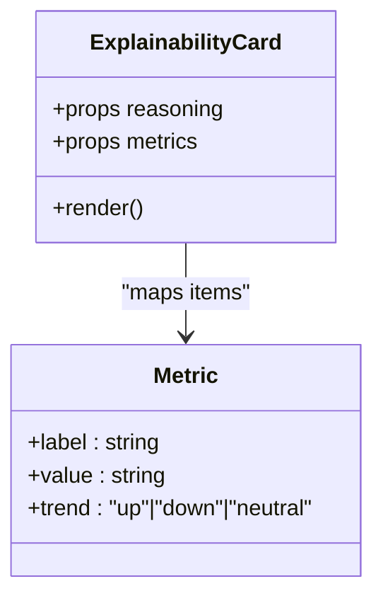

**Diagram sources**
- [ExplainabilityCard.tsx:8-55](file://AITrendTracker7/src/components/feed/ExplainabilityCard.tsx#L8-L55)

**Section sources**
- [ExplainabilityCard.tsx:19-55](file://AITrendTracker7/src/components/feed/ExplainabilityCard.tsx#L19-L55)

### Backend AI Orchestration
The backend AI service:
- Generates analysis using Gemini with a strict JSON schema prompt
- Validates and sanitizes JSON responses
- Caches results and persists to the database
- Falls back gracefully when API keys are missing

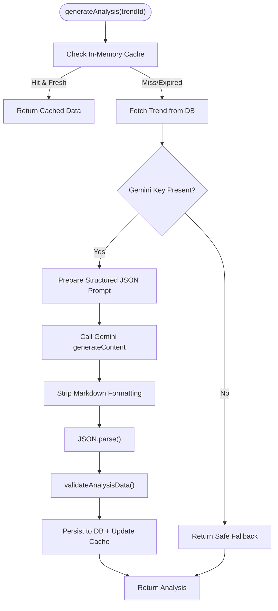

**Diagram sources**
- [aiService.js:17-100](file://backend/src/services/aiService.js#L17-L100)

**Section sources**
- [aiService.js:16-100](file://backend/src/services/aiService.js#L16-L100)

### Trend Enhancement Pipeline
The enhancer:
- Batches trends for efficient Gemini calls
- Caches results and merges back into the dataset
- Provides fallbacks when AI is unavailable

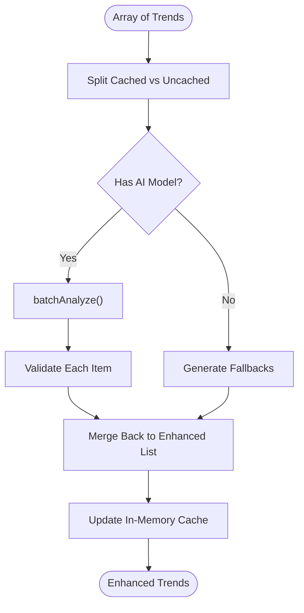

**Diagram sources**
- [aiTrendEnhancer.js:35-94](file://backend/src/services/aiTrendEnhancer.js#L35-L94)

**Section sources**
- [aiTrendEnhancer.js:26-140](file://backend/src/services/aiTrendEnhancer.js#L26-L140)

### Controller Mapping and Exposure
The controller:
- Returns pending state when analysis is not ready
- Maps backend schema to frontend schema
- Converts growth momentum to a sentiment proxy

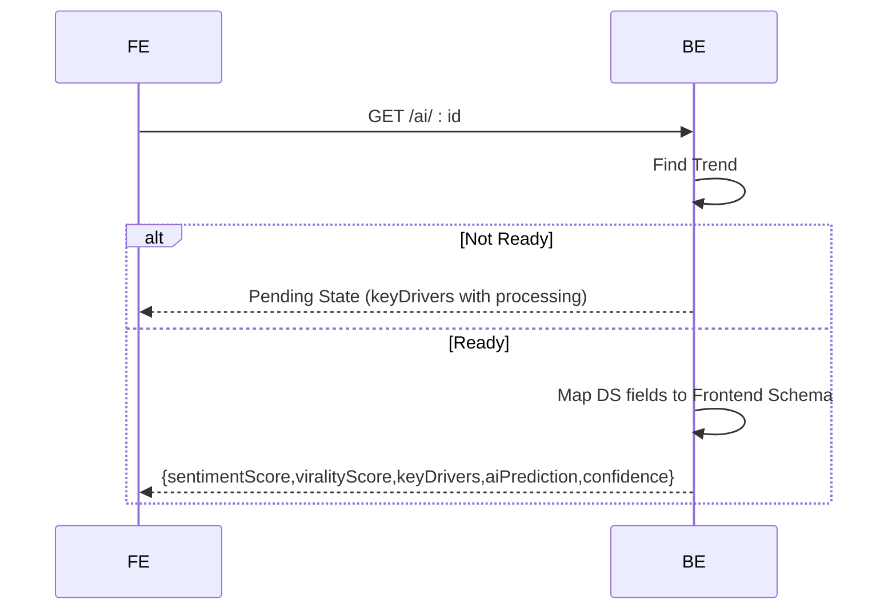

**Diagram sources**
- [aiController.js:3-46](file://backend/src/controllers/aiController.js#L3-L46)

**Section sources**
- [aiController.js:3-46](file://backend/src/controllers/aiController.js#L3-L46)

### Data Format and Validation
Explainability data format (frontend-ready):
- sentimentScore: number (proxy derived from backend)
- viralityScore: number (0–10)
- keyDrivers: array of objects with title and desc
- aiPrediction: string
- confidence: number (0–100)

Validation and normalization:
- Backend validates presence and types; caps values and limits keyDrivers
- Frontend receives sanitized data and renders confidence, badges, and reasoning

**Section sources**
- [aiService.js:92-100](file://backend/src/services/aiService.js#L92-L100)
- [aiController.js:34-42](file://backend/src/controllers/aiController.js#L34-L42)
- [ExplainabilityCard.tsx:8-17](file://AITrendTracker7/src/components/feed/ExplainabilityCard.tsx#L8-L17)

### Frontend Rendering Patterns
- AIExplainability progressively reveals platform trust, anomaly checks, and a relationship graph
- ConfidenceRing provides immediate, intuitive feedback on prediction reliability
- ExplainabilityCard surfaces reasoning and quantified metrics with trend indicators
- TrendDetailScreen links to the analysis view and triggers the UI

**Section sources**
- [AIExplainability.tsx:56-119](file://AITrendTracker7/src/components/ai/AIExplainability.tsx#L56-L119)
- [ConfidenceRing.tsx:76-116](file://AITrendTracker7/src/components/ai/ConfidenceRing.tsx#L76-L116)
- [ExplainabilityCard.tsx:19-54](file://AITrendTracker7/src/components/feed/ExplainabilityCard.tsx#L19-L54)
- [TrendDetailScreen.tsx:129-144](file://AITrendTracker7/src/navigations/screens/TrendDetailScreen.tsx#L129-L144)

### Guidelines for Presenting AI-Generated Insights
- Use ConfidenceRing to visually communicate reliability
- Present keyDrivers as concise title/description pairs
- Provide anomaly/firewall indicators to contextualize data quality
- Offer a relationship graph for high-level connections when available
- For incomplete explanations, show a neutral fallback and indicate “processing”
- When AI output is limited, present a short, honest statement and suggest rechecking later

**Section sources**
- [AIExplainability.tsx:92-114](file://AITrendTracker7/src/components/ai/AIExplainability.tsx#L92-L114)
- [aiController.js:12-24](file://backend/src/controllers/aiController.js#L12-L24)

### Transparency and Trust Building
- Clear labeling: “AI Intelligence,” “Verified Signals,” “AI Reasoning”
- Accessible summaries for graphs and badges
- Consistent confidence visualization
- Fallback behavior prevents broken experiences

**Section sources**
- [AIExplainability.tsx:67-77](file://AITrendTracker7/src/components/ai/AIExplainability.tsx#L67-L77)
- [RelationshipGraph.tsx:119-122](file://AITrendTracker7/src/components/ai/RelationshipGraph.tsx#L119-L122)
- [aiService.js:35-85](file://backend/src/services/aiService.js#L35-L85)

## Dependency Analysis
- Frontend depends on Redux trends state for context and on backend APIs for analysis
- AIExplainability composes smaller UI elements (badges, ring, graph)
- Backend services depend on environment configuration and external AI model

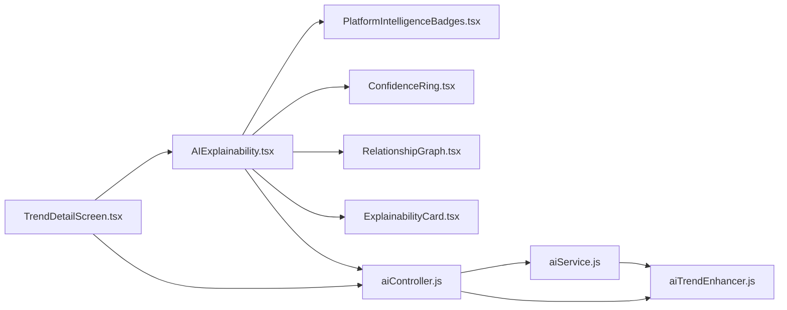

**Diagram sources**
- [TrendDetailScreen.tsx:1-284](file://AITrendTracker7/src/navigations/screens/TrendDetailScreen.tsx#L1-L284)
- [AIExplainability.tsx:1-210](file://AITrendTracker7/src/components/ai/AIExplainability.tsx#L1-L210)
- [PlatformIntelligenceBadges.tsx:1-83](file://AITrendTracker7/src/components/ai/PlatformIntelligenceBadges.tsx#L1-L83)
- [ConfidenceRing.tsx:1-137](file://AITrendTracker7/src/components/ai/ConfidenceRing.tsx#L1-L137)
- [RelationshipGraph.tsx:1-170](file://AITrendTracker7/src/components/ai/RelationshipGraph.tsx#L1-L170)
- [ExplainabilityCard.tsx:1-117](file://AITrendTracker7/src/components/feed/ExplainabilityCard.tsx#L1-L117)
- [aiController.js:1-47](file://backend/src/controllers/aiController.js#L1-L47)
- [aiService.js:1-168](file://backend/src/services/aiService.js#L1-L168)
- [aiTrendEnhancer.js:1-188](file://backend/src/services/aiTrendEnhancer.js#L1-L188)

**Section sources**
- [trendsSlice.ts:1-80](file://AITrendTracker7/src/store/slices/trendsSlice.ts#L1-L80)
- [aiNormalization.ts:1-38](file://AITrendTracker7/src/utils/aiNormalization.ts#L1-L38)

## Performance Considerations
- Frontend
  - Use memoization for components to avoid unnecessary re-renders
  - Lazy load relationship graph content until expanded
  - Keep node budgets low for SVG graphs to maintain interactivity
- Backend
  - In-memory caching reduces API calls and latency
  - Batch enrichment minimizes overhead for multiple trends
  - Reduced motion and offscreen freezing prevent wasted animations

[No sources needed since this section provides general guidance]

## Troubleshooting Guide
- Missing API key
  - Symptom: Fallback responses and warnings in logs
  - Action: Verify environment configuration and retry
- Invalid or hallucinated JSON
  - Symptom: Sanitized defaults in frontend
  - Action: Review prompt and validation logic
- Pending analysis
  - Symptom: Processing message in keyDrivers
  - Action: Trigger refresh after background processing completes
- Accessibility issues
  - Symptom: Missing graph descriptions
  - Action: Ensure accessibility labels are present for SVG graphs

**Section sources**
- [aiService.js:35-85](file://backend/src/services/aiService.js#L35-L85)
- [aiController.js:12-24](file://backend/src/controllers/aiController.js#L12-L24)
- [RelationshipGraph.tsx:119-122](file://AITrendTracker7/src/components/ai/RelationshipGraph.tsx#L119-L122)

## Conclusion
AITrendTracker’s explainability features combine structured AI outputs with transparent, user-friendly UI:
- Confidence visualization, platform trust badges, and relationship graphs help users understand predictions
- Strict validation and fallbacks ensure robustness
- Clear rendering patterns and accessibility support improve trust and usability