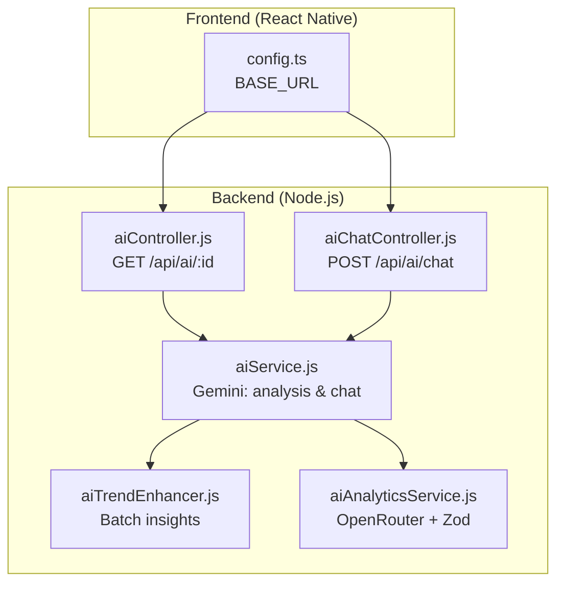
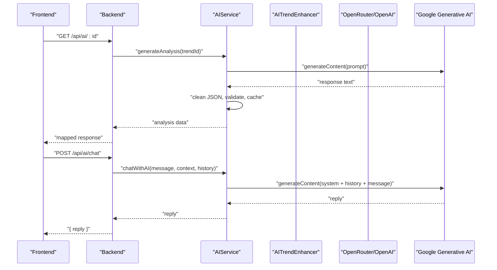
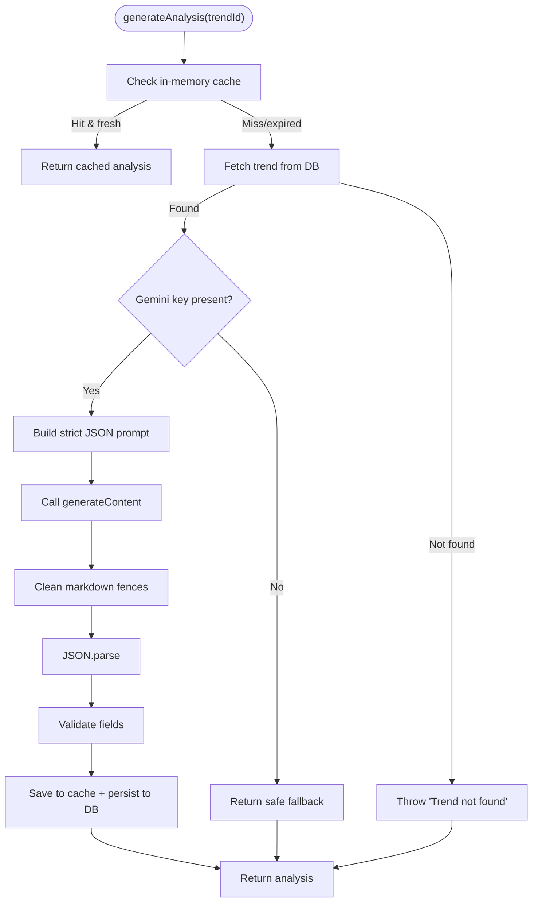
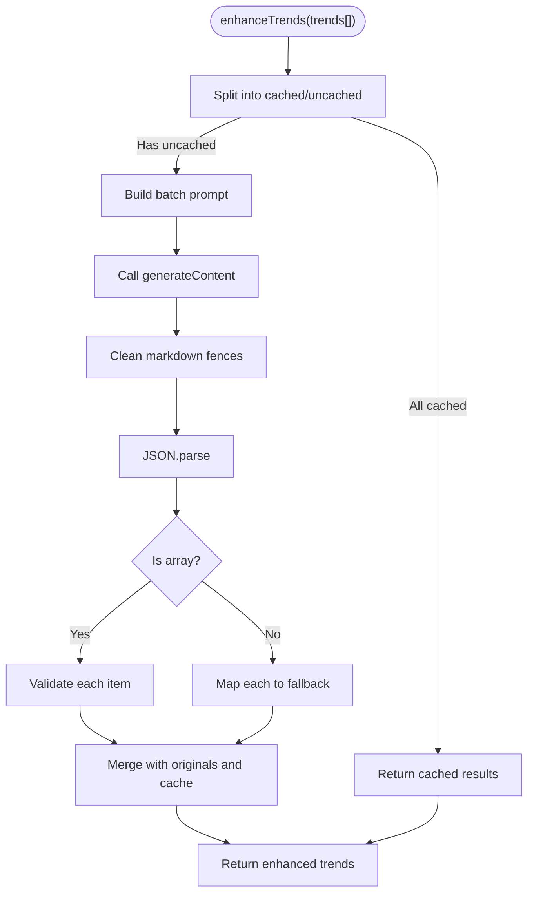
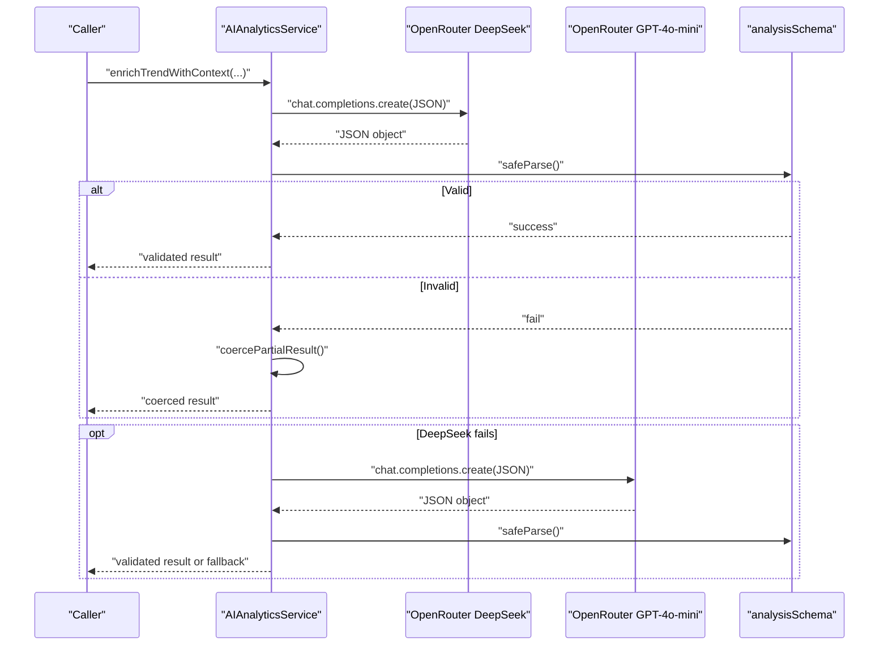
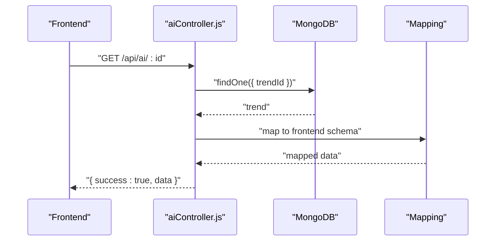
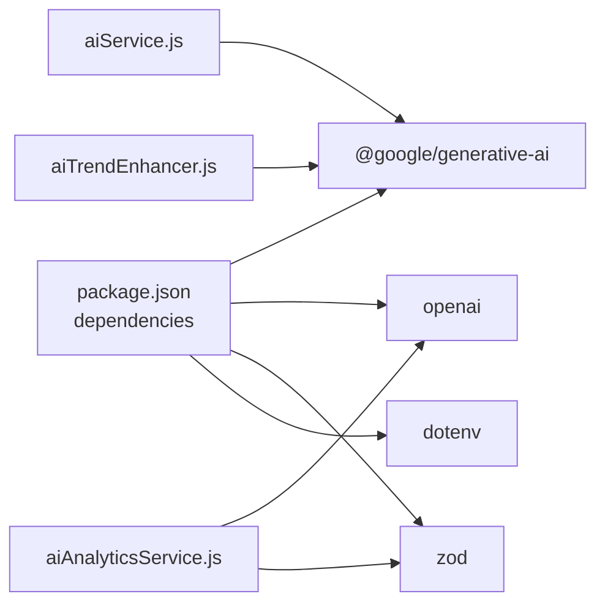

# External API Integrations

<cite>
**Referenced Files in This Document**
- [aiService.js](file://backend/src/services/aiService.js)
- [aiTrendEnhancer.js](file://backend/src/services/aiTrendEnhancer.js)
- [aiAnalyticsService.js](file://backend/src/services/aiAnalyticsService.js)
- [aiController.js](file://backend/src/controllers/aiController.js)
- [aiChatController.js](file://backend/src/controllers/aiChatController.js)
- [config.ts](file://AITrendTracker7/src/utils/config.ts)
- [package.json](file://backend/package.json)
- [firebaseAdmin.js](file://backend/src/utils/firebaseAdmin.js)
</cite>

## Table of Contents
1. [Introduction](#introduction)
2. [Project Structure](#project-structure)
3. [Core Components](#core-components)
4. [Architecture Overview](#architecture-overview)
5. [Detailed Component Analysis](#detailed-component-analysis)
6. [Dependency Analysis](#dependency-analysis)
7. [Performance Considerations](#performance-considerations)
8. [Troubleshooting Guide](#troubleshooting-guide)
9. [Conclusion](#conclusion)
10. [Appendices](#appendices)

## Introduction
This document explains AITrendTracker’s external API integration architecture with a focus on Google Generative AI (Gemini) and complementary OpenAI/OpenRouter pathways. It covers model selection, API key management, rate limiting strategies, initialization patterns, graceful fallbacks, error handling, response parsing and validation, configuration management, cost optimization, monitoring, conversational context handling, and security considerations for API key storage and transmission.

## Project Structure
The AI integrations span backend services and controllers, with frontend configuration pointing to the backend server. The backend integrates:
- Gemini (Google Generative AI) for trend analysis and conversational chat
- OpenAI via OpenRouter for robust enrichment with schema validation
- Controllers exposing endpoints for analysis and chat
- Environment configuration for base URLs and API keys

**Diagram sources**
- [config.ts:1-8](file://AITrendTracker7/src/utils/config.ts#L1-L8)
- [aiController.js:1-47](file://backend/src/controllers/aiController.js#L1-L47)
- [aiChatController.js:1-22](file://backend/src/controllers/aiChatController.js#L1-L22)
- [aiService.js:1-168](file://backend/src/services/aiService.js#L1-L168)
- [aiTrendEnhancer.js:1-188](file://backend/src/services/aiTrendEnhancer.js#L1-L188)
- [aiAnalyticsService.js:1-203](file://backend/src/services/aiAnalyticsService.js#L1-L203)

**Section sources**
- [config.ts:1-8](file://AITrendTracker7/src/utils/config.ts#L1-L8)
- [package.json:1-45](file://backend/package.json#L1-L45)

## Core Components
- Gemini-based AIService: Provides trend analysis and conversational chat using gemini-2.5-flash. Implements in-memory caching, JSON cleaning, validation, and deterministic fallbacks when API keys are missing or rate-limited.
- AITrendEnhancer: Batch-enriches trends with aiSummary, category, and prediction using a single Gemini call and a 1-hour TTL cache keyed by normalized title hashes.
- AIAnalyticsService: Enriches trends with OpenRouter via DeepSeek and falls back to GPT-4o-mini or deterministic fallback, enforcing strict schema validation with Zod.
- Controllers: Expose endpoints for retrieving AI analysis and for chat interactions.

**Section sources**
- [aiService.js:1-168](file://backend/src/services/aiService.js#L1-L168)
- [aiTrendEnhancer.js:1-188](file://backend/src/services/aiTrendEnhancer.js#L1-L188)
- [aiAnalyticsService.js:1-203](file://backend/src/services/aiAnalyticsService.js#L1-L203)
- [aiController.js:1-47](file://backend/src/controllers/aiController.js#L1-L47)
- [aiChatController.js:1-22](file://backend/src/controllers/aiChatController.js#L1-L22)

## Architecture Overview
The system initializes external clients conditionally based on environment variables. Gemini is used for on-demand analysis and chat, while batch enrichment leverages a single Gemini call. OpenRouter is used for robust enrichment with schema enforcement. Controllers route requests to services, which handle caching, validation, and fallbacks.

**Diagram sources**
- [aiController.js:1-47](file://backend/src/controllers/aiController.js#L1-L47)
- [aiChatController.js:1-22](file://backend/src/controllers/aiChatController.js#L1-L22)
- [aiService.js:16-164](file://backend/src/services/aiService.js#L16-L164)

## Detailed Component Analysis

### AIService (Gemini)
- Initialization pattern: Creates GoogleGenerativeAI client and selects gemini-2.5-flash only when GEMINI_API_KEY is present, preventing startup crashes.
- Trend analysis:
  - Checks in-memory cache keyed by trendId with 30-minute TTL.
  - Fetches trend from database and builds a strict JSON-returning prompt.
  - Cleans markdown fences from responses, parses JSON, validates fields, caches, and persists to DB.
  - Returns deterministic fallback on API absence or errors.
- Chat:
  - Constructs a Hinglish-friendly system prompt with optional trend context and conversation history.
  - Detects rate-limit errors (status 429) and returns user-friendly messages.
  - Returns generic fallback on other errors.

**Diagram sources**
- [aiService.js:16-100](file://backend/src/services/aiService.js#L16-L100)

**Section sources**
- [aiService.js:1-168](file://backend/src/services/aiService.js#L1-L168)

### AITrendEnhancer (Batch Insights)
- Initialization pattern: Initializes Gemini client only when GEMINI_API_KEY is present.
- Batch processing:
  - Splits trends into cached and uncached sets using a normalized title-hash cache with 1-hour TTL.
  - Builds a single prompt enumerating all uncached trends and requests a JSON array.
  - Validates the returned array and applies deterministic fallbacks for invalid entries.
  - Merges results back into original positions and updates cache.
- Fallback logic:
  - Generates aiSummary and category heuristically based on keywords.
  - Prediction derived from trendScore thresholds.

**Diagram sources**
- [aiTrendEnhancer.js:26-140](file://backend/src/services/aiTrendEnhancer.js#L26-L140)

**Section sources**
- [aiTrendEnhancer.js:1-188](file://backend/src/services/aiTrendEnhancer.js#L1-L188)

### AIAnalyticsService (OpenRouter + Zod)
- Initialization pattern: Creates OpenAI client with OpenRouter base URL only when OPENROUTER_API_KEY is present.
- Enrichment pipeline:
  - Attempts DeepSeek via OpenRouter first.
  - On failure, attempts GPT-4o-mini fallback.
  - On total failure, returns deterministic fallback object validated by analysisSchema.
- Validation:
  - Strips markdown fences, parses JSON, validates with Zod schema.
  - On validation failure, coerces partial results into a safe object.

**Diagram sources**
- [aiAnalyticsService.js:24-96](file://backend/src/services/aiAnalyticsService.js#L24-L96)

**Section sources**
- [aiAnalyticsService.js:1-203](file://backend/src/services/aiAnalyticsService.js#L1-L203)

### Controllers (Endpoints)
- GET /api/ai/:id: Returns either pending state or mapped analysis data from the DB, converting growth momentum/alerts to a sentiment proxy.
- POST /api/ai/chat: Accepts message, trendContext, and history; delegates to AIService.chatWithAI and returns reply.

**Diagram sources**
- [aiController.js:1-47](file://backend/src/controllers/aiController.js#L1-L47)

**Section sources**
- [aiController.js:1-47](file://backend/src/controllers/aiController.js#L1-L47)
- [aiChatController.js:1-22](file://backend/src/controllers/aiChatController.js#L1-L22)

## Dependency Analysis
- External libraries:
  - @google/generative-ai for Gemini integration
  - openai for OpenRouter/OpenAI integration
  - zod for strict schema validation
  - dotenv for environment variable loading
- Internal dependencies:
  - AIService depends on Trend model and Gemini client
  - AITrendEnhancer depends on Gemini client and uses a lightweight cache
  - AIAnalyticsService depends on OpenAI client and analysisSchema

**Diagram sources**
- [package.json:14-38](file://backend/package.json#L14-L38)
- [aiService.js:1](file://backend/src/services/aiService.js#L1)
- [aiTrendEnhancer.js:13](file://backend/src/services/aiTrendEnhancer.js#L13)
- [aiAnalyticsService.js:12](file://backend/src/services/aiAnalyticsService.js#L12)

**Section sources**
- [package.json:1-45](file://backend/package.json#L1-L45)

## Performance Considerations
- Caching:
  - AIService: 30-minute TTL cache per trendId for analysis results.
  - AITrendEnhancer: 1-hour TTL cache keyed by normalized title for batch insights.
- Batch processing:
  - Single Gemini call for multiple trends reduces API overhead and latency.
- Rate limiting:
  - AIService detects 429 errors and returns a user-friendly message; consider adding exponential backoff or Redis-based rate limiter at the controller level.
- Cost optimization:
  - Use deterministic fallbacks when API keys are absent to avoid unnecessary calls.
  - Prefer batch calls for bulk operations.
  - Monitor cache hit ratios and adjust TTLs accordingly.
- Monitoring:
  - Log cache hits/misses and API call outcomes.
  - Track error rates and fallback triggers.

[No sources needed since this section provides general guidance]

## Troubleshooting Guide
- Missing API keys:
  - AIService and AITrendEnhancer initialize clients only when keys are present; otherwise, deterministic fallbacks are used.
- Rate limiting:
  - AIService recognizes 429 errors and returns a friendly message advising the user to retry after a minute.
- JSON parsing/validation failures:
  - AIService cleans markdown fences and validates fields; returns safe defaults on error.
  - AIAnalyticsService strips fences, validates with Zod, and coerces partial results or falls back deterministically.
- Controller-level errors:
  - aiController.js returns pending state when analysis is not ready; otherwise maps DeepSeek schema to frontend schema.
  - aiChatController.js validates presence of message and returns standardized error responses.

**Section sources**
- [aiService.js:35-86](file://backend/src/services/aiService.js#L35-L86)
- [aiService.js:150-164](file://backend/src/services/aiService.js#L150-L164)
- [aiAnalyticsService.js:75-96](file://backend/src/services/aiAnalyticsService.js#L75-L96)
- [aiController.js:3-24](file://backend/src/controllers/aiController.js#L3-L24)
- [aiChatController.js:3-21](file://backend/src/controllers/aiChatController.js#L3-L21)

## Conclusion
AITrendTracker’s external API integration architecture combines Gemini for on-demand analysis and chat, batch enrichment via a single Gemini call, and robust OpenRouter/OpenAI enrichment with strict schema validation. The system emphasizes resilience through caching, deterministic fallbacks, and careful error handling, while maintaining cost-consciousness and operational visibility.

[No sources needed since this section summarizes without analyzing specific files]

## Appendices

### Configuration Management
- Frontend base URL:
  - config.ts defines BASE_URL for development and production, enabling seamless routing to the backend server.
- Environment variables:
  - GEMINI_API_KEY: Required for Gemini client initialization.
  - OPENROUTER_API_KEY: Required for OpenRouter/OpenAI client initialization.
  - Ensure environment-specific .env files are loaded via dotenv.

**Section sources**
- [config.ts:1-8](file://AITrendTracker7/src/utils/config.ts#L1-L8)
- [package.json:23](file://backend/package.json#L23)
- [aiService.js:4-10](file://backend/src/services/aiService.js#L4-L10)
- [aiAnalyticsService.js:16-22](file://backend/src/services/aiAnalyticsService.js#L16-L22)

### Security Considerations
- API key storage:
  - Store GEMINI_API_KEY and OPENROUTER_API_KEY in environment variables; avoid committing secrets to source control.
  - Use CI/CD secret management and restrict access to deployment environments.
- Transmission:
  - Keep API keys server-side; do not expose them to the frontend.
  - Use HTTPS in production and secure headers via Helmet.
- Firebase Admin:
  - Initialize Firebase Admin securely with service account credentials stored outside the repository.

**Section sources**
- [firebaseAdmin.js:1-23](file://backend/src/utils/firebaseAdmin.js#L1-L23)
- [package.json:28](file://backend/package.json#L28)