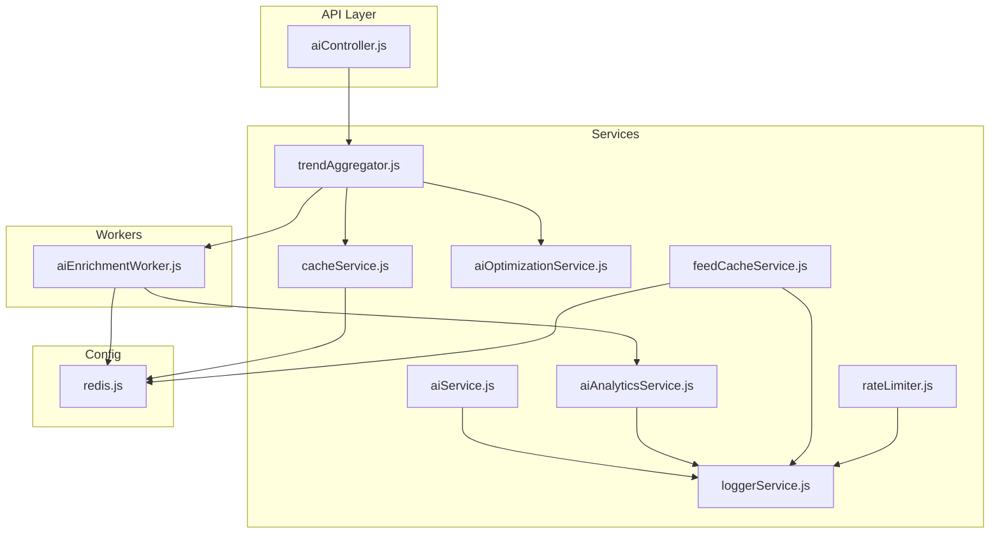
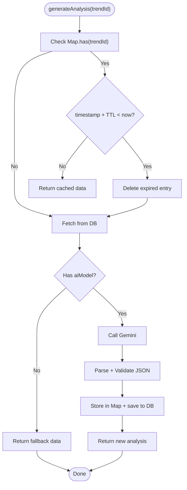
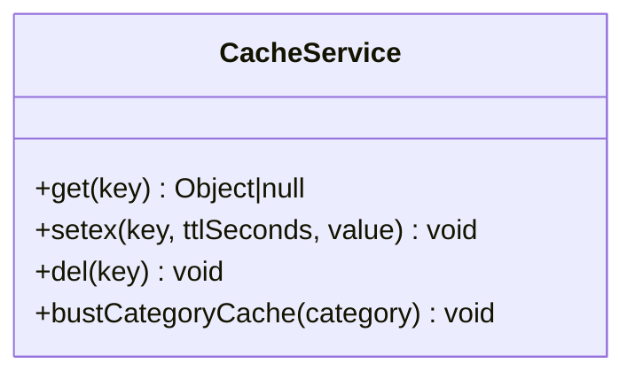
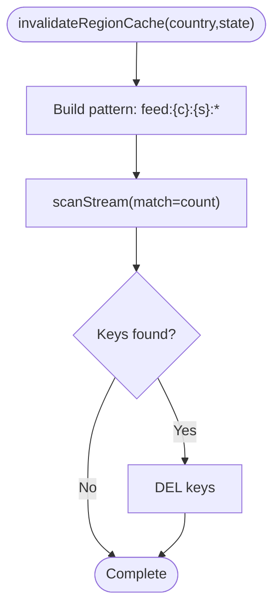
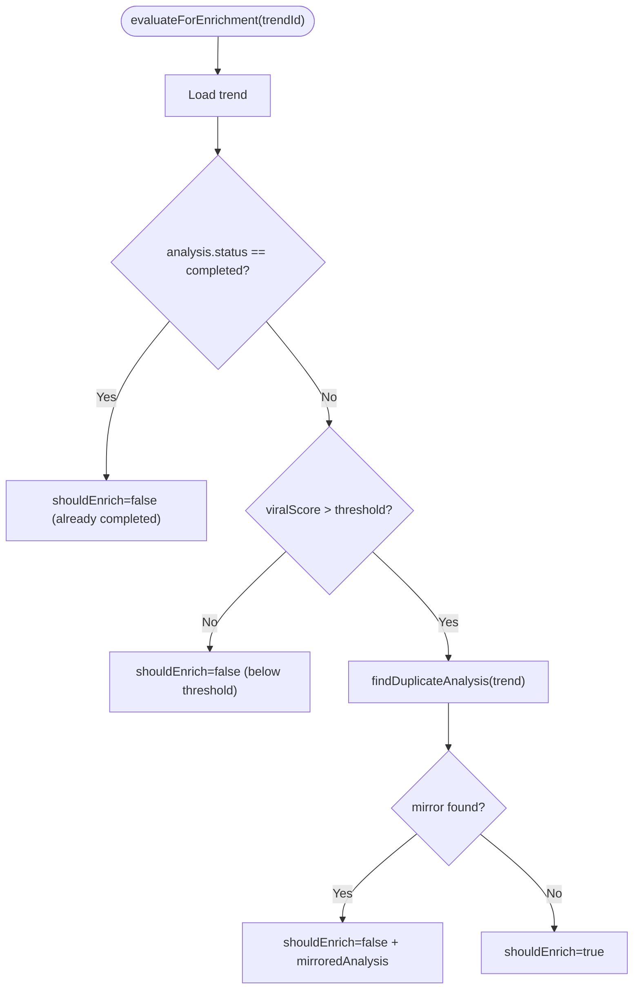
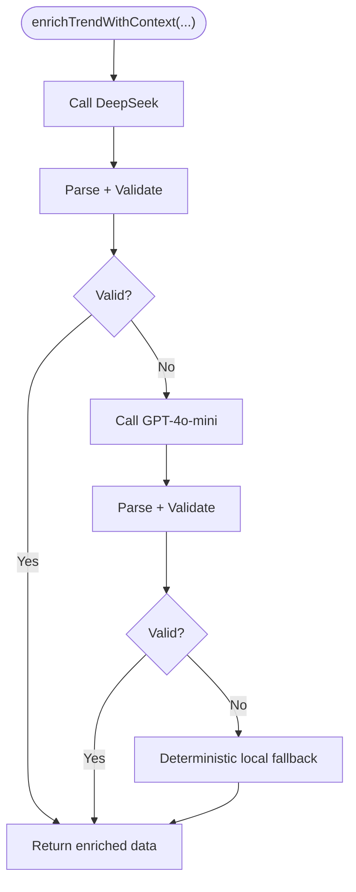
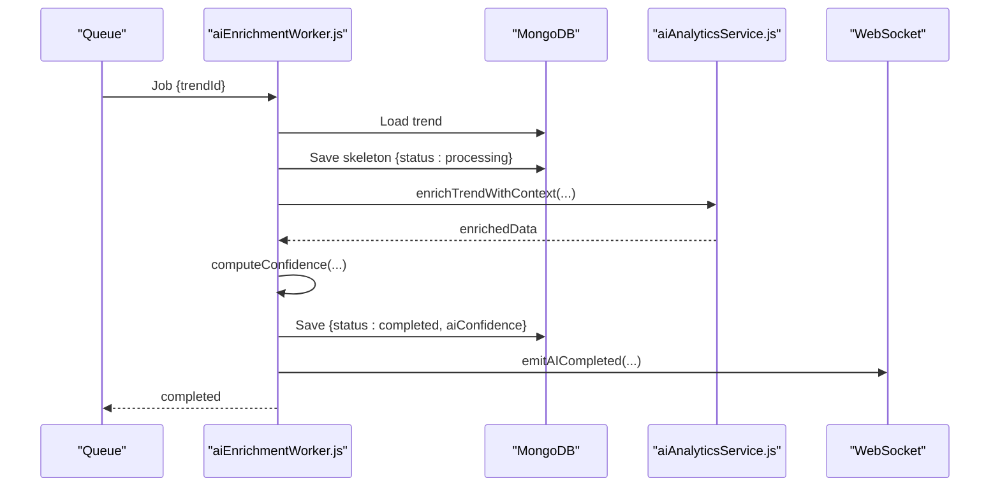
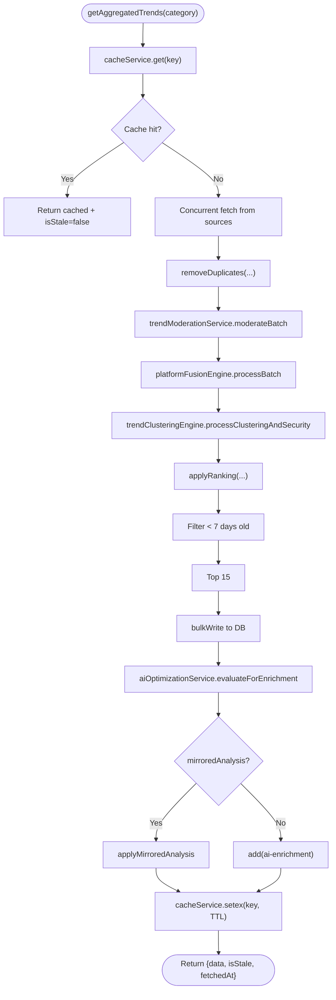
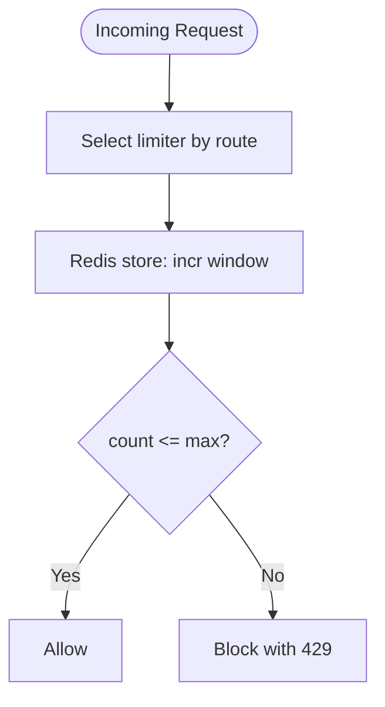
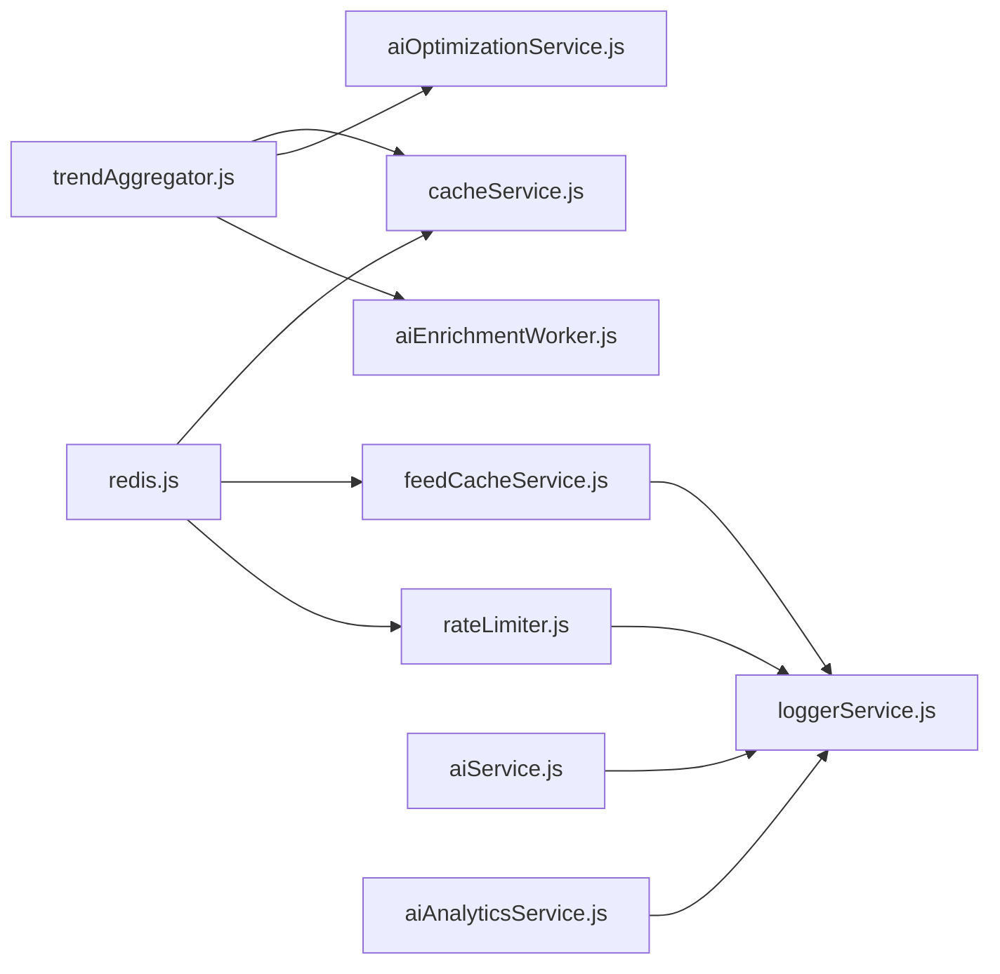

# Performance Optimization

<cite>
**Referenced Files in This Document**
- [aiOptimizationService.js](file://backend/src/services/aiOptimizationService.js)
- [aiService.js](file://backend/src/services/aiService.js)
- [cacheService.js](file://backend/src/services/cacheService.js)
- [feedCacheService.js](file://backend/src/services/feedCacheService.js)
- [redis.js](file://backend/src/config/redis.js)
- [aiAnalyticsService.js](file://backend/src/services/aiAnalyticsService.js)
- [aiEnrichmentWorker.js](file://backend/src/queues/workers/aiEnrichmentWorker.js)
- [trendAggregator.js](file://backend/src/services/trendAggregator.js)
- [rateLimiter.js](file://backend/src/middlewares/rateLimiter.js)
- [loggerService.js](file://backend/src/services/loggerService.js)
- [aiController.js](file://backend/src/controllers/aiController.js)
- [package.json](file://backend/package.json)
</cite>

## Table of Contents
1. [Introduction](#introduction)
2. [Project Structure](#project-structure)
3. [Core Components](#core-components)
4. [Architecture Overview](#architecture-overview)
5. [Detailed Component Analysis](#detailed-component-analysis)
6. [Dependency Analysis](#dependency-analysis)
7. [Performance Considerations](#performance-considerations)
8. [Troubleshooting Guide](#troubleshooting-guide)
9. [Conclusion](#conclusion)
10. [Appendices](#appendices)

## Introduction
This document details AITrendTracker’s AI/ML performance optimization strategies across caching, cost control, request processing, resource allocation, monitoring, and resilience. It explains in-memory caching with TTL management, Redis-based caching and granular invalidation, AI enrichment gating and mirroring, background queue processing, adaptive feed personalization, rate limiting, and logging. It also outlines benchmarking, latency measurement, throughput optimization, and operational health checks to maintain responsiveness and cost-efficiency.

## Project Structure
The backend implements performance-sensitive logic primarily in:
- Services: caching, AI generation, analytics, enrichment, feed personalization, rate limiting, logging
- Workers: background AI enrichment pipeline
- Controllers: API endpoints for AI analysis
- Aggregation: trend ingestion, deduplication, ranking, and cache orchestration



**Diagram sources**
- [aiController.js](file://backend/src/controllers/aiController.js)
- [trendAggregator.js](file://backend/src/services/trendAggregator.js)
- [cacheService.js](file://backend/src/services/cacheService.js)
- [aiAnalyticsService.js](file://backend/src/services/aiAnalyticsService.js)
- [aiService.js](file://backend/src/services/aiService.js)
- [aiOptimizationService.js](file://backend/src/services/aiOptimizationService.js)
- [feedCacheService.js](file://backend/src/services/feedCacheService.js)
- [rateLimiter.js](file://backend/src/middlewares/rateLimiter.js)
- [loggerService.js](file://backend/src/services/loggerService.js)
- [aiEnrichmentWorker.js](file://backend/src/queues/workers/aiEnrichmentWorker.js)
- [redis.js](file://backend/src/config/redis.js)

**Section sources**
- [aiController.js](file://backend/src/controllers/aiController.js)
- [trendAggregator.js](file://backend/src/services/trendAggregator.js)
- [cacheService.js](file://backend/src/services/cacheService.js)
- [aiAnalyticsService.js](file://backend/src/services/aiAnalyticsService.js)
- [aiService.js](file://backend/src/services/aiService.js)
- [aiOptimizationService.js](file://backend/src/services/aiOptimizationService.js)
- [feedCacheService.js](file://backend/src/services/feedCacheService.js)
- [rateLimiter.js](file://backend/src/middlewares/rateLimiter.js)
- [loggerService.js](file://backend/src/services/loggerService.js)
- [aiEnrichmentWorker.js](file://backend/src/queues/workers/aiEnrichmentWorker.js)
- [redis.js](file://backend/src/config/redis.js)

## Core Components
- In-memory AI analysis cache with TTL to reduce repeated LLM calls for the same trend.
- Redis-based caching for feed and trend lists with TTL and granular invalidation.
- AI optimization service that gates enrichment via viral-score thresholds and keyword overlap mirroring to avoid redundant LLM usage.
- Background AI enrichment worker with concurrency and confidence computation.
- Rate limiting middleware synchronized via Redis to protect resources and control costs.
- Logging service for observability and incident triage.

**Section sources**
- [aiService.js](file://backend/src/services/aiService.js)
- [cacheService.js](file://backend/src/services/cacheService.js)
- [feedCacheService.js](file://backend/src/services/feedCacheService.js)
- [aiOptimizationService.js](file://backend/src/services/aiOptimizationService.js)
- [aiEnrichmentWorker.js](file://backend/src/queues/workers/aiEnrichmentWorker.js)
- [rateLimiter.js](file://backend/src/middlewares/rateLimiter.js)
- [loggerService.js](file://backend/src/services/loggerService.js)

## Architecture Overview
AITrendTracker separates concerns across ingestion, caching, enrichment, and delivery:
- Ingestion and aggregation fetch from multiple sources, deduplicate, rank, and cache results.
- Cost-aware enrichment evaluates whether to enqueue AI analysis or mirror prior results.
- Background workers process enrichment with structured confidence computation and emit live updates.
- Frontend receives cached or near-real-time data with graceful fallbacks.

```mermaid
sequenceDiagram
participant Client as "Client"
participant Ctrl as "aiController.js"
participant Agg as "trendAggregator.js"
participant Cache as "cacheService.js"
participant Opt as "aiOptimizationService.js"
participant Q as "aiEnrichmentWorker.js"
participant AI as "aiAnalyticsService.js"
Client->>Ctrl : GET /ai/analysis/ : id
Ctrl->>Agg : getAggregatedTrends(category)
Agg->>Cache : get(key)
alt Cache hit
Cache-->>Agg : trends[]
Agg-->>Ctrl : trends[]
else Cache miss
Agg->>Agg : fetch + dedupe + rank
Agg->>Cache : setex(key, duration, trends)
Agg->>Opt : evaluateForEnrichment(trendId)
opt Should mirror
Opt-->>Agg : mirroredAnalysis
Agg->>Agg : applyMirroredAnalysis(trendId, mirroredAnalysis)
opt Should enqueue
Agg->>Q : add(enrich-trend){trendId}
end
Agg-->>Ctrl : trends[]
end
Ctrl-->>Client : analysis (pending or mapped)
```

**Diagram sources**
- [aiController.js](file://backend/src/controllers/aiController.js)
- [trendAggregator.js](file://backend/src/services/trendAggregator.js)
- [cacheService.js](file://backend/src/services/cacheService.js)
- [aiOptimizationService.js](file://backend/src/services/aiOptimizationService.js)
- [aiEnrichmentWorker.js](file://backend/src/queues/workers/aiEnrichmentWorker.js)
- [aiAnalyticsService.js](file://backend/src/services/aiAnalyticsService.js)

## Detailed Component Analysis

### In-Memory AI Analysis Cache (TTL)
- Maintains a Map keyed by trendId with { data, timestamp }.
- TTL is 30 minutes; expired entries are evicted before use.
- On success, results are stored and persisted to DB; on failure, a safe fallback is returned.



**Diagram sources**
- [aiService.js](file://backend/src/services/aiService.js)

**Section sources**
- [aiService.js](file://backend/src/services/aiService.js)

### Redis Cache Service (TTL, Invalidation, Category Bust)
- Centralized Redis client for caching and counters.
- Operations: get, setex with TTL, delete single key, and category-wide bust.
- Robust error logging and graceful fallback to database when Redis fails.



**Diagram sources**
- [cacheService.js](file://backend/src/services/cacheService.js)

**Section sources**
- [cacheService.js](file://backend/src/services/cacheService.js)
- [redis.js](file://backend/src/config/redis.js)

### Feed Cache Service (Multi-Tenant Keys, Granular Invalidation, Adaptive Diversity)
- Strict multi-tenant cache keys: feed:{country}:{state}:{scope}:{locale}.
- TTL of 10 minutes for feed data; diversity overrides persisted for 24 hours.
- Invalidation uses Redis scan stream to purge region-scoped keys safely.
- Tracks user skip events to adapt feed interleaving ratios and reduce global context when users skip frequently.



**Diagram sources**
- [feedCacheService.js](file://backend/src/services/feedCacheService.js)

**Section sources**
- [feedCacheService.js](file://backend/src/services/feedCacheService.js)
- [redis.js](file://backend/src/config/redis.js)

### AI Optimization Service (Cost Gate + Duplicate Mirroring)
- Cost gate: only enqueue enrichment if viralScore exceeds threshold.
- Duplicate detection: compare normalized keywords of recent enriched trends; if overlap > threshold, mirror existing analysis to avoid redundant LLM calls.
- Persists mirrored analysis to DB and logs decisions.



**Diagram sources**
- [aiOptimizationService.js](file://backend/src/services/aiOptimizationService.js)

**Section sources**
- [aiOptimizationService.js](file://backend/src/services/aiOptimizationService.js)

### AI Analytics Service (Validation + Fallback)
- Calls OpenAI-compatible endpoint via OpenRouter with JSON response format.
- Two-phase validation: JSON parsing and Zod schema validation; coerces partial results when possible.
- Three-tier fallback: DeepSeek, GPT-4o-mini, deterministic local fallback.



**Diagram sources**
- [aiAnalyticsService.js](file://backend/src/services/aiAnalyticsService.js)

**Section sources**
- [aiAnalyticsService.js](file://backend/src/services/aiAnalyticsService.js)

### AI Enrichment Worker (Concurrency, Confidence, Events)
- Processes ai-enrichment queue with concurrency 3.
- Writes a skeletal processing state immediately, then persists enriched analysis and computes AI confidence.
- Emits WebSocket events for live UI updates and triggers alerts for spikes.



**Diagram sources**
- [aiEnrichmentWorker.js](file://backend/src/queues/workers/aiEnrichmentWorker.js)
- [aiAnalyticsService.js](file://backend/src/services/aiAnalyticsService.js)

**Section sources**
- [aiEnrichmentWorker.js](file://backend/src/queues/workers/aiEnrichmentWorker.js)

### Trend Aggregation Pipeline (Caching, Deduplication, Ranking, Queue Gating)
- Concurrent fetch from multiple sources with fault tolerance.
- Deduplication via title word overlap; anti-spam moderation; cross-platform fusion; clustering and anomaly quarantine.
- Ranking by recency and engagement; filters trends older than 7 days; limits to top 15.
- Upserts to DB, enqueues enrichment based on AI optimization evaluation, caches results, and triggers off-main-thread tasks.



**Diagram sources**
- [trendAggregator.js](file://backend/src/services/trendAggregator.js)
- [cacheService.js](file://backend/src/services/cacheService.js)
- [aiOptimizationService.js](file://backend/src/services/aiOptimizationService.js)

**Section sources**
- [trendAggregator.js](file://backend/src/services/trendAggregator.js)

### Rate Limiting (Distributed via Redis)
- Global API limiter: 100 per 15 minutes per IP.
- Auth limiter: 20 per 15 minutes per IP.
- Heavy endpoint limiter: 10 per 5 minutes per IP.
- Uses Redis-backed stores for multi-instance synchronization and logs blocked requests.



**Diagram sources**
- [rateLimiter.js](file://backend/src/middlewares/rateLimiter.js)

**Section sources**
- [rateLimiter.js](file://backend/src/middlewares/rateLimiter.js)

### Logging and Observability
- Winston-based logger with daily rotation and console transport outside production.
- Extensive logging in cache, feed cache, rate limiter, and AI services for debugging and monitoring.

**Section sources**
- [loggerService.js](file://backend/src/services/loggerService.js)
- [cacheService.js](file://backend/src/services/cacheService.js)
- [feedCacheService.js](file://backend/src/services/feedCacheService.js)
- [rateLimiter.js](file://backend/src/middlewares/rateLimiter.js)
- [aiAnalyticsService.js](file://backend/src/services/aiAnalyticsService.js)
- [aiEnrichmentWorker.js](file://backend/src/queues/workers/aiEnrichmentWorker.js)

## Dependency Analysis
- Redis is a shared dependency for caching, rate limiting, and BullMQ; the dedicated client avoids conflicts with BullMQ’s retry policy.
- AI enrichment relies on external LLM providers with validation and fallbacks; internal services depend on MongoDB for persistence.
- Trend aggregation orchestrates multiple services and queues; it is central to performance because it controls cache freshness and enrichment workload.



**Diagram sources**
- [redis.js](file://backend/src/config/redis.js)
- [cacheService.js](file://backend/src/services/cacheService.js)
- [feedCacheService.js](file://backend/src/services/feedCacheService.js)
- [rateLimiter.js](file://backend/src/middlewares/rateLimiter.js)
- [trendAggregator.js](file://backend/src/services/trendAggregator.js)
- [aiOptimizationService.js](file://backend/src/services/aiOptimizationService.js)
- [aiEnrichmentWorker.js](file://backend/src/queues/workers/aiEnrichmentWorker.js)
- [aiService.js](file://backend/src/services/aiService.js)
- [aiAnalyticsService.js](file://backend/src/services/aiAnalyticsService.js)
- [loggerService.js](file://backend/src/services/loggerService.js)

**Section sources**
- [package.json](file://backend/package.json)
- [redis.js](file://backend/src/config/redis.js)

## Performance Considerations
- Caching
  - In-memory cache reduces repeated LLM calls; TTL prevents stale data.
  - Redis cache for feeds and trend lists improves cold-start performance and reduces upstream API pressure.
  - Granular invalidation avoids broad cache wipes; category busts help refresh targeted segments.
- Cost Optimization
  - Viral-score gating ensures enrichment only for promising trends.
  - Keyword overlap mirroring eliminates redundant LLM calls.
  - Deterministic fallbacks avoid LLM costs when keys are missing.
- Throughput and Concurrency
  - Background worker concurrency 3 balances resource usage and latency.
  - Batch processing in aggregation reduces per-request overhead.
- Resilience
  - Validation and coercion minimize hallucinations and downstream failures.
  - Rate limiting protects infrastructure under load.
  - Logging enables quick diagnosis of performance regressions.

[No sources needed since this section provides general guidance]

## Troubleshooting Guide
- Symptom: AI analysis returns placeholder data
  - Cause: Missing API key or LLM error; service falls back to safe data.
  - Action: Verify environment variables and provider quotas; check logs.
- Symptom: Requests rate-limited
  - Cause: Exceeded Redis-backed rate limits.
  - Action: Review limiter configuration and client-side retry/backoff.
- Symptom: Feed cache not updating
  - Cause: Region invalidation did not match keys or Redis errors.
  - Action: Confirm key schema and run invalidation again; inspect logs.
- Symptom: Enrichment not appearing
  - Cause: Trend below viral threshold or duplicate mirrored.
  - Action: Inspect evaluation results and keyword overlap; adjust thresholds if needed.

**Section sources**
- [aiService.js](file://backend/src/services/aiService.js)
- [rateLimiter.js](file://backend/src/middlewares/rateLimiter.js)
- [feedCacheService.js](file://backend/src/services/feedCacheService.js)
- [aiOptimizationService.js](file://backend/src/services/aiOptimizationService.js)

## Conclusion
AITrendTracker’s performance strategy combines in-memory and Redis caching, intelligent cost gating, robust validation and fallbacks, and background processing. These measures collectively reduce latency, control costs, and improve reliability. Monitoring via structured logs and rate limiting ensures sustainable operations under variable load.

[No sources needed since this section summarizes without analyzing specific files]

## Appendices

### Benchmarking and Latency Measurement
- Endpoint latency: instrument controller handlers to record start/end timestamps and response sizes.
- AI generation latency: measure from request receipt to cached return or LLM call duration.
- Enrichment throughput: track queue backlog and job completion times; adjust worker concurrency accordingly.
- Cache hit ratio: monitor Redis hits/misses for feed and trend keys.

[No sources needed since this section provides general guidance]

### Monitoring Health and Bottlenecks
- Metrics to track: cache hit ratio, queue depth, job durations, rate-limit blocks, error rates, and log volume.
- Health checks: Redis connectivity, DB connectivity, external API availability, and LLM provider status.
- Remediation: scale workers, adjust TTLs, increase cache capacity, or raise rate limits after validating impact.

[No sources needed since this section provides general guidance]