# Predictive Algorithms

<cite>
**Referenced Files in This Document**
- [trendPredictionEngine.js](file://backend/src/services/trendPredictionEngine.js)
- [trendClusteringEngine.js](file://backend/src/services/trendClusteringEngine.js)
- [graphEngine.js](file://backend/src/services/graphEngine.js)
- [aiTrendEnhancer.js](file://backend/src/services/aiTrendEnhancer.js)
- [aiService.js](file://backend/src/services/aiService.js)
- [aiAnalyticsService.js](file://backend/src/services/aiAnalyticsService.js)
- [aiOptimizationService.js](file://backend/src/services/aiOptimizationService.js)
- [platformFusionEngine.js](file://backend/src/services/platformFusionEngine.js)
- [trendScoreEngine.js](file://backend/src/services/trendScoreEngine.js)
- [Trend.js](file://backend/src/models/Trend.js)
</cite>

## Table of Contents
1. [Introduction](#introduction)
2. [Project Structure](#project-structure)
3. [Core Components](#core-components)
4. [Architecture Overview](#architecture-overview)
5. [Detailed Component Analysis](#detailed-component-analysis)
6. [Dependency Analysis](#dependency-analysis)
7. [Performance Considerations](#performance-considerations)
8. [Troubleshooting Guide](#troubleshooting-guide)
9. [Conclusion](#conclusion)
10. [Appendices](#appendices)

## Introduction
This document explains AITrendTracker’s predictive algorithms and trend forecasting systems. It covers the AI trend enhancement process, data enrichment, pattern recognition, and future trend prediction models. It also documents predictive scoring algorithms, temporal analysis techniques, machine learning model integration, relationship graph construction, clustering for trend categorization, anomaly detection, mathematical foundations, feature engineering, evaluation metrics, external AI service integration, model versioning strategies, performance monitoring, uncertainty quantification, prediction confidence intervals, and model drift detection.

## Project Structure
AITrendTracker’s backend is organized around modular services that implement a staged pipeline:
- Data ingestion and fusion
- Scoring and temporal analysis
- AI enrichment and explainability
- Prediction modeling and regional migration
- Clustering and anomaly detection
- Relationship graph construction

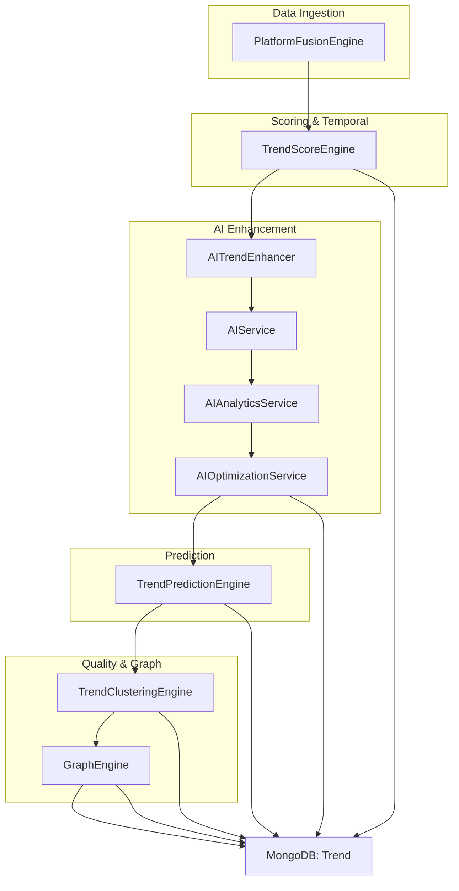

**Diagram sources**
- [platformFusionEngine.js:1-268](file://backend/src/services/platformFusionEngine.js#L1-L268)
- [trendScoreEngine.js:1-231](file://backend/src/services/trendScoreEngine.js#L1-L231)
- [aiTrendEnhancer.js:1-188](file://backend/src/services/aiTrendEnhancer.js#L1-L188)
- [aiService.js:1-168](file://backend/src/services/aiService.js#L1-L168)
- [aiAnalyticsService.js:1-203](file://backend/src/services/aiAnalyticsService.js#L1-L203)
- [aiOptimizationService.js:1-120](file://backend/src/services/aiOptimizationService.js#L1-L120)
- [trendPredictionEngine.js:1-573](file://backend/src/services/trendPredictionEngine.js#L1-L573)
- [trendClusteringEngine.js:1-428](file://backend/src/services/trendClusteringEngine.js#L1-L428)
- [graphEngine.js:1-202](file://backend/src/services/graphEngine.js#L1-L202)
- [Trend.js:1-188](file://backend/src/models/Trend.js#L1-L188)

**Section sources**
- [platformFusionEngine.js:1-268](file://backend/src/services/platformFusionEngine.js#L1-L268)
- [trendScoreEngine.js:1-231](file://backend/src/services/trendScoreEngine.js#L1-L231)
- [aiTrendEnhancer.js:1-188](file://backend/src/services/aiTrendEnhancer.js#L1-L188)
- [aiService.js:1-168](file://backend/src/services/aiService.js#L1-L168)
- [aiAnalyticsService.js:1-203](file://backend/src/services/aiAnalyticsService.js#L1-L203)
- [aiOptimizationService.js:1-120](file://backend/src/services/aiOptimizationService.js#L1-L120)
- [trendPredictionEngine.js:1-573](file://backend/src/services/trendPredictionEngine.js#L1-L573)
- [trendClusteringEngine.js:1-428](file://backend/src/services/trendClusteringEngine.js#L1-L428)
- [graphEngine.js:1-202](file://backend/src/services/graphEngine.js#L1-L202)
- [Trend.js:1-188](file://backend/src/models/Trend.js#L1-L188)

## Core Components
- PlatformFusionEngine: Deduplicates and merges incoming trends across platforms within a 30-minute window using keyword overlap.
- TrendScoreEngine: Computes discrete metrics (viralScore, heatScore, growthScore) and a composite trendScore with time-decayed engagement and log-normalization.
- AITrendEnhancer: Batch-enriches trends with AI-generated summaries, categories, and predictions using Gemini with in-memory caching.
- AIService: Generates detailed AI analysis with sentiment, virality, drivers, and confidence; includes fallbacks and chat capabilities.
- AIAnalyticsService: LLM-powered enrichment with structured JSON output validated by schema; fallbacks and retries.
- AIOptimizationService: Cost-control gate and duplicate mirroring to avoid redundant LLM calls.
- TrendPredictionEngine: Lifecycle state machine, historical confidence calibration, regional migration prediction, and explainable justification.
- TrendClusteringEngine: Semantic clustering (keyword overlap) and geo-anomaly detection with quarantine of suspicious trends.
- GraphEngine: Builds bidirectional relationship links between trends based on keyword overlap and enforces caps.

**Section sources**
- [platformFusionEngine.js:1-268](file://backend/src/services/platformFusionEngine.js#L1-L268)
- [trendScoreEngine.js:1-231](file://backend/src/services/trendScoreEngine.js#L1-L231)
- [aiTrendEnhancer.js:1-188](file://backend/src/services/aiTrendEnhancer.js#L1-L188)
- [aiService.js:1-168](file://backend/src/services/aiService.js#L1-L168)
- [aiAnalyticsService.js:1-203](file://backend/src/services/aiAnalyticsService.js#L1-L203)
- [aiOptimizationService.js:1-120](file://backend/src/services/aiOptimizationService.js#L1-L120)
- [trendPredictionEngine.js:1-573](file://backend/src/services/trendPredictionEngine.js#L1-L573)
- [trendClusteringEngine.js:1-428](file://backend/src/services/trendClusteringEngine.js#L1-L428)
- [graphEngine.js:1-202](file://backend/src/services/graphEngine.js#L1-L202)

## Architecture Overview
The pipeline stages are:
1. Fusion: Merge semantically overlapping trends across platforms.
2. Scoring: Compute time-aware, log-normalized metrics and composite score.
3. AI Enhancement: Summaries, categories, and predictions via Gemini; structured analysis with validation.
4. Prediction: Lifecycle classification, historical calibration, regional migration, and justification.
5. Quality & Graph: Clustering and anomaly detection; build relationship graph.
6. Persistence: All stages write to the Trend model in MongoDB.

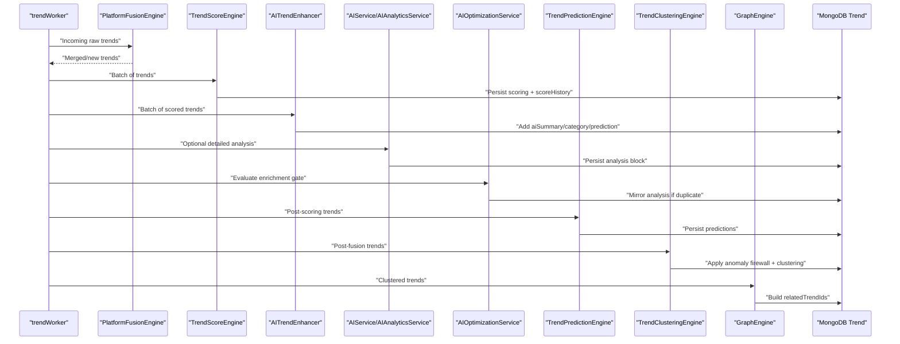

**Diagram sources**
- [platformFusionEngine.js:84-152](file://backend/src/services/platformFusionEngine.js#L84-L152)
- [trendScoreEngine.js:102-216](file://backend/src/services/trendScoreEngine.js#L102-L216)
- [aiTrendEnhancer.js:35-94](file://backend/src/services/aiTrendEnhancer.js#L35-L94)
- [aiService.js:17-86](file://backend/src/services/aiService.js#L17-L86)
- [aiAnalyticsService.js:29-56](file://backend/src/services/aiAnalyticsService.js#L29-L56)
- [aiOptimizationService.js:21-47](file://backend/src/services/aiOptimizationService.js#L21-L47)
- [trendPredictionEngine.js:486-537](file://backend/src/services/trendPredictionEngine.js#L486-L537)
- [trendClusteringEngine.js:372-399](file://backend/src/services/trendClusteringEngine.js#L372-L399)
- [graphEngine.js:73-141](file://backend/src/services/graphEngine.js#L73-L141)
- [Trend.js:45-186](file://backend/src/models/Trend.js#L45-L186)

## Detailed Component Analysis

### Predictive Scoring Algorithms
- Time-decayed engagement: Penalizes staleness using a logarithmic power law to reduce bias toward older content.
- Log-normalization: Compresses outliers (e.g., mega-influencers) to prevent dominance.
- Metrics:
  - Viral score: Acceleration of cross-platform engagement with time decay.
  - Heat score: Recency, source type bonus, and log-compressed engagement.
  - Growth score: Positive delta from previous composite score.
- Composite score: Weighted blend with optional cross-platform multiplier for verified multi-source trends.
- Velocity delta: Percentage change used for alerts and temporal analysis.

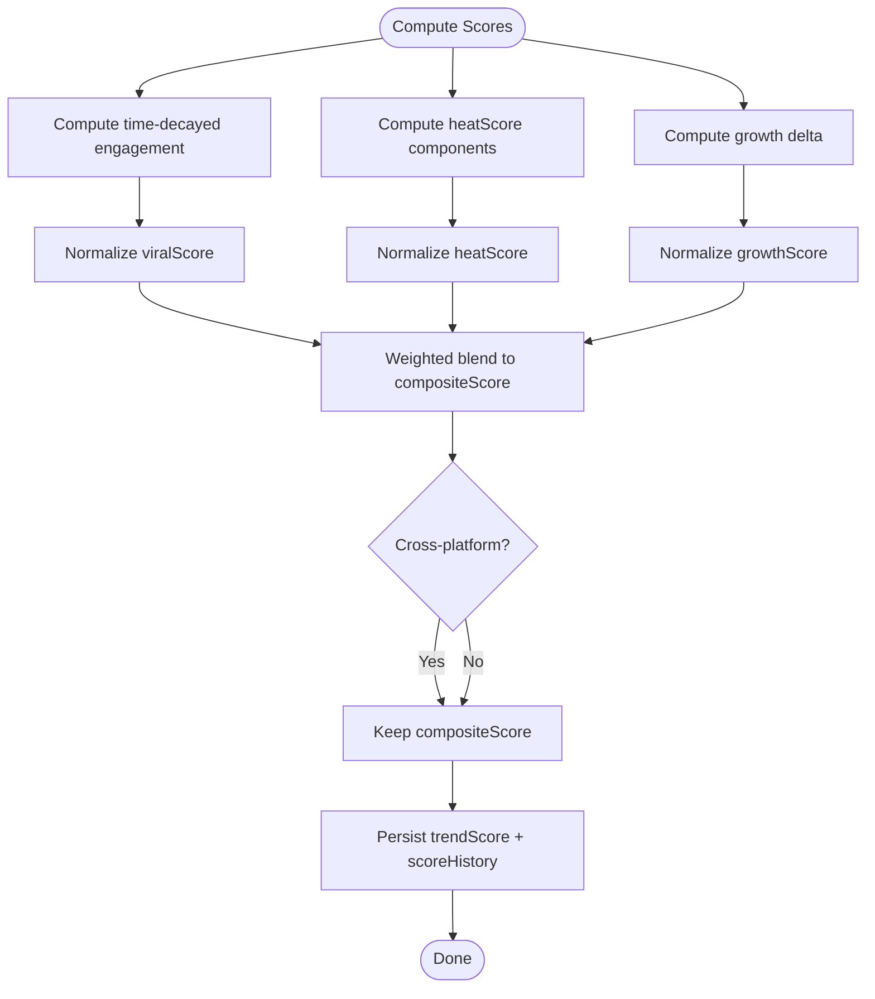

**Diagram sources**
- [trendScoreEngine.js:21-89](file://backend/src/services/trendScoreEngine.js#L21-L89)
- [trendScoreEngine.js:151-166](file://backend/src/services/trendScoreEngine.js#L151-L166)
- [trendScoreEngine.js:178-203](file://backend/src/services/trendScoreEngine.js#L178-L203)
- [Trend.js:107-111](file://backend/src/models/Trend.js#L107-L111)

**Section sources**
- [trendScoreEngine.js:14-89](file://backend/src/services/trendScoreEngine.js#L14-L89)
- [trendScoreEngine.js:102-216](file://backend/src/services/trendScoreEngine.js#L102-L216)
- [Trend.js:107-111](file://backend/src/models/Trend.js#L107-L111)

### Temporal Analysis Techniques
- Rolling velocity: Average delta over recent scoreHistory snapshots to classify lifecycle.
- Velocity curve similarity: Cosine-like similarity of delta directions between current and historical trends.
- Historical window: 6-month semantic scan to calibrate confidence and historical peak.
- Age gating: Hours since publish time used across scoring and prediction.

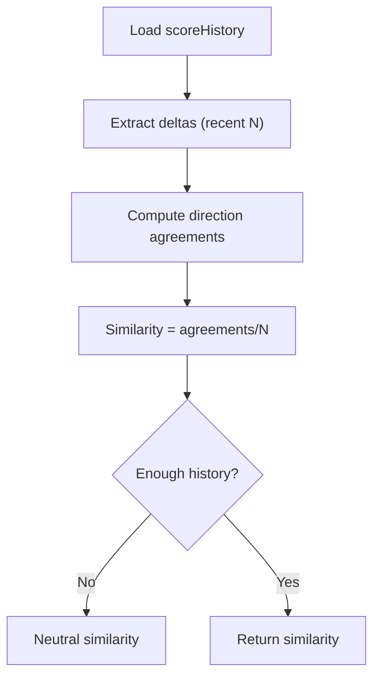

**Diagram sources**
- [trendPredictionEngine.js:322-341](file://backend/src/services/trendPredictionEngine.js#L322-L341)
- [trendPredictionEngine.js:176-188](file://backend/src/services/trendPredictionEngine.js#L176-L188)

**Section sources**
- [trendPredictionEngine.js:172-188](file://backend/src/services/trendPredictionEngine.js#L172-L188)
- [trendPredictionEngine.js:318-341](file://backend/src/services/trendPredictionEngine.js#L318-L341)

### Machine Learning Model Integration
- Gemini (2.5 Flash) for summarization, categorization, and conversational AI.
- OpenRouter + DeepSeek/GPT-4o-mini for structured analysis with JSON validation.
- In-memory caching to reduce API calls and latency.
- Validation and fallbacks to ensure robustness and safety.

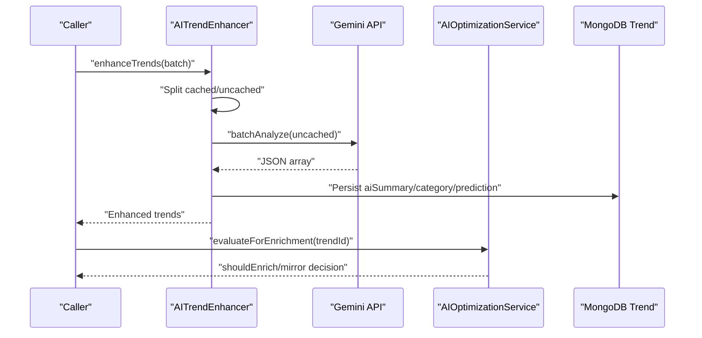

**Diagram sources**
- [aiTrendEnhancer.js:35-94](file://backend/src/services/aiTrendEnhancer.js#L35-L94)
- [aiTrendEnhancer.js:100-140](file://backend/src/services/aiTrendEnhancer.js#L100-L140)
- [aiOptimizationService.js:21-47](file://backend/src/services/aiOptimizationService.js#L21-L47)
- [Trend.js:114-129](file://backend/src/models/Trend.js#L114-L129)

**Section sources**
- [aiTrendEnhancer.js:1-188](file://backend/src/services/aiTrendEnhancer.js#L1-L188)
- [aiService.js:1-168](file://backend/src/services/aiService.js#L1-L168)
- [aiAnalyticsService.js:1-203](file://backend/src/services/aiAnalyticsService.js#L1-L203)
- [aiOptimizationService.js:1-120](file://backend/src/services/aiOptimizationService.js#L1-L120)

### AI Trend Enhancement Process
- Batch processing with a single Gemini call for efficiency.
- In-memory cache with TTL to minimize redundant calls.
- Fallback logic when API is unavailable.
- Structured analysis with schema validation and coercion.

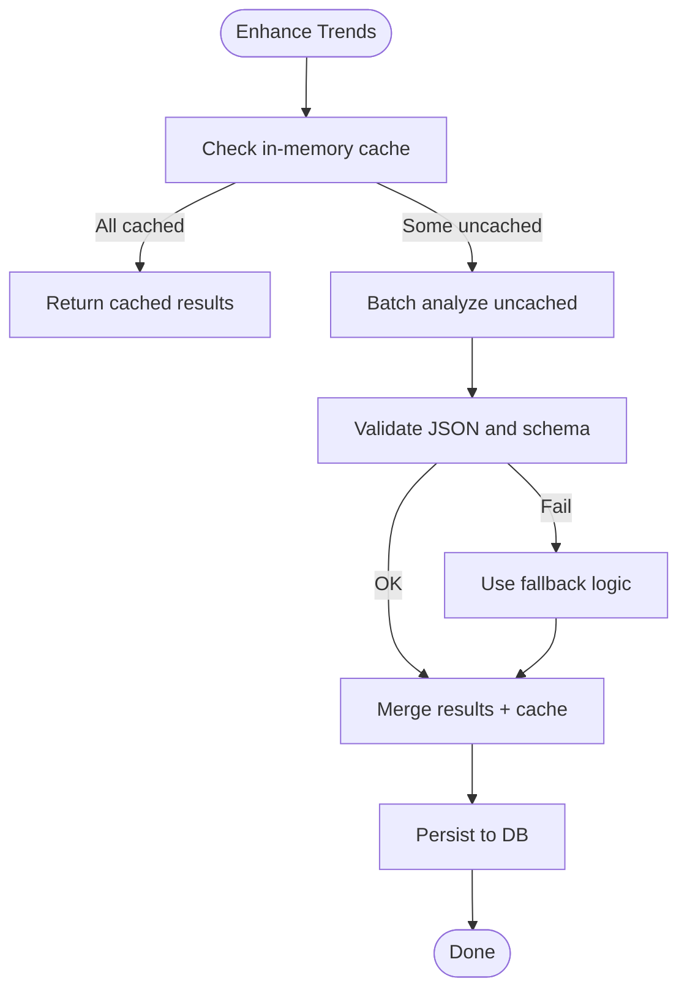

**Diagram sources**
- [aiTrendEnhancer.js:35-94](file://backend/src/services/aiTrendEnhancer.js#L35-L94)
- [aiAnalyticsService.js:62-96](file://backend/src/services/aiAnalyticsService.js#L62-L96)
- [aiOptimizationService.js:54-83](file://backend/src/services/aiOptimizationService.js#L54-L83)

**Section sources**
- [aiTrendEnhancer.js:26-94](file://backend/src/services/aiTrendEnhancer.js#L26-L94)
- [aiAnalyticsService.js:29-56](file://backend/src/services/aiAnalyticsService.js#L29-L56)
- [aiOptimizationService.js:21-83](file://backend/src/services/aiOptimizationService.js#L21-L83)

### Future Trend Prediction Models
- Lifecycle state machine: emerging, accelerating, viral, declining, dead, based on thresholds of composite score and velocity.
- Historical confidence calibration: keyword overlap density, historical peak, category consistency, platform verification, and velocity similarity.
- Regional migration matrix: category-specific propagation paths with time lags and base probabilities adjusted by lifecycle, confidence, and platform spread.
- Explainable justification: human-readable explanation of prediction rationale.

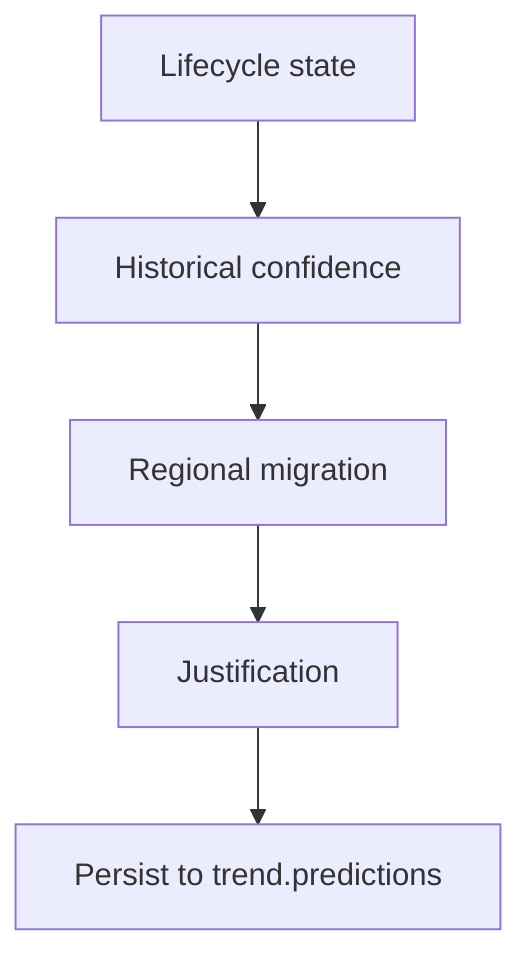

**Diagram sources**
- [trendPredictionEngine.js:134-170](file://backend/src/services/trendPredictionEngine.js#L134-L170)
- [trendPredictionEngine.js:204-286](file://backend/src/services/trendPredictionEngine.js#L204-L286)
- [trendPredictionEngine.js:371-425](file://backend/src/services/trendPredictionEngine.js#L371-L425)
- [trendPredictionEngine.js:443-473](file://backend/src/services/trendPredictionEngine.js#L443-L473)
- [Trend.js:141-159](file://backend/src/models/Trend.js#L141-L159)

**Section sources**
- [trendPredictionEngine.js:17-27](file://backend/src/services/trendPredictionEngine.js#L17-L27)
- [trendPredictionEngine.js:134-170](file://backend/src/services/trendPredictionEngine.js#L134-L170)
- [trendPredictionEngine.js:204-286](file://backend/src/services/trendPredictionEngine.js#L204-L286)
- [trendPredictionEngine.js:356-425](file://backend/src/services/trendPredictionEngine.js#L356-L425)
- [trendPredictionEngine.js:443-473](file://backend/src/services/trendPredictionEngine.js#L443-L473)
- [Trend.js:141-159](file://backend/src/models/Trend.js#L141-L159)

### Relationship Graph Construction
- Bidirectional linking of trends with keyword overlap ≥ 40%.
- Caps enforced to limit relatedTrendIds per trend.
- Hydration of graph for downstream consumption.

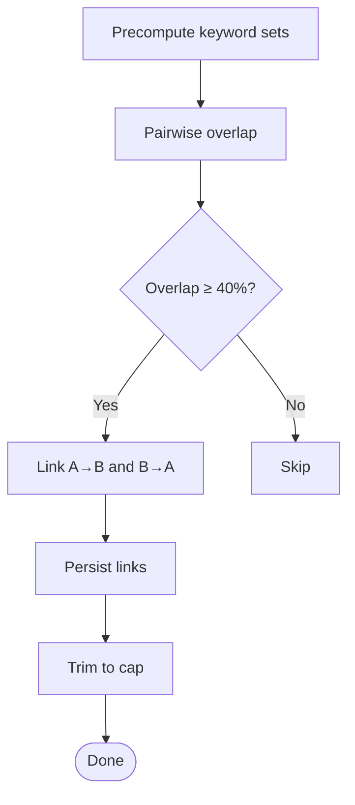

**Diagram sources**
- [graphEngine.js:73-141](file://backend/src/services/graphEngine.js#L73-L141)
- [graphEngine.js:146-163](file://backend/src/services/graphEngine.js#L146-L163)
- [Trend.js](file://backend/src/models/Trend.js#L105)

**Section sources**
- [graphEngine.js:1-202](file://backend/src/services/graphEngine.js#L1-L202)
- [Trend.js](file://backend/src/models/Trend.js#L105)

### Clustering Algorithms for Trend Categorization
- Semantic clustering: keyword overlap ≥ 65% within a 24-hour window against active DB trends and within-batch comparisons.
- Representative selection: highest engagement trend becomes cluster leader.
- Anomaly detection: velocity spikes, source diversity deficit, geographic impossibility, engagement/view ratio anomalies, identical velocity curves.

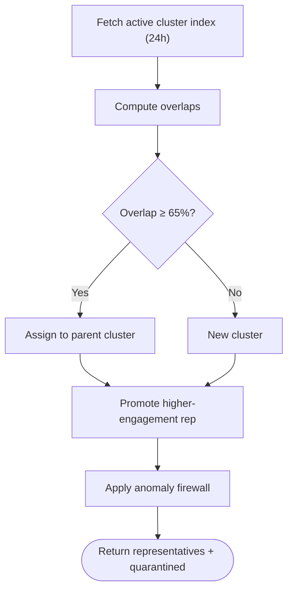

**Diagram sources**
- [trendClusteringEngine.js:85-108](file://backend/src/services/trendClusteringEngine.js#L85-L108)
- [trendClusteringEngine.js:121-223](file://backend/src/services/trendClusteringEngine.js#L121-L223)
- [trendClusteringEngine.js:241-311](file://backend/src/services/trendClusteringEngine.js#L241-L311)
- [trendClusteringEngine.js:372-399](file://backend/src/services/trendClusteringEngine.js#L372-L399)

**Section sources**
- [trendClusteringEngine.js:21-36](file://backend/src/services/trendClusteringEngine.js#L21-L36)
- [trendClusteringEngine.js:85-223](file://backend/src/services/trendClusteringEngine.js#L85-L223)
- [trendClusteringEngine.js:241-357](file://backend/src/services/trendClusteringEngine.js#L241-L357)

### Anomaly Detection for Emerging Patterns
- Velocity spike detection (engagement per minute).
- Source diversity deficit for high-engagement trends.
- Geographic impossibility checks.
- Engagement-to-view ratio anomalies.
- Identical velocity curves detection.

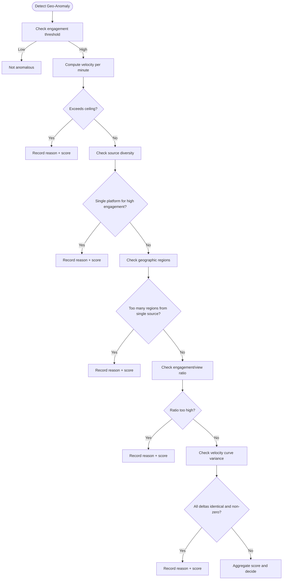

**Diagram sources**
- [trendClusteringEngine.js:241-311](file://backend/src/services/trendClusteringEngine.js#L241-L311)

**Section sources**
- [trendClusteringEngine.js:241-311](file://backend/src/services/trendClusteringEngine.js#L241-L311)

### Mathematical Foundations of Prediction Models
- Time-decayed engagement: f(h) = E / (h + 2)^1.5, where h is hours since creation.
- Log-normalization: g(x, xmax) = floor(log(1+x)/log(1+xmax) * 100).
- Composite blending: composite = 0.4·viral + 0.35·heat + 0.25·growth, optionally scaled by cross-platform multiplier.
- Velocity delta: Δ = ((c − p)/p)·100, used for alerts and temporal analysis.

**Section sources**
- [trendScoreEngine.js:21-24](file://backend/src/services/trendScoreEngine.js#L21-L24)
- [trendScoreEngine.js:31-35](file://backend/src/services/trendScoreEngine.js#L31-L35)
- [trendScoreEngine.js:158-159](file://backend/src/services/trendScoreEngine.js#L158-L159)
- [trendScoreEngine.js:222-227](file://backend/src/services/trendScoreEngine.js#L222-L227)

### Feature Engineering Processes
- Keyword extraction: normalize, strip punctuation, remove stop words, filter short tokens.
- Overlap metrics: Jaccard-like coefficient using min denominator.
- Categorical features: platform type, category, geography.
- Temporal features: hours since publish, recency decay, scoreHistory deltas.
- Cross-platform features: platformCount, crossPlatformMultiplier.

**Section sources**
- [platformFusionEngine.js:48-71](file://backend/src/services/platformFusionEngine.js#L48-L71)
- [trendClusteringEngine.js:58-76](file://backend/src/services/trendClusteringEngine.js#L58-L76)
- [trendPredictionEngine.js:95-116](file://backend/src/services/trendPredictionEngine.js#L95-L116)
- [graphEngine.js:40-61](file://backend/src/services/graphEngine.js#L40-L61)

### Model Evaluation Metrics
- Confidence calibration: weighted combination of keyword overlap density, historical success rate, category consistency, platform verification, and velocity similarity.
- Anomaly scoring: weighted sum of signals, capped at 1.0; trends with score ≥ 0.35 are quarantined.
- Velocity delta threshold: >50% used for alerts.

**Section sources**
- [trendPredictionEngine.js:272-278](file://backend/src/services/trendPredictionEngine.js#L272-L278)
- [trendClusteringEngine.js:27-36](file://backend/src/services/trendClusteringEngine.js#L27-L36)
- [trendClusteringEngine.js:302-304](file://backend/src/services/trendClusteringEngine.js#L302-L304)
- [trendScoreEngine.js:222-227](file://backend/src/services/trendScoreEngine.js#L222-L227)

### Integration with External AI Services
- Gemini: summarization, categorization, conversational chat.
- OpenRouter: structured analysis via DeepSeek or GPT-4o-mini.
- Validation: strict schema validation and coercion to ensure robust outputs.
- Fallbacks: deterministic local fallbacks when APIs fail.

**Section sources**
- [aiTrendEnhancer.js:15-20](file://backend/src/services/aiTrendEnhancer.js#L15-L20)
- [aiService.js:7-10](file://backend/src/services/aiService.js#L7-L10)
- [aiAnalyticsService.js:17-22](file://backend/src/services/aiAnalyticsService.js#L17-L22)
- [aiAnalyticsService.js:62-96](file://backend/src/services/aiAnalyticsService.js#L62-L96)
- [aiAnalyticsService.js:182-199](file://backend/src/services/aiAnalyticsService.js#L182-L199)

### Model Versioning Strategies
- In-memory caches with TTLs to decouple runtime behavior from model updates.
- Schema-based validation to guard against format changes.
- Fallbacks to maintain service continuity during model drift.

**Section sources**
- [aiTrendEnhancer.js:22-24](file://backend/src/services/aiTrendEnhancer.js#L22-L24)
- [aiAnalyticsService.js:85-96](file://backend/src/services/aiAnalyticsService.js#L85-L96)
- [aiService.js:92-100](file://backend/src/services/aiService.js#L92-L100)

### Performance Monitoring Approaches
- Logging for errors, warnings, and info across engines.
- Cache statistics for AI enhancer.
- Batch processing to reduce overhead.
- Indexes on MongoDB for efficient queries.

**Section sources**
- [trendPredictionEngine.js:527-529](file://backend/src/services/trendPredictionEngine.js#L527-L529)
- [trendClusteringEngine.js:307-308](file://backend/src/services/trendClusteringEngine.js#L307-L308)
- [trendClusteringEngine.js:342-343](file://backend/src/services/trendClusteringEngine.js#L342-L343)
- [aiTrendEnhancer.js:179-184](file://backend/src/services/aiTrendEnhancer.js#L179-L184)
- [Trend.js:174-186](file://backend/src/models/Trend.js#L174-L186)

### Uncertainty Quantification and Confidence Intervals
- Predictive confidence score: weighted calibration from keyword overlap, historical success, category consistency, platform verification, and velocity similarity.
- AI confidence sub-object: stores isolated confidence metrics and evaluated timestamps.
- Anomaly score: probabilistic severity for suspicious activity.

**Section sources**
- [trendPredictionEngine.js:272-286](file://backend/src/services/trendPredictionEngine.js#L272-L286)
- [Trend.js:37-43](file://backend/src/models/Trend.js#L37-L43)
- [trendClusteringEngine.js:302-311](file://backend/src/services/trendClusteringEngine.js#L302-L311)

### Model Drift Detection
- Validation failures trigger fallbacks and retries with alternative models.
- Schema validation ensures outputs remain within expected ranges.
- Velocity delta and anomaly scoring act as early indicators of changing dynamics.

**Section sources**
- [aiAnalyticsService.js:85-96](file://backend/src/services/aiAnalyticsService.js#L85-L96)
- [aiAnalyticsService.js:146-166](file://backend/src/services/aiAnalyticsService.js#L146-L166)
- [trendScoreEngine.js:222-227](file://backend/src/services/trendScoreEngine.js#L222-L227)
- [trendClusteringEngine.js:241-311](file://backend/src/services/trendClusteringEngine.js#L241-L311)

## Dependency Analysis
- Coupling: Engines depend on Trend model and each other through staged pipeline.
- Cohesion: Each engine encapsulates a single responsibility (fusion, scoring, AI, prediction, clustering, graph).
- External dependencies: MongoDB, Gemini, OpenRouter.
- Potential circular dependencies: None observed; pipeline is linear.

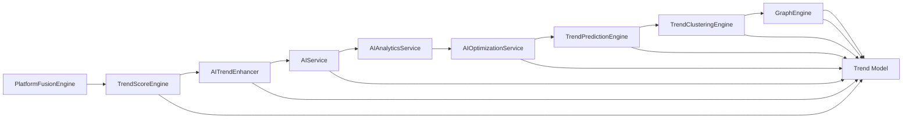

**Diagram sources**
- [platformFusionEngine.js:1-268](file://backend/src/services/platformFusionEngine.js#L1-L268)
- [trendScoreEngine.js:1-231](file://backend/src/services/trendScoreEngine.js#L1-L231)
- [aiTrendEnhancer.js:1-188](file://backend/src/services/aiTrendEnhancer.js#L1-L188)
- [aiService.js:1-168](file://backend/src/services/aiService.js#L1-L168)
- [aiAnalyticsService.js:1-203](file://backend/src/services/aiAnalyticsService.js#L1-L203)
- [aiOptimizationService.js:1-120](file://backend/src/services/aiOptimizationService.js#L1-L120)
- [trendPredictionEngine.js:1-573](file://backend/src/services/trendPredictionEngine.js#L1-L573)
- [trendClusteringEngine.js:1-428](file://backend/src/services/trendClusteringEngine.js#L1-L428)
- [graphEngine.js:1-202](file://backend/src/services/graphEngine.js#L1-L202)
- [Trend.js:1-188](file://backend/src/models/Trend.js#L1-L188)

**Section sources**
- [platformFusionEngine.js:1-268](file://backend/src/services/platformFusionEngine.js#L1-L268)
- [trendScoreEngine.js:1-231](file://backend/src/services/trendScoreEngine.js#L1-L231)
- [aiTrendEnhancer.js:1-188](file://backend/src/services/aiTrendEnhancer.js#L1-L188)
- [aiService.js:1-168](file://backend/src/services/aiService.js#L1-L168)
- [aiAnalyticsService.js:1-203](file://backend/src/services/aiAnalyticsService.js#L1-L203)
- [aiOptimizationService.js:1-120](file://backend/src/services/aiOptimizationService.js#L1-L120)
- [trendPredictionEngine.js:1-573](file://backend/src/services/trendPredictionEngine.js#L1-L573)
- [trendClusteringEngine.js:1-428](file://backend/src/services/trendClusteringEngine.js#L1-L428)
- [graphEngine.js:1-202](file://backend/src/services/graphEngine.js#L1-L202)
- [Trend.js:1-188](file://backend/src/models/Trend.js#L1-L188)

## Performance Considerations
- Caching: In-memory caches for AI insights and cluster indices reduce latency and API costs.
- Batch processing: Single batch calls to Gemini and pairwise graph linking optimize throughput.
- Indexing: Strategic MongoDB indexes improve query performance for scoring, clustering, and anomaly filtering.
- Log compression: Time-decayed and log-normalized metrics mitigate performance impact of outliers.

[No sources needed since this section provides general guidance]

## Troubleshooting Guide
- Gemini API errors: Validate API key, check rate limits, and rely on fallbacks.
- JSON parsing/validation failures: Use schema validation and coerce partial results.
- Anomaly quarantine: Investigate flagged reasons and adjust thresholds if needed.
- Prediction persistence errors: Check logging and retry mechanisms.

**Section sources**
- [aiService.js:81-85](file://backend/src/services/aiService.js#L81-L85)
- [aiAnalyticsService.js:75-96](file://backend/src/services/aiAnalyticsService.js#L75-L96)
- [trendClusteringEngine.js:307-308](file://backend/src/services/trendClusteringEngine.js#L307-L308)
- [trendPredictionEngine.js:527-529](file://backend/src/services/trendPredictionEngine.js#L527-L529)

## Conclusion
AITrendTracker’s predictive system combines robust temporal analysis, semantic enrichment, and explainable AI to deliver accurate trend forecasts. Its staged pipeline ensures quality through clustering and anomaly detection, while caching and batching optimize performance. The integration of external AI services is safeguarded by validation and fallbacks, ensuring reliability and scalability.

[No sources needed since this section summarizes without analyzing specific files]

## Appendices
- Data model highlights: scoring, scoreHistory, analysis, aiConfidence, predictions, relatedTrendIds, moderationStatus, and geolocation fields.

**Section sources**
- [Trend.js:45-186](file://backend/src/models/Trend.js#L45-L186)