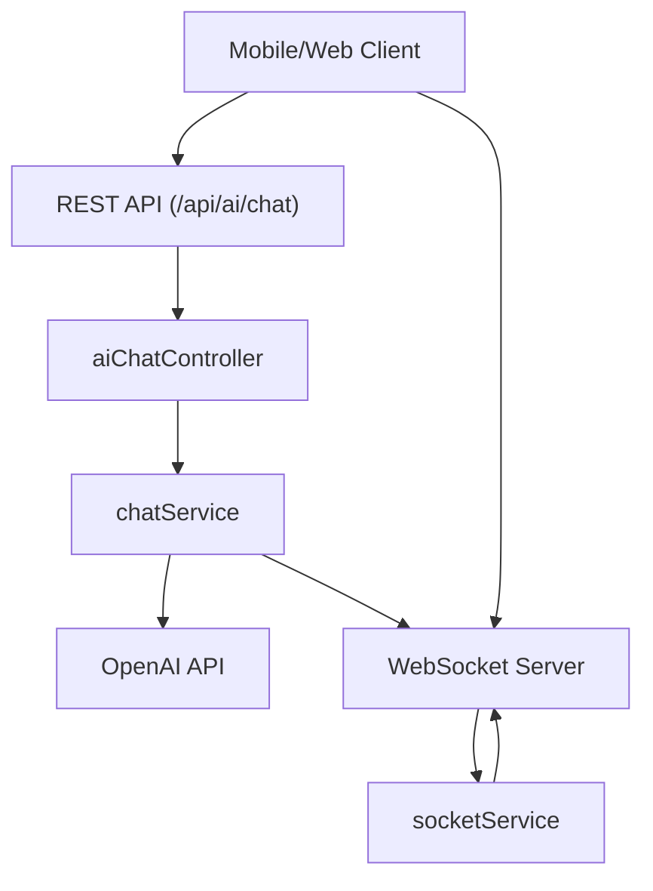
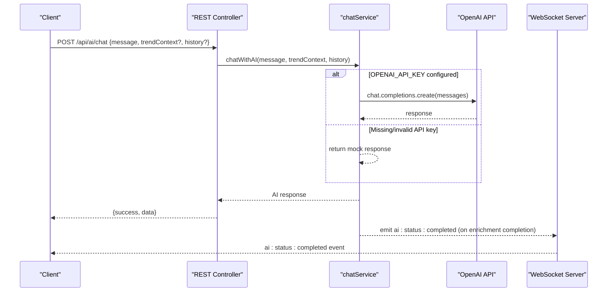
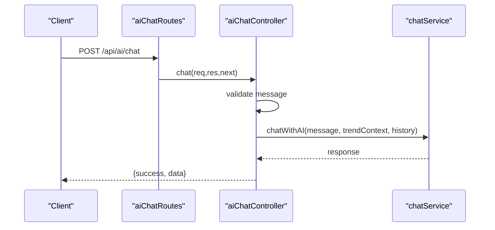
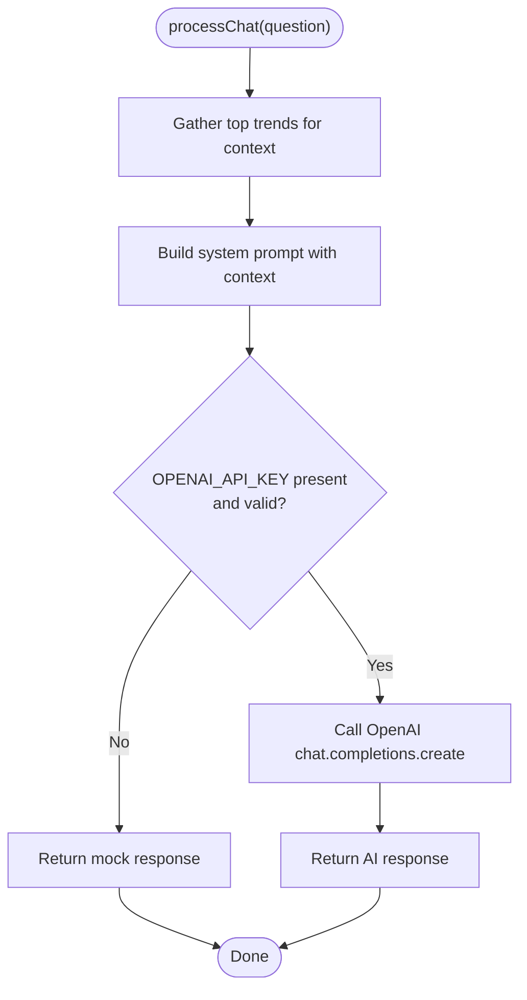
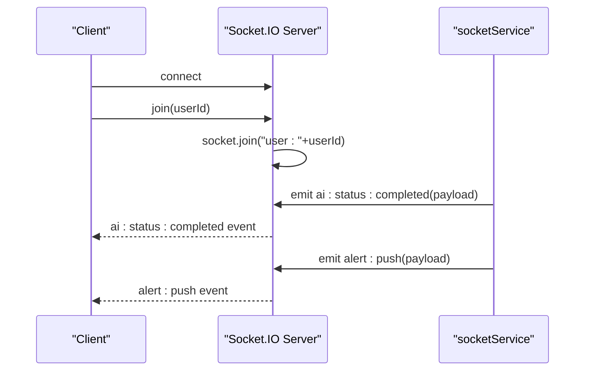
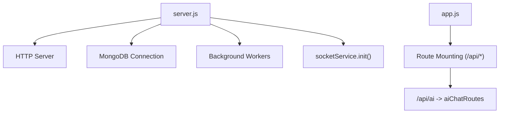
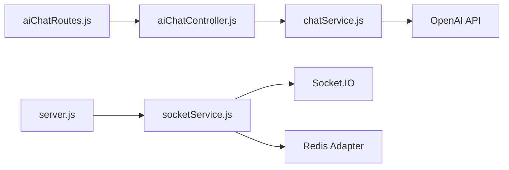

# AI Chat Integration API

<cite>
**Referenced Files in This Document**
- [aiChatRoutes.js](file://backend/src/routes/aiChatRoutes.js)
- [aiChatController.js](file://backend/src/controllers/aiChatController.js)
- [chatService.js](file://backend/src/services/chatService.js)
- [socketService.js](file://backend/src/services/socketService.js)
- [app.js](file://backend/src/app.js)
- [server.js](file://backend/server.js)
</cite>

## Table of Contents
1. [Introduction](#introduction)
2. [Project Structure](#project-structure)
3. [Core Components](#core-components)
4. [Architecture Overview](#architecture-overview)
5. [Detailed Component Analysis](#detailed-component-analysis)
6. [Dependency Analysis](#dependency-analysis)
7. [Performance Considerations](#performance-considerations)
8. [Troubleshooting Guide](#troubleshooting-guide)
9. [Conclusion](#conclusion)

## Introduction
This document provides comprehensive API documentation for AITrendTracker's AI chat integration endpoints. It covers REST endpoints for AI-powered chat, WebSocket connections for real-time updates, request/response schemas, moderation and analytics considerations, and operational patterns for offline scenarios. The documentation is designed for both technical and non-technical audiences.

## Project Structure
The chat integration spans the backend REST API and WebSocket service:
- REST routes expose a single chat endpoint under `/api/ai/chat`.
- The controller delegates to an AI service that integrates with OpenAI or falls back to a mock response.
- WebSocket service manages real-time events for AI enrichment completion and alerts.

**Diagram sources**
- [aiChatRoutes.js:1-8](file://backend/src/routes/aiChatRoutes.js#L1-L8)
- [aiChatController.js:1-22](file://backend/src/controllers/aiChatController.js#L1-L22)
- [chatService.js:1-42](file://backend/src/services/chatService.js#L1-L42)
- [socketService.js:1-107](file://backend/src/services/socketService.js#L1-L107)

**Section sources**
- [aiChatRoutes.js:1-8](file://backend/src/routes/aiChatRoutes.js#L1-L8)
- [aiChatController.js:1-22](file://backend/src/controllers/aiChatController.js#L1-L22)
- [chatService.js:1-42](file://backend/src/services/chatService.js#L1-L42)
- [socketService.js:1-107](file://backend/src/services/socketService.js#L1-L107)
- [app.js:59-62](file://backend/src/app.js#L59-L62)
- [server.js:28](file://backend/server.js#L28)

## Core Components
- REST Chat Endpoint: POST `/api/ai/chat`
  - Purpose: Accepts a user message and optional trend context/history, returns AI-generated response.
  - Request body fields:
    - message (required): String containing the user query.
    - trendContext (optional): Object representing contextual trend metadata.
    - history (optional): Array of previous messages exchanged in the session.
  - Response:
    - success (boolean): Indicates operation outcome.
    - data (object): Contains the AI response payload.

- WebSocket Service:
  - Initialization: Created on server startup and attached to HTTP server.
  - Rooms: Clients join a user-specific room using a join event with a user ID.
  - Events:
    - ai:status:completed: Emitted when an AI enrichment job completes for a trend.
    - alert:push: Emitted to notify users of priority alerts (global or per user).

**Section sources**
- [aiChatController.js:3-21](file://backend/src/controllers/aiChatController.js#L3-L21)
- [chatService.js:8-38](file://backend/src/services/chatService.js#L8-L38)
- [socketService.js:20-54](file://backend/src/services/socketService.js#L20-L54)
- [socketService.js:62-91](file://backend/src/services/socketService.js#L62-L91)

## Architecture Overview
The system integrates REST and WebSocket layers:
- REST layer validates requests, invokes AI service, and returns JSON responses.
- WebSocket layer enables real-time updates for AI enrichment and alerts.
- OpenAI integration is guarded by environment configuration; otherwise a mock response is returned.

**Diagram sources**
- [aiChatController.js:3-21](file://backend/src/controllers/aiChatController.js#L3-L21)
- [chatService.js:24-37](file://backend/src/services/chatService.js#L24-L37)
- [socketService.js:62-69](file://backend/src/services/socketService.js#L62-L69)

## Detailed Component Analysis

### REST Chat Endpoint
- Route: POST `/api/ai/chat`
- Responsibilities:
  - Validate presence of message.
  - Delegate to AI service for response generation.
  - Return standardized success/error response.
- Request Schema
  - message: string (required)
  - trendContext: object (optional)
  - history: array (optional)
- Response Schema
  - success: boolean
  - data: object (AI response payload)

**Diagram sources**
- [aiChatRoutes.js:5](file://backend/src/routes/aiChatRoutes.js#L5)
- [aiChatController.js:3-21](file://backend/src/controllers/aiChatController.js#L3-L21)
- [chatService.js:9-38](file://backend/src/services/chatService.js#L9-L38)

**Section sources**
- [aiChatRoutes.js:5](file://backend/src/routes/aiChatRoutes.js#L5)
- [aiChatController.js:3-21](file://backend/src/controllers/aiChatController.js#L3-L21)
- [chatService.js:9-38](file://backend/src/services/chatService.js#L9-L38)

### AI Service and OpenAI Integration
- Behavior:
  - Builds a system prompt enriched with top trends.
  - Uses OpenAI chat completions when API key is present and valid.
  - Returns a mock response when API key is missing or invalid.
- Fallback Mechanism:
  - Detects missing or placeholder API key and returns a deterministic mock response.
- Notes:
  - The service currently does not persist chat sessions or enforce moderation.
  - No explicit message encryption or privacy controls are implemented in the service.

**Diagram sources**
- [chatService.js:9-38](file://backend/src/services/chatService.js#L9-L38)

**Section sources**
- [chatService.js:9-38](file://backend/src/services/chatService.js#L9-L38)

### WebSocket Service
- Initialization:
  - Creates Socket.IO server attached to HTTP server.
  - Attempts to attach Redis adapter for multi-instance scaling.
- Rooms:
  - Clients join a room named by user ID after connecting.
- Events:
  - ai:status:completed: Emits completion of AI enrichment with timestamp.
  - alert:push: Emits priority alerts to a specific user or globally.

**Diagram sources**
- [socketService.js:20-54](file://backend/src/services/socketService.js#L20-L54)
- [socketService.js:62-91](file://backend/src/services/socketService.js#L62-L91)

**Section sources**
- [socketService.js:20-54](file://backend/src/services/socketService.js#L20-L54)
- [socketService.js:62-91](file://backend/src/services/socketService.js#L62-L91)

### Server Bootstrap and Routing
- Application bootstrap initializes HTTP server, connects to MongoDB, starts background workers, and initializes WebSocket service.
- Routes mounted under `/api/` include the AI chat module.

**Diagram sources**
- [server.js:14-32](file://backend/server.js#L14-L32)
- [app.js:59-62](file://backend/src/app.js#L59-L62)

**Section sources**
- [server.js:14-32](file://backend/server.js#L14-L32)
- [app.js:59-62](file://backend/src/app.js#L59-L62)

## Dependency Analysis
- REST Endpoint Dependencies:
  - aiChatRoutes → aiChatController
  - aiChatController → chatService
- WebSocket Dependencies:
  - server.js → socketService
  - socketService → Socket.IO and Redis adapter
- External Integrations:
  - chatService → OpenAI API (when configured)
  - socketService → Redis adapter (optional)

**Diagram sources**
- [aiChatRoutes.js:3](file://backend/src/routes/aiChatRoutes.js#L3)
- [aiChatController.js:1](file://backend/src/controllers/aiChatController.js#L1)
- [chatService.js:1](file://backend/src/services/chatService.js#L1)
- [socketService.js:11](file://backend/src/services/socketService.js#L11)
- [server.js:5](file://backend/server.js#L5)

**Section sources**
- [aiChatRoutes.js:3](file://backend/src/routes/aiChatRoutes.js#L3)
- [aiChatController.js:1](file://backend/src/controllers/aiChatController.js#L1)
- [chatService.js:1](file://backend/src/services/chatService.js#L1)
- [socketService.js:11](file://backend/src/services/socketService.js#L11)
- [server.js:5](file://backend/server.js#L5)

## Performance Considerations
- Rate Limiting: The application applies distributed rate limiting via middleware for API and user endpoints.
- WebSocket Scalability: Socket.IO uses a Redis adapter to support horizontal scaling; if unavailable, the service continues in single-instance mode with a warning.
- AI Latency: OpenAI calls introduce network latency; consider caching or preloading context to reduce repeated calls.
- Background Tasks: AI enrichment and trend aggregation workers operate independently, reducing load on request paths.

[No sources needed since this section provides general guidance]

## Troubleshooting Guide
- Missing or Invalid OpenAI API Key:
  - Symptom: Mock response is returned instead of OpenAI reply.
  - Resolution: Set a valid OPENAI_API_KEY in environment variables.
- WebSocket Initialization Failure:
  - Symptom: Warning about Redis adapter failure; single-instance mode.
  - Resolution: Ensure Redis is reachable; otherwise, service operates without clustering.
- REST Endpoint Errors:
  - Symptom: 400 Bad Request if message is missing; 500 Internal Server Error for unhandled exceptions.
  - Resolution: Validate request payload; check server logs for underlying errors.

**Section sources**
- [chatService.js:18-22](file://backend/src/services/chatService.js#L18-L22)
- [socketService.js:31-36](file://backend/src/services/socketService.js#L31-L36)
- [aiChatController.js:7-9](file://backend/src/controllers/aiChatController.js#L7-L9)
- [aiChatController.js:17-20](file://backend/src/controllers/aiChatController.js#L17-L20)

## Conclusion
AITrendTracker’s chat integration provides a focused REST endpoint for AI-powered queries and a WebSocket layer for real-time updates. The current implementation emphasizes simplicity with a fallback mechanism for offline readiness. Future enhancements could include chat session persistence, moderation endpoints, user feedback collection, and stronger privacy controls.

[No sources needed since this section summarizes without analyzing specific files]