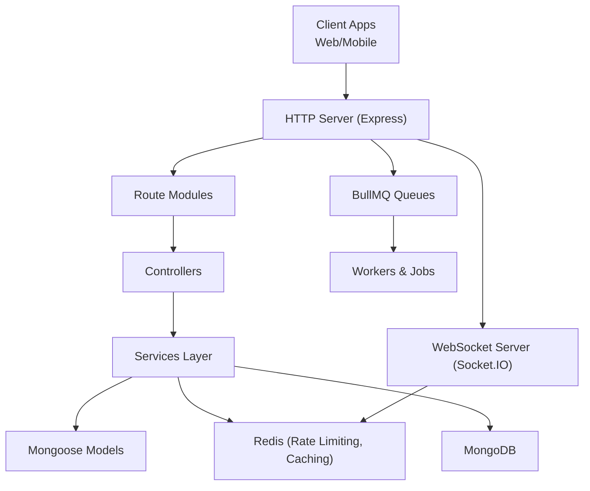
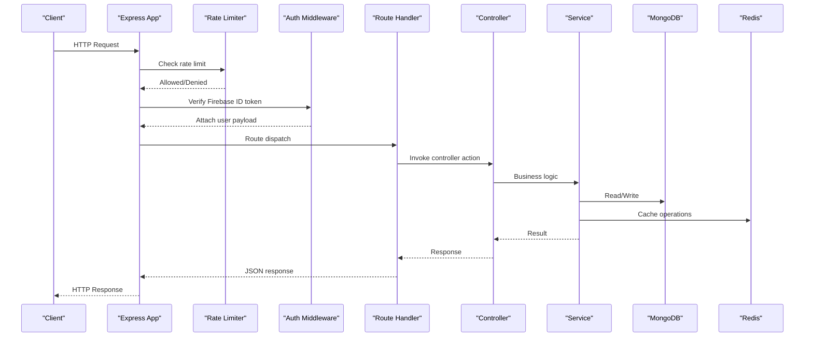
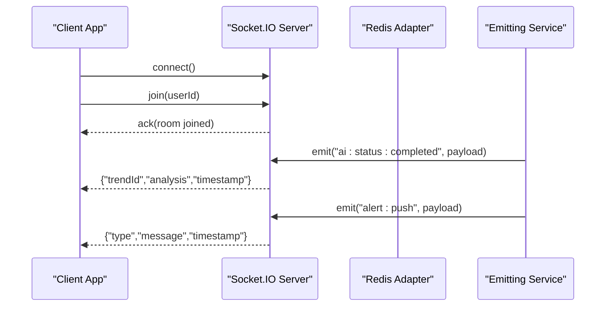
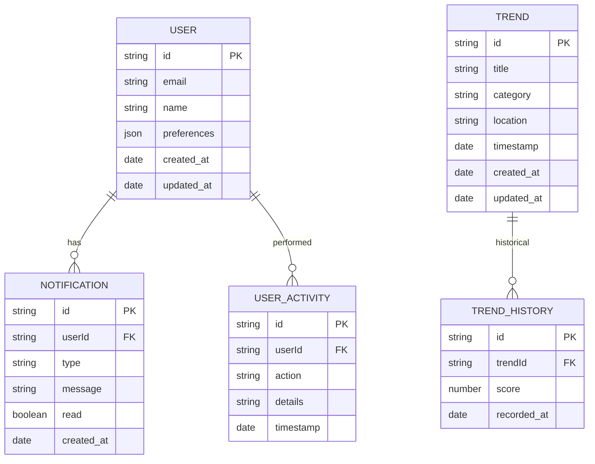
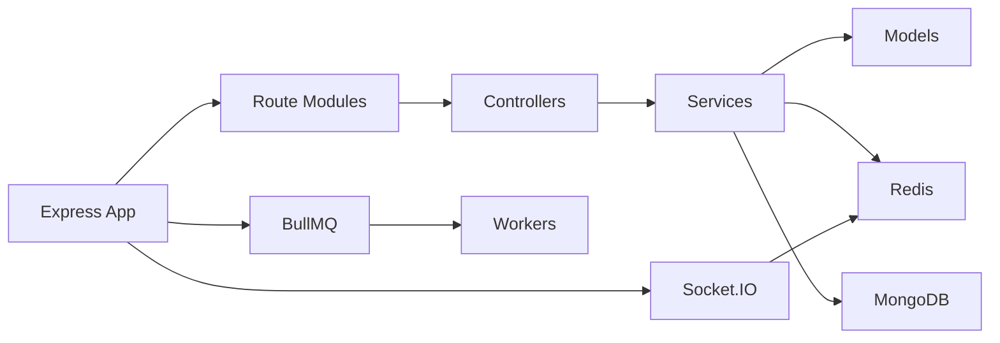
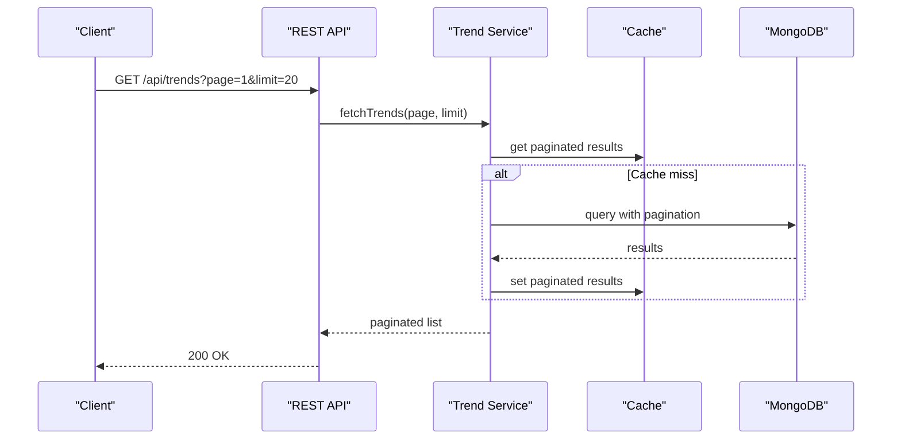
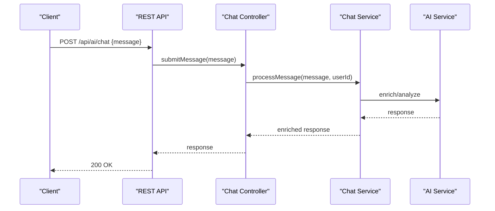

# API Reference

<cite>
**Referenced Files in This Document**
- [server.js](file://backend/server.js)
- [app.js](file://backend/src/app.js)
- [authMiddleware.js](file://backend/src/middlewares/authMiddleware.js)
- [rateLimiter.js](file://backend/src/middlewares/rateLimiter.js)
- [socketService.js](file://backend/src/services/socketService.js)
- [socketAdapter.js](file://backend/src/services/socketAdapter.js)
- [userRoutes.js](file://backend/src/routes/userRoutes.js)
- [trendRoutes.js](file://backend/src/routes/trendRoutes.js)
- [notificationRoutes.js](file://backend/src/routes/notificationRoutes.js)
- [aiChatRoutes.js](file://backend/src/routes/aiChatRoutes.js)
- [userController.js](file://backend/src/controllers/userController.js)
- [trendController.js](file://backend/src/controllers/trendController.js)
- [notificationController.js](file://backend/src/controllers/notificationController.js)
- [aiChatController.js](file://backend/src/controllers/aiChatController.js)
- [User.js](file://backend/src/models/User.js)
- [Notification.js](file://backend/src/models/Notification.js)
- [Trend.js](file://backend/src/models/Trend.js)
- [TrendHistory.js](file://backend/src/models/TrendHistory.js)
- [UserActivity.js](file://backend/src/models/UserActivity.js)
- [analyticsService.js](file://backend/src/services/analyticsService.js)
- [recommendationEngine.js](file://backend/src/services/recommendationEngine.js)
- [geoTrendEngine.js](file://backend/src/services/geoTrendEngine.js)
- [personalizationService.js](file://backend/src/services/personalizationService.js)
- [cacheService.js](file://backend/src/services/cacheService.js)
- [feedCacheService.js](file://backend/src/services/feedCacheService.js)
- [trendAggregator.js](file://backend/src/services/trendAggregator.js)
- [trendPredictionEngine.js](file://backend/src/services/trendPredictionEngine.js)
- [trendClusteringEngine.js](file://backend/src/services/trendClusteringEngine.js)
- [trendScoreEngine.js](file://backend/src/services/trendScoreEngine.js)
- [trendService.js](file://backend/src/services/trendService.js)
- [userOnboardingService.js](file://backend/src/services/userOnboardingService.js)
- [alertService.js](file://backend/src/services/alertService.js)
- [backgroundWorker.js](file://backend/src/services/backgroundWorker.js)
- [aiEnrichmentWorker.js](file://backend/src/queues/workers/aiEnrichmentWorker.js)
- [trendWorker.js](file://backend/src/queues/workers/trendWorker.js)
- [trendAggregatorJob.js](file://backend/src/jobs/trendAggregatorJob.js)
- [dbIndexes.js](file://backend/src/config/dbIndexes.js)
- [redis.js](file://backend/src/config/redis.js)
- [queue.js](file://backend/src/config/queue.js)
- [firebaseAdmin.js](file://backend/src/utils/firebaseAdmin.js)
- [seedData.js](file://backend/src/utils/seedData.js)
- [analysisSchema.js](file://backend/src/validators/analysisSchema.js)
- [trendValidators.js](file://backend/src/validators/trendValidators.js)
- [loggerService.js](file://backend/src/services/loggerService.js)
- [platformFusionEngine.js](file://backend/src/services/platformFusionEngine.js)
- [aiService.js](file://backend/src/services/aiService.js)
- [aiAnalyticsService.js](file://backend/src/services/aiAnalyticsService.js)
- [aiOptimizationService.js](file://backend/src/services/aiOptimizationService.js)
- [aiTrendEnhancer.js](file://backend/src/services/aiTrendEnhancer.js)
- [chatService.js](file://backend/src/services/chatService.js)
- [chatRoutes.js](file://backend/src/routes/chatRoutes.js)
- [chatController.js](file://backend/src/controllers/chatController.js)
- [aiController.js](file://backend/src/controllers/aiController.js)
- [aiChatController.js](file://backend/src/controllers/aiChatController.js)
- [aiAnalyticsService.js](file://backend/src/services/aiAnalyticsService.js)
- [aiOptimizationService.js](file://backend/src/services/aiOptimizationService.js)
- [aiTrendEnhancer.js](file://backend/src/services/aiTrendEnhancer.js)
- [aiService.js](file://backend/src/services/aiService.js)
- [graphEngine.js](file://backend/src/services/graphEngine.js)
- [recommendationEngine.js](file://backend/src/services/recommendationEngine.js)
- [personalizationService.js](file://backend/src/services/personalizationService.js)
- [geoProfileService.js](file://backend/src/services/geoProfileService.js)
- [platformFusionEngine.js](file://backend/src/services/platformFusionEngine.js)
- [socketAdapter.js](file://backend/src/services/socketAdapter.js)
- [socketService.js](file://backend/src/services/socketService.js)
- [backgroundWorker.js](file://backend/src/services/backgroundWorker.js)
- [aiEnrichmentWorker.js](file://backend/src/queues/workers/aiEnrichmentWorker.js)
- [trendWorker.js](file://backend/src/queues/workers/trendWorker.js)
- [trendAggregatorJob.js](file://backend/src/jobs/trendAggregatorJob.js)
- [dbIndexes.js](file://backend/src/config/dbIndexes.js)
- [redis.js](file://backend/src/config/redis.js)
- [queue.js](file://backend/src/config/queue.js)
- [firebaseAdmin.js](file://backend/src/utils/firebaseAdmin.js)
- [seedData.js](file://backend/src/utils/seedData.js)
- [analysisSchema.js](file://backend/src/validators/analysisSchema.js)
- [trendValidators.js](file://backend/src/validators/trendValidators.js)
- [loggerService.js](file://backend/src/services/loggerService.js)
</cite>

## Table of Contents
1. [Introduction](#introduction)
2. [Project Structure](#project-structure)
3. [Core Components](#core-components)
4. [Architecture Overview](#architecture-overview)
5. [Detailed Component Analysis](#detailed-component-analysis)
6. [Dependency Analysis](#dependency-analysis)
7. [Performance Considerations](#performance-considerations)
8. [Troubleshooting Guide](#troubleshooting-guide)
9. [Conclusion](#conclusion)
10. [Appendices](#appendices)

## Introduction
This document provides a comprehensive API reference for AITrendTracker’s backend REST and WebSocket interfaces. It covers HTTP endpoints for authentication, trends, users, notifications, and AI chat; WebSocket events for real-time updates; rate limiting policies; pagination and filtering strategies; versioning and deprecation considerations; and client integration guidelines. Security, validation, and performance optimization are addressed for API consumers.

## Project Structure
The backend is an Express server with modular routing, controllers, services, models, and workers. It integrates Firebase Admin for authentication, Redis-backed rate limiting, Socket.IO with a Redis adapter for real-time features, and BullMQ for background jobs. The server initializes HTTP and WebSocket servers, connects to MongoDB, and schedules periodic tasks.

**Diagram sources**
- [server.js:1-51](file://backend/server.js#L1-L51)
- [app.js:1-88](file://backend/src/app.js#L1-L88)
- [socketService.js:1-107](file://backend/src/services/socketService.js#L1-L107)
- [redis.js](file://backend/src/config/redis.js)
- [queue.js](file://backend/src/config/queue.js)

**Section sources**
- [server.js:1-51](file://backend/server.js#L1-L51)
- [app.js:1-88](file://backend/src/app.js#L1-L88)

## Core Components
- Authentication: Firebase ID tokens verified via middleware; protected routes attach decoded user info to requests.
- Rate Limiting: Redis-backed limits for general API, auth-heavy endpoints, and compute-heavy routes.
- Real-time: Socket.IO with Redis adapter; emits AI completion and alert events to user rooms.
- Background Processing: BullMQ queues with dedicated workers and scheduled jobs.
- Analytics and Personalization: Services for trend scoring, clustering, prediction, recommendation, and geolocation-aware engines.

**Section sources**
- [authMiddleware.js:1-27](file://backend/src/middlewares/authMiddleware.js#L1-L27)
- [rateLimiter.js:1-80](file://backend/src/middlewares/rateLimiter.js#L1-L80)
- [socketService.js:1-107](file://backend/src/services/socketService.js#L1-L107)
- [backgroundWorker.js](file://backend/src/services/backgroundWorker.js)
- [aiEnrichmentWorker.js](file://backend/src/queues/workers/aiEnrichmentWorker.js)
- [trendWorker.js](file://backend/src/queues/workers/trendWorker.js)
- [trendAggregatorJob.js](file://backend/src/jobs/trendAggregatorJob.js)

## Architecture Overview
The system exposes REST endpoints under /api/ and WebSocket connections for real-time updates. Requests are rate-limited, authenticated, and routed to controllers that orchestrate service-layer logic. Services interact with models and external systems (Redis, MongoDB, AI providers). Background workers and scheduled jobs maintain data freshness and system health.

**Diagram sources**
- [app.js:16-62](file://backend/src/app.js#L16-L62)
- [authMiddleware.js:3-24](file://backend/src/middlewares/authMiddleware.js#L3-L24)
- [rateLimiter.js:23-57](file://backend/src/middlewares/rateLimiter.js#L23-L57)
- [userRoutes.js](file://backend/src/routes/userRoutes.js)
- [trendRoutes.js](file://backend/src/routes/trendRoutes.js)
- [notificationRoutes.js](file://backend/src/routes/notificationRoutes.js)
- [aiChatRoutes.js](file://backend/src/routes/aiChatRoutes.js)

## Detailed Component Analysis

### Authentication and Authorization
- Endpoint: POST /api/users/onboard
- Authentication: Bearer token via Firebase ID token verification middleware.
- Request body: categories array (validated by service logic).
- Responses: 200 on success, 400 for invalid input, 401 for unauthorized, 500 on error.
- Notes: Requires a valid Firebase ID token in Authorization header.

**Section sources**
- [app.js:64-79](file://backend/src/app.js#L64-L79)
- [authMiddleware.js:3-24](file://backend/src/middlewares/authMiddleware.js#L3-L24)

### Rate Limiting Policies
- General API: 100 requests per 15 minutes per IP.
- Auth endpoints: 20 requests per 15 minutes per IP.
- Compute-heavy endpoints: 10 requests per 5 minutes per IP.
- Implementation: Redis-backed stores via rate-limit-redis; logs blocked IPs.

**Section sources**
- [rateLimiter.js:23-77](file://backend/src/middlewares/rateLimiter.js#L23-L77)

### Health Check
- GET /health
- Purpose: Basic server health probe.
- Response: 200 with status object.

**Section sources**
- [app.js:24-26](file://backend/src/app.js#L24-L26)

### Admin Queue Monitoring
- Path: /admin/queues
- Protection: Bearer token from ADMIN_SECRET environment variable.
- Behavior: Exposes BullMQ dashboard for monitoring queues.

**Section sources**
- [app.js:33-57](file://backend/src/app.js#L33-L57)

### REST Endpoints

#### Trends API
- Base path: /api/trends
- Typical endpoints:
  - GET /api/trends: List trends with optional filters and pagination.
  - GET /api/trends/:id: Retrieve a specific trend.
  - POST /api/trends: Create a new trend (requires auth).
  - PUT /api/trends/:id: Update a trend (requires auth).
  - DELETE /api/trends/:id: Delete a trend (requires auth).
- Filters and Pagination:
  - Query parameters: page, limit, category, dateFrom, dateTo, location.
  - Sorting: orderBy, orderDir.
- Validation: Input validated by service logic and schema validators.
- Authentication: Protected by Firebase ID token middleware.
- Rate Limit: General API limit applies.

**Section sources**
- [trendRoutes.js](file://backend/src/routes/trendRoutes.js)
- [trendController.js](file://backend/src/controllers/trendController.js)
- [trendValidators.js](file://backend/src/validators/trendValidators.js)
- [trendService.js](file://backend/src/services/trendService.js)
- [Trend.js](file://backend/src/models/Trend.js)
- [TrendHistory.js](file://backend/src/models/TrendHistory.js)

#### Users API
- Base path: /api/users
- Typical endpoints:
  - GET /api/users/profile: Retrieve current user profile (requires auth).
  - PUT /api/users/profile: Update profile (requires auth).
  - POST /api/users/onboard: Onboarding preferences (requires auth).
- Authentication: Bearer token required.
- Rate Limit: Auth limit applies to onboard endpoint.

**Section sources**
- [userRoutes.js](file://backend/src/routes/userRoutes.js)
- [userController.js](file://backend/src/controllers/userController.js)
- [User.js](file://backend/src/models/User.js)

#### Notifications API
- Base path: /api/notifications
- Typical endpoints:
  - GET /api/notifications: List notifications with pagination and read status filter.
  - PUT /api/notifications/:id/read: Mark as read.
  - DELETE /api/notifications/:id: Delete notification.
- Filters and Pagination:
  - Query parameters: page, limit, read (boolean).
- Authentication: Required.
- Rate Limit: General API limit applies.

**Section sources**
- [notificationRoutes.js](file://backend/src/routes/notificationRoutes.js)
- [notificationController.js](file://backend/src/controllers/notificationController.js)
- [Notification.js](file://backend/src/models/Notification.js)

#### AI Chat API
- Base path: /api/ai
- Typical endpoints:
  - POST /api/ai/chat: Submit a chat message (requires auth).
  - GET /api/ai/chat/history: Retrieve chat history (requires auth).
- Authentication: Required.
- Rate Limit: Heavy endpoint limit applies.
- Validation: Input validated by service logic.

**Section sources**
- [aiChatRoutes.js](file://backend/src/routes/aiChatRoutes.js)
- [aiChatController.js](file://backend/src/controllers/aiChatController.js)
- [chatService.js](file://backend/src/services/chatService.js)

#### Additional Chat API
- Base path: /api/chat
- Endpoints:
  - POST /api/chat/messages: Send a message (requires auth).
  - GET /api/chat/conversations: List conversations (requires auth).
- Authentication: Required.
- Rate Limit: General API limit applies.

**Section sources**
- [chatRoutes.js](file://backend/src/routes/chatRoutes.js)
- [chatController.js](file://backend/src/controllers/chatController.js)
- [chatService.js](file://backend/src/services/chatService.js)

### WebSocket Interfaces
- Transport: Socket.IO over HTTP server.
- Adapter: Redis adapter for multi-instance scaling.
- Rooms: user:{userId} for per-user broadcasts.
- Events:
  - Client joins: join(userId)
  - Server emits:
    - ai:status:completed: Emitted when AI enrichment completes for a trend.
    - alert:push: Emitted to a specific user room or globally with priority alerts.
- Ping/Pong: pingInterval and pingTimeout configured.

**Diagram sources**
- [socketService.js:20-55](file://backend/src/services/socketService.js#L20-L55)
- [socketService.js:62-91](file://backend/src/services/socketService.js#L62-L91)
- [socketAdapter.js](file://backend/src/services/socketAdapter.js)

**Section sources**
- [socketService.js:1-107](file://backend/src/services/socketService.js#L1-L107)

### Data Models
Core Mongoose models used by controllers and services:
- User: user profile and metadata.
- Notification: user-specific alerts and messages.
- Trend: trend entries and metadata.
- TrendHistory: historical snapshots.
- UserActivity: audit trail.

**Diagram sources**
- [User.js](file://backend/src/models/User.js)
- [Notification.js](file://backend/src/models/Notification.js)
- [Trend.js](file://backend/src/models/Trend.js)
- [TrendHistory.js](file://backend/src/models/TrendHistory.js)
- [UserActivity.js](file://backend/src/models/UserActivity.js)

## Dependency Analysis
- Express app mounts rate limiters, routes, and admin dashboard.
- Controllers depend on services for business logic.
- Services depend on models for persistence and Redis/Mongo for caching/data.
- Socket.IO depends on Redis adapter for cross-instance consistency.
- Workers and jobs depend on BullMQ queues and Redis.

**Diagram sources**
- [app.js:16-62](file://backend/src/app.js#L16-L62)
- [socketService.js:1-107](file://backend/src/services/socketService.js#L1-L107)
- [redis.js](file://backend/src/config/redis.js)
- [queue.js](file://backend/src/config/queue.js)

**Section sources**
- [app.js:16-62](file://backend/src/app.js#L16-L62)
- [socketService.js:1-107](file://backend/src/services/socketService.js#L1-L107)

## Performance Considerations
- Caching: Use cacheService and feedCacheService to reduce database load for frequent queries.
- Indexing: Compound indexes enforced at startup to optimize trend queries.
- Pagination: Always paginate lists with page and limit parameters to avoid large payloads.
- Filtering: Apply category/location/date filters to minimize result sets.
- Background Processing: Offload heavy work to workers and jobs; expose lightweight REST endpoints.
- Rate Limiting: Respect global, auth, and heavy endpoint limits to prevent throttling.
- Real-time Updates: Use WebSocket events selectively to avoid unnecessary broadcasts.

**Section sources**
- [cacheService.js](file://backend/src/services/cacheService.js)
- [feedCacheService.js](file://backend/src/services/feedCacheService.js)
- [dbIndexes.js](file://backend/src/config/dbIndexes.js)
- [rateLimiter.js:23-77](file://backend/src/middlewares/rateLimiter.js#L23-L77)

## Troubleshooting Guide
- 401 Unauthorized: Missing or invalid Bearer token; verify Firebase ID token and header format.
- 429 Too Many Requests: Exceeded rate limit; back off and retry after the reset period.
- 500 Internal Server Error: Unhandled exceptions logged with stack traces; check server logs.
- WebSocket Disconnections: Verify Redis adapter connectivity and client join(userId) usage.
- Admin Access Denied: Ensure Authorization header matches ADMIN_SECRET.

**Section sources**
- [authMiddleware.js:7-23](file://backend/src/middlewares/authMiddleware.js#L7-L23)
- [rateLimiter.js:33-56](file://backend/src/middlewares/rateLimiter.js#L33-L56)
- [app.js:82-85](file://backend/src/app.js#L82-L85)
- [socketService.js:31-36](file://backend/src/services/socketService.js#L31-L36)
- [app.js:51-57](file://backend/src/app.js#L51-L57)

## Conclusion
AITrendTracker’s backend provides a secure, scalable REST API with robust rate limiting and a focused WebSocket interface for targeted real-time updates. Controllers delegate to services that interact with models and caches, while background workers handle intensive tasks. Clients should implement pagination, filtering, and proper authentication to ensure reliable performance and compliance with rate limits.

## Appendices

### API Versioning and Deprecation
- Current state: No explicit versioned base path is used in the exposed routes.
- Recommendation: Introduce /api/v1/ and future-proof endpoints; keep v1 stable and announce deprecation timelines for breaking changes.

### Security Considerations
- Authentication: Enforce Bearer tokens via Firebase ID tokens.
- CORS/Helmet: Enabled at the Express level.
- Admin Access: Protect queue dashboard with a shared secret.
- Input Validation: Use schema validators and service-level checks.

**Section sources**
- [authMiddleware.js:3-24](file://backend/src/middlewares/authMiddleware.js#L3-L24)
- [app.js:10-14](file://backend/src/app.js#L10-L14)
- [app.js:51-57](file://backend/src/app.js#L51-L57)
- [analysisSchema.js](file://backend/src/validators/analysisSchema.js)
- [trendValidators.js](file://backend/src/validators/trendValidators.js)

### Client Integration Guidelines
- Authentication:
  - Obtain a Firebase ID token from the client app.
  - Include Authorization: Bearer <token> header on protected endpoints.
- Rate Limiting:
  - Implement exponential backoff on 429 responses.
  - Batch requests and reuse cached data where possible.
- Real-time:
  - Connect via Socket.IO and join user:{userId}.
  - Handle ai:status:completed and alert:push events.
- Pagination and Filtering:
  - Use page and limit query params.
  - Apply category, location, and date range filters as needed.

### Example Workflows

#### Trend Retrieval with Pagination

**Diagram sources**
- [trendService.js](file://backend/src/services/trendService.js)
- [cacheService.js](file://backend/src/services/cacheService.js)
- [Trend.js](file://backend/src/models/Trend.js)

#### AI Chat Request

**Diagram sources**
- [aiChatRoutes.js](file://backend/src/routes/aiChatRoutes.js)
- [aiChatController.js](file://backend/src/controllers/aiChatController.js)
- [chatService.js](file://backend/src/services/chatService.js)
- [aiService.js](file://backend/src/services/aiService.js)