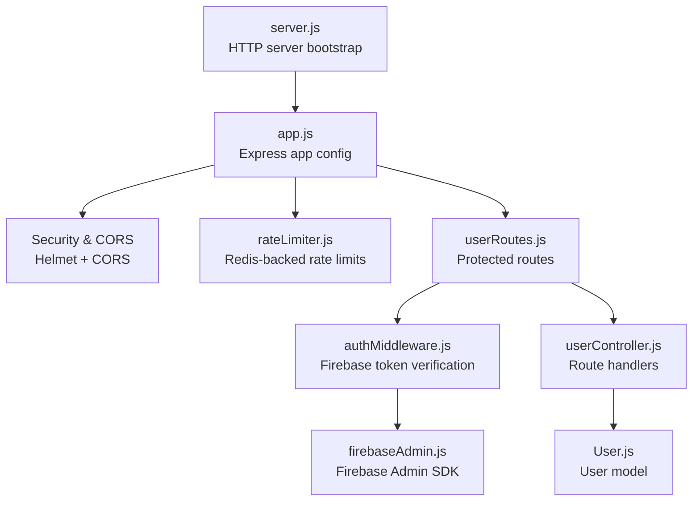
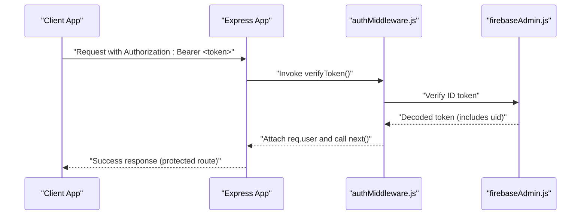
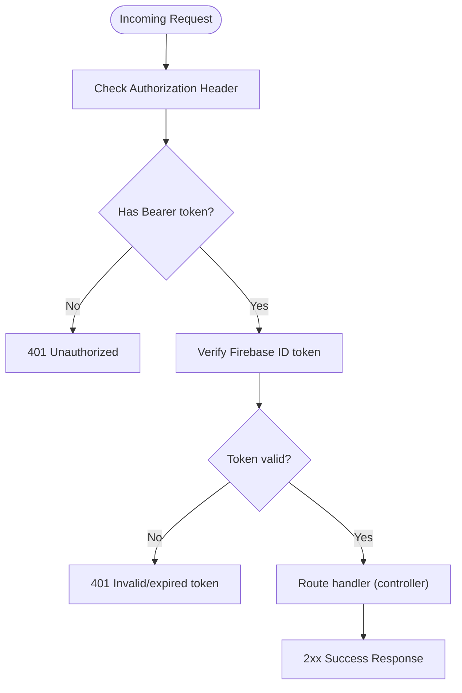
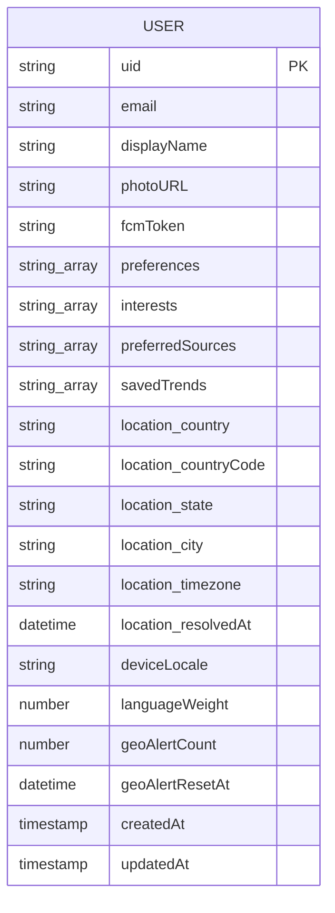
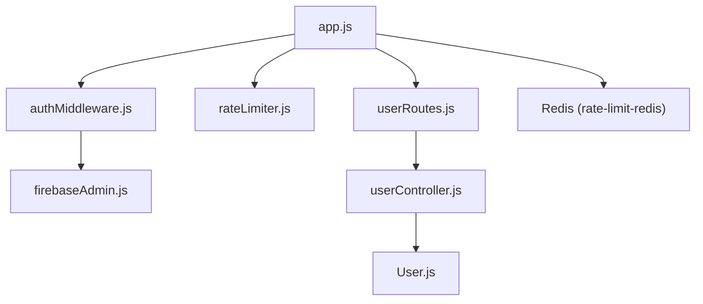

# Authentication API

<cite>
**Referenced Files in This Document**
- [server.js](file://backend/server.js)
- [app.js](file://backend/src/app.js)
- [rateLimiter.js](file://backend/src/middlewares/rateLimiter.js)
- [authMiddleware.js](file://backend/src/middlewares/authMiddleware.js)
- [firebaseAdmin.js](file://backend/src/utils/firebaseAdmin.js)
- [userRoutes.js](file://backend/src/routes/userRoutes.js)
- [userController.js](file://backend/src/controllers/userController.js)
- [User.js](file://backend/src/models/User.js)
- [package.json](file://backend/package.json)
</cite>

## Table of Contents
1. [Introduction](#introduction)
2. [Project Structure](#project-structure)
3. [Core Components](#core-components)
4. [Architecture Overview](#architecture-overview)
5. [Detailed Component Analysis](#detailed-component-analysis)
6. [Dependency Analysis](#dependency-analysis)
7. [Performance Considerations](#performance-considerations)
8. [Troubleshooting Guide](#troubleshooting-guide)
9. [Conclusion](#conclusion)
10. [Appendices](#appendices)

## Introduction
This document provides comprehensive API documentation for AITrendTracker's authentication system. The backend uses Firebase Authentication for identity verification and enforces strict rate limiting for security. Authentication is performed via Bearer tokens issued by Firebase, validated server-side using the Firebase Admin SDK. The system does not implement traditional username/password login or JWT issuance; instead, it expects clients to obtain a Firebase ID token and present it to the API.

Key capabilities:
- Firebase ID token verification for all protected routes
- Rate limiting for authentication endpoints
- Structured error responses for authentication failures
- CORS and security headers applied globally
- Health check endpoint for monitoring

## Project Structure
The authentication flow spans several backend modules:
- Application bootstrap initializes the HTTP server, database, and WebSocket services
- Express app configures security middleware, CORS, rate limiting, and routes
- Authentication middleware verifies Firebase ID tokens
- User routes are protected by the authentication middleware
- Controllers handle user-related operations after authentication
- Firebase Admin SDK is initialized for token verification

**Diagram sources**
- [server.js:1-51](file://backend/server.js#L1-L51)
- [app.js:1-88](file://backend/src/app.js#L1-L88)
- [rateLimiter.js:1-80](file://backend/src/middlewares/rateLimiter.js#L1-L80)
- [authMiddleware.js:1-27](file://backend/src/middlewares/authMiddleware.js#L1-L27)
- [firebaseAdmin.js:1-23](file://backend/src/utils/firebaseAdmin.js#L1-L23)
- [userRoutes.js:1-18](file://backend/src/routes/userRoutes.js#L1-L18)
- [userController.js:1-90](file://backend/src/controllers/userController.js#L1-L90)
- [User.js:1-35](file://backend/src/models/User.js#L1-L35)

**Section sources**
- [server.js:1-51](file://backend/server.js#L1-L51)
- [app.js:1-88](file://backend/src/app.js#L1-L88)

## Core Components
- Firebase Authentication Integration
  - Token verification is performed server-side using the Firebase Admin SDK
  - The auth middleware extracts the Bearer token from the Authorization header and validates it
  - On successful verification, the decoded token (containing uid) is attached to the request object for downstream use

- Protected Routes
  - All user-related endpoints under /api/users are protected by the auth middleware
  - Example endpoints include user sync, profile update, saved trends management, and geo profile retrieval

- Rate Limiting
  - Global API limiter: 100 requests per 15 minutes per IP
  - Authentication limiter: 20 requests per 15 minutes per IP for user endpoints
  - Heavy endpoint limiter: 10 requests per 5 minutes for compute-intensive routes

- Security Headers and CORS
  - Helmet is applied for standard security headers
  - CORS is enabled globally

- Health Check
  - GET /health returns a simple status response

**Section sources**
- [authMiddleware.js:1-27](file://backend/src/middlewares/authMiddleware.js#L1-L27)
- [userRoutes.js:1-18](file://backend/src/routes/userRoutes.js#L1-L18)
- [rateLimiter.js:1-80](file://backend/src/middlewares/rateLimiter.js#L1-L80)
- [app.js:1-88](file://backend/src/app.js#L1-L88)

## Architecture Overview
The authentication architecture centers on Firebase ID tokens and server-side verification. Clients obtain a Firebase ID token (via Firebase SDK) and include it in the Authorization header as a Bearer token. The auth middleware validates the token against Firebase Admin, and if valid, the request proceeds to the protected controller.

**Diagram sources**
- [authMiddleware.js:1-27](file://backend/src/middlewares/authMiddleware.js#L1-L27)
- [firebaseAdmin.js:1-23](file://backend/src/utils/firebaseAdmin.js#L1-L23)

## Detailed Component Analysis

### Authentication Flow and Endpoints
- Endpoint: POST /api/users/sync
  - Purpose: Sync user profile and resolve geo location
  - Authentication: Required (Bearer token)
  - Request body: uid, email, displayName, photoURL, deviceLocale
  - Response: success flag, user data, and geo resolution result
  - Notes: On success, geo location is auto-resolved from client IP

- Endpoint: PUT /api/users/profile
  - Purpose: Update user profile preferences and metadata
  - Authentication: Required (Bearer token)
  - Request body: preferences, fcmToken, displayName, photoURL, interests, preferredSources
  - Response: success flag and updated user data

- Endpoint: POST /api/users/save
  - Purpose: Save a trend to user's saved list
  - Authentication: Required (Bearer token)
  - Request body: trendId
  - Response: success flag and message

- Endpoint: GET /api/users/saved
  - Purpose: Retrieve user's saved trends
  - Authentication: Required (Bearer token)
  - Response: success flag and array of saved trend IDs

- Endpoint: DELETE /api/users/save/:trendId
  - Purpose: Remove a trend from saved list
  - Authentication: Required (Bearer token)
  - Path parameter: trendId
  - Response: success flag and message

- Endpoint: GET /api/users/geo-profile
  - Purpose: Retrieve user's resolved geo profile
  - Authentication: Required (Bearer token)
  - Response: success flag and geo profile object (country, state, city, timezone)

- Endpoint: POST /api/users/onboard
  - Purpose: Complete user onboarding with selected categories
  - Authentication: Required (Bearer token)
  - Request body: categories (array)
  - Response: success flag and completion message

**Diagram sources**
- [authMiddleware.js:1-27](file://backend/src/middlewares/authMiddleware.js#L1-L27)
- [userRoutes.js:1-18](file://backend/src/routes/userRoutes.js#L1-L18)
- [userController.js:1-90](file://backend/src/controllers/userController.js#L1-L90)

**Section sources**
- [userRoutes.js:1-18](file://backend/src/routes/userRoutes.js#L1-L18)
- [userController.js:1-90](file://backend/src/controllers/userController.js#L1-L90)

### Data Models
The User model stores authentication and profile information, including location data and preferences.

**Diagram sources**
- [User.js:1-35](file://backend/src/models/User.js#L1-L35)

**Section sources**
- [User.js:1-35](file://backend/src/models/User.js#L1-L35)

### Rate Limiting Policies
- Global API limiter: 100 requests per 15 minutes per IP address
- Authentication limiter: 20 requests per 15 minutes per IP address for /api/users/*
- Heavy endpoint limiter: 10 requests per 5 minutes per IP address for compute-intensive routes

Redis-backed stores synchronize limits across multiple server instances.

**Section sources**
- [rateLimiter.js:1-80](file://backend/src/middlewares/rateLimiter.js#L1-L80)

### Security Headers and CORS
- Helmet is applied to set standard security headers
- CORS is enabled globally, allowing cross-origin requests

**Section sources**
- [app.js:1-88](file://backend/src/app.js#L1-L88)

## Dependency Analysis
The authentication system relies on the following external dependencies:
- Firebase Admin SDK for token verification
- Redis via ioredis and rate-limit-redis for distributed rate limiting
- Helmet for security headers
- CORS for cross-origin support

**Diagram sources**
- [app.js:1-88](file://backend/src/app.js#L1-L88)
- [rateLimiter.js:1-80](file://backend/src/middlewares/rateLimiter.js#L1-L80)
- [authMiddleware.js:1-27](file://backend/src/middlewares/authMiddleware.js#L1-L27)
- [firebaseAdmin.js:1-23](file://backend/src/utils/firebaseAdmin.js#L1-L23)
- [userRoutes.js:1-18](file://backend/src/routes/userRoutes.js#L1-L18)
- [userController.js:1-90](file://backend/src/controllers/userController.js#L1-L90)
- [User.js:1-35](file://backend/src/models/User.js#L1-L35)

**Section sources**
- [package.json:14-38](file://backend/package.json#L14-L38)

## Performance Considerations
- Token verification occurs synchronously on each protected request; keep Authorization header minimal and avoid unnecessary retries
- Rate limiting is enforced per IP address; design client retry logic to respect limits
- Redis connectivity is critical for rate limiting; monitor Redis availability and latency
- Use efficient caching strategies for frequently accessed user data to reduce database load

## Troubleshooting Guide
Common authentication issues and resolutions:
- 401 Unauthorized: Missing or malformed Authorization header
  - Ensure the Authorization header is present and starts with "Bearer "
- 401 Invalid or expired token: Token verification failed
  - Re-authenticate the user to obtain a fresh Firebase ID token
  - Verify Firebase Admin SDK initialization and service account configuration
- Rate limit exceeded (429): Too many requests within the time window
  - Implement exponential backoff and respect the Retry-After header if provided by the client
  - Reduce request frequency for authentication endpoints
- CORS errors: Cross-origin requests blocked
  - Confirm that the client origin is permitted by the CORS configuration
- Internal server errors (500): Unexpected server-side exceptions
  - Check server logs for error details and stack traces

Debugging techniques:
- Enable verbose logging for authentication attempts and rate limit violations
- Monitor Redis metrics for rate limiter performance
- Validate Firebase Admin SDK credentials and service account JSON file

**Section sources**
- [authMiddleware.js:1-27](file://backend/src/middlewares/authMiddleware.js#L1-L27)
- [rateLimiter.js:1-80](file://backend/src/middlewares/rateLimiter.js#L1-L80)
- [app.js:81-85](file://backend/src/app.js#L81-L85)

## Conclusion
AITrendTracker's authentication system leverages Firebase Authentication for identity verification and enforces robust rate limiting for security. Clients must obtain a Firebase ID token and include it in the Authorization header for all protected requests. The system provides structured error responses and global security headers, while maintaining simplicity by delegating token issuance to Firebase.

## Appendices

### API Reference

- Base URL
  - Production: https://your-domain.com
  - Development: http://localhost:5000

- Authentication
  - Method: Bearer token
  - Header: Authorization: Bearer <Firebase ID token>

- Endpoints

  - POST /api/users/sync
    - Description: Sync user profile and resolve geo location
    - Authentication: Required
    - Request body:
      - uid: string
      - email: string
      - displayName: string (optional)
      - photoURL: string (optional)
      - deviceLocale: string (optional)
    - Response: success flag, user data, geo resolution result

  - PUT /api/users/profile
    - Description: Update user profile
    - Authentication: Required
    - Request body:
      - preferences: array of strings (optional)
      - fcmToken: string (optional)
      - displayName: string (optional)
      - photoURL: string (optional)
      - interests: array of strings (optional)
      - preferredSources: array of strings (optional)
    - Response: success flag, updated user data

  - POST /api/users/save
    - Description: Save a trend
    - Authentication: Required
    - Request body:
      - trendId: string
    - Response: success flag, message

  - GET /api/users/saved
    - Description: Get saved trends
    - Authentication: Required
    - Response: success flag, array of saved trend IDs

  - DELETE /api/users/save/:trendId
    - Description: Remove a saved trend
    - Authentication: Required
    - Path parameters:
      - trendId: string
    - Response: success flag, message

  - GET /api/users/geo-profile
    - Description: Get user's geo profile
    - Authentication: Required
    - Response: success flag, geo profile object

  - POST /api/users/onboard
    - Description: Complete onboarding
    - Authentication: Required
    - Request body:
      - categories: array of strings
    - Response: success flag, message

  - GET /health
    - Description: Health check
    - Response: status and message

- Error Responses
  - Unauthorized (401):
    - Missing or invalid Authorization header
    - Invalid or expired Firebase ID token
  - Too Many Requests (429):
    - Exceeded authentication rate limit
  - Internal Server Error (500):
    - Unexpected server-side exception

- Rate Limits
  - Global API: 100 requests per 15 minutes per IP
  - Authentication endpoints (/api/users/*): 20 requests per 15 minutes per IP
  - Heavy endpoints: 10 requests per 5 minutes per IP

- Security Headers
  - Helmet is applied for standard security headers
  - CORS is enabled globally

- CORS Configuration
  - Origin: Allow all origins
  - Methods: GET, POST, PUT, DELETE
  - Headers: Authorization, Content-Type
  - Credentials: Not explicitly configured

- Client Implementation Examples
  - Obtain Firebase ID token from the client SDK
  - Include Authorization: Bearer <token> in all protected requests
  - Handle 401 responses by re-authenticating the user
  - Respect rate limit responses and implement retry with backoff

- Mobile Integration Patterns
  - Store the Firebase ID token securely (platform-specific secure storage)
  - Refresh token automatically when receiving 401 responses
  - Use background sync for offline-capable flows
  - Implement exponential backoff for rate-limited requests