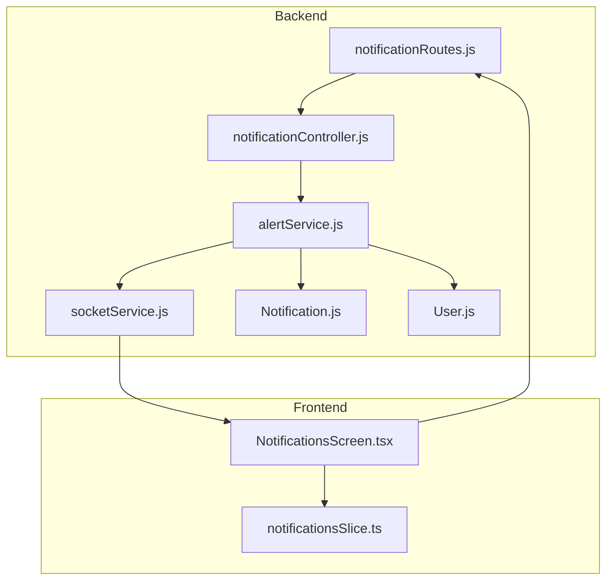
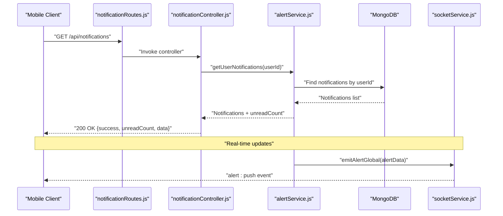
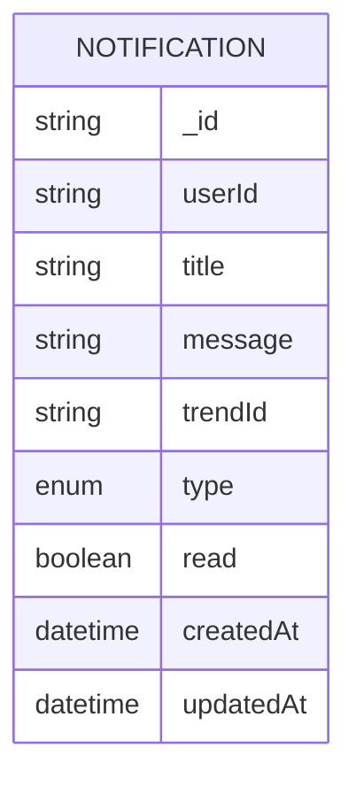
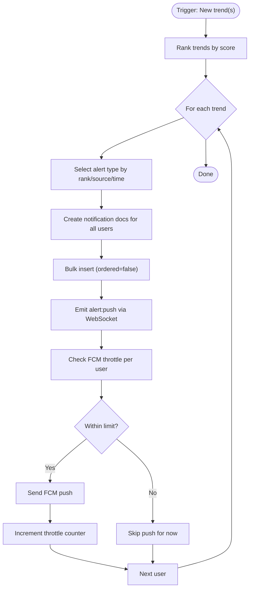
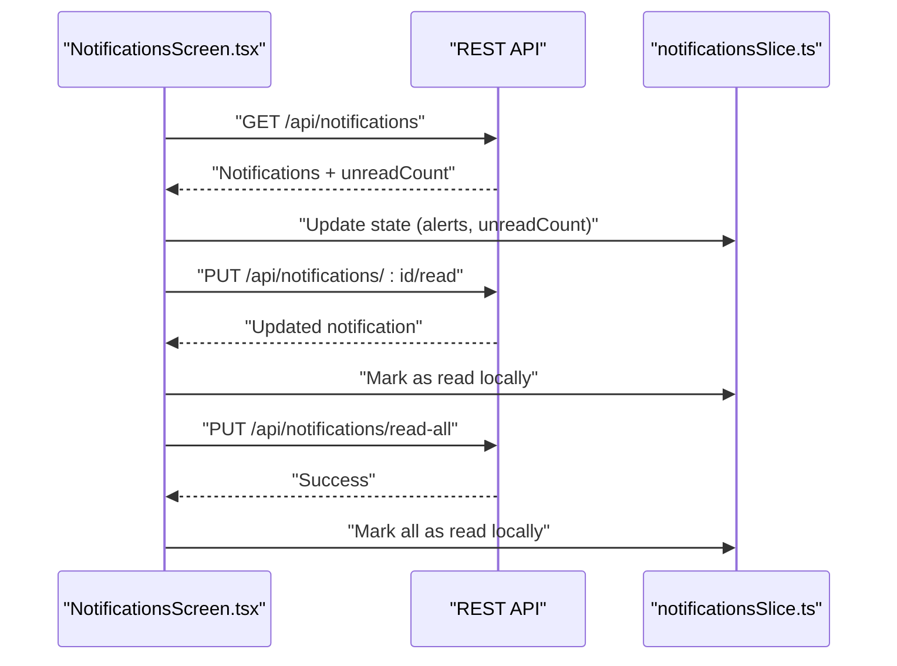
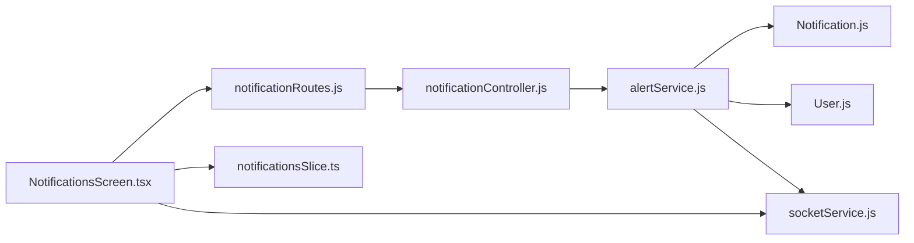

# Notification System API

<cite>
**Referenced Files in This Document**
- [notificationController.js](file://backend/src/controllers/notificationController.js)
- [notificationRoutes.js](file://backend/src/routes/notificationRoutes.js)
- [alertService.js](file://backend/src/services/alertService.js)
- [Notification.js](file://backend/src/models/Notification.js)
- [socketService.js](file://backend/src/services/socketService.js)
- [User.js](file://backend/src/models/User.js)
- [NotificationsScreen.tsx](file://AITrendTracker7/src/navigations/screens/NotificationsScreen.tsx)
- [notificationsSlice.ts](file://AITrendTracker7/src/store/slices/notificationsSlice.ts)
</cite>

## Table of Contents
1. [Introduction](#introduction)
2. [Project Structure](#project-structure)
3. [Core Components](#core-components)
4. [Architecture Overview](#architecture-overview)
5. [Detailed Component Analysis](#detailed-component-analysis)
6. [Dependency Analysis](#dependency-analysis)
7. [Performance Considerations](#performance-considerations)
8. [Troubleshooting Guide](#troubleshooting-guide)
9. [Conclusion](#conclusion)
10. [Appendices](#appendices)

## Introduction
This document provides comprehensive API documentation for AITrendTracker's notification system. It covers endpoints for retrieving, marking, and clearing notifications, as well as the internal alert pipeline that generates real-time push notifications, in-app messages, and WebSocket broadcasts. It also documents notification schemas, throttling policies, and integration points with Firebase Cloud Messaging (FCM), WebSocket broadcasting, and Redux-based client-side state.

## Project Structure
The notification system spans backend REST endpoints, a dedicated alert service, database models, and a WebSocket service. The frontend integrates with the backend via authenticated requests and consumes real-time updates through WebSocket connections.



**Diagram sources**
- [notificationRoutes.js:1-14](file://backend/src/routes/notificationRoutes.js#L1-L14)
- [notificationController.js:1-93](file://backend/src/controllers/notificationController.js#L1-L93)
- [alertService.js:1-282](file://backend/src/services/alertService.js#L1-L282)
- [socketService.js:1-107](file://backend/src/services/socketService.js#L1-L107)
- [Notification.js:1-39](file://backend/src/models/Notification.js#L1-L39)
- [User.js:1-35](file://backend/src/models/User.js#L1-L35)
- [NotificationsScreen.tsx:1-410](file://AITrendTracker7/src/navigations/screens/NotificationsScreen.tsx#L1-L410)
- [notificationsSlice.ts:1-57](file://AITrendTracker7/src/store/slices/notificationsSlice.ts#L1-L57)

**Section sources**
- [notificationRoutes.js:1-14](file://backend/src/routes/notificationRoutes.js#L1-L14)
- [notificationController.js:1-93](file://backend/src/controllers/notificationController.js#L1-L93)
- [alertService.js:1-282](file://backend/src/services/alertService.js#L1-L282)
- [socketService.js:1-107](file://backend/src/services/socketService.js#L1-L107)
- [Notification.js:1-39](file://backend/src/models/Notification.js#L1-L39)
- [User.js:1-35](file://backend/src/models/User.js#L1-L35)
- [NotificationsScreen.tsx:1-410](file://AITrendTracker7/src/navigations/screens/NotificationsScreen.tsx#L1-L410)
- [notificationsSlice.ts:1-57](file://AITrendTracker7/src/store/slices/notificationsSlice.ts#L1-L57)

## Core Components
- REST endpoints for notification management under a shared base path.
- Alert service orchestrating notification creation, deduplication, FCM throttling, and WebSocket broadcasts.
- MongoDB models for notifications and users, including indexes and fields supporting filtering and personalization.
- Frontend screens and Redux slice managing local notification state and UI interactions.

Key responsibilities:
- Backend: Authentication-required endpoints to list, mark read, mark all read, clear all, and get unread counts.
- Internal pipeline: Generate diverse alert types, persist in-app notifications, broadcast via WebSocket, and conditionally send FCM push notifications respecting throttling.

**Section sources**
- [notificationController.js:1-93](file://backend/src/controllers/notificationController.js#L1-L93)
- [alertService.js:1-282](file://backend/src/services/alertService.js#L1-L282)
- [Notification.js:1-39](file://backend/src/models/Notification.js#L1-L39)
- [User.js:1-35](file://backend/src/models/User.js#L1-L35)
- [NotificationsScreen.tsx:1-410](file://AITrendTracker7/src/navigations/screens/NotificationsScreen.tsx#L1-L410)
- [notificationsSlice.ts:1-57](file://AITrendTracker7/src/store/slices/notificationsSlice.ts#L1-L57)

## Architecture Overview
The notification architecture combines REST APIs, a background alert pipeline, real-time WebSocket updates, and persistent storage.



**Diagram sources**
- [notificationRoutes.js:1-14](file://backend/src/routes/notificationRoutes.js#L1-L14)
- [notificationController.js:1-93](file://backend/src/controllers/notificationController.js#L1-L93)
- [alertService.js:1-282](file://backend/src/services/alertService.js#L1-L282)
- [socketService.js:1-107](file://backend/src/services/socketService.js#L1-L107)

## Detailed Component Analysis

### REST API Endpoints
All endpoints require a valid JWT bearer token issued by the authentication middleware.

- Base path: `/api/notifications`
- Authentication: Required for all endpoints

Endpoints:
- GET `/`  
  - Description: Retrieve paginated notifications for the authenticated user, sorted by creation time descending, plus unread count.
  - Response: `{ success: boolean, unreadCount: number, data: Notification[] }`
  - Status codes: 200 on success; errors propagate via middleware.

- GET `/unread-count`  
  - Description: Fetch only the unread count for badge display.
  - Response: `{ success: boolean, unreadCount: number }`
  - Status codes: 200 on success.

- PUT `/read-all`  
  - Description: Mark all notifications as read for the user.
  - Response: `{ success: boolean, message: string }` indicating number modified.
  - Status codes: 200 on success.

- DELETE `/clear-all`  
  - Description: Delete all notifications for the user.
  - Response: `{ success: boolean, message: string }` indicating number deleted.
  - Status codes: 200 on success.

- PUT `/:id/read`  
  - Description: Mark a specific notification as read by ID.
  - Response: `{ success: boolean, data: Notification | null }`
  - Status codes: 200 on success; 404 if not found.

Example request/response (conceptual):
- Request: `GET /api/notifications` with Authorization: Bearer <token>
- Response: 
  ```json
  {
    "success": true,
    "unreadCount": 3,
    "data": [
      {
        "_id": "654321",
        "title": "🔥 Hot Trend Detected",
        "message": "\"Sample Trend\" is trending with a score of 95!",
        "type": "hot_trend",
        "trendId": "abc123",
        "createdAt": "2023-12-01T10:00:00Z",
        "updatedAt": "2023-12-01T10:00:00Z",
        "read": false
      }
    ]
  }
  ```

**Section sources**
- [notificationRoutes.js:1-14](file://backend/src/routes/notificationRoutes.js#L1-L14)
- [notificationController.js:1-93](file://backend/src/controllers/notificationController.js#L1-L93)

### Notification Data Model
The Notification model defines the schema persisted for each alert.

Fields:
- `userId`: String, required, indexed for fast lookups.
- `title`: String, required.
- `message`: String, required.
- `trendId`: String, optional, default null.
- `type`: Enum string, default `hot_trend`. Possible values include: `hot_trend`, `multi_source`, `viral_spike`, `system`, `rising`, `breaking`, `community`, `video`.
- `read`: Boolean, default false.
- Timestamps: `createdAt`, `updatedAt`.

Indexes:
- Compound index: `(userId, read, createdAt: -1)` for efficient unread retrieval.
- Unique sparse index: `(userId, trendId)` to prevent duplicate alerts for the same trend to the same user.



**Diagram sources**
- [Notification.js:1-39](file://backend/src/models/Notification.js#L1-L39)

**Section sources**
- [Notification.js:1-39](file://backend/src/models/Notification.js#L1-L39)

### Alert Generation and Delivery Pipeline
The alert service orchestrates notification creation, deduplication, real-time broadcasting, and push delivery with throttling.

Key operations:
- Batch alert processing: Given a ranked list of trends, construct diverse alert payloads by type and distribute to all users.
- Deduplicated insert: Bulk insert notifications while ignoring duplicate keys.
- Real-time delivery: Emit WebSocket events globally for immediate UI updates.
- Push delivery: For each user with a valid FCM token, check throttling, send push if allowed, and increment counters.

Throttling policy:
- FCM throttle: Maximum 3 pushes per device token per 2-hour rolling window. Enforced via a caching layer keyed by hashed device tokens.



**Diagram sources**
- [alertService.js:1-282](file://backend/src/services/alertService.js#L1-L282)

**Section sources**
- [alertService.js:1-282](file://backend/src/services/alertService.js#L1-L282)

### WebSocket Integration
WebSocket broadcasts are used for real-time UI updates without polling.

- Initialization: Socket.IO server with Redis adapter for multi-instance consistency.
- Rooms: Users join a room named by their user ID for targeted delivery.
- Events:
  - `alert:push`: Priority alert broadcast to all clients or a specific user room.
  - `ai:status:completed`: AI enrichment completion event for live UI patching.

Frontend consumption:
- The mobile screen fetches notifications on focus and listens for real-time events to update the UI immediately.

**Section sources**
- [socketService.js:1-107](file://backend/src/services/socketService.js#L1-L107)
- [NotificationsScreen.tsx:1-410](file://AITrendTracker7/src/navigations/screens/NotificationsScreen.tsx#L1-L410)

### Frontend Notification Management
The mobile client manages notification state locally and interacts with backend endpoints.

- Fetch notifications on screen focus.
- Mark individual notifications as read via endpoint and update local state.
- Mark all as read and clear all via respective endpoints.
- Local Redux slice maintains alerts array and unread count, updating UI accordingly.



**Diagram sources**
- [NotificationsScreen.tsx:1-410](file://AITrendTracker7/src/navigations/screens/NotificationsScreen.tsx#L1-L410)
- [notificationsSlice.ts:1-57](file://AITrendTracker7/src/store/slices/notificationsSlice.ts#L1-L57)

**Section sources**
- [NotificationsScreen.tsx:1-410](file://AITrendTracker7/src/navigations/screens/NotificationsScreen.tsx#L1-L410)
- [notificationsSlice.ts:1-57](file://AITrendTracker7/src/store/slices/notificationsSlice.ts#L1-L57)

### Notification Types and Templates
The alert service constructs distinct notification templates based on trend characteristics.

Common types:
- `viral_spike`: For top-ranked trends with strong growth momentum.
- `hot_trend`: For high-scoring recent trends.
- `multi_source`: For video or community-driven content.
- `system`: For breaking news within recent time windows.
- Additional internal types: `rising`, `breaking`, `community`, `video`.

Template fields:
- `title`: Short headline summarizing the alert.
- `message`: Contextual description with optional trend metadata.
- `type`: One of the enumerated types.
- `trendId`: Optional identifier linking to a specific trend.

These templates are persisted as in-app notifications and optionally broadcasted via WebSocket and sent as push notifications.

**Section sources**
- [alertService.js:1-282](file://backend/src/services/alertService.js#L1-L282)
- [Notification.js:1-39](file://backend/src/models/Notification.js#L1-L39)

### Personalization and Preferences
User profiles support personalization that can influence notification relevance.

Fields:
- `preferences`: Topic interests (e.g., categories).
- `interests`: Granular keywords (e.g., technologies, companies).
- `preferredSources`: Preferred content sources (e.g., YouTube, Reddit).
- Location and locale fields for geographic and language-awareness.

Note: The current alert pipeline broadcasts to all users. Personalized targeting would require extending the alert generation logic to filter users by preferences and interests.

**Section sources**
- [User.js:1-35](file://backend/src/models/User.js#L1-L35)

### Analytics, Open Rates, and Engagement Metrics
The current codebase does not implement analytics tracking for open rates or engagement metrics. To add this capability:
- Track read events when clients mark notifications as read.
- Record click-through events when users navigate to trend details.
- Persist analytics data and expose metrics endpoints.

[No sources needed since this section provides general guidance]

### Geofencing Notifications
User location fields exist in the user model, enabling future geofencing capabilities:
- Country, state, city, timezone.
- Geo-alert counters and reset timestamps.

Potential implementation:
- Filter trends by proximity to user location.
- Enforce per-user geo-alert throttling similar to FCM throttling.

**Section sources**
- [User.js:1-35](file://backend/src/models/User.js#L1-L35)

### Trend-Based Alerts and User-Triggered Notifications
- Trend-based alerts: Generated by the alert service based on trend scores, sources, and recency.
- User-triggered notifications: Not present in the current codebase. Implementation would require adding endpoints to create ad-hoc notifications and integrating with the existing alert pipeline.

**Section sources**
- [alertService.js:1-282](file://backend/src/services/alertService.js#L1-L282)

### Compliance and Anti-Spam Considerations
- FCM throttling: Limits pushes per device per time window to reduce spam.
- Deduplication: Unique index prevents duplicate alerts for the same trend to the same user.
- Graceful degradation: Cache failures still allow pushes; FCM send failures are logged but do not block the pipeline.

Recommendations:
- Respect user preferences and opt-out mechanisms.
- Provide clear unsubscribe/opt-out flows.
- Monitor and audit notification volumes.

**Section sources**
- [alertService.js:1-282](file://backend/src/services/alertService.js#L1-L282)
- [Notification.js:1-39](file://backend/src/models/Notification.js#L1-L39)

## Dependency Analysis
The notification system exhibits clear separation of concerns:
- Routes depend on controllers.
- Controllers delegate to the alert service.
- Alert service depends on models, cache, and WebSocket services.
- Frontend depends on REST endpoints and WebSocket events.



**Diagram sources**
- [notificationRoutes.js:1-14](file://backend/src/routes/notificationRoutes.js#L1-L14)
- [notificationController.js:1-93](file://backend/src/controllers/notificationController.js#L1-L93)
- [alertService.js:1-282](file://backend/src/services/alertService.js#L1-L282)
- [Notification.js:1-39](file://backend/src/models/Notification.js#L1-L39)
- [User.js:1-35](file://backend/src/models/User.js#L1-L35)
- [socketService.js:1-107](file://backend/src/services/socketService.js#L1-L107)
- [NotificationsScreen.tsx:1-410](file://AITrendTracker7/src/navigations/screens/NotificationsScreen.tsx#L1-L410)
- [notificationsSlice.ts:1-57](file://AITrendTracker7/src/store/slices/notificationsSlice.ts#L1-L57)

**Section sources**
- [notificationRoutes.js:1-14](file://backend/src/routes/notificationRoutes.js#L1-L14)
- [notificationController.js:1-93](file://backend/src/controllers/notificationController.js#L1-L93)
- [alertService.js:1-282](file://backend/src/services/alertService.js#L1-L282)
- [Notification.js:1-39](file://backend/src/models/Notification.js#L1-L39)
- [User.js:1-35](file://backend/src/models/User.js#L1-L35)
- [socketService.js:1-107](file://backend/src/services/socketService.js#L1-L107)
- [NotificationsScreen.tsx:1-410](file://AITrendTracker7/src/navigations/screens/NotificationsScreen.tsx#L1-L410)
- [notificationsSlice.ts:1-57](file://AITrendTracker7/src/store/slices/notificationsSlice.ts#L1-L57)

## Performance Considerations
- Indexing: Compound index on `(userId, read, createdAt: -1)` optimizes unread retrieval and sorting.
- Bulk inserts: Ordered bulk write with error tolerance reduces failure impact.
- Throttling: Redis-backed counters prevent excessive push notifications and reduce client-side churn.
- WebSocket scaling: Redis adapter ensures consistent broadcasts across instances.

[No sources needed since this section provides general guidance]

## Troubleshooting Guide
Common issues and resolutions:
- 404 on mark-as-read: Occurs when the notification ID does not belong to the authenticated user. Verify ownership and IDs.
- No real-time updates: Ensure WebSocket connection is established and the client is subscribed to the appropriate rooms.
- FCM delivery failures: Token may be invalid or expired; logs capture warnings but do not interrupt the pipeline.
- Duplicate alerts: Unique index prevents duplicates; if observed, investigate upstream duplication logic.

**Section sources**
- [notificationController.js:1-93](file://backend/src/controllers/notificationController.js#L1-L93)
- [alertService.js:1-282](file://backend/src/services/alertService.js#L1-L282)

## Conclusion
AITrendTracker’s notification system provides a robust foundation for delivering timely, relevant alerts across in-app, real-time, and push channels. The REST API offers essential management operations, while the alert service implements intelligent alert generation, deduplication, and throttling. Extending personalization, analytics, and user-triggered notifications would further enhance the system’s effectiveness and compliance posture.

## Appendices

### Endpoint Reference Summary
- GET `/api/notifications`  
  - Purpose: List notifications and unread count.
  - Auth: Required.
  - Response: `{ success, unreadCount, data }`.

- GET `/api/notifications/unread-count`  
  - Purpose: Badge unread count.
  - Auth: Required.
  - Response: `{ success, unreadCount }`.

- PUT `/api/notifications/read-all`  
  - Purpose: Mark all as read.
  - Auth: Required.
  - Response: `{ success, message }`.

- DELETE `/api/notifications/clear-all`  
  - Purpose: Clear all notifications.
  - Auth: Required.
  - Response: `{ success, message }`.

- PUT `/api/notifications/:id/read`  
  - Purpose: Mark a specific notification as read.
  - Auth: Required.
  - Response: `{ success, data }`.

[No sources needed since this section summarizes without analyzing specific files]