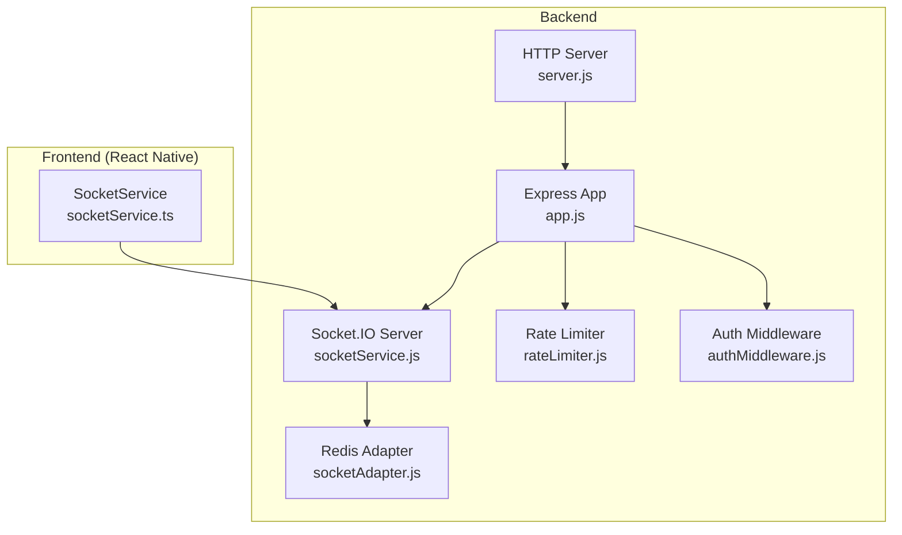
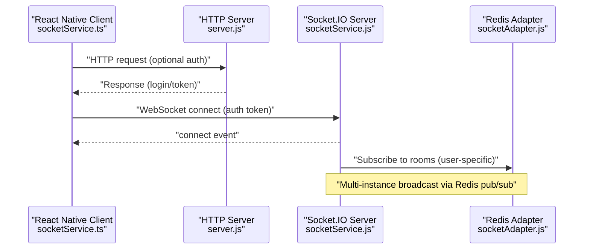
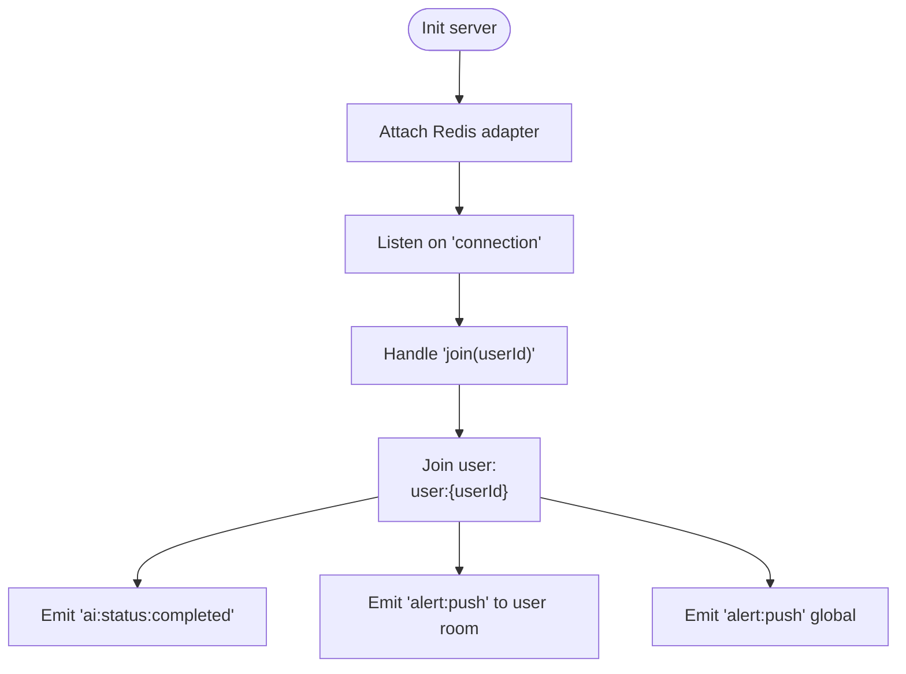
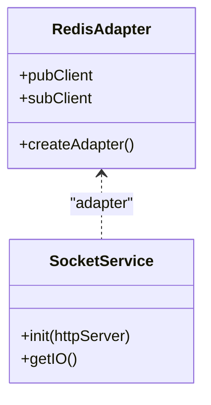
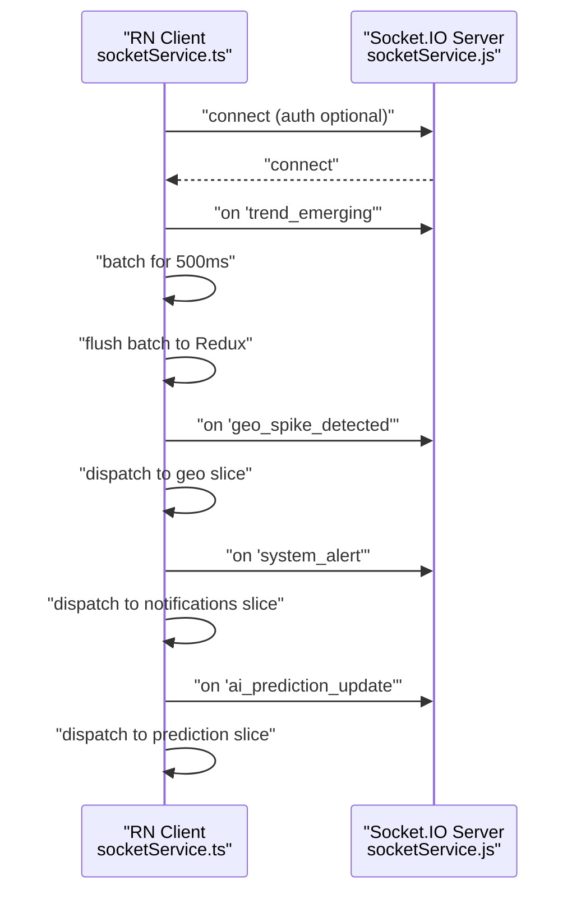
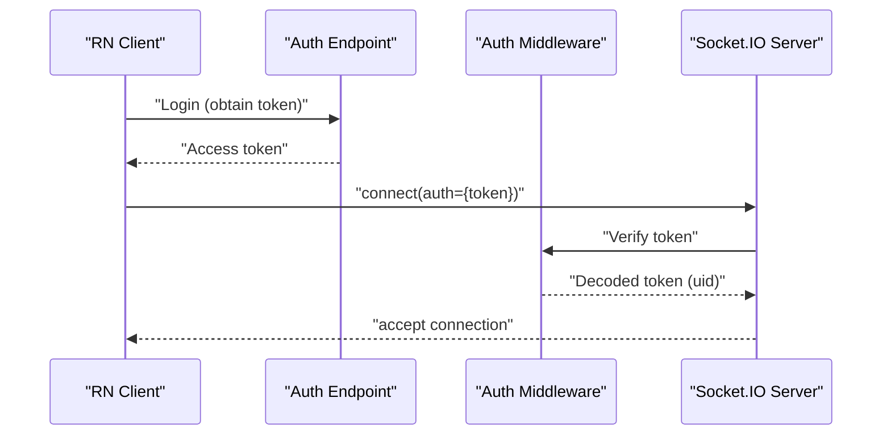
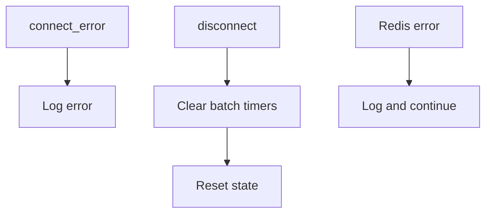
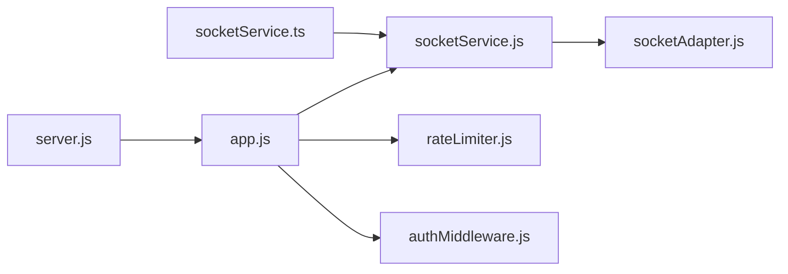

# Real-time WebSocket API

<cite>
**Referenced Files in This Document**
- [socketService.js](file://backend/src/services/socketService.js)
- [socketAdapter.js](file://backend/src/services/socketAdapter.js)
- [redis.js](file://backend/src/config/redis.js)
- [rateLimiter.js](file://backend/src/middlewares/rateLimiter.js)
- [authMiddleware.js](file://backend/src/middlewares/authMiddleware.js)
- [app.js](file://backend/src/app.js)
- [server.js](file://backend/server.js)
- [socketService.ts](file://AITrendTracker7/src/services/socketService.ts)
- [trendController.js](file://backend/src/controllers/trendController.js)
- [notificationController.js](file://backend/src/controllers/notificationController.js)
</cite>

## Table of Contents
1. [Introduction](#introduction)
2. [Project Structure](#project-structure)
3. [Core Components](#core-components)
4. [Architecture Overview](#architecture-overview)
5. [Detailed Component Analysis](#detailed-component-analysis)
6. [Dependency Analysis](#dependency-analysis)
7. [Performance Considerations](#performance-considerations)
8. [Troubleshooting Guide](#troubleshooting-guide)
9. [Conclusion](#conclusion)
10. [Appendices](#appendices)

## Introduction
This document describes AITrendTracker’s real-time WebSocket communication protocol. It covers connection establishment, authentication, session management, event types, message schemas, error handling, connection pooling and horizontal scaling with Redis, and practical guidance for building robust React Native clients with reconnection and recovery strategies. It also addresses security, rate limiting, bandwidth optimization, debugging, monitoring, and performance tuning.

## Project Structure
The WebSocket implementation spans the backend and the React Native frontend:
- Backend
  - HTTP server and Socket.IO initialization
  - Redis adapter for multi-instance broadcasting
  - Event emission helpers for AI completion and alerts
  - Rate limiting middleware for API protection
  - Authentication middleware for token verification
- Frontend (React Native)
  - Socket.IO client wrapper with transport selection, reconnection, and batching
  - Redux integration for real-time updates

**Diagram sources**
- [server.js:1-51](file://backend/server.js#L1-L51)
- [app.js:1-88](file://backend/src/app.js#L1-L88)
- [socketService.js:1-107](file://backend/src/services/socketService.js#L1-L107)
- [socketAdapter.js:1-22](file://backend/src/services/socketAdapter.js#L1-L22)
- [rateLimiter.js:1-80](file://backend/src/middlewares/rateLimiter.js#L1-L80)
- [authMiddleware.js:1-27](file://backend/src/middlewares/authMiddleware.js#L1-L27)
- [socketService.ts:1-110](file://AITrendTracker7/src/services/socketService.ts#L1-L110)

**Section sources**
- [server.js:1-51](file://backend/server.js#L1-L51)
- [app.js:1-88](file://backend/src/app.js#L1-L88)
- [socketService.js:1-107](file://backend/src/services/socketService.js#L1-L107)
- [socketAdapter.js:1-22](file://backend/src/services/socketAdapter.js#L1-L22)
- [rateLimiter.js:1-80](file://backend/src/middlewares/rateLimiter.js#L1-L80)
- [authMiddleware.js:1-27](file://backend/src/middlewares/authMiddleware.js#L1-L27)
- [socketService.ts:1-110](file://AITrendTracker7/src/services/socketService.ts#L1-L110)

## Core Components
- Backend Socket.IO server
  - Initializes the server with ping intervals and CORS
  - Attaches Redis adapter for multi-instance broadcast consistency
  - Handles join events to subscribe sockets to user-specific rooms
  - Emits targeted events for AI completion and alerts
- Redis adapter
  - Provides horizontal scaling via Redis pub/sub
- Rate limiting
  - Distributed rate limits using Redis stores
- Authentication
  - Firebase ID token verification middleware
- Frontend Socket.IO client
  - Configured transport, reconnection, and auth
  - Event handlers for live trends, geospatial spikes, system alerts, and AI predictions
  - Batching and throttling to optimize UI updates

**Section sources**
- [socketService.js:17-55](file://backend/src/services/socketService.js#L17-L55)
- [socketAdapter.js:10-19](file://backend/src/services/socketAdapter.js#L10-L19)
- [rateLimiter.js:19-77](file://backend/src/middlewares/rateLimiter.js#L19-L77)
- [authMiddleware.js:3-24](file://backend/src/middlewares/authMiddleware.js#L3-L24)
- [socketService.ts:17-68](file://AITrendTracker7/src/services/socketService.ts#L17-L68)

## Architecture Overview
The WebSocket layer sits atop the HTTP server and integrates with Redis for horizontal scaling. Clients connect via WebSocket, optionally authenticated, and receive targeted or broadcast events.

**Diagram sources**
- [server.js:24-28](file://backend/server.js#L24-L28)
- [socketService.js:20-37](file://backend/src/services/socketService.js#L20-L37)
- [socketAdapter.js:10-19](file://backend/src/services/socketAdapter.js#L10-L19)
- [socketService.ts:20-28](file://AITrendTracker7/src/services/socketService.ts#L20-L28)

## Detailed Component Analysis

### Backend WebSocket Server
- Initialization
  - Creates Socket.IO server bound to HTTP server
  - Enables CORS and sets heartbeat intervals
  - Attaches Redis adapter for multi-node consistency
- Room management
  - Clients join a room named after their user ID
  - Events can be emitted to a specific room or globally
- Emission helpers
  - AI enrichment completion event
  - User-scoped and global alert events
  - Timestamps included in emitted payloads

**Diagram sources**
- [socketService.js:20-51](file://backend/src/services/socketService.js#L20-L51)
- [socketService.js:62-91](file://backend/src/services/socketService.js#L62-L91)
- [socketAdapter.js:10-19](file://backend/src/services/socketAdapter.js#L10-L19)

**Section sources**
- [socketService.js:17-55](file://backend/src/services/socketService.js#L17-L55)
- [socketService.js:62-91](file://backend/src/services/socketService.js#L62-L91)

### Redis Adapter for Horizontal Scaling
- Creates separate Redis clients for pub/sub
- Wraps them into a Socket.IO adapter
- Centralized logging for adapter errors

**Diagram sources**
- [socketAdapter.js:10-19](file://backend/src/services/socketAdapter.js#L10-L19)
- [socketService.js:20-36](file://backend/src/services/socketService.js#L20-L36)

**Section sources**
- [socketAdapter.js:10-19](file://backend/src/services/socketAdapter.js#L10-L19)

### Frontend Socket.IO Client
- Transport and reconnection
  - Forces WebSocket transport
  - Infinite reconnection attempts with capped delay
  - Optional auth token passed on connect
- Event handlers
  - Live trend updates with 500ms batching to reduce layout thrashing
  - Geospatial spike detection
  - System alerts
  - AI prediction updates
- Cleanup
  - Removes listeners and clears batch timers on disconnect

**Diagram sources**
- [socketService.ts:17-68](file://AITrendTracker7/src/services/socketService.ts#L17-L68)
- [socketService.js:38-51](file://backend/src/services/socketService.js#L38-L51)

**Section sources**
- [socketService.ts:17-68](file://AITrendTracker7/src/services/socketService.ts#L17-L68)
- [socketService.ts:70-84](file://AITrendTracker7/src/services/socketService.ts#L70-L84)

### Authentication and Session Management
- Authentication middleware verifies Firebase ID tokens from Authorization headers
- On successful verification, the decoded token (including user identifier) is attached to the request
- Frontend passes the token in the Socket.IO auth object during connection

**Diagram sources**
- [authMiddleware.js:3-24](file://backend/src/middlewares/authMiddleware.js#L3-L24)
- [socketService.ts:27](file://AITrendTracker7/src/services/socketService.ts#L27)
- [socketService.js:41-46](file://backend/src/services/socketService.js#L41-L46)

**Section sources**
- [authMiddleware.js:3-24](file://backend/src/middlewares/authMiddleware.js#L3-L24)
- [socketService.ts:27](file://AITrendTracker7/src/services/socketService.ts#L27)
- [socketService.js:41-46](file://backend/src/services/socketService.js#L41-L46)

### Event Types, Message Formats, and Payloads
- Live trend updates
  - Event: trend_emerging
  - Purpose: stream newly emerging trends to clients
  - Payload: trend object (schema defined by the backend trend model)
  - Batching: client batches updates for 500ms to avoid UI thrash
- Geospatial spike detection
  - Event: geo_spike_detected
  - Purpose: notify clients of significant regional spikes
  - Payload: geospatial alert object (region, magnitude, timestamp)
- System alerts
  - Event: system_alert
  - Purpose: system-wide or user-scoped urgent notices
  - Payload: alert object (title, message, severity, optional user scope)
- AI prediction updates
  - Event: ai_prediction_update
  - Purpose: incremental updates to AI-driven predictions
  - Payload: prediction node object (trendId, forecast, confidence bands)
- AI enrichment completion
  - Event: ai:status:completed
  - Purpose: indicate completion of AI enrichment for a trend
  - Payload: { trendId, analysis, timestamp }
- Priority push alerts
  - Event: alert:push
  - Purpose: broadcast or room-scoped push alerts
  - Payload: alert object with timestamp

Note: The exact field definitions for trend, alert, and prediction objects are determined by the backend services and controllers. Clients should treat payloads as opaque and dispatch them to appropriate Redux slices.

**Section sources**
- [socketService.ts:46-67](file://AITrendTracker7/src/services/socketService.ts#L46-L67)
- [socketService.js:62-91](file://backend/src/services/socketService.js#L62-L91)

### Error Handling Patterns
- Backend
  - Redis adapter errors logged centrally
  - Connection lifecycle events logged (connect, disconnect, connect_error)
- Frontend
  - Logs connection status and errors
  - Clears batch timers and queues on disconnect to prevent memory leaks
  - Retries indefinitely with exponential backoff-like delays

**Diagram sources**
- [socketService.ts:35-43](file://AITrendTracker7/src/services/socketService.ts#L35-L43)
- [socketService.js:38-50](file://backend/src/services/socketService.js#L38-L50)
- [socketAdapter.js:14-15](file://backend/src/services/socketAdapter.js#L14-L15)

**Section sources**
- [socketService.ts:35-43](file://AITrendTracker7/src/services/socketService.ts#L35-L43)
- [socketService.js:38-50](file://backend/src/services/socketService.js#L38-L50)
- [socketAdapter.js:14-15](file://backend/src/services/socketAdapter.js#L14-L15)

### Security, Rate Limiting, and Bandwidth Optimization
- Security
  - Token-based authentication via Firebase ID tokens
  - CORS configured for safe cross-origin access
- Rate limiting
  - API-level, auth-level, and heavy-operation rate limits backed by Redis
  - Centralized counters synchronized across instances
- Bandwidth optimization
  - Client-side batching for trend_emerging events
  - Single transport preference (WebSocket) reduces overhead
  - Minimal payload timestamps included only when needed

**Section sources**
- [authMiddleware.js:3-24](file://backend/src/middlewares/authMiddleware.js#L3-L24)
- [rateLimiter.js:19-77](file://backend/src/middlewares/rateLimiter.js#L19-L77)
- [socketService.ts:46-52](file://AITrendTracker7/src/services/socketService.ts#L46-L52)
- [socketService.ts:20-28](file://AITrendTracker7/src/services/socketService.ts#L20-L28)

## Dependency Analysis
- Backend dependencies
  - HTTP server depends on Express app
  - Socket.IO server depends on Redis adapter
  - Controllers depend on services; services depend on models and external systems
- Frontend dependencies
  - SocketService depends on Socket.IO client and Redux store
  - Controllers and services define the data contracts consumed by the client

**Diagram sources**
- [server.js:1-51](file://backend/server.js#L1-L51)
- [app.js:1-88](file://backend/src/app.js#L1-L88)
- [socketService.js:1-107](file://backend/src/services/socketService.js#L1-L107)
- [socketAdapter.js:1-22](file://backend/src/services/socketAdapter.js#L1-L22)
- [rateLimiter.js:1-80](file://backend/src/middlewares/rateLimiter.js#L1-L80)
- [authMiddleware.js:1-27](file://backend/src/middlewares/authMiddleware.js#L1-L27)
- [socketService.ts:1-110](file://AITrendTracker7/src/services/socketService.ts#L1-L110)

**Section sources**
- [server.js:1-51](file://backend/server.js#L1-L51)
- [app.js:1-88](file://backend/src/app.js#L1-L88)
- [socketService.js:1-107](file://backend/src/services/socketService.js#L1-L107)
- [socketAdapter.js:1-22](file://backend/src/services/socketAdapter.js#L1-L22)
- [rateLimiter.js:1-80](file://backend/src/middlewares/rateLimiter.js#L1-L80)
- [authMiddleware.js:1-27](file://backend/src/middlewares/authMiddleware.js#L1-L27)
- [socketService.ts:1-110](file://AITrendTracker7/src/services/socketService.ts#L1-L110)

## Performance Considerations
- Connection pooling and scaling
  - Use the Redis adapter to enable multi-instance broadcasting
  - Ensure Redis availability and network latency are monitored
- Client-side batching
  - Keep the 500ms trend batch window tuned for your data volume
  - Consider dynamic thresholds based on device performance
- Heartbeats and timeouts
  - Adjust ping interval and timeout to balance responsiveness and battery/network costs
- Payload sizes
  - Send minimal fields; include timestamps only when needed
  - Defer heavy analytics payloads to demand-driven endpoints

[No sources needed since this section provides general guidance]

## Troubleshooting Guide
- Connection issues
  - Verify backend logs for adapter initialization and connection events
  - Confirm frontend reconnection attempts and delays
- Authentication failures
  - Check token presence and validity in the auth middleware
  - Ensure the frontend passes the token in the auth object
- Event delivery
  - Confirm clients join the correct user room
  - Validate event names match between client and server
- Redis connectivity
  - Monitor adapter client errors and fallback to single-instance mode logs

**Section sources**
- [socketService.js:38-50](file://backend/src/services/socketService.js#L38-L50)
- [socketService.ts:35-43](file://AITrendTracker7/src/services/socketService.ts#L35-L43)
- [authMiddleware.js:3-24](file://backend/src/middlewares/authMiddleware.js#L3-L24)
- [socketAdapter.js:14-15](file://backend/src/services/socketAdapter.js#L14-L15)

## Conclusion
AITrendTracker’s WebSocket layer provides a scalable, horizontally distributable real-time pipeline. The backend offers explicit room-based targeting and targeted alerting, while the frontend implements robust reconnection, batching, and Redux integration. Combined with Redis-backed rate limiting and Firebase-based authentication, the system supports high-volume, low-latency updates with strong operational controls.

[No sources needed since this section summarizes without analyzing specific files]

## Appendices

### Appendix A: Client Implementation Notes (React Native)
- Transport and auth
  - Force WebSocket transport and pass the auth token on connect
- Reconnection and backoff
  - Enable infinite retries with bounded delays
- Event handling
  - Subscribe to trend_emerging, geo_spike_detected, system_alert, and ai_prediction_update
  - Batch trend_emerging updates for 500ms
- Cleanup
  - Remove listeners and clear timers on disconnect

**Section sources**
- [socketService.ts:17-68](file://AITrendTracker7/src/services/socketService.ts#L17-L68)
- [socketService.ts:86-102](file://AITrendTracker7/src/services/socketService.ts#L86-L102)

### Appendix B: Backend Initialization and Routing
- HTTP server creation and Socket.IO binding
- Route registration and admin dashboard
- Background workers and cron jobs

**Section sources**
- [server.js:13-46](file://backend/server.js#L13-L46)
- [app.js:59-62](file://backend/src/app.js#L59-L62)