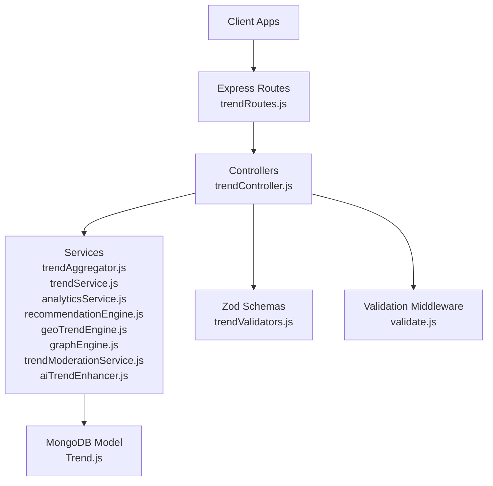
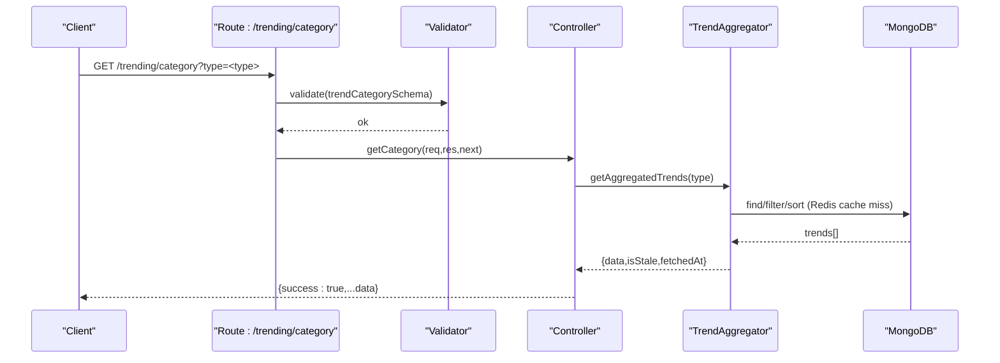
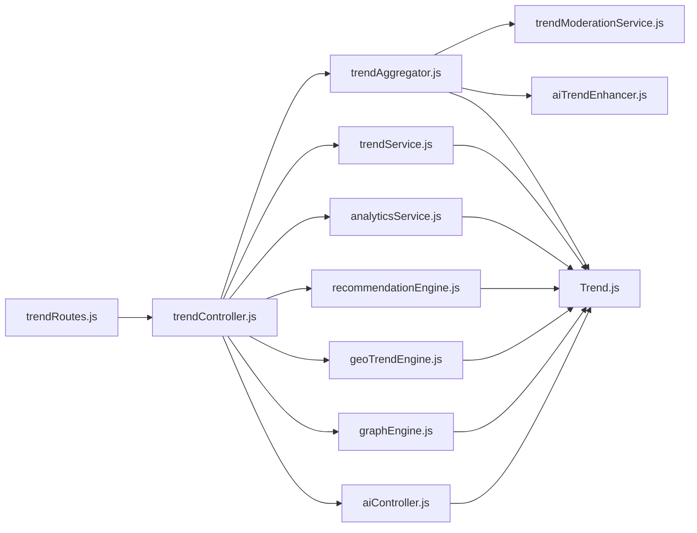

# Trend Management API

<cite>
**Referenced Files in This Document**
- [trendRoutes.js](file://backend/src/routes/trendRoutes.js)
- [trendController.js](file://backend/src/controllers/trendController.js)
- [trendService.js](file://backend/src/services/trendService.js)
- [Trend.js](file://backend/src/models/Trend.js)
- [trendValidators.js](file://backend/src/validators/trendValidators.js)
- [validate.js](file://backend/src/middlewares/validate.js)
- [trendAggregator.js](file://backend/src/services/trendAggregator.js)
- [aiController.js](file://backend/src/controllers/aiController.js)
- [analyticsService.js](file://backend/src/services/analyticsService.js)
- [recommendationEngine.js](file://backend/src/services/recommendationEngine.js)
- [geoTrendEngine.js](file://backend/src/services/geoTrendEngine.js)
- [graphEngine.js](file://backend/src/services/graphEngine.js)
- [trendModerationService.js](file://backend/src/services/trendModerationService.js)
- [aiTrendEnhancer.js](file://backend/src/services/aiTrendEnhancer.js)
- [userRoutes.js](file://backend/src/routes/userRoutes.js)
</cite>

## Table of Contents
1. [Introduction](#introduction)
2. [Project Structure](#project-structure)
3. [Core Components](#core-components)
4. [Architecture Overview](#architecture-overview)
5. [Detailed Component Analysis](#detailed-component-analysis)
6. [Dependency Analysis](#dependency-analysis)
7. [Performance Considerations](#performance-considerations)
8. [Troubleshooting Guide](#troubleshooting-guide)
9. [Conclusion](#conclusion)
10. [Appendices](#appendices)

## Introduction
This document provides comprehensive API documentation for AITrendTracker’s trend management endpoints. It covers public and authenticated feeds, trend retrieval, enrichment, analytics, geospatial features, relationship graphs, and moderation workflows. It also documents request/response schemas, validation rules, pagination and sorting strategies, and operational guidelines for administrators.

## Project Structure
The backend exposes REST endpoints under the trends domain, validated by Zod schemas and enforced by a shared validation middleware. Controllers orchestrate service-layer logic, including aggregation, moderation, analytics, recommendation, geospatial scanning, and graph building. Models define the trend data schema, including scoring, confidence metrics, and geographic fields.

**Diagram sources**
- [trendRoutes.js:1-50](file://backend/src/routes/trendRoutes.js#L1-L50)
- [trendController.js:1-407](file://backend/src/controllers/trendController.js#L1-L407)
- [trendService.js:1-64](file://backend/src/services/trendService.js#L1-L64)
- [Trend.js:1-188](file://backend/src/models/Trend.js#L1-L188)
- [trendValidators.js:1-41](file://backend/src/validators/trendValidators.js#L1-L41)
- [validate.js:1-23](file://backend/src/middlewares/validate.js#L1-L23)

**Section sources**
- [trendRoutes.js:1-50](file://backend/src/routes/trendRoutes.js#L1-L50)
- [trendController.js:1-407](file://backend/src/controllers/trendController.js#L1-L407)
- [trendService.js:1-64](file://backend/src/services/trendService.js#L1-L64)
- [Trend.js:1-188](file://backend/src/models/Trend.js#L1-L188)
- [trendValidators.js:1-41](file://backend/src/validators/trendValidators.js#L1-L41)
- [validate.js:1-23](file://backend/src/middlewares/validate.js#L1-L23)

## Core Components
- Route layer: Defines endpoints for public/explore feeds, category/location/search filters, personalized feeds, interactions, bookmarks, detail endpoints, AI analysis, graph, and prediction.
- Controller layer: Implements business logic, orchestrates service calls, and returns standardized JSON responses with a success envelope.
- Service layer: Provides domain-specific operations such as search, comparison, analytics, recommendation, geospatial scanning, graph building, and moderation.
- Model layer: Defines the trend schema with scoring, confidence metrics, geographic data, clustering fields, and moderation status.
- Validation: Zod schemas and a reusable validation middleware ensure request integrity.

**Section sources**
- [trendRoutes.js:1-50](file://backend/src/routes/trendRoutes.js#L1-L50)
- [trendController.js:1-407](file://backend/src/controllers/trendController.js#L1-L407)
- [trendService.js:1-64](file://backend/src/services/trendService.js#L1-L64)
- [Trend.js:1-188](file://backend/src/models/Trend.js#L1-L188)
- [trendValidators.js:1-41](file://backend/src/validators/trendValidators.js#L1-L41)
- [validate.js:1-23](file://backend/src/middlewares/validate.js#L1-L23)

## Architecture Overview
The API follows a layered architecture:
- Public endpoints return aggregated, filtered, and scored trends.
- Authenticated endpoints enable personalized feeds, interactions, and bookmarks.
- Moderation and anti-spam safeguards protect data quality.
- AI enrichment augments trends with summaries, categories, and predictions.
- Analytics and prediction engines enrich trend lifecycle insights.
- Geospatial engine detects emerging trends and emits targeted alerts.
- Graph engine builds contextual relationships among trends.

**Diagram sources**
- [trendRoutes.js:15-15](file://backend/src/routes/trendRoutes.js#L15-L15)
- [trendValidators.js:3-7](file://backend/src/validators/trendValidators.js#L3-L7)
- [validate.js:4-20](file://backend/src/middlewares/validate.js#L4-L20)
- [trendController.js:34-43](file://backend/src/controllers/trendController.js#L34-L43)
- [trendAggregator.js:21-173](file://backend/src/services/trendAggregator.js#L21-L173)

## Detailed Component Analysis

### Public Feeds and Filters
- Home feed: Aggregated trends for the home category.
- Explore feed: Aggregated trends across all categories.
- Category feed: Filtered by type query parameter.
- Location feed: Filtered by country query parameter.
- Search: Full-text search across title, category, and content.
- Compare: Compares two trends by ID and returns a winner.

Response envelope:
- success: boolean
- data: array or object depending on endpoint
- Additional metadata such as isStale, fetchedAt, region, etc.

Validation:
- Category, search, location, and compare endpoints use Zod schemas to validate query parameters.

Pagination and sorting:
- TrendService sorts by trendScore descending for category, location, and top lists.
- TrendAggregator applies ranking and limits to 15 items.

**Section sources**
- [trendRoutes.js:13-18](file://backend/src/routes/trendRoutes.js#L13-L18)
- [trendController.js:16-79](file://backend/src/controllers/trendController.js#L16-L79)
- [trendService.js:4-28](file://backend/src/services/trendService.js#L4-L28)
- [trendValidators.js:3-32](file://backend/src/validators/trendValidators.js#L3-L32)
- [validate.js:4-20](file://backend/src/middlewares/validate.js#L4-L20)

### Personalized and For-You Feeds
- Personalized feed: Returns aggregated trends with optional personalization if user interests/profiles are present.
- For You feed: Geo-personalized feed with auto or explicit scope (local, national, global), interleaving ratios, and language boosts.
- Emerging feed: Regional emerging trends based on user geo-profile.

Response envelope:
- success: boolean
- personalized: boolean
- fromCache: boolean (for geo-personalized)
- scope: string
- data: array of trend objects
- fetchedAt: ISO timestamp

**Section sources**
- [trendController.js:142-285](file://backend/src/controllers/trendController.js#L142-L285)
- [recommendationEngine.js:27-96](file://backend/src/services/recommendationEngine.js#L27-L96)

### Trend Detail Endpoints
- By ID: Retrieve a single trend by trendId.
- Stats: Backward-compatible analytics payload (mapped to new analytics).
- Analytics: Historical analytics for a trend (graph data, metrics, regional distribution).
- History: Raw historical snapshots for a trend.
- AI Analysis: AI-generated insights for a trend (status-pending handling).
- Graph: Hydrated relationship graph for a trend.
- Prediction: Viral spread prediction for a trend.

Response envelope:
- success: boolean
- data: object or array depending on endpoint
- fetchedAt: ISO timestamp (where applicable)

**Section sources**
- [trendRoutes.js:35-47](file://backend/src/routes/trendRoutes.js#L35-L47)
- [trendController.js:81-140](file://backend/src/controllers/trendController.js#L81-L140)
- [trendController.js:287-406](file://backend/src/controllers/trendController.js#L287-L406)
- [aiController.js:3-46](file://backend/src/controllers/aiController.js#L3-L46)
- [analyticsService.js:76-150](file://backend/src/services/analyticsService.js#L76-L150)
- [graphEngine.js:172-198](file://backend/src/services/graphEngine.js#L172-L198)

### Interaction Tracking and Bookmarks
- Interaction tracking: Records user interactions (click, like, bookmark, share, skip) with weights and optional scope.
- Bookmark toggle: Adds or removes a trend from user’s saved list and records interaction for recommendation.

Response envelope:
- success: boolean
- data: interaction record or activity summary
- bookmarked: boolean (toggle response)
- message: status message

**Section sources**
- [trendController.js:287-363](file://backend/src/controllers/trendController.js#L287-L363)
- [userRoutes.js:9-12](file://backend/src/routes/userRoutes.js#L9-L12)

### Trend Enrichment and Moderation Workflows
- Moderation: Anti-spam and manipulation protection via reliability multipliers applied to engagement scores.
- AI Enhancement: Batch enrichment with Gemini API, caching, and fallbacks.
- Aggregation: Multi-source ingestion, deduplication, fusion, clustering, ranking, and caching.

Response envelope:
- Standardized success envelope; moderation modifies internal engagement scores prior to ranking.

**Section sources**
- [trendModerationService.js:25-59](file://backend/src/services/trendModerationService.js#L25-L59)
- [aiTrendEnhancer.js:35-94](file://backend/src/services/aiTrendEnhancer.js#L35-L94)
- [trendAggregator.js:89-173](file://backend/src/services/trendAggregator.js#L89-L173)

### Geospatial Intelligence and Alerts
- Heatmap: Coarse city-level heatmap payload with weights and counts.
- Emerging detection: Hourly scan for regional velocity spikes; flags isEmerging and emits alerts.
- Geo-aware recommendations: Boosts and labeling for local/national/global scopes.

Response envelope:
- Heatmap: {success:true,data:[{city,country,weight,count,topTrend,lat,lng}],fetchedAt}
- Emerging: {success:true,region,data[],fetchedAt}

**Section sources**
- [trendController.js:249-261](file://backend/src/controllers/trendController.js#L249-L261)
- [geoTrendEngine.js:246-302](file://backend/src/services/geoTrendEngine.js#L246-L302)
- [geoTrendEngine.js:59-116](file://backend/src/services/geoTrendEngine.js#L59-L116)

### Trend Relationship Graph
- Build relationships: Keyword overlap-based linking with threshold and caps.
- Retrieve graph: Hydrated graph for a trend including related trends and metadata.

Response envelope:
- {success:true,trend,relatedTrends,graphSize,fetchedAt}

**Section sources**
- [graphEngine.js:73-141](file://backend/src/services/graphEngine.js#L73-L141)
- [graphEngine.js:172-198](file://backend/src/services/graphEngine.js#L172-L198)
- [trendRoutes.js:44-44](file://backend/src/routes/trendRoutes.js#L44-L44)

### Request/Response Schemas and Validation
Validation schemas ensure required parameters and enforce minimal length constraints. The validation middleware standardizes error responses with field-level details.

Common validations:
- Category: type query param required
- Search: q query param required
- Location: country query param required
- Compare: id1 and id2 query params required
- Detail: id param required

Error response:
- {success:false,message:"Validation failed",errors:[{field,message}]}

**Section sources**
- [trendValidators.js:3-32](file://backend/src/validators/trendValidators.js#L3-L32)
- [validate.js:4-20](file://backend/src/middlewares/validate.js#L4-L20)

### Trend Data Model Reference
Core fields (selected):
- Identity: trendId, title, category, time, readTime, author, growth, image, content, sourceUrl
- Ingestion: engagementScore, type, publishedAt
- Scoring: trendScore, scoring (viralScore, heatScore, growthScore, compositeScore), scoreHistory
- AI Confidence: aiConfidence (score, sourceConsistency, dataCompleteness, evaluatedAt)
- Geography: location, language, geography (country,state,city,coordinates)
- Sources: sources (reddit,youtube,googleNews), platformCount, crossPlatformMultiplier
- Relationships: relatedTrendIds
- AI Analysis: analysis (status, summary, whyTrending, sentiment, sentimentScore, targetAudience, prediction, viralityScore, audienceType, growthMomentum, alertType, confidenceScore, keywords, processedAt)
- Predictions: predictions (lifecycleState, confidenceScore, matchedTrendId, matchProfile, historicalPeak, predictedRegions, predictionJustification, computedAt)
- Clustering: parentClusterId, clusterSize, isAnomaly, anomalyScore
- Moderation: moderationStatus (approved, quarantined)

Indexes:
- Composite and geospatial indexes for performance on category, trendScore, publishedAt, analysis.status, scoring, geography, moderation, anomalies.

**Section sources**
- [Trend.js:45-188](file://backend/src/models/Trend.js#L45-L188)

### Filtering, Pagination, Sorting, and Search
- Filtering:
  - Category: case-insensitive regex match on category
  - Location: case-insensitive regex match on location
  - Search: regex match on title, category, or content
- Pagination:
  - TrendService limits to 10 for top and 15 for explore/home feeds.
  - RecommendationEngine supports configurable limit and interleaving.
- Sorting:
  - trendScore descending for category/location/top lists
  - publishedAt descending for chronological ordering
- Search:
  - Regex-based full-text search across selected fields

**Section sources**
- [trendService.js:4-28](file://backend/src/services/trendService.js#L4-L28)
- [trendController.js:16-79](file://backend/src/controllers/trendController.js#L16-L79)
- [recommendationEngine.js:27-96](file://backend/src/services/recommendationEngine.js#L27-L96)

### Administrative Moderation Tools
- Batch moderation: Reliability multipliers applied to engagement scores to suppress spam and manipulation.
- Quarantine: Clustering and anomaly detection can quarantine suspicious trends.
- Status: moderationStatus field tracks approved/quarantined state.

Operational controls:
- TrendAggregator invokes moderation before ranking.
- Clustering and anomaly detection gate entries into the main feed.

**Section sources**
- [trendModerationService.js:25-59](file://backend/src/services/trendModerationService.js#L25-L59)
- [trendAggregator.js:89-101](file://backend/src/services/trendAggregator.js#L89-L101)
- [Trend.js:166-170](file://backend/src/models/Trend.js#L166-L170)

### API Endpoints Summary

Public Feeds
- GET /trending/home
- GET /trending/explore
- GET /trending/category?type=<type> (validated)
- GET /trending/search?q=<query> (validated)
- GET /trending/location?country=<country> (validated)
- GET /trending/compare?id1=<id>&id2=<id> (validated)

Authenticated Feeds
- GET /trending/personalized
- GET /trending/foryou?scope=<local|national|global>
- GET /trending/emerging?limit=<n>

Interactions and Bookmarks
- POST /trending/interact (authenticated)
- POST /trending/bookmark (authenticated)

Detail Endpoints
- GET /trending/:id (validated)
- GET /trending/:id/stats (validated)
- GET /trending/:id/analytics (validated)
- GET /trending/:id/history (validated)
- GET /trending/:id/analysis (validated)
- GET /trending/:id/graph (validated)
- GET /trending/:id/prediction (validated)

Geospatial
- GET /trending/heatmap

Related User Endpoints
- POST /users/save (authenticated)
- GET /users/saved (authenticated)
- DELETE /users/save/:trendId (authenticated)

**Section sources**
- [trendRoutes.js:13-47](file://backend/src/routes/trendRoutes.js#L13-L47)
- [userRoutes.js:9-12](file://backend/src/routes/userRoutes.js#L9-L12)

## Dependency Analysis
The following diagram highlights key dependencies among controllers, services, and models involved in trend management.

**Diagram sources**
- [trendRoutes.js:1-50](file://backend/src/routes/trendRoutes.js#L1-L50)
- [trendController.js:1-12](file://backend/src/controllers/trendController.js#L1-L12)
- [trendAggregator.js:1-12](file://backend/src/services/trendAggregator.js#L1-L12)
- [trendService.js:1-2](file://backend/src/services/trendService.js#L1-L2)
- [analyticsService.js:1-2](file://backend/src/services/analyticsService.js#L1-L2)
- [recommendationEngine.js:1-16](file://backend/src/services/recommendationEngine.js#L1-L16)
- [geoTrendEngine.js:1-21](file://backend/src/services/geoTrendEngine.js#L1-L21)
- [graphEngine.js:1-13](file://backend/src/services/graphEngine.js#L1-L13)
- [aiController.js:1-1](file://backend/src/controllers/aiController.js#L1-L1)
- [Trend.js:1-2](file://backend/src/models/Trend.js#L1-L2)

**Section sources**
- [trendRoutes.js:1-50](file://backend/src/routes/trendRoutes.js#L1-L50)
- [trendController.js:1-12](file://backend/src/controllers/trendController.js#L1-L12)
- [trendAggregator.js:1-12](file://backend/src/services/trendAggregator.js#L1-L12)
- [trendService.js:1-2](file://backend/src/services/trendService.js#L1-L2)
- [analyticsService.js:1-2](file://backend/src/services/analyticsService.js#L1-L2)
- [recommendationEngine.js:1-16](file://backend/src/services/recommendationEngine.js#L1-L16)
- [geoTrendEngine.js:1-21](file://backend/src/services/geoTrendEngine.js#L1-L21)
- [graphEngine.js:1-13](file://backend/src/services/graphEngine.js#L1-L13)
- [aiController.js:1-1](file://backend/src/controllers/aiController.js#L1-L1)
- [Trend.js:1-2](file://backend/src/models/Trend.js#L1-L2)

## Performance Considerations
- Caching:
  - TrendAggregator caches aggregated results in Redis with a 5-minute TTL.
  - Geo-personalized feed caches per-geo-scope keys with TTL and supports diversity overrides.
- Indexing:
  - Composite and geospatial indexes optimize category, score, publishedAt, analysis status, scoring, geography, moderation, and anomaly queries.
- Ranking and deduplication:
  - Aggregation applies recency and engagement-based ranking and removes duplicates based on word overlap.
- Asynchronous enrichment:
  - AI enrichment and prediction runs are fire-and-forget after cache population to avoid blocking responses.
- Recommendations:
  - Interleaving and keyword/language boosts are computed client-side after fetching pools.

[No sources needed since this section provides general guidance]

## Troubleshooting Guide
Common issues and resolutions:
- Validation failures:
  - Ensure required query/body/param fields are provided and meet minimum length constraints.
  - Review validation error messages for field-level details.
- Trend not found:
  - Verify trendId format and existence in the database.
- Missing AI analysis:
  - Expect pending state while analysis is processing; re-fetch later.
- Geo alerts throttling:
  - Daily cap enforced via Redis; wait for TTL reset or reduce frequency.
- Personalization fallback:
  - If user lacks interests/profiles, expect non-personalized feed with capped items.

**Section sources**
- [validate.js:4-20](file://backend/src/middlewares/validate.js#L4-L20)
- [aiController.js:13-24](file://backend/src/controllers/aiController.js#L13-L24)
- [geoTrendEngine.js:155-211](file://backend/src/services/geoTrendEngine.js#L155-L211)
- [trendController.js:156-164](file://backend/src/controllers/trendController.js#L156-L164)

## Conclusion
The Trend Management API provides a robust, scalable foundation for discovering, personalizing, and understanding trends. It integrates moderation, enrichment, geospatial intelligence, and relationship graphs to deliver high-quality, actionable insights. Administrators can manage moderation status and lifecycle states, while developers can leverage the provided endpoints for building rich trend experiences.

[No sources needed since this section summarizes without analyzing specific files]

## Appendices

### Endpoint Catalog and Examples

Public Feeds
- GET /trending/home
  - Example: GET /trending/home
  - Response: {success:true,data:[...],isStale,fetchedAt}
- GET /trending/explore
  - Example: GET /trending/explore
  - Response: {success:true,data:[...],isStale,fetchedAt}
- GET /trending/category?type=AI
  - Example: GET /trending/category?type=AI
  - Response: {success:true,data:[...]}
- GET /trending/search?q=LLM
  - Example: GET /trending/search?q=LLM
  - Response: {success:true,data:[...]}
- GET /trending/location?country=IN
  - Example: GET /trending/location?country=IN
  - Response: {success:true,data:[...]}
- GET /trending/compare?id1=T1&id2=T2
  - Example: GET /trending/compare?id1=T1&id2=T2
  - Response: {success:true,data:{trend1,trend2,winner}}

Authenticated Feeds
- GET /trending/personalized
  - Example: GET /trending/personalized
  - Response: {success:true,personalized:true|false,isStale,fetchedAt,data:[...]}
- GET /trending/foryou?scope=local&limit=20
  - Example: GET /trending/foryou?scope=local&limit=20
  - Response: {success:true,personalized:true,fromCache,scope,data:[...],fetchedAt}
- GET /trending/emerging?limit=10
  - Example: GET /trending/emerging?limit=10
  - Response: {success:true,region,data:[...],fetchedAt}

Interactions and Bookmarks
- POST /trending/interact
  - Body: {trendId, interactionType, trendScope}
  - Example: {trendId:"T1", interactionType:"like", trendScope:"global"}
  - Response: {success:true,data:...}
- POST /trending/bookmark
  - Body: {trendId}
  - Example: {trendId:"T1"}
  - Response: {success:true,bookmarked:true|false,message:"..."}

Detail Endpoints
- GET /trending/:id
  - Example: GET /trending/T1
  - Response: {success:true,data:{...}}
- GET /trending/:id/stats
  - Example: GET /trending/T1/stats
  - Response: {success:true,data:{chartData,metrics}}
- GET /trending/:id/analytics
  - Example: GET /trending/T1/analytics
  - Response: {success:true,data:{currentScore,averageScore,highestScore,growthRate,mentionsCount,viralityTrend,graphData,regionalDistribution}}
- GET /trending/:id/history
  - Example: GET /trending/T1/history
  - Response: {success:true,data:[...]}
- GET /trending/:id/analysis
  - Example: GET /trending/T1/analysis
  - Response: {success:true,data:{sentimentScore,viralityScore,keyDrivers,aiPrediction,confidence}}
- GET /trending/:id/graph
  - Example: GET /trending/T1/graph
  - Response: {success:true,trend,relatedTrends,graphSize,fetchedAt}
- GET /trending/:id/prediction
  - Example: GET /trending/T1/prediction
  - Response: {success:true,trendId,prediction,fetchedAt}

Geospatial
- GET /trending/heatmap
  - Example: GET /trending/heatmap
  - Response: {success:true,data:[{city,country,weight,count,topTrend,lat,lng}],fetchedAt}

Related User Endpoints
- POST /users/save
  - Body: {trendId}
  - Example: {trendId:"T1"}
  - Response: {success:true,message:"..."}
- GET /users/saved
  - Example: GET /users/saved
  - Response: {success:true,data:[...]}
- DELETE /users/save/:trendId
  - Example: DELETE /users/save/T1
  - Response: {success:true,message:"..."}

**Section sources**
- [trendRoutes.js:13-47](file://backend/src/routes/trendRoutes.js#L13-L47)
- [userRoutes.js:9-12](file://backend/src/routes/userRoutes.js#L9-L12)
- [trendController.js:16-406](file://backend/src/controllers/trendController.js#L16-L406)
- [aiController.js:3-46](file://backend/src/controllers/aiController.js#L3-L46)
- [analyticsService.js:76-150](file://backend/src/services/analyticsService.js#L76-L150)
- [graphEngine.js:172-198](file://backend/src/services/graphEngine.js#L172-L198)
- [geoTrendEngine.js:246-302](file://backend/src/services/geoTrendEngine.js#L246-L302)