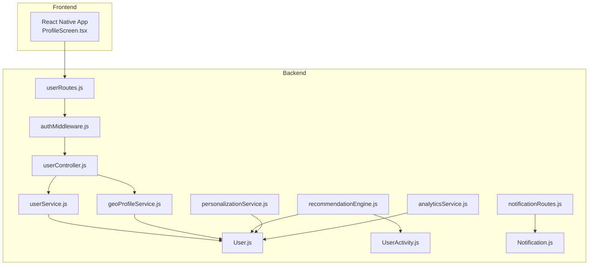
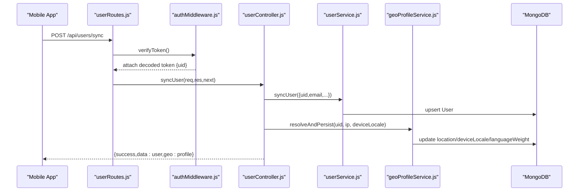
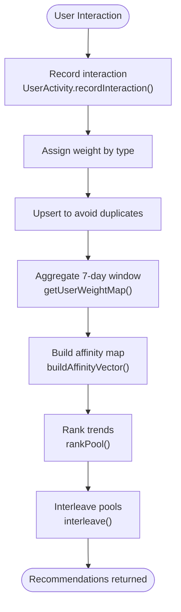
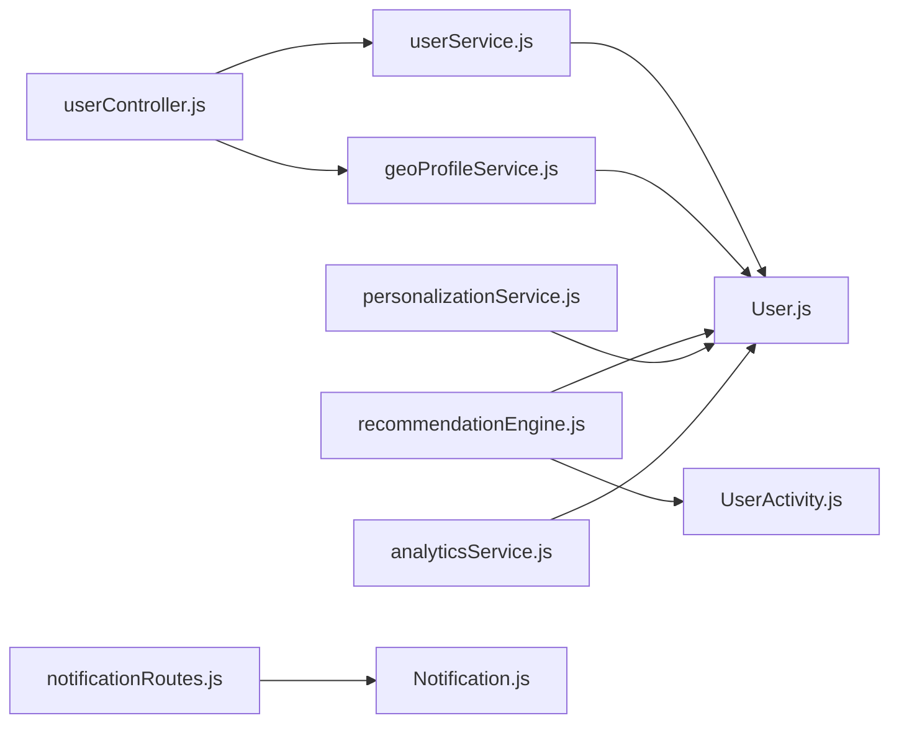

# User Profile API

<cite>
**Referenced Files in This Document**
- [userController.js](file://backend/src/controllers/userController.js)
- [userRoutes.js](file://backend/src/routes/userRoutes.js)
- [User.js](file://backend/src/models/User.js)
- [userService.js](file://backend/src/services/userService.js)
- [authMiddleware.js](file://backend/src/middlewares/authMiddleware.js)
- [geoProfileService.js](file://backend/src/services/geoProfileService.js)
- [UserActivity.js](file://backend/src/models/UserActivity.js)
- [recommendationEngine.js](file://backend/src/services/recommendationEngine.js)
- [personalizationService.js](file://backend/src/services/personalizationService.js)
- [analyticsService.js](file://backend/src/services/analyticsService.js)
- [notificationRoutes.js](file://backend/src/routes/notificationRoutes.js)
- [Notification.js](file://backend/src/models/Notification.js)
- [ProfileScreen.tsx](file://AITrendTracker7/src/navigations/screens/ProfileScreen.tsx)
</cite>

## Table of Contents
1. [Introduction](#introduction)
2. [Project Structure](#project-structure)
3. [Core Components](#core-components)
4. [Architecture Overview](#architecture-overview)
5. [Detailed Component Analysis](#detailed-component-analysis)
6. [Dependency Analysis](#dependency-analysis)
7. [Performance Considerations](#performance-considerations)
8. [Troubleshooting Guide](#troubleshooting-guide)
9. [Conclusion](#conclusion)
10. [Appendices](#appendices)

## Introduction
This document provides comprehensive API documentation for user profile management and related features in the AITrendTracker platform. It covers profile creation and updates, preference and notification settings persistence, saved trends management, geo-intelligence integration, activity tracking, analytics, recommendation systems, and mobile profile UI integration. It also outlines data protection considerations and consent management practices aligned with privacy requirements.

## Project Structure
The user profile APIs are implemented in the backend under Express routes and controllers, backed by Mongoose models and service layers. Authentication is handled via Firebase ID tokens verified by a middleware. The frontend integrates with the backend for profile updates and media uploads.

**Diagram sources**
- [userRoutes.js:1-18](file://backend/src/routes/userRoutes.js#L1-L18)
- [authMiddleware.js:1-27](file://backend/src/middlewares/authMiddleware.js#L1-L27)
- [userController.js:1-90](file://backend/src/controllers/userController.js#L1-L90)
- [userService.js:1-55](file://backend/src/services/userService.js#L1-L55)
- [geoProfileService.js:1-132](file://backend/src/services/geoProfileService.js#L1-L132)
- [User.js:1-35](file://backend/src/models/User.js#L1-L35)
- [UserActivity.js:1-99](file://backend/src/models/UserActivity.js#L1-L99)
- [recommendationEngine.js:1-253](file://backend/src/services/recommendationEngine.js#L1-L253)
- [personalizationService.js:1-129](file://backend/src/services/personalizationService.js#L1-L129)
- [analyticsService.js:1-154](file://backend/src/services/analyticsService.js#L1-L154)
- [notificationRoutes.js:1-14](file://backend/src/routes/notificationRoutes.js#L1-L14)
- [Notification.js:1-39](file://backend/src/models/Notification.js#L1-L39)

**Section sources**
- [userRoutes.js:1-18](file://backend/src/routes/userRoutes.js#L1-L18)
- [authMiddleware.js:1-27](file://backend/src/middlewares/authMiddleware.js#L1-L27)

## Core Components
- Authentication middleware verifies Firebase ID tokens and attaches the decoded token (including uid) to requests.
- User controller exposes endpoints for syncing user identity, updating profile settings, saving/un-saving trends, and retrieving geo profile.
- User service encapsulates CRUD operations against the User model and manages saved trends.
- Geo profile service resolves IP-based location and persists device locale and language weight.
- Recommendation engine and personalization service leverage user preferences and activity to power feeds and rankings.
- Analytics service provides trend snapshotting and analytics computation.
- Notification routes and model support notification management.

**Section sources**
- [authMiddleware.js:1-27](file://backend/src/middlewares/authMiddleware.js#L1-L27)
- [userController.js:1-90](file://backend/src/controllers/userController.js#L1-L90)
- [userService.js:1-55](file://backend/src/services/userService.js#L1-L55)
- [geoProfileService.js:1-132](file://backend/src/services/geoProfileService.js#L1-L132)
- [recommendationEngine.js:1-253](file://backend/src/services/recommendationEngine.js#L1-L253)
- [personalizationService.js:1-129](file://backend/src/services/personalizationService.js#L1-L129)
- [analyticsService.js:1-154](file://backend/src/services/analyticsService.js#L1-L154)
- [notificationRoutes.js:1-14](file://backend/src/routes/notificationRoutes.js#L1-L14)
- [Notification.js:1-39](file://backend/src/models/Notification.js#L1-L39)

## Architecture Overview
The user profile API follows a layered architecture:
- Route handlers define endpoint contracts and apply authentication.
- Controllers orchestrate service calls and coordinate cross-cutting concerns (e.g., geo resolution).
- Services encapsulate business logic and data access patterns.
- Models define schemas and indexes for efficient queries.
- Recommendations and analytics services consume user data to enrich content delivery.

**Diagram sources**
- [userRoutes.js](file://backend/src/routes/userRoutes.js#L6)
- [authMiddleware.js:3-24](file://backend/src/middlewares/authMiddleware.js#L3-L24)
- [userController.js:4-21](file://backend/src/controllers/userController.js#L4-L21)
- [userService.js:5-17](file://backend/src/services/userService.js#L5-L17)
- [geoProfileService.js:38-64](file://backend/src/services/geoProfileService.js#L38-L64)
- [User.js:3-29](file://backend/src/models/User.js#L3-L29)

## Detailed Component Analysis

### Authentication and Authorization
- Endpoint: N/A (middleware applied via route guards)
- Behavior: Extracts Bearer token from Authorization header, verifies with Firebase Admin, and attaches decoded token with uid to req.user.
- Error handling: Returns 401 for missing/expired/invalid tokens.

**Section sources**
- [authMiddleware.js:3-24](file://backend/src/middlewares/authMiddleware.js#L3-L24)

### User Sync and Geo Resolution
- Endpoint: POST /api/users/sync
- Request headers:
  - Authorization: Bearer <Firebase ID Token>
- Request body:
  - uid: string (required)
  - email: string (required)
  - displayName: string
  - photoURL: string
  - deviceLocale: string (e.g., en-US)
- Response:
  - success: boolean
  - data: user document
  - geo: resolved location object with country/state/city/timezone and deviceLocale/languageWeight
- Notes:
  - On successful sync, geo location is resolved from client IP and persisted to the user document.

Example request
- [ProfileScreen.tsx:64-80](file://AITrendTracker7/src/navigations/screens/ProfileScreen.tsx#L64-L80)

Example response
- [userController.js](file://backend/src/controllers/userController.js#L17)

**Section sources**
- [userRoutes.js](file://backend/src/routes/userRoutes.js#L6)
- [userController.js:4-21](file://backend/src/controllers/userController.js#L4-L21)
- [geoProfileService.js:38-64](file://backend/src/services/geoProfileService.js#L38-L64)
- [User.js:14-29](file://backend/src/models/User.js#L14-L29)

### Update User Profile
- Endpoint: PUT /api/users/profile
- Request headers:
  - Authorization: Bearer <Firebase ID Token>
- Request body:
  - preferences: array of strings
  - fcmToken: string (for push notifications)
  - displayName: string
  - photoURL: string
  - interests: array of strings (granular keywords)
  - preferredSources: array of strings (e.g., YouTube, Reddit)
- Response:
  - success: boolean
  - data: updated user document

Example request
- [ProfileScreen.tsx:64-80](file://AITrendTracker7/src/navigations/screens/ProfileScreen.tsx#L64-L80)

**Section sources**
- [userRoutes.js](file://backend/src/routes/userRoutes.js#L7)
- [userController.js:23-36](file://backend/src/controllers/userController.js#L23-L36)
- [userService.js:19-25](file://backend/src/services/userService.js#L19-L25)
- [User.js:9-12](file://backend/src/models/User.js#L9-L12)

### Saved Trends Management
- Save a trend
  - Endpoint: POST /api/users/save
  - Body: { trendId: string }
  - Response: { success: true, message: "Trend saved successfully" }
- Un-save a trend
  - Endpoint: DELETE /api/users/save/:trendId
  - Path param: trendId
  - Response: { success: true, message: "Trend removed successfully" }
- Get saved trends
  - Endpoint: GET /api/users/saved
  - Response: { success: true, data: [trendDocuments...] }

Notes:
- Saved trends are stored as an array of trend identifiers on the user document.
- Retrieving saved trends returns full trend documents by resolving saved trend IDs.

**Section sources**
- [userRoutes.js:9-12](file://backend/src/routes/userRoutes.js#L9-L12)
- [userController.js:38-75](file://backend/src/controllers/userController.js#L38-L75)
- [userService.js:27-51](file://backend/src/services/userService.js#L27-L51)
- [User.js](file://backend/src/models/User.js#L12)

### Geo Profile
- Endpoint: GET /api/users/geo-profile
- Response:
  - success: boolean
  - data: { country, countryCode, state, city, timezone, deviceLocale, languageWeight }
  - If no geo data found, returns default structure with Unknown country

**Section sources**
- [userRoutes.js](file://backend/src/routes/userRoutes.js#L15)
- [userController.js:77-89](file://backend/src/controllers/userController.js#L77-L89)
- [geoProfileService.js:97-116](file://backend/src/services/geoProfileService.js#L97-L116)

### Notification Management
- Endpoint: GET /api/notifications/
- Endpoint: GET /api/notifications/unread-count
- Endpoint: PUT /api/notifications/read-all
- Endpoint: DELETE /api/notifications/clear-all
- Endpoint: PUT /api/notifications/:id/read
- Response examples:
  - List: { success: true, data: [notificationObjects] }
  - Unread count: { success: true, data: { count: number } }
  - Read all: { success: true, message: "All notifications marked as read" }
  - Clear all: { success: true, message: "All notifications cleared" }
  - Mark one: { success: true, data: updatedNotification }

**Section sources**
- [notificationRoutes.js:6-12](file://backend/src/routes/notificationRoutes.js#L6-L12)
- [Notification.js:3-30](file://backend/src/models/Notification.js#L3-L30)

### User Data Schema
User document fields:
- uid: string (unique identifier)
- email: string
- displayName: string
- photoURL: string
- fcmToken: string
- preferences: array of strings
- interests: array of strings
- preferredSources: array of strings
- savedTrends: array of strings (trend identifiers)
- location: object with country, countryCode, state, city, timezone, resolvedAt
- deviceLocale: string
- languageWeight: number
- geoAlertCount: number
- geoAlertResetAt: date

Indexes:
- Compound index on location.country and location.state
- Timestamps enabled

**Section sources**
- [User.js:3-34](file://backend/src/models/User.js#L3-L34)

### Activity Tracking and Recommendations
- Activity tracking:
  - Records micro-interactions (click, like, bookmark, share) with weights and categories.
  - Maintains a rolling 7-day window and TTL index for cleanup.
- Recommendation engine:
  - Builds user affinity map from weighted categories.
  - Ranks trends by category affinity, keyword overlap, language weight, virality, and emergence.
  - Interleaves local, national, and global pools with configurable ratios.
- Personalization service:
  - Scores trends based on interest keywords, preferred sources, recency, and AI virality.
  - Returns top-N personalized results with explanations.

**Diagram sources**
- [UserActivity.js:57-94](file://backend/src/models/UserActivity.js#L57-L94)
- [recommendationEngine.js:189-204](file://backend/src/services/recommendationEngine.js#L189-L204)
- [recommendationEngine.js:144-184](file://backend/src/services/recommendationEngine.js#L144-L184)
- [recommendationEngine.js:209-229](file://backend/src/services/recommendationEngine.js#L209-L229)

**Section sources**
- [UserActivity.js:1-99](file://backend/src/models/UserActivity.js#L1-L99)
- [recommendationEngine.js:1-253](file://backend/src/services/recommendationEngine.js#L1-L253)
- [personalizationService.js:1-129](file://backend/src/services/personalizationService.js#L1-L129)

### Analytics and Trend Snapshots
- Store snapshots of trending topics at high frequency with de-duplication.
- Compute analytics including current/average/highest scores, growth rate, mentions, and regional distribution.
- Provide historical trend analytics for UI rendering.

**Section sources**
- [analyticsService.js:8-44](file://backend/src/services/analyticsService.js#L8-L44)
- [analyticsService.js:76-150](file://backend/src/services/analyticsService.js#L76-L150)

### Frontend Integration Examples
- Profile screen updates backend profile and handles profile picture uploads via Cloudinary.
- Uses Firebase ID tokens for Authorization headers.
- Manages local settings (notifications, dark mode) via AsyncStorage.

**Section sources**
- [ProfileScreen.tsx:64-80](file://AITrendTracker7/src/navigations/screens/ProfileScreen.tsx#L64-L80)
- [ProfileScreen.tsx:140-184](file://AITrendTracker7/src/navigations/screens/ProfileScreen.tsx#L140-L184)

## Dependency Analysis

**Diagram sources**
- [userController.js:1-2](file://backend/src/controllers/userController.js#L1-L2)
- [userService.js:1-2](file://backend/src/services/userService.js#L1-L2)
- [geoProfileService.js:1-11](file://backend/src/services/geoProfileService.js#L1-L11)
- [User.js:1-2](file://backend/src/models/User.js#L1-L2)
- [recommendationEngine.js:13-16](file://backend/src/services/recommendationEngine.js#L13-L16)
- [UserActivity.js:1-10](file://backend/src/models/UserActivity.js#L1-L10)
- [personalizationService.js:1-12](file://backend/src/services/personalizationService.js#L1-L12)
- [analyticsService.js:1-2](file://backend/src/services/analyticsService.js#L1-L2)
- [notificationRoutes.js:1-4](file://backend/src/routes/notificationRoutes.js#L1-L4)
- [Notification.js:1-3](file://backend/src/models/Notification.js#L1-L3)

**Section sources**
- [userController.js:1-2](file://backend/src/controllers/userController.js#L1-L2)
- [userService.js:1-2](file://backend/src/services/userService.js#L1-L2)
- [geoProfileService.js:1-11](file://backend/src/services/geoProfileService.js#L1-L11)
- [recommendationEngine.js:13-16](file://backend/src/services/recommendationEngine.js#L13-L16)
- [personalizationService.js:1-12](file://backend/src/services/personalizationService.js#L1-L12)
- [analyticsService.js:1-2](file://backend/src/services/analyticsService.js#L1-L2)
- [notificationRoutes.js:1-4](file://backend/src/routes/notificationRoutes.js#L1-L4)
- [Notification.js:1-3](file://backend/src/models/Notification.js#L1-L3)

## Performance Considerations
- Indexing:
  - User location compound index supports geo-aware queries.
  - UserActivity TTL index bounds collection size.
  - Notification compound index accelerates unread counts and user-specific queries.
- Query patterns:
  - Recommendation engine uses targeted filters and sorting to minimize scans.
  - Personalization service performs a single pass scoring with early exits for filtering.
- Caching:
  - Consider caching frequently accessed user preferences and geo profiles at the application layer.
- Rate limiting:
  - Apply rate limits on profile update and saved trends endpoints to prevent abuse.

[No sources needed since this section provides general guidance]

## Troubleshooting Guide
- Authentication failures:
  - Ensure Authorization header contains a valid Bearer token.
  - Verify token expiration and issuer.
- Missing required fields:
  - syncUser requires uid and email.
  - save/unsave requires trendId.
- Geo resolution issues:
  - Confirm client IP is forwarded via x-forwarded-for or similar headers.
  - Check deviceLocale format and normalization.
- Notification errors:
  - Validate userId uniqueness and read flags.
  - Confirm sparse unique index on userId+trendId combinations.

**Section sources**
- [authMiddleware.js:7-23](file://backend/src/middlewares/authMiddleware.js#L7-L23)
- [userController.js:9-9](file://backend/src/controllers/userController.js#L9-L9)
- [userController.js:43-57](file://backend/src/controllers/userController.js#L43-L57)
- [geoProfileService.js:121-128](file://backend/src/services/geoProfileService.js#L121-L128)
- [Notification.js:35-36](file://backend/src/models/Notification.js#L35-L36)

## Conclusion
The user profile API provides a robust foundation for identity synchronization, preference management, saved content, geo-intelligence, activity tracking, and recommendation delivery. The documented endpoints, schemas, and flows enable consistent client integrations while supporting scalable backend operations and privacy-conscious design.

[No sources needed since this section summarizes without analyzing specific files]

## Appendices

### API Reference Summary
- POST /api/users/sync
  - Headers: Authorization: Bearer <token>
  - Body: { uid, email, displayName?, photoURL?, deviceLocale? }
  - Response: { success, data: user, geo: profile }
- PUT /api/users/profile
  - Headers: Authorization: Bearer <token>
  - Body: { preferences?, fcmToken?, displayName?, photoURL?, interests?, preferredSources? }
  - Response: { success, data: user }
- POST /api/users/save
  - Headers: Authorization: Bearer <token>
  - Body: { trendId: string }
  - Response: { success, message }
- DELETE /api/users/save/:trendId
  - Headers: Authorization: Bearer <token>
  - Response: { success, message }
- GET /api/users/saved
  - Headers: Authorization: Bearer <token>
  - Response: { success, data: [trendDocs] }
- GET /api/users/geo-profile
  - Headers: Authorization: Bearer <token>
  - Response: { success, data: geoProfile }
- GET /api/notifications/
  - Headers: Authorization: Bearer <token>
  - Response: { success, data: [notifications] }
- GET /api/notifications/unread-count
  - Headers: Authorization: Bearer <token>
  - Response: { success, data: { count } }
- PUT /api/notifications/read-all
  - Headers: Authorization: Bearer <token>
  - Response: { success, message }
- DELETE /api/notifications/clear-all
  - Headers: Authorization: Bearer <token>
  - Response: { success, message }
- PUT /api/notifications/:id/read
  - Headers: Authorization: Bearer <token>
  - Response: { success, data: notification }

**Section sources**
- [userRoutes.js:6-15](file://backend/src/routes/userRoutes.js#L6-L15)
- [notificationRoutes.js:6-12](file://backend/src/routes/notificationRoutes.js#L6-L12)

### Data Protection and Consent Management
- Data minimization:
  - Collect only uid, email, and optional profile fields.
- Consent handling:
  - Obtain explicit consent for push notifications and analytics.
  - Provide granular controls for preferences and data sharing.
- Transparency:
  - Expose clear endpoints for data access and deletion.
- Security:
  - Enforce bearer token authentication on all user endpoints.
  - Sanitize and validate all inputs.

[No sources needed since this section provides general guidance]