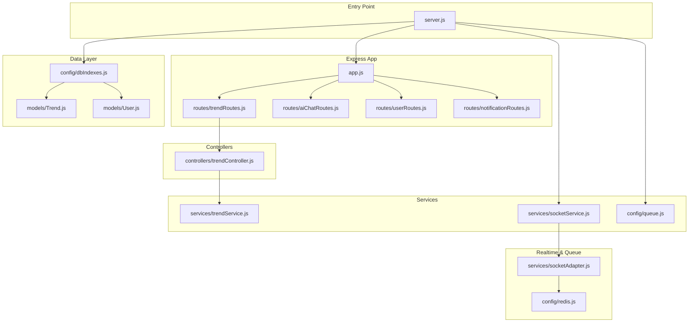
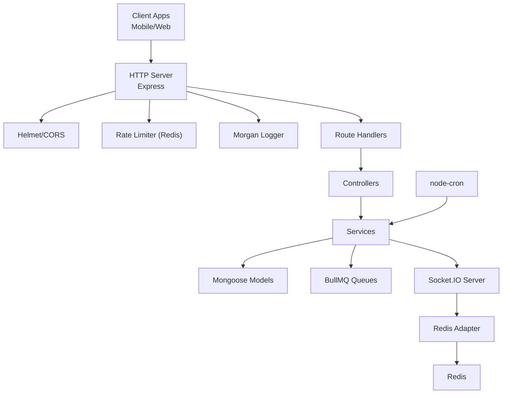
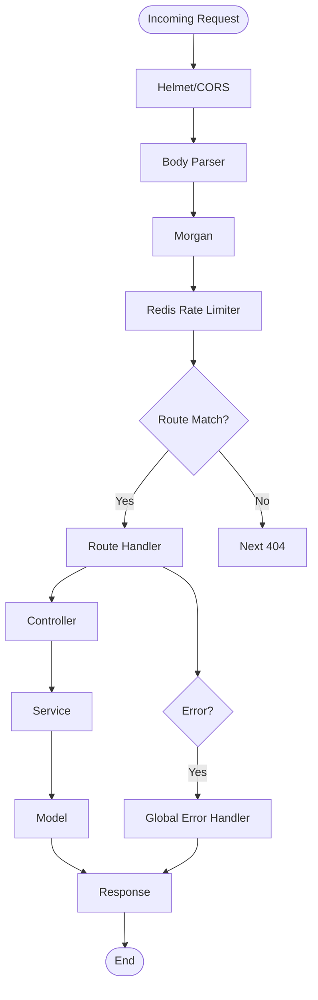
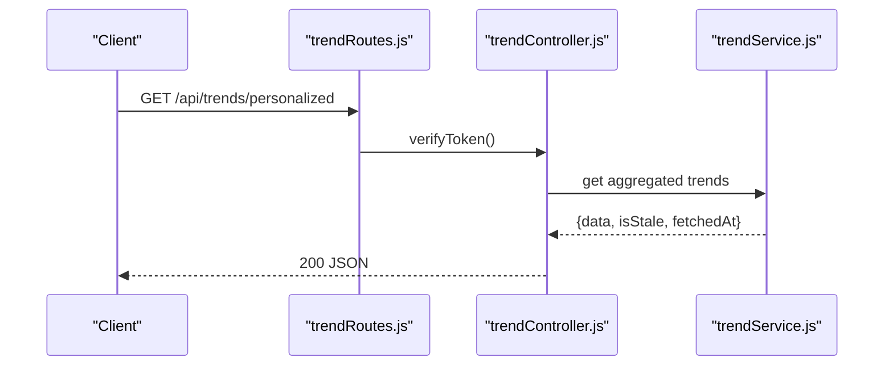
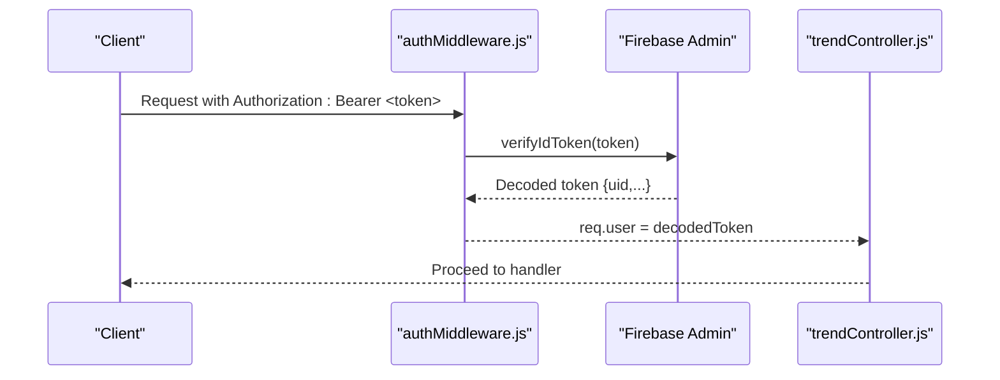
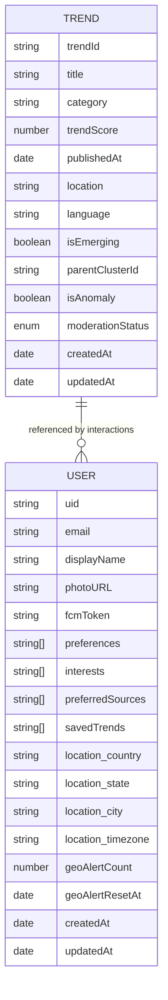
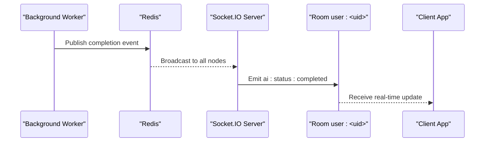
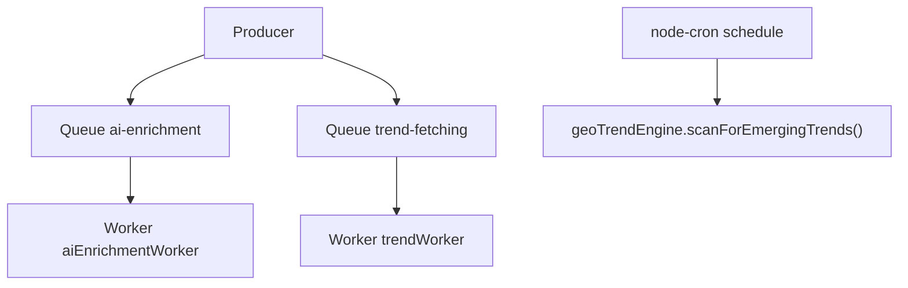
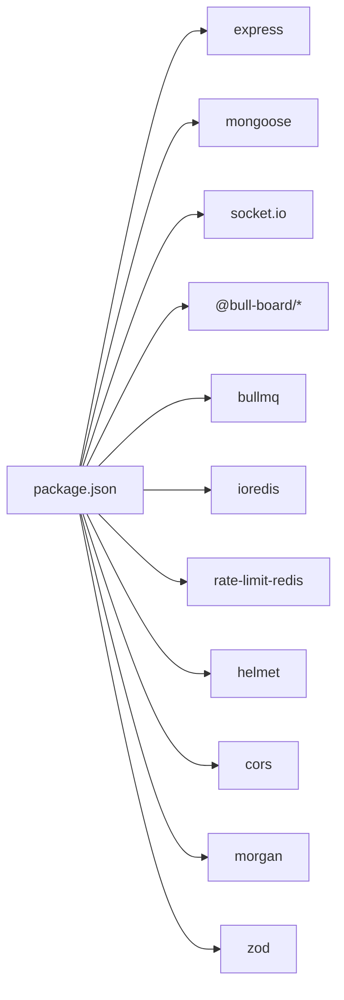

# Backend Services Architecture

<cite>
**Referenced Files in This Document**
- [package.json](file://backend/package.json)
- [server.js](file://backend/server.js)
- [app.js](file://backend/src/app.js)
- [dbIndexes.js](file://backend/src/config/dbIndexes.js)
- [redis.js](file://backend/src/config/redis.js)
- [queue.js](file://backend/src/config/queue.js)
- [Trend.js](file://backend/src/models/Trend.js)
- [User.js](file://backend/src/models/User.js)
- [trendController.js](file://backend/src/controllers/trendController.js)
- [trendService.js](file://backend/src/services/trendService.js)
- [authMiddleware.js](file://backend/src/middlewares/authMiddleware.js)
- [trendRoutes.js](file://backend/src/routes/trendRoutes.js)
- [socketService.js](file://backend/src/services/socketService.js)
- [socketAdapter.js](file://backend/src/services/socketAdapter.js)
</cite>

## Table of Contents
1. [Introduction](#introduction)
2. [Project Structure](#project-structure)
3. [Core Components](#core-components)
4. [Architecture Overview](#architecture-overview)
5. [Detailed Component Analysis](#detailed-component-analysis)
6. [Dependency Analysis](#dependency-analysis)
7. [Performance Considerations](#performance-considerations)
8. [Troubleshooting Guide](#troubleshooting-guide)
9. [Conclusion](#conclusion)
10. [Appendices](#appendices)

## Introduction
This document describes the Node.js/Express backend architecture for the AITrendTracker project. It covers Express configuration, middleware stack, routing patterns, service layer design, database integration with Mongoose/MongoDB, real-time communication via Socket.IO with Redis adapter, background job processing with BullMQ, API design patterns, error handling, security, performance optimization, monitoring, and deployment considerations.

## Project Structure
The backend is organized around a layered architecture:
- Entry point initializes HTTP server, connects to MongoDB, sets up Socket.IO, starts cron jobs, and boots queue workers.
- Express app configures middleware, routes, and error handling.
- Models define Mongoose schemas and indexes.
- Controllers orchestrate requests and delegate to services.
- Services encapsulate business logic and data access.
- Config modules centralize Redis connections and queue definitions.
- Real-time and background systems are integrated at startup.

**Diagram sources**
- [server.js:1-51](file://backend/server.js#L1-L51)
- [app.js:1-88](file://backend/src/app.js#L1-L88)
- [trendRoutes.js:1-50](file://backend/src/routes/trendRoutes.js#L1-L50)
- [trendController.js:1-407](file://backend/src/controllers/trendController.js#L1-L407)
- [trendService.js:1-64](file://backend/src/services/trendService.js#L1-L64)
- [socketService.js:1-107](file://backend/src/services/socketService.js#L1-L107)
- [socketAdapter.js:1-22](file://backend/src/services/socketAdapter.js#L1-L22)
- [redis.js:1-19](file://backend/src/config/redis.js#L1-L19)
- [queue.js:1-32](file://backend/src/config/queue.js#L1-L32)
- [dbIndexes.js:1-31](file://backend/src/config/dbIndexes.js#L1-L31)
- [Trend.js:1-188](file://backend/src/models/Trend.js#L1-L188)
- [User.js:1-35](file://backend/src/models/User.js#L1-L35)

**Section sources**
- [server.js:1-51](file://backend/server.js#L1-L51)
- [app.js:1-88](file://backend/src/app.js#L1-L88)

## Core Components
- Express configuration and middleware stack:
  - Security: Helmet, CORS, rate limiter backed by Redis.
  - Logging: Morgan.
  - Body parsing: JSON and URL-encoded.
  - Health check endpoint.
  - Route registration for trends, AI chat, users, notifications.
  - Admin dashboard for queue monitoring with basic auth.
  - Global error handler.
- Routing patterns:
  - Public and authenticated endpoints.
  - Validation middleware applied to route handlers.
  - Zod-based validators for request schemas.
- Service layer:
  - Controllers coordinate business logic and call services.
  - Services encapsulate data access and domain logic.
- Data access:
  - Mongoose models with explicit indexes for performance.
  - Startup index verification script.
- Real-time:
  - Socket.IO with Redis adapter for multi-instance scaling.
  - Dedicated rooms per user.
- Background jobs:
  - BullMQ queues with retry/backoff and retention policies.
  - Queue workers and cron-triggered jobs.

**Section sources**
- [app.js:1-88](file://backend/src/app.js#L1-L88)
- [trendRoutes.js:1-50](file://backend/src/routes/trendRoutes.js#L1-L50)
- [authMiddleware.js:1-27](file://backend/src/middlewares/authMiddleware.js#L1-L27)
- [dbIndexes.js:1-31](file://backend/src/config/dbIndexes.js#L1-L31)
- [socketService.js:1-107](file://backend/src/services/socketService.js#L1-L107)
- [socketAdapter.js:1-22](file://backend/src/services/socketAdapter.js#L1-L22)
- [queue.js:1-32](file://backend/src/config/queue.js#L1-L32)

## Architecture Overview
The system follows a layered, event-driven design:
- Entry point initializes HTTP server and integrates Socket.IO.
- Express app composes middleware, routes, and error handling.
- Controllers depend on services; services depend on models and external integrations.
- Real-time events are emitted to user-specific rooms via Redis adapter.
- Background tasks are enqueued and processed asynchronously by workers.

**Diagram sources**
- [server.js:1-51](file://backend/server.js#L1-L51)
- [app.js:1-88](file://backend/src/app.js#L1-L88)
- [socketService.js:1-107](file://backend/src/services/socketService.js#L1-L107)
- [socketAdapter.js:1-22](file://backend/src/services/socketAdapter.js#L1-L22)
- [redis.js:1-19](file://backend/src/config/redis.js#L1-L19)
- [queue.js:1-32](file://backend/src/config/queue.js#L1-L32)

## Detailed Component Analysis

### Express Configuration and Middleware Stack
- Security and hardening:
  - Helmet sets secure headers.
  - CORS enabled broadly for development.
- Rate limiting:
  - Distributed rate limiting via Redis-backed limiter.
  - Separate limits for general API and authentication endpoints.
- Logging:
  - Morgan logs HTTP requests.
- Admin queue dashboard:
  - Bull Board mounted under /admin/queues with bearer auth.
- Global error handling:
  - Centralized handler logs and responds with 500.

**Diagram sources**
- [app.js:1-88](file://backend/src/app.js#L1-L88)

**Section sources**
- [app.js:1-88](file://backend/src/app.js#L1-L88)

### Routing Patterns and Controllers
- Public routes:
  - Home/explore feeds, category/location filters, search, compare.
- Authenticated routes:
  - Personalized and geo-personalized feeds, emerging trends, interactions, bookmarks.
- Trend detail endpoints:
  - Stats/analytics/history, AI analysis, graph, prediction.
- Controller responsibilities:
  - Validate inputs, call services, handle errors, return structured JSON responses.
  - Interaction recording updates user activity and bookmarks.
  - Bookmark toggling updates user model and records interaction.

**Diagram sources**
- [trendRoutes.js:1-50](file://backend/src/routes/trendRoutes.js#L1-L50)
- [trendController.js:142-190](file://backend/src/controllers/trendController.js#L142-L190)
- [trendService.js:1-64](file://backend/src/services/trendService.js#L1-L64)

**Section sources**
- [trendRoutes.js:1-50](file://backend/src/routes/trendRoutes.js#L1-L50)
- [trendController.js:1-407](file://backend/src/controllers/trendController.js#L1-L407)

### Authentication and Authorization
- Firebase ID token verification middleware:
  - Extracts Bearer token from Authorization header.
  - Verifies token via Firebase Admin SDK.
  - Attaches decoded token (uid) to request for downstream use.

**Diagram sources**
- [authMiddleware.js:1-27](file://backend/src/middlewares/authMiddleware.js#L1-L27)
- [trendController.js:142-150](file://backend/src/controllers/trendController.js#L142-L150)

**Section sources**
- [authMiddleware.js:1-27](file://backend/src/middlewares/authMiddleware.js#L1-L27)

### Database Integration with Mongoose and MongoDB
- Schema design:
  - Trend model includes nested objects for scoring, analysis, predictions, and geolocation.
  - User model includes preferences, interests, and location profile.
- Indexing strategy:
  - Compound indexes for category/score, publishedAt, analysis status, scoring metrics.
  - Geo-intelligence indexes for country/state combinations and emerging trend detection.
  - Moderation and anomaly indexes.
- Startup index verification:
  - At startup, ensures indexes exist and logs status.

**Diagram sources**
- [Trend.js:1-188](file://backend/src/models/Trend.js#L1-L188)
- [User.js:1-35](file://backend/src/models/User.js#L1-L35)

**Section sources**
- [Trend.js:1-188](file://backend/src/models/Trend.js#L1-L188)
- [User.js:1-35](file://backend/src/models/User.js#L1-L35)
- [dbIndexes.js:1-31](file://backend/src/config/dbIndexes.js#L1-L31)

### Real-Time Communication with Socket.IO and Redis Adapter
- Initialization:
  - Socket.IO server attached to HTTP server with CORS and heartbeat settings.
  - Redis adapter enables horizontal scaling across instances.
- Rooms:
  - Clients join user-specific rooms using their userId.
- Emissions:
  - ai:status:completed for live UI updates after AI enrichment.
  - alert:push for priority alerts to specific users or globally.

**Diagram sources**
- [socketService.js:1-107](file://backend/src/services/socketService.js#L1-L107)
- [socketAdapter.js:1-22](file://backend/src/services/socketAdapter.js#L1-L22)

**Section sources**
- [socketService.js:1-107](file://backend/src/services/socketService.js#L1-L107)
- [socketAdapter.js:1-22](file://backend/src/services/socketAdapter.js#L1-L22)

### Background Job Processing with BullMQ
- Queues:
  - ai-enrichment: retries with exponential backoff, retains recent failures.
  - trend-fetching: fixed backoff, limited retention.
- Workers:
  - Dedicated workers consume jobs from queues.
- Cron job:
  - Hourly scan for emerging geo trends.

**Diagram sources**
- [queue.js:1-32](file://backend/src/config/queue.js#L1-L32)
- [server.js:35-44](file://backend/server.js#L35-L44)

**Section sources**
- [queue.js:1-32](file://backend/src/config/queue.js#L1-L32)
- [server.js:35-44](file://backend/server.js#L35-L44)

### API Design Patterns
- Consistent response shape: { success, ...data }.
- Structured error responses with 400/401/404/500 as appropriate.
- Validation pipeline: Zod schemas + validate middleware.
- Authenticated endpoints gated by Firebase ID tokens.
- Pagination and filtering via query parameters (e.g., limit, scope, locale).

**Section sources**
- [trendController.js:16-43](file://backend/src/controllers/trendController.js#L16-L43)
- [trendController.js:287-363](file://backend/src/controllers/trendController.js#L287-L363)
- [trendRoutes.js:7-10](file://backend/src/routes/trendRoutes.js#L7-L10)

### Error Handling Strategies
- Centralized error middleware logs error details and returns generic 500 response.
- Route handlers catch and forward errors to the centralized handler.
- Validation middleware returns structured 400 responses for malformed requests.

**Section sources**
- [app.js:81-85](file://backend/src/app.js#L81-L85)
- [trendController.js:16-23](file://backend/src/controllers/trendController.js#L16-L23)

### Security Implementations
- Helmet for secure headers.
- CORS broadly enabled at middleware level.
- Rate limiting via Redis-backed limiter.
- Firebase ID token verification for authenticated routes.
- Admin queue dashboard protected by bearer token.

**Section sources**
- [app.js:10-14](file://backend/src/app.js#L10-L14)
- [app.js:16-21](file://backend/src/app.js#L16-L21)
- [authMiddleware.js:1-27](file://backend/src/middlewares/authMiddleware.js#L1-L27)
- [app.js:50-57](file://backend/src/app.js#L50-L57)

## Dependency Analysis
External dependencies include Express, Mongoose, Socket.IO, BullMQ, Redis, rate limiting, logging, and validation libraries. The system integrates these via modular configuration and initialization.

**Diagram sources**
- [package.json:14-38](file://backend/package.json#L14-L38)

**Section sources**
- [package.json:14-38](file://backend/package.json#L14-L38)

## Performance Considerations
- Database:
  - Use compound indexes for frequent queries (category/score, publishedAt, analysis status).
  - Geo-indexes for regional queries and emerging trend detection.
  - Startup index verification to ensure availability.
- Caching:
  - Redis-backed feed caching for geo-personalized feeds with TTL.
  - Namespaced cache keys per country/state/scope/locale.
- Real-time:
  - Redis adapter ensures scalable broadcasting across instances.
  - Minimal event payloads to reduce bandwidth.
- Background processing:
  - Retries with exponential/fixed backoff to handle transient failures.
  - RemoveOnComplete/limited retention to keep Redis footprint small.
- Rate limiting:
  - Redis-backed distributed rate limiting prevents abuse and protects downstream services.

**Section sources**
- [Trend.js:174-185](file://backend/src/models/Trend.js#L174-L185)
- [dbIndexes.js:13-28](file://backend/src/config/dbIndexes.js#L13-L28)
- [trendController.js:192-244](file://backend/src/controllers/trendController.js#L192-L244)
- [socketAdapter.js:10-19](file://backend/src/services/socketAdapter.js#L10-L19)
- [queue.js:5-26](file://backend/src/config/queue.js#L5-L26)

## Troubleshooting Guide
- MongoDB connection failures:
  - Check MONGO_URI and network connectivity; review connection error logs.
- Redis connectivity:
  - Verify Redis host/port and credentials; watch for adapter initialization warnings.
- Socket.IO scaling:
  - Ensure Redis adapter is available; fallback to single-instance mode logs a warning.
- Queue processing:
  - Monitor Bull Board dashboard for stalled or failed jobs; inspect ADMIN_SECRET configuration.
- Rate limiting:
  - Confirm Redis is reachable; verify rate limiter configuration for API/auth endpoints.
- Index verification:
  - Review startup logs for index creation status; re-run ensureIndexes if needed.

**Section sources**
- [server.js:16-50](file://backend/server.js#L16-L50)
- [redis.js:4-18](file://backend/src/config/redis.js#L4-L18)
- [socketAdapter.js:10-19](file://backend/src/services/socketAdapter.js#L10-L19)
- [app.js:50-57](file://backend/src/app.js#L50-L57)
- [dbIndexes.js:13-28](file://backend/src/config/dbIndexes.js#L13-L28)

## Conclusion
The backend employs a robust, layered architecture leveraging Express, Mongoose, Socket.IO with Redis, and BullMQ. It emphasizes scalability, security, and maintainability through modular design, comprehensive indexing, real-time capabilities, and asynchronous task processing. The documented patterns and configurations provide a solid foundation for further enhancements and reliable operations.

## Appendices
- Deployment checklist:
  - Environment variables for MONGO_URI, REDIS_URL, ADMIN_SECRET, Firebase credentials.
  - Redis and MongoDB availability and network access.
  - Scaling considerations: Socket.IO Redis adapter, BullMQ workers, and queue backlogs.
  - Monitoring: Morgan logs, Winston-based loggerService usage, Bull Board dashboard.
- Monitoring:
  - Queue dashboard at /admin/queues with basic auth.
  - Winston daily rotate file transport for structured logs.

[No sources needed since this section provides general guidance]