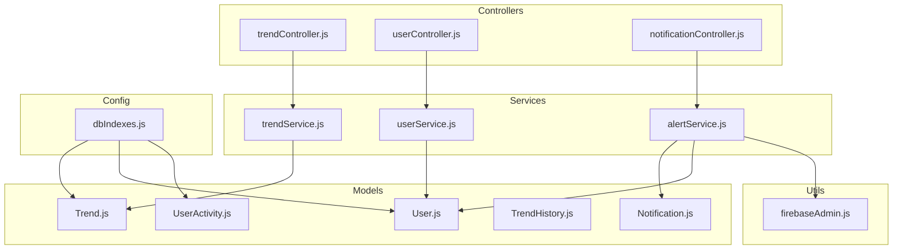
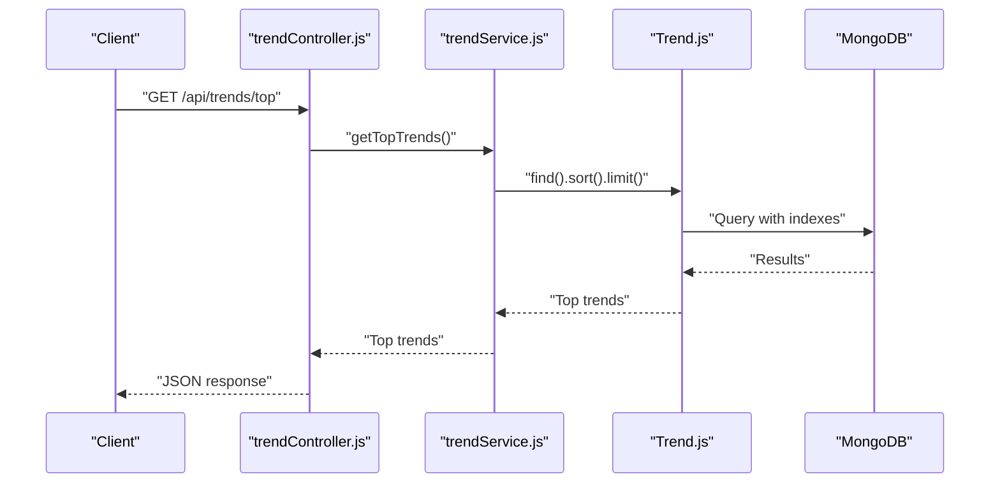
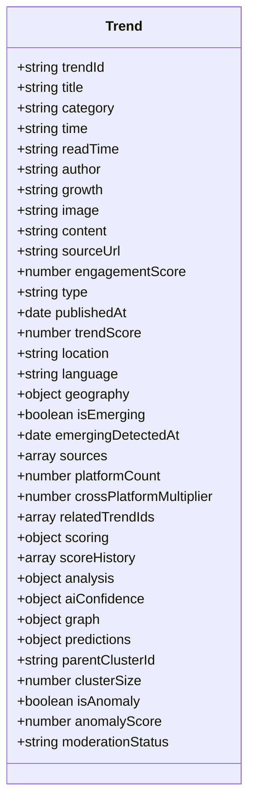
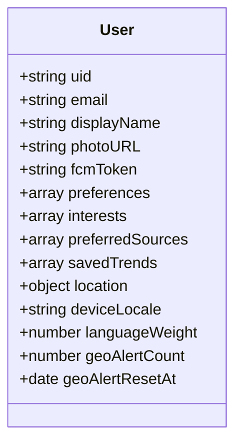
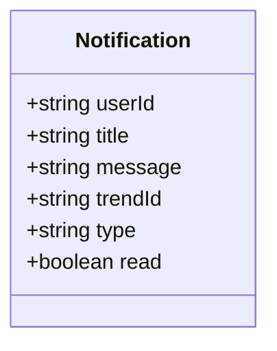
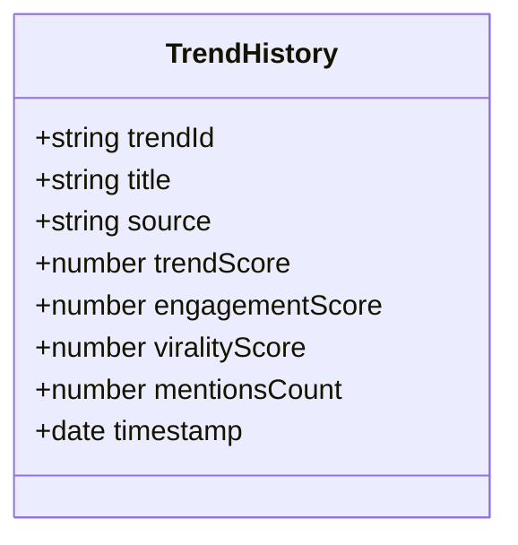
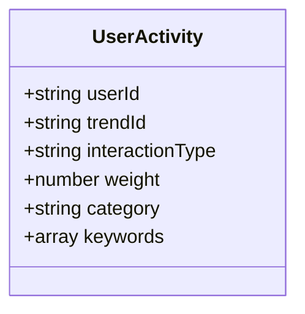
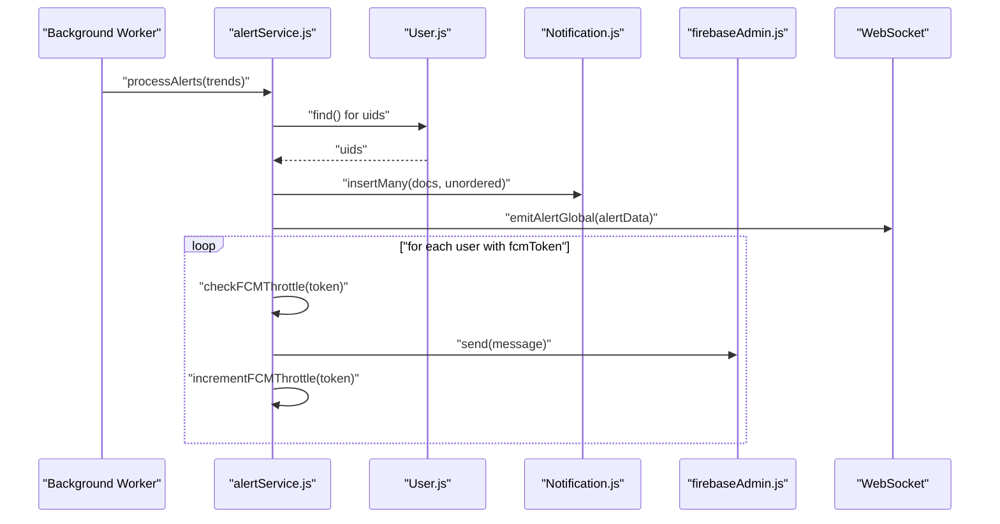
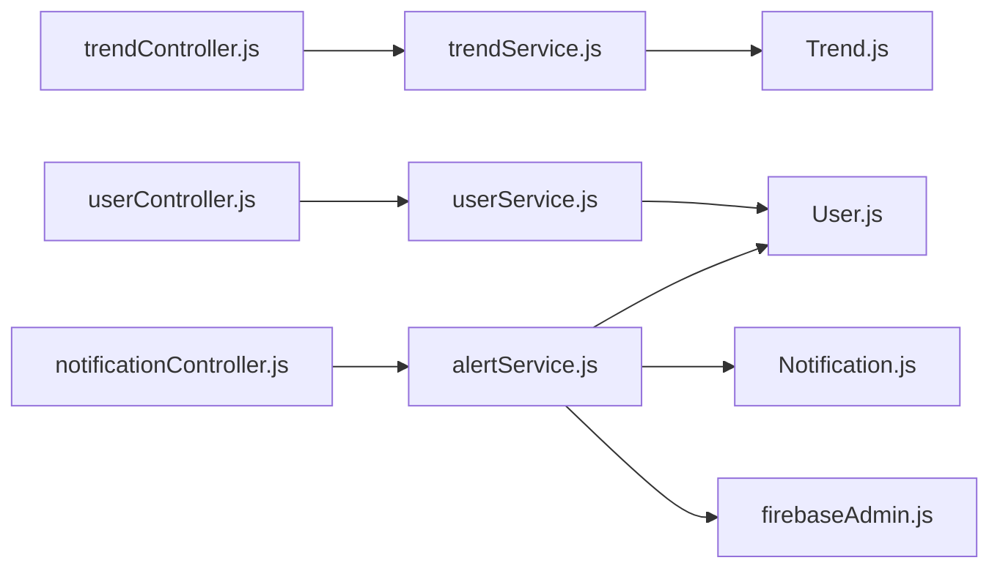

# Database Integration

<cite>
**Referenced Files in This Document**
- [Trend.js](file://backend/src/models/Trend.js)
- [User.js](file://backend/src/models/User.js)
- [Notification.js](file://backend/src/models/Notification.js)
- [TrendHistory.js](file://backend/src/models/TrendHistory.js)
- [UserActivity.js](file://backend/src/models/UserActivity.js)
- [dbIndexes.js](file://backend/src/config/dbIndexes.js)
- [trendController.js](file://backend/src/controllers/trendController.js)
- [userController.js](file://backend/src/controllers/userController.js)
- [notificationController.js](file://backend/src/controllers/notificationController.js)
- [trendService.js](file://backend/src/services/trendService.js)
- [userService.js](file://backend/src/services/userService.js)
- [alertService.js](file://backend/src/services/alertService.js)
- [firebaseAdmin.js](file://backend/src/utils/firebaseAdmin.js)
</cite>

## Table of Contents
1. [Introduction](#introduction)
2. [Project Structure](#project-structure)
3. [Core Components](#core-components)
4. [Architecture Overview](#architecture-overview)
5. [Detailed Component Analysis](#detailed-component-analysis)
6. [Dependency Analysis](#dependency-analysis)
7. [Performance Considerations](#performance-considerations)
8. [Troubleshooting Guide](#troubleshooting-guide)
9. [Conclusion](#conclusion)
10. [Appendices](#appendices)

## Introduction
This document explains the database integration built with MongoDB and Mongoose across the backend. It covers schema design patterns, model definitions, and data relationships among entities. It documents the Trend model with scoring algorithms, confidence calculations, and temporal data tracking. It also explains the User model for authentication, preferences, and activity tracking, the Notification model for real-time alerts and user subscriptions, and the TrendHistory model for trend evolution tracking and analytics. Additionally, it outlines indexing strategies, query optimization patterns, performance considerations, Firebase Admin integration for push notifications, and data migration and consistency strategies.

## Project Structure
The database layer is organized around Mongoose models, controllers, services, and configuration utilities. Models define schemas and indexes. Controllers orchestrate requests and delegate to services. Services encapsulate business logic and data access. Configuration utilities manage index creation and operational logging.

**Diagram sources**
- [Trend.js:1-188](file://backend/src/models/Trend.js#L1-L188)
- [User.js:1-35](file://backend/src/models/User.js#L1-L35)
- [Notification.js:1-39](file://backend/src/models/Notification.js#L1-L39)
- [TrendHistory.js:1-43](file://backend/src/models/TrendHistory.js#L1-L43)
- [UserActivity.js:1-99](file://backend/src/models/UserActivity.js#L1-L99)
- [trendController.js:1-407](file://backend/src/controllers/trendController.js#L1-L407)
- [userController.js:1-90](file://backend/src/controllers/userController.js#L1-L90)
- [notificationController.js:1-93](file://backend/src/controllers/notificationController.js#L1-L93)
- [trendService.js:1-64](file://backend/src/services/trendService.js#L1-L64)
- [userService.js:1-55](file://backend/src/services/userService.js#L1-L55)
- [alertService.js:1-282](file://backend/src/services/alertService.js#L1-L282)
- [dbIndexes.js:1-31](file://backend/src/config/dbIndexes.js#L1-L31)
- [firebaseAdmin.js:1-23](file://backend/src/utils/firebaseAdmin.js#L1-L23)

**Section sources**
- [Trend.js:1-188](file://backend/src/models/Trend.js#L1-L188)
- [User.js:1-35](file://backend/src/models/User.js#L1-L35)
- [Notification.js:1-39](file://backend/src/models/Notification.js#L1-L39)
- [TrendHistory.js:1-43](file://backend/src/models/TrendHistory.js#L1-L43)
- [UserActivity.js:1-99](file://backend/src/models/UserActivity.js#L1-L99)
- [dbIndexes.js:1-31](file://backend/src/config/dbIndexes.js#L1-L31)
- [trendController.js:1-407](file://backend/src/controllers/trendController.js#L1-L407)
- [userController.js:1-90](file://backend/src/controllers/userController.js#L1-L90)
- [notificationController.js:1-93](file://backend/src/controllers/notificationController.js#L1-L93)
- [trendService.js:1-64](file://backend/src/services/trendService.js#L1-L64)
- [userService.js:1-55](file://backend/src/services/userService.js#L1-L55)
- [alertService.js:1-282](file://backend/src/services/alertService.js#L1-L282)
- [firebaseAdmin.js:1-23](file://backend/src/utils/firebaseAdmin.js#L1-L23)

## Core Components
- Trend model: Central entity for trending topics with composite scoring, AI confidence, geospatial intelligence, clustering, anomaly detection, and prediction metadata. Includes embedded analytics and temporal score history.
- User model: Authentication-backed profile with preferences, interests, saved trends, and geolocation metadata.
- Notification model: Real-time alert storage with deduplication and read-state tracking.
- TrendHistory model: Time-series snapshots for trend evolution analytics.
- UserActivity model: Interaction micro-tracking with weights and TTL cleanup.
- Index configuration: Startup verification and logging for compound indexes.

**Section sources**
- [Trend.js:1-188](file://backend/src/models/Trend.js#L1-L188)
- [User.js:1-35](file://backend/src/models/User.js#L1-L35)
- [Notification.js:1-39](file://backend/src/models/Notification.js#L1-L39)
- [TrendHistory.js:1-43](file://backend/src/models/TrendHistory.js#L1-L43)
- [UserActivity.js:1-99](file://backend/src/models/UserActivity.js#L1-L99)
- [dbIndexes.js:1-31](file://backend/src/config/dbIndexes.js#L1-L31)

## Architecture Overview
The system integrates Mongoose models with controller-layer orchestration and service-layer business logic. Alerts leverage Firebase Admin for push notifications while maintaining in-app notifications and WebSocket emissions. Indexes are ensured at startup for optimal query performance.

**Diagram sources**
- [trendController.js:1-407](file://backend/src/controllers/trendController.js#L1-L407)
- [trendService.js:1-64](file://backend/src/services/trendService.js#L1-L64)
- [Trend.js:1-188](file://backend/src/models/Trend.js#L1-L188)

**Section sources**
- [trendController.js:1-407](file://backend/src/controllers/trendController.js#L1-L407)
- [trendService.js:1-64](file://backend/src/services/trendService.js#L1-L64)
- [Trend.js:1-188](file://backend/src/models/Trend.js#L1-L188)

## Detailed Component Analysis

### Trend Model
The Trend model defines a rich schema supporting:
- Unique identifiers and metadata (title, category, author, sourceUrl, publishedAt).
- Engagement and ingestion metadata (engagementScore, type, publishedAt).
- Composite scoring (trendScore) and discrete scores (viralScore, heatScore, growthScore, compositeScore).
- AI Confidence sub-object (score, sourceConsistency, dataCompleteness, evaluatedAt).
- Geospatial intelligence (country, state, city, coordinates).
- Emerging trend detection (isEmerging, emergingDetectedAt).
- Multi-source ingestion (reddit, youtube, googleNews) with timestamps.
- Related trend references (relatedTrendIds).
- AI analysis (status, summary, whyTrending, sentiment, sentimentScore, targetAudience, prediction, keywords, processedAt).
- Embedded analytics (chartData, metrics).
- Prediction metadata (lifecycleState, confidenceScore, matchedTrendId, matchProfile, historicalPeak, predictedRegions, predictionJustification, computedAt).
- Clustering and anomaly fields (parentClusterId, clusterSize, isAnomaly, anomalyScore, moderationStatus).
- Timestamps and indexes for performance.

Scoring and confidence:
- Discrete scores are capped and indexed for sorting and filtering.
- AI Confidence provides a structured assessment with evaluation timestamp.
- Temporal score history snapshots enable frontend charts and trend evolution.

Indexing strategy:
- Category and trendScore compound index for category-scoped ranking.
- PublishedAt descending index for recency ordering.
- Analysis status index for workflow tracking.
- Viral score descending index for prominence.
- Geo-intelligence indexes for regional queries and emerging trend discovery.
- Clustering and anomaly indexes for moderation and anomaly detection.

Temporal tracking:
- Score history snapshots capture rolling scores for visualization.
- Prediction metadata includes computedAt for freshness.

**Section sources**
- [Trend.js:1-188](file://backend/src/models/Trend.js#L1-L188)

#### Trend Model Class Diagram

**Diagram sources**
- [Trend.js:1-188](file://backend/src/models/Trend.js#L1-L188)

### User Model
The User model supports:
- Authentication-backed identity (uid, email) with unique constraints.
- Profile attributes (displayName, photoURL, fcmToken).
- Preferences and interests arrays for personalization.
- Preferred sources array for platform preferences.
- Saved trends array for bookmarks.
- Geo-profile (country, countryCode, state, city, timezone, resolvedAt).
- Device locale and language weighting.
- Geo-alert throttle counters and reset timestamps.
- Timestamps and a compound index for location queries.

Activity tracking:
- Interactions are recorded via UserActivity for recommendation and personalization.

**Section sources**
- [User.js:1-35](file://backend/src/models/User.js#L1-L35)
- [UserActivity.js:1-99](file://backend/src/models/UserActivity.js#L1-L99)

#### User Model Class Diagram

**Diagram sources**
- [User.js:1-35](file://backend/src/models/User.js#L1-L35)

### Notification Model
The Notification model enables:
- User-bound notifications (userId) with indexes for fast retrieval.
- Title and message content.
- Optional trend association (trendId) for context.
- Type enumeration for categorization (hot_trend, multi_source, viral_spike, system, rising, breaking, community, video).
- Read-state tracking (read).
- Compound index for user notifications by creation time.
- Unique sparse index preventing duplicate alerts per user-trend pair.

Real-time and delivery:
- In-app notifications are stored and retrieved.
- Push notifications are sent via Firebase Admin with throttling.

**Section sources**
- [Notification.js:1-39](file://backend/src/models/Notification.js#L1-L39)
- [alertService.js:1-282](file://backend/src/services/alertService.js#L1-L282)

#### Notification Model Class Diagram

**Diagram sources**
- [Notification.js:1-39](file://backend/src/models/Notification.js#L1-L39)

### TrendHistory Model
The TrendHistory model captures:
- Historical snapshots per trend (trendId, title, source).
- Scores and engagement metrics (trendScore, engagementScore, viralityScore, mentionsCount).
- Timestamp for time-series analysis.
- Compound index for efficient per-trend time-series queries.

Analytics:
- Enables trend evolution charts and analytics dashboards.

**Section sources**
- [TrendHistory.js:1-43](file://backend/src/models/TrendHistory.js#L1-L43)

#### TrendHistory Model Class Diagram

**Diagram sources**
- [TrendHistory.js:1-43](file://backend/src/models/TrendHistory.js#L1-L43)

### UserActivity Model
The UserActivity model tracks micro-interactions:
- userId, trendId, and interactionType (click, like, bookmark, share) with de-duplication index.
- Weighted scoring per interaction type.
- Category and keyword context for recommendation.
- Rolling 7-day window aggregation for preference mapping.
- TTL index to automatically prune old interactions after 30 days.

Static helpers:
- recordInteraction: Upserts interaction with automatic weight assignment.
- getUserWeightMap: Aggregates weighted categories over the last 7 days.

**Section sources**
- [UserActivity.js:1-99](file://backend/src/models/UserActivity.js#L1-L99)

#### UserActivity Model Class Diagram

**Diagram sources**
- [UserActivity.js:1-99](file://backend/src/models/UserActivity.js#L1-L99)

### Controllers and Services Integration
Controllers coordinate business operations:
- Trend controller orchestrates aggregation, personalization, geolocation-aware feeds, analytics, and predictions.
- User controller manages profile updates, saved trends, and geo-profile retrieval.
- Notification controller handles CRUD operations for notifications and unread counts.

Services encapsulate data access and business logic:
- Trend service provides search, category/location filters, and comparison.
- User service synchronizes profiles, manages saved trends, and retrieves saved items.
- Alert service generates diverse alerts, throttles FCM pushes, emits WebSocket events, and persists notifications.

**Section sources**
- [trendController.js:1-407](file://backend/src/controllers/trendController.js#L1-L407)
- [userController.js:1-90](file://backend/src/controllers/userController.js#L1-L90)
- [notificationController.js:1-93](file://backend/src/controllers/notificationController.js#L1-L93)
- [trendService.js:1-64](file://backend/src/services/trendService.js#L1-L64)
- [userService.js:1-55](file://backend/src/services/userService.js#L1-L55)
- [alertService.js:1-282](file://backend/src/services/alertService.js#L1-L282)

#### Notification Workflow Sequence

**Diagram sources**
- [alertService.js:1-282](file://backend/src/services/alertService.js#L1-L282)
- [User.js:1-35](file://backend/src/models/User.js#L1-L35)
- [Notification.js:1-39](file://backend/src/models/Notification.js#L1-L39)
- [firebaseAdmin.js:1-23](file://backend/src/utils/firebaseAdmin.js#L1-L23)

## Dependency Analysis
- Controllers depend on services for business logic.
- Services depend on models for data access.
- Models rely on Mongoose for schema definition and indexes.
- Alert service depends on Notification, User, cacheService, and socketService.
- Index configuration ensures indexes are created at startup.

**Diagram sources**
- [trendController.js:1-407](file://backend/src/controllers/trendController.js#L1-L407)
- [userController.js:1-90](file://backend/src/controllers/userController.js#L1-L90)
- [notificationController.js:1-93](file://backend/src/controllers/notificationController.js#L1-L93)
- [trendService.js:1-64](file://backend/src/services/trendService.js#L1-L64)
- [userService.js:1-55](file://backend/src/services/userService.js#L1-L55)
- [alertService.js:1-282](file://backend/src/services/alertService.js#L1-L282)
- [Trend.js:1-188](file://backend/src/models/Trend.js#L1-L188)
- [User.js:1-35](file://backend/src/models/User.js#L1-L35)
- [Notification.js:1-39](file://backend/src/models/Notification.js#L1-L39)
- [firebaseAdmin.js:1-23](file://backend/src/utils/firebaseAdmin.js#L1-L23)

**Section sources**
- [trendController.js:1-407](file://backend/src/controllers/trendController.js#L1-L407)
- [userController.js:1-90](file://backend/src/controllers/userController.js#L1-L90)
- [notificationController.js:1-93](file://backend/src/controllers/notificationController.js#L1-L93)
- [trendService.js:1-64](file://backend/src/services/trendService.js#L1-L64)
- [userService.js:1-55](file://backend/src/services/userService.js#L1-L55)
- [alertService.js:1-282](file://backend/src/services/alertService.js#L1-L282)
- [Trend.js:1-188](file://backend/src/models/Trend.js#L1-L188)
- [User.js:1-35](file://backend/src/models/User.js#L1-L35)
- [Notification.js:1-39](file://backend/src/models/Notification.js#L1-L39)
- [firebaseAdmin.js:1-23](file://backend/src/utils/firebaseAdmin.js#L1-L23)

## Performance Considerations
- Index coverage:
  - Trend: category+trendScore, publishedAt, analysis.status, viralScore desc, geo-intelligence combinations, moderation+score, anomaly+createdAt.
  - User: location.country+state.
  - Notification: userId+read+createdAt desc, unique sparse userId+trendId.
  - UserActivity: userId+createdAt desc, userId+trendId+interactionType, TTL on createdAt.
  - TrendHistory: trendId+timestamp desc.
- Query patterns:
  - Sorting by trendScore and publishedAt uses dedicated indexes.
  - Aggregation-based preference mapping enforces a 7-day window.
  - Time-series queries leverage compound indexes on trendId+timestamp.
- Operational index verification:
  - dbIndexes script ensures indexes are created and logs outcomes.
- Caching:
  - Redis-based caching for personalized feeds reduces DB load.
- TTL and cleanup:
  - UserActivity TTL prevents unbounded growth.
- Recommendations:
  - Deduplication and upserts minimize duplicate writes.

**Section sources**
- [Trend.js:174-186](file://backend/src/models/Trend.js#L174-L186)
- [User.js:31-32](file://backend/src/models/User.js#L31-L32)
- [Notification.js:32-36](file://backend/src/models/Notification.js#L32-L36)
- [UserActivity.js:47-52](file://backend/src/models/UserActivity.js#L47-L52)
- [TrendHistory.js:39-40](file://backend/src/models/TrendHistory.js#L39-L40)
- [dbIndexes.js:13-27](file://backend/src/config/dbIndexes.js#L13-L27)

## Troubleshooting Guide
- Index creation failures:
  - Use the dbIndexes script to verify and log index creation status.
- Duplicate notification prevention:
  - Unique sparse index on userId+trendId ensures deduplication.
- FCM throttling:
  - Throttle enforced per device token with a 2-hour window and cap of 3 pushes.
  - Cache key hashing ensures safe Redis keys.
- Interaction recording:
  - recordInteraction upserts to avoid duplicates and assigns weights.
  - getUserWeightMap aggregates over a 7-day window.
- Notification CRUD:
  - Mark as read, mark all as read, unread count, and clear all supported operations.

**Section sources**
- [dbIndexes.js:13-27](file://backend/src/config/dbIndexes.js#L13-L27)
- [Notification.js:35-36](file://backend/src/models/Notification.js#L35-L36)
- [alertService.js:177-198](file://backend/src/services/alertService.js#L177-L198)
- [UserActivity.js:57-94](file://backend/src/models/UserActivity.js#L57-L94)
- [notificationController.js:7-92](file://backend/src/controllers/notificationController.js#L7-L92)

## Conclusion
The database integration leverages Mongoose to model complex, interconnected entities with robust indexing and performance patterns. The Trend model centralizes scoring, confidence, geospatial intelligence, clustering, and predictions. The User model supports authentication, preferences, and activity tracking. Notifications provide real-time alerts with deduplication and throttling. TrendHistory enables analytics over time. Index configuration and caching strategies ensure scalable query performance. Firebase Admin integration delivers push notifications with operational safeguards.

## Appendices

### Firebase Admin Integration
- Initialization loads credentials from a service account file and guards against duplicate app initialization.
- AlertService uses Firebase Admin SDK to send push notifications with channel configuration and error handling.

**Section sources**
- [firebaseAdmin.js:1-23](file://backend/src/utils/firebaseAdmin.js#L1-L23)
- [alertService.js:203-229](file://backend/src/services/alertService.js#L203-L229)

### Data Migration and Backup Strategies
- Index verification at startup ensures schema readiness and operational visibility.
- TTL indexes (e.g., UserActivity) help manage long-term data volume.
- Recommendation: Use MongoDB Atlas backups for point-in-time recovery and change streams for CDC pipelines.
- Consistency patterns:
  - Upserts for interactions and user saves reduce race conditions.
  - Compound indexes and unique constraints enforce referential integrity at the application level.

**Section sources**
- [dbIndexes.js:13-27](file://backend/src/config/dbIndexes.js#L13-L27)
- [UserActivity.js:51-52](file://backend/src/models/UserActivity.js#L51-L52)
- [trendController.js:318-323](file://backend/src/controllers/trendController.js#L318-L323)
- [userService.js:27-41](file://backend/src/services/userService.js#L27-L41)