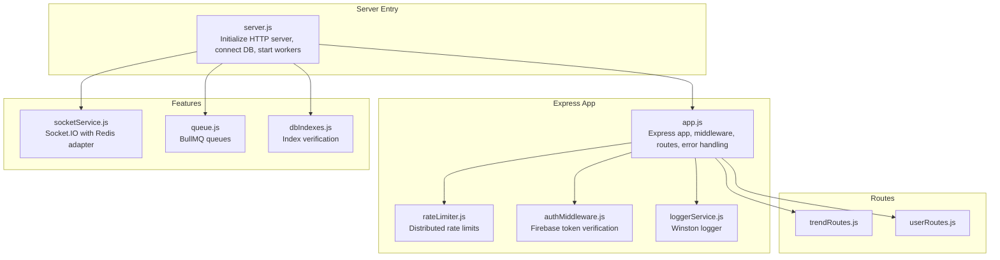
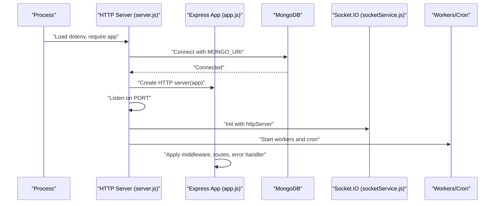
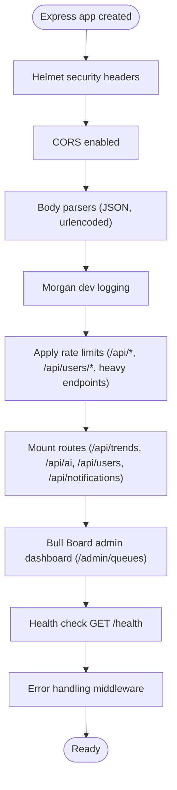
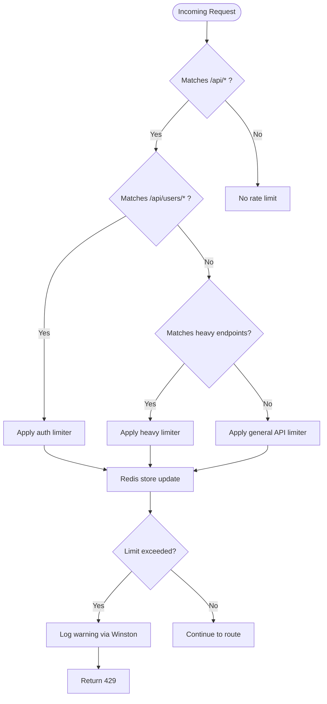
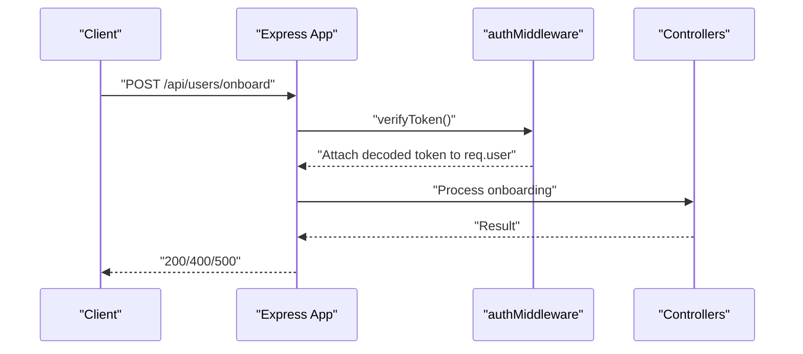
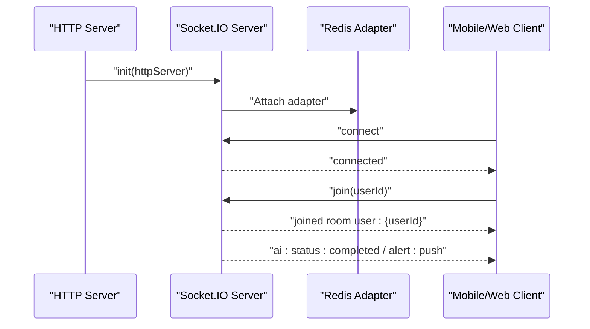
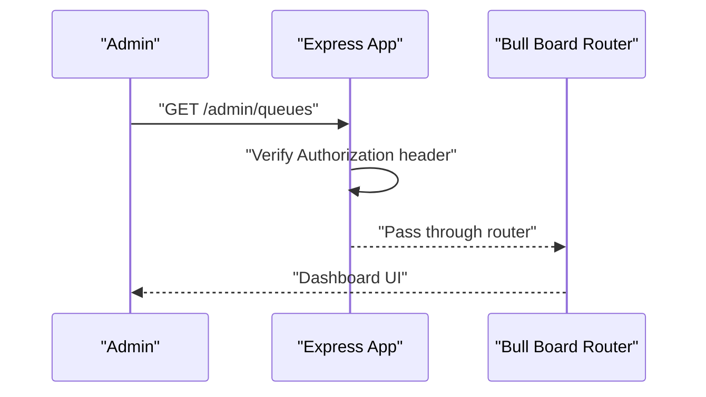
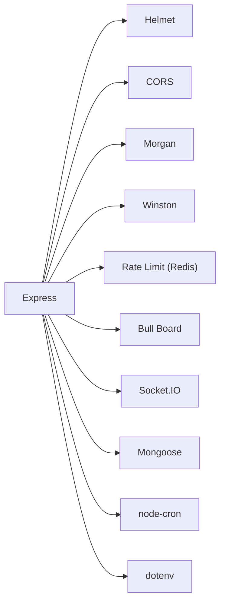

# Express Server Configuration

<cite>
**Referenced Files in This Document**
- [server.js](file://backend/server.js)
- [app.js](file://backend/src/app.js)
- [rateLimiter.js](file://backend/src/middlewares/rateLimiter.js)
- [authMiddleware.js](file://backend/src/middlewares/authMiddleware.js)
- [trendRoutes.js](file://backend/src/routes/trendRoutes.js)
- [userRoutes.js](file://backend/src/routes/userRoutes.js)
- [loggerService.js](file://backend/src/services/loggerService.js)
- [socketService.js](file://backend/src/services/socketService.js)
- [queue.js](file://backend/src/config/queue.js)
- [dbIndexes.js](file://backend/src/config/dbIndexes.js)
- [package.json](file://backend/package.json)
</cite>

## Table of Contents
1. [Introduction](#introduction)
2. [Project Structure](#project-structure)
3. [Core Components](#core-components)
4. [Architecture Overview](#architecture-overview)
5. [Detailed Component Analysis](#detailed-component-analysis)
6. [Dependency Analysis](#dependency-analysis)
7. [Performance Considerations](#performance-considerations)
8. [Troubleshooting Guide](#troubleshooting-guide)
9. [Conclusion](#conclusion)
10. [Appendices](#appendices)

## Introduction
This document explains the Express.js server configuration and initialization for the backend service. It covers the server startup lifecycle, middleware stack, routing, security headers, logging, rate limiting, WebSocket integration, queue monitoring, and operational best practices. It also provides guidance for environment configuration, deployment, SSL/TLS, monitoring, graceful shutdown, and production hardening.

## Project Structure
The backend server is organized around a modular Express application with dedicated modules for middleware, routes, services, configuration, and utilities. The server entry point initializes the HTTP server, connects to MongoDB, starts background workers, and launches the Express app.

**Diagram sources**
- [server.js:1-51](file://backend/server.js#L1-L51)
- [app.js:1-88](file://backend/src/app.js#L1-L88)
- [rateLimiter.js:1-80](file://backend/src/middlewares/rateLimiter.js#L1-L80)
- [authMiddleware.js:1-27](file://backend/src/middlewares/authMiddleware.js#L1-L27)
- [socketService.js:1-107](file://backend/src/services/socketService.js#L1-L107)
- [queue.js:1-32](file://backend/src/config/queue.js#L1-L32)
- [dbIndexes.js:1-31](file://backend/src/config/dbIndexes.js#L1-L31)
- [trendRoutes.js:1-50](file://backend/src/routes/trendRoutes.js#L1-L50)
- [userRoutes.js:1-18](file://backend/src/routes/userRoutes.js#L1-L18)
- [loggerService.js:1-43](file://backend/src/services/loggerService.js#L1-L43)

**Section sources**
- [server.js:1-51](file://backend/server.js#L1-L51)
- [app.js:1-88](file://backend/src/app.js#L1-L88)

## Core Components
- Express app instance creation and middleware stack
- Environment-driven configuration and port selection
- Security headers via Helmet and CORS policy
- Request logging with Morgan and structured Winston logging
- Rate limiting with Redis-backed stores
- Health check endpoint and admin queue dashboard with basic auth
- Routing for trends, users, and onboarding
- Background workers, cron jobs, and queue workers
- WebSocket server with Redis adapter for multi-instance scaling
- MongoDB connection and index verification at startup

**Section sources**
- [app.js:1-88](file://backend/src/app.js#L1-L88)
- [server.js:11-51](file://backend/server.js#L11-L51)
- [rateLimiter.js:1-80](file://backend/src/middlewares/rateLimiter.js#L1-L80)
- [loggerService.js:1-43](file://backend/src/services/loggerService.js#L1-L43)
- [socketService.js:1-107](file://backend/src/services/socketService.js#L1-L107)
- [queue.js:1-32](file://backend/src/config/queue.js#L1-L32)
- [dbIndexes.js:1-31](file://backend/src/config/dbIndexes.js#L1-L31)

## Architecture Overview
The server follows a layered architecture:
- Entry point initializes HTTP server and database connectivity
- Express app composes middleware, routes, and error handlers
- Services handle business logic and integrate with external systems
- Background tasks and cron jobs maintain data freshness
- WebSocket server enables real-time updates across instances

**Diagram sources**
- [server.js:1-51](file://backend/server.js#L1-L51)
- [app.js:1-88](file://backend/src/app.js#L1-L88)
- [socketService.js:20-55](file://backend/src/services/socketService.js#L20-L55)

## Detailed Component Analysis

### Express App Initialization and Middleware Stack
- Security headers: Helmet is applied globally to set secure defaults.
- CORS: Enabled with default settings for cross-origin requests.
- Body parsing: JSON and URL-encoded bodies are supported.
- Logging: Morgan logs requests in development mode; Winston logs errors and rotates files.
- Rate limiting: Redis-backed distributed limits for general API, authentication, and heavy endpoints.
- Admin queue dashboard: Bull Board mounted under /admin/queues with bearer auth.
- Routes: Mounted for trends, AI chat, users, and notifications.
- Onboarding endpoint: Requires a valid Firebase token and processes user preferences.
- Error handling: Centralized middleware logs and returns a 500 response.

**Diagram sources**
- [app.js:9-26](file://backend/src/app.js#L9-L26)
- [app.js:16-21](file://backend/src/app.js#L16-L21)
- [app.js:33-57](file://backend/src/app.js#L33-L57)
- [app.js:59-62](file://backend/src/app.js#L59-L62)
- [app.js:64-79](file://backend/src/app.js#L64-L79)
- [app.js:81-85](file://backend/src/app.js#L81-L85)

**Section sources**
- [app.js:1-88](file://backend/src/app.js#L1-L88)

### Environment Variables and Port Configuration
- dotenv loads environment variables early in both server and app bootstrap.
- PORT is read from the environment with a fallback to 5000.
- MONGO_URI is used to connect to MongoDB.
- REDIS_URL is used for rate limiting Redis store.
- ADMIN_SECRET is used for securing the queue admin dashboard.
- LOG_LEVEL controls Winston log verbosity.
- NODE_ENV affects console transport in Winston.

Practical implications:
- Set MONGO_URI, REDIS_URL, and ADMIN_SECRET in production.
- Use a reverse proxy or container orchestration to expose the service on the desired port.

**Section sources**
- [server.js:11](file://backend/server.js#L11)
- [server.js:17](file://backend/server.js#L17)
- [app.js:5](file://backend/src/app.js#L5)
- [rateLimiter.js:13](file://backend/src/middlewares/rateLimiter.js#L13)
- [app.js:51-57](file://backend/src/app.js#L51-L57)
- [loggerService.js:12](file://backend/src/services/loggerService.js#L12)

### Security Headers Setup
- Helmet is applied globally to set secure HTTP headers.
- CORS is enabled with default settings; adjust origin/methods as needed for production.
- Admin queue dashboard requires a bearer token derived from ADMIN_SECRET.
- Firebase Admin verifies JWT tokens for protected endpoints.

Recommendations:
- Lock down CORS origin to trusted domains.
- Rotate ADMIN_SECRET regularly and avoid hardcoded defaults.
- Enforce HTTPS termination at the edge (reverse proxy or load balancer).

**Section sources**
- [app.js:10-11](file://backend/src/app.js#L10-L11)
- [app.js:11](file://backend/src/app.js#L11)
- [app.js:51-57](file://backend/src/app.js#L51-L57)
- [authMiddleware.js:3-24](file://backend/src/middlewares/authMiddleware.js#L3-L24)

### Request Logging and Error Handling
- Morgan logs requests in development mode.
- Winston rotates error and combined logs daily with retention policies.
- Error handler logs unhandled errors and responds with a generic 500 message.

Operational tips:
- Monitor rotated log files for error spikes.
- Consider adding correlation IDs and structured context to logs.

**Section sources**
- [app.js:14](file://backend/src/app.js#L14)
- [loggerService.js:11-40](file://backend/src/services/loggerService.js#L11-L40)
- [app.js:81-85](file://backend/src/app.js#L81-L85)

### Health Check Endpoint
- A simple GET /health returns a 200 status with a readiness message.
- Useful for load balancers and orchestrators.

**Section sources**
- [app.js:23-26](file://backend/src/app.js#L23-L26)

### Rate Limiting Strategy
- Three tiers:
  - General API limiter: 100 requests per 15 minutes per IP.
  - Authentication limiter: 20 requests per 15 minutes per IP.
  - Heavy endpoint limiter: 10 requests per 5 minutes per IP.
- Redis-backed stores synchronize limits across instances.
- Logs blocked requests via Winston.

**Diagram sources**
- [app.js:16-21](file://backend/src/app.js#L16-L21)
- [rateLimiter.js:23-57](file://backend/src/middlewares/rateLimiter.js#L23-L57)
- [rateLimiter.js:63-77](file://backend/src/middlewares/rateLimiter.js#L63-L77)

**Section sources**
- [rateLimiter.js:1-80](file://backend/src/middlewares/rateLimiter.js#L1-L80)
- [app.js:16-21](file://backend/src/app.js#L16-L21)

### Routing and Protected Endpoints
- Trend routes support public feeds, geospatial queries, and authenticated personalization.
- User routes support sync, profile updates, saved trends, and geo profile.
- Onboarding endpoint validates categories array and processes user preferences.
- Authentication middleware verifies Firebase ID tokens and attaches user info to requests.

**Diagram sources**
- [app.js:64-79](file://backend/src/app.js#L64-L79)
- [authMiddleware.js:3-24](file://backend/src/middlewares/authMiddleware.js#L3-L24)
- [trendRoutes.js:12-48](file://backend/src/routes/trendRoutes.js#L12-L48)
- [userRoutes.js:6-16](file://backend/src/routes/userRoutes.js#L6-L16)

**Section sources**
- [trendRoutes.js:1-50](file://backend/src/routes/trendRoutes.js#L1-L50)
- [userRoutes.js:1-18](file://backend/src/routes/userRoutes.js#L1-L18)
- [app.js:64-79](file://backend/src/app.js#L64-L79)
- [authMiddleware.js:1-27](file://backend/src/middlewares/authMiddleware.js#L1-L27)

### WebSocket Integration and Real-Time Updates
- Socket.IO is initialized with a Redis adapter for multi-instance broadcasting.
- Ping intervals and timeouts are configured for reliability.
- Events include joining user-specific rooms and emitting AI completion and alert signals.

**Diagram sources**
- [socketService.js:20-55](file://backend/src/services/socketService.js#L20-L55)
- [socketService.js:62-91](file://backend/src/services/socketService.js#L62-L91)

**Section sources**
- [socketService.js:1-107](file://backend/src/services/socketService.js#L1-L107)

### Queue Monitoring and Administration
- Bull Board Express adapter is mounted under /admin/queues.
- Requires a bearer token matching ADMIN_SECRET.
- Displays two queues: ai-enrichment and trend-fetching.

**Diagram sources**
- [app.js:34-57](file://backend/src/app.js#L34-L57)

**Section sources**
- [app.js:33-57](file://backend/src/app.js#L33-L57)

### Background Tasks, Cron Jobs, and Queue Workers
- At startup, the server initializes:
  - Socket.IO
  - Background worker
  - Queue workers for AI enrichment and trend fetching
  - Cron job to scan for emerging geo trends hourly
- Index verification runs to ensure compound indexes exist.

**Section sources**
- [server.js:27-46](file://backend/server.js#L27-L46)
- [dbIndexes.js:13-28](file://backend/src/config/dbIndexes.js#L13-L28)

## Dependency Analysis
External dependencies relevant to server configuration and runtime:
- Express: Web framework
- Helmet: Security headers
- CORS: Cross-origin policy
- Morgan: Request logging
- Winston + Daily Rotate File: Structured logging
- Rate limit with Redis: Distributed throttling
- BullMQ + Bull Board: Queue management
- Socket.IO + Redis adapter: Real-time messaging
- Mongoose: MongoDB ODM
- node-cron: Scheduled tasks
- dotenv: Environment variables

**Diagram sources**
- [package.json:14-39](file://backend/package.json#L14-L39)
- [app.js:1-7](file://backend/src/app.js#L1-L7)

**Section sources**
- [package.json:1-45](file://backend/package.json#L1-L45)
- [app.js:1-7](file://backend/src/app.js#L1-L7)

## Performance Considerations
- Use a reverse proxy (e.g., Nginx, Traefik) or cloud load balancer to offload TLS termination and handle SSL/TLS.
- Enable keep-alive and appropriate timeouts at the proxy layer.
- Scale horizontally behind a load balancer; Socket.IO uses Redis adapter for multi-instance broadcasting.
- Tune rate limiter windows and max values based on traffic patterns.
- Monitor queue backlog and adjust worker concurrency.
- Use environment-specific logging levels and disable console transport in production.

[No sources needed since this section provides general guidance]

## Troubleshooting Guide
Common issues and remedies:
- MongoDB connection failures: Verify MONGO_URI and network access.
- Redis connectivity for rate limiting: Confirm REDIS_URL and credentials.
- Unauthorized queue admin access: Ensure ADMIN_SECRET matches the Authorization header.
- CORS errors: Adjust CORS origin to match frontend domain.
- Excessive 429 responses: Review rate limiter thresholds and client-side retry logic.
- WebSocket disconnects: Check Redis adapter availability and ping settings.
- Unhandled exceptions: Inspect Winston logs for stack traces.

**Section sources**
- [server.js:48-50](file://backend/server.js#L48-L50)
- [rateLimiter.js:15-17](file://backend/src/middlewares/rateLimiter.js#L15-L17)
- [app.js:51-57](file://backend/src/app.js#L51-L57)
- [loggerService.js:15-29](file://backend/src/services/loggerService.js#L15-L29)
- [socketService.js:31-36](file://backend/src/services/socketService.js#L31-L36)

## Conclusion
The Express server is configured with strong defaults for security, observability, and scalability. It integrates rate limiting, structured logging, real-time messaging, queue administration, and background automation. For production, focus on environment hardening, SSL/TLS termination at the edge, robust monitoring, and careful tuning of rate limits and queue backlogs.

[No sources needed since this section summarizes without analyzing specific files]

## Appendices

### Deployment Configurations
- Local development: Use dotenv variables and nodemon for hot reload.
- Production: Set MONGO_URI, REDIS_URL, ADMIN_SECRET, LOG_LEVEL, and NODE_ENV via environment.
- Reverse proxy: Terminate TLS, forward to the Express server, and configure CORS accordingly.
- Containerization: Package with Docker and manage secrets via environment variables or secret managers.

**Section sources**
- [package.json:6-9](file://backend/package.json#L6-L9)
- [server.js:17](file://backend/server.js#L17)
- [rateLimiter.js:13](file://backend/src/middlewares/rateLimiter.js#L13)
- [app.js:51-57](file://backend/src/app.js#L51-L57)
- [loggerService.js:12](file://backend/src/services/loggerService.js#L12)

### SSL/TLS Setup
- Terminate TLS at the reverse proxy or load balancer.
- Configure HTTPS listeners on the proxy and forward to HTTP on localhost.
- Ensure certificates are renewed automatically and validated regularly.

[No sources needed since this section provides general guidance]

### Graceful Shutdown Procedures
- Capture SIGTERM/SIGINT and close:
  - HTTP server gracefully
  - MongoDB connections
  - Socket.IO server and adapter
  - Queue workers and cron jobs
- Drain in-flight requests and pending jobs before exiting.

[No sources needed since this section provides general guidance]