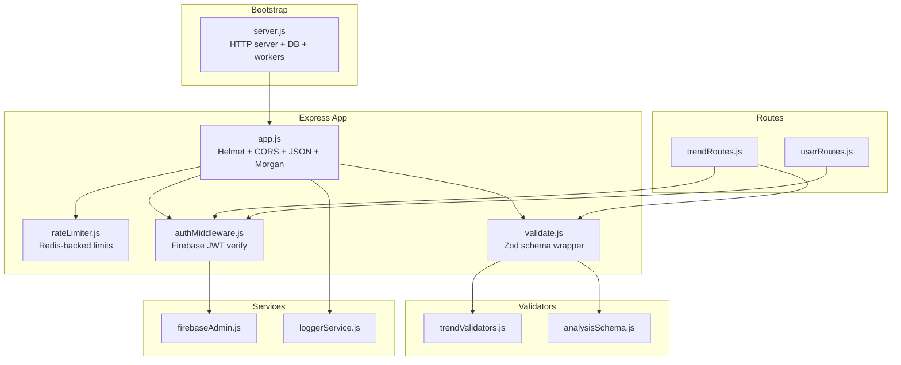
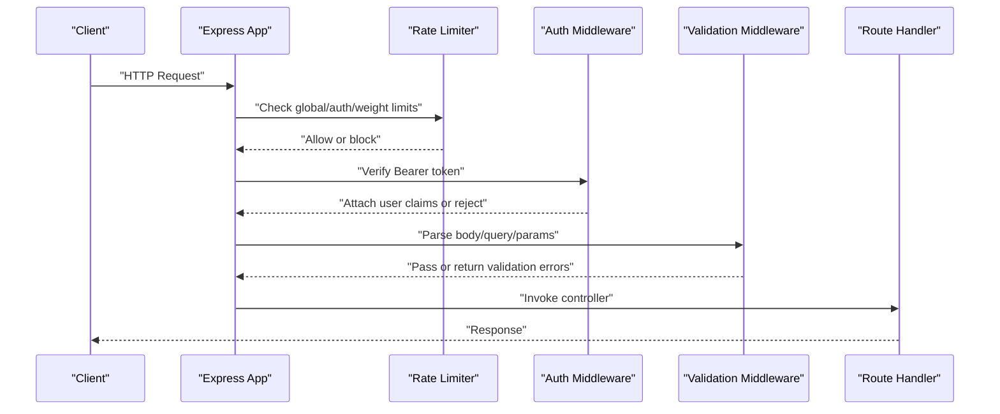
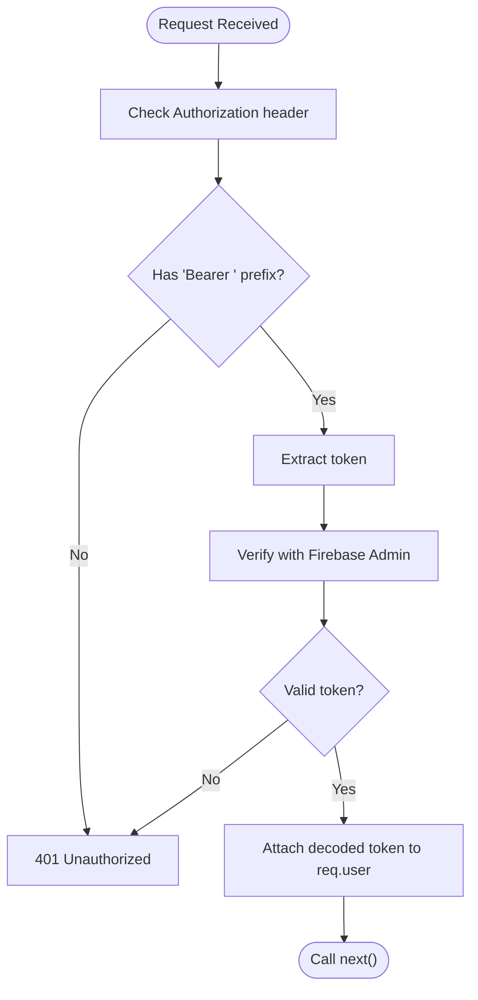
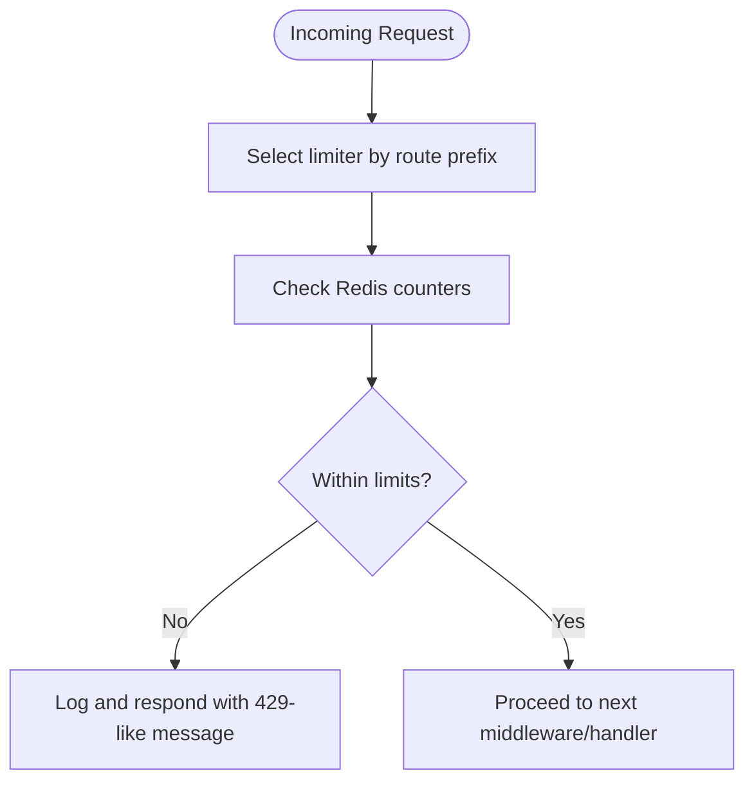
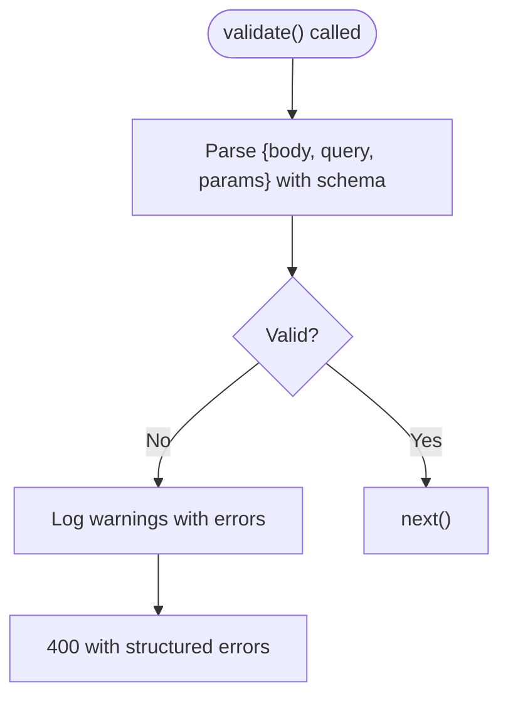
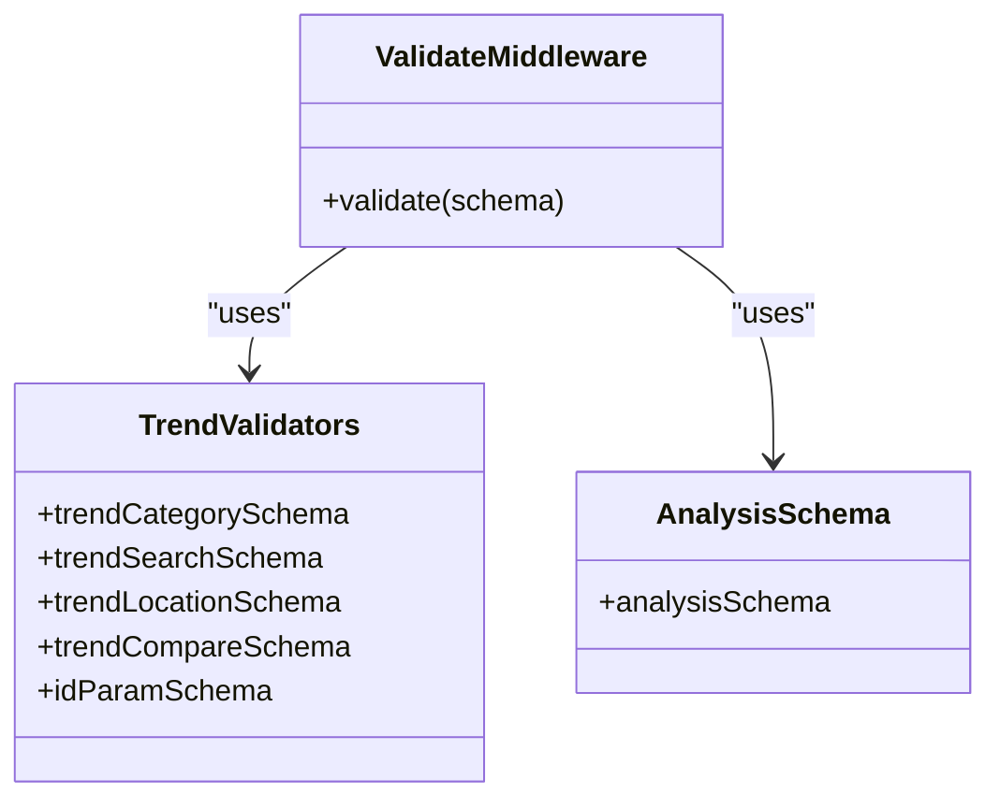
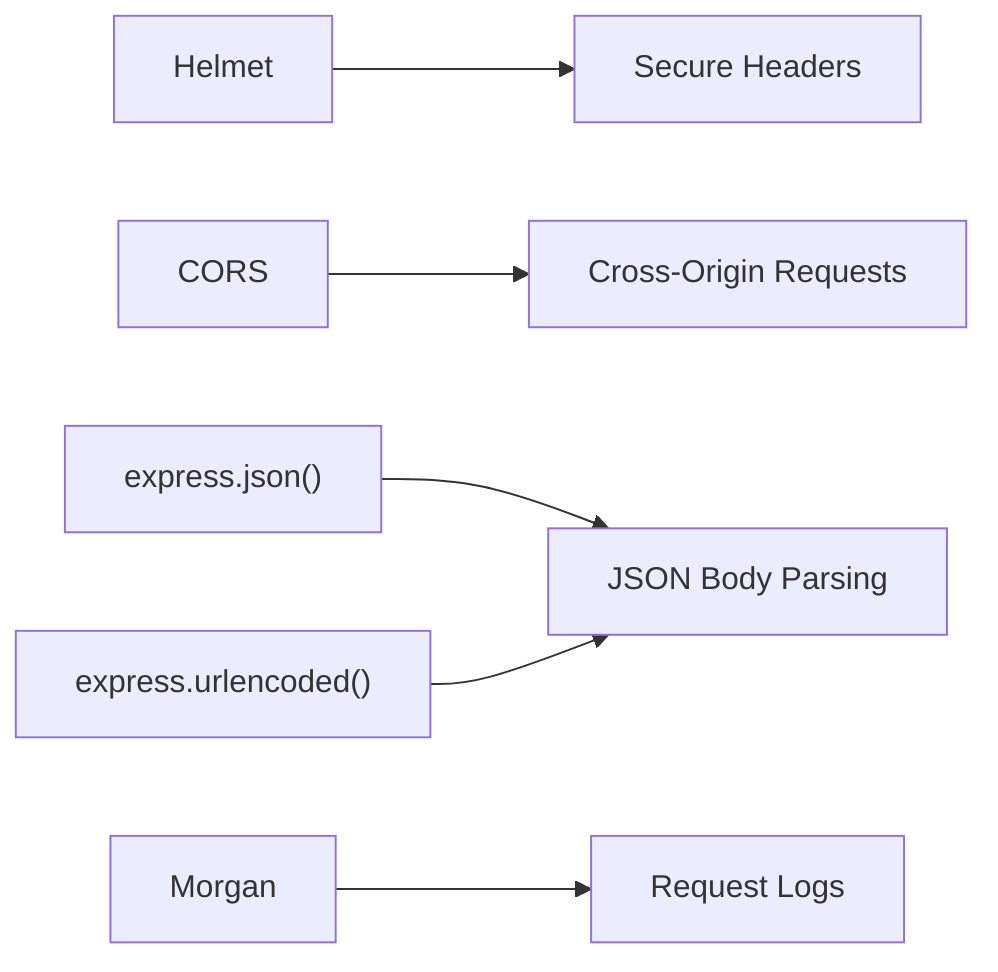
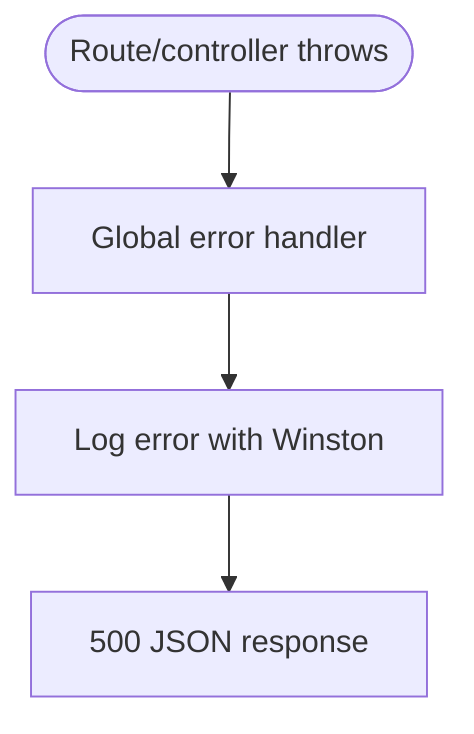
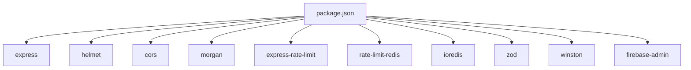

# Middleware and Security

<cite>
**Referenced Files in This Document**
- [server.js](file://backend/server.js)
- [app.js](file://backend/src/app.js)
- [authMiddleware.js](file://backend/src/middlewares/authMiddleware.js)
- [rateLimiter.js](file://backend/src/middlewares/rateLimiter.js)
- [validate.js](file://backend/src/middlewares/validate.js)
- [trendValidators.js](file://backend/src/validators/trendValidators.js)
- [analysisSchema.js](file://backend/src/validators/analysisSchema.js)
- [firebaseAdmin.js](file://backend/src/utils/firebaseAdmin.js)
- [loggerService.js](file://backend/src/services/loggerService.js)
- [userRoutes.js](file://backend/src/routes/userRoutes.js)
- [trendRoutes.js](file://backend/src/routes/trendRoutes.js)
- [package.json](file://backend/package.json)
</cite>

## Table of Contents
1. [Introduction](#introduction)
2. [Project Structure](#project-structure)
3. [Core Components](#core-components)
4. [Architecture Overview](#architecture-overview)
5. [Detailed Component Analysis](#detailed-component-analysis)
6. [Dependency Analysis](#dependency-analysis)
7. [Performance Considerations](#performance-considerations)
8. [Troubleshooting Guide](#troubleshooting-guide)
9. [Conclusion](#conclusion)
10. [Appendices](#appendices)

## Introduction
This document explains the middleware stack and security implementations in the backend API. It covers:
- Authentication middleware using Firebase Admin for JWT validation
- Sessionless user authorization via attached user claims
- Rate limiting with Redis-backed distributed throttling
- Input validation using Zod schemas with centralized error handling
- Security middleware for CORS, CSP, and request sanitization
- Validation framework for trend data, user inputs, and AI analysis outputs
- Error handling middleware for centralized exception management and response formatting
- Security best practices, vulnerability mitigation, and production compliance considerations

## Project Structure
The backend is an Express application with modular middleware and validators. Key areas:
- Middlewares: authentication, rate limiting, input validation
- Validators: Zod schemas for trend queries and AI analysis
- Services: logging, Firebase Admin initialization
- Routes: public and authenticated endpoints wired to middleware
- Application bootstrap: server startup, DB connection, queue workers, cron jobs

**Diagram sources**
- [server.js:1-51](file://backend/server.js#L1-L51)
- [app.js:1-88](file://backend/src/app.js#L1-L88)
- [rateLimiter.js:1-80](file://backend/src/middlewares/rateLimiter.js#L1-L80)
- [authMiddleware.js:1-27](file://backend/src/middlewares/authMiddleware.js#L1-L27)
- [validate.js:1-23](file://backend/src/middlewares/validate.js#L1-L23)
- [trendValidators.js:1-41](file://backend/src/validators/trendValidators.js#L1-L41)
- [analysisSchema.js:1-25](file://backend/src/validators/analysisSchema.js#L1-L25)
- [firebaseAdmin.js:1-23](file://backend/src/utils/firebaseAdmin.js#L1-L23)
- [loggerService.js:1-43](file://backend/src/services/loggerService.js#L1-L43)
- [trendRoutes.js:1-50](file://backend/src/routes/trendRoutes.js#L1-L50)
- [userRoutes.js:1-18](file://backend/src/routes/userRoutes.js#L1-L18)

**Section sources**
- [server.js:1-51](file://backend/server.js#L1-L51)
- [app.js:1-88](file://backend/src/app.js#L1-L88)

## Core Components
- Authentication middleware: validates Authorization: Bearer tokens via Firebase Admin and attaches decoded user claims to the request
- Rate limiting: global, auth-specific, and heavy-operation limits backed by Redis for distributed synchronization
- Input validation: Zod-based middleware that parses request body/query/params and returns structured error responses
- Security middleware: Helmet for secure headers, CORS defaults, JSON parsing, and request logging
- Logging: Winston with daily rotation and console transport for development
- Error handling: centralized middleware to log unhandled errors and return standardized JSON responses

**Section sources**
- [authMiddleware.js:1-27](file://backend/src/middlewares/authMiddleware.js#L1-L27)
- [rateLimiter.js:1-80](file://backend/src/middlewares/rateLimiter.js#L1-L80)
- [validate.js:1-23](file://backend/src/middlewares/validate.js#L1-L23)
- [app.js:1-88](file://backend/src/app.js#L1-L88)
- [loggerService.js:1-43](file://backend/src/services/loggerService.js#L1-L43)

## Architecture Overview
The middleware stack is applied globally and per-route to enforce security, rate limits, and validation. Authentication is enforced on protected routes, while validation ensures robust input handling. Centralized logging and error handling provide observability and resilience.

**Diagram sources**
- [app.js:16-21](file://backend/src/app.js#L16-L21)
- [rateLimiter.js:23-57](file://backend/src/middlewares/rateLimiter.js#L23-L57)
- [authMiddleware.js:3-24](file://backend/src/middlewares/authMiddleware.js#L3-L24)
- [validate.js:4-20](file://backend/src/middlewares/validate.js#L4-L20)
- [trendRoutes.js:15-18](file://backend/src/routes/trendRoutes.js#L15-L18)
- [userRoutes.js:6-12](file://backend/src/routes/userRoutes.js#L6-L12)

## Detailed Component Analysis

### Authentication Middleware (JWT via Firebase Admin)
- Validates Authorization header presence and Bearer scheme
- Verifies the ID token with Firebase Admin
- Attaches decoded token (including uid) to req.user
- Returns 401 on missing/expired/invalid tokens

**Diagram sources**
- [authMiddleware.js:3-24](file://backend/src/middlewares/authMiddleware.js#L3-L24)
- [firebaseAdmin.js:1-23](file://backend/src/utils/firebaseAdmin.js#L1-L23)

**Section sources**
- [authMiddleware.js:1-27](file://backend/src/middlewares/authMiddleware.js#L1-L27)
- [firebaseAdmin.js:1-23](file://backend/src/utils/firebaseAdmin.js#L1-L23)

### Rate Limiting Middleware (Distributed via Redis)
- Global API limiter: 100 requests per 15 minutes per IP
- Auth limiter: 20 requests per 15 minutes per IP for sensitive endpoints
- Heavy limiter: 10 requests per 5 minutes for compute-heavy routes
- Uses RedisStore with a dedicated Redis client and prefixed keys
- Logs blocked requests with Winston and responds with structured JSON

**Diagram sources**
- [rateLimiter.js:23-77](file://backend/src/middlewares/rateLimiter.js#L23-L77)
- [loggerService.js:15-29](file://backend/src/services/loggerService.js#L15-L29)

**Section sources**
- [rateLimiter.js:1-80](file://backend/src/middlewares/rateLimiter.js#L1-L80)
- [loggerService.js:1-43](file://backend/src/services/loggerService.js#L1-L43)

### Input Validation Middleware (Zod)
- Wraps Zod schemas to parse req.body, req.query, req.params
- On validation failure, logs errors and returns 400 with field-level details
- On success, calls next()

**Diagram sources**
- [validate.js:4-20](file://backend/src/middlewares/validate.js#L4-L20)
- [loggerService.js:15-29](file://backend/src/services/loggerService.js#L15-L29)

**Section sources**
- [validate.js:1-23](file://backend/src/middlewares/validate.js#L1-L23)

### Validation Framework (Custom Schemas)
- Trend validators: category, search, location, compare, and id param schemas
- AI analysis schema: strict structure for LLM outputs to prevent hallucinations and malformed data
- Used in routes to guard public and authenticated endpoints

**Diagram sources**
- [trendValidators.js:3-40](file://backend/src/validators/trendValidators.js#L3-L40)
- [analysisSchema.js:9-22](file://backend/src/validators/analysisSchema.js#L9-L22)
- [validate.js:4-20](file://backend/src/middlewares/validate.js#L4-L20)

**Section sources**
- [trendValidators.js:1-41](file://backend/src/validators/trendValidators.js#L1-L41)
- [analysisSchema.js:1-25](file://backend/src/validators/analysisSchema.js#L1-L25)

### Security Middleware (CORS, CSRF, Request Sanitization)
- Helmet: sets secure headers (CSP, HSTS, etc.) to mitigate common web vulnerabilities
- CORS: default configuration allows cross-origin requests; adjust origins for production
- JSON and URL-encoded bodies: sanitized via Express parsers
- Morgan: request logging for audit trails
- CSRF: not implemented; consider adding CSRF tokens or SameSite cookies for browser clients
- Request sanitization: rely on Zod schema enforcement and Helmet; avoid unsanitized dynamic HTML rendering

**Diagram sources**
- [app.js:10-14](file://backend/src/app.js#L10-L14)

**Section sources**
- [app.js:1-88](file://backend/src/app.js#L1-L88)

### Error Handling Middleware (Centralized Exception Management)
- Catches unhandled exceptions thrown downstream
- Logs error metadata (message, stack, path)
- Returns standardized 500 JSON response

**Diagram sources**
- [app.js:82-85](file://backend/src/app.js#L82-L85)
- [loggerService.js:15-29](file://backend/src/services/loggerService.js#L15-L29)

**Section sources**
- [app.js:81-85](file://backend/src/app.js#L81-L85)
- [loggerService.js:1-43](file://backend/src/services/loggerService.js#L1-L43)

### Route-Level Usage Examples
- Authentication enforced on user sync/profile/save routes
- Validation applied to trend category/search/location/compare/id routes
- Public feed routes remain unauthenticated; personalized and interaction routes require JWT

**Section sources**
- [userRoutes.js:1-18](file://backend/src/routes/userRoutes.js#L1-L18)
- [trendRoutes.js:1-50](file://backend/src/routes/trendRoutes.js#L1-L50)

## Dependency Analysis
Key runtime dependencies supporting middleware and security:
- express, cors, helmet, morgan
- express-rate-limit, rate-limit-redis, ioredis
- zod
- winston, winston-daily-rotate-file
- firebase-admin

**Diagram sources**
- [package.json:14-38](file://backend/package.json#L14-L38)

**Section sources**
- [package.json:1-45](file://backend/package.json#L1-L45)

## Performance Considerations
- Redis-backed rate limiting scales across instances; ensure Redis availability and latency awareness
- Zod validation adds CPU overhead; keep schemas concise and reuse shared schemas
- Helmet and CORS are lightweight but still add request processing cost; tune in production
- Logging to disk rotates files; monitor disk usage and retention policies
- Avoid excessive synchronous work in middleware; defer heavy tasks to background jobs

[No sources needed since this section provides general guidance]

## Troubleshooting Guide
Common issues and resolutions:
- 401 Unauthorized on authenticated routes
  - Ensure Authorization header includes a valid Bearer token
  - Confirm Firebase Admin initialization and service account configuration
- Rate limit exceeded (429-like responses)
  - Reduce client-side retry frequency or increase limits per environment
  - Verify Redis connectivity and prefix correctness
- Validation errors (400)
  - Review field names and types against the applicable Zod schema
  - Check that query/body/params are correctly formatted
- Internal Server Error (500)
  - Inspect Winston logs for error stacks and paths
  - Wrap handlers in try/catch and use next(error) for async errors

**Section sources**
- [authMiddleware.js:3-24](file://backend/src/middlewares/authMiddleware.js#L3-L24)
- [rateLimiter.js:33-36](file://backend/src/middlewares/rateLimiter.js#L33-L36)
- [validate.js:12-19](file://backend/src/middlewares/validate.js#L12-L19)
- [app.js:82-85](file://backend/src/app.js#L82-L85)
- [loggerService.js:15-29](file://backend/src/services/loggerService.js#L15-L29)

## Conclusion
The backend employs a layered middleware and security model:
- Authentication via Firebase Admin with JWT verification
- Distributed rate limiting with Redis for abuse prevention
- Robust input validation using Zod schemas with structured error reporting
- Security middleware for headers and logging
- Centralized error handling for consistent responses
Adopt production hardening practices such as tightening CORS, adding CSRF protection, rotating secrets, and monitoring rate-limit events to ensure resilient and secure operations.

[No sources needed since this section summarizes without analyzing specific files]

## Appendices

### Security Best Practices Checklist
- Enforce HTTPS/TLS in production
- Configure CORS origins explicitly
- Add CSRF protection for browser clients
- Rotate secrets (Firebase, Redis, Admin secret)
- Monitor rate-limit events and anomalies
- Audit logs retention and access controls
- Regularly review Zod schemas for evolving API contracts

[No sources needed since this section provides general guidance]