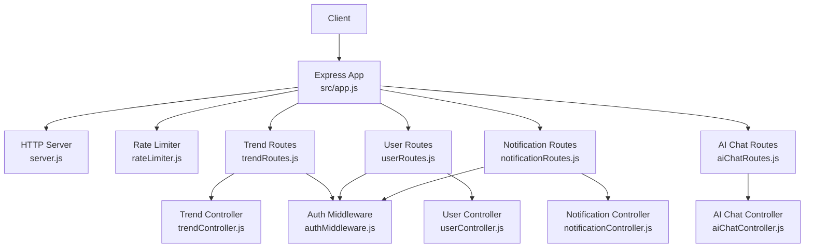
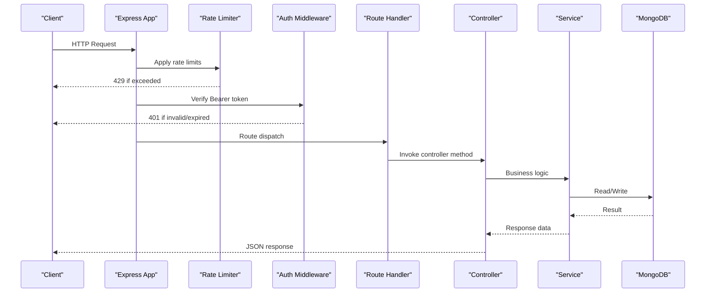
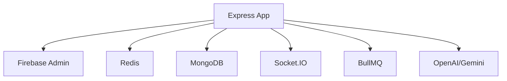

# REST API Endpoints

<cite>
**Referenced Files in This Document**
- [app.js](file://backend/src/app.js)
- [server.js](file://backend/server.js)
- [rateLimiter.js](file://backend/src/middlewares/rateLimiter.js)
- [authMiddleware.js](file://backend/src/middlewares/authMiddleware.js)
- [trendRoutes.js](file://backend/src/routes/trendRoutes.js)
- [userRoutes.js](file://backend/src/routes/userRoutes.js)
- [notificationRoutes.js](file://backend/src/routes/notificationRoutes.js)
- [aiChatRoutes.js](file://backend/src/routes/aiChatRoutes.js)
- [trendController.js](file://backend/src/controllers/trendController.js)
- [userController.js](file://backend/src/controllers/userController.js)
- [notificationController.js](file://backend/src/controllers/notificationController.js)
- [aiChatController.js](file://backend/src/controllers/aiChatController.js)
- [trendValidators.js](file://backend/src/validators/trendValidators.js)
- [User.js](file://backend/src/models/User.js)
- [Trend.js](file://backend/src/models/Trend.js)
- [UserActivity.js](file://backend/src/models/UserActivity.js)
- [analyticsService.js](file://backend/src/services/analyticsService.js)
- [recommendationEngine.js](file://backend/src/services/recommendationEngine.js)
- [feedCacheService.js](file://backend/src/services/feedCacheService.js)
- [geoProfileService.js](file://backend/src/services/geoProfileService.js)
- [geoTrendEngine.js](file://backend/src/services/geoTrendEngine.js)
- [graphEngine.js](file://backend/src/services/graphEngine.js)
- [trendPredictionEngine.js](file://backend/src/services/trendPredictionEngine.js)
- [aiService.js](file://backend/src/services/aiService.js)
- [aiAnalyticsService.js](file://backend/src/services/aiAnalyticsService.js)
- [aiTrendEnhancer.js](file://backend/src/services/aiTrendEnhancer.js)
- [alertService.js](file://backend/src/services/alertService.js)
- [socketService.js](file://backend/src/services/socketService.js)
- [package.json](file://backend/package.json)
</cite>

## Table of Contents
1. [Introduction](#introduction)
2. [Project Structure](#project-structure)
3. [Core Components](#core-components)
4. [Architecture Overview](#architecture-overview)
5. [Detailed Component Analysis](#detailed-component-analysis)
6. [Dependency Analysis](#dependency-analysis)
7. [Performance Considerations](#performance-considerations)
8. [Troubleshooting Guide](#troubleshooting-guide)
9. [Conclusion](#conclusion)

## Introduction
This document provides comprehensive REST API documentation for the backend services. It covers HTTP methods, URL patterns, request/response schemas, authentication requirements, and operational characteristics for:
- Trend management APIs (CRUD-like operations, search, category filtering, analytics, predictions)
- User management endpoints (authentication sync, profile updates, saved trends)
- Notification APIs (subscription management, read/unread state, clearing)
- AI chat endpoints for trend analysis and explainability
It also documents rate limiting, pagination patterns, data validation rules, and API versioning considerations.

## Project Structure
The backend is an Express.js application with modular routing and controllers. Middleware enforces authentication and rate limits. Services encapsulate domain logic, while models define data structures. Routes are mounted under `/api/` with specific subpaths for each functional area.

**Diagram sources**
- [app.js:1-88](file://backend/src/app.js#L1-L88)
- [server.js:1-51](file://backend/server.js#L1-L51)
- [authMiddleware.js:1-27](file://backend/src/middlewares/authMiddleware.js#L1-L27)
- [rateLimiter.js:1-80](file://backend/src/middlewares/rateLimiter.js#L1-L80)
- [trendRoutes.js:1-50](file://backend/src/routes/trendRoutes.js#L1-L50)
- [userRoutes.js:1-18](file://backend/src/routes/userRoutes.js#L1-L18)
- [notificationRoutes.js:1-14](file://backend/src/routes/notificationRoutes.js#L1-L14)
- [aiChatRoutes.js:1-8](file://backend/src/routes/aiChatRoutes.js#L1-L8)
- [trendController.js:1-407](file://backend/src/controllers/trendController.js#L1-L407)
- [userController.js](file://backend/src/controllers/userController.js)
- [notificationController.js](file://backend/src/controllers/notificationController.js)
- [aiChatController.js](file://backend/src/controllers/aiChatController.js)

**Section sources**
- [app.js:1-88](file://backend/src/app.js#L1-L88)
- [server.js:1-51](file://backend/server.js#L1-L51)

## Core Components
- Authentication: Firebase ID tokens validated via Bearer Authorization header.
- Rate Limiting: Centralized Redis-backed limits for general API, auth-heavy endpoints, and heavy AI endpoints.
- Routing: Modular routes under `/api/trends`, `/api/users`, `/api/notifications`, `/api/ai`.
- Controllers: Implement business logic and orchestrate service calls.
- Services: Encapsulate analytics, personalization, geospatial intelligence, prediction, and caching.
- Validation: Zod-based validators for query/body schemas.

**Section sources**
- [authMiddleware.js:1-27](file://backend/src/middlewares/authMiddleware.js#L1-L27)
- [rateLimiter.js:1-80](file://backend/src/middlewares/rateLimiter.js#L1-L80)
- [trendRoutes.js:1-50](file://backend/src/routes/trendRoutes.js#L1-L50)
- [userRoutes.js:1-18](file://backend/src/routes/userRoutes.js#L1-L18)
- [notificationRoutes.js:1-14](file://backend/src/routes/notificationRoutes.js#L1-L14)
- [aiChatRoutes.js:1-8](file://backend/src/routes/aiChatRoutes.js#L1-L8)

## Architecture Overview
The API follows a layered architecture:
- Entry points: Express app mounts middleware, routes, and admin dashboard.
- Authentication: Token verification attaches user context to requests.
- Routing: Route handlers delegate to controllers.
- Controllers: Validate inputs, call services, and format responses.
- Services: Implement domain logic and interact with models and external systems.
- Persistence: Mongoose models for User, Trend, and UserActivity.
- Caching: Redis-backed caching for feeds and diversity matrices.
- Background: Cron jobs, BullMQ workers, and Socket.IO for real-time updates.

**Diagram sources**
- [app.js:16-62](file://backend/src/app.js#L16-L62)
- [authMiddleware.js:3-24](file://backend/src/middlewares/authMiddleware.js#L3-L24)
- [rateLimiter.js:23-77](file://backend/src/middlewares/rateLimiter.js#L23-L77)
- [trendController.js:16-407](file://backend/src/controllers/trendController.js#L16-L407)

## Detailed Component Analysis

### Authentication and Security
- Method: Bearer token in Authorization header.
- Validation: Firebase Admin verifies ID token and attaches decoded token (uid) to request.
- Scope: Required for user-centric routes; public routes do not require authentication.

Response format for unauthorized requests:
- Status: 401
- Body: `{ success: false, message: "Unauthorized: ..." }`

**Section sources**
- [authMiddleware.js:3-24](file://backend/src/middlewares/authMiddleware.js#L3-L24)
- [app.js:65-79](file://backend/src/app.js#L65-L79)

### Rate Limiting
- General API: 100 requests per 15 minutes per IP.
- Auth endpoints: 20 requests per 15 minutes per IP.
- Heavy endpoints (AI/chat): 10 requests per 5 minutes per IP.
- Storage: Redis via rate-limit-redis with separate prefixes.
- Headers: Standard headers enabled; blocking triggers warnings in logs.

Response format for rate-limited requests:
- Status: 429
- Body: `{ success: false, message: "..." }`

**Section sources**
- [rateLimiter.js:23-77](file://backend/src/middlewares/rateLimiter.js#L23-L77)
- [app.js:16-21](file://backend/src/app.js#L16-L21)

### Health Check
- Endpoint: GET `/health`
- Response: `{ status: "ok", message: "TrendPulse API is running" }`
- Status: 200

**Section sources**
- [app.js:24-26](file://backend/src/app.js#L24-L26)

### Trend Management APIs

#### Public Feeds
- GET `/api/trends/home`
  - Purpose: Aggregated home feed.
  - Auth: Not required.
  - Response: `{ success: true, data: [...] }`
  - Status: 200

- GET `/api/trends/explore`
  - Purpose: Explore all trends.
  - Auth: Not required.
  - Response: `{ success: true, data: [...] }`
  - Status: 200

- GET `/api/trends/category?type=...`
  - Purpose: Filter by category type.
  - Auth: Not required.
  - Query: `type` (validated).
  - Response: `{ success: true, data: [...] }`
  - Status: 200

- GET `/api/trends/search?q=...`
  - Purpose: Search trends by query.
  - Auth: Not required.
  - Query: `q` (validated).
  - Response: `{ success: true, data: [...] }`
  - Status: 200

- GET `/api/trends/location?country=...`
  - Purpose: Get trends by country.
  - Auth: Not required.
  - Query: `country` (validated).
  - Response: `{ success: true, data: [...] }`
  - Status: 200

- GET `/api/trends/compare?id1=...&id2=...`
  - Purpose: Compare two trends.
  - Auth: Not required.
  - Query: `id1`, `id2` (validated).
  - Response: `{ success: true, data: { trend1, trend2, comparisonMetrics } }`
  - Status: 200

- GET `/api/trends/heatmap`
  - Purpose: Geo-intelligence heatmap payload.
  - Auth: Not required.
  - Response: `{ success: true, data: [...], fetchedAt: "...toISOString()" }`
  - Status: 200

Validation schemas:
- Category: Zod schema requiring `type`.
- Search: Zod schema requiring `q`.
- Location: Zod schema requiring `country`.
- Compare: Zod schema requiring `id1` and `id2`.
- Trend ID: Zod schema requiring valid ObjectId.

**Section sources**
- [trendRoutes.js:13-21](file://backend/src/routes/trendRoutes.js#L13-L21)
- [trendController.js:16-79](file://backend/src/controllers/trendController.js#L16-L79)
- [trendValidators.js](file://backend/src/validators/trendValidators.js)

#### Personalized and Emerging Feeds
- GET `/api/trends/personalized`
  - Purpose: Personalized feed based on user interests/sources.
  - Auth: Required.
  - Response: `{ success: true, personalized: boolean, isStale: boolean, fetchedAt: "...", data: [...] }`
  - Status: 200

- GET `/api/trends/foryou?scope=local|national|global`
  - Purpose: Geo-personalized "For You" feed with caching and diversity overrides.
  - Auth: Required.
  - Query: `limit` (optional), `scope` (default "auto"), `locale` (default "en").
  - Response: `{ success: true, personalized: true, fromCache: boolean, scope, data: [...], fetchedAt: "..." }`
  - Status: 200

- GET `/api/trends/emerging`
  - Purpose: Emerging trends for user's region.
  - Auth: Required.
  - Query: `limit` (optional).
  - Response: `{ success: true, region: string, data: [...], fetchedAt: "..." }`
  - Status: 200

Notes:
- Personalized feed falls back to non-personalized if user has no interests/preferences.
- For You feed uses Redis cache keyed by geo-profile and locale.

**Section sources**
- [trendRoutes.js:24-27](file://backend/src/routes/trendRoutes.js#L24-L27)
- [trendController.js:142-285](file://backend/src/controllers/trendController.js#L142-L285)

#### Trend Details and Analytics
- GET `/api/trends/:id`
  - Purpose: Retrieve trend by ID.
  - Auth: Not required.
  - Path: `:id` (validated).
  - Response: `{ success: true, data: Trend }`
  - Status: 200

- GET `/api/trends/:id/stats`
  - Purpose: Backward-compatible stats endpoint returning chartData and metrics.
  - Auth: Not required.
  - Path: `:id` (validated).
  - Response: `{ success: true, data: { chartData, metrics } }`
  - Status: 200

- GET `/api/trends/:id/analytics`
  - Purpose: Trend analytics (volume, growth, sentiment).
  - Auth: Not required.
  - Path: `:id` (validated).
  - Response: `{ success: true, data: Analytics }`
  - Status: 200

- GET `/api/trends/:id/history`
  - Purpose: Trend history data.
  - Auth: Not required.
  - Path: `:id` (validated).
  - Response: `{ success: true, data: History }`
  - Status: 200

- GET `/api/trends/:id/graph`
  - Purpose: Hydrated relationship graph for a trend.
  - Auth: Not required.
  - Path: `:id` (validated).
  - Response: `{ success: true, trend, relatedTrends, graphSize, fetchedAt }`
  - Status: 200

- GET `/api/trends/:id/prediction`
  - Purpose: Viral spread prediction.
  - Auth: Not required.
  - Path: `:id` (validated).
  - Response: `{ success: true, trendId, prediction, fetchedAt }`
  - Status: 200

- GET `/api/trends/:id/analysis`
  - Purpose: AI analysis/explainability for a trend.
  - Auth: Not required.
  - Path: `:id` (validated).
  - Response: `{ success: true, data: Analysis }`
  - Status: 200

**Section sources**
- [trendRoutes.js:35-47](file://backend/src/routes/trendRoutes.js#L35-L47)
- [trendController.js:81-406](file://backend/src/controllers/trendController.js#L81-L406)

#### User Interactions and Bookmarks
- POST `/api/trends/interact`
  - Purpose: Record user interaction (click, like, bookmark, share, skip).
  - Auth: Required.
  - Body: `{ trendId, interactionType, trendScope }`
  - Validation: interactionType must be one of supported types; skip allowed without DB record.
  - Response: `{ success: true, data?: Activity }`
  - Status: 200

- POST `/api/trends/bookmark`
  - Purpose: Toggle bookmark/save for a trend.
  - Auth: Required.
  - Body: `{ trendId }`
  - Response: `{ success: true, bookmarked: boolean, message }`
  - Status: 200

**Section sources**
- [trendRoutes.js:29-32](file://backend/src/routes/trendRoutes.js#L29-L32)
- [trendController.js:288-363](file://backend/src/controllers/trendController.js#L288-L363)

### User Management APIs

#### Sync and Profile
- POST `/api/users/sync`
  - Purpose: Sync user profile using Firebase token.
  - Auth: Required.
  - Response: `{ success: true, message: "Sync complete" }`
  - Status: 200

- PUT `/api/users/profile`
  - Purpose: Update user profile.
  - Auth: Required.
  - Response: `{ success: true, data: User }`
  - Status: 200

#### Saved Trends
- POST `/api/users/save`
  - Purpose: Save a trend to user's bookmarks.
  - Auth: Required.
  - Response: `{ success: true, bookmarked: true, message }`
  - Status: 200

- GET `/api/users/saved`
  - Purpose: List saved trends.
  - Auth: Required.
  - Response: `{ success: true, data: [...] }`
  - Status: 200

- DELETE `/api/users/save/:trendId`
  - Purpose: Remove a trend from saved.
  - Auth: Required.
  - Path: `:trendId`
  - Response: `{ success: true, message }`
  - Status: 200

#### Geo Profile
- GET `/api/users/geo-profile`
  - Purpose: Retrieve user's geographic profile.
  - Auth: Required.
  - Response: `{ success: true, data: GeoProfile }`
  - Status: 200

**Section sources**
- [userRoutes.js:1-17](file://backend/src/routes/userRoutes.js#L1-L17)
- [userController.js](file://backend/src/controllers/userController.js)
- [User.js](file://backend/src/models/User.js)

### Notification APIs
All routes require authentication.

- GET `/api/notifications/`
  - Purpose: List notifications.
  - Response: `{ success: true, data: [...] }`
  - Status: 200

- GET `/api/notifications/unread-count`
  - Purpose: Unread notifications count.
  - Response: `{ success: true, count: number }`
  - Status: 200

- PUT `/api/notifications/read-all`
  - Purpose: Mark all as read.
  - Response: `{ success: true, message }`
  - Status: 200

- DELETE `/api/notifications/clear-all`
  - Purpose: Clear all notifications.
  - Response: `{ success: true, message }`
  - Status: 200

- PUT `/api/notifications/:id/read`
  - Purpose: Mark a specific notification as read.
  - Path: `:id`
  - Response: `{ success: true, message }`
  - Status: 200

**Section sources**
- [notificationRoutes.js:1-14](file://backend/src/routes/notificationRoutes.js#L1-L14)
- [notificationController.js](file://backend/src/controllers/notificationController.js)

### AI Chat and Explainability APIs

#### AI Chat
- POST `/api/ai/chat`
  - Purpose: Send a message to the AI assistant for trend analysis.
  - Auth: Not required (no token required).
  - Body: `{ message: string, trendId?: string }`
  - Response: `{ success: true, reply: string, metadata?: {...} }`
  - Status: 200

Note: This endpoint is intentionally open for chat interactions without requiring authentication.

**Section sources**
- [aiChatRoutes.js:1-8](file://backend/src/routes/aiChatRoutes.js#L1-L8)
- [aiChatController.js](file://backend/src/controllers/aiChatController.js)

#### Trend Analysis and Explainability
- GET `/api/trends/:id/analysis`
  - Purpose: AI-powered analysis and explainability for a specific trend.
  - Auth: Not required.
  - Path: `:id`
  - Response: `{ success: true, data: Analysis }`
  - Status: 200

Services involved:
- AI Service: Orchestrates model calls.
- AI Analytics Service: Computes analytics.
- AI Trend Enhancer: Enriches trend insights.

**Section sources**
- [trendRoutes.js](file://backend/src/routes/trendRoutes.js#L41)
- [trendController.js:91-102](file://backend/src/controllers/trendController.js#L91-L102)
- [aiService.js](file://backend/src/services/aiService.js)
- [aiAnalyticsService.js](file://backend/src/services/aiAnalyticsService.js)
- [aiTrendEnhancer.js](file://backend/src/services/aiTrendEnhancer.js)

### Onboarding Endpoint
- POST `/api/users/onboard`
  - Purpose: Complete user onboarding by setting preferred categories.
  - Auth: Required.
  - Body: `{ categories: string[] }`
  - Response: `{ success: true, message: "Onboarding complete" }`
  - Status: 200

Validation: Requires non-empty categories array.

**Section sources**
- [app.js:67-79](file://backend/src/app.js#L67-L79)

## Dependency Analysis
Key dependencies and integrations:
- Express: Web framework and routing.
- Firebase Admin: ID token verification.
- Redis: Rate limiting store, caching, and diversity matrix overrides.
- Mongoose: MongoDB ODM for models.
- Socket.IO: Real-time notifications and alerts.
- BullMQ: Background job processing for trend aggregation and enrichment.
- OpenAI/Gemini: AI/ML services for analytics and explainability.

**Diagram sources**
- [package.json:14-38](file://backend/package.json#L14-L38)
- [server.js:1-51](file://backend/server.js#L1-L51)
- [app.js:1-88](file://backend/src/app.js#L1-L88)

**Section sources**
- [package.json:14-38](file://backend/package.json#L14-L38)
- [server.js:1-51](file://backend/server.js#L1-L51)

## Performance Considerations
- Caching: Geo-personalized feeds and diversity matrices are cached in Redis with TTL to reduce database load.
- Pagination: Feed endpoints accept optional `limit` parameters; clients should cap values to avoid overfetching.
- Indexes: Compound indexes are ensured at startup for optimal query performance.
- Background Jobs: Trend aggregation and enrichment run asynchronously via BullMQ workers.
- Real-time Updates: Socket.IO enables live notifications and alerts.

[No sources needed since this section provides general guidance]

## Troubleshooting Guide
Common errors and resolutions:
- Unauthorized:
  - Cause: Missing or invalid Bearer token.
  - Fix: Include a valid Firebase ID token in Authorization header.
  - Response: 401 with `{ success: false, message: "Unauthorized: ..." }`

- Rate Limited:
  - Cause: Exceeded request quotas.
  - Fix: Wait for reset window or reduce request frequency.
  - Response: 429 with `{ success: false, message: "..." }`

- Validation Errors:
  - Cause: Missing or invalid query/body parameters.
  - Fix: Ensure required fields are present and match schemas.
  - Response: 400 with `{ success: false, message: "..." }`

- Not Found:
  - Cause: Trend ID does not exist.
  - Fix: Verify trend ID.
  - Response: 404 with `{ success: false, message: "Trend not found" }`

- Internal Server Error:
  - Cause: Unexpected server error.
  - Fix: Check server logs and retry.
  - Response: 500 with `{ success: false, message: "Internal Server Error" }`

**Section sources**
- [authMiddleware.js:7-23](file://backend/src/middlewares/authMiddleware.js#L7-L23)
- [rateLimiter.js:33-76](file://backend/src/middlewares/rateLimiter.js#L33-L76)
- [trendController.js:37-79](file://backend/src/controllers/trendController.js#L37-L79)
- [app.js:82-85](file://backend/src/app.js#L82-L85)

## Conclusion
The backend exposes a comprehensive set of REST endpoints covering trend discovery, personalization, analytics, user management, notifications, and AI-driven insights. Authentication is enforced via Firebase ID tokens, rate limiting protects resources, and caching improves performance. The modular architecture supports scalability and maintainability, with background jobs and real-time capabilities enhancing the user experience.