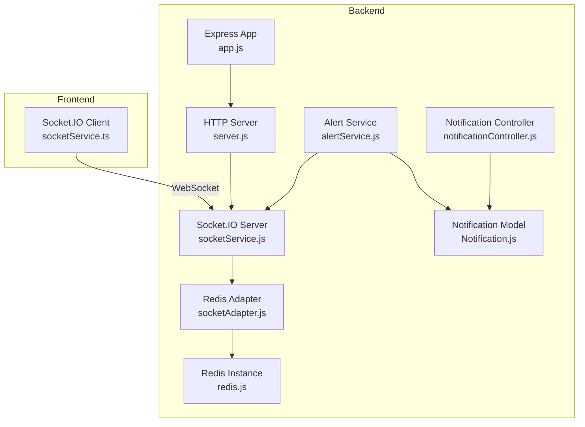
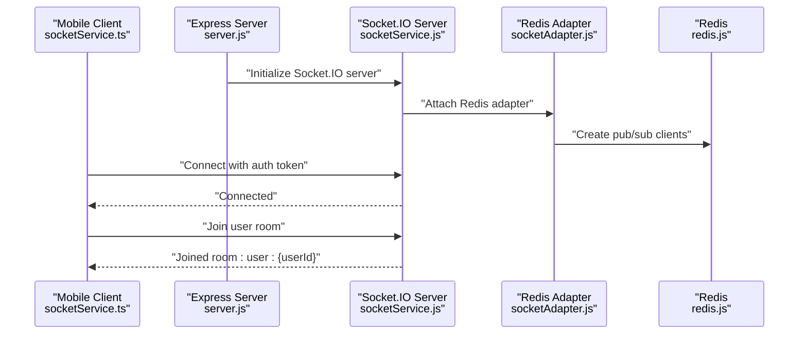
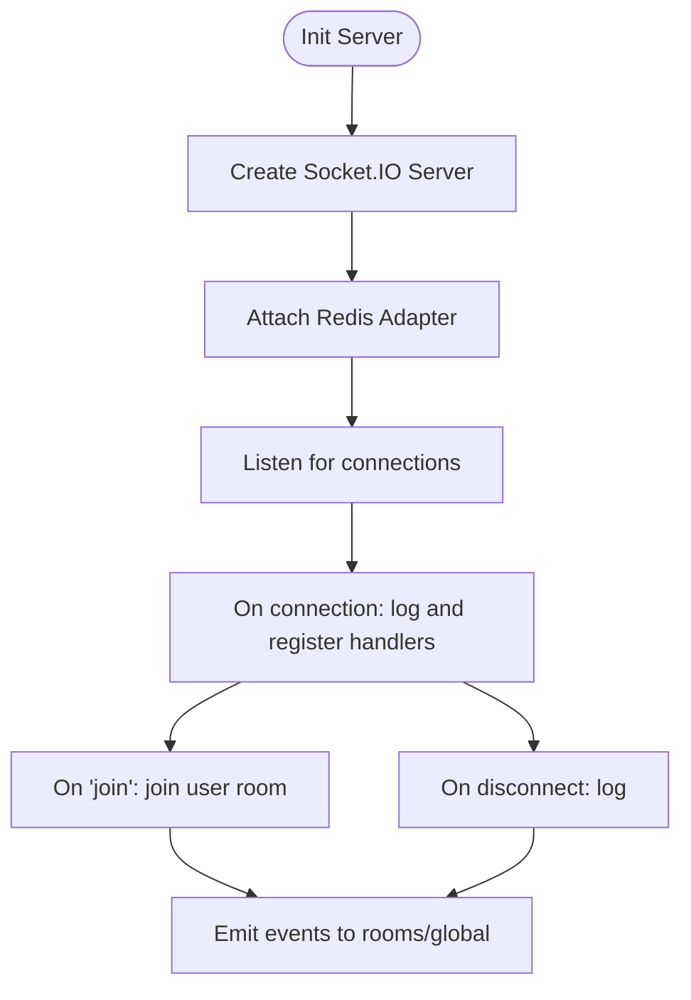
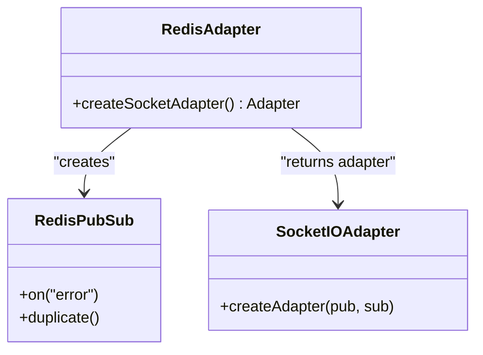
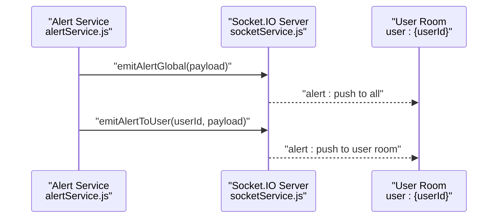
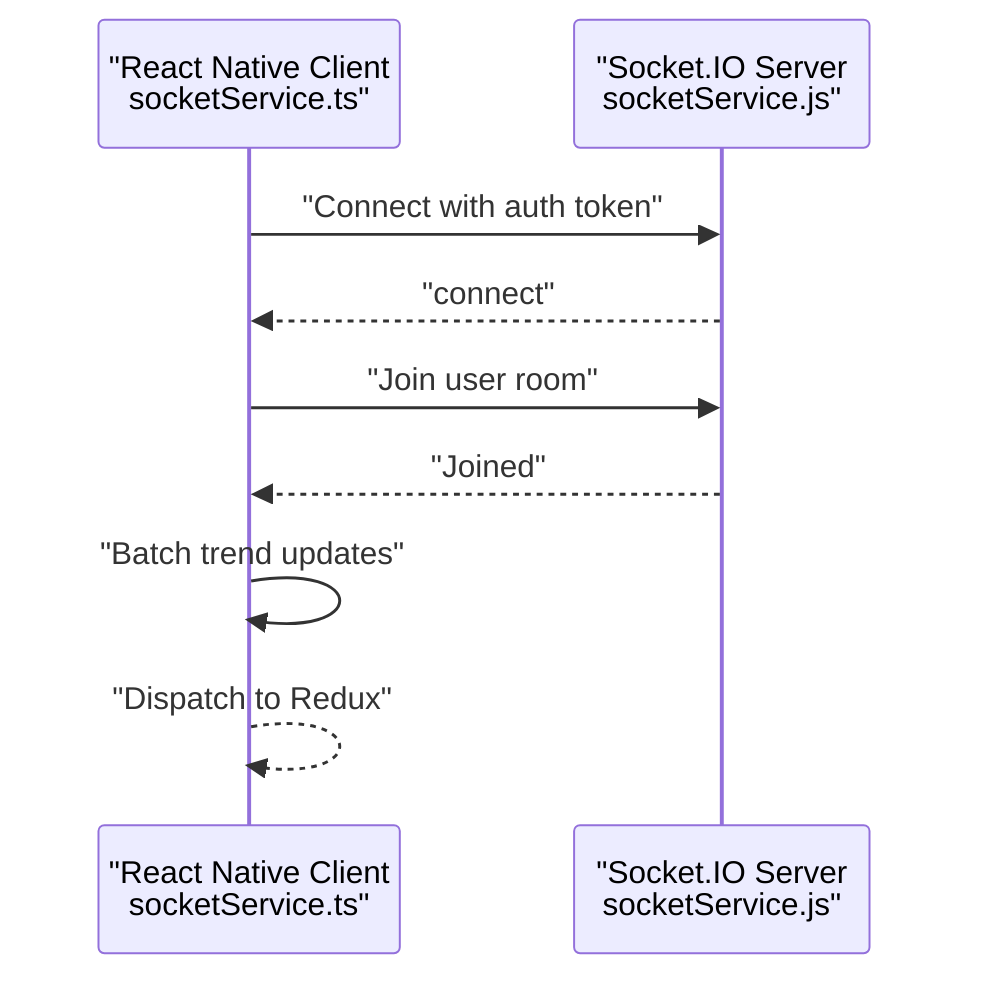
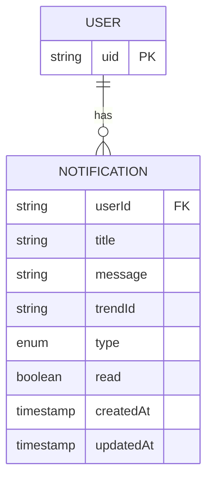
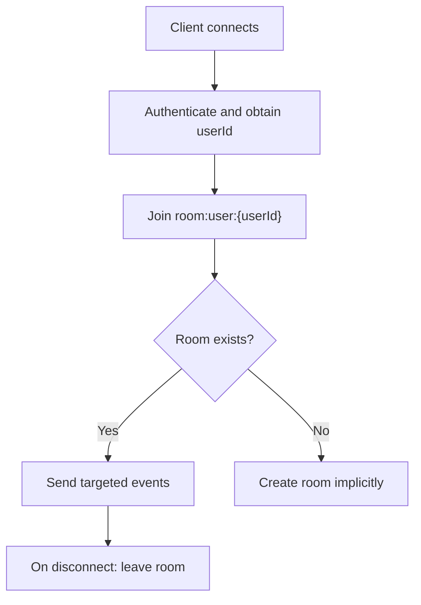
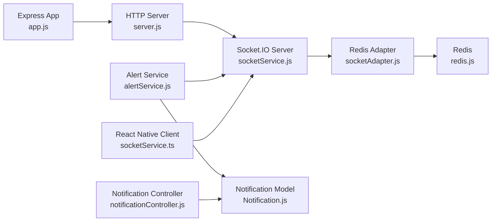

# Real-time Communication

<cite>
**Referenced Files in This Document**
- [server.js](file://backend/server.js)
- [app.js](file://backend/src/app.js)
- [socketService.js](file://backend/src/services/socketService.js)
- [socketAdapter.js](file://backend/src/services/socketAdapter.js)
- [redis.js](file://backend/src/config/redis.js)
- [alertService.js](file://backend/src/services/alertService.js)
- [notificationController.js](file://backend/src/controllers/notificationController.js)
- [Notification.js](file://backend/src/models/Notification.js)
- [authMiddleware.js](file://backend/src/middlewares/authMiddleware.js)
- [socketService.ts](file://AITrendTracker7/src/services/socketService.ts)
</cite>

## Table of Contents
1. [Introduction](#introduction)
2. [Project Structure](#project-structure)
3. [Core Components](#core-components)
4. [Architecture Overview](#architecture-overview)
5. [Detailed Component Analysis](#detailed-component-analysis)
6. [Dependency Analysis](#dependency-analysis)
7. [Performance Considerations](#performance-considerations)
8. [Security and Authentication](#security-and-authentication)
9. [Troubleshooting Guide](#troubleshooting-guide)
10. [Conclusion](#conclusion)

## Introduction
This document explains the real-time communication implementation powered by Socket.IO with a Redis adapter. It covers WebSocket connection establishment, room-based messaging, event broadcasting, Redis adapter configuration for horizontal scaling, notification delivery mechanisms, user presence tracking, and connection management. It also documents event types for trend updates, user activities, and system alerts, along with error handling, reconnection strategies, performance optimization, and security considerations.

## Project Structure
The real-time system spans two parts:
- Backend: Express server with Socket.IO server, Redis adapter, alerting, and notification persistence.
- Frontend (React Native): Socket.IO client that connects to the backend, joins rooms, and handles real-time events.

**Diagram sources**
- [server.js:1-51](file://backend/server.js#L1-L51)
- [app.js:1-88](file://backend/src/app.js#L1-L88)
- [socketService.js:1-107](file://backend/src/services/socketService.js#L1-L107)
- [socketAdapter.js:1-22](file://backend/src/services/socketAdapter.js#L1-L22)
- [redis.js:1-19](file://backend/src/config/redis.js#L1-L19)
- [alertService.js:1-282](file://backend/src/services/alertService.js#L1-L282)
- [notificationController.js:1-93](file://backend/src/controllers/notificationController.js#L1-L93)
- [Notification.js:1-39](file://backend/src/models/Notification.js#L1-L39)
- [socketService.ts:1-110](file://AITrendTracker7/src/services/socketService.ts#L1-L110)

**Section sources**
- [server.js:1-51](file://backend/server.js#L1-L51)
- [app.js:1-88](file://backend/src/app.js#L1-L88)
- [socketService.js:1-107](file://backend/src/services/socketService.js#L1-L107)
- [socketAdapter.js:1-22](file://backend/src/services/socketAdapter.js#L1-L22)
- [redis.js:1-19](file://backend/src/config/redis.js#L1-L19)
- [alertService.js:1-282](file://backend/src/services/alertService.js#L1-L282)
- [notificationController.js:1-93](file://backend/src/controllers/notificationController.js#L1-L93)
- [Notification.js:1-39](file://backend/src/models/Notification.js#L1-L39)
- [socketService.ts:1-110](file://AITrendTracker7/src/services/socketService.ts#L1-L110)

## Core Components
- Backend Socket.IO server: Initializes the server, attaches Redis adapter, manages connections, and emits events.
- Redis adapter: Enables multi-instance broadcast consistency using Redis pub/sub.
- Alert service: Generates and emits real-time alerts and persists notifications.
- Notification controller and model: REST endpoints and schema for user notifications.
- Frontend Socket.IO client: Establishes WebSocket connections, joins rooms, and processes real-time events.

**Section sources**
- [socketService.js:1-107](file://backend/src/services/socketService.js#L1-L107)
- [socketAdapter.js:1-22](file://backend/src/services/socketAdapter.js#L1-L22)
- [alertService.js:1-282](file://backend/src/services/alertService.js#L1-L282)
- [notificationController.js:1-93](file://backend/src/controllers/notificationController.js#L1-L93)
- [Notification.js:1-39](file://backend/src/models/Notification.js#L1-L39)
- [socketService.ts:1-110](file://AITrendTracker7/src/services/socketService.ts#L1-L110)

## Architecture Overview
The backend initializes an HTTP server and a Socket.IO server. The Socket.IO server uses a Redis adapter to scale horizontally across multiple instances. The alert service emits real-time events to all clients or specific user rooms. The frontend client connects via WebSocket, authenticates, joins user-specific rooms, and updates the UI in real-time.

**Diagram sources**
- [server.js:1-51](file://backend/server.js#L1-L51)
- [socketService.js:1-107](file://backend/src/services/socketService.js#L1-L107)
- [socketAdapter.js:1-22](file://backend/src/services/socketAdapter.js#L1-L22)
- [redis.js:1-19](file://backend/src/config/redis.js#L1-L19)
- [socketService.ts:1-110](file://AITrendTracker7/src/services/socketService.ts#L1-L110)

## Detailed Component Analysis

### Backend Socket.IO Server
- Initializes the Socket.IO server with CORS and heartbeat settings.
- Attaches the Redis adapter for multi-instance broadcast consistency.
- Handles connection lifecycle and room join events.
- Emits transactional events for AI enrichment completion and priority alerts.

**Diagram sources**
- [socketService.js:17-55](file://backend/src/services/socketService.js#L17-L55)

**Section sources**
- [socketService.js:17-55](file://backend/src/services/socketService.js#L17-L55)

### Redis Adapter for Horizontal Scaling
- Creates separate Redis clients for publishing and subscribing.
- Logs errors from Redis clients.
- Returns a Socket.IO adapter configured with Redis pub/sub.

**Diagram sources**
- [socketAdapter.js:10-19](file://backend/src/services/socketAdapter.js#L10-L19)
- [redis.js:1-19](file://backend/src/config/redis.js#L1-19)

**Section sources**
- [socketAdapter.js:10-19](file://backend/src/services/socketAdapter.js#L10-L19)
- [redis.js:1-19](file://backend/src/config/redis.js#L1-L19)

### Event Emission Patterns
- AI enrichment completion: emits a targeted event to a user room.
- Global priority alerts: emits a broadcast event to all clients.
- Transactional nature: events are emitted on-demand, not continuous streams.

**Diagram sources**
- [alertService.js:136-172](file://backend/src/services/alertService.js#L136-L172)
- [socketService.js:74-91](file://backend/src/services/socketService.js#L74-L91)

**Section sources**
- [alertService.js:136-172](file://backend/src/services/alertService.js#L136-L172)
- [socketService.js:74-91](file://backend/src/services/socketService.js#L74-L91)

### Frontend Socket.IO Client
- Establishes a WebSocket connection with automatic reconnection and exponential backoff.
- Authenticates via JWT token passed as auth data.
- Joins user-specific rooms and listens for real-time events.
- Implements a batching mechanism to reduce UI thrashing during high-frequency updates.

**Diagram sources**
- [socketService.ts:17-68](file://AITrendTracker7/src/services/socketService.ts#L17-L68)
- [socketService.js:41-46](file://backend/src/services/socketService.js#L41-L46)

**Section sources**
- [socketService.ts:17-68](file://AITrendTracker7/src/services/socketService.ts#L17-L68)
- [socketService.js:41-46](file://backend/src/services/socketService.js#L41-L46)

### Notification Delivery Mechanisms
- In-app notifications are persisted in MongoDB with indexes for efficient queries.
- REST endpoints expose CRUD operations for notifications.
- Alert service generates notifications and emits real-time alerts.

**Diagram sources**
- [Notification.js:3-39](file://backend/src/models/Notification.js#L3-L39)

**Section sources**
- [notificationController.js:1-93](file://backend/src/controllers/notificationController.js#L1-L93)
- [Notification.js:1-39](file://backend/src/models/Notification.js#L1-L39)
- [alertService.js:113-130](file://backend/src/services/alertService.js#L113-L130)

### User Presence Tracking and Room Management
- Clients join a room named after the user identifier upon successful authentication.
- Rooms enable targeted event delivery to specific users.
- Connection lifecycle events are logged for observability.

**Diagram sources**
- [socketService.js:41-46](file://backend/src/services/socketService.js#L41-L46)
- [socketService.ts:17-28](file://AITrendTracker7/src/services/socketService.ts#L17-L28)

**Section sources**
- [socketService.js:41-46](file://backend/src/services/socketService.js#L41-L46)
- [socketService.ts:17-28](file://AITrendTracker7/src/services/socketService.ts#L17-L28)

### Event Types for Trend Updates, User Activities, and System Alerts
- Trend emerging: real-time feed updates for trending items.
- Geo spike detected: regional trend spikes for localized alerts.
- System alert: platform-wide or critical alerts.
- AI prediction update: live updates for AI-enhanced predictions.

These events are handled by the frontend client and dispatched to appropriate Redux slices.

**Section sources**
- [socketService.ts:46-67](file://AITrendTracker7/src/services/socketService.ts#L46-L67)

## Dependency Analysis
The backend depends on Express for HTTP routing, Socket.IO for real-time, Redis via the Redis adapter for horizontal scaling, and MongoDB for persistent notifications. The frontend depends on Socket.IO client for WebSocket connectivity.

**Diagram sources**
- [app.js:1-88](file://backend/src/app.js#L1-L88)
- [server.js:1-51](file://backend/server.js#L1-L51)
- [socketService.js:1-107](file://backend/src/services/socketService.js#L1-L107)
- [socketAdapter.js:1-22](file://backend/src/services/socketAdapter.js#L1-L22)
- [redis.js:1-19](file://backend/src/config/redis.js#L1-L19)
- [alertService.js:1-282](file://backend/src/services/alertService.js#L1-L282)
- [notificationController.js:1-93](file://backend/src/controllers/notificationController.js#L1-L93)
- [Notification.js:1-39](file://backend/src/models/Notification.js#L1-L39)
- [socketService.ts:1-110](file://AITrendTracker7/src/services/socketService.ts#L1-L110)

**Section sources**
- [app.js:1-88](file://backend/src/app.js#L1-L88)
- [server.js:1-51](file://backend/server.js#L1-L51)
- [socketService.js:1-107](file://backend/src/services/socketService.js#L1-L107)
- [socketAdapter.js:1-22](file://backend/src/services/socketAdapter.js#L1-L22)
- [redis.js:1-19](file://backend/src/config/redis.js#L1-L19)
- [alertService.js:1-282](file://backend/src/services/alertService.js#L1-L282)
- [notificationController.js:1-93](file://backend/src/controllers/notificationController.js#L1-L93)
- [Notification.js:1-39](file://backend/src/models/Notification.js#L1-L39)
- [socketService.ts:1-110](file://AITrendTracker7/src/services/socketService.ts#L1-L110)

## Performance Considerations
- Connection management: Heartbeat intervals and timeouts are tuned for reliability under load.
- Batching: The frontend batches frequent trend updates to minimize UI thrashing and rendering costs.
- Indexing: MongoDB indexes on user and read status optimize notification queries.
- Redis configuration: Separate pub/sub clients improve throughput and reduce contention.
- Graceful degradation: Redis adapter failures fall back to single-instance mode with logging.

[No sources needed since this section provides general guidance]

## Security and Authentication
- Token verification: Requests to protected endpoints use Firebase ID token verification middleware.
- WebSocket authentication: The frontend passes an auth token during connection; the backend can enforce room access based on the authenticated user.
- CORS: Configured broadly for development; adjust origins in production.
- Rate limiting: Distributed rate limiting via Redis is applied at the HTTP layer.

**Section sources**
- [authMiddleware.js:1-27](file://backend/src/middlewares/authMiddleware.js#L1-L27)
- [socketService.ts:20-28](file://AITrendTracker7/src/services/socketService.ts#L20-L28)
- [app.js:16-21](file://backend/src/app.js#L16-L21)

## Troubleshooting Guide
- Connection failures: The frontend retries with exponential backoff; logs connection errors and clears batch queues on disconnect.
- Redis adapter errors: Errors are logged; initialization continues in single-instance mode.
- Notification delivery: Ensure the alert service emits events and that the frontend is subscribed to the correct rooms.
- Reconnection strategies: Configure retry attempts and delays to balance responsiveness and resource usage.

**Section sources**
- [socketService.ts:35-43](file://AITrendTracker7/src/services/socketService.ts#L35-L43)
- [socketService.ts:86-102](file://AITrendTracker7/src/services/socketService.ts#L86-L102)
- [socketAdapter.js:14-15](file://backend/src/services/socketAdapter.js#L14-L15)
- [socketService.js:35-36](file://backend/src/services/socketService.js#L35-L36)

## Conclusion
The real-time communication system leverages Socket.IO with a Redis adapter to deliver scalable, low-latency updates across multiple server instances. Room-based messaging ensures targeted delivery, while transactional event emission avoids unnecessary traffic. The frontend client efficiently handles high-frequency updates with batching and robust reconnection strategies. Persistence and REST endpoints complement real-time delivery for a complete notification experience.