# Service Layer Architecture

<cite>
**Referenced Files in This Document**
- [trendService.js](file://backend/src/services/trendService.js)
- [userService.js](file://backend/src/services/userService.js)
- [analyticsService.js](file://backend/src/services/analyticsService.js)
- [personalizationService.js](file://backend/src/services/personalizationService.js)
- [recommendationEngine.js](file://backend/src/services/recommendationEngine.js)
- [geoTrendEngine.js](file://backend/src/services/geoTrendEngine.js)
- [aiAnalyticsService.js](file://backend/src/services/aiAnalyticsService.js)
- [aiOptimizationService.js](file://backend/src/services/aiOptimizationService.js)
- [aiService.js](file://backend/src/services/aiService.js)
- [aiTrendEnhancer.js](file://backend/src/services/aiTrendEnhancer.js)
- [cacheService.js](file://backend/src/services/cacheService.js)
- [socketService.js](file://backend/src/services/socketService.js)
- [trendController.js](file://backend/src/controllers/trendController.js)
- [userController.js](file://backend/src/controllers/userController.js)
- [trendAggregator.js](file://backend/src/services/trendAggregator.js)
- [feedCacheService.js](file://backend/src/services/feedCacheService.js)
- [geoProfileService.js](file://backend/src/services/geoProfileService.js)
- [graphEngine.js](file://backend/src/services/graphEngine.js)
- [trendPredictionEngine.js](file://backend/src/services/trendPredictionEngine.js)
- [UserActivity.js](file://backend/src/models/UserActivity.js)
- [Trend.js](file://backend/src/models/Trend.js)
- [User.js](file://backend/src/models/User.js)
- [Notification.js](file://backend/src/models/Notification.js)
- [TrendHistory.js](file://backend/src/models/TrendHistory.js)
</cite>

## Table of Contents
1. [Introduction](#introduction)
2. [Project Structure](#project-structure)
3. [Core Components](#core-components)
4. [Architecture Overview](#architecture-overview)
5. [Detailed Component Analysis](#detailed-component-analysis)
6. [Dependency Analysis](#dependency-analysis)
7. [Performance Considerations](#performance-considerations)
8. [Troubleshooting Guide](#troubleshooting-guide)
9. [Conclusion](#conclusion)

## Introduction
This document describes the service layer architecture and business logic implementation for the AITrendTracker platform. It focuses on the separation of concerns between controllers and services, data transformation patterns, and business rule enforcement. It covers the trend service with data aggregation, enrichment, and scoring algorithms; user service for authentication, profile management, and preference handling; analytics service for trend analysis, user behavior tracking, and performance metrics; personalization service for content recommendation and user experience optimization; recommendation engine for trend suggestions and content discovery; and the geographic trend engine for location-based analysis and propagation modeling. It also documents service composition patterns, dependency injection, and error propagation strategies.

## Project Structure
The backend service layer is organized around domain-focused services under the services directory, each encapsulating specific business capabilities. Controllers orchestrate requests, delegate to services, and manage error propagation. Models define the data schema and relationships. Workers and queues handle background tasks. Utilities and adapters provide cross-cutting concerns such as caching, logging, and real-time communication.

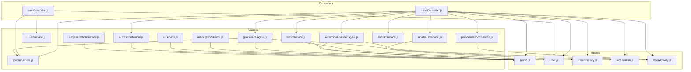

**Diagram sources**
- [trendController.js:1-407](file://backend/src/controllers/trendController.js#L1-L407)
- [userController.js:1-90](file://backend/src/controllers/userController.js#L1-L90)
- [trendService.js:1-64](file://backend/src/services/trendService.js#L1-L64)
- [userService.js:1-55](file://backend/src/services/userService.js#L1-L55)
- [analyticsService.js:1-154](file://backend/src/services/analyticsService.js#L1-L154)
- [personalizationService.js:1-129](file://backend/src/services/personalizationService.js#L1-L129)
- [recommendationEngine.js:1-253](file://backend/src/services/recommendationEngine.js#L1-L253)
- [geoTrendEngine.js:1-320](file://backend/src/services/geoTrendEngine.js#L1-L320)
- [aiAnalyticsService.js:1-203](file://backend/src/services/aiAnalyticsService.js#L1-L203)
- [aiOptimizationService.js:1-120](file://backend/src/services/aiOptimizationService.js#L1-L120)
- [aiService.js:1-168](file://backend/src/services/aiService.js#L1-L168)
- [aiTrendEnhancer.js:1-188](file://backend/src/services/aiTrendEnhancer.js#L1-L188)
- [cacheService.js:1-68](file://backend/src/services/cacheService.js#L1-L68)
- [socketService.js:1-107](file://backend/src/services/socketService.js#L1-L107)
- [Trend.js](file://backend/src/models/Trend.js)
- [User.js](file://backend/src/models/User.js)
- [TrendHistory.js](file://backend/src/models/TrendHistory.js)
- [Notification.js](file://backend/src/models/Notification.js)
- [UserActivity.js](file://backend/src/models/UserActivity.js)

**Section sources**
- [trendController.js:1-407](file://backend/src/controllers/trendController.js#L1-L407)
- [userController.js:1-90](file://backend/src/controllers/userController.js#L1-L90)

## Core Components
- Trend Service: Provides CRUD and search operations over trends, comparison logic, and filtering by category/location.
- User Service: Synchronizes user profiles, updates preferences, and manages saved trends.
- Analytics Service: Stores trend snapshots, computes growth metrics, and generates analytics payloads.
- Personalization Service: Scores and ranks trends for individuals considering interests, sources, recency, and AI virality.
- Recommendation Engine: Generates geo-personalized feeds with layered pools and adaptive diversity.
- Geographic Trend Engine: Detects emerging trends, triggers geo-targeted alerts, builds heatmaps, and provides local context.
- AI Services: Provide AI enrichment, optimization, and enhancement with caching and fallbacks.
- Cache and Socket Services: Provide distributed caching and real-time event emission.

**Section sources**
- [trendService.js:1-64](file://backend/src/services/trendService.js#L1-L64)
- [userService.js:1-55](file://backend/src/services/userService.js#L1-L55)
- [analyticsService.js:1-154](file://backend/src/services/analyticsService.js#L1-L154)
- [personalizationService.js:1-129](file://backend/src/services/personalizationService.js#L1-L129)
- [recommendationEngine.js:1-253](file://backend/src/services/recommendationEngine.js#L1-L253)
- [geoTrendEngine.js:1-320](file://backend/src/services/geoTrendEngine.js#L1-L320)
- [aiAnalyticsService.js:1-203](file://backend/src/services/aiAnalyticsService.js#L1-L203)
- [aiOptimizationService.js:1-120](file://backend/src/services/aiOptimizationService.js#L1-L120)
- [aiService.js:1-168](file://backend/src/services/aiService.js#L1-L168)
- [aiTrendEnhancer.js:1-188](file://backend/src/services/aiTrendEnhancer.js#L1-L188)
- [cacheService.js:1-68](file://backend/src/services/cacheService.js#L1-L68)
- [socketService.js:1-107](file://backend/src/services/socketService.js#L1-L107)

## Architecture Overview
The service layer follows a layered architecture:
- Controllers: Thin orchestration layer handling HTTP requests, validating inputs, invoking services, and returning standardized responses. They propagate errors via Express error-handling middleware.
- Services: Encapsulate business logic, coordinate multiple models, enforce business rules, and compose other services.
- Models: Define data structures and relationships for persistence.
- Cross-cutting Services: Caching, logging, and real-time communication.

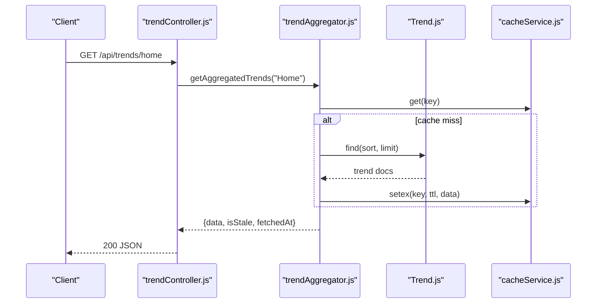

**Diagram sources**
- [trendController.js:16-23](file://backend/src/controllers/trendController.js#L16-L23)
- [trendAggregator.js](file://backend/src/services/trendAggregator.js)
- [cacheService.js:20-42](file://backend/src/services/cacheService.js#L20-L42)
- [Trend.js](file://backend/src/models/Trend.js)

**Section sources**
- [trendController.js:1-407](file://backend/src/controllers/trendController.js#L1-L407)

## Detailed Component Analysis

### Trend Service
Responsibilities:
- Retrieve top, all, category-filtered, location-filtered trends.
- Search across title, category, and content.
- Compare two trends by score and return a winner.
- Fetch trend by ID.

Data transformation:
- Normalizes queries to case-insensitive regular expressions.
- Projects winner metadata for comparison responses.

Business rules:
- Winner selection based on trendScore comparison.
- Null-safe retrieval with graceful absence handling.

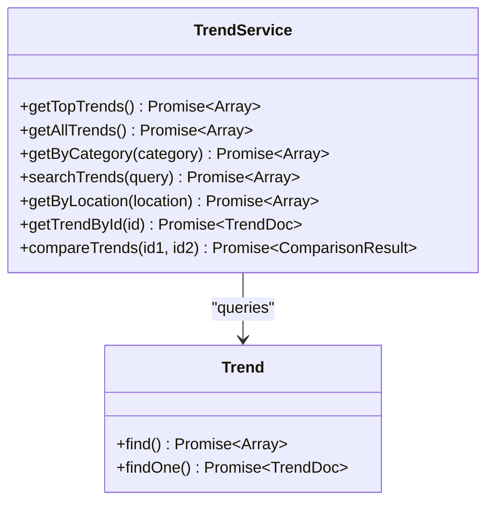

**Diagram sources**
- [trendService.js:3-61](file://backend/src/services/trendService.js#L3-L61)
- [Trend.js](file://backend/src/models/Trend.js)

**Section sources**
- [trendService.js:1-64](file://backend/src/services/trendService.js#L1-L64)

### User Service
Responsibilities:
- Sync user profile from auth provider data.
- Update user profile fields.
- Save/unsave trends and fetch saved trends with full details.

Data transformation:
- Upserts user on UID.
- Resolves saved trend IDs to full trend documents.

Business rules:
- Maintains uniqueness of saved trends using set operations.
- Returns empty list when no saved trends exist.

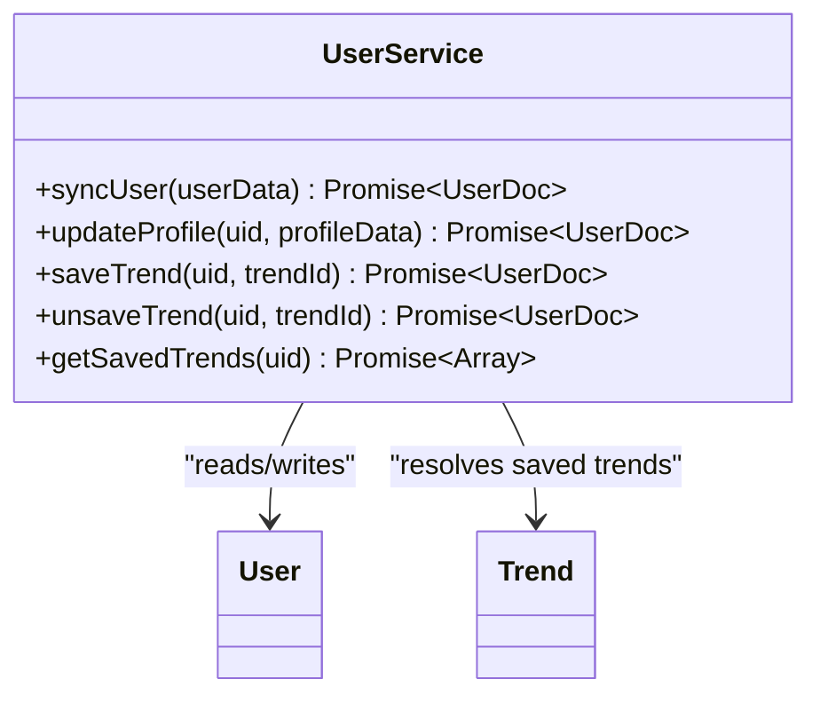

**Diagram sources**
- [userService.js:4-52](file://backend/src/services/userService.js#L4-L52)
- [User.js](file://backend/src/models/User.js)
- [Trend.js](file://backend/src/models/Trend.js)

**Section sources**
- [userService.js:1-55](file://backend/src/services/userService.js#L1-L55)

### Analytics Service
Responsibilities:
- Store trend snapshots preventing duplicates within a time window.
- Compute growth rates and generate analytics payloads.
- Build regional distribution and graph data for UI.

Data transformation:
- Converts timestamps to readable intervals for charts.
- Generates regional distribution from trendId hash.
- Approximates mentions count from engagement scores.

Business rules:
- Prevents duplicate snapshots within a short time window.
- Safely handles missing history with defaults.

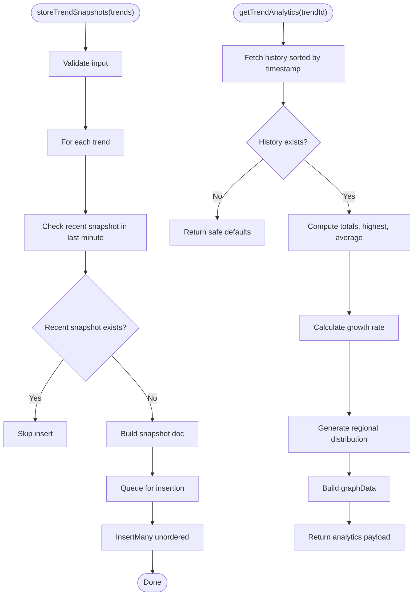

**Diagram sources**
- [analyticsService.js:8-44](file://backend/src/services/analyticsService.js#L8-L44)
- [analyticsService.js:76-150](file://backend/src/services/analyticsService.js#L76-L150)

**Section sources**
- [analyticsService.js:1-154](file://backend/src/services/analyticsService.js#L1-L154)

### Personalization Service
Responsibilities:
- Produce a personalized feed for a user given a list of trends.
- Enforce performance targets and apply boosting heuristics.

Scoring logic:
- Interest keyword matching with capped boost.
- Preferred source matching.
- Recency boost for trends published within a threshold.
- AI virality boost for high virality scores.
- Produces explanations for each score component.

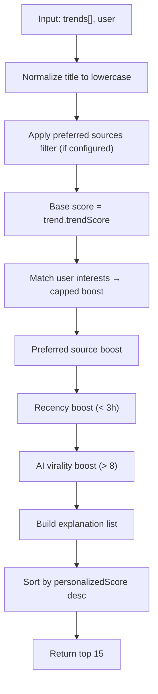

**Diagram sources**
- [personalizationService.js:31-125](file://backend/src/services/personalizationService.js#L31-L125)

**Section sources**
- [personalizationService.js:1-129](file://backend/src/services/personalizationService.js#L1-L129)

### Recommendation Engine
Responsibilities:
- Generate geo-personalized "For You" feeds with auto-interleaving ratios.
- Support explicit scope overrides (local, national, global).
- Rank pools with affinity, language weight, keyword overlap, and virality.

Composition:
- Builds affinity vectors from user activity.
- Ranks pools independently and interleaves with deduplication.
- Backfills from global feed if needed.

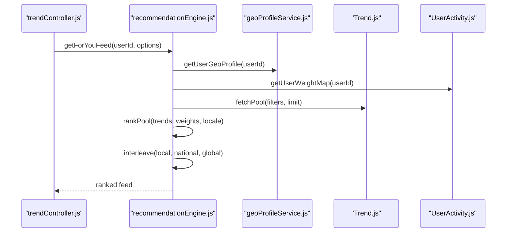

**Diagram sources**
- [trendController.js:193-244](file://backend/src/controllers/trendController.js#L193-L244)
- [recommendationEngine.js:27-96](file://backend/src/services/recommendationEngine.js#L27-L96)
- [geoProfileService.js](file://backend/src/services/geoProfileService.js)
- [UserActivity.js](file://backend/src/models/UserActivity.js)
- [Trend.js](file://backend/src/models/Trend.js)

**Section sources**
- [recommendationEngine.js:1-253](file://backend/src/services/recommendationEngine.js#L1-L253)

### Geographic Trend Engine
Responsibilities:
- Detect emerging trends via velocity spikes in regional score histories.
- Trigger geo-targeted alerts with daily caps and emit via WebSocket.
- Build heatmap payload for frontend map rendering.
- Provide local context for AI enrichment.

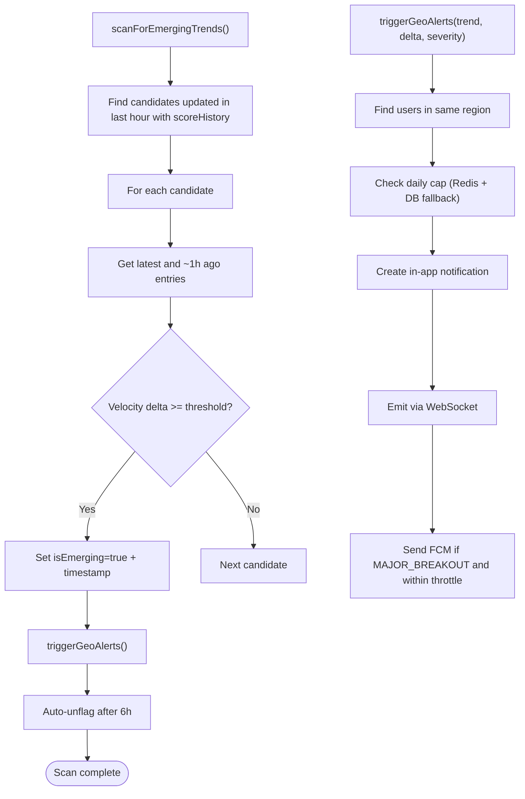

**Diagram sources**
- [geoTrendEngine.js:59-116](file://backend/src/services/geoTrendEngine.js#L59-L116)
- [geoTrendEngine.js:141-215](file://backend/src/services/geoTrendEngine.js#L141-L215)

**Section sources**
- [geoTrendEngine.js:1-320](file://backend/src/services/geoTrendEngine.js#L1-L320)

### AI Analytics Service
Responsibilities:
- Enrich trends with LLM-generated analysis using structured JSON and schema validation.
- Fallback strategies: GPT-4o-mini fallback, then deterministic local fallback.
- Safeguards against hallucinations via Zod validation and partial coercion.

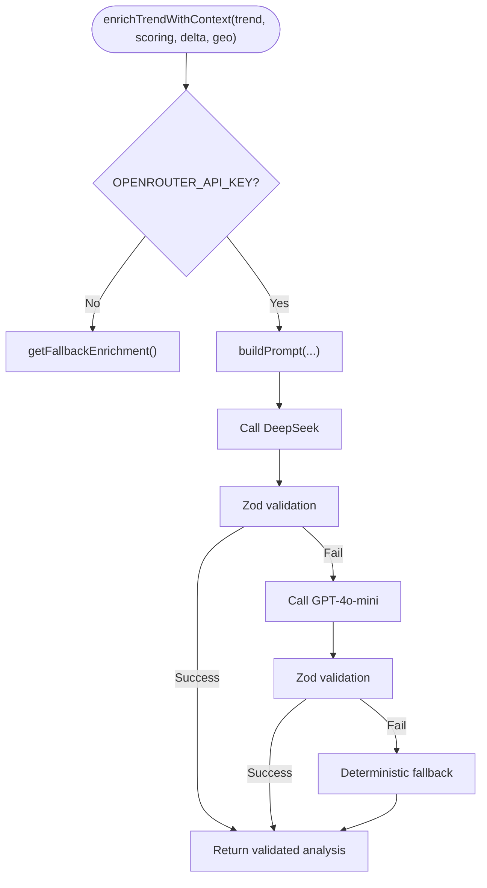

**Diagram sources**
- [aiAnalyticsService.js:29-56](file://backend/src/services/aiAnalyticsService.js#L29-L56)
- [aiAnalyticsService.js:62-96](file://backend/src/services/aiAnalyticsService.js#L62-L96)
- [aiAnalyticsService.js:182-199](file://backend/src/services/aiAnalyticsService.js#L182-L199)

**Section sources**
- [aiAnalyticsService.js:1-203](file://backend/src/services/aiAnalyticsService.js#L1-L203)

### AI Optimization Service
Responsibilities:
- Gate AI enrichment behind a viral score threshold.
- Detect near-duplicate trends via keyword overlap and mirror analysis.

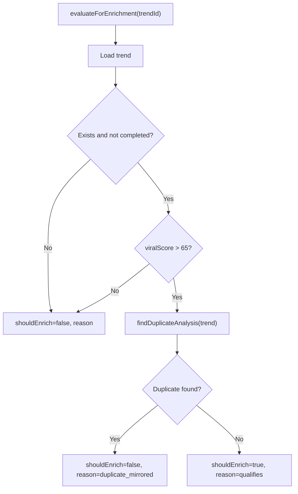

**Diagram sources**
- [aiOptimizationService.js:21-47](file://backend/src/services/aiOptimizationService.js#L21-L47)
- [aiOptimizationService.js:54-83](file://backend/src/services/aiOptimizationService.js#L54-L83)

**Section sources**
- [aiOptimizationService.js:1-120](file://backend/src/services/aiOptimizationService.js#L1-L120)

### AI Service and AI Trend Enhancer
Responsibilities:
- AI Service: Generates analysis with in-memory caching and graceful fallbacks.
- AI Trend Enhancer: Batch-enriches trends with caching and category prediction.

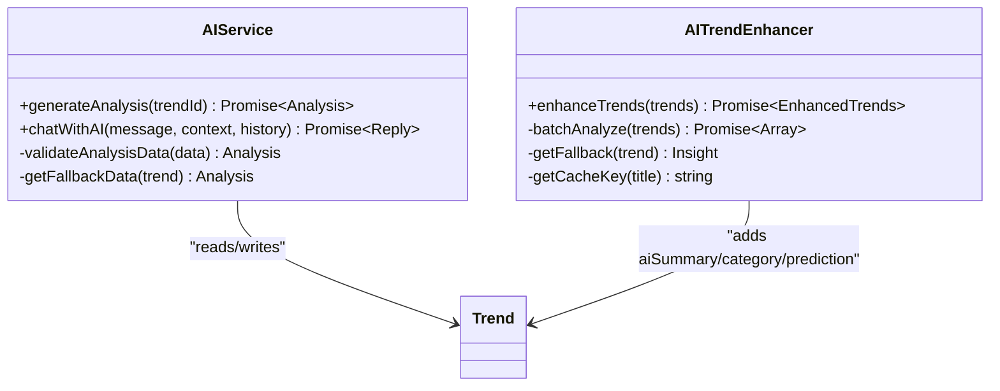

**Diagram sources**
- [aiService.js:16-165](file://backend/src/services/aiService.js#L16-L165)
- [aiTrendEnhancer.js:26-185](file://backend/src/services/aiTrendEnhancer.js#L26-L185)

**Section sources**
- [aiService.js:1-168](file://backend/src/services/aiService.js#L1-L168)
- [aiTrendEnhancer.js:1-188](file://backend/src/services/aiTrendEnhancer.js#L1-L188)

### Cache and Socket Services
Responsibilities:
- CacheService: Redis-backed get/set/del with TTL and category busting.
- SocketService: WebSocket server with Redis adapter, emits AI completion and alerts.

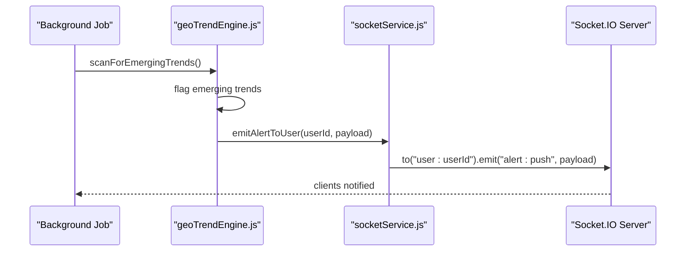

**Diagram sources**
- [geoTrendEngine.js:141-215](file://backend/src/services/geoTrendEngine.js#L141-L215)
- [socketService.js:74-91](file://backend/src/services/socketService.js#L74-L91)

**Section sources**
- [cacheService.js:1-68](file://backend/src/services/cacheService.js#L1-L68)
- [socketService.js:1-107](file://backend/src/services/socketService.js#L1-L107)

## Dependency Analysis
Service composition patterns:
- Controllers depend on services and models; services depend on models and other services.
- RecommendationEngine composes geoProfileService and UserActivity.
- GeoTrendEngine composes cacheService, alertService, and socketService.
- AI services are optional and gracefully fall back when API keys are missing.

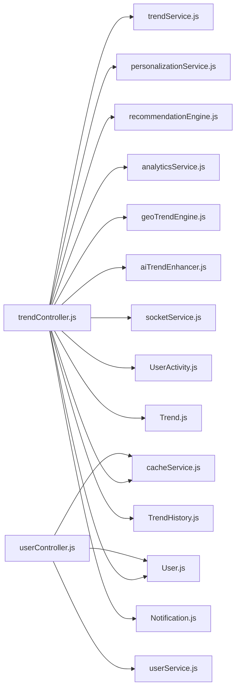

**Diagram sources**
- [trendController.js:1-15](file://backend/src/controllers/trendController.js#L1-L15)
- [userController.js:1-3](file://backend/src/controllers/userController.js#L1-L3)
- [trendService.js:1-3](file://backend/src/services/trendService.js#L1-L3)
- [personalizationService.js:1-3](file://backend/src/services/personalizationService.js#L1-L3)
- [recommendationEngine.js:1-16](file://backend/src/services/recommendationEngine.js#L1-L16)
- [analyticsService.js:1-3](file://backend/src/services/analyticsService.js#L1-L3)
- [geoTrendEngine.js:1-20](file://backend/src/services/geoTrendEngine.js#L1-L20)
- [aiTrendEnhancer.js:1-3](file://backend/src/services/aiTrendEnhancer.js#L1-L3)
- [cacheService.js:1-4](file://backend/src/services/cacheService.js#L1-L4)
- [socketService.js:1-13](file://backend/src/services/socketService.js#L1-L13)
- [UserActivity.js](file://backend/src/models/UserActivity.js)
- [Trend.js](file://backend/src/models/Trend.js)
- [User.js](file://backend/src/models/User.js)
- [TrendHistory.js](file://backend/src/models/TrendHistory.js)
- [Notification.js](file://backend/src/models/Notification.js)

**Section sources**
- [trendController.js:1-407](file://backend/src/controllers/trendController.js#L1-L407)
- [userController.js:1-90](file://backend/src/controllers/userController.js#L1-L90)

## Performance Considerations
- Caching: Redis-based cache for trend feeds and heatmap data; cache busting by category; in-memory caches for AI insights and analysis.
- Aggregation and Ranking: RecommendationEngine interleaves pools and deduplicates by trendId; personalizationService performs a single pass scoring with early exits.
- Background Processing: GeoTrendEngine runs hourly scans; AI enrichment gated by viral score thresholds; duplicate mirroring reduces LLM calls.
- Real-time Updates: WebSocket server with Redis adapter ensures horizontal scalability for emitting AI completions and alerts.

[No sources needed since this section provides general guidance]

## Troubleshooting Guide
Common issues and strategies:
- Missing API Keys: AI services log warnings and return safe fallbacks; controllers should surface meaningful error responses.
- Redis Failures: CacheService logs errors and falls back to fresh data; socket initialization warns and continues single-instance mode.
- Validation Failures: AIAnalyticsService coerces partial results and logs Zod issues; analyticsService returns defaults for missing history.
- Rate Limits: AI Service handles rate limit errors and informs users; GeoTrendEngine throttles alerts via Redis and DB counts.

**Section sources**
- [aiService.js:81-85](file://backend/src/services/aiService.js#L81-L85)
- [cacheService.js:24-27](file://backend/src/services/cacheService.js#L24-L27)
- [socketService.js:34-36](file://backend/src/services/socketService.js#L34-L36)
- [aiAnalyticsService.js:86-96](file://backend/src/services/aiAnalyticsService.js#L86-L96)
- [analyticsService.js:80-90](file://backend/src/services/analyticsService.js#L80-L90)
- [geoTrendEngine.js:195-210](file://backend/src/services/geoTrendEngine.js#L195-L210)

## Conclusion
The service layer cleanly separates concerns between controllers and services, with robust data transformation and business rule enforcement. Services compose to deliver sophisticated features: trend aggregation and enrichment, user-centric personalization, geo-aware recommendations, and real-time alerting. Cross-cutting services ensure performance, reliability, and scalability through caching, validation, and real-time communication.

[No sources needed since this section summarizes without analyzing specific files]