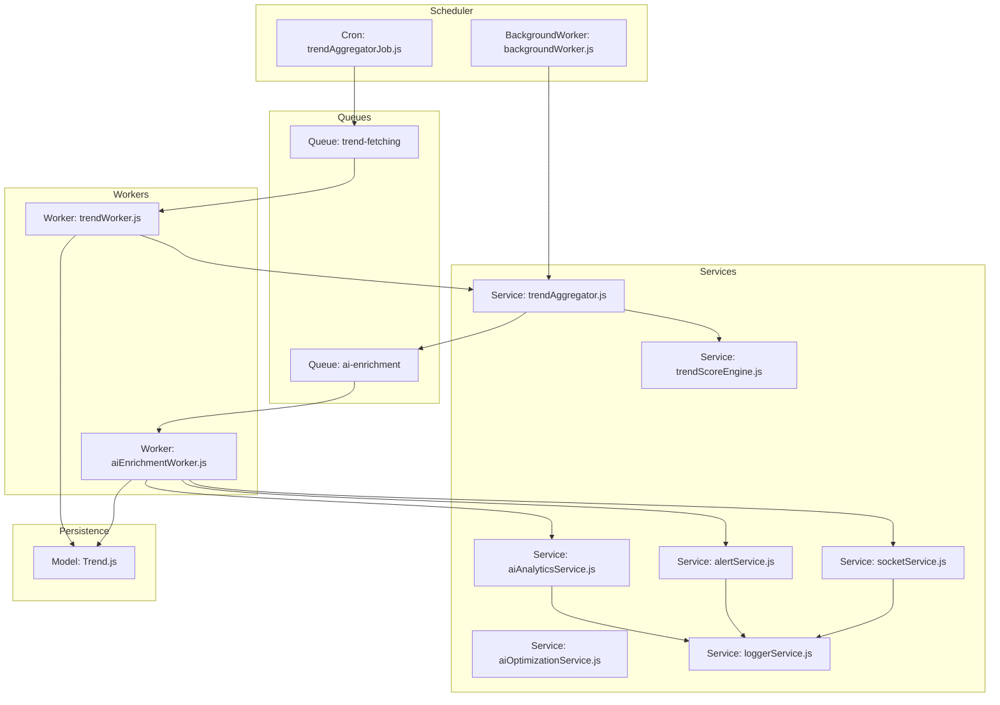
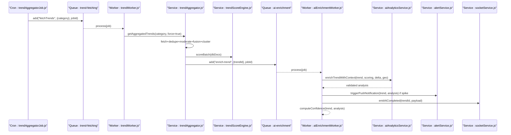
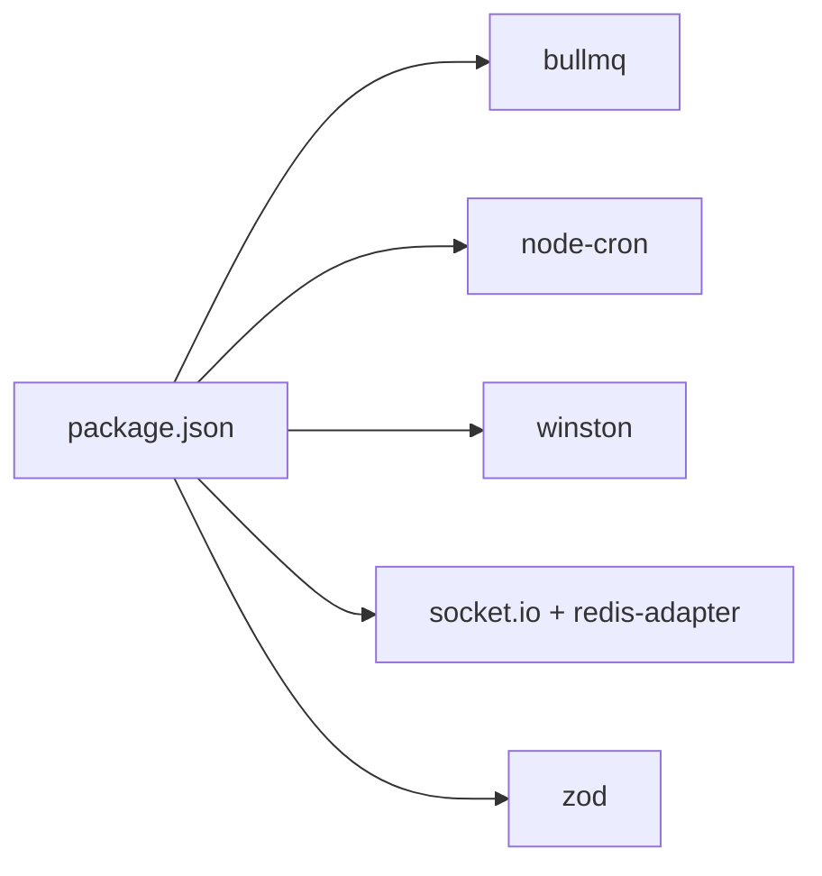

# Background Processing

<cite>
**Referenced Files in This Document**
- [server.js](file://backend/server.js)
- [queue.js](file://backend/src/config/queue.js)
- [redis.js](file://backend/src/config/redis.js)
- [trendAggregatorJob.js](file://backend/src/jobs/trendAggregatorJob.js)
- [backgroundWorker.js](file://backend/src/services/backgroundWorker.js)
- [trendAggregator.js](file://backend/src/services/trendAggregator.js)
- [trendScoreEngine.js](file://backend/src/services/trendScoreEngine.js)
- [aiEnrichmentWorker.js](file://backend/src/queues/workers/aiEnrichmentWorker.js)
- [trendWorker.js](file://backend/src/queues/workers/trendWorker.js)
- [aiAnalyticsService.js](file://backend/src/services/aiAnalyticsService.js)
- [aiOptimizationService.js](file://backend/src/services/aiOptimizationService.js)
- [socketService.js](file://backend/src/services/socketService.js)
- [alertService.js](file://backend/src/services/alertService.js)
- [analysisSchema.js](file://backend/src/validators/analysisSchema.js)
- [Trend.js](file://backend/src/models/Trend.js)
- [loggerService.js](file://backend/src/services/loggerService.js)
- [package.json](file://backend/package.json)
</cite>

## Table of Contents
1. [Introduction](#introduction)
2. [Project Structure](#project-structure)
3. [Core Components](#core-components)
4. [Architecture Overview](#architecture-overview)
5. [Detailed Component Analysis](#detailed-component-analysis)
6. [Dependency Analysis](#dependency-analysis)
7. [Performance Considerations](#performance-considerations)
8. [Troubleshooting Guide](#troubleshooting-guide)
9. [Conclusion](#conclusion)
10. [Appendices](#appendices)

## Introduction
This document explains AITrendTracker’s background processing system built on BullMQ job queues. It covers worker implementation patterns, job scheduling strategies, task prioritization, the trend aggregation pipeline, AI enrichment workflows, and automated data processing. It also documents job persistence, retry/backoff, failure handling, monitoring and observability, scaling and load balancing, security and validation, debugging techniques, performance tuning, and operational best practices.

## Project Structure
The background processing system spans configuration, scheduling, workers, services, and models:
- Configuration: Redis connection and BullMQ queue definitions
- Scheduling: Cron-based job triggers
- Workers: BullMQ workers for trend fetching and AI enrichment
- Services: Trend aggregation, scoring, AI enrichment, alerting, caching, and logging
- Models: Mongoose schema for trend persistence and analytics
- Observability: Winston-based structured logging and Socket.IO for live updates

**Diagram sources**
- [server.js:34-37](file://backend/server.js#L34-L37)
- [trendAggregatorJob.js:12-25](file://backend/src/jobs/trendAggregatorJob.js#L12-L25)
- [backgroundWorker.js:4-18](file://backend/src/services/backgroundWorker.js#L4-L18)
- [queue.js:5-31](file://backend/src/config/queue.js#L5-L31)
- [trendWorker.js:17-46](file://backend/src/queues/workers/trendWorker.js#L17-L46)
- [aiEnrichmentWorker.js:24-129](file://backend/src/queues/workers/aiEnrichmentWorker.js#L24-L129)
- [trendAggregator.js:102-141](file://backend/src/services/trendAggregator.js#L102-L141)
- [trendScoreEngine.js:102-216](file://backend/src/services/trendScoreEngine.js#L102-L216)
- [aiAnalyticsService.js:29-56](file://backend/src/services/aiAnalyticsService.js#L29-L56)
- [aiOptimizationService.js:21-47](file://backend/src/services/aiOptimizationService.js#L21-L47)
- [alertService.js:136-172](file://backend/src/services/alertService.js#L136-L172)
- [socketService.js:62-69](file://backend/src/services/socketService.js#L62-L69)
- [Trend.js:45-187](file://backend/src/models/Trend.js#L45-L187)
- [loggerService.js:11-30](file://backend/src/services/loggerService.js#L11-L30)

**Section sources**
- [server.js:1-51](file://backend/server.js#L1-L51)
- [queue.js:1-32](file://backend/src/config/queue.js#L1-L32)
- [redis.js:1-19](file://backend/src/config/redis.js#L1-L19)

## Core Components
- BullMQ queues:
  - trend-fetching: scheduled trend ingestion and scoring
  - ai-enrichment: AI enrichment and confidence computation
- Workers:
  - trendWorker: fetches, normalizes, persists, and scores trends; emits events
  - aiEnrichmentWorker: enriches scored trends with LLM, computes confidence, triggers alerts, and patches UI
- Schedulers:
  - cron-based periodic aggregation
  - autonomous background worker for continuous freshness
- Services:
  - trendAggregator: multi-source ingestion, deduplication, fusion, clustering, ranking, persistence, alerting, analytics, and prediction orchestration
  - trendScoreEngine: mathematical scoring and history maintenance
  - aiAnalyticsService: LLM orchestration with validation and fallbacks
  - aiOptimizationService: cost control and duplicate mirroring
  - alertService: smart alert generation, throttling, and push notifications
  - socketService: real-time UI updates via WebSocket
- Persistence:
  - Trend model with scoring, analysis, confidence, predictions, and clustering fields
- Logging:
  - Winston-based structured logging with rotation

**Section sources**
- [queue.js:5-31](file://backend/src/config/queue.js#L5-L31)
- [trendWorker.js:17-52](file://backend/src/queues/workers/trendWorker.js#L17-L52)
- [aiEnrichmentWorker.js:24-176](file://backend/src/queues/workers/aiEnrichmentWorker.js#L24-L176)
- [trendAggregatorJob.js:12-25](file://backend/src/jobs/trendAggregatorJob.js#L12-L25)
- [backgroundWorker.js:4-36](file://backend/src/services/backgroundWorker.js#L4-L36)
- [trendAggregator.js:16-173](file://backend/src/services/trendAggregator.js#L16-L173)
- [trendScoreEngine.js:12-231](file://backend/src/services/trendScoreEngine.js#L12-L231)
- [aiAnalyticsService.js:24-203](file://backend/src/services/aiAnalyticsService.js#L24-L203)
- [aiOptimizationService.js:15-120](file://backend/src/services/aiOptimizationService.js#L15-L120)
- [alertService.js:21-282](file://backend/src/services/alertService.js#L21-L282)
- [socketService.js:11-107](file://backend/src/services/socketService.js#L11-L107)
- [Trend.js:45-187](file://backend/src/models/Trend.js#L45-L187)
- [loggerService.js:11-43](file://backend/src/services/loggerService.js#L11-L43)

## Architecture Overview
The system runs a dual-queue pipeline:
- trend-fetching queue drives ingestion and scoring
- ai-enrichment queue drives AI analysis and alerting

**Diagram sources**
- [trendAggregatorJob.js:12-25](file://backend/src/jobs/trendAggregatorJob.js#L12-L25)
- [trendWorker.js:17-46](file://backend/src/queues/workers/trendWorker.js#L17-L46)
- [trendAggregator.js:102-141](file://backend/src/services/trendAggregator.js#L102-L141)
- [trendScoreEngine.js:102-216](file://backend/src/services/trendScoreEngine.js#L102-L216)
- [aiEnrichmentWorker.js:24-129](file://backend/src/queues/workers/aiEnrichmentWorker.js#L24-L129)
- [aiAnalyticsService.js:29-56](file://backend/src/services/aiAnalyticsService.js#L29-L56)
- [alertService.js:136-172](file://backend/src/services/alertService.js#L136-L172)
- [socketService.js:62-69](file://backend/src/services/socketService.js#L62-L69)

## Detailed Component Analysis

### BullMQ Queues and Defaults
- ai-enrichment queue:
  - Attempts: 3 with exponential backoff starting at 10 seconds
  - Remove on complete/fail: configurable retention for debugging
- trend-fetching queue:
  - Attempts: 2 with fixed 5-second backoff
  - Remove on complete/fail: limited retention

Operational implications:
- Retry/backoff reduce transient failure impact
- Retention ensures visibility into failures for diagnostics
- Separate queues isolate CPU-bound AI workloads from I/O-heavy fetching

**Section sources**
- [queue.js:5-31](file://backend/src/config/queue.js#L5-L31)

### Redis Connection
- Local Redis configured with BullMQ-compatible settings
- Error and ready events logged for connectivity awareness

**Section sources**
- [redis.js:4-19](file://backend/src/config/redis.js#L4-L19)

### Trend Fetching Worker
Responsibilities:
- Process trend-fetching jobs
- Execute heavy API fetching, parsing, normalization, and upsert
- Compute and persist scores for new trends
- Log successes and failures

Concurrency and rate limiting:
- Concurrency set to 1 to respect upstream API rate limits

Failure handling:
- Errors are logged and rethrown to trigger BullMQ retries

**Section sources**
- [trendWorker.js:17-52](file://backend/src/queues/workers/trendWorker.js#L17-L52)

### AI Enrichment Worker
Responsibilities:
- Fetch trend, guard against duplicates, and set a processing skeleton
- Build scoring and geo context
- Call LLM via aiAnalyticsService with validation and fallbacks
- Compute AI Confidence sub-object
- Persist analysis and confidence
- Emit WebSocket events for live UI updates
- Trigger smart alerts for spikes

Concurrency:
- Concurrency set to 3 to balance throughput and LLM costs

Failure handling:
- On error, sets status to failed and throws to leverage backoff

Confidence computation:
- Weighted score based on source consistency and data completeness plus LLM confidence

**Section sources**
- [aiEnrichmentWorker.js:24-176](file://backend/src/queues/workers/aiEnrichmentWorker.js#L24-L176)

### Trend Aggregation Pipeline
End-to-end ingestion and enrichment:
- Multi-source fetch (NewsAPI, Reddit, GNews, YouTube) with concurrent resolution and fault tolerance
- Deduplication, moderation, fusion, clustering, ranking, and filtering
- Upsert to MongoDB and enqueue AI enrichment for qualifying trends
- Cache results and schedule analytics/predictions/alerts as fire-and-forget tasks

Cost control:
- aiOptimizationService gates enrichment behind viral score threshold and duplicate mirroring

**Section sources**
- [trendAggregator.js:16-173](file://backend/src/services/trendAggregator.js#L16-L173)
- [aiOptimizationService.js:15-120](file://backend/src/services/aiOptimizationService.js#L15-L120)

### Trend Scoring Engine
Scoring methodology:
- Decayed engagement, heat, and growth metrics with logarithmic normalization
- Composite score with optional cross-platform multiplier
- History capped at 48 entries for recent cycles
- Velocity delta computation for alerting

**Section sources**
- [trendScoreEngine.js:12-231](file://backend/src/services/trendScoreEngine.js#L12-L231)

### AI Analytics Service
LLM orchestration:
- Prompt building with scoring and geo context
- Dual-model fallback (DeepSeek -> GPT-4o-mini) with JSON validation
- Zod schema validation to prevent hallucinations
- Partial coercion and deterministic fallback when validation fails

**Section sources**
- [aiAnalyticsService.js:24-203](file://backend/src/services/aiAnalyticsService.js#L24-L203)
- [analysisSchema.js:9-25](file://backend/src/validators/analysisSchema.js#L9-L25)

### Alerting and Real-Time Updates
Smart alerts:
- Velocity spike detection and diverse categorization
- FCM throttling per device token per rolling window
- In-app notifications and WebSocket broadcasts

WebSocket:
- Redis adapter for multi-instance horizontal scaling
- Emission of AI completion and alert events

**Section sources**
- [alertService.js:21-282](file://backend/src/services/alertService.js#L21-L282)
- [socketService.js:11-107](file://backend/src/services/socketService.js#L11-L107)

### Scheduling Strategies
- Cron-based aggregation every 5 minutes with deterministic job IDs to prevent duplicates
- Autonomous background worker that periodically refreshes trends to maintain freshness

**Section sources**
- [trendAggregatorJob.js:12-25](file://backend/src/jobs/trendAggregatorJob.js#L12-L25)
- [backgroundWorker.js:4-36](file://backend/src/services/backgroundWorker.js#L4-L36)

### Data Model for Trends
Schema highlights:
- Trend identity, content, engagement, type, and publication metadata
- Scoring metrics and history
- AI analysis object and confidence sub-object
- Predictions, clustering, and moderation fields
- Geo-intelligence and relationship graph fields
- Indexes optimized for queries and analytics

**Section sources**
- [Trend.js:45-187](file://backend/src/models/Trend.js#L45-L187)

### Logging and Observability
Logging:
- Structured JSON logs with timestamp and stack traces
- Daily rotated files with separate error and combined logs
- Console transport outside production

Monitoring hooks:
- Worker event handlers for completed/failed events
- Cron logs for scheduled tasks
- Socket IO initialization and adapter attachment logs

**Section sources**
- [loggerService.js:11-43](file://backend/src/services/loggerService.js#L11-L43)
- [trendWorker.js:48-50](file://backend/src/queues/workers/trendWorker.js#L48-L50)
- [aiEnrichmentWorker.js:167-173](file://backend/src/queues/workers/aiEnrichmentWorker.js#L167-L173)
- [server.js:40-45](file://backend/server.js#L40-L45)

## Dependency Analysis
External dependencies relevant to background processing:
- BullMQ for queues and workers
- node-cron for scheduling
- Winston for logging
- Socket.IO with Redis adapter for real-time updates
- Zod for LLM response validation

**Diagram sources**
- [package.json:14-38](file://backend/package.json#L14-L38)

**Section sources**
- [package.json:14-38](file://backend/package.json#L14-L38)

## Performance Considerations
- Queue concurrency:
  - trend-fetching: 1 to respect API rate limits
  - ai-enrichment: 3 to balance throughput and cost
- Backoff strategy:
  - ai-enrichment uses exponential backoff to handle transient LLM failures
  - trend-fetching uses fixed backoff for predictable recovery
- Persistence:
  - Bulk writes for scoring and upserts minimize DB round trips
  - Caching reduces repeated API calls
- Cost control:
  - aiOptimizationService gates enrichment by viral score and mirrors duplicates
- Indexing:
  - Trend model indexes support analytics and alerting queries
- Fire-and-forget tasks:
  - Analytics snapshots, predictions, and graph builds avoid blocking responses

[No sources needed since this section provides general guidance]

## Troubleshooting Guide
Common issues and remedies:
- Redis connectivity errors:
  - Verify Redis host/port and network accessibility
  - Check BullMQ-specific connection settings
- Worker failures:
  - Review worker “failed” event logs
  - Inspect retry counts and backoff behavior
- LLM validation failures:
  - Confirm API keys and model availability
  - Check Zod validation errors for malformed outputs
- Duplicate enrichment:
  - Ensure aiOptimizationService thresholds and duplicate detection are functioning
- Alert throttling:
  - Verify cache keys and FCM token hashing logic
- UI not updating:
  - Confirm Socket.IO initialization and Redis adapter attachment

**Section sources**
- [redis.js:10-19](file://backend/src/config/redis.js#L10-L19)
- [trendWorker.js:48-50](file://backend/src/queues/workers/trendWorker.js#L48-L50)
- [aiEnrichmentWorker.js:171-173](file://backend/src/queues/workers/aiEnrichmentWorker.js#L171-L173)
- [aiAnalyticsService.js:85-96](file://backend/src/services/aiAnalyticsService.js#L85-L96)
- [aiOptimizationService.js:32-47](file://backend/src/services/aiOptimizationService.js#L32-L47)
- [alertService.js:177-198](file://backend/src/services/alertService.js#L177-L198)
- [socketService.js:30-37](file://backend/src/services/socketService.js#L30-L37)

## Conclusion
AITrendTracker’s background processing system leverages BullMQ queues to orchestrate a robust pipeline: scheduled ingestion, scoring, enrichment, and alerting. Built-in retry/backoff, validation, and cost-control mechanisms ensure reliability and efficiency. Real-time updates and structured logging support observability. With proper scaling and indexing, the system can evolve to meet growing demand while maintaining performance and resilience.

[No sources needed since this section summarizes without analyzing specific files]

## Appendices

### Monitoring and Metrics
- Queue health:
  - Track completed/failed job counts and processing latency
  - Monitor queue length and backlog
- Worker health:
  - Watch for frequent failures and retry saturation
- LLM reliability:
  - Track validation success rates and fallback usage
- Operational logs:
  - Use Winston logs for error triage and audit trails

[No sources needed since this section provides general guidance]

### Scaling and Load Balancing
- Horizontal scaling:
  - Run multiple worker instances for each queue
  - Use Redis adapter for Socket.IO to broadcast consistently across nodes
- Queue isolation:
  - Separate queues for I/O-heavy fetching and CPU-intensive AI tasks
- Resource management:
  - Tune concurrency per worker based on upstream rate limits and LLM costs
  - Use backoff to avoid overwhelming external APIs and LLM providers

[No sources needed since this section provides general guidance]

### Security, Validation, and Sanitization
- Input validation:
  - Use Zod schema to validate LLM outputs and enforce structural integrity
- Prompt engineering:
  - Provide explicit constraints and formatting arrays to reduce hallucinations
- Access control:
  - Restrict API keys and ensure environment variables are managed securely
- Output sanitization:
  - Avoid echoing raw LLM content without validation; rely on sanitized fields

**Section sources**
- [analysisSchema.js:9-25](file://backend/src/validators/analysisSchema.js#L9-L25)
- [aiAnalyticsService.js:101-140](file://backend/src/services/aiAnalyticsService.js#L101-L140)

### Debugging Techniques and Best Practices
- Enable detailed logging during development and use Winston rotation in production
- Use deterministic job IDs to prevent duplicate processing
- Leverage queue retention to inspect failed jobs
- Monitor worker events and cron schedules
- Validate database indexes and query plans for scoring and alerting

**Section sources**
- [loggerService.js:11-43](file://backend/src/services/loggerService.js#L11-L43)
- [trendAggregatorJob.js:20-24](file://backend/src/jobs/trendAggregatorJob.js#L20-L24)
- [queue.js:13-14](file://backend/src/config/queue.js#L13-L14)