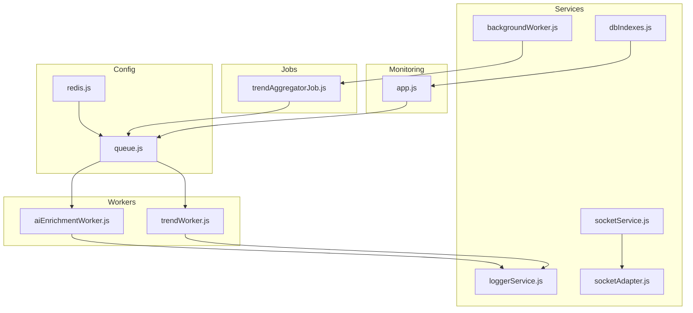
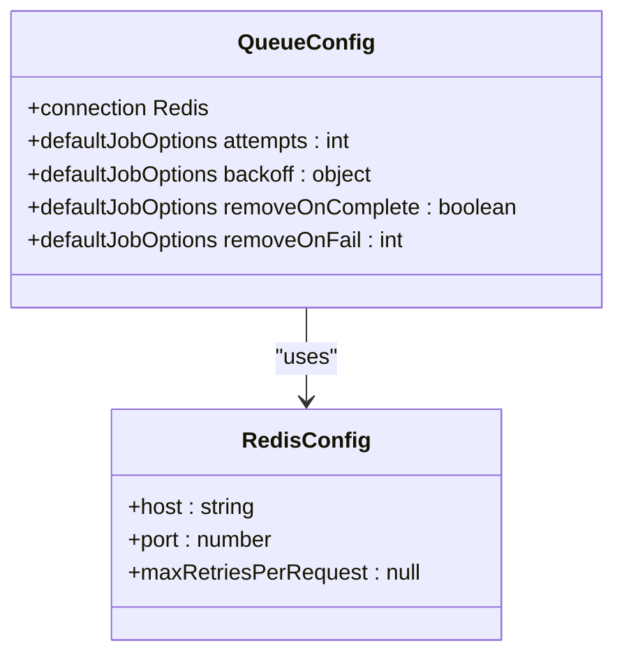
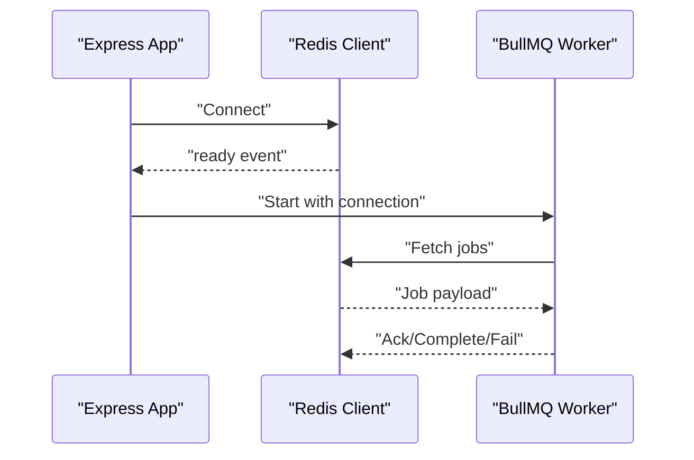
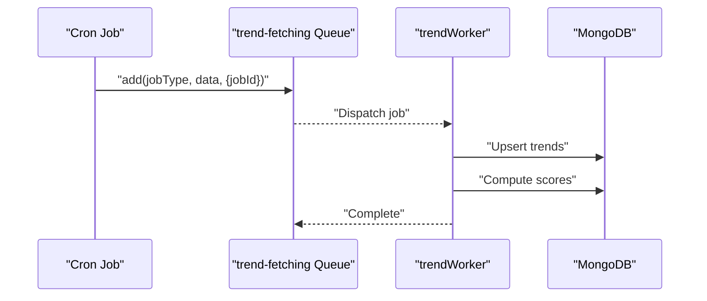
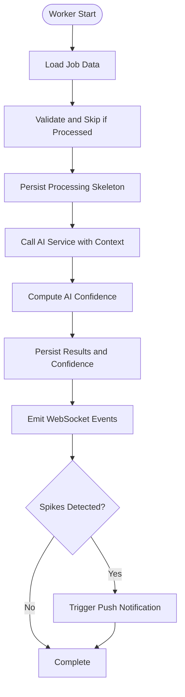
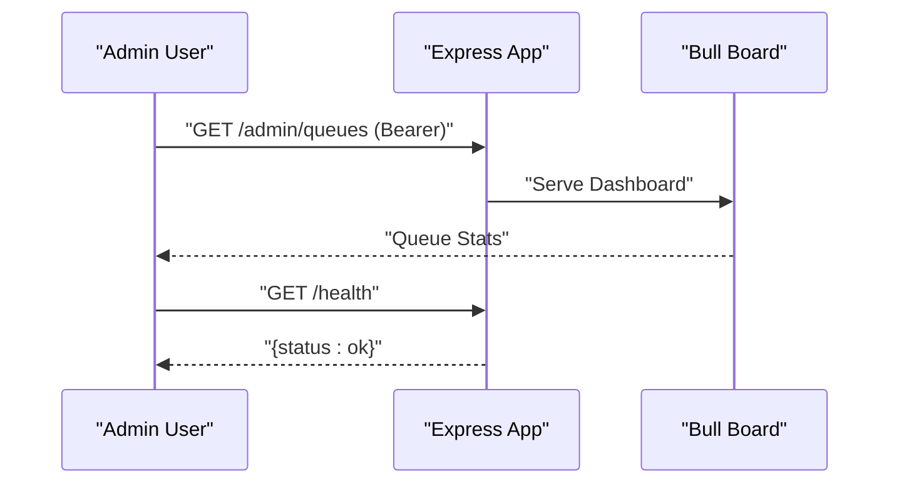
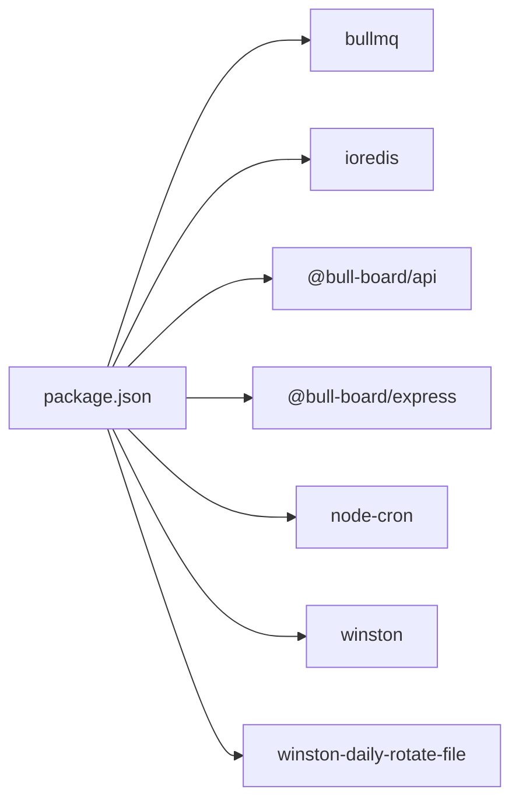

# BullMQ Queue System

<cite>
**Referenced Files in This Document**
- [queue.js](file://backend/src/config/queue.js)
- [redis.js](file://backend/src/config/redis.js)
- [aiEnrichmentWorker.js](file://backend/src/queues/workers/aiEnrichmentWorker.js)
- [trendWorker.js](file://backend/src/queues/workers/trendWorker.js)
- [trendAggregatorJob.js](file://backend/src/jobs/trendAggregatorJob.js)
- [app.js](file://backend/src/app.js)
- [server.js](file://backend/server.js)
- [backgroundWorker.js](file://backend/src/services/backgroundWorker.js)
- [socketService.js](file://backend/src/services/socketService.js)
- [socketAdapter.js](file://backend/src/services/socketAdapter.js)
- [loggerService.js](file://backend/src/services/loggerService.js)
- [dbIndexes.js](file://backend/src/config/dbIndexes.js)
- [package.json](file://backend/package.json)
</cite>

## Table of Contents
1. [Introduction](#introduction)
2. [Project Structure](#project-structure)
3. [Core Components](#core-components)
4. [Architecture Overview](#architecture-overview)
5. [Detailed Component Analysis](#detailed-component-analysis)
6. [Dependency Analysis](#dependency-analysis)
7. [Performance Considerations](#performance-considerations)
8. [Troubleshooting Guide](#troubleshooting-guide)
9. [Conclusion](#conclusion)
10. [Appendices](#appendices)

## Introduction
This document describes the BullMQ queue system implementation in AITrendTracker’s backend. It covers queue configuration, Redis integration, connection management, job creation and persistence, queue naming conventions, monitoring and health checks, scaling and performance optimization, backup and recovery considerations, data serialization, cleanup operations, security, and troubleshooting.

## Project Structure
The queue system spans configuration, workers, job schedulers, monitoring, and supporting services:
- Configuration: Redis connection and queue instances
- Workers: Processing logic for AI enrichment and trend fetching
- Jobs: Cron-driven job creation
- Monitoring: Bull Board dashboard with access control
- Services: Logging, sockets, and database index management



**Diagram sources**
- [queue.js:1-32](file://backend/src/config/queue.js#L1-L32)
- [redis.js:1-19](file://backend/src/config/redis.js#L1-L19)
- [aiEnrichmentWorker.js:1-176](file://backend/src/queues/workers/aiEnrichmentWorker.js#L1-L176)
- [trendWorker.js:1-53](file://backend/src/queues/workers/trendWorker.js#L1-L53)
- [trendAggregatorJob.js:1-28](file://backend/src/jobs/trendAggregatorJob.js#L1-L28)
- [app.js:33-57](file://backend/src/app.js#L33-L57)
- [loggerService.js:1-43](file://backend/src/services/loggerService.js#L1-L43)
- [socketService.js:1-107](file://backend/src/services/socketService.js#L1-L107)
- [socketAdapter.js:1-22](file://backend/src/services/socketAdapter.js#L1-L22)
- [dbIndexes.js:1-31](file://backend/src/config/dbIndexes.js#L1-L31)
- [backgroundWorker.js:1-36](file://backend/src/services/backgroundWorker.js#L1-L36)

**Section sources**
- [queue.js:1-32](file://backend/src/config/queue.js#L1-L32)
- [redis.js:1-19](file://backend/src/config/redis.js#L1-L19)
- [aiEnrichmentWorker.js:1-176](file://backend/src/queues/workers/aiEnrichmentWorker.js#L1-L176)
- [trendWorker.js:1-53](file://backend/src/queues/workers/trendWorker.js#L1-L53)
- [trendAggregatorJob.js:1-28](file://backend/src/jobs/trendAggregatorJob.js#L1-L28)
- [app.js:33-57](file://backend/src/app.js#L33-L57)
- [server.js:34-37](file://backend/server.js#L34-L37)
- [loggerService.js:1-43](file://backend/src/services/loggerService.js#L1-L43)
- [socketService.js:1-107](file://backend/src/services/socketService.js#L1-L107)
- [socketAdapter.js:1-22](file://backend/src/services/socketAdapter.js#L1-L22)
- [dbIndexes.js:1-31](file://backend/src/config/dbIndexes.js#L1-L31)
- [backgroundWorker.js:1-36](file://backend/src/services/backgroundWorker.js#L1-L36)

## Core Components
- Redis connection: Centralized ioredis client configured for BullMQ compatibility
- Queue instances: Two named queues with default job options for retries, backoff, and cleanup
- Workers: Dedicated processors for AI enrichment and trend fetching with concurrency and error handling
- Job scheduler: Cron-based job creation with deterministic job IDs
- Monitoring: Bull Board dashboard mounted under a protected admin route
- Logging: Structured Winston logs for observability
- Sockets: Real-time UI updates and alerts via Socket.IO with Redis adapter

**Section sources**
- [redis.js:1-19](file://backend/src/config/redis.js#L1-L19)
- [queue.js:1-32](file://backend/src/config/queue.js#L1-L32)
- [aiEnrichmentWorker.js:24-129](file://backend/src/queues/workers/aiEnrichmentWorker.js#L24-L129)
- [trendWorker.js:17-46](file://backend/src/queues/workers/trendWorker.js#L17-L46)
- [trendAggregatorJob.js:12-25](file://backend/src/jobs/trendAggregatorJob.js#L12-L25)
- [app.js:33-57](file://backend/src/app.js#L33-L57)
- [loggerService.js:11-30](file://backend/src/services/loggerService.js#L11-L30)
- [socketService.js:20-54](file://backend/src/services/socketService.js#L20-L54)

## Architecture Overview
The system integrates BullMQ queues with Redis for persistence and distribution, workers for processing, and a monitoring dashboard. Background tasks and cron jobs schedule work. Real-time updates are delivered via Socket.IO with Redis adapter.

```mermaid
graph TB
REDIS["Redis"]
Q_AI["Queue 'ai-enrichment'"]
Q_TREND["Queue 'trend-fetching'"]
W_AI["Worker 'ai-enrichment'"]
W_TREND["Worker 'trend-fetching'"]
CRON["Cron Job Scheduler"]
MON["Bull Board Dashboard"]
LOG["Logger"]
WS["Socket.IO Server<br/>Redis Adapter"]
REDIS <- --> Q_AI
REDIS <- --> Q_TREND
Q_AI --> W_AI
Q_TREND --> W_TREND
CRON --> Q_TREND
W_AI --> LOG
W_TREND --> LOG
W_AI --> WS
MON --> Q_AI
MON --> Q_TREND
```

**Diagram sources**
- [redis.js:4-8](file://backend/src/config/redis.js#L4-L8)
- [queue.js:5-26](file://backend/src/config/queue.js#L5-L26)
- [aiEnrichmentWorker.js:24-129](file://backend/src/queues/workers/aiEnrichmentWorker.js#L24-L129)
- [trendWorker.js:17-46](file://backend/src/queues/workers/trendWorker.js#L17-L46)
- [trendAggregatorJob.js:12-25](file://backend/src/jobs/trendAggregatorJob.js#L12-L25)
- [app.js:33-57](file://backend/src/app.js#L33-L57)
- [socketService.js:20-54](file://backend/src/services/socketService.js#L20-L54)

## Detailed Component Analysis

### Queue Configuration and Naming Conventions
- Queue names:
  - ai-enrichment: Separate queue for AI enrichment tasks
  - trend-fetching: Separate queue for trend fetching and scoring
- Default job options:
  - Retries and exponential or fixed backoff
  - Automatic removal of completed jobs and limited retention of failed jobs
- Redis connection:
  - Single ioredis client configured for BullMQ compatibility



**Diagram sources**
- [queue.js:5-26](file://backend/src/config/queue.js#L5-L26)
- [redis.js:4-8](file://backend/src/config/redis.js#L4-L8)

**Section sources**
- [queue.js:1-32](file://backend/src/config/queue.js#L1-L32)
- [redis.js:1-19](file://backend/src/config/redis.js#L1-L19)

### Connection Management and Redis Integration Patterns
- Redis client instantiated with host/port and maxRetriesPerRequest set to null for BullMQ compatibility
- Event handlers for error and ready states
- Socket.IO Redis adapter uses separate pub/sub clients for horizontal scaling



**Diagram sources**
- [redis.js:4-16](file://backend/src/config/redis.js#L4-L16)
- [socketAdapter.js:10-18](file://backend/src/services/socketAdapter.js#L10-L18)
- [aiEnrichmentWorker.js:126-129](file://backend/src/queues/workers/aiEnrichmentWorker.js#L126-L129)
- [trendWorker.js:43-46](file://backend/src/queues/workers/trendWorker.js#L43-L46)

**Section sources**
- [redis.js:1-19](file://backend/src/config/redis.js#L1-L19)
- [socketAdapter.js:1-22](file://backend/src/services/socketAdapter.js#L1-L22)

### Queue Creation, Job Persistence, and Scheduling
- Job creation:
  - Cron scheduler creates jobs with deterministic job IDs to prevent duplicates
  - Categories are enumerated and scheduled periodically
- Persistence:
  - Workers update database records and emit real-time events
  - BullMQ default options manage completed/failed job cleanup



**Diagram sources**
- [trendAggregatorJob.js:12-25](file://backend/src/jobs/trendAggregatorJob.js#L12-L25)
- [trendWorker.js:17-46](file://backend/src/queues/workers/trendWorker.js#L17-L46)

**Section sources**
- [trendAggregatorJob.js:1-28](file://backend/src/jobs/trendAggregatorJob.js#L1-L28)
- [trendWorker.js:1-53](file://backend/src/queues/workers/trendWorker.js#L1-L53)

### Worker Processing Logic and Data Flow
- AI Enrichment Worker:
  - Validates job data and skips if already processed
  - Updates DB with a processing skeleton, enriches with AI, computes confidence, persists results, emits WebSocket events, and triggers alerts on spikes
  - Uses concurrency of 3
- Trend Fetching Worker:
  - Executes API fetching, parses, normalizes, and saves to DB
  - Computes scores for newly ingested trends
  - Uses concurrency of 1 to respect API rate limits



**Diagram sources**
- [aiEnrichmentWorker.js:24-125](file://backend/src/queues/workers/aiEnrichmentWorker.js#L24-L125)

**Section sources**
- [aiEnrichmentWorker.js:1-176](file://backend/src/queues/workers/aiEnrichmentWorker.js#L1-L176)
- [trendWorker.js:1-53](file://backend/src/queues/workers/trendWorker.js#L1-L53)

### Monitoring, Statistics, and Health Checks
- Bull Board dashboard:
  - Exposed under /admin/queues with basic bearer token protection
  - Displays queue stats, delayed jobs, repeatable jobs, and failed jobs
- Health check:
  - Basic /health endpoint returns service status
- Logging:
  - Winston daily rotate file transport with JSON format and console transport in non-production environments



**Diagram sources**
- [app.js:33-57](file://backend/src/app.js#L33-L57)
- [app.js:23-26](file://backend/src/app.js#L23-L26)
- [loggerService.js:11-30](file://backend/src/services/loggerService.js#L11-L30)

**Section sources**
- [app.js:33-57](file://backend/src/app.js#L33-L57)
- [app.js:23-26](file://backend/src/app.js#L23-L26)
- [loggerService.js:1-43](file://backend/src/services/loggerService.js#L1-L43)

### Scaling Approaches and Memory Management
- Horizontal scaling:
  - BullMQ workers can run on multiple instances sharing Redis
  - Socket.IO uses Redis adapter for multi-instance broadcasting
- Concurrency tuning:
  - AI worker: concurrency 3
  - Trend worker: concurrency 1 to respect API rate limits
- Memory management:
  - BullMQ default job options removeOnComplete and limited removeOnFail retention
  - Winston rotating files limit disk usage

**Section sources**
- [aiEnrichmentWorker.js:126-129](file://backend/src/queues/workers/aiEnrichmentWorker.js#L126-L129)
- [trendWorker.js:43-46](file://backend/src/queues/workers/trendWorker.js#L43-L46)
- [socketAdapter.js:10-18](file://backend/src/services/socketAdapter.js#L10-L18)
- [queue.js:13-14](file://backend/src/config/queue.js#L13-L14)
- [loggerService.js:15-29](file://backend/src/services/loggerService.js#L15-L29)

### Performance Optimization Techniques
- Backoff strategies:
  - Exponential backoff for AI enrichment queue
  - Fixed backoff for trend fetching queue
- Retry limits:
  - Attempts configured per queue to balance reliability and resource usage
- Concurrency:
  - Balanced concurrency to maximize throughput without overwhelming external APIs or Redis
- Caching and background refresh:
  - Background worker ensures data freshness while respecting rate limits

**Section sources**
- [queue.js:7-15](file://backend/src/config/queue.js#L7-L15)
- [queue.js:19-26](file://backend/src/config/queue.js#L19-L26)
- [backgroundWorker.js:12-17](file://backend/src/services/backgroundWorker.js#L12-L17)

### Backup and Recovery Procedures
- Database backups:
  - Use MongoDB backup tools to export collections regularly
- Queue state:
  - BullMQ stores jobs in Redis; backing up Redis snapshot enables recovery
- Cleanup operations:
  - Completed jobs removed automatically based on removeOnComplete
  - Failed jobs retained for limited count based on removeOnFail

**Section sources**
- [queue.js:13-14](file://backend/src/config/queue.js#L13-L14)
- [queue.js:14](file://backend/src/config/queue.js#L14)

### Data Serialization Methods
- Job payloads:
  - Simple objects passed to queue.add; ensure serializable fields only
- Logging:
  - JSON format with timestamps and error stacks for structured logs

**Section sources**
- [trendAggregatorJob.js:21-23](file://backend/src/jobs/trendAggregatorJob.js#L21-L23)
- [loggerService.js:4-9](file://backend/src/services/loggerService.js#L4-L9)

### Queue Cleanup Operations
- Automatic cleanup:
  - removeOnComplete removes processed jobs
  - removeOnFail retains limited failed jobs for inspection
- Manual inspection:
  - Use Bull Board to inspect delayed, repeatable, and failed jobs

**Section sources**
- [queue.js:13-14](file://backend/src/config/queue.js#L13-L14)
- [queue.js:14](file://backend/src/config/queue.js#L14)
- [app.js:33-48](file://backend/src/app.js#L33-L48)

### Security Considerations and Access Controls
- Admin dashboard:
  - Protected by bearer token from environment variable
- CORS and Helmet:
  - Express app uses Helmet and CORS middleware
- Rate limiting:
  - Distributed rate limiting via Redis-backed rate-limit-redis

**Section sources**
- [app.js:50-57](file://backend/src/app.js#L50-L57)
- [app.js:16-21](file://backend/src/app.js#L16-L21)
- [package.json:25](file://backend/package.json#L25)

## Dependency Analysis
External dependencies relevant to the queue system:
- bullmq: Queue library
- ioredis: Redis client
- @bull-board/api and @bull-board/express: Monitoring dashboard
- node-cron: Scheduling
- winston and winston-daily-rotate-file: Logging



**Diagram sources**
- [package.json:14-38](file://backend/package.json#L14-L38)

**Section sources**
- [package.json:14-38](file://backend/package.json#L14-L38)

## Performance Considerations
- Tune concurrency per worker based on workload characteristics
- Use appropriate backoff and retry policies to avoid thundering herds
- Monitor Redis memory usage and adjust removeOnComplete/removeOnFail settings
- Ensure Socket.IO Redis adapter is available for multi-instance deployments

## Troubleshooting Guide
- Redis connectivity errors:
  - Check host/port and network accessibility; verify maxRetriesPerRequest setting
- Worker not processing jobs:
  - Confirm worker initialization and connection to Redis
  - Review logs for errors emitted by workers
- Duplicate jobs:
  - Ensure deterministic job IDs are used when scheduling
- Dashboard unauthorized:
  - Verify ADMIN_SECRET environment variable and bearer token
- Rate limiting:
  - Adjust rate limiter settings and consider Redis-backed limits
- Socket.IO scaling:
  - Confirm Redis adapter is initialized and functional

**Section sources**
- [redis.js:10-16](file://backend/src/config/redis.js#L10-L16)
- [aiEnrichmentWorker.js:167-173](file://backend/src/queues/workers/aiEnrichmentWorker.js#L167-L173)
- [trendWorker.js:48-50](file://backend/src/queues/workers/trendWorker.js#L48-L50)
- [trendAggregatorJob.js:20-23](file://backend/src/jobs/trendAggregatorJob.js#L20-L23)
- [app.js:50-57](file://backend/src/app.js#L50-L57)
- [socketAdapter.js:14-15](file://backend/src/services/socketAdapter.js#L14-L15)

## Conclusion
AITrendTracker’s BullMQ queue system leverages Redis for reliable job processing, with dedicated queues for AI enrichment and trend fetching. Workers are tuned for concurrency and resilience, while cron-based scheduling ensures periodic data freshness. Monitoring via Bull Board and robust logging support operational visibility. Horizontal scaling is enabled through Redis-backed adapters for both queues and sockets.

## Appendices
- Application bootstrap initializes workers and schedules recurring tasks upon server start
- Database index verification runs at startup to maintain query performance

**Section sources**
- [server.js:34-46](file://backend/server.js#L34-L46)
- [dbIndexes.js:13-28](file://backend/src/config/dbIndexes.js#L13-L28)