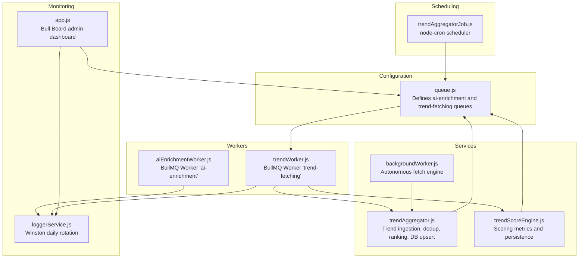
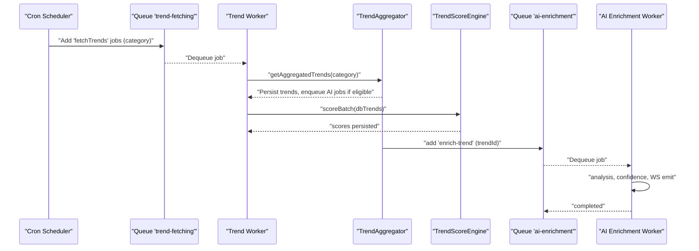
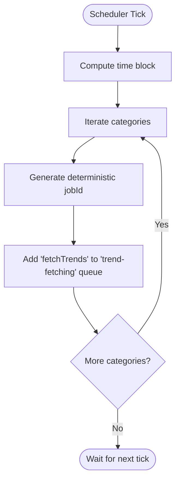
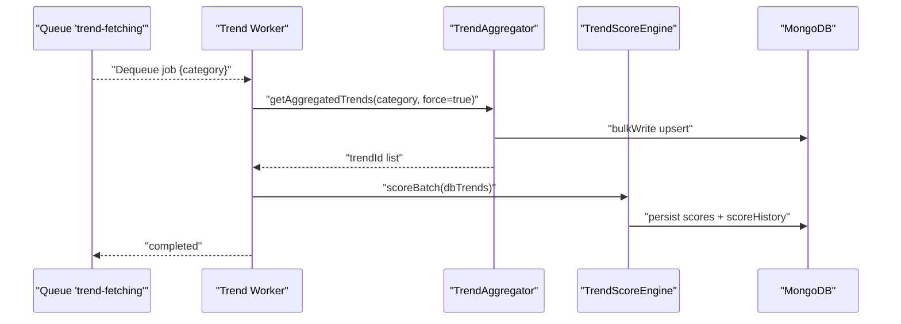
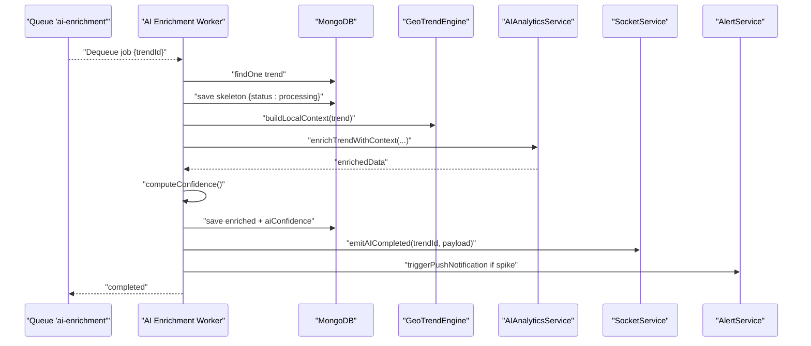
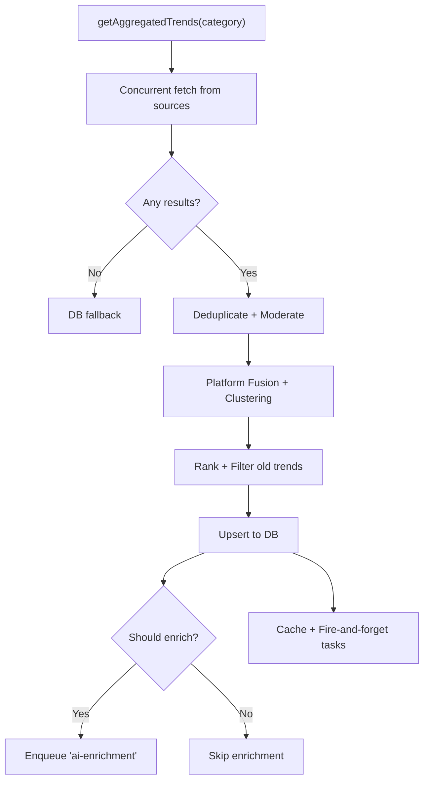
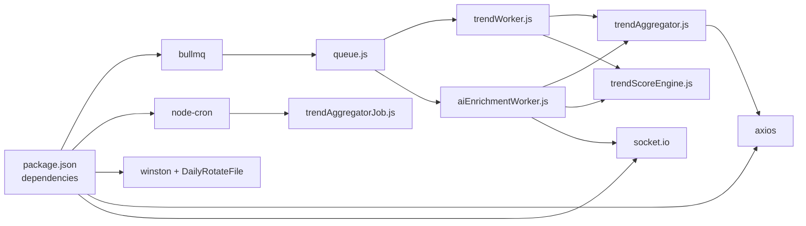

# Job Scheduling Pipeline

<cite>
**Referenced Files in This Document**
- [app.js](file://backend/src/app.js)
- [queue.js](file://backend/src/config/queue.js)
- [trendAggregatorJob.js](file://backend/src/jobs/trendAggregatorJob.js)
- [trendWorker.js](file://backend/src/queues/workers/trendWorker.js)
- [aiEnrichmentWorker.js](file://backend/src/queues/workers/aiEnrichmentWorker.js)
- [backgroundWorker.js](file://backend/src/services/backgroundWorker.js)
- [trendAggregator.js](file://backend/src/services/trendAggregator.js)
- [trendScoreEngine.js](file://backend/src/services/trendScoreEngine.js)
- [loggerService.js](file://backend/src/services/loggerService.js)
- [package.json](file://backend/package.json)
</cite>

## Table of Contents
1. [Introduction](#introduction)
2. [Project Structure](#project-structure)
3. [Core Components](#core-components)
4. [Architecture Overview](#architecture-overview)
5. [Detailed Component Analysis](#detailed-component-analysis)
6. [Dependency Analysis](#dependency-analysis)
7. [Performance Considerations](#performance-considerations)
8. [Troubleshooting Guide](#troubleshooting-guide)
9. [Conclusion](#conclusion)

## Introduction
This document explains AITrendTracker’s job scheduling and pipeline management system. It covers how jobs are created, scheduled, prioritized, and executed; how dependencies and batching are handled; lifecycle stages and state transitions; validation and safety checks; monitoring and reporting; cancellation and resumption; performance optimization and resource management; and auditing and debugging. The system leverages BullMQ queues for asynchronous job processing, cron-based periodic triggers, and a layered worker architecture to orchestrate trend ingestion, scoring, enrichment, alerts, and analytics.

## Project Structure
The job pipeline spans configuration, scheduling, workers, and supporting services:
- Configuration defines queues and default job options.
- Cron-based job creates periodic work items.
- Workers consume queues and execute tasks.
- Services implement business logic and integrate with external systems.
- Logging and monitoring provide observability.

**Diagram sources**
- [queue.js:1-32](file://backend/src/config/queue.js#L1-L32)
- [trendAggregatorJob.js:1-28](file://backend/src/jobs/trendAggregatorJob.js#L1-L28)
- [trendWorker.js:1-53](file://backend/src/queues/workers/trendWorker.js#L1-L53)
- [aiEnrichmentWorker.js:1-176](file://backend/src/queues/workers/aiEnrichmentWorker.js#L1-L176)
- [trendAggregator.js:1-449](file://backend/src/services/trendAggregator.js#L1-L449)
- [trendScoreEngine.js:1-231](file://backend/src/services/trendScoreEngine.js#L1-L231)
- [backgroundWorker.js:1-36](file://backend/src/services/backgroundWorker.js#L1-L36)
- [app.js:33-57](file://backend/src/app.js#L33-L57)
- [loggerService.js:1-43](file://backend/src/services/loggerService.js#L1-L43)

**Section sources**
- [queue.js:1-32](file://backend/src/config/queue.js#L1-L32)
- [trendAggregatorJob.js:1-28](file://backend/src/jobs/trendAggregatorJob.js#L1-L28)
- [trendWorker.js:1-53](file://backend/src/queues/workers/trendWorker.js#L1-L53)
- [aiEnrichmentWorker.js:1-176](file://backend/src/queues/workers/aiEnrichmentWorker.js#L1-L176)
- [trendAggregator.js:1-449](file://backend/src/services/trendAggregator.js#L1-L449)
- [trendScoreEngine.js:1-231](file://backend/src/services/trendScoreEngine.js#L1-L231)
- [backgroundWorker.js:1-36](file://backend/src/services/backgroundWorker.js#L1-L36)
- [app.js:33-57](file://backend/src/app.js#L33-L57)
- [loggerService.js:1-43](file://backend/src/services/loggerService.js#L1-L43)

## Core Components
- Queues: Two dedicated queues manage distinct workloads:
  - ai-enrichment: AI enrichment jobs triggered after scoring.
  - trend-fetching: Trend ingestion and initial processing.
- Workers: Isolated BullMQ workers process jobs with controlled concurrency and robust error handling.
- Scheduler: Cron-based periodic job dispatches trend fetching across categories.
- Background Engine: Autonomous fetch engine complements scheduled runs.
- Scoring Engine: Computes normalized metrics and persists history.
- Monitoring: Bull Board admin UI and Winston-based structured logging.

**Section sources**
- [queue.js:1-32](file://backend/src/config/queue.js#L1-L32)
- [trendWorker.js:17-46](file://backend/src/queues/workers/trendWorker.js#L17-L46)
- [aiEnrichmentWorker.js:24-129](file://backend/src/queues/workers/aiEnrichmentWorker.js#L24-L129)
- [trendAggregatorJob.js:11-25](file://backend/src/jobs/trendAggregatorJob.js#L11-L25)
- [backgroundWorker.js:4-18](file://backend/src/services/backgroundWorker.js#L4-L18)
- [trendScoreEngine.js:102-216](file://backend/src/services/trendScoreEngine.js#L102-L216)
- [app.js:33-57](file://backend/src/app.js#L33-L57)
- [loggerService.js:11-40](file://backend/src/services/loggerService.js#L11-L40)

## Architecture Overview
The pipeline orchestrates ingestion, scoring, enrichment, and downstream actions:
- Cron triggers periodic trend fetching.
- Trend worker ingests, normalizes, deduplicates, and upserts trends; then scores them.
- Scoring results trigger AI enrichment jobs.
- AI worker enriches content, computes confidence, emits live updates, and triggers alerts.
- Monitoring dashboards and logs provide visibility.

**Diagram sources**
- [trendAggregatorJob.js:11-25](file://backend/src/jobs/trendAggregatorJob.js#L11-L25)
- [queue.js:5-26](file://backend/src/config/queue.js#L5-L26)
- [trendWorker.js:17-46](file://backend/src/queues/workers/trendWorker.js#L17-L46)
- [trendAggregator.js:116-143](file://backend/src/services/trendAggregator.js#L116-L143)
- [trendScoreEngine.js:102-216](file://backend/src/services/trendScoreEngine.js#L102-L216)
- [aiEnrichmentWorker.js:24-129](file://backend/src/queues/workers/aiEnrichmentWorker.js#L24-L129)

## Detailed Component Analysis

### Queue Configuration and Defaults
- ai-enrichment queue:
  - Retries with exponential backoff.
  - Cleans completed/failed jobs to limit Redis footprint.
- trend-fetching queue:
  - Fixed backoff retries.
  - Strict cleanup policy for operational hygiene.

Operational implications:
- Jobs are resilient to transient failures.
- Long-term debugging is supported via retained failed jobs.
- Redis memory remains bounded.

**Section sources**
- [queue.js:5-16](file://backend/src/config/queue.js#L5-L16)
- [queue.js:18-26](file://backend/src/config/queue.js#L18-L26)

### Cron-Based Scheduling
- Periodic trigger runs every 5 minutes.
- For each category, a deterministic job ID is generated to prevent duplicates.
- Each job enqueues a “fetchTrends” task with category data.

**Diagram sources**
- [trendAggregatorJob.js:11-25](file://backend/src/jobs/trendAggregatorJob.js#L11-L25)

**Section sources**
- [trendAggregatorJob.js:11-25](file://backend/src/jobs/trendAggregatorJob.js#L11-L25)

### Trend Fetching Worker
Responsibilities:
- Fetch and normalize trends for a category.
- Upsert into database.
- Invoke scoring engine on newly ingested items.
- Log outcomes and propagate errors.

Concurrency and safety:
- Concurrency set to 1 to respect API rate limits.
- Robust error logging and propagation to BullMQ retry logic.

**Diagram sources**
- [trendWorker.js:17-46](file://backend/src/queues/workers/trendWorker.js#L17-L46)
- [trendAggregator.js:116-143](file://backend/src/services/trendAggregator.js#L116-L143)
- [trendScoreEngine.js:102-216](file://backend/src/services/trendScoreEngine.js#L102-L216)

**Section sources**
- [trendWorker.js:17-46](file://backend/src/queues/workers/trendWorker.js#L17-L46)

### AI Enrichment Worker
Responsibilities:
- Load trend by ID, guard against duplicates, and initialize analysis skeleton.
- Build scoring and geographic context.
- Call LLM enrichment service.
- Persist enriched analysis and compute AI confidence.
- Emit WebSocket events for live UI updates.
- Trigger smart alerts on spikes.
- Robust error handling and logging.

**Diagram sources**
- [aiEnrichmentWorker.js:24-129](file://backend/src/queues/workers/aiEnrichmentWorker.js#L24-L129)

**Section sources**
- [aiEnrichmentWorker.js:24-129](file://backend/src/queues/workers/aiEnrichmentWorker.js#L24-L129)

### Trend Aggregation and Enrichment Orchestration
- TrendAggregator:
  - Concurrent fetch from multiple sources with fault tolerance.
  - Deduplication, moderation, fusion, clustering, ranking, and filtering.
  - Upsert to DB and enqueue AI enrichment jobs conditionally.
  - Fire-and-forget analytics, predictions, and graph building.
- TrendScoreEngine:
  - Computes viral, heat, and growth scores with logarithmic normalization.
  - Persists composite score and compact score history.

**Diagram sources**
- [trendAggregator.js:21-173](file://backend/src/services/trendAggregator.js#L21-L173)
- [trendScoreEngine.js:102-216](file://backend/src/services/trendScoreEngine.js#L102-L216)

**Section sources**
- [trendAggregator.js:21-173](file://backend/src/services/trendAggregator.js#L21-L173)
- [trendScoreEngine.js:102-216](file://backend/src/services/trendScoreEngine.js#L102-L216)

### Background Autonomous Fetch Engine
- Starts shortly after server boot and repeats periodically.
- Calls aggregator to keep data fresh while respecting rate limits.

**Section sources**
- [backgroundWorker.js:4-18](file://backend/src/services/backgroundWorker.js#L4-L18)

### Monitoring and Admin Dashboard
- Bull Board exposes a secure admin UI for queue inspection.
- Authentication enforced via bearer token.
- Displays queue stats, job states, and retry history.

**Section sources**
- [app.js:33-57](file://backend/src/app.js#L33-L57)

### Logging and Auditing
- Winston daily-rotated JSON logs for structured observability.
- Error and combined log files rotated by date.
- Workers and services consistently log info/warn/error with contextual details.

**Section sources**
- [loggerService.js:11-40](file://backend/src/services/loggerService.js#L11-L40)
- [trendWorker.js:39-42](file://backend/src/queues/workers/trendWorker.js#L39-L42)
- [aiEnrichmentWorker.js:117-125](file://backend/src/queues/workers/aiEnrichmentWorker.js#L117-L125)

## Dependency Analysis
External libraries and integrations:
- BullMQ: Queues and workers.
- node-cron: Periodic scheduling.
- Winston + DailyRotateFile: Structured logging.
- Redis: Queue transport and cache.
- Axios: HTTP client for external APIs.
- Socket.IO: Live UI updates.

**Diagram sources**
- [package.json:14-38](file://backend/package.json#L14-L38)
- [queue.js:1-32](file://backend/src/config/queue.js#L1-L32)
- [trendAggregatorJob.js:1-28](file://backend/src/jobs/trendAggregatorJob.js#L1-L28)
- [trendWorker.js:1-53](file://backend/src/queues/workers/trendWorker.js#L1-L53)
- [aiEnrichmentWorker.js:1-176](file://backend/src/queues/workers/aiEnrichmentWorker.js#L1-L176)
- [trendAggregator.js:1-449](file://backend/src/services/trendAggregator.js#L1-L449)
- [trendScoreEngine.js:1-231](file://backend/src/services/trendScoreEngine.js#L1-L231)

**Section sources**
- [package.json:14-38](file://backend/package.json#L14-L38)

## Performance Considerations
- Concurrency control:
  - Trend worker concurrency 1 to respect API rate limits.
  - AI worker concurrency 3 to balance throughput and cost.
- Backoff strategies:
  - Exponential backoff for AI enrichment to handle transient failures.
  - Fixed backoff for trend fetching to stabilize retries.
- Cleanup policies:
  - Automatic removal of completed and limited retention of failed jobs reduce Redis overhead.
- Caching:
  - TrendAggregator caches results for short durations to reduce repeated API calls.
- Asynchronous fire-and-forget tasks:
  - Analytics snapshots, predictions, and graph builds avoid blocking primary flows.
- Rate limiting:
  - Background engine intervals mitigate upstream rate limits.

[No sources needed since this section provides general guidance]

## Troubleshooting Guide
Common scenarios and remedies:
- Jobs stuck in processing:
  - Verify worker connectivity to Redis and queue names.
  - Check Bull Board for stalled jobs and retry counts.
- Frequent retries:
  - Inspect logs for recurring errors and adjust backoff or timeouts.
  - Review external API responses and credentials.
- Duplicate jobs:
  - Confirm deterministic job IDs and cron scheduling cadence.
- Missing enrichment:
  - Ensure TrendAggregator upserts succeeded and AI eligibility conditions were met.
- Slow performance:
  - Reduce worker concurrency or stagger schedules.
  - Monitor Redis memory and queue depth.
- Logging and audits:
  - Use Winston daily-rotated files for structured log analysis.
  - Correlate timestamps and job IDs across services.

**Section sources**
- [trendWorker.js:48-50](file://backend/src/queues/workers/trendWorker.js#L48-L50)
- [aiEnrichmentWorker.js:171-173](file://backend/src/queues/workers/aiEnrichmentWorker.js#L171-L173)
- [loggerService.js:15-29](file://backend/src/services/loggerService.js#L15-L29)

## Conclusion
AITrendTracker’s job pipeline combines cron-driven scheduling, resilient queues, and specialized workers to deliver a robust, observable, and scalable trend processing system. The separation of concerns—ingestion, scoring, enrichment, and alerts—ensures maintainability and performance. With structured logging, admin dashboards, and conservative retry/backoff policies, the system balances reliability and cost-effectiveness while enabling real-time UI updates and actionable insights.