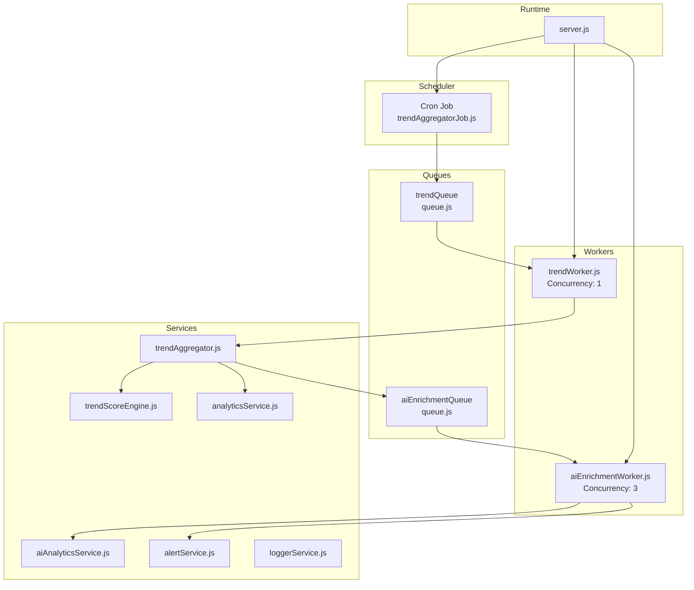
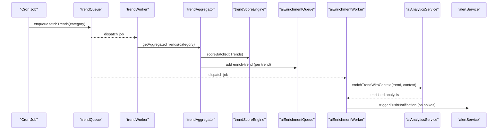
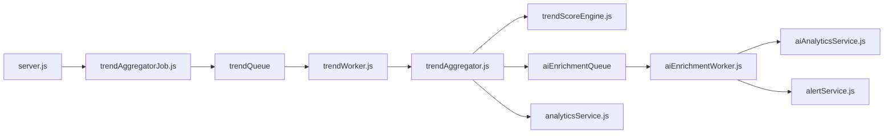

# Performance Monitoring & Metrics

<cite>
**Referenced Files in This Document**
- [server.js](file://backend/server.js)
- [queue.js](file://backend/src/config/queue.js)
- [trendAggregatorJob.js](file://backend/src/jobs/trendAggregatorJob.js)
- [aiEnrichmentWorker.js](file://backend/src/queues/workers/aiEnrichmentWorker.js)
- [trendWorker.js](file://backend/src/queues/workers/trendWorker.js)
- [trendAggregator.js](file://backend/src/services/trendAggregator.js)
- [trendScoreEngine.js](file://backend/src/services/trendScoreEngine.js)
- [analyticsService.js](file://backend/src/services/analyticsService.js)
- [alertService.js](file://backend/src/services/alertService.js)
- [loggerService.js](file://backend/src/services/loggerService.js)
- [aiAnalyticsService.js](file://backend/src/services/aiAnalyticsService.js)
- [package.json](file://backend/package.json)
</cite>

## Table of Contents
1. [Introduction](#introduction)
2. [Project Structure](#project-structure)
3. [Core Components](#core-components)
4. [Architecture Overview](#architecture-overview)
5. [Detailed Component Analysis](#detailed-component-analysis)
6. [Dependency Analysis](#dependency-analysis)
7. [Performance Considerations](#performance-considerations)
8. [Troubleshooting Guide](#troubleshooting-guide)
9. [Conclusion](#conclusion)
10. [Appendices](#appendices)

## Introduction
This document provides comprehensive guidance for performance monitoring and metrics collection in AITrendTracker’s background processing pipeline. It covers queue metrics, worker performance indicators, job execution statistics, alerting thresholds, error rate monitoring, failure analysis, recovery metrics, queue depth monitoring, job latency tracking, throughput measurements, bottleneck identification, resource utilization tracking, capacity planning, optimization techniques, scaling recommendations, and troubleshooting procedures. The focus is on the BullMQ-based background workers, cron-driven jobs, and supporting services that power trend ingestion, scoring, enrichment, and alerting.

## Project Structure
AITrendTracker’s backend orchestrates background processing through:
- Cron-based job scheduling that enqueues periodic work
- BullMQ queues for asynchronous processing
- Dedicated workers that process jobs with concurrency controls
- Services that implement scoring, enrichment, analytics, and alerting
- Logging and transport configuration for observability

**Diagram sources**
- [server.js:30-37](file://backend/server.js#L30-L37)
- [trendAggregatorJob.js:11-25](file://backend/src/jobs/trendAggregatorJob.js#L11-L25)
- [queue.js:5-26](file://backend/src/config/queue.js#L5-L26)
- [trendWorker.js:17-46](file://backend/src/queues/workers/trendWorker.js#L17-L46)
- [aiEnrichmentWorker.js:24-129](file://backend/src/queues/workers/aiEnrichmentWorker.js#L24-L129)
- [trendAggregator.js:116-143](file://backend/src/services/trendAggregator.js#L116-L143)
- [trendScoreEngine.js:102-216](file://backend/src/services/trendScoreEngine.js#L102-L216)
- [analyticsService.js:8-44](file://backend/src/services/analyticsService.js#L8-L44)
- [alertService.js:136-172](file://backend/src/services/alertService.js#L136-L172)
- [loggerService.js:11-40](file://backend/src/services/loggerService.js#L11-L40)

**Section sources**
- [server.js:30-37](file://backend/server.js#L30-L37)
- [trendAggregatorJob.js:11-25](file://backend/src/jobs/trendAggregatorJob.js#L11-L25)
- [queue.js:5-26](file://backend/src/config/queue.js#L5-L26)

## Core Components
- Background job scheduler: Periodic cron job enqueues category-specific fetch jobs to the trend queue.
- Queues: Two queues are configured—trend-fetching and ai-enrichment—with default job options controlling retries, backoff, and retention.
- Workers: trendWorker runs at concurrency 1 to respect external API rate limits; aiEnrichmentWorker runs at concurrency 3 for parallel LLM processing.
- Services:
  - trendAggregator: Orchestrates fetching, deduplication, fusion, clustering, ranking, persistence, enrichment queuing, alerting, and analytics snapshotting.
  - trendScoreEngine: Computes viral, heat, growth, and composite scores; persists scoreHistory; supports velocity delta computation.
  - aiAnalyticsService: Calls LLMs with structured prompts, validates JSON, and falls back deterministically.
  - alertService: Generates smart alerts, throttles FCM pushes, emits WebSocket events, and stores notifications.
  - analyticsService: Stores trend snapshots and computes analytics payloads for UI.
  - loggerService: Centralized logging with rotating files and console transport.

**Section sources**
- [trendAggregatorJob.js:11-25](file://backend/src/jobs/trendAggregatorJob.js#L11-L25)
- [queue.js:5-26](file://backend/src/config/queue.js#L5-L26)
- [trendWorker.js:17-46](file://backend/src/queues/workers/trendWorker.js#L17-L46)
- [aiEnrichmentWorker.js:24-129](file://backend/src/queues/workers/aiEnrichmentWorker.js#L24-L129)
- [trendAggregator.js:116-143](file://backend/src/services/trendAggregator.js#L116-L143)
- [trendScoreEngine.js:102-216](file://backend/src/services/trendScoreEngine.js#L102-L216)
- [aiAnalyticsService.js:29-56](file://backend/src/services/aiAnalyticsService.js#L29-L56)
- [alertService.js:136-172](file://backend/src/services/alertService.js#L136-L172)
- [analyticsService.js:8-44](file://backend/src/services/analyticsService.js#L8-L44)
- [loggerService.js:11-40](file://backend/src/services/loggerService.js#L11-L40)

## Architecture Overview
The system follows a producer-consumer pattern:
- Scheduler enqueues jobs to the trend queue.
- trendWorker fetches, normalizes, ranks, persists, and triggers enrichment by adding jobs to the ai-enrichment queue.
- aiEnrichmentWorker enriches trends with LLMs, computes confidence, updates DB, emits WebSocket events, and triggers alerts on spikes.
- Supporting services handle analytics snapshots, alert throttling, and logging.

**Diagram sources**
- [trendAggregatorJob.js:11-25](file://backend/src/jobs/trendAggregatorJob.js#L11-L25)
- [queue.js:5-26](file://backend/src/config/queue.js#L5-L26)
- [trendWorker.js:17-46](file://backend/src/queues/workers/trendWorker.js#L17-L46)
- [trendAggregator.js:116-143](file://backend/src/services/trendAggregator.js#L116-L143)
- [trendScoreEngine.js:102-216](file://backend/src/services/trendScoreEngine.js#L102-L216)
- [aiEnrichmentWorker.js:24-129](file://backend/src/queues/workers/aiEnrichmentWorker.js#L24-L129)
- [aiAnalyticsService.js:29-56](file://backend/src/services/aiAnalyticsService.js#L29-L56)
- [alertService.js:136-172](file://backend/src/services/alertService.js#L136-L172)

## Detailed Component Analysis

### Queue Configuration and Metrics
- Queues:
  - trend-fetching: default attempts 2, fixed 5s backoff, removeOnComplete true, removeOnFail 100.
  - ai-enrichment: default attempts 3, exponential backoff starting at 10s, removeOnComplete true, removeOnFail 100.
- Metrics to track:
  - Queue length (depth) for both queues
  - Job processing time per worker
  - Retry counts and backoff behavior
  - Completed vs failed job rates
  - Age of oldest job in queue

Implementation pointers:
- Use BullMQ’s built-in metrics and queue stats via the library’s queue and worker APIs.
- Monitor Redis-backed queue sizes and job state transitions.

**Section sources**
- [queue.js:5-26](file://backend/src/config/queue.js#L5-L26)

### Worker Performance Indicators
- trendWorker:
  - Concurrency: 1 to respect external API rate limits.
  - Performance focus: minimize external API latency impact; ensure timely scoring and enrichment queuing.
- aiEnrichmentWorker:
  - Concurrency: 3 to parallelize LLM calls while bounding resource usage.
  - Performance focus: monitor LLM latency, validation overhead, and DB persistence costs.

Implementation pointers:
- Add worker event listeners for completed and failed events to emit metrics.
- Track per-job processing duration and correlate with queue depth.

**Section sources**
- [trendWorker.js:17-46](file://backend/src/queues/workers/trendWorker.js#L17-L46)
- [aiEnrichmentWorker.js:24-129](file://backend/src/queues/workers/aiEnrichmentWorker.js#L24-L129)

### Job Execution Statistics
- trendWorker:
  - Measures: number of categories processed, batch size, DB upserts, scoring operations, and errors.
- aiEnrichmentWorker:
  - Measures: number of enrichment jobs, success/failure counts, confidence computation time, and alert triggers.

Implementation pointers:
- Use worker event handlers to capture job lifecycle metrics.
- Record timestamps around DB writes and LLM calls for latency breakdowns.

**Section sources**
- [trendWorker.js:17-46](file://backend/src/queues/workers/trendWorker.js#L17-L46)
- [aiEnrichmentWorker.js:24-129](file://backend/src/queues/workers/aiEnrichmentWorker.js#L24-L129)

### Monitoring Dashboard Implementation
- Recommended dashboards:
  - Queue depth (trend-fetching, ai-enrichment)
  - Worker throughput (jobs/sec)
  - Job latency percentiles (p50, p95, p99)
  - Error rate and failure reasons
  - LLM call success rate and latency
  - Alert volume and FCM throttled events
- Data sources:
  - BullMQ queue stats and worker events
  - LoggerService for structured logs
  - alertService for alert counters and throttling metrics

Implementation pointers:
- Expose Prometheus-style metrics or integrate with a dashboarding tool using queue stats and worker events.
- Aggregate logs by service and level for error dashboards.

**Section sources**
- [queue.js:5-26](file://backend/src/config/queue.js#L5-L26)
- [loggerService.js:11-40](file://backend/src/services/loggerService.js#L11-L40)
- [alertService.js:136-172](file://backend/src/services/alertService.js#L136-L172)

### Alerting Mechanisms and Threshold Configurations
- Velocity spike detection:
  - aiEnrichmentWorker triggers alerts when viralityScore exceeds a threshold or growthMomentum equals rapid, or velocityDelta exceeds 50%.
- FCM throttling:
  - Maximum 3 pushes per device per 2-hour rolling window enforced by cacheService.
- Thresholds:
  - Viral spike: viralityScore > 8 or growthMomentum == rapid or velocityDelta > 50%
  - FCM: 3 pushes per 7200 seconds per device token

Implementation pointers:
- Use alertService methods to evaluate and emit alerts.
- Track throttled events to tune thresholds.

**Section sources**
- [aiEnrichmentWorker.js:110-113](file://backend/src/queues/workers/aiEnrichmentWorker.js#L110-L113)
- [alertService.js:17-19](file://backend/src/services/alertService.js#L17-L19)

### Error Rate Monitoring and Failure Analysis
- Error sources:
  - External API fetch failures (NewsAPI, Reddit, GNews, YouTube)
  - LLM parsing/validation failures
  - Database write errors
  - Redis connectivity issues
- Logging:
  - Centralized Winston logger with rotating files and console transport.
- Recovery metrics:
  - BullMQ retry/backoff behavior
  - DB fallback when all APIs fail
  - Deterministic LLM fallback

Implementation pointers:
- Monitor error logs and job failures; correlate with external API health.
- Track retry counts and backoff delays to assess resilience.

**Section sources**
- [trendAggregator.js:40-54](file://backend/src/services/trendAggregator.js#L40-L54)
- [aiAnalyticsService.js:38-55](file://backend/src/services/aiAnalyticsService.js#L38-L55)
- [loggerService.js:11-40](file://backend/src/services/loggerService.js#L11-L40)

### Resource Utilization Tracking
- CPU and memory:
  - Monitor Node.js process metrics externally (e.g., OS-level or container metrics).
- I/O:
  - Track Redis and MongoDB latencies; watch for slow queries and connection pool saturation.
- External APIs:
  - Measure request durations and error rates for NewsAPI, Reddit, GNews, YouTube.

Implementation pointers:
- Use system monitoring tools and database profiling.
- Instrument key service methods to record timing and error rates.

**Section sources**
- [trendAggregator.js:178-210](file://backend/src/services/trendAggregator.js#L178-L210)
- [aiAnalyticsService.js:63-96](file://backend/src/services/aiAnalyticsService.js#L63-L96)

### Capacity Planning Approaches
- Queue depth targets:
  - Maintain low queue depth under normal load; allow small backlog during bursts.
- Worker concurrency:
  - trendWorker: keep at 1 to respect API rate limits.
  - aiEnrichmentWorker: scale from 3 based on LLM latency and DB write capacity.
- Retention policies:
  - removeOnComplete true and limited removeOnFail keep Redis tidy.
- Scaling levers:
  - Increase worker concurrency gradually while monitoring error rates.
  - Add more instances behind a load balancer.
  - Tune queue backoff and retry policies.

**Section sources**
- [queue.js:7-14](file://backend/src/config/queue.js#L7-L14)
- [trendWorker.js:44-45](file://backend/src/queues/workers/trendWorker.js#L44-L45)
- [aiEnrichmentWorker.js:126-129](file://backend/src/queues/workers/aiEnrichmentWorker.js#L126-L129)

### Queue Depth Monitoring and Throughput Measurements
- Queue depth:
  - Use BullMQ queue stats to measure jobs in active, delayed, waiting, failed, completed.
- Throughput:
  - Jobs completed per second; jobs failed per second.
- Latency:
  - Job processing time; queue age of oldest job.

Implementation pointers:
- Expose metrics endpoints or export to monitoring systems.
- Correlate queue depth with worker concurrency and external API availability.

**Section sources**
- [queue.js:5-26](file://backend/src/config/queue.js#L5-L26)

### Performance Bottleneck Identification
- Trend ingestion:
  - External API timeouts and failures dominate latency; deduplication and moderation add overhead.
- Scoring:
  - Log-normalization and bulk writes are CPU-bound; ensure adequate DB indexing.
- Enrichment:
  - LLM calls are the primary bottleneck; validation and fallback logic add minimal overhead.
- Alerts:
  - FCM throttling and WebSocket emissions are I/O bound.

Implementation pointers:
- Use timing instrumentation around each stage to isolate bottlenecks.
- Adjust concurrency and retry policies based on observed bottlenecks.

**Section sources**
- [trendAggregator.js:40-54](file://backend/src/services/trendAggregator.js#L40-L54)
- [trendScoreEngine.js:102-216](file://backend/src/services/trendScoreEngine.js#L102-L216)
- [aiAnalyticsService.js:29-56](file://backend/src/services/aiAnalyticsService.js#L29-L56)
- [alertService.js:136-172](file://backend/src/services/alertService.js#L136-L172)

### Performance Optimization Techniques
- Reduce external API latency:
  - Increase timeouts cautiously; leverage caching and fallbacks.
- Optimize scoring:
  - Batch operations and efficient log-normalization.
- Enrichment:
  - Use deterministic fallback to reduce LLM dependency.
  - Validate and coerce partial results to minimize rejections.
- Queue tuning:
  - Adjust attempts and backoff to balance reliability and queue depth.
- Worker scaling:
  - Scale aiEnrichmentWorker based on LLM provider capacity and DB write throughput.

**Section sources**
- [trendAggregator.js:116-143](file://backend/src/services/trendAggregator.js#L116-L143)
- [aiAnalyticsService.js:54-56](file://backend/src/services/aiAnalyticsService.js#L54-L56)
- [queue.js:7-14](file://backend/src/config/queue.js#L7-L14)
- [aiEnrichmentWorker.js:126-129](file://backend/src/queues/workers/aiEnrichmentWorker.js#L126-L129)

### Scaling Recommendations
- Horizontal scaling:
  - Run multiple worker instances behind a shared Redis queue.
- Vertical scaling:
  - Increase concurrency for aiEnrichmentWorker; ensure DB and Redis can handle increased load.
- Asynchronous processing:
  - Offload analytics and alerting to fire-and-forget tasks to avoid blocking responses.

**Section sources**
- [trendWorker.js:44-45](file://backend/src/queues/workers/trendWorker.js#L44-L45)
- [aiEnrichmentWorker.js:126-129](file://backend/src/queues/workers/aiEnrichmentWorker.js#L126-L129)

### Monitoring Configuration and Metric Interpretation
- Logging:
  - Use loggerService for structured logs; configure log rotation and levels.
- Metrics:
  - Collect queue depth, throughput, latency, error rates, and alert volumes.
- Interpretation:
  - Rising queue depth indicates backlog; increasing error rates indicate instability.
  - High LLM latency correlates with enrichment delays; throttled alerts suggest client-side limits.

**Section sources**
- [loggerService.js:11-40](file://backend/src/services/loggerService.js#L11-L40)
- [queue.js:5-26](file://backend/src/config/queue.js#L5-L26)
- [alertService.js:177-198](file://backend/src/services/alertService.js#L177-L198)

## Dependency Analysis
The background processing pipeline depends on BullMQ queues and workers, external APIs, and internal services. Dependencies are primarily runtime and operational rather than compile-time.

**Diagram sources**
- [server.js:30-37](file://backend/server.js#L30-L37)
- [trendAggregatorJob.js:11-25](file://backend/src/jobs/trendAggregatorJob.js#L11-L25)
- [queue.js:5-26](file://backend/src/config/queue.js#L5-L26)
- [trendWorker.js:17-46](file://backend/src/queues/workers/trendWorker.js#L17-L46)
- [aiEnrichmentWorker.js:24-129](file://backend/src/queues/workers/aiEnrichmentWorker.js#L24-L129)
- [trendAggregator.js:116-143](file://backend/src/services/trendAggregator.js#L116-L143)
- [trendScoreEngine.js:102-216](file://backend/src/services/trendScoreEngine.js#L102-L216)
- [aiAnalyticsService.js:29-56](file://backend/src/services/aiAnalyticsService.js#L29-L56)
- [alertService.js:136-172](file://backend/src/services/alertService.js#L136-L172)
- [analyticsService.js:8-44](file://backend/src/services/analyticsService.js#L8-L44)

**Section sources**
- [server.js:30-37](file://backend/server.js#L30-L37)
- [package.json:14-38](file://backend/package.json#L14-L38)

## Performance Considerations
- External API timeouts and failures are the dominant latency factor; instrument and cache aggressively.
- LLM calls are expensive; use deterministic fallbacks and validation to improve reliability.
- Keep Redis and MongoDB optimized; monitor slow queries and connection pools.
- Tune queue backoff and retry policies to balance reliability and queue depth.

[No sources needed since this section provides general guidance]

## Troubleshooting Guide
- Symptoms: rising queue depth, increased error logs, degraded UI responsiveness
  - Actions: inspect worker logs, review queue stats, verify external API health, adjust worker concurrency
- Symptoms: frequent LLM validation failures
  - Actions: check prompt construction, validate schema, enable fallbacks, monitor provider quotas
- Symptoms: throttled alerts
  - Actions: review FCM throttle configuration, reduce alert frequency, increase throttle window if appropriate
- Symptoms: slow scoring or enrichment
  - Actions: profile DB writes, optimize bulk operations, consider worker scaling

**Section sources**
- [loggerService.js:11-40](file://backend/src/services/loggerService.js#L11-L40)
- [aiAnalyticsService.js:85-96](file://backend/src/services/aiAnalyticsService.js#L85-L96)
- [alertService.js:177-198](file://backend/src/services/alertService.js#L177-L198)
- [trendScoreEngine.js:205-213](file://backend/src/services/trendScoreEngine.js#L205-L213)

## Conclusion
AITrendTracker’s background processing relies on a robust queue-based architecture with dedicated workers and resilient services. Effective monitoring requires tracking queue depth, worker throughput, job latency, error rates, and alert volumes. Tuning concurrency, optimizing LLM usage, and maintaining healthy queue depths are essential for performance and scalability. Use the provided implementation pointers to instrument and visualize metrics, and apply the troubleshooting steps to diagnose and resolve issues quickly.

[No sources needed since this section summarizes without analyzing specific files]

## Appendices

### Appendix A: Key Metrics Inventory
- Queue metrics: depth, age of oldest job, completed/sec, failed/sec
- Worker metrics: throughput, processing time, concurrency utilization
- Job metrics: latency percentiles, retry counts, backoff behavior
- Error metrics: error rate, failure reasons, retry outcomes
- Alert metrics: alert volume, FCM throttled events, delivery success
- LLM metrics: call success rate, latency, validation pass/fail
- Analytics metrics: snapshot count, retrieval latency

[No sources needed since this section provides general guidance]