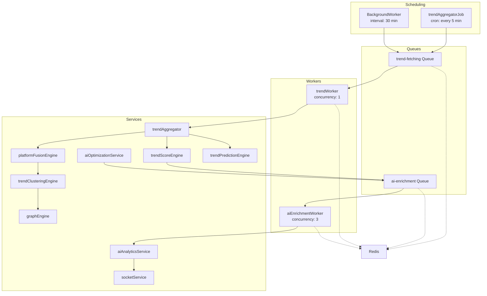
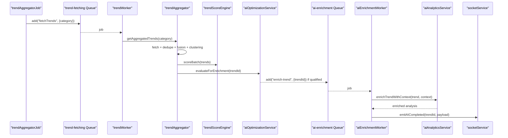
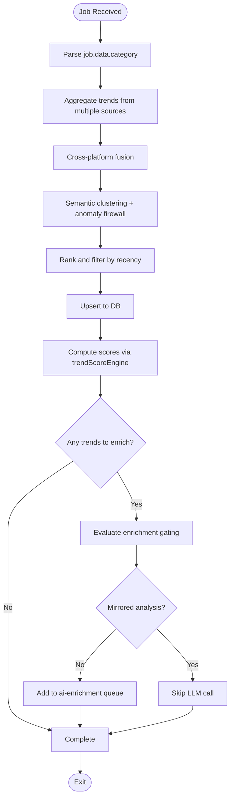
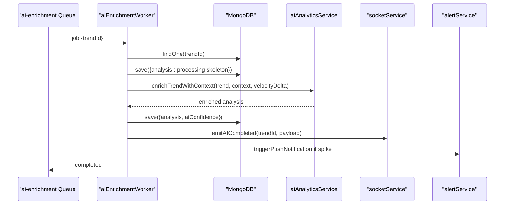
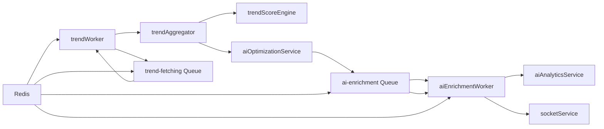

# Worker Implementations

<cite>
**Referenced Files in This Document**
- [trendWorker.js](file://backend/src/queues/workers/trendWorker.js)
- [aiEnrichmentWorker.js](file://backend/src/queues/workers/aiEnrichmentWorker.js)
- [backgroundWorker.js](file://backend/src/services/backgroundWorker.js)
- [queue.js](file://backend/src/config/queue.js)
- [trendAggregatorJob.js](file://backend/src/jobs/trendAggregatorJob.js)
- [redis.js](file://backend/src/config/redis.js)
- [trendAggregator.js](file://backend/src/services/trendAggregator.js)
- [trendScoreEngine.js](file://backend/src/services/trendScoreEngine.js)
- [aiAnalyticsService.js](file://backend/src/services/aiAnalyticsService.js)
- [socketService.js](file://backend/src/services/socketService.js)
- [aiOptimizationService.js](file://backend/src/services/aiOptimizationService.js)
- [platformFusionEngine.js](file://backend/src/services/platformFusionEngine.js)
- [trendClusteringEngine.js](file://backend/src/services/trendClusteringEngine.js)
- [graphEngine.js](file://backend/src/services/graphEngine.js)
- [trendPredictionEngine.js](file://backend/src/services/trendPredictionEngine.js)
</cite>

## Table of Contents
1. [Introduction](#introduction)
2. [Project Structure](#project-structure)
3. [Core Components](#core-components)
4. [Architecture Overview](#architecture-overview)
5. [Detailed Component Analysis](#detailed-component-analysis)
6. [Dependency Analysis](#dependency-analysis)
7. [Performance Considerations](#performance-considerations)
8. [Troubleshooting Guide](#troubleshooting-guide)
9. [Conclusion](#conclusion)
10. [Appendices](#appendices)

## Introduction
This document explains the worker implementations and execution patterns powering AITrendTracker’s background processing. It covers worker registration, lifecycle management, concurrency control, job processing logic, error handling and retry policies, scaling and resource allocation, load balancing, monitoring and health checks, security and authorization, debugging and logging, and practical guidance for extending and optimizing workers.

## Project Structure
Workers are implemented as BullMQ workers backed by Redis. Jobs are enqueued by cron-based triggers and background services, then processed asynchronously by dedicated workers. Supporting services handle enrichment, scoring, clustering, prediction, and real-time updates.

**Diagram sources**
- [trendWorker.js:17-52](file://backend/src/queues/workers/trendWorker.js#L17-L52)
- [aiEnrichmentWorker.js:24-129](file://backend/src/queues/workers/aiEnrichmentWorker.js#L24-L129)
- [queue.js:4-31](file://backend/src/config/queue.js#L4-L31)
- [trendAggregatorJob.js:12-25](file://backend/src/jobs/trendAggregatorJob.js#L12-L25)
- [backgroundWorker.js:4-18](file://backend/src/services/backgroundWorker.js#L4-L18)
- [redis.js:4-8](file://backend/src/config/redis.js#L4-L8)
- [trendAggregator.js:116-143](file://backend/src/services/trendAggregator.js#L116-L143)
- [trendScoreEngine.js:102-216](file://backend/src/services/trendScoreEngine.js#L102-L216)
- [aiAnalyticsService.js:29-96](file://backend/src/services/aiAnalyticsService.js#L29-L96)
- [socketService.js:20-55](file://backend/src/services/socketService.js#L20-L55)
- [aiOptimizationService.js:21-47](file://backend/src/services/aiOptimizationService.js#L21-L47)
- [platformFusionEngine.js:84-152](file://backend/src/services/platformFusionEngine.js#L84-L152)
- [trendClusteringEngine.js:372-399](file://backend/src/services/trendClusteringEngine.js#L372-L399)
- [graphEngine.js:73-141](file://backend/src/services/graphEngine.js#L73-L141)
- [trendPredictionEngine.js:546-561](file://backend/src/services/trendPredictionEngine.js#L546-L561)

**Section sources**
- [trendWorker.js:1-53](file://backend/src/queues/workers/trendWorker.js#L1-L53)
- [aiEnrichmentWorker.js:1-176](file://backend/src/queues/workers/aiEnrichmentWorker.js#L1-L176)
- [queue.js:1-32](file://backend/src/config/queue.js#L1-L32)
- [trendAggregatorJob.js:1-28](file://backend/src/jobs/trendAggregatorJob.js#L1-L28)
- [backgroundWorker.js:1-36](file://backend/src/services/backgroundWorker.js#L1-L36)
- [redis.js:1-19](file://backend/src/config/redis.js#L1-L19)

## Core Components
- Trend Fetching Worker: Asynchronous BullMQ worker that fetches, normalizes, deduplicates, and upserts trends, then triggers scoring and optional AI enrichment.
- AI Enrichment Worker: Processes AI enrichment jobs with concurrency control, robust error handling, and WebSocket updates.
- Queues and Defaults: Configures BullMQ queues with retry/backoff, completion/failure retention, and job options.
- Scheduling: Cron-based job creation and a background worker to periodically refresh data.
- Redis: Shared connection for workers and queues.
- Supporting Services: Aggregation, scoring, fusion, clustering, prediction, graph building, analytics, alerts, and WebSocket broadcasting.

**Section sources**
- [trendWorker.js:17-52](file://backend/src/queues/workers/trendWorker.js#L17-L52)
- [aiEnrichmentWorker.js:24-129](file://backend/src/queues/workers/aiEnrichmentWorker.js#L24-L129)
- [queue.js:4-31](file://backend/src/config/queue.js#L4-L31)
- [trendAggregatorJob.js:12-25](file://backend/src/jobs/trendAggregatorJob.js#L12-L25)
- [backgroundWorker.js:4-18](file://backend/src/services/backgroundWorker.js#L4-L18)
- [redis.js:4-8](file://backend/src/config/redis.js#L4-L8)

## Architecture Overview
Workers operate independently and communicate via Redis-backed BullMQ queues. The pipeline is:
- Scheduling enqueues jobs into the trend-fetching queue.
- Trend worker executes heavy API fetches, deduplication, fusion, clustering, scoring, and optional AI enrichment.
- Optional AI enrichment jobs are enqueued and processed by the AI worker with retries and WebSocket updates.
- Prediction, graph building, and analytics are fire-and-forget tasks triggered by the aggregator.

**Diagram sources**
- [trendAggregatorJob.js:12-25](file://backend/src/jobs/trendAggregatorJob.js#L12-L25)
- [trendWorker.js:17-46](file://backend/src/queues/workers/trendWorker.js#L17-L46)
- [trendAggregator.js:116-143](file://backend/src/services/trendAggregator.js#L116-L143)
- [trendScoreEngine.js:102-216](file://backend/src/services/trendScoreEngine.js#L102-L216)
- [aiOptimizationService.js:21-47](file://backend/src/services/aiOptimizationService.js#L21-L47)
- [aiEnrichmentWorker.js:24-129](file://backend/src/queues/workers/aiEnrichmentWorker.js#L24-L129)
- [aiAnalyticsService.js:29-96](file://backend/src/services/aiAnalyticsService.js#L29-L96)
- [socketService.js:62-69](file://backend/src/services/socketService.js#L62-L69)

## Detailed Component Analysis

### Trend Fetching Worker
Responsibilities:
- Fetch and upsert trends per category.
- Compute scores and enqueue AI enrichment for qualifying trends.
- Respect API rate limits via concurrency 1.

Processing logic:
- Validates job data and logs progress.
- Executes aggregation, deduplication, fusion, clustering, ranking, filtering, and persistence.
- Triggers scoring and optional AI enrichment via optimization service.
- Emits errors to logs and rethrows to trigger BullMQ retry policy.

Concurrency and lifecycle:
- Concurrency set to 1 to avoid API throttling.
- Worker lifecycle events: initialization, failed handlers.

Error handling and retries:
- Throws on failure to activate BullMQ retry/backoff configured at queue level.

**Diagram sources**
- [trendWorker.js:17-46](file://backend/src/queues/workers/trendWorker.js#L17-L46)
- [trendAggregator.js:116-143](file://backend/src/services/trendAggregator.js#L116-L143)
- [trendScoreEngine.js:102-216](file://backend/src/services/trendScoreEngine.js#L102-L216)
- [aiOptimizationService.js:21-47](file://backend/src/services/aiOptimizationService.js#L21-L47)

**Section sources**
- [trendWorker.js:17-52](file://backend/src/queues/workers/trendWorker.js#L17-L52)

### AI Enrichment Worker
Responsibilities:
- Process ai-enrichment jobs with concurrency 3.
- Set temporary “processing” skeleton in DB.
- Build enriched context from scoring and geo metrics.
- Call LLM with structured prompts and validation.
- Compute AI confidence sub-object.
- Emit WebSocket events for live UI updates.
- Trigger smart alerts for spikes.

Processing logic:
- Loads trend, checks prior completion, writes processing skeleton.
- Builds scoring context and velocity delta from scoreHistory.
- Calls LLM with fallbacks and validation; coerces partial results.
- Persists analysis and confidence; emits WebSocket event.
- Triggers alerting for high virality or rapid growth.

Concurrency and lifecycle:
- Concurrency 3 for throughput while controlling LLM costs.
- Event handlers for completed and failed jobs.

Error handling and retries:
- On error, marks analysis as failed and rethrows to rely on queue-level backoff.

**Diagram sources**
- [aiEnrichmentWorker.js:24-129](file://backend/src/queues/workers/aiEnrichmentWorker.js#L24-L129)
- [aiAnalyticsService.js:29-96](file://backend/src/services/aiAnalyticsService.js#L29-L96)
- [socketService.js:62-69](file://backend/src/services/socketService.js#L62-L69)

**Section sources**
- [aiEnrichmentWorker.js:24-176](file://backend/src/queues/workers/aiEnrichmentWorker.js#L24-L176)

### Queue Configuration and Retry Policies
- trend-fetching queue: fixed backoff, limited attempts, cleanup options.
- ai-enrichment queue: exponential backoff, limited attempts, cleanup options.
- Default job options govern retries, backoff, and retention for debugging.

**Section sources**
- [queue.js:4-31](file://backend/src/config/queue.js#L4-L31)

### Scheduling and Background Fetching
- Cron-based job scheduler enqueues category-specific jobs every 5 minutes with deterministic job IDs to prevent duplicates.
- Background worker periodically triggers a forced refresh to keep data fresh while respecting rate limits.

**Section sources**
- [trendAggregatorJob.js:12-25](file://backend/src/jobs/trendAggregatorJob.js#L12-L25)
- [backgroundWorker.js:4-18](file://backend/src/services/backgroundWorker.js#L4-L18)

### Redis Connectivity
- Dedicated Redis connection used by workers and queues.
- Connection error and ready events logged.

**Section sources**
- [redis.js:4-18](file://backend/src/config/redis.js#L4-L18)

### Supporting Services Involved in Worker Pipelines
- trendAggregator: Multi-source fetch, deduplication, fusion, clustering, ranking, persistence, analytics, alerts, and predictions.
- trendScoreEngine: Batch scoring with time-decay, normalization, and history persistence.
- aiOptimizationService: Cost-gated enrichment and duplicate mirroring.
- platformFusionEngine: Cross-platform merging with keyword overlap.
- trendClusteringEngine: Semantic clustering and anomaly detection.
- graphEngine: Relationship graph construction.
- trendPredictionEngine: Lifecycle state, historical calibration, regional migration, and explainability.
- aiAnalyticsService: Structured prompting, LLM calls, validation, and fallbacks.
- socketService: WebSocket server with Redis adapter for horizontal scaling and targeted emissions.

**Section sources**
- [trendAggregator.js:116-143](file://backend/src/services/trendAggregator.js#L116-L143)
- [trendScoreEngine.js:102-216](file://backend/src/services/trendScoreEngine.js#L102-L216)
- [aiOptimizationService.js:21-116](file://backend/src/services/aiOptimizationService.js#L21-L116)
- [platformFusionEngine.js:84-201](file://backend/src/services/platformFusionEngine.js#L84-L201)
- [trendClusteringEngine.js:372-424](file://backend/src/services/trendClusteringEngine.js#L372-L424)
- [graphEngine.js:73-163](file://backend/src/services/graphEngine.js#L73-L163)
- [trendPredictionEngine.js:478-561](file://backend/src/services/trendPredictionEngine.js#L478-L561)
- [aiAnalyticsService.js:29-203](file://backend/src/services/aiAnalyticsService.js#L29-L203)
- [socketService.js:20-106](file://backend/src/services/socketService.js#L20-L106)

## Dependency Analysis
Workers depend on Redis-backed queues and shared services. The aggregator orchestrates pre-processing and gates enrichment. The AI worker depends on the analytics service and emits real-time updates.

**Diagram sources**
- [trendWorker.js:17-46](file://backend/src/queues/workers/trendWorker.js#L17-L46)
- [aiEnrichmentWorker.js:24-129](file://backend/src/queues/workers/aiEnrichmentWorker.js#L24-L129)
- [queue.js:4-31](file://backend/src/config/queue.js#L4-L31)
- [redis.js:4-8](file://backend/src/config/redis.js#L4-L8)
- [trendAggregator.js:116-143](file://backend/src/services/trendAggregator.js#L116-L143)
- [trendScoreEngine.js:102-216](file://backend/src/services/trendScoreEngine.js#L102-L216)
- [aiOptimizationService.js:21-47](file://backend/src/services/aiOptimizationService.js#L21-L47)
- [aiAnalyticsService.js:29-96](file://backend/src/services/aiAnalyticsService.js#L29-L96)
- [socketService.js:20-55](file://backend/src/services/socketService.js#L20-L55)

**Section sources**
- [trendWorker.js:17-52](file://backend/src/queues/workers/trendWorker.js#L17-L52)
- [aiEnrichmentWorker.js:24-176](file://backend/src/queues/workers/aiEnrichmentWorker.js#L24-L176)
- [queue.js:4-31](file://backend/src/config/queue.js#L4-L31)
- [redis.js:4-8](file://backend/src/config/redis.js#L4-L8)

## Performance Considerations
- Concurrency tuning:
  - trend-worker: concurrency 1 to respect API rate limits.
  - ai-enrichment worker: concurrency 3 to balance throughput and cost.
- Backoff strategies:
  - trend-fetching: fixed backoff delays.
  - ai-enrichment: exponential backoff to reduce LLM load.
- Job retention:
  - RemoveOnComplete and limited RemoveOnFail for diagnostics.
- Caching:
  - Trend aggregator caches results for short windows to reduce upstream API calls.
- Fire-and-forget tasks:
  - Graph building, predictions, and analytics avoid blocking the main pipeline.
- Redis adapter:
  - Socket.IO uses Redis adapter for multi-instance horizontal scaling.

[No sources needed since this section provides general guidance]

## Troubleshooting Guide
Common issues and remedies:
- Worker not processing:
  - Verify Redis connectivity and that workers are started.
  - Confirm queue names and backpressure.
- Frequent retries:
  - Review queue default attempts and backoff settings.
  - Inspect failed job retention for patterns.
- LLM failures:
  - Check environment keys and fallback logic.
  - Validate schema and coerce partial results.
- WebSocket not updating:
  - Ensure Redis adapter is available and clients join rooms.
- Rate limiting:
  - trend-worker concurrency 1 mitigates upstream throttling.
- Duplicate jobs:
  - Cron uses deterministic job IDs to prevent duplication.

**Section sources**
- [queue.js:7-15](file://backend/src/config/queue.js#L7-L15)
- [trendWorker.js:48-50](file://backend/src/queues/workers/trendWorker.js#L48-L50)
- [aiEnrichmentWorker.js:171-173](file://backend/src/queues/workers/aiEnrichmentWorker.js#L171-L173)
- [aiAnalyticsService.js:30-56](file://backend/src/services/aiAnalyticsService.js#L30-L56)
- [socketService.js:31-36](file://backend/src/services/socketService.js#L31-L36)

## Conclusion
AITrendTracker’s workers are designed for reliability and scalability: BullMQ queues with tuned concurrency and backoff, robust error handling, and clear separation of concerns across aggregation, scoring, enrichment, and real-time updates. The architecture supports horizontal scaling via Redis and provides observability through logs and WebSocket emissions.

[No sources needed since this section summarizes without analyzing specific files]

## Appendices

### Worker Registration and Lifecycle
- Workers are instantiated with Redis connection and concurrency settings.
- Event listeners capture completion and failure for observability.
- Initialization logs confirm worker readiness.

**Section sources**
- [trendWorker.js:15-16](file://backend/src/queues/workers/trendWorker.js#L15-L16)
- [trendWorker.js:48-50](file://backend/src/queues/workers/trendWorker.js#L48-L50)
- [aiEnrichmentWorker.js:22-23](file://backend/src/queues/workers/aiEnrichmentWorker.js#L22-L23)
- [aiEnrichmentWorker.js:167-173](file://backend/src/queues/workers/aiEnrichmentWorker.js#L167-L173)

### Concurrency Control and Scaling
- trend-worker: concurrency 1.
- ai-enrichment worker: concurrency 3.
- Horizontal scaling:
  - Redis adapter for Socket.IO.
  - BullMQ workers can run multiple instances behind the same Redis queue.

**Section sources**
- [trendWorker.js:45-46](file://backend/src/queues/workers/trendWorker.js#L45-L46)
- [aiEnrichmentWorker.js:128-129](file://backend/src/queues/workers/aiEnrichmentWorker.js#L128-L129)
- [socketService.js:31-36](file://backend/src/services/socketService.js#L31-L36)

### Load Balancing Approaches
- BullMQ distributes jobs across multiple worker instances sharing the same queue.
- Scheduling ensures steady load with deterministic job IDs and controlled intervals.

**Section sources**
- [trendAggregatorJob.js:20-24](file://backend/src/jobs/trendAggregatorJob.js#L20-L24)

### Monitoring, Metrics, and Health Checks
- Logging:
  - Workers and services log info/warn/error for operational visibility.
- WebSocket health:
  - Ping intervals and timeouts configured; Redis adapter for multi-instance consistency.
- Queue health:
  - BullMQ default options manage job lifecycle and retention.

**Section sources**
- [trendWorker.js:19-42](file://backend/src/queues/workers/trendWorker.js#L19-L42)
- [aiEnrichmentWorker.js:57-125](file://backend/src/queues/workers/aiEnrichmentWorker.js#L57-L125)
- [socketService.js:21-28](file://backend/src/services/socketService.js#L21-L28)
- [socketService.js:31-36](file://backend/src/services/socketService.js#L31-L36)

### Security, Authentication, and Authorization
- API keys for external services are loaded from environment variables.
- No explicit authorization logic is present in workers; access control is handled at the API layer.

**Section sources**
- [aiAnalyticsService.js:17-22](file://backend/src/services/aiAnalyticsService.js#L17-L22)
- [trendAggregator.js:180-194](file://backend/src/services/trendAggregator.js#L180-L194)
- [trendAggregator.js:280-294](file://backend/src/services/trendAggregator.js#L280-L294)
- [trendAggregator.js:317-347](file://backend/src/services/trendAggregator.js#L317-L347)

### Debugging Techniques, Logging Strategies, and Profiling
- Logging:
  - Workers and services log progress, errors, and warnings.
  - Failed jobs retained for inspection.
- Profiling:
  - Consider adding timers around heavy steps (fetch, scoring, enrichment) to measure latency.
  - Monitor Redis queue length and worker busy/idle cycles.

**Section sources**
- [trendWorker.js:39-42](file://backend/src/queues/workers/trendWorker.js#L39-L42)
- [aiEnrichmentWorker.js:117-125](file://backend/src/queues/workers/aiEnrichmentWorker.js#L117-L125)
- [queue.js:13-15](file://backend/src/config/queue.js#L13-L15)

### Extending and Optimizing Workers
- Adding a new worker:
  - Create a new BullMQ worker with a unique queue name and concurrency.
  - Define job processing logic and error handling.
  - Configure queue defaults and backoff.
- Extending existing workers:
  - Add new processing stages in the aggregator or enrichment service.
  - Introduce new gating conditions (e.g., additional cost controls).
- Performance tips:
  - Tune concurrency based on bottleneck (API, DB, LLM).
  - Use caching and batch operations.
  - Prefer exponential backoff for LLM-heavy tasks.

**Section sources**
- [queue.js:4-31](file://backend/src/config/queue.js#L4-L31)
- [trendAggregator.js:116-143](file://backend/src/services/trendAggregator.js#L116-L143)
- [aiOptimizationService.js:32-47](file://backend/src/services/aiOptimizationService.js#L32-L47)