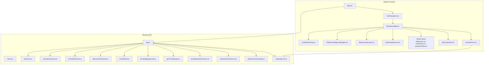
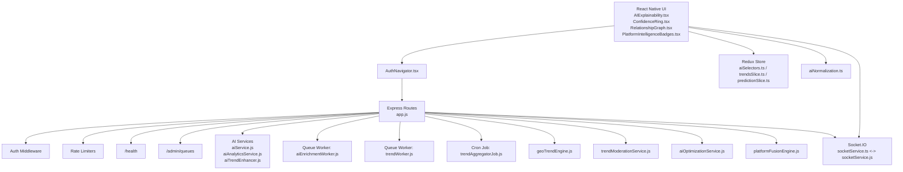
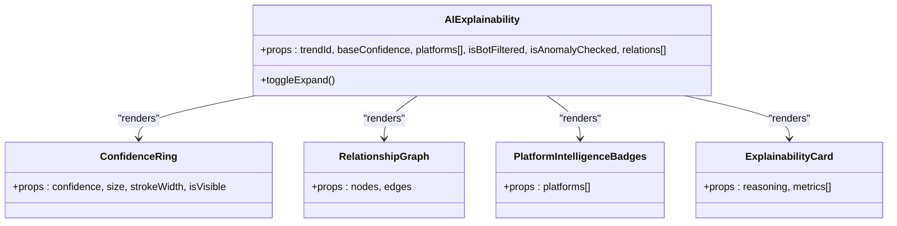
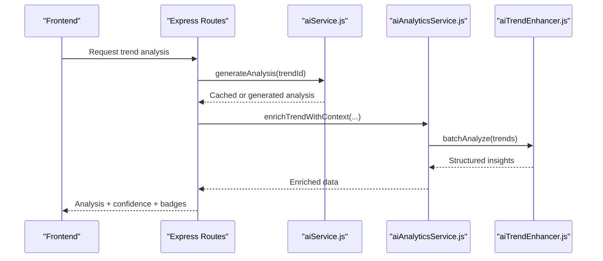
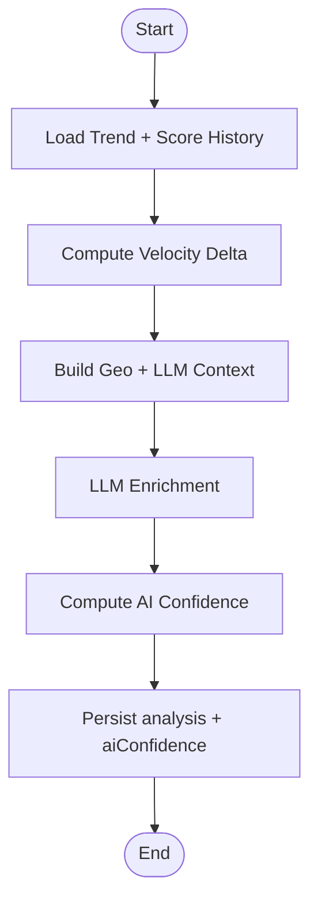
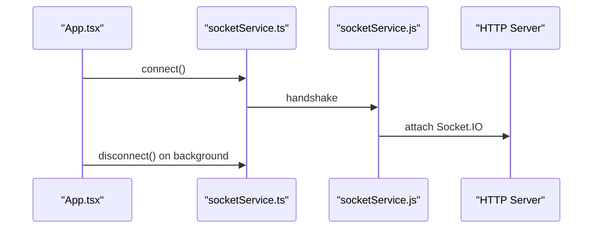
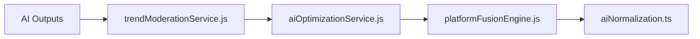
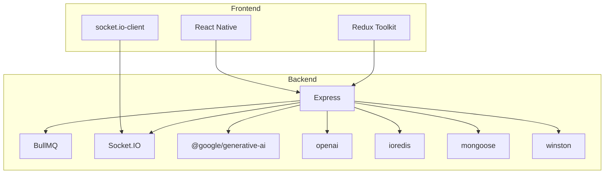

# AI Intelligence Platform

<cite>
**Referenced Files in This Document**
- [README.md](file://AITrendTracker7/README.md)
- [App.tsx](file://AITrendTracker7/App.tsx)
- [AuthNavigator.tsx](file://AITrendTracker7/src/navigations/AuthNavigator.tsx)
- [AIExplainability.tsx](file://AITrendTracker7/src/components/ai/AIExplainability.tsx)
- [ConfidenceRing.tsx](file://AITrendTracker7/src/components/ai/ConfidenceRing.tsx)
- [PlatformIntelligenceBadges.tsx](file://AITrendTracker7/src/components/ai/PlatformIntelligenceBadges.tsx)
- [RelationshipGraph.tsx](file://AITrendTracker7/src/components/ai/RelationshipGraph.tsx)
- [ExplainabilityCard.tsx](file://AITrendTracker7/src/components/feed/ExplainabilityCard.tsx)
- [server.js](file://backend/server.js)
- [app.js](file://backend/src/app.js)
- [aiService.js](file://backend/src/services/aiService.js)
- [aiAnalyticsService.js](file://backend/src/services/aiAnalyticsService.js)
- [aiTrendEnhancer.js](file://backend/src/services/aiTrendEnhancer.js)
- [aiEnrichmentWorker.js](file://backend/src/queues/workers/aiEnrichmentWorker.js)
- [trendWorker.js](file://backend/src/queues/workers/trendWorker.js)
- [trendAggregatorJob.js](file://backend/src/jobs/trendAggregatorJob.js)
- [geoTrendEngine.js](file://backend/src/services/geoTrendEngine.js)
- [trendModerationService.js](file://backend/src/services/trendModerationService.js)
- [aiOptimizationService.js](file://backend/src/services/aiOptimizationService.js)
- [platformFusionEngine.js](file://backend/src/services/platformFusionEngine.js)
- [aiNormalization.ts](file://AITrendTracker7/src/utils/aiNormalization.ts)
- [aiSelectors.ts](file://AITrendTracker7/src/store/selectors/aiSelectors.ts)
- [trendsSlice.ts](file://AITrendTracker7/src/store/slices/trendsSlice.ts)
- [predictionSlice.ts](file://AITrendTracker7/src/store/slices/predictionSlice.ts)
- [socketService.ts](file://AITrendTracker7/src/services/socketService.ts)
- [socketService.js](file://backend/src/services/socketService.js)
- [package.json](file://AITrendTracker7/package.json)
- [package.json](file://backend/package.json)
</cite>

## Table of Contents
1. [Introduction](#introduction)
2. [Project Structure](#project-structure)
3. [Core Components](#core-components)
4. [Architecture Overview](#architecture-overview)
5. [Detailed Component Analysis](#detailed-component-analysis)
6. [Dependency Analysis](#dependency-analysis)
7. [Performance Considerations](#performance-considerations)
8. [Troubleshooting Guide](#troubleshooting-guide)
9. [Conclusion](#conclusion)
10. [Appendices](#appendices)

## Introduction
This document describes the AI intelligence platform that powers AI-powered trend analysis, explainability, confidence scoring, and trust indicators. It covers frontend AI components (confidence rings, relationship graphs, intelligence badges), backend AI services (trend enhancement, analytics processing, moderation), integration with external AI APIs (OpenAI/Gemini), prediction algorithms, and real-time inference patterns. It also documents the confidence scoring methodology, explainability features, trust matrix calculations, and quality assurance mechanisms.

## Project Structure
The platform consists of:
- A React Native mobile application (frontend) with AI-focused UI components and navigation.
- A Node.js/Express backend with AI services, queues, cron jobs, and WebSocket support.
- Shared utilities and Redux slices for AI data handling.

**Diagram sources**
- [App.tsx:15-59](file://AITrendTracker7/App.tsx#L15-L59)
- [AuthNavigator.tsx:23-61](file://AITrendTracker7/src/navigations/AuthNavigator.tsx#L23-L61)
- [AIExplainability.tsx:26-48](file://AITrendTracker7/src/components/ai/AIExplainability.tsx#L26-L48)
- [ConfidenceRing.tsx:24-52](file://AITrendTracker7/src/components/ai/ConfidenceRing.tsx#L24-L52)
- [PlatformIntelligenceBadges.tsx](file://AITrendTracker7/src/components/ai/PlatformIntelligenceBadges.tsx)
- [RelationshipGraph.tsx](file://AITrendTracker7/src/components/ai/RelationshipGraph.tsx)
- [ExplainabilityCard.tsx:19-55](file://AITrendTracker7/src/components/feed/ExplainabilityCard.tsx#L19-L55)
- [aiSelectors.ts](file://AITrendTracker7/src/store/selectors/aiSelectors.ts)
- [trendsSlice.ts](file://AITrendTracker7/src/store/slices/trendsSlice.ts)
- [predictionSlice.ts](file://AITrendTracker7/src/store/slices/predictionSlice.ts)
- [aiNormalization.ts](file://AITrendTracker7/src/utils/aiNormalization.ts)
- [socketService.ts](file://AITrendTracker7/src/services/socketService.ts)
- [server.js:11-51](file://backend/server.js#L11-L51)
- [app.js:28-62](file://backend/src/app.js#L28-L62)
- [aiService.js](file://backend/src/services/aiService.js)
- [aiAnalyticsService.js](file://backend/src/services/aiAnalyticsService.js)
- [aiTrendEnhancer.js:80-115](file://backend/src/services/aiTrendEnhancer.js#L80-L115)
- [aiEnrichmentWorker.js:66-94](file://backend/src/queues/workers/aiEnrichmentWorker.js#L66-L94)
- [trendWorker.js](file://backend/src/queues/workers/trendWorker.js)
- [trendAggregatorJob.js](file://backend/src/jobs/trendAggregatorJob.js)
- [geoTrendEngine.js](file://backend/src/services/geoTrendEngine.js)
- [trendModerationService.js](file://backend/src/services/trendModerationService.js)
- [aiOptimizationService.js](file://backend/src/services/aiOptimizationService.js)
- [platformFusionEngine.js](file://backend/src/services/platformFusionEngine.js)
- [socketService.js](file://backend/src/services/socketService.js)

**Section sources**
- [README.md:1-98](file://AITrendTracker7/README.md#L1-L98)
- [App.tsx:15-59](file://AITrendTracker7/App.tsx#L15-L59)
- [AuthNavigator.tsx:23-61](file://AITrendTracker7/src/navigations/AuthNavigator.tsx#L23-L61)
- [server.js:11-51](file://backend/server.js#L11-L51)
- [app.js:28-62](file://backend/src/app.js#L28-L62)

## Core Components
- Frontend AI UI:
  - Confidence ring visualization with animated transitions.
  - Relationship graph for trend connections.
  - Platform intelligence badges for trust signals.
  - AI explainability card displaying reasoning and metrics.
- Backend AI services:
  - Gemini integration for conversational AI and trend analysis.
  - Analytics enrichment pipeline with batch processing.
  - Trend enhancement with category classification and predictions.
  - Queue workers for asynchronous enrichment and aggregation.
  - Cron job for periodic geo trend scanning.
  - Moderation and optimization services for quality and performance.
- Real-time connectivity:
  - Socket.IO client and server for live updates.

**Section sources**
- [ConfidenceRing.tsx:24-52](file://AITrendTracker7/src/components/ai/ConfidenceRing.tsx#L24-L52)
- [RelationshipGraph.tsx](file://AITrendTracker7/src/components/ai/RelationshipGraph.tsx)
- [PlatformIntelligenceBadges.tsx](file://AITrendTracker7/src/components/ai/PlatformIntelligenceBadges.tsx)
- [ExplainabilityCard.tsx:19-55](file://AITrendTracker7/src/components/feed/ExplainabilityCard.tsx#L19-L55)
- [aiService.js](file://backend/src/services/aiService.js)
- [aiAnalyticsService.js](file://backend/src/services/aiAnalyticsService.js)
- [aiTrendEnhancer.js:80-115](file://backend/src/services/aiTrendEnhancer.js#L80-L115)
- [aiEnrichmentWorker.js:66-94](file://backend/src/queues/workers/aiEnrichmentWorker.js#L66-L94)
- [trendAggregatorJob.js](file://backend/src/jobs/trendAggregatorJob.js)
- [geoTrendEngine.js](file://backend/src/services/geoTrendEngine.js)
- [trendModerationService.js](file://backend/src/services/trendModerationService.js)
- [aiOptimizationService.js](file://backend/src/services/aiOptimizationService.js)
- [socketService.ts](file://AITrendTracker7/src/services/socketService.ts)
- [socketService.js](file://backend/src/services/socketService.js)

## Architecture Overview
The platform follows a layered architecture:
- Presentation layer: React Native screens and AI UI components.
- Application layer: Navigation, Redux store, and shared utilities.
- API layer: Express routes and middleware.
- Intelligence services: AI integrations, analytics, moderation, optimization.
- Background processing: BullMQ queues and cron jobs.
- Real-time layer: Socket.IO for live updates.

**Diagram sources**
- [AuthNavigator.tsx:23-61](file://AITrendTracker7/src/navigations/AuthNavigator.tsx#L23-L61)
- [AIExplainability.tsx:26-48](file://AITrendTracker7/src/components/ai/AIExplainability.tsx#L26-L48)
- [ConfidenceRing.tsx:24-52](file://AITrendTracker7/src/components/ai/ConfidenceRing.tsx#L24-L52)
- [RelationshipGraph.tsx](file://AITrendTracker7/src/components/ai/RelationshipGraph.tsx)
- [PlatformIntelligenceBadges.tsx](file://AITrendTracker7/src/components/ai/PlatformIntelligenceBadges.tsx)
- [ExplainabilityCard.tsx:19-55](file://AITrendTracker7/src/components/feed/ExplainabilityCard.tsx#L19-L55)
- [aiSelectors.ts](file://AITrendTracker7/src/store/selectors/aiSelectors.ts)
- [trendsSlice.ts](file://AITrendTracker7/src/store/slices/trendsSlice.ts)
- [predictionSlice.ts](file://AITrendTracker7/src/store/slices/predictionSlice.ts)
- [aiNormalization.ts](file://AITrendTracker7/src/utils/aiNormalization.ts)
- [app.js:28-62](file://backend/src/app.js#L28-L62)
- [aiService.js](file://backend/src/services/aiService.js)
- [aiAnalyticsService.js](file://backend/src/services/aiAnalyticsService.js)
- [aiTrendEnhancer.js:80-115](file://backend/src/services/aiTrendEnhancer.js#L80-L115)
- [aiEnrichmentWorker.js:66-94](file://backend/src/queues/workers/aiEnrichmentWorker.js#L66-L94)
- [trendWorker.js](file://backend/src/queues/workers/trendWorker.js)
- [trendAggregatorJob.js](file://backend/src/jobs/trendAggregatorJob.js)
- [geoTrendEngine.js](file://backend/src/services/geoTrendEngine.js)
- [trendModerationService.js](file://backend/src/services/trendModerationService.js)
- [aiOptimizationService.js](file://backend/src/services/aiOptimizationService.js)
- [platformFusionEngine.js](file://backend/src/services/platformFusionEngine.js)
- [socketService.ts](file://AITrendTracker7/src/services/socketService.ts)
- [socketService.js](file://backend/src/services/socketService.js)

## Detailed Component Analysis

### Frontend AI Components
- AIExplainability: Collapsible panel integrating confidence ring, badges, relationship graph, and explainability card. Uses reanimated for smooth animations and props-driven rendering.
- ConfidenceRing: Animated SVG ring visualizing confidence scores with spring and timing interpolations, respecting reduced motion preferences.
- RelationshipGraph: Interactive graph component for trend relationships (implementation file referenced).
- PlatformIntelligenceBadges: Trust badges derived from platform weights and trust signals.
- ExplainabilityCard: Displays AI reasoning and metric trends in a grid layout.

**Diagram sources**
- [AIExplainability.tsx:26-48](file://AITrendTracker7/src/components/ai/AIExplainability.tsx#L26-L48)
- [ConfidenceRing.tsx:24-52](file://AITrendTracker7/src/components/ai/ConfidenceRing.tsx#L24-L52)
- [RelationshipGraph.tsx](file://AITrendTracker7/src/components/ai/RelationshipGraph.tsx)
- [PlatformIntelligenceBadges.tsx](file://AITrendTracker7/src/components/ai/PlatformIntelligenceBadges.tsx)
- [ExplainabilityCard.tsx:19-55](file://AITrendTracker7/src/components/feed/ExplainabilityCard.tsx#L19-L55)

**Section sources**
- [AIExplainability.tsx:26-48](file://AITrendTracker7/src/components/ai/AIExplainability.tsx#L26-L48)
- [ConfidenceRing.tsx:24-52](file://AITrendTracker7/src/components/ai/ConfidenceRing.tsx#L24-L52)
- [RelationshipGraph.tsx](file://AITrendTracker7/src/components/ai/RelationshipGraph.tsx)
- [PlatformIntelligenceBadges.tsx](file://AITrendTracker7/src/components/ai/PlatformIntelligenceBadges.tsx)
- [ExplainabilityCard.tsx:19-55](file://AITrendTracker7/src/components/feed/ExplainabilityCard.tsx#L19-L55)

### Backend AI Services
- aiService.js: Wraps Google Gemini for conversational AI and trend analysis. Implements in-memory cache with TTL, Zod validation, and deterministic fallbacks. Handles rate-limit detection and graceful degradation.
- aiAnalyticsService.js: Multi-stage LLM pipeline via OpenRouter with fallbacks. Validates structured outputs and normalizes results.
- aiTrendEnhancer.js: Batch analysis of trends using Gemini to produce summaries, categories, and predictions. Includes caching, fallbacks, and category heuristics.

**Diagram sources**
- [aiService.js](file://backend/src/services/aiService.js)
- [aiAnalyticsService.js](file://backend/src/services/aiAnalyticsService.js)
- [aiTrendEnhancer.js:80-115](file://backend/src/services/aiTrendEnhancer.js#L80-L115)

**Section sources**
- [aiService.js](file://backend/src/services/aiService.js)
- [aiAnalyticsService.js](file://backend/src/services/aiAnalyticsService.js)
- [aiTrendEnhancer.js:80-115](file://backend/src/services/aiTrendEnhancer.js#L80-L115)

### Confidence Scoring and Trust Indicators
- Confidence computation in the worker combines trend velocity delta, platform weights, anomaly checks, and bot filtering signals to produce a robust AI confidence sub-object persisted with the trend.
- Trust indicators derive from platform weights and trust scores, surfaced via badges and explainability panels.

**Diagram sources**
- [aiEnrichmentWorker.js:66-94](file://backend/src/queues/workers/aiEnrichmentWorker.js#L66-L94)

**Section sources**
- [aiEnrichmentWorker.js:66-94](file://backend/src/queues/workers/aiEnrichmentWorker.js#L66-L94)

### Real-Time Inference and Live Updates
- The frontend connects to Socket.IO on app foreground and disconnects on background to conserve resources. Backend initializes Socket.IO and attaches it to the HTTP server.

**Diagram sources**
- [App.tsx:18-41](file://AITrendTracker7/App.tsx#L18-L41)
- [socketService.ts](file://AITrendTracker7/src/services/socketService.ts)
- [socketService.js](file://backend/src/services/socketService.js)
- [server.js:14-29](file://backend/server.js#L14-L29)

**Section sources**
- [App.tsx:18-41](file://AITrendTracker7/App.tsx#L18-L41)
- [server.js:14-29](file://backend/server.js#L14-L29)

### AI Moderation, Bias Detection, and Quality Assurance
- Moderation service filters inappropriate content and enforces policy boundaries.
- Optimization service improves inference latency and throughput.
- Fusion engine consolidates multi-source intelligence into unified signals.
- Utilities normalize AI outputs for consistent downstream consumption.

**Diagram sources**
- [trendModerationService.js](file://backend/src/services/trendModerationService.js)
- [aiOptimizationService.js](file://backend/src/services/aiOptimizationService.js)
- [platformFusionEngine.js](file://backend/src/services/platformFusionEngine.js)
- [aiNormalization.ts](file://AITrendTracker7/src/utils/aiNormalization.ts)

**Section sources**
- [trendModerationService.js](file://backend/src/services/trendModerationService.js)
- [aiOptimizationService.js](file://backend/src/services/aiOptimizationService.js)
- [platformFusionEngine.js](file://backend/src/services/platformFusionEngine.js)
- [aiNormalization.ts](file://AITrendTracker7/src/utils/aiNormalization.ts)

## Dependency Analysis
External dependencies relevant to AI:
- Frontend: React Native, Redux Toolkit, Socket.IO client, vector icons, SVG.
- Backend: Express, BullMQ, Socket.IO, OpenAI/Gemini SDKs, rate limiter, Redis, Mongoose, Winston logging.

**Diagram sources**
- [package.json:12-43](file://AITrendTracker7/package.json#L12-L43)
- [package.json:14-38](file://backend/package.json#L14-L38)

**Section sources**
- [package.json:12-43](file://AITrendTracker7/package.json#L12-L43)
- [package.json:14-38](file://backend/package.json#L14-L38)

## Performance Considerations
- Batch processing: aiTrendEnhancer performs batch analysis to reduce API calls and latency.
- Caching: aiService and aiTrendEnhancer maintain in-memory caches with TTL to avoid redundant LLM calls.
- Queue-based processing: aiEnrichmentWorker and trendWorker handle heavy computations asynchronously.
- Rate limiting: Distributed rate limiting via Redis prevents API throttling.
- Reduced motion and offscreen awareness: ConfidenceRing adapts animations to preserve performance and battery life.
- Real-time efficiency: Socket.IO lifecycle management reconnects only on foreground activation.

[No sources needed since this section provides general guidance]

## Troubleshooting Guide
- Gemini rate limits: aiService detects rate-limit errors and returns a friendly message; retry after a short delay.
- Validation failures: Zod-based schemas ensure structured outputs; validation middleware surfaces field-specific errors.
- Background disconnections: App disconnects sockets on background to save resources; reconnects on foreground.
- Queue monitoring: Admin dashboard at /admin/queues requires bearer token for access.

**Section sources**
- [aiService.js:150-164](file://backend/src/services/aiService.js#L150-L164)
- [app.js:51-57](file://backend/src/app.js#L51-L57)
- [App.tsx:22-35](file://AITrendTracker7/App.tsx#L22-L35)

## Conclusion
The AI intelligence platform integrates external AI APIs with robust internal services to deliver explainable, confident, and trustworthy trend insights. Its frontend showcases confidence visualization and relationship graphs, while the backend leverages queues, cron jobs, and moderation to ensure reliability, performance, and quality.

## Appendices
- External AI API integrations:
  - Gemini: Conversational AI and trend analysis.
  - OpenAI: Fallback and enrichment pipeline.
- Real-time patterns:
  - Socket.IO client-server pairing with lifecycle-aware reconnects.
- Model deployment and prediction:
  - Batch processing and caching minimize latency.
  - Confidence scoring and trust indicators enhance interpretability.

[No sources needed since this section summarizes without analyzing specific files]