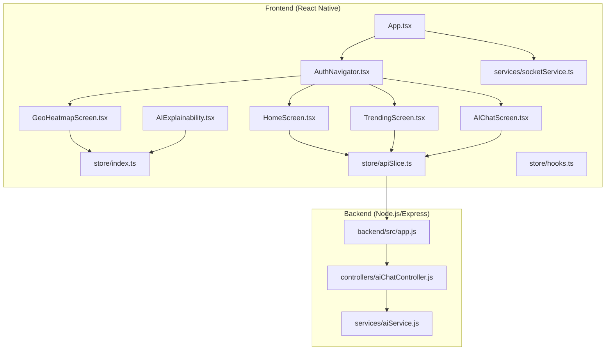
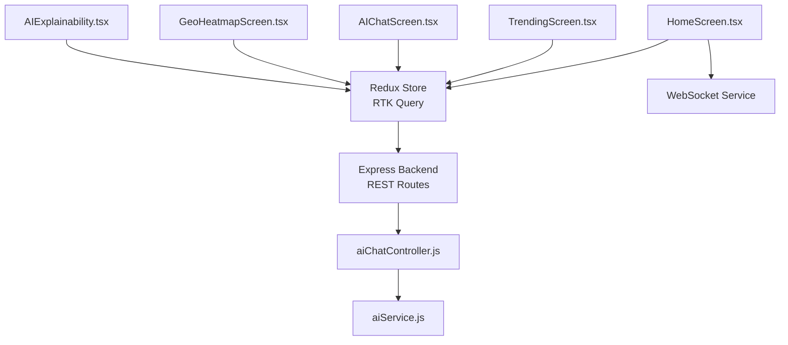
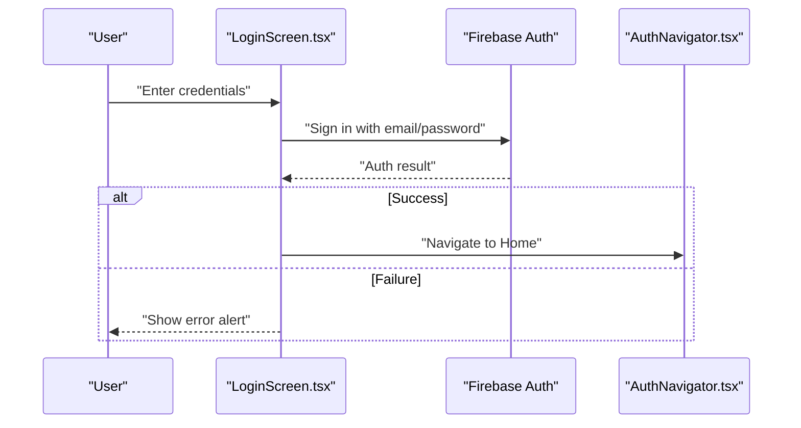
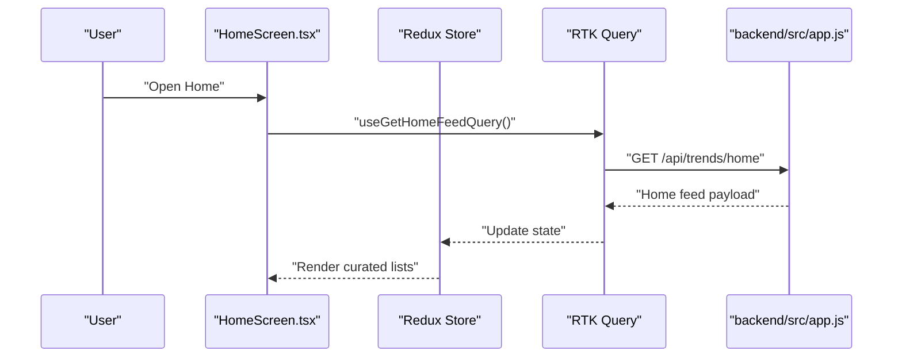
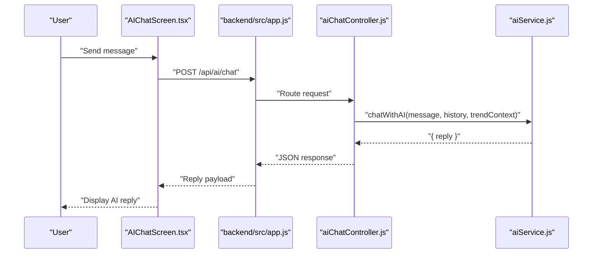
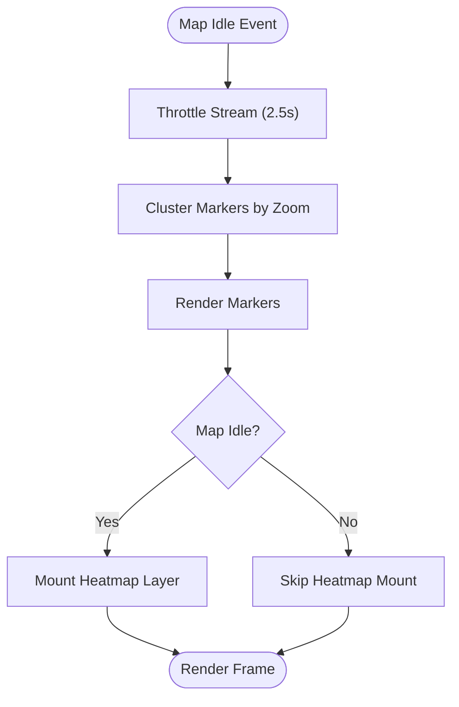
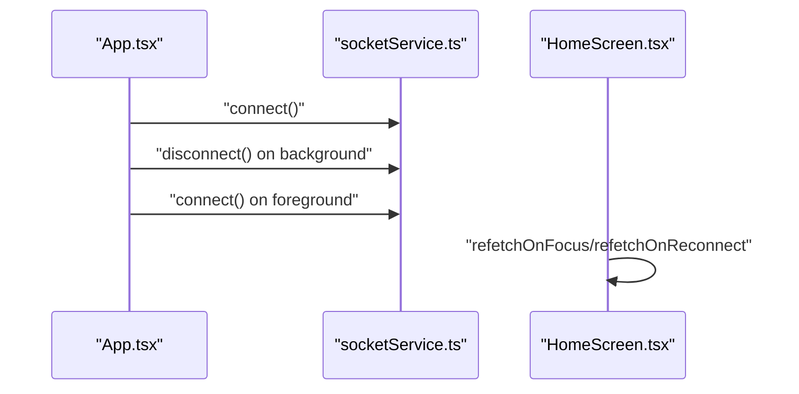
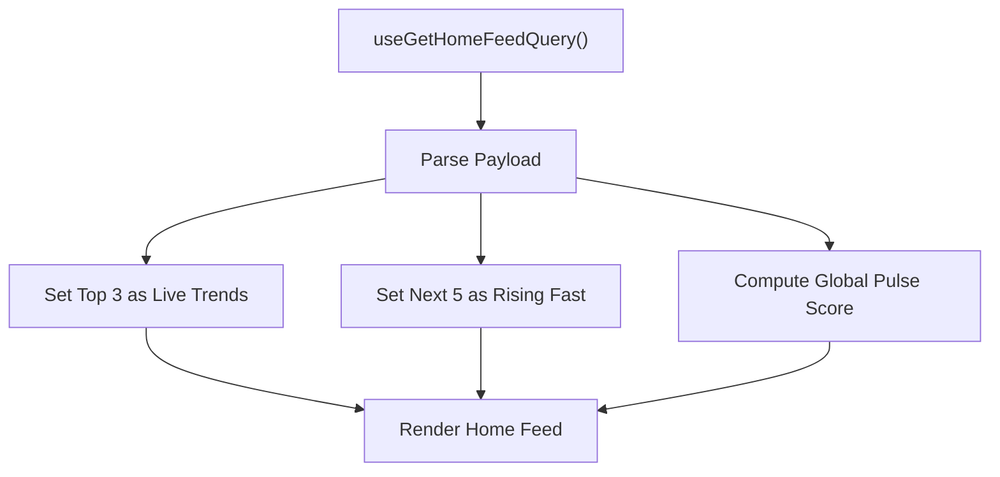
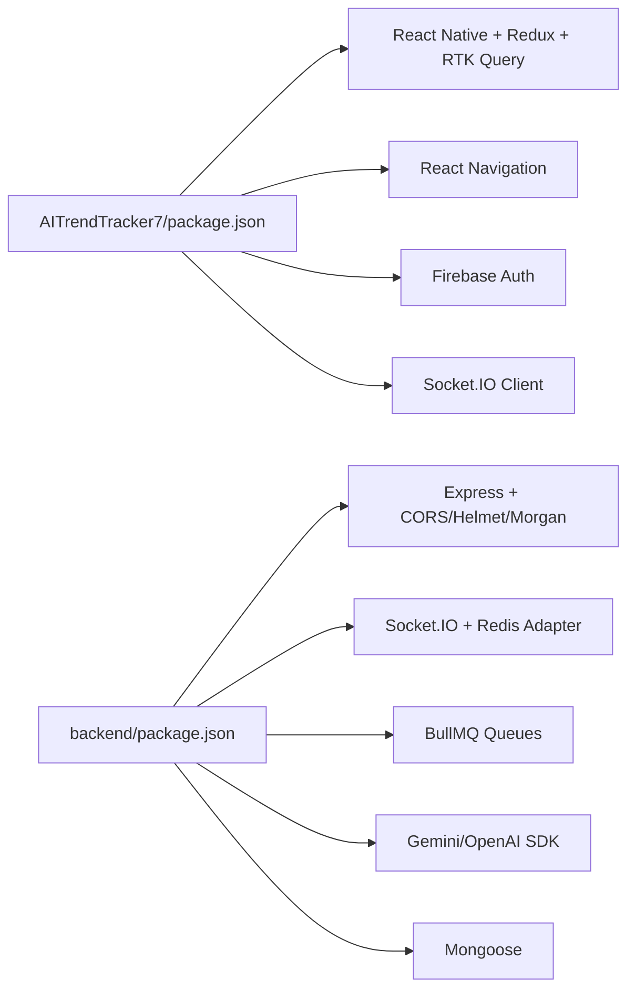

# Core Features

<cite>
**Referenced Files in This Document**
- [App.tsx](file://AITrendTracker7/App.tsx)
- [AuthNavigator.tsx](file://AITrendTracker7/src/navigations/AuthNavigator.tsx)
- [HomeScreen.tsx](file://AITrendTracker7/src/navigations/screens/HomeScreen.tsx)
- [LoginScreen.tsx](file://AITrendTracker7/src/navigations/screens/LoginScreen.tsx)
- [TrendingScreen.tsx](file://AITrendTracker7/src/navigations/screens/TrendingScreen.tsx)
- [GeoHeatmapScreen.tsx](file://AITrendTracker7/src/navigations/screens/GeoHeatmapScreen.tsx)
- [AIChatScreen.tsx](file://AITrendTracker7/src/navigations/screens/AIChatScreen.tsx)
- [AIExplainability.tsx](file://AITrendTracker7/src/components/ai/AIExplainability.tsx)
- [RelationshipGraph.tsx](file://AITrendTracker7/src/components/ai/RelationshipGraph.tsx)
- [index.ts](file://AITrendTracker7/src/store/index.ts)
- [apiSlice.ts](file://AITrendTracker7/src/store/apiSlice.ts)
- [hooks.ts](file://AITrendTracker7/src/store/hooks.ts)
- [socketService.ts](file://AITrendTracker7/src/services/socketService.ts)
- [app.js](file://backend/src/app.js)
- [aiChatController.js](file://backend/src/controllers/aiChatController.js)
- [aiService.js](file://backend/src/services/aiService.js)
- [package.json](file://AITrendTracker7/package.json)
- [backend/package.json](file://backend/package.json)
</cite>

## Table of Contents
1. [Introduction](#introduction)
2. [Project Structure](#project-structure)
3. [Core Components](#core-components)
4. [Architecture Overview](#architecture-overview)
5. [Detailed Component Analysis](#detailed-component-analysis)
6. [Dependency Analysis](#dependency-analysis)
7. [Performance Considerations](#performance-considerations)
8. [Troubleshooting Guide](#troubleshooting-guide)
9. [Conclusion](#conclusion)

## Introduction
AITrendTracker delivers a mobile-first platform for discovering, analyzing, and acting on global trends. Its core features include:
- User Authentication: Secure sign-in via email/password and Google Sign-In with Firebase.
- Trend Discovery: Real-time curated feeds, category exploration, and trend detail views.
- AI Intelligence Platform: AI-powered explainability, confidence scoring, and conversational AI chat.
- Geographic Intelligence: Live geo-spiking heatmaps with clustering and throttling for performance.
- Personalized Recommendations: Home feed curation, “Rising Fast” lists, and onboarding-driven personalization.
- Real-time Updates: WebSocket connections for live trend signals and UI refresh strategies.

These features integrate tightly with a React Native frontend and a Node.js/Express backend, orchestrated by Redux Toolkit for state management and RTK Query for data fetching and caching.

## Project Structure
The repository is split into two primary areas:
- Frontend (React Native): UI screens, navigation, components, store, services, and theme.
- Backend (Node.js/Express): REST APIs, controllers, services, workers, and integrations.

**Diagram sources**
- [App.tsx:15-59](file://AITrendTracker7/App.tsx#L15-L59)
- [AuthNavigator.tsx:23-61](file://AITrendTracker7/src/navigations/AuthNavigator.tsx#L23-L61)
- [HomeScreen.tsx:27-169](file://AITrendTracker7/src/navigations/screens/HomeScreen.tsx#L27-L169)
- [TrendingScreen.tsx:19-120](file://AITrendTracker7/src/navigations/screens/TrendingScreen.tsx#L19-L120)
- [GeoHeatmapScreen.tsx:18-141](file://AITrendTracker7/src/navigations/screens/GeoHeatmapScreen.tsx#L18-L141)
- [AIChatScreen.tsx:20-172](file://AITrendTracker7/src/navigations/screens/AIChatScreen.tsx#L20-L172)
- [AIExplainability.tsx:26-120](file://AITrendTracker7/src/components/ai/AIExplainability.tsx#L26-L120)
- [index.ts:1-46](file://AITrendTracker7/src/store/index.ts#L1-L46)
- [apiSlice.ts](file://AITrendTracker7/src/store/apiSlice.ts)
- [hooks.ts](file://AITrendTracker7/src/store/hooks.ts)
- [socketService.ts](file://AITrendTracker7/src/services/socketService.ts)
- [app.js:1-88](file://backend/src/app.js#L1-L88)
- [aiChatController.js:1-22](file://backend/src/controllers/aiChatController.js#L1-L22)
- [aiService.js:1-168](file://backend/src/services/aiService.js#L1-L168)

**Section sources**
- [App.tsx:15-59](file://AITrendTracker7/App.tsx#L15-L59)
- [AuthNavigator.tsx:23-61](file://AITrendTracker7/src/navigations/AuthNavigator.tsx#L23-L61)
- [index.ts:1-46](file://AITrendTracker7/src/store/index.ts#L1-L46)
- [app.js:1-88](file://backend/src/app.js#L1-L88)

## Core Components
- Authentication and Navigation
  - Login flow supports email/password and Google Sign-In via Firebase.
  - AuthNavigator defines all screens and transitions.
- Home Feed and Real-Time Updates
  - HomeScreen fetches and displays curated live trends, “Rising Fast,” and a global pulse score.
  - RTK Query handles caching and refetching; WebSocket reconnects on app foreground/background.
- Trend Discovery
  - TrendingScreen lists top trends and links to category exploration.
- AI Intelligence
  - AIExplainability renders confidence, platform trust matrices, anomaly checks, and a relationship graph.
  - AIChatScreen enables contextual chat with the AI assistant.
- Geographic Intelligence
  - GeoHeatmapScreen renders live geo-spikes with throttling, clustering, and lazy heatmap mounting.
- State Management
  - Redux store persists auth, UI, and trends; RTK Query middleware manages API caching and invalidation.

**Section sources**
- [LoginScreen.tsx:26-364](file://AITrendTracker7/src/navigations/screens/LoginScreen.tsx#L26-L364)
- [AuthNavigator.tsx:23-61](file://AITrendTracker7/src/navigations/AuthNavigator.tsx#L23-L61)
- [HomeScreen.tsx:27-169](file://AITrendTracker7/src/navigations/screens/HomeScreen.tsx#L27-L169)
- [TrendingScreen.tsx:19-120](file://AITrendTracker7/src/navigations/screens/TrendingScreen.tsx#L19-L120)
- [AIExplainability.tsx:26-120](file://AITrendTracker7/src/components/ai/AIExplainability.tsx#L26-L120)
- [AIChatScreen.tsx:20-172](file://AITrendTracker7/src/navigations/screens/AIChatScreen.tsx#L20-L172)
- [GeoHeatmapScreen.tsx:18-141](file://AITrendTracker7/src/navigations/screens/GeoHeatmapScreen.tsx#L18-L141)
- [index.ts:1-46](file://AITrendTracker7/src/store/index.ts#L1-L46)

## Architecture Overview
AITrendTracker follows a layered architecture:
- Presentation Layer: React Native screens and components.
- Application Layer: Navigation, routing, and UI orchestration.
- Domain Layer: AI explainability, geo-intel, and recommendation logic.
- Data Access Layer: RTK Query for API, Redux for local state.
- Backend Services: REST endpoints, AI service, and background workers.

**Diagram sources**
- [HomeScreen.tsx:27-169](file://AITrendTracker7/src/navigations/screens/HomeScreen.tsx#L27-L169)
- [TrendingScreen.tsx:19-120](file://AITrendTracker7/src/navigations/screens/TrendingScreen.tsx#L19-L120)
- [AIChatScreen.tsx:20-172](file://AITrendTracker7/src/navigations/screens/AIChatScreen.tsx#L20-L172)
- [GeoHeatmapScreen.tsx:18-141](file://AITrendTracker7/src/navigations/screens/GeoHeatmapScreen.tsx#L18-L141)
- [AIExplainability.tsx:26-120](file://AITrendTracker7/src/components/ai/AIExplainability.tsx#L26-L120)
- [index.ts:1-46](file://AITrendTracker7/src/store/index.ts#L1-L46)
- [socketService.ts](file://AITrendTracker7/src/services/socketService.ts)
- [app.js:1-88](file://backend/src/app.js#L1-L88)
- [aiChatController.js:1-22](file://backend/src/controllers/aiChatController.js#L1-L22)
- [aiService.js:1-168](file://backend/src/services/aiService.js#L1-L168)

## Detailed Component Analysis

### User Authentication
- Email/Password and Google Sign-In are handled by Firebase Auth.
- LoginScreen orchestrates form validation, loading states, and navigation after successful sign-in.
- AuthNavigator controls the auth-to-app transition.

**Diagram sources**
- [LoginScreen.tsx:26-364](file://AITrendTracker7/src/navigations/screens/LoginScreen.tsx#L26-L364)
- [AuthNavigator.tsx:23-61](file://AITrendTracker7/src/navigations/AuthNavigator.tsx#L23-L61)

**Section sources**
- [LoginScreen.tsx:26-364](file://AITrendTracker7/src/navigations/screens/LoginScreen.tsx#L26-L364)
- [AuthNavigator.tsx:23-61](file://AITrendTracker7/src/navigations/AuthNavigator.tsx#L23-L61)

### Trend Discovery
- HomeScreen curates live trends, “Rising Fast,” and a global pulse score using RTK Query.
- TrendingScreen fetches top trends from the backend and presents a ranked list.
- Navigation integrates seamlessly with the store and API.

**Diagram sources**
- [HomeScreen.tsx:27-169](file://AITrendTracker7/src/navigations/screens/HomeScreen.tsx#L27-L169)
- [index.ts:1-46](file://AITrendTracker7/src/store/index.ts#L1-L46)
- [app.js:59-62](file://backend/src/app.js#L59-L62)

**Section sources**
- [HomeScreen.tsx:27-169](file://AITrendTracker7/src/navigations/screens/HomeScreen.tsx#L27-L169)
- [TrendingScreen.tsx:19-120](file://AITrendTracker7/src/navigations/screens/TrendingScreen.tsx#L19-L120)
- [index.ts:1-46](file://AITrendTracker7/src/store/index.ts#L1-L46)

### AI Intelligence Platform
- AIExplainability provides confidence visualization, platform trust badges, anomaly checks, and a relationship graph.
- RelationshipGraph renders a static SVG-based graph with budgeted nodes and accessibility support.
- AIChatScreen sends contextual messages to the backend chat controller, which delegates to the AI service.

**Diagram sources**
- [AIChatScreen.tsx:20-172](file://AITrendTracker7/src/navigations/screens/AIChatScreen.tsx#L20-L172)
- [app.js:60-61](file://backend/src/app.js#L60-L61)
- [aiChatController.js:1-22](file://backend/src/controllers/aiChatController.js#L1-L22)
- [aiService.js:118-164](file://backend/src/services/aiService.js#L118-L164)

**Section sources**
- [AIExplainability.tsx:26-120](file://AITrendTracker7/src/components/ai/AIExplainability.tsx#L26-L120)
- [RelationshipGraph.tsx:24-162](file://AITrendTracker7/src/components/ai/RelationshipGraph.tsx#L24-L162)
- [AIChatScreen.tsx:20-172](file://AITrendTracker7/src/navigations/screens/AIChatScreen.tsx#L20-L172)
- [aiService.js:118-164](file://backend/src/services/aiService.js#L118-L164)

### Geographic Intelligence
- GeoHeatmapScreen renders live geo-spikes with:
  - Stream throttling to reduce update frequency.
  - Zoom-aware marker clustering.
  - Lazy mounting of the heatmap layer while the map is idle.
- These optimizations ensure smooth UX even with frequent updates.

**Diagram sources**
- [GeoHeatmapScreen.tsx:18-141](file://AITrendTracker7/src/navigations/screens/GeoHeatmapScreen.tsx#L18-L141)

**Section sources**
- [GeoHeatmapScreen.tsx:18-141](file://AITrendTracker7/src/navigations/screens/GeoHeatmapScreen.tsx#L18-L141)

### Real-Time Updates and WebSocket Integration
- App.tsx initializes and reconnects WebSocket connections on app foreground/background events.
- HomeScreen relies on WebSocket for live updates and refetches on focus/reconnect.

**Diagram sources**
- [App.tsx:15-59](file://AITrendTracker7/App.tsx#L15-L59)
- [socketService.ts](file://AITrendTracker7/src/services/socketService.ts)
- [HomeScreen.tsx:37-41](file://AITrendTracker7/src/navigations/screens/HomeScreen.tsx#L37-L41)

**Section sources**
- [App.tsx:15-59](file://AITrendTracker7/App.tsx#L15-L59)
- [HomeScreen.tsx:37-41](file://AITrendTracker7/src/navigations/screens/HomeScreen.tsx#L37-L41)

### Personalized Recommendations and Home Feed Curation
- HomeScreen computes “Live Trends,” “Rising Fast,” and a global pulse score from the fetched feed.
- RTK Query caching and refetch strategies ensure freshness without redundant requests.

**Diagram sources**
- [HomeScreen.tsx:27-52](file://AITrendTracker7/src/navigations/screens/HomeScreen.tsx#L27-L52)

**Section sources**
- [HomeScreen.tsx:27-52](file://AITrendTracker7/src/navigations/screens/HomeScreen.tsx#L27-L52)

## Dependency Analysis
- Frontend dependencies include React Native, React Navigation, Redux Toolkit, RTK Query, Socket.IO client, and Firebase.
- Backend dependencies include Express, Socket.IO with Redis adapter, BullMQ for queues, OpenAI/Gemini SDKs, and Mongoose.

**Diagram sources**
- [package.json:12-44](file://AITrendTracker7/package.json#L12-L44)
- [backend/package.json:14-38](file://backend/package.json#L14-L38)

**Section sources**
- [package.json:12-44](file://AITrendTracker7/package.json#L12-L44)
- [backend/package.json:14-38](file://backend/package.json#L14-L38)

## Performance Considerations
- Real-Time Updates
  - WebSocket reconnection on app lifecycle events prevents stale data.
  - RTK Query refetch on focus/reconnect ensures fresh content without manual polling.
- Geographic Rendering
  - Stream throttling reduces render pressure.
  - Zoom-aware clustering minimizes DOM overhead.
  - Lazy heatmap mounting improves responsiveness during panning/zooming.
- AI Responses
  - In-memory cache with TTL avoids repeated external API calls.
  - Safe fallbacks prevent server failures from breaking the app.
- State Persistence
  - Redux persistence for auth/UI/trends reduces cold-start latency.

[No sources needed since this section provides general guidance]

## Troubleshooting Guide
- Authentication Failures
  - Validate Firebase credentials and network connectivity.
  - Check error alerts for invalid credentials or network errors.
- WebSocket Disconnections
  - Verify backend Socket.IO availability and Redis adapter configuration.
  - Confirm app foreground/background event handling reconnects sockets.
- AI Chat Errors
  - Missing Gemini API key results in a graceful fallback message.
  - Rate limits may temporarily block free-tier usage; retry after a minute.
- Geo-Heatmap Stutters
  - Ensure throttling and clustering thresholds match device capabilities.
  - Avoid mounting the heatmap layer while the map is moving.

**Section sources**
- [LoginScreen.tsx:40-63](file://AITrendTracker7/src/navigations/screens/LoginScreen.tsx#L40-L63)
- [App.tsx:18-41](file://AITrendTracker7/App.tsx#L18-L41)
- [aiService.js:119-164](file://backend/src/services/aiService.js#L119-L164)
- [GeoHeatmapScreen.tsx:21-37](file://AITrendTracker7/src/navigations/screens/GeoHeatmapScreen.tsx#L21-L37)

## Conclusion
AITrendTracker’s core features are tightly integrated across the frontend and backend:
- Authentication secures access, navigation guides users, and state management powers responsive UIs.
- Real-time updates keep users informed, while AI explainability and chat deliver actionable insights.
- Geographic intelligence provides spatial awareness with strong performance safeguards.
- Personalized recommendations and robust error handling ensure a reliable, engaging experience.

[No sources needed since this section summarizes without analyzing specific files]