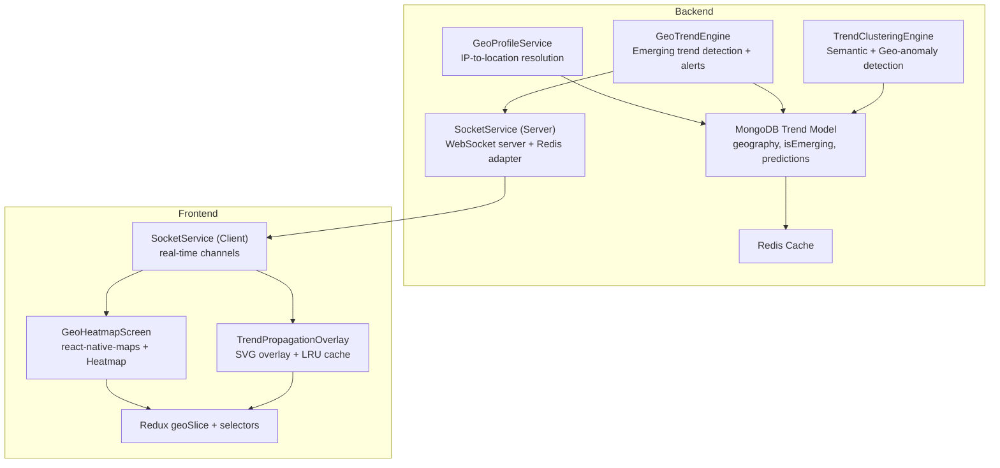
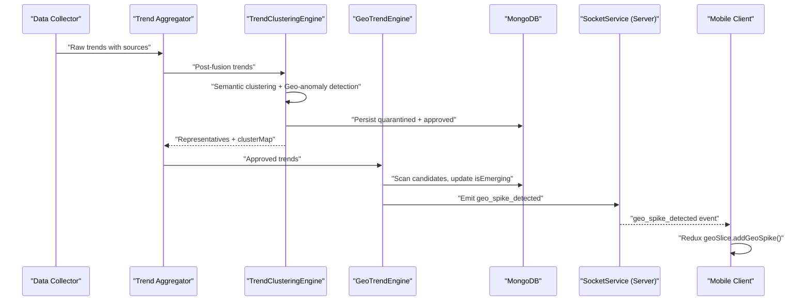
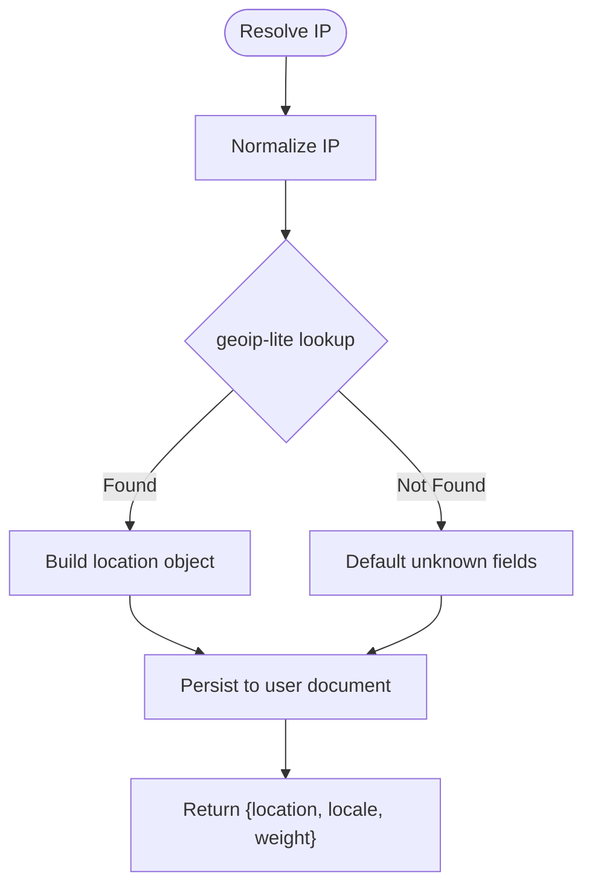
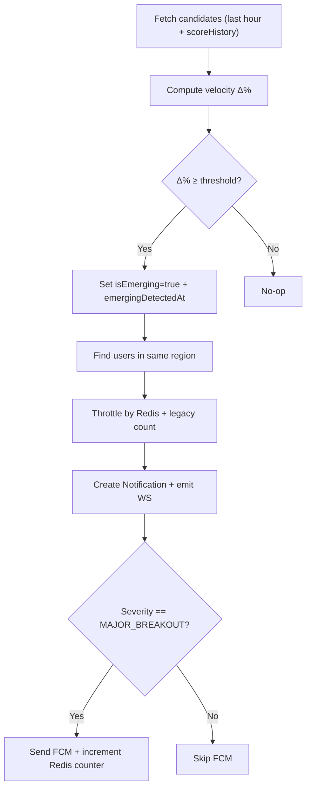
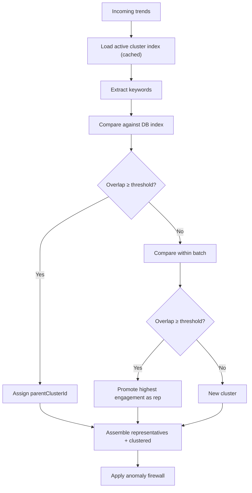
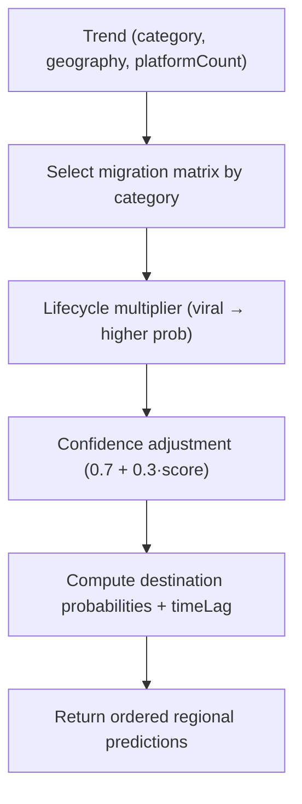
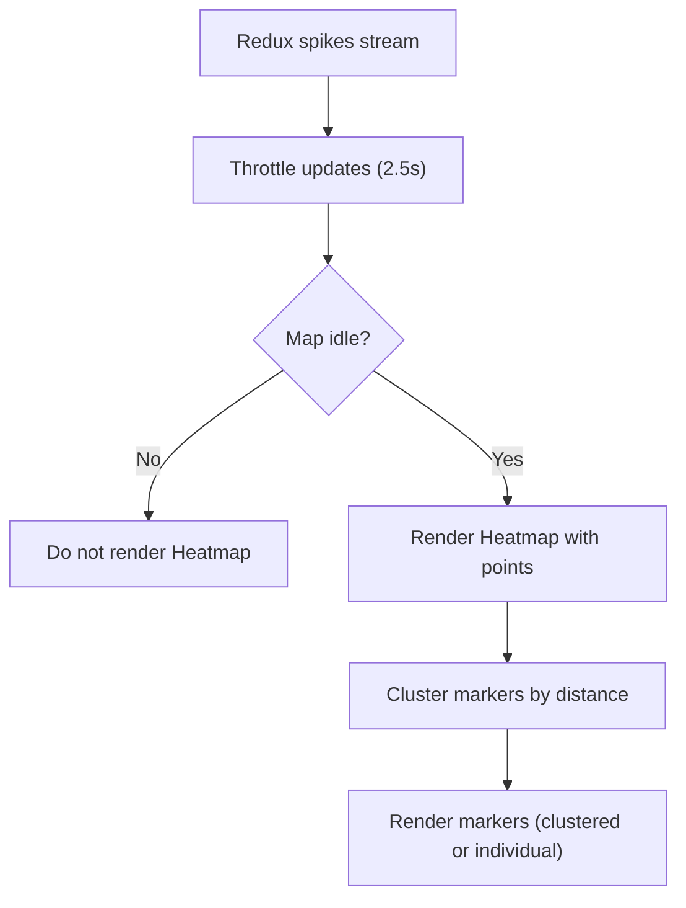
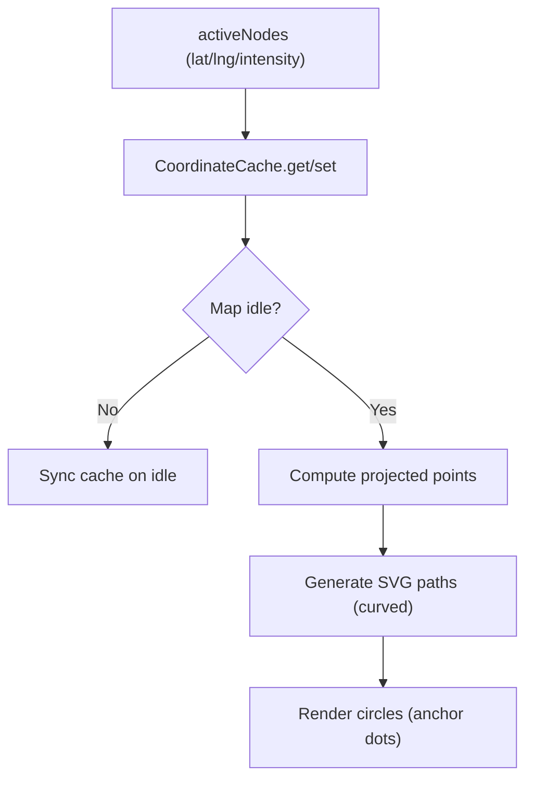
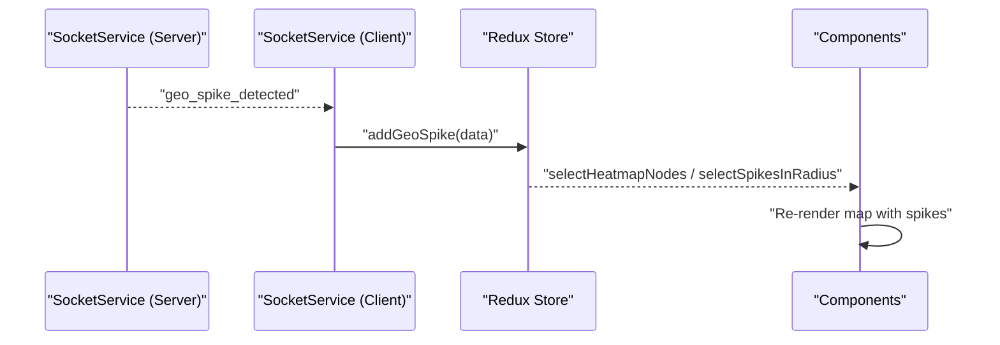
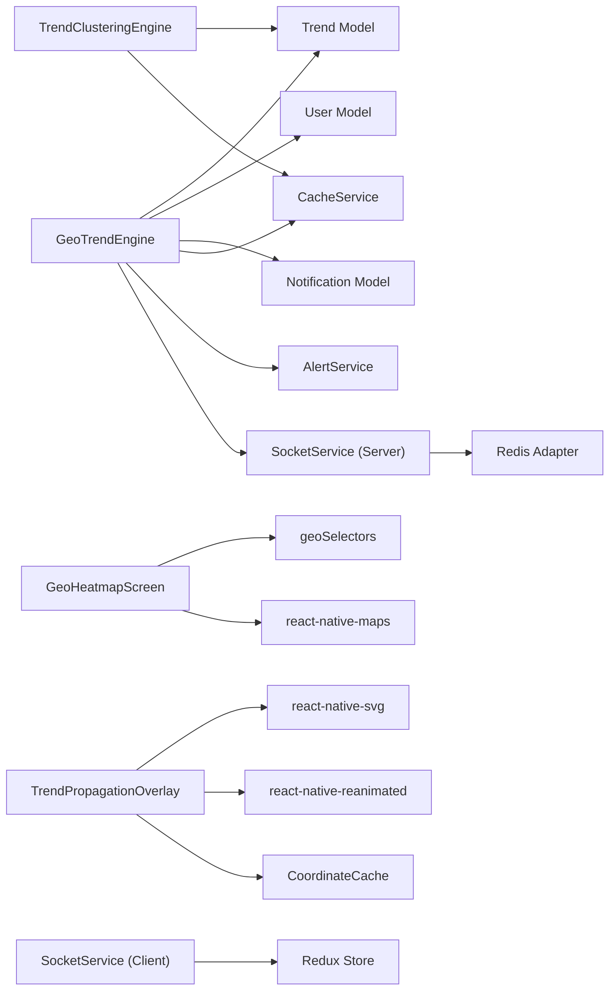

# Geographic Intelligence

<cite>
**Referenced Files in This Document**
- [geoTrendEngine.js](file://backend/src/services/geoTrendEngine.js)
- [geoProfileService.js](file://backend/src/services/geoProfileService.js)
- [trendClusteringEngine.js](file://backend/src/services/trendClusteringEngine.js)
- [socketService.js](file://backend/src/services/socketService.js)
- [Trend.js](file://backend/src/models/Trend.js)
- [GeoHeatmapScreen.tsx](file://AITrendTracker7/src/navigations/screens/GeoHeatmapScreen.tsx)
- [TrendPropagationOverlay.tsx](file://AITrendTracker7/src/components/geo/TrendPropagationOverlay.tsx)
- [geoSlice.ts](file://AITrendTracker7/src/store/slices/geoSlice.ts)
- [geoSelectors.ts](file://AITrendTracker7/src/store/selectors/geoSelectors.ts)
- [socketService.ts](file://AITrendTracker7/src/services/socketService.ts)
- [trendPredictionEngine.js](file://backend/src/services/trendPredictionEngine.js)
</cite>

## Table of Contents
1. [Introduction](#introduction)
2. [Project Structure](#project-structure)
3. [Core Components](#core-components)
4. [Architecture Overview](#architecture-overview)
5. [Detailed Component Analysis](#detailed-component-analysis)
6. [Dependency Analysis](#dependency-analysis)
7. [Performance Considerations](#performance-considerations)
8. [Troubleshooting Guide](#troubleshooting-guide)
9. [Conclusion](#conclusion)
10. [Appendices](#appendices)

## Introduction
This document explains the geographic intelligence system that powers location-aware trend detection, heatmap visualization, trend propagation overlays, and regional alerting. It covers the backend GeoTrendEngine for identifying emerging regional trends, the geoProfileService for regional analysis, and spatial data processing algorithms. On the frontend, it documents the heatmap screen, trend propagation overlay, and interactive map interfaces. It also details geographic clustering algorithms, distance-based trend correlation, regional propagation modeling, geo-fencing, proximity-based recommendations, spatial indexing strategies, coordinate handling, and real-time updates.

## Project Structure
The geographic intelligence spans backend services and frontend components:
- Backend services orchestrate geotemporal scanning, anomaly detection, regional propagation modeling, and real-time event broadcasting.
- Frontend screens and overlays render heatmaps, propagate trend vectors, and integrate with real-time streams.

**Diagram sources**
- [geoProfileService.js:1-132](file://backend/src/services/geoProfileService.js#L1-L132)
- [geoTrendEngine.js:1-320](file://backend/src/services/geoTrendEngine.js#L1-L320)
- [trendClusteringEngine.js:1-428](file://backend/src/services/trendClusteringEngine.js#L1-L428)
- [socketService.js:1-107](file://backend/src/services/socketService.js#L1-L107)
- [Trend.js:1-188](file://backend/src/models/Trend.js#L1-L188)
- [GeoHeatmapScreen.tsx:1-260](file://AITrendTracker7/src/navigations/screens/GeoHeatmapScreen.tsx#L1-L260)
- [TrendPropagationOverlay.tsx:1-172](file://AITrendTracker7/src/components/geo/TrendPropagationOverlay.tsx#L1-L172)
- [geoSlice.ts:1-50](file://AITrendTracker7/src/store/slices/geoSlice.ts#L1-L50)
- [socketService.ts:1-109](file://AITrendTracker7/src/services/socketService.ts#L1-L109)

**Section sources**
- [geoProfileService.js:1-132](file://backend/src/services/geoProfileService.js#L1-L132)
- [geoTrendEngine.js:1-320](file://backend/src/services/geoTrendEngine.js#L1-L320)
- [trendClusteringEngine.js:1-428](file://backend/src/services/trendClusteringEngine.js#L1-L428)
- [socketService.js:1-107](file://backend/src/services/socketService.js#L1-L107)
- [Trend.js:1-188](file://backend/src/models/Trend.js#L1-L188)
- [GeoHeatmapScreen.tsx:1-260](file://AITrendTracker7/src/navigations/screens/GeoHeatmapScreen.tsx#L1-L260)
- [TrendPropagationOverlay.tsx:1-172](file://AITrendTracker7/src/components/geo/TrendPropagationOverlay.tsx#L1-L172)
- [geoSlice.ts:1-50](file://AITrendTracker7/src/store/slices/geoSlice.ts#L1-L50)
- [socketService.ts:1-109](file://AITrendTracker7/src/services/socketService.ts#L1-L109)

## Core Components
- GeoProfileService: Resolves IP addresses to coarse geo-data and persists user location with language weights for regional relevance.
- GeoTrendEngine: Scans regional trends for velocity spikes, flags emerging trends, generates heatmap payloads, and triggers geo-targeted alerts.
- TrendClusteringEngine: Performs semantic clustering and geo-anomaly detection to quarantine suspicious trends.
- TrendPredictionEngine: Predicts regional propagation paths and lifecycles to inform propagation modeling.
- Frontend:
  - GeoHeatmapScreen: Renders a live heatmap with throttled updates, lazy rendering, and client-side clustering.
  - TrendPropagationOverlay: Renders animated SVG overlays representing trend propagation vectors.
  - Redux geoSlice + selectors: Manages user location, radius filter, and heatmap spikes; exposes derived selectors for nodes and active spikes.
  - SocketService (client): Subscribes to real-time channels for geo-spikes, system alerts, and AI updates.

**Section sources**
- [geoProfileService.js:1-132](file://backend/src/services/geoProfileService.js#L1-L132)
- [geoTrendEngine.js:1-320](file://backend/src/services/geoTrendEngine.js#L1-L320)
- [trendClusteringEngine.js:1-428](file://backend/src/services/trendClusteringEngine.js#L1-L428)
- [trendPredictionEngine.js:357-389](file://backend/src/services/trendPredictionEngine.js#L357-L389)
- [GeoHeatmapScreen.tsx:1-260](file://AITrendTracker7/src/navigations/screens/GeoHeatmapScreen.tsx#L1-L260)
- [TrendPropagationOverlay.tsx:1-172](file://AITrendTracker7/src/components/geo/TrendPropagationOverlay.tsx#L1-L172)
- [geoSlice.ts:1-50](file://AITrendTracker7/src/store/slices/geoSlice.ts#L1-L50)
- [geoSelectors.ts:1-44](file://AITrendTracker7/src/store/selectors/geoSelectors.ts#L1-L44)
- [socketService.ts:1-109](file://AITrendTracker7/src/services/socketService.ts#L1-L109)

## Architecture Overview
The geographic intelligence pipeline integrates ingestion, enrichment, clustering, anomaly detection, regional propagation, and real-time delivery.

**Diagram sources**
- [trendClusteringEngine.js:360-399](file://backend/src/services/trendClusteringEngine.js#L360-L399)
- [geoTrendEngine.js:59-116](file://backend/src/services/geoTrendEngine.js#L59-L116)
- [socketService.js:17-55](file://backend/src/services/socketService.js#L17-L55)
- [socketService.ts:45-67](file://AITrendTracker7/src/services/socketService.ts#L45-L67)

## Detailed Component Analysis

### GeoProfileService
- Purpose: Resolve IP to coarse geo-data and persist user location with language weights.
- Key behaviors:
  - normalizeIP handles IPv6-mapped IPv4 and X-Forwarded-For proxies.
  - resolveIP returns country/state/city/timezone.
  - resolveAndPersist updates user document with location and languageWeight.
  - getUserGeoProfile retrieves cached geo profile.

**Diagram sources**
- [geoProfileService.js:70-92](file://backend/src/services/geoProfileService.js#L70-L92)
- [geoProfileService.js:38-64](file://backend/src/services/geoProfileService.js#L38-L64)

**Section sources**
- [geoProfileService.js:1-132](file://backend/src/services/geoProfileService.js#L1-L132)

### GeoTrendEngine
- Purpose: Detect regional velocity spikes, generate heatmap payloads, and trigger geo-alerts.
- Key behaviors:
  - scanForEmergingTrends compares composite scores over 60-minute windows and flags isEmerging.
  - triggerGeoAlerts finds users in the same region, throttles by Redis and legacy counts, emits WebSocket events, and sends FCM when appropriate.
  - getHeatmapPayload aggregates by city, merges static coordinates with dynamic fallback, and caches results.
  - buildLocalContext enriches AI prompts with local context for emerging trends.

**Diagram sources**
- [geoTrendEngine.js:59-116](file://backend/src/services/geoTrendEngine.js#L59-L116)
- [geoTrendEngine.js:141-215](file://backend/src/services/geoTrendEngine.js#L141-L215)
- [geoTrendEngine.js:246-302](file://backend/src/services/geoTrendEngine.js#L246-L302)

**Section sources**
- [geoTrendEngine.js:1-320](file://backend/src/services/geoTrendEngine.js#L1-L320)
- [Trend.js:67-78](file://backend/src/models/Trend.js#L67-L78)

### TrendClusteringEngine
- Purpose: Semantic clustering and geo-anomaly detection to prevent synthetic/spam trends.
- Key behaviors:
  - getActiveClusterIndex loads recent trends and precomputes keywords for clustering.
  - clusterByTopic compares incoming trends against DB index and batch-internal trends using keyword overlap thresholds.
  - detectGeoAnomaly inspects velocity spikes, source diversity, geographic impossibility, engagement-to-view ratio, and identical velocity curves.
  - applyAnomalyFirewall quarantines suspicious trends and persists audit trail.

**Diagram sources**
- [trendClusteringEngine.js:85-108](file://backend/src/services/trendClusteringEngine.js#L85-L108)
- [trendClusteringEngine.js:121-223](file://backend/src/services/trendClusteringEngine.js#L121-L223)
- [trendClusteringEngine.js:241-311](file://backend/src/services/trendClusteringEngine.js#L241-L311)
- [trendClusteringEngine.js:321-357](file://backend/src/services/trendClusteringEngine.js#L321-L357)

**Section sources**
- [trendClusteringEngine.js:1-428](file://backend/src/services/trendClusteringEngine.js#L1-L428)

### TrendPredictionEngine
- Purpose: Predict regional migration and lifecycles to model trend propagation.
- Key behaviors:
  - predictRegionalMigration uses category-specific migration matrices, lifecycle multipliers, and confidence adjustments to produce destination probabilities and time lags.

**Diagram sources**
- [trendPredictionEngine.js:357-389](file://backend/src/services/trendPredictionEngine.js#L357-L389)

**Section sources**
- [trendPredictionEngine.js:357-389](file://backend/src/services/trendPredictionEngine.js#L357-L389)

### Frontend: GeoHeatmapScreen
- Purpose: Render live geographic spikes as a heatmap with lazy loading and client-side clustering.
- Key behaviors:
  - Stream throttling prevents excessive re-renders.
  - Lazy rendering mounts Heatmap only when the map is idle.
  - Client-side clustering merges nearby nodes based on zoom level.

**Diagram sources**
- [GeoHeatmapScreen.tsx:21-37](file://AITrendTracker7/src/navigations/screens/GeoHeatmapScreen.tsx#L21-L37)
- [GeoHeatmapScreen.tsx:43-50](file://AITrendTracker7/src/navigations/screens/GeoHeatmapScreen.tsx#L43-L50)
- [GeoHeatmapScreen.tsx:122-138](file://AITrendTracker7/src/navigations/screens/GeoHeatmapScreen.tsx#L122-L138)
- [geoSelectors.ts:28-38](file://AITrendTracker7/src/store/selectors/geoSelectors.ts#L28-L38)

**Section sources**
- [GeoHeatmapScreen.tsx:1-260](file://AITrendTracker7/src/navigations/screens/GeoHeatmapScreen.tsx#L1-L260)
- [geoSelectors.ts:1-44](file://AITrendTracker7/src/store/selectors/geoSelectors.ts#L1-L44)

### Frontend: TrendPropagationOverlay
- Purpose: Visualize trend propagation vectors over the map using SVG.
- Key behaviors:
  - CoordinateCache maintains projected points with LRU eviction to prevent memory bloat.
  - Paths pooled to avoid frequent DOM recreation.
  - Overlay renders anchor dots and curved SVG paths between nodes.

**Diagram sources**
- [TrendPropagationOverlay.tsx:32-57](file://AITrendTracker7/src/components/geo/TrendPropagationOverlay.tsx#L32-L57)
- [TrendPropagationOverlay.tsx:69-121](file://AITrendTracker7/src/components/geo/TrendPropagationOverlay.tsx#L69-L121)
- [TrendPropagationOverlay.tsx:122-148](file://AITrendTracker7/src/components/geo/TrendPropagationOverlay.tsx#L122-L148)
- [TrendPropagationOverlay.tsx:150-172](file://AITrendTracker7/src/components/geo/TrendPropagationOverlay.tsx#L150-L172)

**Section sources**
- [TrendPropagationOverlay.tsx:1-172](file://AITrendTracker7/src/components/geo/TrendPropagationOverlay.tsx#L1-L172)

### Frontend: Real-Time Updates and Redux
- Purpose: Manage geographic state and subscribe to real-time events.
- Key behaviors:
  - geoSlice stores userLocation, radiusMetric, and heatmapSpikes.
  - geoSelectors derive filtered spikes and nodes for the map.
  - socketService.ts listens to geo_spike_detected, system_alert, and ai_prediction_update channels and dispatches to Redux.

**Diagram sources**
- [socketService.js:38-51](file://backend/src/services/socketService.js#L38-L51)
- [socketService.ts:45-67](file://AITrendTracker7/src/services/socketService.ts#L45-L67)
- [geoSlice.ts:26-38](file://AITrendTracker7/src/store/slices/geoSlice.ts#L26-L38)
- [geoSelectors.ts:9-26](file://AITrendTracker7/src/store/selectors/geoSelectors.ts#L9-L26)

**Section sources**
- [geoSlice.ts:1-50](file://AITrendTracker7/src/store/slices/geoSlice.ts#L1-L50)
- [geoSelectors.ts:1-44](file://AITrendTracker7/src/store/selectors/geoSelectors.ts#L1-L44)
- [socketService.ts:1-109](file://AITrendTracker7/src/services/socketService.ts#L1-L109)

## Dependency Analysis
- Backend:
  - GeoTrendEngine depends on Trend, User, Notification, cacheService, alertService, socketService, and Redis for throttling.
  - TrendClusteringEngine depends on Trend and cacheService for cluster index caching.
  - SocketService (server) uses Redis adapter for multi-instance broadcast consistency.
  - MongoDB model Trend includes geo-indexes and fields for geography, isEmerging, and predictions.
- Frontend:
  - GeoHeatmapScreen depends on react-native-maps, Redux selectors, and throttling logic.
  - TrendPropagationOverlay depends on react-native-svg, react-native-reanimated, and a coordinate cache.
  - SocketService (client) connects to the backend and dispatches actions to Redux.

**Diagram sources**
- [geoTrendEngine.js:14-23](file://backend/src/services/geoTrendEngine.js#L14-L23)
- [trendClusteringEngine.js:17-19](file://backend/src/services/trendClusteringEngine.js#L17-L19)
- [socketService.js:11-36](file://backend/src/services/socketService.js#L11-L36)
- [Trend.js:174-186](file://backend/src/models/Trend.js#L174-L186)
- [GeoHeatmapScreen.tsx:1-10](file://AITrendTracker7/src/navigations/screens/GeoHeatmapScreen.tsx#L1-L10)
- [TrendPropagationOverlay.tsx:1-6](file://AITrendTracker7/src/components/geo/TrendPropagationOverlay.tsx#L1-L6)
- [socketService.ts:1-8](file://AITrendTracker7/src/services/socketService.ts#L1-L8)

**Section sources**
- [geoTrendEngine.js:14-320](file://backend/src/services/geoTrendEngine.js#L14-L320)
- [trendClusteringEngine.js:17-428](file://backend/src/services/trendClusteringEngine.js#L17-L428)
- [socketService.js:11-107](file://backend/src/services/socketService.js#L11-L107)
- [Trend.js:174-188](file://backend/src/models/Trend.js#L174-L188)
- [GeoHeatmapScreen.tsx:1-260](file://AITrendTracker7/src/navigations/screens/GeoHeatmapScreen.tsx#L1-L260)
- [TrendPropagationOverlay.tsx:1-172](file://AITrendTracker7/src/components/geo/TrendPropagationOverlay.tsx#L1-L172)
- [socketService.ts:1-109](file://AITrendTracker7/src/services/socketService.ts#L1-L109)

## Performance Considerations
- Backend:
  - Redis-based throttling for geo alerts prevents spam while maintaining low latency.
  - CacheService caches heatmap payloads and cluster indices to reduce DB load.
  - MongoDB indexes support geo queries and emerging trend scans.
- Frontend:
  - Stream throttling (2.5s) and lazy Heatmap mounting improve responsiveness.
  - Client-side clustering reduces marker count at low zoom levels.
  - SVG path pooling and LRU coordinate cache minimize DOM churn and memory usage.
- Recommendations:
  - Replace static CITY_COORDINATES with a robust geocoder (e.g., Google Maps/Mapbox) for accuracy.
  - Use spatial indexing (2dsphere) on MongoDB for precise distance queries.
  - Implement pagination or spatial partitioning for large-scale heatmap rendering.

[No sources needed since this section provides general guidance]

## Troubleshooting Guide
- Geo alerts not firing:
  - Verify Redis connectivity and keys for daily caps.
  - Confirm user location filters match region fields and tokens exist.
- Heatmap not updating:
  - Check cache TTL and ensure getHeatmapPayload cache is invalidated on data change.
  - Validate that Redux geoSlice.addGeoSpike is receiving events from the client socket.
- Over-aggressive quarantining:
  - Review anomaly thresholds and adjust sensitivity in TrendClusteringEngine.
- Propagation overlay not visible:
  - Ensure isMapIdle is true and activeNodes are present.
  - Confirm coordinate cache synchronization on onRegionChangeComplete.

**Section sources**
- [geoTrendEngine.js:141-215](file://backend/src/services/geoTrendEngine.js#L141-L215)
- [geoTrendEngine.js:246-302](file://backend/src/services/geoTrendEngine.js#L246-L302)
- [socketService.ts:45-67](file://AITrendTracker7/src/services/socketService.ts#L45-L67)
- [TrendPropagationOverlay.tsx:69-121](file://AITrendTracker7/src/components/geo/TrendPropagationOverlay.tsx#L69-L121)
- [trendClusteringEngine.js:241-311](file://backend/src/services/trendClusteringEngine.js#L241-L311)

## Conclusion
The geographic intelligence system combines robust backend services for regional trend detection, anomaly filtering, and propagation modeling with efficient frontend rendering and real-time updates. By leveraging Redis, MongoDB indexes, and client-side optimizations, it scales to large geographic datasets while delivering timely, location-aware insights and alerts.

[No sources needed since this section summarizes without analyzing specific files]

## Appendices

### Spatial Indexing Strategies
- MongoDB:
  - Compound index for geography and scores to accelerate emerging trend queries.
  - Consider adding a 2dsphere index on coordinates for advanced spatial queries.
- Recommendations:
  - Add indexes for isEmerging + geography fields.
  - Use projection to limit returned fields for heatmap payloads.

**Section sources**
- [Trend.js:179-186](file://backend/src/models/Trend.js#L179-L186)

### Coordinate System Handling
- Backend:
  - Static CITY_COORDINATES provide approximate centers; dynamic fallback is simulated and should be replaced with a geocoder.
- Frontend:
  - react-native-maps expects WGS84 coordinates.
  - Client-side clustering uses simple coordinate differences; for production, replace with haversine-based distance.

**Section sources**
- [geoTrendEngine.js:29-51](file://backend/src/services/geoTrendEngine.js#L29-L51)
- [geoTrendEngine.js:233-240](file://backend/src/services/geoTrendEngine.js#L233-L240)
- [GeoHeatmapScreen.tsx:52-81](file://AITrendTracker7/src/navigations/screens/GeoHeatmapScreen.tsx#L52-L81)

### Real-Time Geographic Trend Updates
- Backend:
  - SocketService (server) emits geo_spike_detected events to rooms.
- Frontend:
  - SocketService (client) listens and dispatches Redux actions to update the map.

**Section sources**
- [socketService.js:38-51](file://backend/src/services/socketService.js#L38-L51)
- [socketService.ts:45-67](file://AITrendTracker7/src/services/socketService.ts#L45-L67)