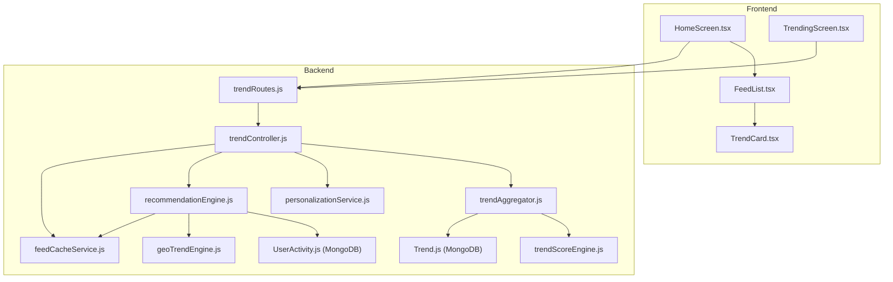
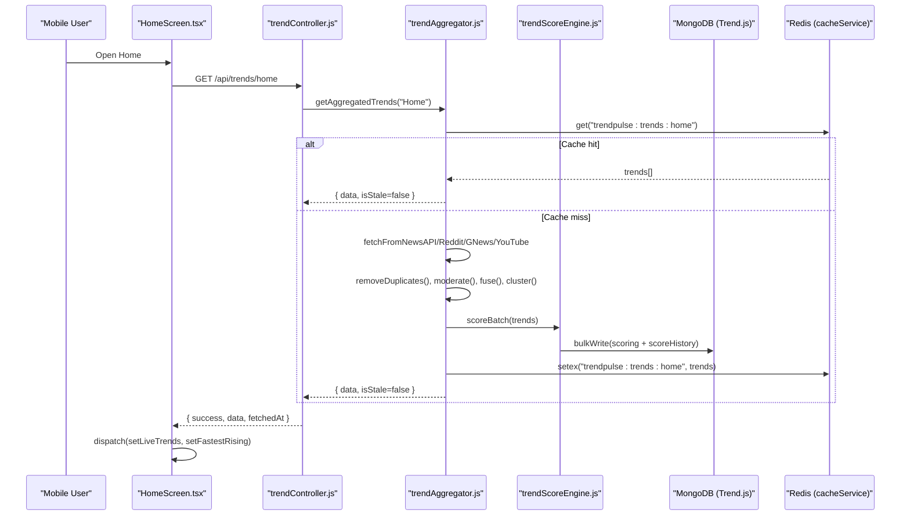
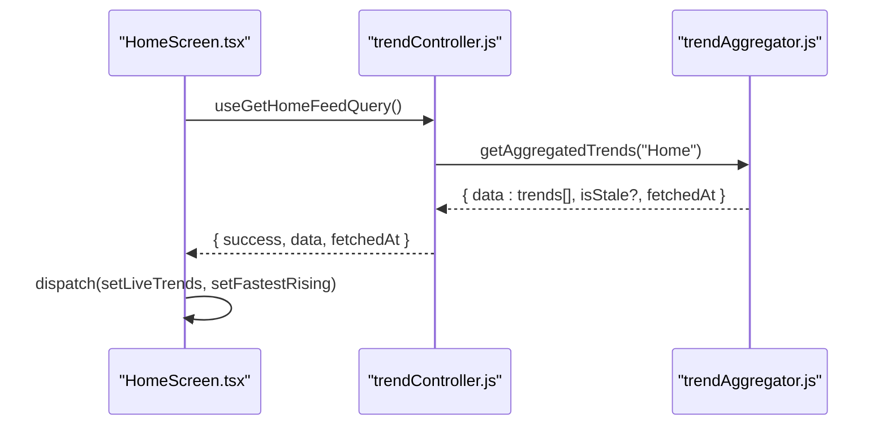
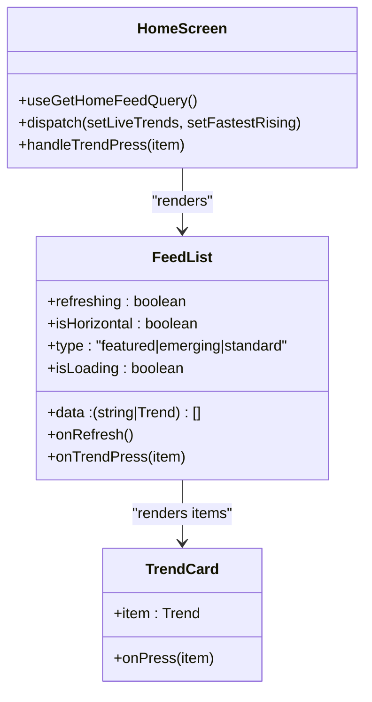
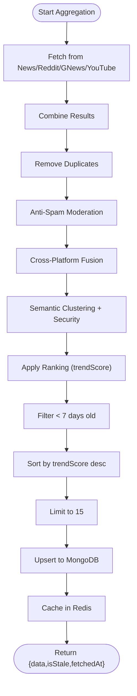
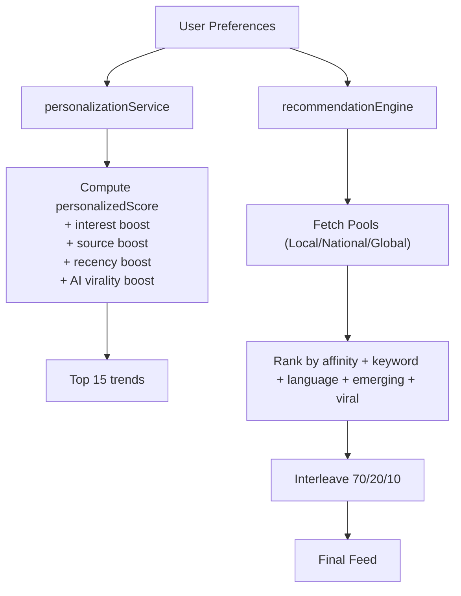
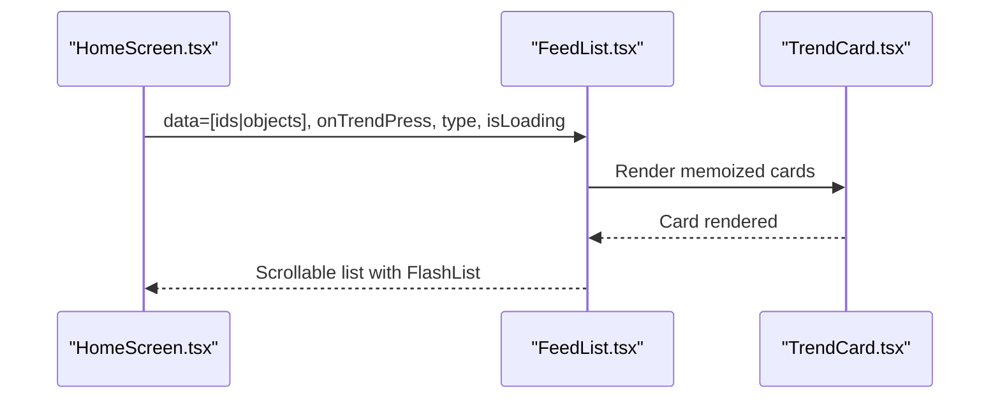
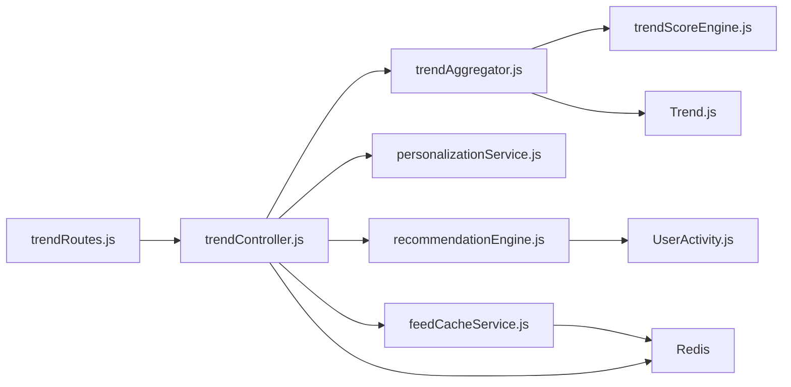

# Trend Discovery Engine

<cite>
**Referenced Files in This Document**
- [Trend.js](file://backend/src/models/Trend.js)
- [trendService.js](file://backend/src/services/trendService.js)
- [trendController.js](file://backend/src/controllers/trendController.js)
- [trendAggregator.js](file://backend/src/services/trendAggregator.js)
- [trendScoreEngine.js](file://backend/src/services/trendScoreEngine.js)
- [personalizationService.js](file://backend/src/services/personalizationService.js)
- [recommendationEngine.js](file://backend/src/services/recommendationEngine.js)
- [feedCacheService.js](file://backend/src/services/feedCacheService.js)
- [geoTrendEngine.js](file://backend/src/services/geoTrendEngine.js)
- [UserActivity.js](file://backend/src/models/UserActivity.js)
- [trendRoutes.js](file://backend/src/routes/trendRoutes.js)
- [HomeScreen.tsx](file://AITrendTracker7/src/navigations/screens/HomeScreen.tsx)
- [TrendingScreen.tsx](file://AITrendTracker7/src/navigations/screens/TrendingScreen.tsx)
- [FeedList.tsx](file://AITrendTracker7/src/components/feed/FeedList.tsx)
- [TrendCard.tsx](file://AITrendTracker7/src/components/feed/TrendCard.tsx)
</cite>

## Table of Contents
1. [Introduction](#introduction)
2. [Project Structure](#project-structure)
3. [Core Components](#core-components)
4. [Architecture Overview](#architecture-overview)
5. [Detailed Component Analysis](#detailed-component-analysis)
6. [Dependency Analysis](#dependency-analysis)
7. [Performance Considerations](#performance-considerations)
8. [Troubleshooting Guide](#troubleshooting-guide)
9. [Conclusion](#conclusion)

## Introduction
This document describes the Trend Discovery Engine powering real-time trend feeds across the AITrendTracker mobile application and backend. It covers the real-time feed implementation, home screen and trending screen layouts, trend card components, the trend data ingestion pipeline, real-time feed processing, trend categorization logic, backend services, MongoDB schema design, personalization algorithms, feed list architecture with infinite scrolling, filtering mechanisms, scoring systems, recommendation algorithms, and performance optimizations including caching and scalable data processing.

## Project Structure
The Trend Discovery Engine spans two primary areas:
- Frontend (React Native): Home and Trending screens, feed list components, and trend cards.
- Backend (Node.js/Express/MongoDB): Aggregation, scoring, personalization, recommendation, caching, and geo-intelligence services.

**Diagram sources**
- [HomeScreen.tsx:1-199](file://AITrendTracker7/src/navigations/screens/HomeScreen.tsx#L1-199)
- [TrendingScreen.tsx:1-247](file://AITrendTracker7/src/navigations/screens/TrendingScreen.tsx#L1-247)
- [FeedList.tsx:1-145](file://AITrendTracker7/src/components/feed/FeedList.tsx#L1-145)
- [TrendCard.tsx:1-99](file://AITrendTracker7/src/components/feed/TrendCard.tsx#L1-99)
- [trendRoutes.js:1-50](file://backend/src/routes/trendRoutes.js#L1-50)
- [trendController.js:1-407](file://backend/src/controllers/trendController.js#L1-407)
- [trendAggregator.js:1-449](file://backend/src/services/trendAggregator.js#L1-449)
- [trendScoreEngine.js:1-231](file://backend/src/services/trendScoreEngine.js#L1-231)
- [personalizationService.js:1-129](file://backend/src/services/personalizationService.js#L1-129)
- [recommendationEngine.js:1-253](file://backend/src/services/recommendationEngine.js#L1-253)
- [feedCacheService.js:1-164](file://backend/src/services/feedCacheService.js#L1-164)
- [geoTrendEngine.js:1-320](file://backend/src/services/geoTrendEngine.js#L1-320)
- [Trend.js:1-188](file://backend/src/models/Trend.js#L1-188)
- [UserActivity.js:1-99](file://backend/src/models/UserActivity.js#L1-99)

**Section sources**
- [HomeScreen.tsx:1-199](file://AITrendTracker7/src/navigations/screens/HomeScreen.tsx#L1-199)
- [TrendingScreen.tsx:1-247](file://AITrendTracker7/src/navigations/screens/TrendingScreen.tsx#L1-247)
- [FeedList.tsx:1-145](file://AITrendTracker7/src/components/feed/FeedList.tsx#L1-145)
- [TrendCard.tsx:1-99](file://AITrendTracker7/src/components/feed/TrendCard.tsx#L1-99)
- [trendRoutes.js:1-50](file://backend/src/routes/trendRoutes.js#L1-50)
- [trendController.js:1-407](file://backend/src/controllers/trendController.js#L1-407)
- [trendAggregator.js:1-449](file://backend/src/services/trendAggregator.js#L1-449)
- [trendScoreEngine.js:1-231](file://backend/src/services/trendScoreEngine.js#L1-231)
- [personalizationService.js:1-129](file://backend/src/services/personalizationService.js#L1-129)
- [recommendationEngine.js:1-253](file://backend/src/services/recommendationEngine.js#L1-253)
- [feedCacheService.js:1-164](file://backend/src/services/feedCacheService.js#L1-164)
- [geoTrendEngine.js:1-320](file://backend/src/services/geoTrendEngine.js#L1-320)
- [Trend.js:1-188](file://backend/src/models/Trend.js#L1-188)
- [UserActivity.js:1-99](file://backend/src/models/UserActivity.js#L1-99)

## Core Components
- Real-time feed orchestration: HomeScreen and TrendingScreen integrate with backend endpoints to render live trend data.
- Feed list and cards: FeedList renders horizontally or vertically with skeleton loaders and swipe gestures; TrendCard displays trend metadata.
- Trend ingestion and ranking: TrendAggregator pulls from multiple sources, deduplicates, fuses platforms, clusters, ranks, and persists trends.
- Scoring and history: trendScoreEngine computes viral, heat, growth, and composite scores with rolling history snapshots.
- Personalization and recommendations: personalizationService and recommendationEngine tailor feeds by interests, recency, source preferences, and geo-profiles.
- Caching and diversity: feedCacheService caches geo-personalized feeds and adapts interleaving ratios based on user interactions.
- Geo-intelligence: geoTrendEngine detects emerging trends, generates heatmaps, and triggers geo-targeted alerts.
- Backend routing and controllers: trendRoutes.js exposes endpoints; trendController.js orchestrates services and returns structured responses.

**Section sources**
- [HomeScreen.tsx:1-199](file://AITrendTracker7/src/navigations/screens/HomeScreen.tsx#L1-199)
- [TrendingScreen.tsx:1-247](file://AITrendTracker7/src/navigations/screens/TrendingScreen.tsx#L1-247)
- [FeedList.tsx:1-145](file://AITrendTracker7/src/components/feed/FeedList.tsx#L1-145)
- [TrendCard.tsx:1-99](file://AITrendTracker7/src/components/feed/TrendCard.tsx#L1-99)
- [trendAggregator.js:1-449](file://backend/src/services/trendAggregator.js#L1-449)
- [trendScoreEngine.js:1-231](file://backend/src/services/trendScoreEngine.js#L1-231)
- [personalizationService.js:1-129](file://backend/src/services/personalizationService.js#L1-129)
- [recommendationEngine.js:1-253](file://backend/src/services/recommendationEngine.js#L1-253)
- [feedCacheService.js:1-164](file://backend/src/services/feedCacheService.js#L1-164)
- [geoTrendEngine.js:1-320](file://backend/src/services/geoTrendEngine.js#L1-320)
- [trendRoutes.js:1-50](file://backend/src/routes/trendRoutes.js#L1-50)
- [trendController.js:1-407](file://backend/src/controllers/trendController.js#L1-407)

## Architecture Overview
The system integrates frontend screens with backend services through REST endpoints. Real-time updates are primarily driven by periodic aggregation and caching, while user interactions influence personalization and diversity matrices.

**Diagram sources**
- [HomeScreen.tsx:1-199](file://AITrendTracker7/src/navigations/screens/HomeScreen.tsx#L1-199)
- [trendController.js:16-23](file://backend/src/controllers/trendController.js#L16-L23)
- [trendAggregator.js:21-173](file://backend/src/services/trendAggregator.js#L21-L173)
- [trendScoreEngine.js:102-216](file://backend/src/services/trendScoreEngine.js#L102-L216)
- [Trend.js:110-111](file://backend/src/models/Trend.js#L110-L111)

## Detailed Component Analysis

### Real-Time Trend Feed Implementation
- HomeScreen orchestrates fetching and rendering:
  - Uses RTK Query to call the home feed endpoint and refetch on focus/reconnect.
  - Dispatches live and rising trend slices to power featured carousel and “Rising Fast” lists.
- TrendingScreen fetches public explore feed and renders top trends with skeleton loaders.

**Diagram sources**
- [HomeScreen.tsx:36-52](file://AITrendTracker7/src/navigations/screens/HomeScreen.tsx#L36-L52)
- [trendController.js:16-23](file://backend/src/controllers/trendController.js#L16-L23)
- [trendAggregator.js:21-173](file://backend/src/services/trendAggregator.js#L21-L173)

**Section sources**
- [HomeScreen.tsx:1-199](file://AITrendTracker7/src/navigations/screens/HomeScreen.tsx#L1-199)
- [TrendingScreen.tsx:19-38](file://AITrendTracker7/src/navigations/screens/TrendingScreen.tsx#L19-L38)
- [trendController.js:16-32](file://backend/src/controllers/trendController.js#L16-L32)

### Home Screen Layout and Trend Cards
- HomeScreen renders:
  - Header with profile, search, notifications.
  - Global AI Pulse card with animated score.
  - Horizontal carousel of featured trends.
  - Vertical list of fastest rising trends with pull-to-refresh.
- FeedList supports:
  - Horizontal/vertical modes.
  - Skeleton loaders during loading.
  - Swipe gestures wrapper for quick actions.
- TrendCard displays:
  - Optional image or gradient placeholder.
  - Category tag, title, and growth indicator.

**Diagram sources**
- [HomeScreen.tsx:1-199](file://AITrendTracker7/src/navigations/screens/HomeScreen.tsx#L1-199)
- [FeedList.tsx:1-145](file://AITrendTracker7/src/components/feed/FeedList.tsx#L1-145)
- [TrendCard.tsx:1-99](file://AITrendTracker7/src/components/feed/TrendCard.tsx#L1-99)

**Section sources**
- [HomeScreen.tsx:58-156](file://AITrendTracker7/src/navigations/screens/HomeScreen.tsx#L58-L156)
- [FeedList.tsx:59-122](file://AITrendTracker7/src/components/feed/FeedList.tsx#L59-L122)
- [TrendCard.tsx:12-39](file://AITrendTracker7/src/components/feed/TrendCard.tsx#L12-L39)

### Trending Screen Functionality
- TrendingScreen fetches public explore feed, slices top 10, and renders a ranked list with category and growth badges.
- Integrates with Header and BottomNav for consistent UX.

**Section sources**
- [TrendingScreen.tsx:19-118](file://AITrendTracker7/src/navigations/screens/TrendingScreen.tsx#L19-L118)

### Trend Data Ingestion Pipeline
- TrendAggregator:
  - Concurrently fetches from NewsAPI, Reddit, GNews, YouTube.
  - Removes duplicates by title word overlap.
  - Moderates anti-spam, fuses cross-platform duplicates, clusters, and applies ranking.
  - Filters trends older than 7 days, sorts by composite score, limits to 15.
  - Upserts to MongoDB, enqueues AI enrichment, builds relationship graph, runs predictions, and stores analytics snapshots.
  - Caches aggregated results for 5 minutes.

**Diagram sources**
- [trendAggregator.js:21-173](file://backend/src/services/trendAggregator.js#L21-L173)

**Section sources**
- [trendAggregator.js:1-449](file://backend/src/services/trendAggregator.js#L1-L449)

### Real-Time Feed Processing and Trend Categorization
- TrendService provides category/location/search retrieval and comparison utilities.
- TrendController delegates to TrendService and TrendAggregator, and exposes endpoints for:
  - Home and Explore feeds.
  - Category/location/search filters.
  - Personalized and geo-personalized feeds.
  - Interaction tracking and bookmark toggles.

**Section sources**
- [trendService.js:1-64](file://backend/src/services/trendService.js#L1-L64)
- [trendController.js:16-329](file://backend/src/controllers/trendController.js#L16-L329)
- [trendRoutes.js:12-47](file://backend/src/routes/trendRoutes.js#L12-L47)

### Backend Trend Service Implementation
- TrendAggregator orchestrates the entire pipeline and returns structured payloads.
- trendScoreEngine computes discrete scores (viral, heat, growth) and composite score with time-decay and log-normalization, persisting scoreHistory snapshots capped at 48 entries.
- geoTrendEngine scans for emerging trends using scoreHistory velocity deltas and emits geo-targeted alerts.

**Section sources**
- [trendAggregator.js:1-449](file://backend/src/services/trendAggregator.js#L1-L449)
- [trendScoreEngine.js:1-231](file://backend/src/services/trendScoreEngine.js#L1-L231)
- [geoTrendEngine.js:1-320](file://backend/src/services/geoTrendEngine.js#L1-L320)

### MongoDB Schema Design for Trend Models
- Trend model includes:
  - Basic metadata (title, category, author, time, readTime, growth, image, content, sourceUrl).
  - Raw ingestion metadata (engagementScore, type, publishedAt).
  - Core composite score (trendScore) with indexes.
  - Location/language fields and geography object with coordinates.
  - Emerging trend flags and timestamps.
  - Cross-platform sources (reddit, youtube, googleNews) with counts and multipliers.
  - Related trend identifiers for relationship graph.
  - Scoring object (viralScore, heatScore, growthScore, compositeScore) and compact scoreHistory timeline.
  - AI confidence sub-object and analysis object (status, summary, sentiment, keywords, processedAt).
  - Graph object (chartData, metrics) and predictions (lifecycleState, confidenceScore, predictedRegions, computedAt).
  - Clustering fields (parentClusterId, clusterSize, isAnomaly, anomalyScore) and moderationStatus.

```mermaid
erDiagram
TREND {
string trendId UK
string title
string category
string time
string readTime
string author
string growth
string image
string content
string sourceUrl
number engagementScore
enum type
date publishedAt
number trendScore
string location
string language
string geography_country
string geography_state
string geography_city
number geography_coordinates_lat
number geography_coordinates_lng
boolean isEmerging
date emergingDetectedAt
array sources_reddit_url
array sources_youtube_url
array sources_googleNews_url
number platformCount
number crossPlatformMultiplier
array relatedTrendIds
number scoring_viralScore
number scoring_heatScore
number scoring_growthScore
number scoring_compositeScore
array scoreHistory_ts
array scoreHistory_v
array scoreHistory_h
array scoreHistory_g
array scoreHistory_c
number analysis_sentimentScore
string analysis_targetAudience
number analysis_viralityScore
string analysis_alertType
number analysis_confidenceScore
array analysis_keywords
date analysis_processedAt
number aiConfidence_score
number aiConfidence_sourceConsistency
number aiConfidence_dataCompleteness
date aiConfidence_evaluatedAt
array graph_chartData_month
array graph_metrics_peakVolume
array graph_metrics_dailyEngagers
array graph_metrics_topRegion
array graph_metrics_shareRate
string predictions_lifecycleState
number predictions_confidenceScore
string predictions_matchedTrendId
number predictions_matchProfile
number predictions_historicalPeak
array predictions_predictedRegions_country
array predictions_predictedRegions_probability
date predictions_computedAt
string parentClusterId
number clusterSize
boolean isAnomaly
number anomalyScore
enum moderationStatus
}
```

**Diagram sources**
- [Trend.js:45-187](file://backend/src/models/Trend.js#L45-L187)

**Section sources**
- [Trend.js:1-188](file://backend/src/models/Trend.js#L1-L188)

### Personalization Algorithms
- personalizationService:
  - Builds a personalized score from:
    - Interest keyword matches (capped boost).
    - Preferred source inclusion.
    - Published within 3 hours (recency boost).
    - High AI virality score threshold.
  - Returns top 15 sorted by personalizedScore with explanation reasons.
- recommendationEngine:
  - Geo-personalized “For You” feed:
    - Auto-interleaves 70% local, 20% national, 10% global by default.
    - Supports explicit scope overrides.
    - Ranks by category affinity, keyword overlap, language weight, emerging boost, and viral component.
    - Interleaves pools and deduplicates by trendId.
  - feedCacheService:
    - Namespaced Redis cache with 600s TTL.
    - Tracks user skip events to adapt diversity matrix (e.g., shift to 85/10/5).
    - Granular invalidation by region.

**Diagram sources**
- [personalizationService.js:31-125](file://backend/src/services/personalizationService.js#L31-L125)
- [recommendationEngine.js:27-96](file://backend/src/services/recommendationEngine.js#L27-L96)
- [feedCacheService.js:110-160](file://backend/src/services/feedCacheService.js#L110-L160)

**Section sources**
- [personalizationService.js:1-129](file://backend/src/services/personalizationService.js#L1-L129)
- [recommendationEngine.js:1-253](file://backend/src/services/recommendationEngine.js#L1-L253)
- [feedCacheService.js:1-164](file://backend/src/services/feedCacheService.js#L1-L164)
- [UserActivity.js:1-99](file://backend/src/models/UserActivity.js#L1-L99)

### Feed List Component Architecture and Infinite Scrolling
- FeedList:
  - Uses FlashList for efficient virtualized rendering.
  - Supports horizontal/vertical layouts, pull-to-refresh, and skeleton loaders.
  - Memoized rendering with shallow equality checks.
  - Integrates gesture wrappers and predictive skeletons.
- TrendCard:
  - Displays category tag, gradient overlay, and growth indicator.
  - Uses React.memo to prevent unnecessary re-renders.

**Diagram sources**
- [FeedList.tsx:59-122](file://AITrendTracker7/src/components/feed/FeedList.tsx#L59-L122)
- [TrendCard.tsx:12-39](file://AITrendTracker7/src/components/feed/TrendCard.tsx#L12-L39)

**Section sources**
- [FeedList.tsx:1-145](file://AITrendTracker7/src/components/feed/FeedList.tsx#L1-L145)
- [TrendCard.tsx:1-99](file://AITrendTracker7/src/components/feed/TrendCard.tsx#L1-L99)

### Trend Filtering Mechanisms
- Public filters:
  - Category, location, search terms.
- Personalized filters:
  - Source preference filtering (early exit).
  - Interest-based keyword matching with capped boosts.
- Geo filters:
  - Local/national/global scope selection.
  - Emerging trend detection by regional velocity spikes.

**Section sources**
- [trendController.js:34-65](file://backend/src/controllers/trendController.js#L34-L65)
- [personalizationService.js:47-54](file://backend/src/services/personalizationService.js#L47-L54)
- [geoTrendEngine.js:59-116](file://backend/src/services/geoTrendEngine.js#L59-L116)

### Trend Scoring System and Popularity Metrics
- trendScoreEngine:
  - Time-decayed engagement with logarithmic normalization.
  - Viral score: decaying engagement over time.
  - Heat score: recency + source type bonus + log-normalized engagement.
  - Growth score: positive delta vs. previous score.
  - Composite score: weighted blend with cross-platform multiplier.
  - Stores compact scoreHistory snapshots for charts.

**Section sources**
- [trendScoreEngine.js:21-227](file://backend/src/services/trendScoreEngine.js#L21-L227)
- [Trend.js:21-27](file://backend/src/models/Trend.js#L21-L27)

### Recommendation Algorithms
- recommendationEngine:
  - Builds category affinity map from recent user interactions.
  - Ranks pools with keyword overlap, language weight, emerging boost, and viral component.
  - Interleaves local/national/global with deduplication.
- UserActivity:
  - Tracks clicks, likes, bookmarks, shares with weights.
  - Provides rolling 7-day category preference map.

**Section sources**
- [recommendationEngine.js:186-204](file://backend/src/services/recommendationEngine.js#L186-L204)
- [UserActivity.js:12-94](file://backend/src/models/UserActivity.js#L12-L94)

### Personalization Service Implementation
- Merges user interests and preferences, applies source filtering, and computes personalizedScore with explanations.
- Returns top 15 trends tailored to user’s preferences and recency.

**Section sources**
- [trendController.js:142-190](file://backend/src/controllers/trendController.js#L142-L190)
- [personalizationService.js:31-125](file://backend/src/services/personalizationService.js#L31-L125)

## Dependency Analysis
- Controllers depend on services and models; services encapsulate business logic and database operations.
- Frontend components depend on Redux slices and RTK Query for data fetching and caching.
- Redis and MongoDB are the primary external dependencies for caching and persistence.

**Diagram sources**
- [trendRoutes.js:1-50](file://backend/src/routes/trendRoutes.js#L1-50)
- [trendController.js:1-14](file://backend/src/controllers/trendController.js#L1-L14)
- [trendAggregator.js:1-12](file://backend/src/services/trendAggregator.js#L1-L12)
- [trendScoreEngine.js:1-10](file://backend/src/services/trendScoreEngine.js#L1-L10)
- [personalizationService.js:1-12](file://backend/src/services/personalizationService.js#L1-L12)
- [recommendationEngine.js:1-16](file://backend/src/services/recommendationEngine.js#L1-L16)
- [feedCacheService.js:1-14](file://backend/src/services/feedCacheService.js#L1-L14)
- [Trend.js:1-1](file://backend/src/models/Trend.js#L1-L1)
- [UserActivity.js:1-10](file://backend/src/models/UserActivity.js#L1-L10)

**Section sources**
- [trendRoutes.js:1-50](file://backend/src/routes/trendRoutes.js#L1-50)
- [trendController.js:1-14](file://backend/src/controllers/trendController.js#L1-L14)
- [trendAggregator.js:1-12](file://backend/src/services/trendAggregator.js#L1-L12)
- [trendScoreEngine.js:1-10](file://backend/src/services/trendScoreEngine.js#L1-L10)
- [personalizationService.js:1-12](file://backend/src/services/personalizationService.js#L1-L12)
- [recommendationEngine.js:1-16](file://backend/src/services/recommendationEngine.js#L1-L16)
- [feedCacheService.js:1-14](file://backend/src/services/feedCacheService.js#L1-L14)
- [Trend.js:1-1](file://backend/src/models/Trend.js#L1-L1)
- [UserActivity.js:1-10](file://backend/src/models/UserActivity.js#L1-L10)

## Performance Considerations
- Caching:
  - TrendAggregator caches aggregated feeds for 5 minutes.
  - feedCacheService caches geo-personalized feeds for 10 minutes with namespaced keys.
- Indexing:
  - Trend model includes strategic indexes for category, trendScore, publishedAt, analysis.status, scoring, geo fields, clustering, and moderation.
  - UserActivity includes indexes for fast per-user aggregation and TTL cleanup.
- Asynchronous processing:
  - AI enrichment, graph building, predictions, and alert processing run fire-and-forget to avoid blocking responses.
- Efficient rendering:
  - FlashList with memoized cards and skeleton loaders reduce layout thrashing and improve scroll performance.
- Diversity adaptation:
  - Redis counters and overrides dynamically adjust interleaving ratios based on user skip behavior.

[No sources needed since this section provides general guidance]

## Troubleshooting Guide
- Empty or stale feeds:
  - Verify TrendAggregator fallback to DB and cache TTL.
  - Check Redis connectivity for feedCacheService.
- Personalization not applied:
  - Confirm user has interests/preferences and that getPersonalized endpoint is used.
  - Validate interaction recording for recommendation engine.
- Geo alerts not firing:
  - Ensure geoTrendEngine scan runs and Redis daily caps are configured.
- Score anomalies:
  - Review trendScoreEngine normalization and scoreHistory persistence.

**Section sources**
- [trendAggregator.js:56-84](file://backend/src/services/trendAggregator.js#L56-L84)
- [feedCacheService.js:16-18](file://backend/src/services/feedCacheService.js#L16-L18)
- [trendController.js:142-190](file://backend/src/controllers/trendController.js#L142-L190)
- [geoTrendEngine.js:59-116](file://backend/src/services/geoTrendEngine.js#L59-L116)
- [trendScoreEngine.js:205-216](file://backend/src/services/trendScoreEngine.js#L205-L216)

## Conclusion
The Trend Discovery Engine combines robust ingestion, scoring, personalization, and geo-intelligence with efficient frontend rendering and caching to deliver a responsive, real-time trend experience. The modular backend services and schema design enable scalability, while the frontend components provide smooth user interactions and adaptive content delivery.