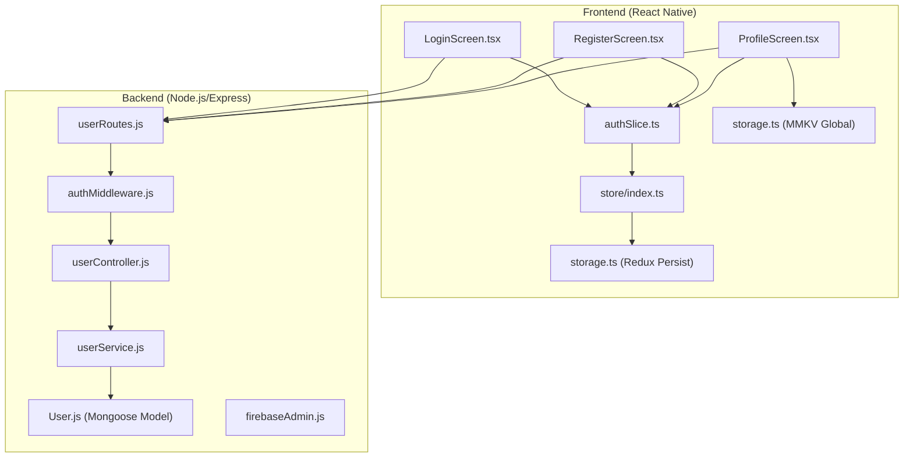
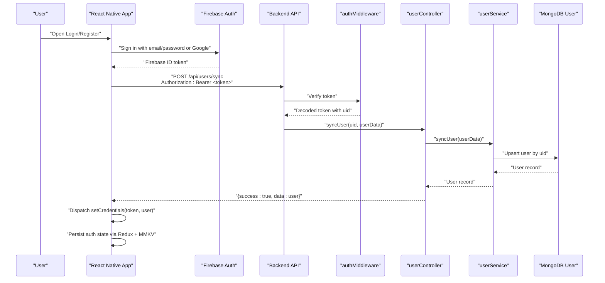
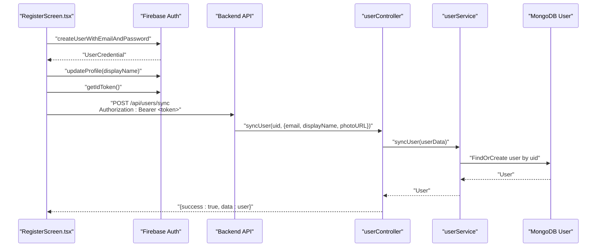
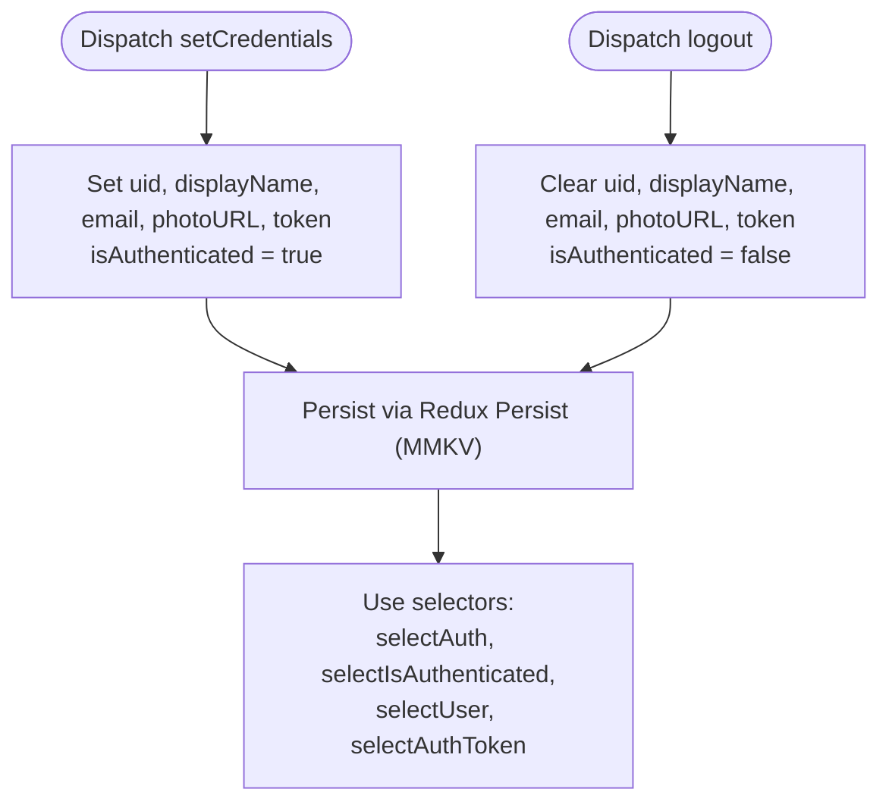
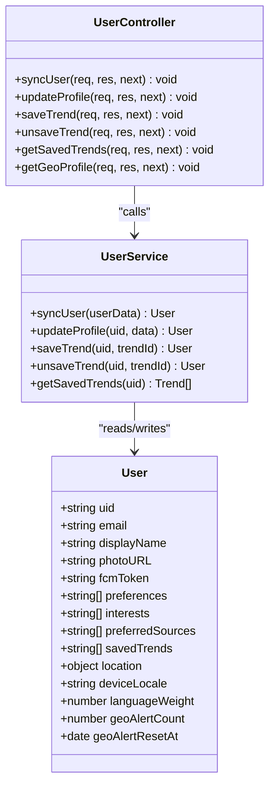
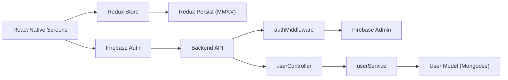

# User Authentication System

<cite>
**Referenced Files in This Document**
- [authSlice.ts](file://AITrendTracker7/src/store/slices/authSlice.ts)
- [storage.ts](file://AITrendTracker7/src/store/storage.ts)
- [index.ts](file://AITrendTracker7/src/store/index.ts)
- [storage.ts](file://AITrendTracker7/src/utils/storage.ts)
- [LoginScreen.tsx](file://AITrendTracker7/src/navigations/screens/LoginScreen.tsx)
- [RegisterScreen.tsx](file://AITrendTracker7/src/navigations/screens/RegisterScreen.tsx)
- [ProfileScreen.tsx](file://AITrendTracker7/src/navigations/screens/ProfileScreen.tsx)
- [userRoutes.js](file://backend/src/routes/userRoutes.js)
- [userController.js](file://backend/src/controllers/userController.js)
- [authMiddleware.js](file://backend/src/middlewares/authMiddleware.js)
- [userService.js](file://backend/src/services/userService.js)
- [User.js](file://backend/src/models/User.js)
- [firebaseAdmin.js](file://backend/src/utils/firebaseAdmin.js)
</cite>

## Table of Contents
1. [Introduction](#introduction)
2. [Project Structure](#project-structure)
3. [Core Components](#core-components)
4. [Architecture Overview](#architecture-overview)
5. [Detailed Component Analysis](#detailed-component-analysis)
6. [Dependency Analysis](#dependency-analysis)
7. [Performance Considerations](#performance-considerations)
8. [Security Considerations](#security-considerations)
9. [Troubleshooting Guide](#troubleshooting-guide)
10. [Conclusion](#conclusion)

## Introduction
This document provides comprehensive documentation for the user authentication system. It covers the complete authentication flow including registration, login, profile management, and session handling. It explains the integration with Firebase Authentication for identity verification, token management, and secure session persistence. It also details the Redux slice implementation for state management, including authentication reducers, selectors, and persistence strategies. On the backend, it documents the user controller implementation, user model schema, and middleware for authentication validation. Additional topics include security considerations, password hashing, JWT token handling, session expiration, email verification workflows, and profile update mechanisms. Common authentication scenarios, error handling, and user experience patterns are addressed to ensure seamless authentication flows.

## Project Structure
The authentication system spans both the frontend React Native application and the backend Node.js/Express server. The frontend handles user interactions, integrates with Firebase Authentication, manages Redux state, and persists tokens and user profiles securely. The backend validates tokens, synchronizes users, updates profiles, and exposes protected routes.

**Diagram sources**
- [LoginScreen.tsx:1-364](file://AITrendTracker7/src/navigations/screens/LoginScreen.tsx#L1-L364)
- [RegisterScreen.tsx:1-410](file://AITrendTracker7/src/navigations/screens/RegisterScreen.tsx#L1-L410)
- [ProfileScreen.tsx:1-637](file://AITrendTracker7/src/navigations/screens/ProfileScreen.tsx#L1-L637)
- [authSlice.ts:1-63](file://AITrendTracker7/src/store/slices/authSlice.ts#L1-L63)
- [storage.ts:1-23](file://AITrendTracker7/src/store/storage.ts#L1-L23)
- [index.ts:1-46](file://AITrendTracker7/src/store/index.ts#L1-L46)
- [storage.ts:1-95](file://AITrendTracker7/src/utils/storage.ts#L1-L95)
- [userRoutes.js:1-18](file://backend/src/routes/userRoutes.js#L1-L18)
- [authMiddleware.js:1-27](file://backend/src/middlewares/authMiddleware.js#L1-L27)
- [userController.js:1-90](file://backend/src/controllers/userController.js#L1-L90)
- [userService.js:1-55](file://backend/src/services/userService.js#L1-L55)
- [User.js:1-35](file://backend/src/models/User.js#L1-L35)
- [firebaseAdmin.js:1-23](file://backend/src/utils/firebaseAdmin.js#L1-L23)

**Section sources**
- [authSlice.ts:1-63](file://AITrendTracker7/src/store/slices/authSlice.ts#L1-L63)
- [storage.ts:1-23](file://AITrendTracker7/src/store/storage.ts#L1-L23)
- [index.ts:1-46](file://AITrendTracker7/src/store/index.ts#L1-L46)
- [storage.ts:1-95](file://AITrendTracker7/src/utils/storage.ts#L1-L95)
- [LoginScreen.tsx:1-364](file://AITrendTracker7/src/navigations/screens/LoginScreen.tsx#L1-L364)
- [RegisterScreen.tsx:1-410](file://AITrendTracker7/src/navigations/screens/RegisterScreen.tsx#L1-L410)
- [ProfileScreen.tsx:1-637](file://AITrendTracker7/src/navigations/screens/ProfileScreen.tsx#L1-L637)
- [userRoutes.js:1-18](file://backend/src/routes/userRoutes.js#L1-L18)
- [authMiddleware.js:1-27](file://backend/src/middlewares/authMiddleware.js#L1-L27)
- [userController.js:1-90](file://backend/src/controllers/userController.js#L1-L90)
- [userService.js:1-55](file://backend/src/services/userService.js#L1-L55)
- [User.js:1-35](file://backend/src/models/User.js#L1-L35)
- [firebaseAdmin.js:1-23](file://backend/src/utils/firebaseAdmin.js#L1-L23)

## Core Components
- Frontend authentication UI screens:
  - LoginScreen.tsx: Handles email/password and Google sign-in, navigates on success, displays localized error messages.
  - RegisterScreen.tsx: Handles email/password registration, Google sign-in, updates display name, and synchronizes with backend after creation.
  - ProfileScreen.tsx: Manages profile updates (display name, avatar), toggles settings, and logs out.
- Redux state management:
  - authSlice.ts: Defines authentication state shape, reducers (setCredentials, logout), and selectors (selectAuth, selectIsAuthenticated, selectUser, selectAuthToken).
  - storage.ts (Redux Persist): Encrypted MMKV-backed persistence for Redux store.
  - index.ts: Configures Redux store with persisted auth slice and API slice middleware.
  - storage.ts (Global MMKV): Encrypted storage for auth tokens and user profile snapshots.
- Backend authentication and user management:
  - userRoutes.js: Exposes protected endpoints for user synchronization, profile updates, saved trends, and geo profile retrieval.
  - authMiddleware.js: Verifies Firebase ID tokens from Authorization headers and attaches decoded user info to requests.
  - userController.js: Implements handlers for sync, profile update, save/unsave trends, and geo profile retrieval.
  - userService.js: Performs database operations for user synchronization, profile updates, and saved trends.
  - User.js: Mongoose model defining user schema, indices, and location fields.
  - firebaseAdmin.js: Initializes Firebase Admin SDK and provides the admin instance for token verification.

**Section sources**
- [LoginScreen.tsx:1-364](file://AITrendTracker7/src/navigations/screens/LoginScreen.tsx#L1-L364)
- [RegisterScreen.tsx:1-410](file://AITrendTracker7/src/navigations/screens/RegisterScreen.tsx#L1-L410)
- [ProfileScreen.tsx:1-637](file://AITrendTracker7/src/navigations/screens/ProfileScreen.tsx#L1-L637)
- [authSlice.ts:1-63](file://AITrendTracker7/src/store/slices/authSlice.ts#L1-L63)
- [storage.ts:1-23](file://AITrendTracker7/src/store/storage.ts#L1-L23)
- [index.ts:1-46](file://AITrendTracker7/src/store/index.ts#L1-L46)
- [storage.ts:1-95](file://AITrendTracker7/src/utils/storage.ts#L1-L95)
- [userRoutes.js:1-18](file://backend/src/routes/userRoutes.js#L1-L18)
- [authMiddleware.js:1-27](file://backend/src/middlewares/authMiddleware.js#L1-L27)
- [userController.js:1-90](file://backend/src/controllers/userController.js#L1-L90)
- [userService.js:1-55](file://backend/src/services/userService.js#L1-L55)
- [User.js:1-35](file://backend/src/models/User.js#L1-L35)
- [firebaseAdmin.js:1-23](file://backend/src/utils/firebaseAdmin.js#L1-L23)

## Architecture Overview
The authentication architecture integrates Firebase Authentication for identity and Firebase Admin for token verification on the backend. The frontend obtains ID tokens from Firebase and sends them to backend endpoints secured by authMiddleware. The backend verifies tokens, resolves the user’s uid, and performs user synchronization and profile updates. Redux persists authentication state and selected UI state, while MMKV provides secure, encrypted storage for tokens and offline caches.

**Diagram sources**
- [LoginScreen.tsx:40-63](file://AITrendTracker7/src/navigations/screens/LoginScreen.tsx#L40-L63)
- [RegisterScreen.tsx:45-67](file://AITrendTracker7/src/navigations/screens/RegisterScreen.tsx#L45-L67)
- [userRoutes.js](file://backend/src/routes/userRoutes.js#L6)
- [authMiddleware.js:3-24](file://backend/src/middlewares/authMiddleware.js#L3-L24)
- [userController.js:4-21](file://backend/src/controllers/userController.js#L4-L21)
- [userService.js:4-17](file://backend/src/services/userService.js#L4-L17)
- [User.js:3-29](file://backend/src/models/User.js#L3-L29)
- [authSlice.ts:22-47](file://AITrendTracker7/src/store/slices/authSlice.ts#L22-L47)
- [storage.ts:1-23](file://AITrendTracker7/src/store/storage.ts#L1-L23)

## Detailed Component Analysis

### Frontend Authentication Screens
- LoginScreen.tsx
  - Implements email/password login and Google sign-in flows.
  - Displays localized error messages for common Firebase Auth error codes.
  - Navigates to Home upon successful authentication.
- RegisterScreen.tsx
  - Implements email/password registration and Google sign-in.
  - Updates the user’s display name locally after creation.
  - Synchronizes user data with backend using Firebase ID token.
- ProfileScreen.tsx
  - Allows updating display name and avatar.
  - Uses Cloudinary to upload avatar and updates both Firebase and backend.
  - Toggles push notifications and dark mode settings persisted via AsyncStorage.
  - Logs out the user and navigates to Login.

**Diagram sources**
- [RegisterScreen.tsx:69-105](file://AITrendTracker7/src/navigations/screens/RegisterScreen.tsx#L69-L105)
- [RegisterScreen.tsx:45-67](file://AITrendTracker7/src/navigations/screens/RegisterScreen.tsx#L45-L67)
- [userController.js:4-21](file://backend/src/controllers/userController.js#L4-L21)
- [userService.js:4-17](file://backend/src/services/userService.js#L4-L17)
- [User.js:3-29](file://backend/src/models/User.js#L3-L29)

**Section sources**
- [LoginScreen.tsx:1-364](file://AITrendTracker7/src/navigations/screens/LoginScreen.tsx#L1-L364)
- [RegisterScreen.tsx:1-410](file://AITrendTracker7/src/navigations/screens/RegisterScreen.tsx#L1-L410)
- [ProfileScreen.tsx:1-637](file://AITrendTracker7/src/navigations/screens/ProfileScreen.tsx#L1-L637)

### Redux Authentication Slice and Persistence
- authSlice.ts
  - Defines AuthState with uid, displayName, email, photoURL, token, and isAuthenticated.
  - Reducers:
    - setCredentials: stores token and user profile, marks user as authenticated.
    - logout: clears token and user profile, marks user as unauthenticated.
  - Selectors:
    - selectAuth, selectIsAuthenticated, selectUser, selectAuthToken.
- storage.ts (Redux Persist)
  - Creates an encrypted MMKV-backed storage for Redux persistence.
- index.ts
  - Configures Redux store with persisted auth slice and API middleware.
  - Whitelists auth, ui, and trends for persistence.
- storage.ts (Global MMKV)
  - Provides typed helpers for JSON, offline caching, and auth token caching.

**Diagram sources**
- [authSlice.ts:22-47](file://AITrendTracker7/src/store/slices/authSlice.ts#L22-L47)
- [storage.ts:1-23](file://AITrendTracker7/src/store/storage.ts#L1-L23)
- [index.ts:14-42](file://AITrendTracker7/src/store/index.ts#L14-L42)
- [storage.ts:71-84](file://AITrendTracker7/src/utils/storage.ts#L71-L84)

**Section sources**
- [authSlice.ts:1-63](file://AITrendTracker7/src/store/slices/authSlice.ts#L1-L63)
- [storage.ts:1-23](file://AITrendTracker7/src/store/storage.ts#L1-L23)
- [index.ts:1-46](file://AITrendTracker7/src/store/index.ts#L1-L46)
- [storage.ts:1-95](file://AITrendTracker7/src/utils/storage.ts#L1-L95)

### Backend Authentication Middleware and Controllers
- authMiddleware.js
  - Extracts Authorization header, verifies Firebase ID token, and attaches decoded token to req.user.
  - Returns 401 for missing or invalid/expired tokens.
- userRoutes.js
  - Protects routes with verifyToken middleware.
  - Endpoints: POST /sync, PUT /profile, POST /save, GET /saved, DELETE /save/:trendId, GET /geo-profile.
- userController.js
  - syncUser: Upserts user by uid, auto-resolves geo location from IP, returns user and geo data.
  - updateProfile: Updates user preferences, FCM token, display name, photo URL, interests, and preferred sources.
  - saveTrend/unsaveTrend/getSavedTrends: Manages saved trends for a user.
  - getGeoProfile: Returns resolved geo profile for the user.
- userService.js
  - syncUser: Creates or updates user with email/displayName/photoURL.
  - updateProfile: Updates profile fields atomically.
  - saveTrend/unsaveTrend: Adds or removes trendId from savedTrends array.
  - getSavedTrends: Returns full trend details for saved trendIds.
- User.js (Model)
  - Schema includes uid, email, displayName, photoURL, fcmToken, preferences, interests, preferredSources, savedTrends, location, deviceLocale, languageWeight, geoAlertCount, geoAlertResetAt, and timestamps.
  - Includes a compound index on location fields.

**Diagram sources**
- [User.js:3-29](file://backend/src/models/User.js#L3-L29)
- [userService.js:4-55](file://backend/src/services/userService.js#L4-L55)
- [userController.js:4-89](file://backend/src/controllers/userController.js#L4-L89)

**Section sources**
- [authMiddleware.js:1-27](file://backend/src/middlewares/authMiddleware.js#L1-L27)
- [userRoutes.js:1-18](file://backend/src/routes/userRoutes.js#L1-L18)
- [userController.js:1-90](file://backend/src/controllers/userController.js#L1-L90)
- [userService.js:1-55](file://backend/src/services/userService.js#L1-L55)
- [User.js:1-35](file://backend/src/models/User.js#L1-L35)

### Firebase Admin Integration
- firebaseAdmin.js
  - Initializes Firebase Admin SDK using a service account key.
  - Prevents duplicate app initialization to avoid hot reload errors.
  - Provides admin instance for verifying ID tokens.

**Section sources**
- [firebaseAdmin.js:1-23](file://backend/src/utils/firebaseAdmin.js#L1-L23)

## Dependency Analysis
The frontend depends on Firebase Authentication for identity and Redux for state management. The backend depends on Firebase Admin for token verification and Mongoose for user persistence. Routes depend on middleware for authentication, controllers for business logic, and services for data operations.

**Diagram sources**
- [LoginScreen.tsx](file://AITrendTracker7/src/navigations/screens/LoginScreen.tsx#L21)
- [RegisterScreen.tsx](file://AITrendTracker7/src/navigations/screens/RegisterScreen.tsx#L21)
- [ProfileScreen.tsx](file://AITrendTracker7/src/navigations/screens/ProfileScreen.tsx#L19)
- [authSlice.ts](file://AITrendTracker7/src/store/slices/authSlice.ts#L1)
- [storage.ts](file://AITrendTracker7/src/store/storage.ts#L1)
- [authMiddleware.js](file://backend/src/middlewares/authMiddleware.js#L1)
- [firebaseAdmin.js](file://backend/src/utils/firebaseAdmin.js#L1)
- [userController.js](file://backend/src/controllers/userController.js#L1)
- [userService.js](file://backend/src/services/userService.js#L1)
- [User.js](file://backend/src/models/User.js#L1)

**Section sources**
- [LoginScreen.tsx:1-364](file://AITrendTracker7/src/navigations/screens/LoginScreen.tsx#L1-L364)
- [RegisterScreen.tsx:1-410](file://AITrendTracker7/src/navigations/screens/RegisterScreen.tsx#L1-L410)
- [ProfileScreen.tsx:1-637](file://AITrendTracker7/src/navigations/screens/ProfileScreen.tsx#L1-L637)
- [authSlice.ts:1-63](file://AITrendTracker7/src/store/slices/authSlice.ts#L1-L63)
- [storage.ts:1-23](file://AITrendTracker7/src/store/storage.ts#L1-L23)
- [authMiddleware.js:1-27](file://backend/src/middlewares/authMiddleware.js#L1-L27)
- [firebaseAdmin.js:1-23](file://backend/src/utils/firebaseAdmin.js#L1-L23)
- [userController.js:1-90](file://backend/src/controllers/userController.js#L1-L90)
- [userService.js:1-55](file://backend/src/services/userService.js#L1-L55)
- [User.js:1-35](file://backend/src/models/User.js#L1-L35)

## Performance Considerations
- Use encrypted MMKV for Redux persistence to avoid unnecessary serialization overhead and improve startup speed.
- Minimize network calls by batching profile updates and caching frequently accessed user data locally.
- Leverage Firebase ID tokens for lightweight bearer authentication instead of long-lived sessions.
- Offload heavy computations (e.g., geo resolution) to backend services and cache results where appropriate.

## Security Considerations
- Token handling:
  - Frontend obtains ID tokens from Firebase and passes them in Authorization headers.
  - Backend verifies tokens using Firebase Admin and rejects invalid/expired tokens.
- Password handling:
  - Passwords are managed by Firebase Authentication; backend does not hash passwords directly.
- Session persistence:
  - Tokens and sensitive user data are stored in encrypted MMKV.
  - Global MMKV storage includes dedicated helpers for auth tokens and user profiles.
- Access control:
  - All user endpoints are protected by authMiddleware; unauthorized requests are rejected.
- Email verification:
  - Not implemented in the provided code; consider integrating Firebase email verification flows if required.

**Section sources**
- [authMiddleware.js:3-24](file://backend/src/middlewares/authMiddleware.js#L3-L24)
- [userRoutes.js:6-15](file://backend/src/routes/userRoutes.js#L6-L15)
- [storage.ts:1-23](file://AITrendTracker7/src/store/storage.ts#L1-L23)
- [storage.ts:71-84](file://AITrendTracker7/src/utils/storage.ts#L71-L84)
- [firebaseAdmin.js:1-23](file://backend/src/utils/firebaseAdmin.js#L1-L23)

## Troubleshooting Guide
- Common frontend errors:
  - Invalid credentials or account not found during login: handled with localized alerts.
  - Incorrect password or invalid email format: handled with localized alerts.
  - Google Sign-In failures: surfaced via alerts with error messages.
- Backend token verification errors:
  - Missing or malformed Authorization header: returns 401 Unauthorized.
  - Invalid or expired token: returns 401 Unauthorized with error message.
- Profile update issues:
  - Avatar uploads via Cloudinary: errors are surfaced via alerts; verify upload preset and network connectivity.
- State persistence issues:
  - If authentication state resets unexpectedly, check Redux persist configuration and MMKV storage permissions.

**Section sources**
- [LoginScreen.tsx:40-63](file://AITrendTracker7/src/navigations/screens/LoginScreen.tsx#L40-L63)
- [RegisterScreen.tsx:69-105](file://AITrendTracker7/src/navigations/screens/RegisterScreen.tsx#L69-L105)
- [ProfileScreen.tsx:124-184](file://AITrendTracker7/src/navigations/screens/ProfileScreen.tsx#L124-L184)
- [authMiddleware.js:7-23](file://backend/src/middlewares/authMiddleware.js#L7-L23)
- [userController.js:18-20](file://backend/src/controllers/userController.js#L18-L20)

## Conclusion
The authentication system integrates Firebase Authentication for identity, Firebase Admin for token verification, and a robust Redux state management layer with encrypted persistence. The backend enforces authentication via middleware, exposes protected user endpoints, and maintains a flexible user model with geolocation and preferences. Together, these components deliver a secure, performant, and user-friendly authentication experience with clear separation of concerns and maintainable code.