# User Experience Features

<cite>
**Referenced Files in This Document**
- [ErrorBoundary.tsx](file://AITrendTracker7/src/components/common/ErrorBoundary.tsx)
- [OfflineBanner.tsx](file://AITrendTracker7/src/components/common/OfflineBanner.tsx)
- [AIChatScreen.tsx](file://AITrendTracker7/src/navigations/screens/AIChatScreen.tsx)
- [TrendDetailScreen.tsx](file://AITrendTracker7/src/navigations/screens/TrendDetailScreen.tsx)
- [NotificationsScreen.tsx](file://AITrendTracker7/src/navigations/screens/NotificationsScreen.tsx)
- [TrendAnalysisScreen.tsx](file://AITrendTracker7/src/navigations/screens/TrendAnalysisScreen.tsx)
- [AIExplainability.tsx](file://AITrendTracker7/src/components/ai/AIExplainability.tsx)
- [ConfidenceRing.tsx](file://AITrendTracker7/src/components/ai/ConfidenceRing.tsx)
- [PlatformIntelligenceBadges.tsx](file://AITrendTracker7/src/components/ai/PlatformIntelligenceBadges.tsx)
- [RelationshipGraph.tsx](file://AITrendTracker7/src/components/ai/RelationshipGraph.tsx)
- [notificationsSlice.ts](file://AITrendTracker7/src/store/slices/notificationsSlice.ts)
- [savedStorage.ts](file://AITrendTracker7/src/utils/savedStorage.ts)
- [storage.ts](file://AITrendTracker7/src/utils/storage.ts)
- [ToastProvider.tsx](file://AITrendTracker7/src/context/ToastProvider.tsx)
- [config.ts](file://AITrendTracker7/src/utils/config.ts)
- [index.ts](file://AITrendTracker7/src/store/index.ts)
</cite>

## Table of Contents
1. [Introduction](#introduction)
2. [Project Structure](#project-structure)
3. [Core Components](#core-components)
4. [Architecture Overview](#architecture-overview)
5. [Detailed Component Analysis](#detailed-component-analysis)
6. [Dependency Analysis](#dependency-analysis)
7. [Performance Considerations](#performance-considerations)
8. [Troubleshooting Guide](#troubleshooting-guide)
9. [Conclusion](#conclusion)
10. [Appendices](#appendices)

## Introduction
This document focuses on user experience enhancements across the application, including the saved trends management system, notification center, AI chat interface, and trend detail exploration. It also covers error boundaries, offline banner functionality, progressive web app capabilities, notification controller implementation, push notification handling, user preference management, AI chat integration with trend analysis, conversational AI patterns, contextual assistance features, trend detail screen architecture, rich content presentation, interactive exploration, offline-first architecture, data synchronization strategies, error handling patterns, accessibility features, responsive design patterns, and cross-platform user experience consistency.

## Project Structure
The user experience features span several layers:
- Navigation screens for AI chat, notifications, trend detail, and trend analysis
- Common UX components for error handling and offline awareness
- AI explainability components for confidence visualization, platform trust badges, and relationship graphs
- Storage utilities for offline caching and user preferences
- Redux store for notifications and persistence
- Toast provider for non-blocking feedback

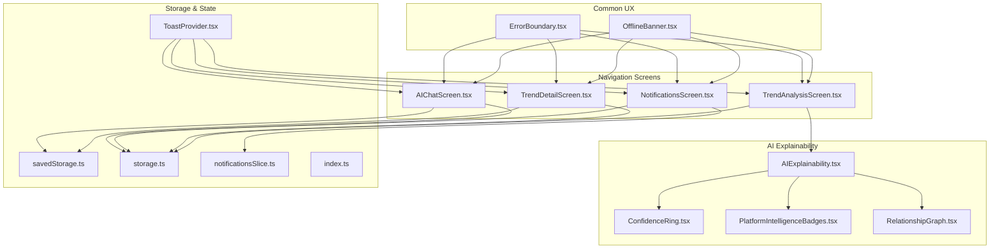

**Diagram sources**
- [AIChatScreen.tsx:1-281](file://AITrendTracker7/src/navigations/screens/AIChatScreen.tsx#L1-L281)
- [NotificationsScreen.tsx:1-410](file://AITrendTracker7/src/navigations/screens/NotificationsScreen.tsx#L1-L410)
- [TrendDetailScreen.tsx:1-284](file://AITrendTracker7/src/navigations/screens/TrendDetailScreen.tsx#L1-L284)
- [TrendAnalysisScreen.tsx:1-308](file://AITrendTracker7/src/navigations/screens/TrendAnalysisScreen.tsx#L1-L308)
- [ErrorBoundary.tsx:1-83](file://AITrendTracker7/src/components/common/ErrorBoundary.tsx#L1-L83)
- [OfflineBanner.tsx:1-45](file://AITrendTracker7/src/components/common/OfflineBanner.tsx#L1-L45)
- [AIExplainability.tsx:1-210](file://AITrendTracker7/src/components/ai/AIExplainability.tsx#L1-L210)
- [ConfidenceRing.tsx:1-137](file://AITrendTracker7/src/components/ai/ConfidenceRing.tsx#L1-L137)
- [PlatformIntelligenceBadges.tsx:1-83](file://AITrendTracker7/src/components/ai/PlatformIntelligenceBadges.tsx#L1-L83)
- [RelationshipGraph.tsx:1-170](file://AITrendTracker7/src/components/ai/RelationshipGraph.tsx#L1-L170)
- [savedStorage.ts:1-79](file://AITrendTracker7/src/utils/savedStorage.ts#L1-L79)
- [storage.ts:1-95](file://AITrendTracker7/src/utils/storage.ts#L1-L95)
- [notificationsSlice.ts:1-57](file://AITrendTracker7/src/store/slices/notificationsSlice.ts#L1-L57)
- [index.ts:1-46](file://AITrendTracker7/src/store/index.ts#L1-L46)
- [ToastProvider.tsx:1-86](file://AITrendTracker7/src/context/ToastProvider.tsx#L1-L86)

**Section sources**
- [AIChatScreen.tsx:1-281](file://AITrendTracker7/src/navigations/screens/AIChatScreen.tsx#L1-L281)
- [NotificationsScreen.tsx:1-410](file://AITrendTracker7/src/navigations/screens/NotificationsScreen.tsx#L1-L410)
- [TrendDetailScreen.tsx:1-284](file://AITrendTracker7/src/navigations/screens/TrendDetailScreen.tsx#L1-L284)
- [TrendAnalysisScreen.tsx:1-308](file://AITrendTracker7/src/navigations/screens/TrendAnalysisScreen.tsx#L1-L308)
- [ErrorBoundary.tsx:1-83](file://AITrendTracker7/src/components/common/ErrorBoundary.tsx#L1-L83)
- [OfflineBanner.tsx:1-45](file://AITrendTracker7/src/components/common/OfflineBanner.tsx#L1-L45)
- [AIExplainability.tsx:1-210](file://AITrendTracker7/src/components/ai/AIExplainability.tsx#L1-L210)
- [ConfidenceRing.tsx:1-137](file://AITrendTracker7/src/components/ai/ConfidenceRing.tsx#L1-L137)
- [PlatformIntelligenceBadges.tsx:1-83](file://AITrendTracker7/src/components/ai/PlatformIntelligenceBadges.tsx#L1-L83)
- [RelationshipGraph.tsx:1-170](file://AITrendTracker7/src/components/ai/RelationshipGraph.tsx#L1-L170)
- [savedStorage.ts:1-79](file://AITrendTracker7/src/utils/savedStorage.ts#L1-L79)
- [storage.ts:1-95](file://AITrendTracker7/src/utils/storage.ts#L1-L95)
- [notificationsSlice.ts:1-57](file://AITrendTracker7/src/store/slices/notificationsSlice.ts#L1-L57)
- [index.ts:1-46](file://AITrendTracker7/src/store/index.ts#L1-L46)
- [ToastProvider.tsx:1-86](file://AITrendTracker7/src/context/ToastProvider.tsx#L1-L86)

## Core Components
- Error Boundary: Graceful degradation with a reset mechanism and styled UI for recoverable errors.
- Offline Banner: Persistent top banner indicating offline state and cached data mode.
- AI Chat Screen: Conversational AI with trend context, message history, and typing indicators.
- Notifications Screen: Fetch, display, and manage notifications with read/unread states and actions.
- Trend Detail Screen: Rich content presentation with save/share actions and AI analysis navigation.
- Trend Analysis Screen: AI-generated insights with metrics, drivers, and predictions.
- AI Explainability Components: Confidence visualization, platform trust badges, and relationship graphs.
- Saved Trends Management: Backend-backed save/unsave and check logic.
- Offline-First Storage: Encrypted MMKV caching for home feed and auth tokens.
- Redux Notifications Slice: Local state for system alerts and unread counts.
- Toast Provider: Non-intrusive feedback with animations.

**Section sources**
- [ErrorBoundary.tsx:1-83](file://AITrendTracker7/src/components/common/ErrorBoundary.tsx#L1-L83)
- [OfflineBanner.tsx:1-45](file://AITrendTracker7/src/components/common/OfflineBanner.tsx#L1-L45)
- [AIChatScreen.tsx:1-281](file://AITrendTracker7/src/navigations/screens/AIChatScreen.tsx#L1-L281)
- [NotificationsScreen.tsx:1-410](file://AITrendTracker7/src/navigations/screens/NotificationsScreen.tsx#L1-L410)
- [TrendDetailScreen.tsx:1-284](file://AITrendTracker7/src/navigations/screens/TrendDetailScreen.tsx#L1-L284)
- [TrendAnalysisScreen.tsx:1-308](file://AITrendTracker7/src/navigations/screens/TrendAnalysisScreen.tsx#L1-L308)
- [AIExplainability.tsx:1-210](file://AITrendTracker7/src/components/ai/AIExplainability.tsx#L1-L210)
- [ConfidenceRing.tsx:1-137](file://AITrendTracker7/src/components/ai/ConfidenceRing.tsx#L1-L137)
- [PlatformIntelligenceBadges.tsx:1-83](file://AITrendTracker7/src/components/ai/PlatformIntelligenceBadges.tsx#L1-L83)
- [RelationshipGraph.tsx:1-170](file://AITrendTracker7/src/components/ai/RelationshipGraph.tsx#L1-L170)
- [savedStorage.ts:1-79](file://AITrendTracker7/src/utils/savedStorage.ts#L1-L79)
- [storage.ts:1-95](file://AITrendTracker7/src/utils/storage.ts#L1-L95)
- [notificationsSlice.ts:1-57](file://AITrendTracker7/src/store/slices/notificationsSlice.ts#L1-L57)
- [ToastProvider.tsx:1-86](file://AITrendTracker7/src/context/ToastProvider.tsx#L1-L86)

## Architecture Overview
The user experience architecture integrates UI screens, shared UX components, AI explainability visuals, and persistent storage. Notifications are handled both locally via Redux and remotely via API. Saved trends leverage Firebase Auth for secure backend operations. Offline-first caching uses MMKV for fast, encrypted storage.

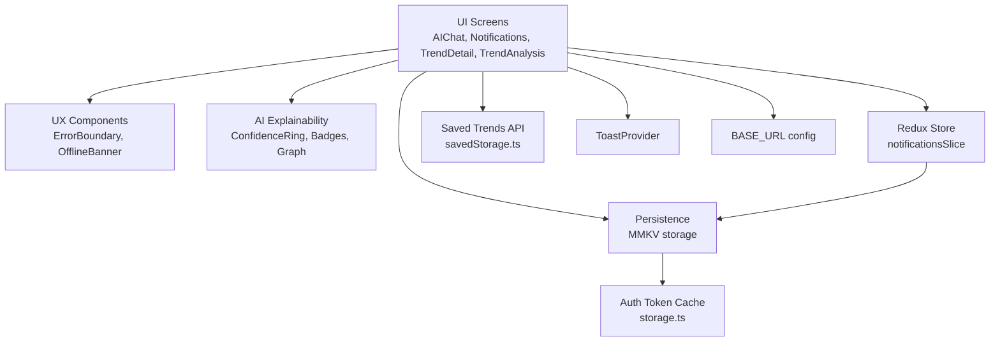

**Diagram sources**
- [AIChatScreen.tsx:1-281](file://AITrendTracker7/src/navigations/screens/AIChatScreen.tsx#L1-L281)
- [NotificationsScreen.tsx:1-410](file://AITrendTracker7/src/navigations/screens/NotificationsScreen.tsx#L1-L410)
- [TrendDetailScreen.tsx:1-284](file://AITrendTracker7/src/navigations/screens/TrendDetailScreen.tsx#L1-L284)
- [TrendAnalysisScreen.tsx:1-308](file://AITrendTracker7/src/navigations/screens/TrendAnalysisScreen.tsx#L1-L308)
- [ErrorBoundary.tsx:1-83](file://AITrendTracker7/src/components/common/ErrorBoundary.tsx#L1-L83)
- [OfflineBanner.tsx:1-45](file://AITrendTracker7/src/components/common/OfflineBanner.tsx#L1-L45)
- [AIExplainability.tsx:1-210](file://AITrendTracker7/src/components/ai/AIExplainability.tsx#L1-L210)
- [ConfidenceRing.tsx:1-137](file://AITrendTracker7/src/components/ai/ConfidenceRing.tsx#L1-L137)
- [PlatformIntelligenceBadges.tsx:1-83](file://AITrendTracker7/src/components/ai/PlatformIntelligenceBadges.tsx#L1-L83)
- [RelationshipGraph.tsx:1-170](file://AITrendTracker7/src/components/ai/RelationshipGraph.tsx#L1-L170)
- [notificationsSlice.ts:1-57](file://AITrendTracker7/src/store/slices/notificationsSlice.ts#L1-L57)
- [storage.ts:1-95](file://AITrendTracker7/src/utils/storage.ts#L1-L95)
- [savedStorage.ts:1-79](file://AITrendTracker7/src/utils/savedStorage.ts#L1-L79)
- [ToastProvider.tsx:1-86](file://AITrendTracker7/src/context/ToastProvider.tsx#L1-L86)
- [config.ts:1-8](file://AITrendTracker7/src/utils/config.ts#L1-L8)

## Detailed Component Analysis

### Error Boundary
- Purpose: Wrap UI to catch rendering errors and present a reset option.
- Behavior: Captures uncaught errors, logs them, and renders a friendly UI with a Try Again button.
- UX Impact: Prevents app crashes and offers immediate recovery.

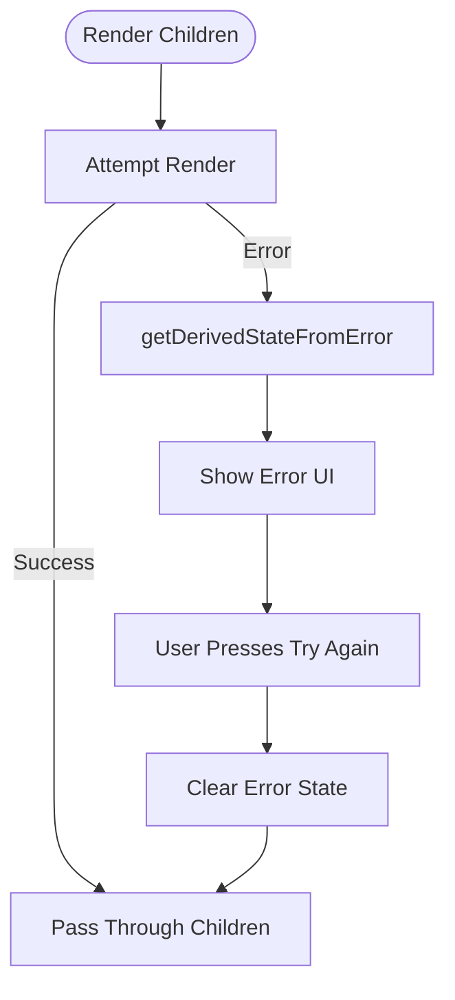

**Diagram sources**
- [ErrorBoundary.tsx:14-47](file://AITrendTracker7/src/components/common/ErrorBoundary.tsx#L14-L47)

**Section sources**
- [ErrorBoundary.tsx:1-83](file://AITrendTracker7/src/components/common/ErrorBoundary.tsx#L1-L83)

### Offline Banner
- Purpose: Notify users when offline and indicate cached data usage.
- Behavior: Subscribes to network state and displays a prominent banner at the top of the screen.
- UX Impact: Improves transparency during connectivity issues.

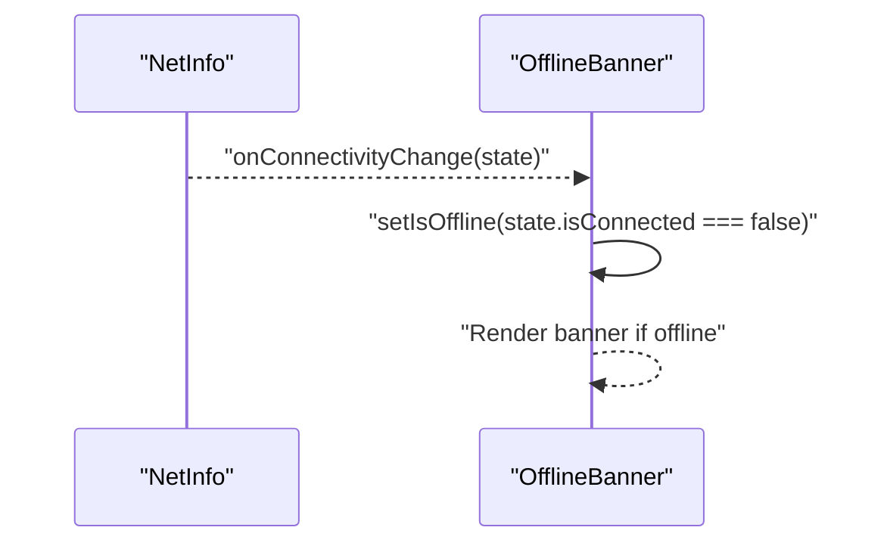

**Diagram sources**
- [OfflineBanner.tsx:9-23](file://AITrendTracker7/src/components/common/OfflineBanner.tsx#L9-L23)

**Section sources**
- [OfflineBanner.tsx:1-45](file://AITrendTracker7/src/components/common/OfflineBanner.tsx#L1-L45)

### AI Chat Interface
- Purpose: Provide contextual AI assistance with trend-aware conversations.
- Key Features:
  - Trend context injection into chat requests
  - Message history windowing to manage token limits
  - Typing indicators and error fallback messages
  - Gradient-styled UI with avatars and send controls
- API Integration: Sends user messages with optional trend context and receives AI replies.

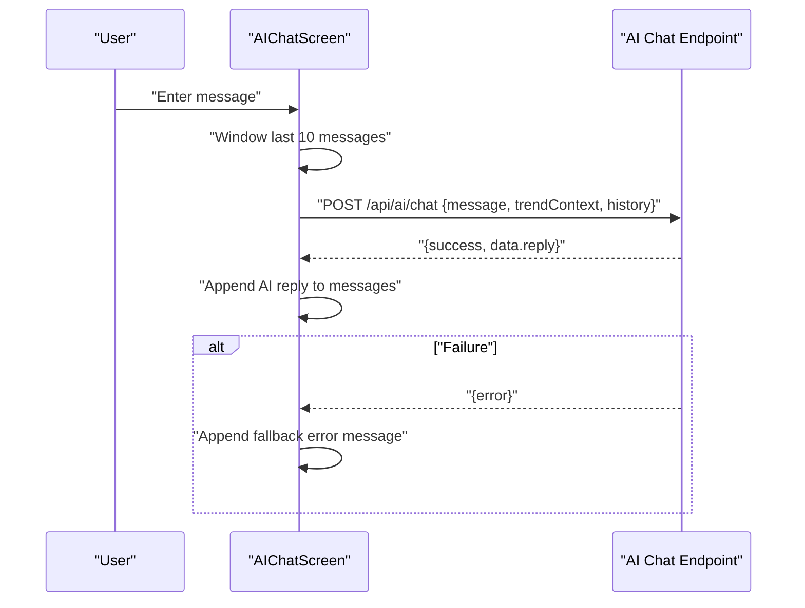

**Diagram sources**
- [AIChatScreen.tsx:38-94](file://AITrendTracker7/src/navigations/screens/AIChatScreen.tsx#L38-L94)
- [config.ts:5-7](file://AITrendTracker7/src/utils/config.ts#L5-L7)

**Section sources**
- [AIChatScreen.tsx:1-281](file://AITrendTracker7/src/navigations/screens/AIChatScreen.tsx#L1-L281)
- [config.ts:1-8](file://AITrendTracker7/src/utils/config.ts#L1-L8)

### Notification Center Implementation
- Purpose: Centralized hub for alerts with read/unread management and actions.
- Features:
  - Fetch notifications with Firebase Auth token
  - Mark all read and clear all actions
  - Per-item read marking and navigation to trend detail
  - Refresh control and skeleton loaders
- UX Impact: Streamlined alert management with visual cues for unread items.

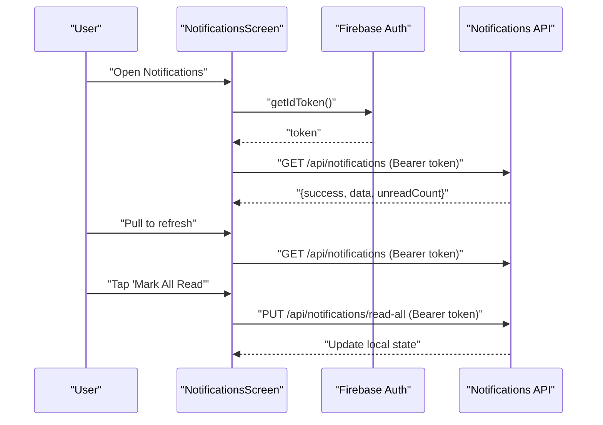

**Diagram sources**
- [NotificationsScreen.tsx:33-122](file://AITrendTracker7/src/navigations/screens/NotificationsScreen.tsx#L33-L122)

**Section sources**
- [NotificationsScreen.tsx:1-410](file://AITrendTracker7/src/navigations/screens/NotificationsScreen.tsx#L1-L410)

### Trend Detail Exploration
- Purpose: Present rich trend content with save, share, and AI analysis actions.
- Features:
  - Fallback content and image handling
  - Save/unsave toggled via backend APIs
  - Share action with preformatted text
  - Navigation to AI analysis screen
- UX Impact: Comprehensive, actionable detail page with social and analytical features.

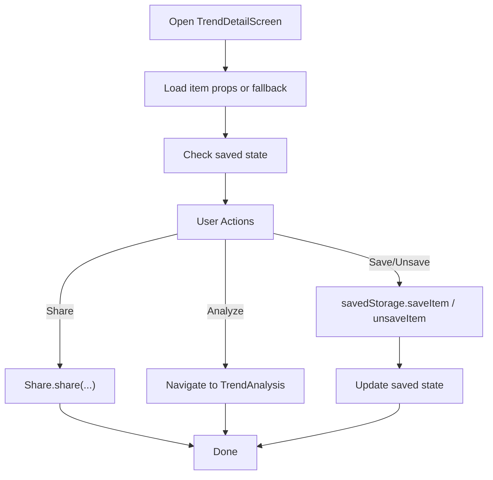

**Diagram sources**
- [TrendDetailScreen.tsx:41-64](file://AITrendTracker7/src/navigations/screens/TrendDetailScreen.tsx#L41-L64)
- [savedStorage.ts:32-78](file://AITrendTracker7/src/utils/savedStorage.ts#L32-L78)

**Section sources**
- [TrendDetailScreen.tsx:1-284](file://AITrendTracker7/src/navigations/screens/TrendDetailScreen.tsx#L1-L284)
- [savedStorage.ts:1-79](file://AITrendTracker7/src/utils/savedStorage.ts#L1-L79)

### Trend Analysis Screen
- Purpose: Display AI-generated insights, sentiment, virality, key drivers, and predictions.
- Features:
  - Metrics cards with progress bars
  - Key drivers list with icons
  - Prediction card with confidence
  - Navigation to detailed statistics
- UX Impact: Data-driven, visually engaging trend intelligence.

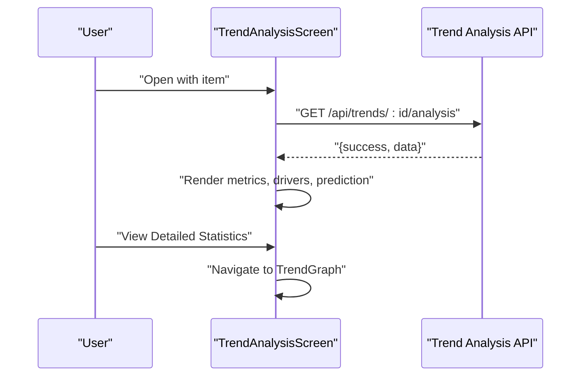

**Diagram sources**
- [TrendAnalysisScreen.tsx:26-42](file://AITrendTracker7/src/navigations/screens/TrendAnalysisScreen.tsx#L26-L42)

**Section sources**
- [TrendAnalysisScreen.tsx:1-308](file://AITrendTracker7/src/navigations/screens/TrendAnalysisScreen.tsx#L1-L308)

### AI Explainability Components
- ConfidenceRing: Animated ring with gradient color coding based on confidence thresholds.
- PlatformIntelligenceBadges: Trust and weight badges per platform with icons.
- RelationshipGraph: Static SVG graph showing central trend and surrounding connections.
- AIExplainability: Collapsible panel integrating all explainability visuals with expand/collapse animation.

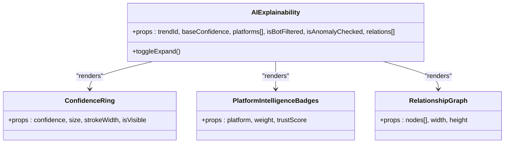

**Diagram sources**
- [AIExplainability.tsx:26-119](file://AITrendTracker7/src/components/ai/AIExplainability.tsx#L26-L119)
- [ConfidenceRing.tsx:24-117](file://AITrendTracker7/src/components/ai/ConfidenceRing.tsx#L24-L117)
- [PlatformIntelligenceBadges.tsx:12-44](file://AITrendTracker7/src/components/ai/PlatformIntelligenceBadges.tsx#L12-L44)
- [RelationshipGraph.tsx:24-161](file://AITrendTracker7/src/components/ai/RelationshipGraph.tsx#L24-L161)

**Section sources**
- [AIExplainability.tsx:1-210](file://AITrendTracker7/src/components/ai/AIExplainability.tsx#L1-L210)
- [ConfidenceRing.tsx:1-137](file://AITrendTracker7/src/components/ai/ConfidenceRing.tsx#L1-L137)
- [PlatformIntelligenceBadges.tsx:1-83](file://AITrendTracker7/src/components/ai/PlatformIntelligenceBadges.tsx#L1-L83)
- [RelationshipGraph.tsx:1-170](file://AITrendTracker7/src/components/ai/RelationshipGraph.tsx#L1-L170)

### Saved Trends Management System
- Backend Integration: Save/unsave and check saved items via authenticated endpoints.
- Token Handling: Retrieves Firebase Auth ID token for secure requests.
- UX Impact: Seamless bookmarking and retrieval of personalized content.

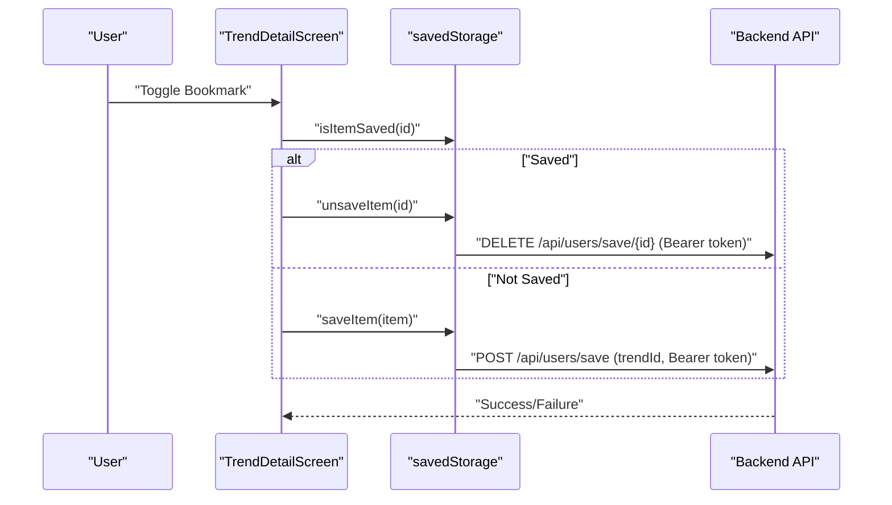

**Diagram sources**
- [TrendDetailScreen.tsx:45-53](file://AITrendTracker7/src/navigations/screens/TrendDetailScreen.tsx#L45-L53)
- [savedStorage.ts:32-78](file://AITrendTracker7/src/utils/savedStorage.ts#L32-L78)

**Section sources**
- [savedStorage.ts:1-79](file://AITrendTracker7/src/utils/savedStorage.ts#L1-L79)
- [TrendDetailScreen.tsx:1-284](file://AITrendTracker7/src/navigations/screens/TrendDetailScreen.tsx#L1-L284)

### Offline-First Architecture and Data Synchronization
- Encrypted MMKV Storage: Global store with typed helpers for JSON, offline snapshots, and auth tokens.
- Offline Feed Caching: Persist and retrieve home feed with staleness checks.
- Auth Token Caching: Securely cache and clear tokens.
- UX Impact: Fast startup, offline browsing, and seamless rehydration.

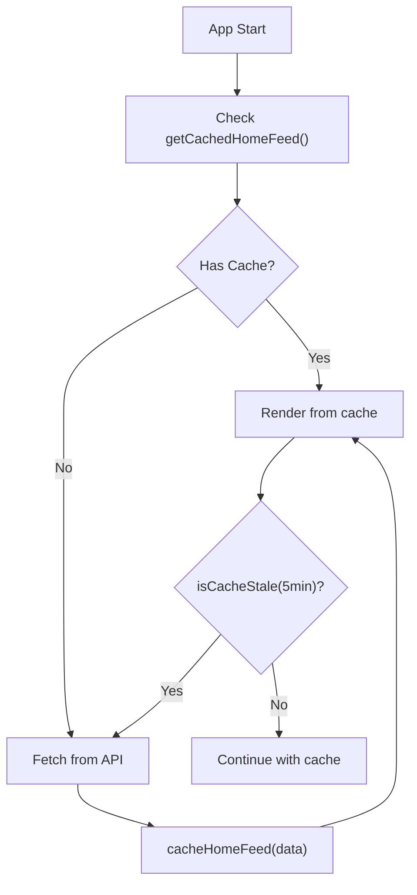

**Diagram sources**
- [storage.ts:45-69](file://AITrendTracker7/src/utils/storage.ts#L45-L69)

**Section sources**
- [storage.ts:1-95](file://AITrendTracker7/src/utils/storage.ts#L1-L95)

### Notification Controller Implementation and Push Handling
- Local Redux Notifications: Add, mark as read, and mark all as read actions.
- Remote API: Fetch notifications, mark read, clear all, and navigate to trend detail on press.
- UX Impact: Unified alert lifecycle with immediate visual feedback.

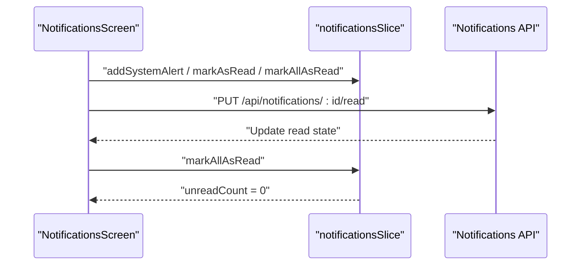

**Diagram sources**
- [notificationsSlice.ts:24-47](file://AITrendTracker7/src/store/slices/notificationsSlice.ts#L24-L47)
- [NotificationsScreen.tsx:71-122](file://AITrendTracker7/src/navigations/screens/NotificationsScreen.tsx#L71-L122)

**Section sources**
- [notificationsSlice.ts:1-57](file://AITrendTracker7/src/store/slices/notificationsSlice.ts#L1-L57)
- [NotificationsScreen.tsx:1-410](file://AITrendTracker7/src/navigations/screens/NotificationsScreen.tsx#L1-L410)

### User Preference Management and Personalization
- Redux Persistence: Whitelisted slices persisted via MMKV for consistent UI and auth state.
- Toast Feedback: Centralized toast provider for success/error/info messages.
- UX Impact: Consistent experience across sessions with minimal friction.

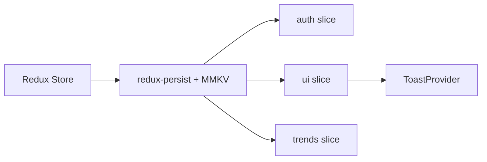

**Diagram sources**
- [index.ts:14-42](file://AITrendTracker7/src/store/index.ts#L14-L42)
- [ToastProvider.tsx:17-61](file://AITrendTracker7/src/context/ToastProvider.tsx#L17-L61)

**Section sources**
- [index.ts:1-46](file://AITrendTracker7/src/store/index.ts#L1-L46)
- [ToastProvider.tsx:1-86](file://AITrendTracker7/src/context/ToastProvider.tsx#L1-L86)

### Accessibility and Responsive Design
- Accessibility:
  - Expandable AI explainability with accessible roles and labels
  - Animated components respect reduced motion
  - Semantic icons and readable text sizes
- Responsive Design:
  - Dynamic sizing for charts and lists
  - Safe area contexts and adaptive layouts
  - Gradient backgrounds and consistent spacing

**Section sources**
- [AIExplainability.tsx:63-66](file://AITrendTracker7/src/components/ai/AIExplainability.tsx#L63-L66)
- [ConfidenceRing.tsx:32-57](file://AITrendTracker7/src/components/ai/ConfidenceRing.tsx#L32-L57)
- [TrendAnalysisScreen.tsx:19-308](file://AITrendTracker7/src/navigations/screens/TrendAnalysisScreen.tsx#L19-L308)

## Dependency Analysis
- UI Screens depend on:
  - Saved storage utilities for bookmarking
  - Redux notifications for local state
  - Storage utilities for offline caching
  - Toast provider for feedback
- AI Explainability components are self-contained but integrated into trend analysis.
- Error boundary and offline banner are standalone UX enhancers.

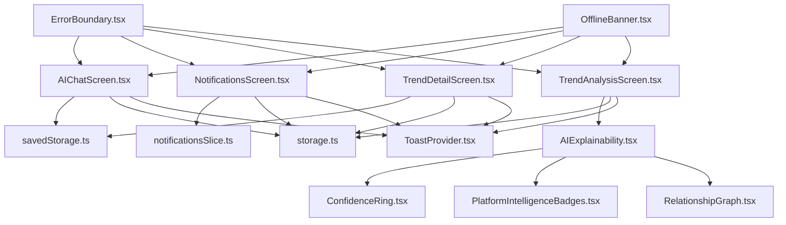

**Diagram sources**
- [AIChatScreen.tsx:1-281](file://AITrendTracker7/src/navigations/screens/AIChatScreen.tsx#L1-L281)
- [NotificationsScreen.tsx:1-410](file://AITrendTracker7/src/navigations/screens/NotificationsScreen.tsx#L1-L410)
- [TrendDetailScreen.tsx:1-284](file://AITrendTracker7/src/navigations/screens/TrendDetailScreen.tsx#L1-L284)
- [TrendAnalysisScreen.tsx:1-308](file://AITrendTracker7/src/navigations/screens/TrendAnalysisScreen.tsx#L1-L308)
- [AIExplainability.tsx:1-210](file://AITrendTracker7/src/components/ai/AIExplainability.tsx#L1-L210)
- [ConfidenceRing.tsx:1-137](file://AITrendTracker7/src/components/ai/ConfidenceRing.tsx#L1-L137)
- [PlatformIntelligenceBadges.tsx:1-83](file://AITrendTracker7/src/components/ai/PlatformIntelligenceBadges.tsx#L1-L83)
- [RelationshipGraph.tsx:1-170](file://AITrendTracker7/src/components/ai/RelationshipGraph.tsx#L1-L170)
- [savedStorage.ts:1-79](file://AITrendTracker7/src/utils/savedStorage.ts#L1-L79)
- [storage.ts:1-95](file://AITrendTracker7/src/utils/storage.ts#L1-L95)
- [notificationsSlice.ts:1-57](file://AITrendTracker7/src/store/slices/notificationsSlice.ts#L1-L57)
- [ToastProvider.tsx:1-86](file://AITrendTracker7/src/context/ToastProvider.tsx#L1-L86)
- [ErrorBoundary.tsx:1-83](file://AITrendTracker7/src/components/common/ErrorBoundary.tsx#L1-L83)
- [OfflineBanner.tsx:1-45](file://AITrendTracker7/src/components/common/OfflineBanner.tsx#L1-L45)

**Section sources**
- [AIChatScreen.tsx:1-281](file://AITrendTracker7/src/navigations/screens/AIChatScreen.tsx#L1-L281)
- [NotificationsScreen.tsx:1-410](file://AITrendTracker7/src/navigations/screens/NotificationsScreen.tsx#L1-L410)
- [TrendDetailScreen.tsx:1-284](file://AITrendTracker7/src/navigations/screens/TrendDetailScreen.tsx#L1-L284)
- [TrendAnalysisScreen.tsx:1-308](file://AITrendTracker7/src/navigations/screens/TrendAnalysisScreen.tsx#L1-L308)
- [AIExplainability.tsx:1-210](file://AITrendTracker7/src/components/ai/AIExplainability.tsx#L1-L210)
- [ConfidenceRing.tsx:1-137](file://AITrendTracker7/src/components/ai/ConfidenceRing.tsx#L1-L137)
- [PlatformIntelligenceBadges.tsx:1-83](file://AITrendTracker7/src/components/ai/PlatformIntelligenceBadges.tsx#L1-L83)
- [RelationshipGraph.tsx:1-170](file://AITrendTracker7/src/components/ai/RelationshipGraph.tsx#L1-L170)
- [savedStorage.ts:1-79](file://AITrendTracker7/src/utils/savedStorage.ts#L1-L79)
- [storage.ts:1-95](file://AITrendTracker7/src/utils/storage.ts#L1-L95)
- [notificationsSlice.ts:1-57](file://AITrendTracker7/src/store/slices/notificationsSlice.ts#L1-L57)
- [ToastProvider.tsx:1-86](file://AITrendTracker7/src/context/ToastProvider.tsx#L1-L86)
- [ErrorBoundary.tsx:1-83](file://AITrendTracker7/src/components/common/ErrorBoundary.tsx#L1-L83)
- [OfflineBanner.tsx:1-45](file://AITrendTracker7/src/components/common/OfflineBanner.tsx#L1-L45)

## Performance Considerations
- Use of MMKV for fast, encrypted storage reduces cold start latency and improves offline responsiveness.
- Animated components (Reanimated) minimize layout thrashing and provide smooth transitions.
- Windowed message history in AI chat prevents excessive payload sizes and maintains responsiveness.
- Lazy rendering of expanded AI explainability content avoids unnecessary computations.
- Skeleton loaders and offline caching reduce perceived latency during network-bound operations.

[No sources needed since this section provides general guidance]

## Troubleshooting Guide
- Error Boundary:
  - When UI fails to render, the error boundary displays a friendly message and allows resetting the state.
  - Logs errors to the console for debugging.
- Offline Banner:
  - Appears when connectivity drops; ensures users understand they are viewing cached data.
- Notifications:
  - On fetch failures, the UI remains usable; manual refresh is supported.
  - Read/clear actions update local state and remote server state.
- Saved Trends:
  - Save/unsave operations are resilient; failures are logged and UI updates accordingly.
- Toast Feedback:
  - Provides immediate, non-blocking feedback for user actions.

**Section sources**
- [ErrorBoundary.tsx:20-26](file://AITrendTracker7/src/components/common/ErrorBoundary.tsx#L20-L26)
- [OfflineBanner.tsx:9-14](file://AITrendTracker7/src/components/common/OfflineBanner.tsx#L9-L14)
- [NotificationsScreen.tsx:50-55](file://AITrendTracker7/src/navigations/screens/NotificationsScreen.tsx#L50-L55)
- [savedStorage.ts:48-67](file://AITrendTracker7/src/utils/savedStorage.ts#L48-L67)
- [ToastProvider.tsx:21-37](file://AITrendTracker7/src/context/ToastProvider.tsx#L21-L37)

## Conclusion
The user experience features combine robust error handling, offline awareness, contextual AI assistance, and personalized content management. The architecture leverages Redux for state, MMKV for persistence, and modular UI components for scalability. These enhancements deliver a consistent, accessible, and responsive experience across platforms.

[No sources needed since this section summarizes without analyzing specific files]

## Appendices
- Progressive Web App Capabilities: The repository includes a PWA manifest and service worker configuration, enabling installability and offline behavior on web platforms. This complements the mobile offline-first strategy by extending offline caching and push notification support to browsers.

[No sources needed since this section provides general guidance]