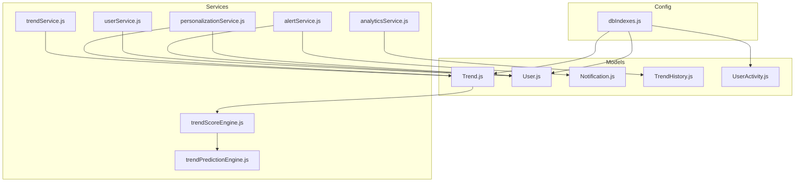
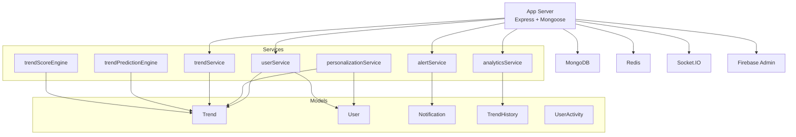
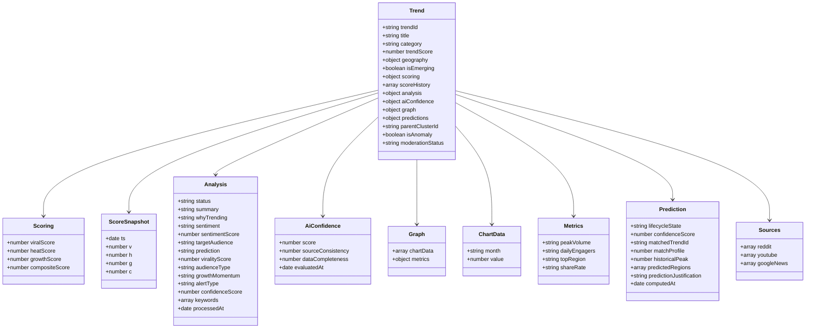
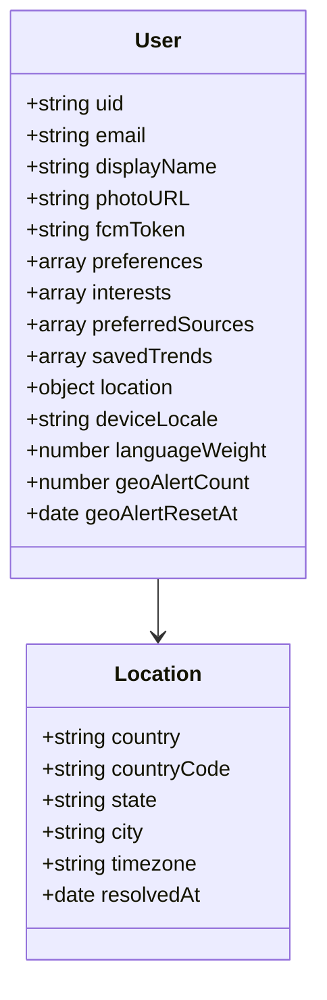
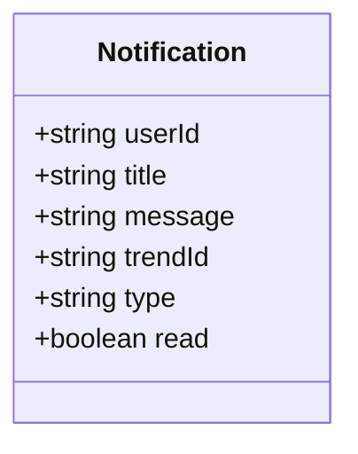
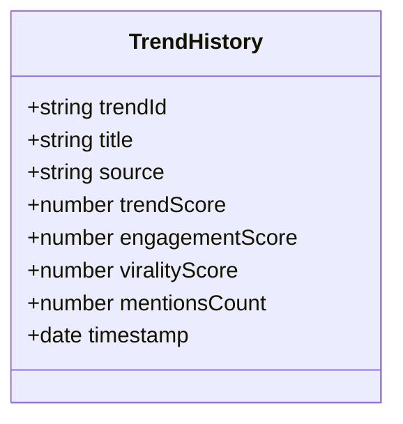
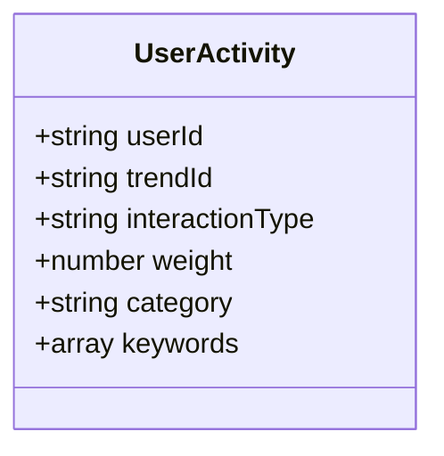
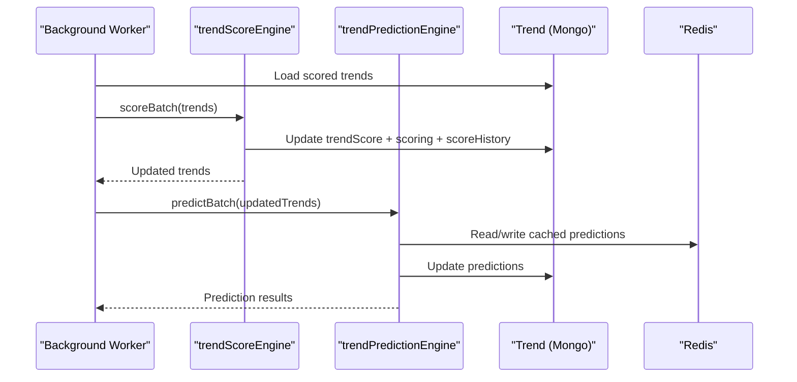
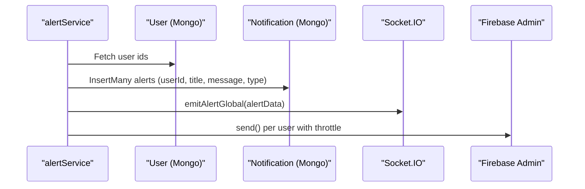
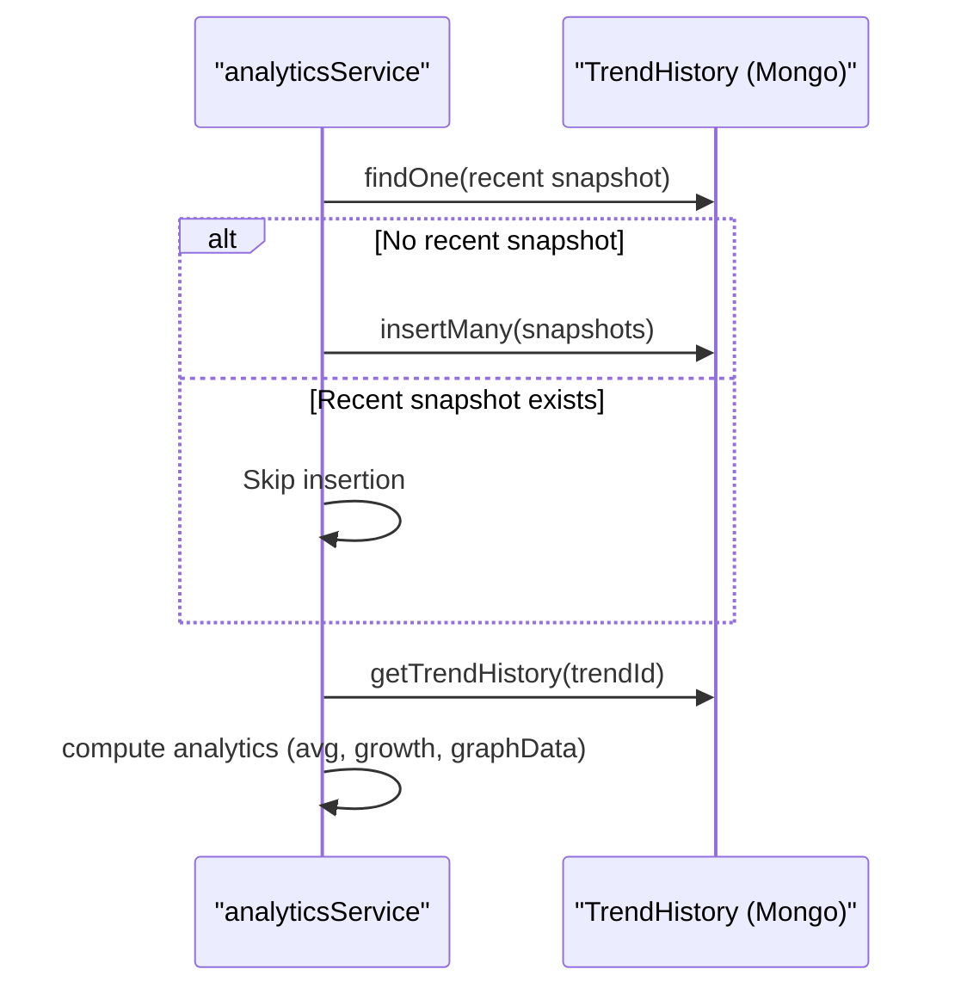

# Data Models and Database Design

<cite>
**Referenced Files in This Document**
- [Trend.js](file://backend/src/models/Trend.js)
- [User.js](file://backend/src/models/User.js)
- [Notification.js](file://backend/src/models/Notification.js)
- [TrendHistory.js](file://backend/src/models/TrendHistory.js)
- [UserActivity.js](file://backend/src/models/UserActivity.js)
- [dbIndexes.js](file://backend/src/config/dbIndexes.js)
- [trendService.js](file://backend/src/services/trendService.js)
- [userService.js](file://backend/src/services/userService.js)
- [analyticsService.js](file://backend/src/services/analyticsService.js)
- [alertService.js](file://backend/src/services/alertService.js)
- [trendScoreEngine.js](file://backend/src/services/trendScoreEngine.js)
- [trendPredictionEngine.js](file://backend/src/services/trendPredictionEngine.js)
- [personalizationService.js](file://backend/src/services/personalizationService.js)
- [server.js](file://backend/server.js)
- [app.js](file://backend/src/app.js)
- [package.json](file://backend/package.json)
</cite>

## Table of Contents
1. [Introduction](#introduction)
2. [Project Structure](#project-structure)
3. [Core Components](#core-components)
4. [Architecture Overview](#architecture-overview)
5. [Detailed Component Analysis](#detailed-component-analysis)
6. [Dependency Analysis](#dependency-analysis)
7. [Performance Considerations](#performance-considerations)
8. [Troubleshooting Guide](#troubleshooting-guide)
9. [Conclusion](#conclusion)
10. [Appendices](#appendices)

## Introduction
This document provides comprehensive data model documentation for AITrendTracker’s MongoDB schema design. It covers the Trend, User, Notification, TrendHistory, and UserActivity models, detailing fields, data types, validation rules, and business constraints. It also explains entity relationships, foreign key references, join patterns, indexing strategies, performance considerations, query optimization techniques, data lifecycle management, retention policies, archival procedures, security and privacy measures, and schema evolution guidelines.

## Project Structure
The backend is organized around Mongoose models, services, routes, and configuration. The primary models reside under backend/src/models, while services encapsulate business logic and data transformations. Indexes are ensured at startup via a dedicated configuration module.



**Diagram sources**
- [Trend.js:1-188](file://backend/src/models/Trend.js#L1-L188)
- [User.js:1-35](file://backend/src/models/User.js#L1-L35)
- [Notification.js:1-39](file://backend/src/models/Notification.js#L1-L39)
- [TrendHistory.js:1-43](file://backend/src/models/TrendHistory.js#L1-L43)
- [UserActivity.js:1-99](file://backend/src/models/UserActivity.js#L1-L99)
- [trendService.js:1-64](file://backend/src/services/trendService.js#L1-L64)
- [userService.js:1-55](file://backend/src/services/userService.js#L1-L55)
- [analyticsService.js:1-154](file://backend/src/services/analyticsService.js#L1-L154)
- [alertService.js:1-282](file://backend/src/services/alertService.js#L1-L282)
- [trendScoreEngine.js:1-231](file://backend/src/services/trendScoreEngine.js#L1-L231)
- [trendPredictionEngine.js:1-573](file://backend/src/services/trendPredictionEngine.js#L1-L573)
- [personalizationService.js:1-129](file://backend/src/services/personalizationService.js#L1-L129)
- [dbIndexes.js:1-31](file://backend/src/config/dbIndexes.js#L1-L31)

**Section sources**
- [server.js:1-51](file://backend/server.js#L1-L51)
- [app.js:1-88](file://backend/src/app.js#L1-L88)
- [package.json:1-45](file://backend/package.json#L1-L45)

## Core Components

### Trend Model
- Purpose: Central entity representing trending topics with scoring, analysis, and prediction attributes.
- Key fields:
  - Identity: trendId (unique), title, category, time, readTime, author, growth, image, content, sourceUrl.
  - Ingestion: engagementScore, type (enum), publishedAt.
  - Ranking: trendScore (indexed), location, language.
  - Geography: country, state, city, coordinates.
  - Emerging: isEmerging, emergingDetectedAt.
  - Multi-source: sources (reddit, youtube, googleNews), platformCount, crossPlatformMultiplier.
  - Relationships: relatedTrendIds.
  - Scoring: scoring (viralScore, heatScore, growthScore, compositeScore), scoreHistory (compact snapshots).
  - Analysis: status, summary, whyTrending, sentiment, sentimentScore, targetAudience, prediction, viralityScore, audienceType, growthMomentum, alertType, confidenceScore, keywords, processedAt.
  - AI Confidence: aiConfidence (score, sourceConsistency, dataCompleteness, evaluatedAt).
  - Graph: chartData (month, value), metrics (peakVolume, dailyEngagers, topRegion, shareRate).
  - Prediction: lifecycleState (enum), confidenceScore, matchedTrendId, matchProfile, historicalPeak, predictedRegions, predictionJustification, computedAt.
  - Clustering/Moderation: parentClusterId (indexed), clusterSize, isAnomaly, anomalyScore, moderationStatus (enum).
- Validation rules:
  - Scoring fields constrained to [0, 100]; compositeScore constrained to [0, 1] for prediction confidence.
  - Enums for type, analysis.status, lifecycleState, moderationStatus.
  - Geometry coordinates optional; location fields defaulted.
- Business constraints:
  - trendScore indexed for sorting.
  - scoreHistory capped to ~48 entries (time-bounded).
  - parentClusterId indexed for clustering.
  - Emerging detection flags and timestamps.
- Indexes:
  - category+trendScore, publishedAt, analysis.status, scoring.viralScore, geography multikey, moderationStatus, isAnomaly+createdAt.

**Section sources**
- [Trend.js:1-188](file://backend/src/models/Trend.js#L1-L188)

### User Model
- Purpose: Stores user identity, profile, preferences, and geolocation.
- Key fields:
  - Identity: uid (unique), email, displayName, photoURL, fcmToken.
  - Preferences: preferences (interest categories), interests (keywords), preferredSources.
  - Saved: savedTrends (array of trendIds).
  - Location: country, countryCode, state, city, timezone, resolvedAt.
  - Locale: deviceLocale, languageWeight.
  - Geo-alert throttle: geoAlertCount, geoAlertResetAt.
- Validation rules:
  - uid unique and required.
  - languageWeight bounded [0, 2].
- Business constraints:
  - savedTrends maintained as a set (no duplicates).
  - Location fields support geo-aware queries.
- Indexes:
  - location.country+state for geo queries.

**Section sources**
- [User.js:1-35](file://backend/src/models/User.js#L1-L35)

### Notification Model
- Purpose: Stores user alerts and system notifications.
- Key fields:
  - userId (indexed), title, message, trendId (optional), type (enum), read.
- Validation rules:
  - type enum; read default false.
- Business constraints:
  - Unique sparse index on userId+trendId to prevent duplicate alerts per trend per user.
  - Compound index on userId+read+createdAt for unread retrieval.
- Indexes:
  - userId (indexed), userId+read+createdAt (compound), userId+trendId (unique sparse).

**Section sources**
- [Notification.js:1-39](file://backend/src/models/Notification.js#L1-L39)

### TrendHistory Model
- Purpose: Temporal snapshots for analytics and time-series visualization.
- Key fields:
  - trendId (indexed), title, source, trendScore, engagementScore, viralityScore, mentionsCount, timestamp (indexed).
- Validation rules:
  - Defaults applied for numeric fields.
- Business constraints:
  - Compound index trendId+timestamp for efficient time-series queries.
- Indexes:
  - trendId (indexed), timestamp (indexed), trendId+timestamp (compound).

**Section sources**
- [TrendHistory.js:1-43](file://backend/src/models/TrendHistory.js#L1-L43)

### UserActivity Model
- Purpose: Tracks micro-interactions for personalization and recommendation.
- Key fields:
  - userId (indexed), trendId, interactionType (enum), weight, category, keywords.
- Validation rules:
  - interactionType enum; weight derived from predefined weights.
- Business constraints:
  - Deduplication via compound index userId+type+trendId.
  - TTL index on createdAt to cap collection growth (30 days).
- Indexes:
  - userId+createdAt (compound), userId+trendId+interactionType (compound), createdAt (TTL).

**Section sources**
- [UserActivity.js:1-99](file://backend/src/models/UserActivity.js#L1-L99)

## Architecture Overview
The system integrates ingestion, scoring, prediction, personalization, analytics, and alerting. Models are indexed to support frequent queries. Background workers and cron jobs maintain lifecycle updates and emerging trend scans. Redis is used for caching and rate limiting.



**Diagram sources**
- [app.js:1-88](file://backend/src/app.js#L1-L88)
- [server.js:1-51](file://backend/server.js#L1-L51)
- [trendService.js:1-64](file://backend/src/services/trendService.js#L1-L64)
- [userService.js:1-55](file://backend/src/services/userService.js#L1-L55)
- [analyticsService.js:1-154](file://backend/src/services/analyticsService.js#L1-L154)
- [alertService.js:1-282](file://backend/src/services/alertService.js#L1-L282)
- [trendScoreEngine.js:1-231](file://backend/src/services/trendScoreEngine.js#L1-L231)
- [trendPredictionEngine.js:1-573](file://backend/src/services/trendPredictionEngine.js#L1-L573)
- [personalizationService.js:1-129](file://backend/src/services/personalizationService.js#L1-L129)
- [Trend.js:1-188](file://backend/src/models/Trend.js#L1-L188)
- [User.js:1-35](file://backend/src/models/User.js#L1-L35)
- [Notification.js:1-39](file://backend/src/models/Notification.js#L1-L39)
- [TrendHistory.js:1-43](file://backend/src/models/TrendHistory.js#L1-L43)
- [UserActivity.js:1-99](file://backend/src/models/UserActivity.js#L1-L99)

## Detailed Component Analysis

### Trend Model Analysis
- Embedded subdocuments:
  - scoring, analysis, aiConfidence, graph.chartData, graph.metrics, predictions, sources.* arrays.
- Scoring pipeline:
  - trendScoreEngine computes viralScore, heatScore, growthScore, and compositeScore; persists to Trend and appends compact scoreHistory entries.
- Prediction pipeline:
  - trendPredictionEngine determines lifecycle state, historical confidence, regional migration, and justification; writes to trend.predictions.
- Indexing strategy:
  - Multi-field indexes for category+trendScore, publishedAt, analysis.status, scoring.viralScore, geography, moderationStatus, anomaly detection.



**Diagram sources**
- [Trend.js:1-188](file://backend/src/models/Trend.js#L1-L188)

**Section sources**
- [Trend.js:1-188](file://backend/src/models/Trend.js#L1-L188)
- [trendScoreEngine.js:1-231](file://backend/src/services/trendScoreEngine.js#L1-L231)
- [trendPredictionEngine.js:1-573](file://backend/src/services/trendPredictionEngine.js#L1-L573)

### User Model Analysis
- Fields capture identity, preferences, and location.
- savedTrends supports quick retrieval of user-curated trends.
- Location indexing enables geographic filtering and alerts.



**Diagram sources**
- [User.js:1-35](file://backend/src/models/User.js#L1-L35)

**Section sources**
- [User.js:1-35](file://backend/src/models/User.js#L1-L35)
- [userService.js:1-55](file://backend/src/services/userService.js#L1-L55)

### Notification Model Analysis
- Supports push and in-app alerts with deduplication.
- Compound index optimizes unread counts and recent alert retrieval.



**Diagram sources**
- [Notification.js:1-39](file://backend/src/models/Notification.js#L1-L39)

**Section sources**
- [Notification.js:1-39](file://backend/src/models/Notification.js#L1-L39)
- [alertService.js:1-282](file://backend/src/services/alertService.js#L1-L282)

### TrendHistory Model Analysis
- Snapshot schema captures temporal metrics for analytics.
- Compound index enables efficient time-series queries.



**Diagram sources**
- [TrendHistory.js:1-43](file://backend/src/models/TrendHistory.js#L1-L43)

**Section sources**
- [TrendHistory.js:1-43](file://backend/src/models/TrendHistory.js#L1-L43)
- [analyticsService.js:1-154](file://backend/src/services/analyticsService.js#L1-L154)

### UserActivity Model Analysis
- Interaction tracking with weights and TTL for growth control.
- Aggregation helpers compute category preference maps over a rolling window.



**Diagram sources**
- [UserActivity.js:1-99](file://backend/src/models/UserActivity.js#L1-L99)

**Section sources**
- [UserActivity.js:1-99](file://backend/src/models/UserActivity.js#L1-L99)

### Data Flow: Scoring and Prediction


**Diagram sources**
- [trendScoreEngine.js:1-231](file://backend/src/services/trendScoreEngine.js#L1-L231)
- [trendPredictionEngine.js:1-573](file://backend/src/services/trendPredictionEngine.js#L1-L573)
- [Trend.js:1-188](file://backend/src/models/Trend.js#L1-L188)

### Data Flow: Alerts and Notifications


**Diagram sources**
- [alertService.js:1-282](file://backend/src/services/alertService.js#L1-L282)
- [User.js:1-35](file://backend/src/models/User.js#L1-L35)
- [Notification.js:1-39](file://backend/src/models/Notification.js#L1-L39)

### Data Flow: Analytics Snapshots


**Diagram sources**
- [analyticsService.js:1-154](file://backend/src/services/analyticsService.js#L1-L154)
- [TrendHistory.js:1-43](file://backend/src/models/TrendHistory.js#L1-L43)

## Dependency Analysis
- Models depend on Mongoose for schema definition and indexing.
- Services orchestrate model interactions and implement business logic.
- Indexes are ensured at startup via dbIndexes.js.
- Redis is used for caching and rate limiting; Socket.IO for real-time events; Firebase Admin for push notifications.

```mermaid
graph LR
M1["Trend.js"] <- --> S1["trendScoreEngine.js"]
M1 <- --> S2["trendPredictionEngine.js"]
M2["User.js"] <- --> S3["userService.js"]
M3["Notification.js"] <- --> S4["alertService.js"]
M4["TrendHistory.js"] <- --> S5["analyticsService.js"]
M5["UserActivity.js"] <- --> S6["personalizationService.js"]
IDX["dbIndexes.js"] --> M1
IDX --> M2
IDX --> M5
```

**Diagram sources**
- [dbIndexes.js:1-31](file://backend/src/config/dbIndexes.js#L1-L31)
- [Trend.js:1-188](file://backend/src/models/Trend.js#L1-L188)
- [User.js:1-35](file://backend/src/models/User.js#L1-L35)
- [Notification.js:1-39](file://backend/src/models/Notification.js#L1-L39)
- [TrendHistory.js:1-43](file://backend/src/models/TrendHistory.js#L1-L43)
- [UserActivity.js:1-99](file://backend/src/models/UserActivity.js#L1-L99)
- [trendScoreEngine.js:1-231](file://backend/src/services/trendScoreEngine.js#L1-L231)
- [trendPredictionEngine.js:1-573](file://backend/src/services/trendPredictionEngine.js#L1-L573)
- [userService.js:1-55](file://backend/src/services/userService.js#L1-L55)
- [alertService.js:1-282](file://backend/src/services/alertService.js#L1-L282)
- [analyticsService.js:1-154](file://backend/src/services/analyticsService.js#L1-L154)
- [personalizationService.js:1-129](file://backend/src/services/personalizationService.js#L1-L129)

**Section sources**
- [dbIndexes.js:1-31](file://backend/src/config/dbIndexes.js#L1-L31)
- [server.js:1-51](file://backend/server.js#L1-L51)
- [app.js:1-88](file://backend/src/app.js#L1-L88)
- [package.json:1-45](file://backend/package.json#L1-L45)

## Performance Considerations
- Indexing
  - Trend: category+trendScore, publishedAt, analysis.status, scoring.viralScore, geography multikey, moderationStatus, isAnomaly+createdAt.
  - User: location.country+state.
  - Notification: userId (indexed), userId+read+createdAt (compound), userId+trendId (unique sparse).
  - TrendHistory: trendId (indexed), timestamp (indexed), trendId+timestamp (compound).
  - UserActivity: userId+createdAt (compound), userId+trendId+interactionType (compound), createdAt (TTL).
- Query patterns
  - Sorting by trendScore, paginated top-N queries, regex-based category/title/content searches.
  - Compound indexes enable efficient unread notifications and time-series retrieval.
- Caching
  - Prediction results cached in Redis to reduce repeated computation.
- Background maintenance
  - TTL on UserActivity ensures bounded growth.
- Rate limiting and security middleware applied at the Express layer.

[No sources needed since this section provides general guidance]

## Troubleshooting Guide
- Index verification failures
  - Startup script logs errors during ensureIndexes; inspect logs for specific failures and re-run index creation.
- Duplicate alert prevention
  - Unique sparse index on userId+trendId prevents duplicate alerts; insertMany errors are handled gracefully.
- FCM throttling
  - Rolling 2-hour window enforced via Redis; on cache failure, pushes are allowed to prevent blocking.
- Analytics snapshot duplication
  - Recent snapshot check prevents redundant inserts; adjust time window if needed for testing.
- Personalization performance
  - Ensure user interests and preferredSources are populated; source filtering reduces downstream processing.

**Section sources**
- [dbIndexes.js:1-31](file://backend/src/config/dbIndexes.js#L1-L31)
- [alertService.js:1-282](file://backend/src/services/alertService.js#L1-L282)
- [analyticsService.js:1-154](file://backend/src/services/analyticsService.js#L1-L154)
- [UserActivity.js:1-99](file://backend/src/models/UserActivity.js#L1-L99)

## Conclusion
AITrendTracker’s MongoDB schema emphasizes high-cardinality fields, embedded subdocuments for cohesive trend data, and strategic indexing to support real-time scoring, prediction, personalization, and analytics. Operational safeguards include TTL-based retention, Redis caching, and robust alerting with deduplication. The design balances query performance with data integrity and scalability.

[No sources needed since this section summarizes without analyzing specific files]

## Appendices

### Entity Relationships and Join Patterns
- Trend and User
  - UserActivity.userId references User.uid; TrendHistory.trendId references Trend.trendId.
  - Notification.userId references User.uid; Notification.trendId optionally references Trend.trendId.
- Joins
  - In-app saved trends: UserService retrieves saved trendIds and fetches full Trend documents.
  - Personalization: PersonalizationService augments trends with user preferences without joins.
  - Analytics: AnalyticsService aggregates TrendHistory by trendId.

**Section sources**
- [userService.js:1-55](file://backend/src/services/userService.js#L1-L55)
- [personalizationService.js:1-129](file://backend/src/services/personalizationService.js#L1-L129)
- [analyticsService.js:1-154](file://backend/src/services/analyticsService.js#L1-L154)
- [UserActivity.js:1-99](file://backend/src/models/UserActivity.js#L1-L99)

### Data Lifecycle Management and Retention
- UserActivity: TTL index deletes records after 30 days; rolling window enforced in aggregation.
- TrendHistory: Snapshots stored per trend; compound index supports time-series queries.
- Trend.scoreHistory: Slice capped to ~48 entries to bound document size.
- Notification: No explicit TTL; unique sparse index prevents duplicates.

**Section sources**
- [UserActivity.js:1-99](file://backend/src/models/UserActivity.js#L1-L99)
- [TrendHistory.js:1-43](file://backend/src/models/TrendHistory.js#L1-L43)
- [Trend.js:1-188](file://backend/src/models/Trend.js#L1-L188)
- [Notification.js:1-39](file://backend/src/models/Notification.js#L1-L39)

### Security and Privacy Measures
- Access control
  - Admin queue dashboard protected by bearer token header.
  - Rate limiting applied via Redis-backed middleware.
- Data handling
  - FCM token hashing for cache keys; invalid/expired tokens logged and skipped.
  - Minimal PII stored; location fields support geo-awareness without sensitive identifiers.

**Section sources**
- [app.js:1-88](file://backend/src/app.js#L1-L88)
- [alertService.js:1-282](file://backend/src/services/alertService.js#L1-L282)

### Schema Evolution Guidelines and Migration Strategies
- Additive changes
  - New fields: add to schema with defaults; ensure indexes for new query patterns.
  - Subdocument additions: extend embedded schemas; update services to populate new fields.
- Backward compatibility
  - Use optional fields and defaults; avoid removing required fields.
- Index management
  - Introduce compound indexes via schema-level definitions; verify at startup.
- Data migrations
  - Use aggregation pipelines or bulk updates for recalculations (e.g., scoreHistory normalization).
  - Version embedded subdocuments (e.g., predictions) to support phased rollout of new fields.
- Testing
  - Validate index coverage and query plans; monitor performance after changes.

[No sources needed since this section provides general guidance]