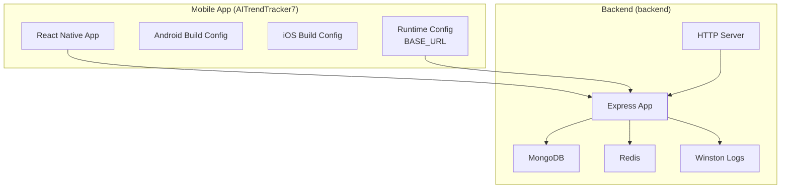
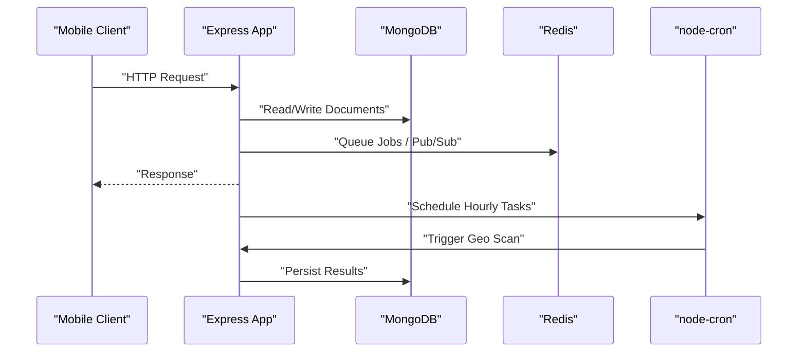
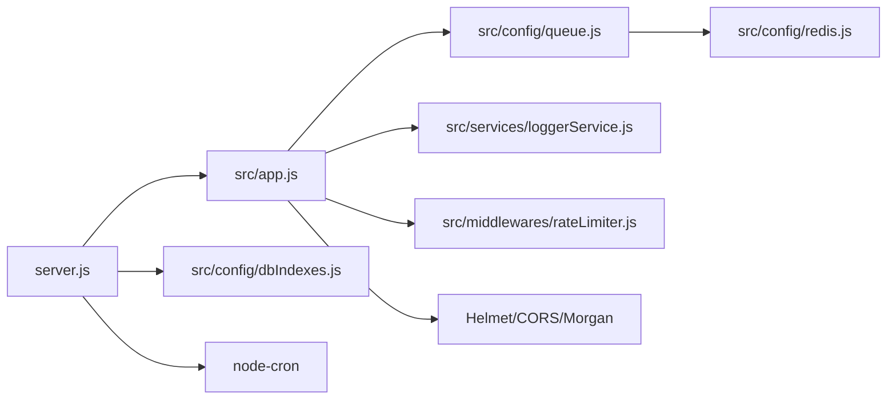

# Deployment and Operations

<cite>
**Referenced Files in This Document**
- [package.json](file://AITrendTracker7/package.json)
- [app.json](file://AITrendTracker7/app.json)
- [build.gradle](file://AITrendTracker7/android/app/build.gradle)
- [google-services.json](file://AITrendTracker7/android/app/google-services.json)
- [Podfile](file://AITrendTracker7/ios/Podfile)
- [Info.plist](file://AITrendTracker7/ios/AITrendTracker7/Info.plist)
- [config.ts](file://AITrendTracker7/src/utils/config.ts)
- [server.js](file://backend/server.js)
- [package.json](file://backend/package.json)
- [app.js](file://backend/src/app.js)
- [dbIndexes.js](file://backend/src/config/dbIndexes.js)
- [redis.js](file://backend/src/config/redis.js)
- [queue.js](file://backend/src/config/queue.js)
- [loggerService.js](file://backend/src/services/loggerService.js)
</cite>

## Table of Contents
1. [Introduction](#introduction)
2. [Project Structure](#project-structure)
3. [Core Components](#core-components)
4. [Architecture Overview](#architecture-overview)
5. [Detailed Component Analysis](#detailed-component-analysis)
6. [Dependency Analysis](#dependency-analysis)
7. [Performance Considerations](#performance-considerations)
8. [Troubleshooting Guide](#troubleshooting-guide)
9. [Conclusion](#conclusion)
10. [Appendices](#appendices)

## Introduction
This document provides comprehensive deployment and operations guidance for AITrendTracker. It covers mobile app build processes for Android and iOS, backend deployment and environment management, infrastructure requirements, containerization and cloud deployment options, CI/CD pipeline setup, monitoring and logging, performance metrics, alerting, database backup and recovery, scaling and disaster recovery, security and compliance, and operational runbooks for maintenance and incident response.

## Project Structure
AITrendTracker comprises two primary areas:
- Mobile application (React Native): AITrendTracker7
- Backend API and services: backend

Key characteristics:
- Mobile app uses React Native 0.84.1 with Firebase and Google Sign-In integrations.
- Backend is an Express-based Node.js service using Mongoose, BullMQ, Socket.IO, Redis, Winston logging, and cron scheduling.
- Both environments rely on environment variables managed via dotenv.

**Diagram sources**
- [config.ts:1-7](file://AITrendTracker7/src/utils/config.ts#L1-L7)
- [build.gradle:1-121](file://AITrendTracker7/android/app/build.gradle#L1-L121)
- [Podfile:1-35](file://AITrendTracker7/ios/Podfile#L1-L35)
- [server.js:1-51](file://backend/server.js#L1-L51)
- [app.js:1-88](file://backend/src/app.js#L1-L88)
- [redis.js:1-19](file://backend/src/config/redis.js#L1-L19)
- [loggerService.js:1-43](file://backend/src/services/loggerService.js#L1-L43)

**Section sources**
- [package.json:1-70](file://AITrendTracker7/package.json#L1-L70)
- [app.json:1-5](file://AITrendTracker7/app.json#L1-L5)
- [server.js:1-51](file://backend/server.js#L1-L51)

## Core Components
- Mobile app runtime configuration defines the base URL for API endpoints, switching between emulator loopback and production URL.
- Android build configuration sets up React Native, Hermes/JSC selection, signing configs (debug), and ProGuard/minification toggles.
- iOS build configuration integrates React Native pods and post-install steps.
- Backend initialization connects to MongoDB, starts Socket.IO, background workers, queue workers, and cron jobs.
- Express app configures Helmet, CORS, rate limiters, logging, and exposes admin queue monitoring with basic auth.
- Redis connection and queue configuration define job retry/backoff policies and retention.
- Winston-based logging rotates daily and supports console transport outside production.

**Section sources**
- [config.ts:1-7](file://AITrendTracker7/src/utils/config.ts#L1-L7)
- [build.gradle:76-121](file://AITrendTracker7/android/app/build.gradle#L76-L121)
- [Podfile:17-35](file://AITrendTracker7/ios/Podfile#L17-L35)
- [server.js:11-51](file://backend/server.js#L11-L51)
- [app.js:9-88](file://backend/src/app.js#L9-L88)
- [redis.js:1-19](file://backend/src/config/redis.js#L1-L19)
- [queue.js:1-32](file://backend/src/config/queue.js#L1-L32)
- [loggerService.js:1-43](file://backend/src/services/loggerService.js#L1-L43)

## Architecture Overview
The system architecture consists of:
- Mobile clients communicating with the backend over HTTPS.
- Backend exposing REST APIs and WebSocket connections via Socket.IO.
- Background automation via cron and queue workers powered by BullMQ and Redis.
- Persistent storage via MongoDB with operational index checks at startup.
- Logging via Winston with daily rotation.

**Diagram sources**
- [server.js:16-46](file://backend/server.js#L16-L46)
- [app.js:24-85](file://backend/src/app.js#L24-L85)
- [dbIndexes.js:13-28](file://backend/src/config/dbIndexes.js#L13-L28)
- [redis.js:1-19](file://backend/src/config/redis.js#L1-L19)

## Detailed Component Analysis

### Mobile App Build and Distribution (Android)
- Build system: Gradle with React Native plugin, optional ProGuard/minification, and JSC/Hermes selection.
- Signing:
  - Debug signing is configured with default keystore credentials.
  - Release signing requires a custom keystore; the template currently references debug signing.
- Dependencies:
  - Firebase/Firestore/Auth via @react-native-firebase packages.
  - Google Sign-In integration via @react-native-google-signin/google-signin.
- Distribution:
  - Use standard Gradle assemble/release tasks and publish artifacts to stores after signing.
  - Ensure google-services.json is present for Firebase services.

Operational checklist:
- Replace debug signing with production keystore for release builds.
- Configure ProGuard/R8 rules and enable minification for production.
- Validate Firebase configuration via google-services.json.
- Test device-specific permissions and entitlements.

**Section sources**
- [build.gradle:89-109](file://AITrendTracker7/android/app/build.gradle#L89-L109)
- [google-services.json:1-47](file://AITrendTracker7/android/app/google-services.json#L1-L47)
- [package.json:12-44](file://AITrendTracker7/package.json#L12-L44)

### Mobile App Build and Distribution (iOS)
- Build system: CocoaPods with React Native integration and post-install hooks.
- Dependencies:
  - Firebase/Firestore/Auth via @react-native-firebase packages.
  - Google Sign-In integration via @react-native-google-signin/google-signin.
- Distribution:
  - Archive and export via Xcode or fastlane after configuring Apple provisioning profiles and certificates.

Operational checklist:
- Ensure Podfile resolves React Native modules and runs post-install scripts.
- Configure Info.plist for ATS exceptions, fonts, and capabilities.
- Validate provisioning profiles and signing certificates for distribution.

**Section sources**
- [Podfile:1-35](file://AITrendTracker7/ios/Podfile#L1-L35)
- [Info.plist:1-81](file://AITrendTracker7/ios/AITrendTracker7/Info.plist#L1-L81)
- [package.json:12-44](file://AITrendTracker7/package.json#L12-L44)

### Backend Deployment and Environment Management
- Startup flow:
  - Load environment variables via dotenv.
  - Connect to MongoDB and ensure compound indexes.
  - Start HTTP server, Socket.IO, background workers, queue workers, and cron jobs.
- Express app:
  - Security middleware: Helmet, CORS, JSON body parsing.
  - Rate limiting via Redis-backed middleware.
  - Queue monitoring dashboard exposed under /admin/queues with bearer auth.
  - Health check endpoint at /health.
- Logging:
  - Winston with daily rotate file transport and console transport outside production.
  - Log levels controlled by environment variable.

Operational checklist:
- Set required environment variables (MONGO_URI, ADMIN_SECRET, LOG_LEVEL, PORT).
- Ensure Redis is reachable at configured host/port.
- Verify index creation at startup and monitor logs for errors.

**Section sources**
- [server.js:1-51](file://backend/server.js#L1-L51)
- [app.js:9-88](file://backend/src/app.js#L9-L88)
- [loggerService.js:1-43](file://backend/src/services/loggerService.js#L1-L43)
- [dbIndexes.js:13-28](file://backend/src/config/dbIndexes.js#L13-L28)

### Infrastructure Requirements
- Backend:
  - Node.js runtime aligned with engines specification.
  - MongoDB for persistence.
  - Redis for queues and pub/sub.
  - Optional external services for AI enrichment and notifications.
- Mobile:
  - Android SDK, JDK, and Gradle for building.
  - Xcode and CocoaPods for iOS builds.
  - Firebase project configured with google-services.json and Apple provisioning profiles.

**Section sources**
- [package.json:66-68](file://AITrendTracker7/package.json#L66-L68)
- [package.json:14-39](file://backend/package.json#L14-L39)
- [build.gradle:76-88](file://AITrendTracker7/android/app/build.gradle#L76-L88)
- [Podfile:8-9](file://AITrendTracker7/ios/Podfile#L8-L9)

### Containerization Approaches
- Backend containerization:
  - Multi-stage Dockerfile recommended to minimize image size and improve security.
  - Entrypoint executes server.js with NODE_ENV=production.
  - Expose port 5000 and mount persistent volumes for logs if needed.
- Mobile:
  - Android: Use official React Native Docker images for deterministic builds.
  - iOS: Use Xcode build containers or CI runners with preinstalled Xcode and CocoaPods.

[No sources needed since this section provides general guidance]

### Cloud Deployment Options
- Backend:
  - Kubernetes: Deploy Express app with HPA based on CPU/memory; expose via Ingress with TLS termination.
  - Platform-as-a-Service: Use managed Node.js hosting with environment variables and external MongoDB/Redis.
  - Serverless: Use managed functions for read-heavy endpoints; keep write-heavy or long-running tasks in VM/container.
- Mobile:
  - Store distribution: Publish signed APK/APK bundles to Google Play Console and IPA/IPA archives to App Store Connect.
  - CI/CD: Automate builds and distribution via GitHub Actions or similar.

[No sources needed since this section provides general guidance]

### CI/CD Pipeline Setup
- Mobile:
  - Android: Build variants (debug/release), lint, unit tests, assemble release, upload artifacts.
  - iOS: Build archive, run tests, code sign, export for distribution, upload to App Store Connect.
- Backend:
  - Build: Install dependencies, lint, test, bundle.
  - Deploy: Push container image to registry, roll out to cluster or PaaS.
  - Canary: Gradual rollout with health checks and rollback triggers.

[No sources needed since this section provides general guidance]

### Monitoring and Logging Strategies
- Logging:
  - Winston daily rotate file transport with JSON format and timestamps.
  - Console transport enabled outside production for observability.
- Metrics:
  - Expose Prometheus-compatible metrics via a dedicated endpoint or adapter.
  - Track queue backlog, job durations, and error rates.
- Alerting:
  - Integrate with PagerDuty/Slack for critical alerts.
  - Set thresholds for queue delays, error rates, and downtime.

**Section sources**
- [loggerService.js:1-43](file://backend/src/services/loggerService.js#L1-L43)
- [app.js:33-57](file://backend/src/app.js#L33-L57)

### Performance Considerations
- Database:
  - Compound indexes verified at startup; ensure appropriate indexes for queries.
  - Use connection pooling and consider read replicas for read-heavy workloads.
- Queues:
  - Tune retry/backoff policies and job TTLs.
  - Monitor queue depth and worker concurrency.
- Network:
  - Enable compression and caching where applicable.
  - Use CDN for static assets and media.

**Section sources**
- [dbIndexes.js:13-28](file://backend/src/config/dbIndexes.js#L13-L28)
- [queue.js:1-32](file://backend/src/config/queue.js#L1-L32)

### Database Backup and Recovery Procedures
- Backup:
  - Use MongoDB native tools or cloud provider backups for full and incremental backups.
  - Schedule regular snapshots and test restore procedures.
- Recovery:
  - Validate backups periodically.
  - Practice point-in-time recovery and cross-environment restoration.

[No sources needed since this section provides general guidance]

### Scaling Strategies
- Horizontal scaling:
  - Stateless backend behind load balancers; scale pods/instances based on CPU/memory.
- Queue scaling:
  - Increase worker replicas for high-throughput queues.
- Database:
  - Sharding and replica sets for high availability and throughput.

[No sources needed since this section provides general guidance]

### Disaster Recovery Planning
- Multi-region deployments with failover routing.
- Automated backup and replication across regions.
- Incident playbooks with escalation paths and communication plans.

[No sources needed since this section provides general guidance]

### Security Considerations, Certificate Management, and Compliance
- Transport security:
  - Enforce HTTPS/TLS for all endpoints; configure strong ciphers.
  - Use Helmet headers and strict CSP.
- Secrets management:
  - Store sensitive keys in environment variables or secret managers.
  - Rotate keys regularly and revoke compromised ones.
- Certificates:
  - Manage TLS certificates via ACME clients or cloud providers.
  - Renew certificates before expiry and automate revocation.
- Compliance:
  - Data retention and deletion policies; audit logs; privacy controls.

[No sources needed since this section provides general guidance]

## Dependency Analysis
The backend depends on several subsystems and libraries. The following diagram maps key dependencies and their roles.

**Diagram sources**
- [server.js:1-51](file://backend/server.js#L1-L51)
- [app.js:1-88](file://backend/src/app.js#L1-L88)
- [queue.js:1-32](file://backend/src/config/queue.js#L1-L32)
- [redis.js:1-19](file://backend/src/config/redis.js#L1-L19)
- [loggerService.js:1-43](file://backend/src/services/loggerService.js#L1-L43)
- [dbIndexes.js:1-31](file://backend/src/config/dbIndexes.js#L1-L31)

**Section sources**
- [server.js:1-51](file://backend/server.js#L1-L51)
- [app.js:1-88](file://backend/src/app.js#L1-L88)

## Performance Considerations
- Database:
  - Ensure indexes are created and monitored; avoid N+1 queries.
- Queues:
  - Adjust attempts/backoff; monitor queue latency and dead-letter queues.
- Logging:
  - Avoid excessive logging in hot paths; rotate logs and manage disk usage.

[No sources needed since this section provides general guidance]

## Troubleshooting Guide
Common issues and resolutions:
- MongoDB connection failures:
  - Verify MONGO_URI and network connectivity; check replica set status.
- Redis connectivity:
  - Confirm host/port and firewall rules; ensure maxRetriesPerRequest is configured for BullMQ.
- Queue stuck jobs:
  - Inspect queue dashboard, retry failed jobs, adjust backoff policy.
- Unauthorized queue admin access:
  - Set ADMIN_SECRET and use bearer token for /admin/queues.
- Mobile app cannot reach backend:
  - Update BASE_URL to production domain; verify reverse proxy and TLS termination.

**Section sources**
- [server.js:16-50](file://backend/server.js#L16-L50)
- [redis.js:1-19](file://backend/src/config/redis.js#L1-L19)
- [queue.js:1-32](file://backend/src/config/queue.js#L1-L32)
- [app.js:50-57](file://backend/src/app.js#L50-L57)
- [config.ts:1-7](file://AITrendTracker7/src/utils/config.ts#L1-L7)

## Conclusion
AITrendTracker’s deployment and operations model centers on a React Native mobile frontend and a Node.js/Express backend with robust queueing, logging, and monitoring. By following the outlined build, deployment, security, and operational practices, teams can achieve reliable, scalable, and secure delivery across Android and iOS while maintaining a resilient backend with predictable observability and governance.

## Appendices

### Environment Variables Reference
- Backend:
  - MONGO_URI: MongoDB connection string.
  - ADMIN_SECRET: Bearer token for /admin/queues.
  - LOG_LEVEL: Logging verbosity (default info).
  - PORT: Listening port (default 5000).
- Mobile:
  - BASE_URL: API base URL; switches based on development mode.

**Section sources**
- [server.js:11-11](file://backend/server.js#L11-L11)
- [app.js:51-57](file://backend/src/app.js#L51-L57)
- [loggerService.js:12-12](file://backend/src/services/loggerService.js#L12-L12)
- [config.ts:5-7](file://AITrendTracker7/src/utils/config.ts#L5-L7)