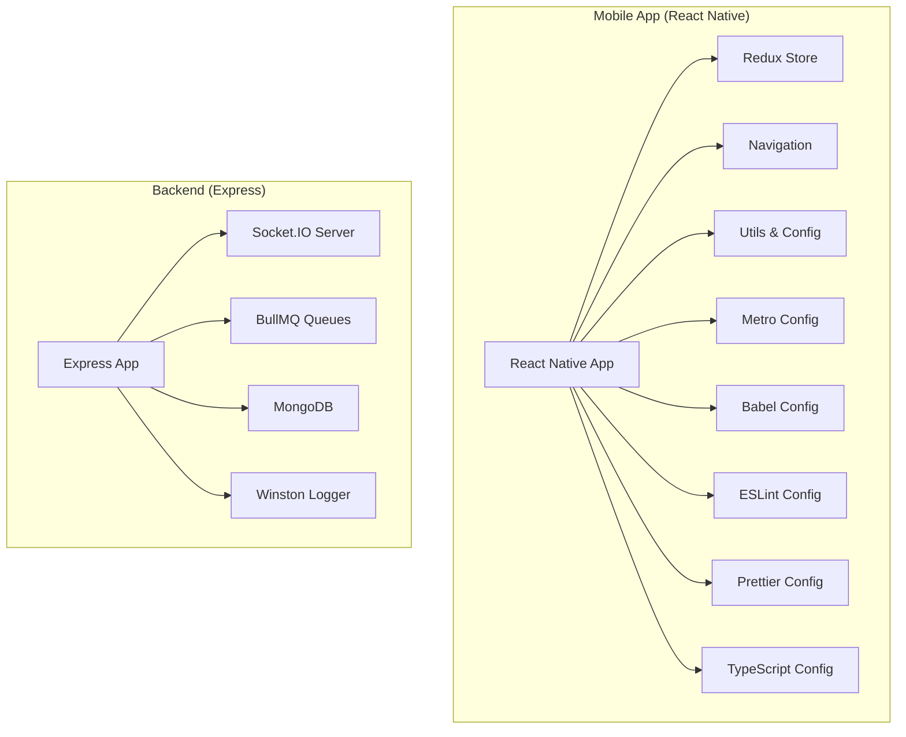
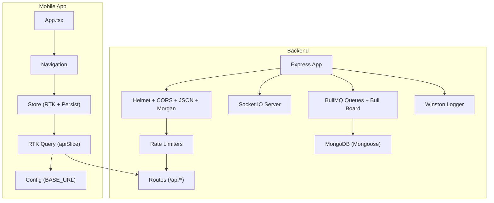
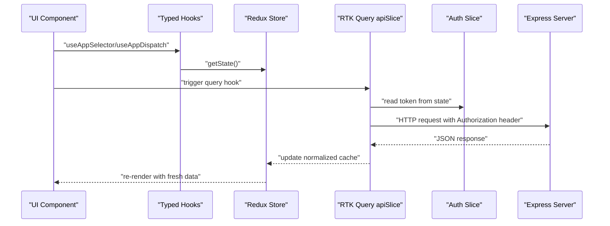
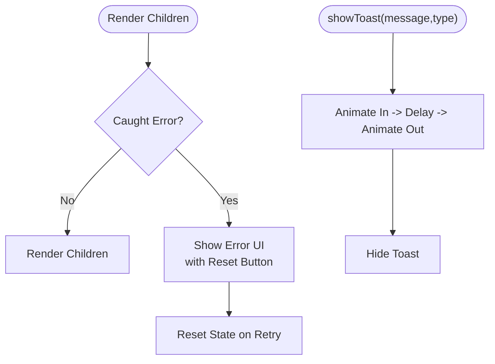
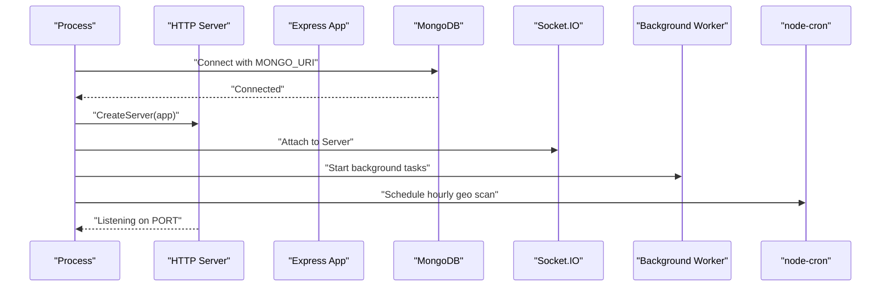
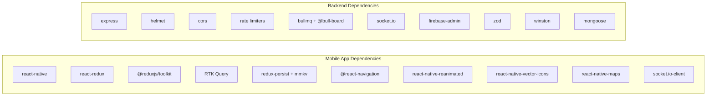

# Development Guidelines

<cite>
**Referenced Files in This Document**
- [package.json](file://AITrendTracker7/package.json)
- [tsconfig.json](file://AITrendTracker7/tsconfig.json)
- [.eslintrc.js](file://AITrendTracker7/.eslintrc.js)
- [.prettierrc.js](file://AITrendTracker7/.prettierrc.js)
- [babel.config.js](file://AITrendTracker7/babel.config.js)
- [metro.config.js](file://AITrendTracker7/metro.config.js)
- [App.tsx](file://AITrendTracker7/App.tsx)
- [ToastProvider.tsx](file://AITrendTracker7/src/context/ToastProvider.tsx)
- [ErrorBoundary.tsx](file://AITrendTracker7/src/components/common/ErrorBoundary.tsx)
- [store/index.ts](file://AITrendTracker7/src/store/index.ts)
- [store/apiSlice.ts](file://AITrendTracker7/src/store/apiSlice.ts)
- [store/hooks.ts](file://AITrendTracker7/src/store/hooks.ts)
- [config.ts](file://AITrendTracker7/src/utils/config.ts)
- [AuthNavigator.tsx](file://AITrendTracker7/src/navigations/AuthNavigator.tsx)
- [server.js](file://AITrendTracker7/server.js)
- [backend package.json](file://backend/package.json)
- [backend server.js](file://backend/server.js)
- [backend app.js](file://backend/src/app.js)
</cite>

## Table of Contents
1. [Introduction](#introduction)
2. [Project Structure](#project-structure)
3. [Core Components](#core-components)
4. [Architecture Overview](#architecture-overview)
5. [Detailed Component Analysis](#detailed-component-analysis)
6. [Dependency Analysis](#dependency-analysis)
7. [Performance Considerations](#performance-considerations)
8. [Troubleshooting Guide](#troubleshooting-guide)
9. [Security Coding Practices](#security-coding-practices)
10. [Testing Requirements](#testing-requirements)
11. [Documentation Standards](#documentation-standards)
12. [Code Review Processes](#code-review-processes)
13. [Contributing to Mobile Application](#contributing-to-mobile-application)
14. [Contributing to Backend Services](#contributing-to-backend-services)
15. [Contributing to Shared Components](#contributing-to-shared-components)
16. [Debugging Techniques](#debugging-techniques)
17. [Profiling Approaches](#profiling-approaches)
18. [Development Workflow Recommendations](#development-workflow-recommendations)
19. [Conclusion](#conclusion)

## Introduction
This document provides comprehensive development guidelines for AITrendTracker contributors. It consolidates code style standards, TypeScript configuration, and linting rules for both the mobile application and backend services. It also explains component development patterns, state management best practices, architectural conventions, naming conventions, file organization principles, performance optimization techniques, memory management strategies, accessibility requirements, security coding practices, input validation patterns, error handling standards, testing requirements, documentation standards, code review processes, debugging techniques, profiling approaches, and development workflow recommendations.

## Project Structure
AITrendTracker comprises two primary codebases:
- Mobile application (React Native) under AITrendTracker7
- Backend services under backend

Key characteristics:
- Mobile app uses React Native 0.84.1, TypeScript, Redux Toolkit Query for data fetching, and Reanimated plugin via Babel.
- Backend uses Express, BullMQ for queues, Socket.IO for real-time features, Mongoose for MongoDB, and Winston for logging.
- Both codebases define scripts for linting, testing, and local development.

**Diagram sources**
- [App.tsx](file://AITrendTracker7/App.tsx)
- [tsconfig.json](file://AITrendTracker7/tsconfig.json)
- [.eslintrc.js](file://AITrendTracker7/.eslintrc.js)
- [.prettierrc.js](file://AITrendTracker7/.prettierrc.js)
- [babel.config.js](file://AITrendTracker7/babel.config.js)
- [metro.config.js](file://AITrendTracker7/metro.config.js)
- [store/index.ts](file://AITrendTracker7/src/store/index.ts)
- [AuthNavigator.tsx](file://AITrendTracker7/src/navigations/AuthNavigator.tsx)
- [config.ts](file://AITrendTracker7/src/utils/config.ts)
- [backend server.js](file://backend/server.js)
- [backend app.js](file://backend/src/app.js)

**Section sources**
- [package.json:1-70](file://AITrendTracker7/package.json#L1-L70)
- [backend package.json:1-45](file://backend/package.json#L1-L45)

## Core Components
This section documents the foundational development configurations and patterns used across the codebase.

- TypeScript configuration
  - Extends the React Native TypeScript config and includes Jest types.
  - Includes all .ts and .tsx files while excluding node_modules and Pods.

- ESLint configuration
  - Extends the React Native ESLint shareable config for consistent linting across the team.

- Prettier configuration
  - Uses arrow parens avoidance, single quotes, and trailing commas for consistent formatting.

- Babel configuration
  - Uses the React Native Babel preset and applies the Reanimated plugin.

- Metro configuration
  - Merges default Metro config with project overrides.

- Navigation
  - Uses a native stack navigator with gesture-enabled screens and consistent animation options.

- State Management
  - Redux Toolkit with persisted slices using MMKV storage.
  - RTK Query base query configured with dynamic Authorization headers from the store.
  - Typed hooks for dispatch and selector usage.

- Utilities and Configuration
  - Base URL for API requests switches between development and production environments.

**Section sources**
- [tsconfig.json:1-9](file://AITrendTracker7/tsconfig.json#L1-L9)
- [.eslintrc.js:1-5](file://AITrendTracker7/.eslintrc.js#L1-L5)
- [.prettierrc.js:1-6](file://AITrendTracker7/.prettierrc.js#L1-L6)
- [babel.config.js:1-5](file://AITrendTracker7/babel.config.js#L1-L5)
- [metro.config.js:1-12](file://AITrendTracker7/metro.config.js#L1-L12)
- [AuthNavigator.tsx:1-62](file://AITrendTracker7/src/navigations/AuthNavigator.tsx#L1-L62)
- [store/index.ts:1-46](file://AITrendTracker7/src/store/index.ts#L1-L46)
- [store/apiSlice.ts:1-40](file://AITrendTracker7/src/store/apiSlice.ts#L1-L40)
- [store/hooks.ts:1-7](file://AITrendTracker7/src/store/hooks.ts#L1-L7)
- [config.ts:1-8](file://AITrendTracker7/src/utils/config.ts#L1-L8)

## Architecture Overview
The system follows a modern React Native mobile application with a companion backend service:
- Mobile app
  - Centralized store with persisted slices and RTK Query for API interactions.
  - Navigation stack with gesture support and consistent animations.
  - Utility configuration for base URLs and environment-aware behavior.
- Backend
  - Express server with Helmet, CORS, JSON parsing, and Morgan logging.
  - Rate limiting applied to API endpoints.
  - Queue monitoring dashboard via Bull Board.
  - Socket.IO server attached to the HTTP server.
  - Background workers and scheduled tasks orchestrated via node-cron.

**Diagram sources**
- [App.tsx](file://AITrendTracker7/App.tsx)
- [AuthNavigator.tsx:1-62](file://AITrendTracker7/src/navigations/AuthNavigator.tsx#L1-L62)
- [store/index.ts:1-46](file://AITrendTracker7/src/store/index.ts#L1-L46)
- [store/apiSlice.ts:1-40](file://AITrendTracker7/src/store/apiSlice.ts#L1-L40)
- [config.ts:1-8](file://AITrendTracker7/src/utils/config.ts#L1-L8)
- [backend server.js:1-51](file://backend/server.js#L1-L51)
- [backend app.js:1-88](file://backend/src/app.js#L1-L88)

## Detailed Component Analysis

### State Management and Data Flow
This section focuses on Redux Toolkit configuration, persistence, and RTK Query integration.

**Diagram sources**
- [store/index.ts:1-46](file://AITrendTracker7/src/store/index.ts#L1-L46)
- [store/apiSlice.ts:1-40](file://AITrendTracker7/src/store/apiSlice.ts#L1-L40)
- [store/hooks.ts:1-7](file://AITrendTracker7/src/store/hooks.ts#L1-L7)
- [config.ts:1-8](file://AITrendTracker7/src/utils/config.ts#L1-L8)
- [backend app.js:1-88](file://backend/src/app.js#L1-L88)

Best practices:
- Persist only essential slices to reduce memory footprint.
- Use RTK Query’s cache tagging and keepUnusedDataFor to manage memory for heavy payloads.
- Centralize base URL configuration and environment switching.
- Use typed hooks for safer dispatch and selector usage.

**Section sources**
- [store/index.ts:1-46](file://AITrendTracker7/src/store/index.ts#L1-L46)
- [store/apiSlice.ts:1-40](file://AITrendTracker7/src/store/apiSlice.ts#L1-L40)
- [store/hooks.ts:1-7](file://AITrendTracker7/src/store/hooks.ts#L1-L7)
- [config.ts:1-8](file://AITrendTracker7/src/utils/config.ts#L1-L8)

### Navigation Patterns
The navigation stack defines screen groups and animation options. Contributors should:
- Add new screens to the appropriate group.
- Keep animation and gesture options consistent.
- Use the existing stack configuration as a template.

**Section sources**
- [AuthNavigator.tsx:1-62](file://AITrendTracker7/src/navigations/AuthNavigator.tsx#L1-L62)

### Error Handling and User Feedback
Two complementary mechanisms are present:
- ErrorBoundary component for graceful degradation and reset.
- ToastProvider for transient, non-blocking feedback.

**Diagram sources**
- [ErrorBoundary.tsx:1-83](file://AITrendTracker7/src/components/common/ErrorBoundary.tsx#L1-L83)
- [ToastProvider.tsx:1-86](file://AITrendTracker7/src/context/ToastProvider.tsx#L1-L86)

Guidelines:
- Wrap critical sections with ErrorBoundary for resilience.
- Use ToastProvider for user actions and network responses.
- Ensure consistent iconography and color coding per message type.

**Section sources**
- [ErrorBoundary.tsx:1-83](file://AITrendTracker7/src/components/common/ErrorBoundary.tsx#L1-L83)
- [ToastProvider.tsx:1-86](file://AITrendTracker7/src/context/ToastProvider.tsx#L1-L86)

### Backend Initialization and Runtime
The backend initializes HTTP server, connects to MongoDB, sets up Socket.IO, starts background workers, and schedules cron jobs.

**Diagram sources**
- [backend server.js:1-51](file://backend/server.js#L1-L51)
- [backend app.js:1-88](file://backend/src/app.js#L1-L88)

**Section sources**
- [backend server.js:1-51](file://backend/server.js#L1-L51)
- [backend app.js:1-88](file://backend/src/app.js#L1-L88)

## Dependency Analysis
This section outlines the major dependencies and their roles in both codebases.

**Diagram sources**
- [package.json:12-44](file://AITrendTracker7/package.json#L12-L44)
- [backend package.json:14-38](file://backend/package.json#L14-L38)

**Section sources**
- [package.json:1-70](file://AITrendTracker7/package.json#L1-L70)
- [backend package.json:1-45](file://backend/package.json#L1-L45)

## Performance Considerations
- Memory management
  - Persist only essential slices to minimize memory usage.
  - Use RTK Query’s keepUnusedDataFor to drop stale data for heavy endpoints.
- Rendering performance
  - Prefer Flash List for large lists.
  - Use Reanimated for smooth animations and avoid layout thrashing.
- Network efficiency
  - Centralize base URL configuration and environment switching.
  - Use cache tags to invalidate and refetch selectively.
- Background tasks
  - Offload heavy work to BullMQ workers and cron jobs.
  - Monitor queue health via Bull Board.

[No sources needed since this section provides general guidance]

## Troubleshooting Guide
- Linting and formatting
  - Run ESLint and Prettier to ensure consistent code style.
- Testing
  - Execute unit and integration tests using the provided scripts.
- Error boundaries
  - Use ErrorBoundary to gracefully handle rendering errors and offer a reset option.
- Logging
  - Backend uses Winston with daily rotation; consult logs for runtime diagnostics.

**Section sources**
- [.eslintrc.js:1-5](file://AITrendTracker7/.eslintrc.js#L1-L5)
- [.prettierrc.js:1-6](file://AITrendTracker7/.prettierrc.js#L1-L6)
- [package.json:5-11](file://AITrendTracker7/package.json#L5-L11)
- [backend package.json:9-10](file://backend/package.json#L9-L10)
- [ErrorBoundary.tsx:1-83](file://AITrendTracker7/src/components/common/ErrorBoundary.tsx#L1-L83)
- [backend app.js:82-85](file://backend/src/app.js#L82-L85)

## Security Coding Practices
- Transport and headers
  - Helmet is enabled for CSP, XSS, and MIME sniffing protections.
  - CORS is enabled; restrict origins in production as needed.
- Authentication and authorization
  - Use bearer tokens for protected endpoints.
  - Apply rate limiting for authentication and API endpoints.
- Input validation
  - Validate and sanitize inputs; backend uses Zod for schema validation.
- Secrets and environment
  - Load environment variables early; protect secrets and admin credentials.
- Real-time security
  - Secure the Bull Board admin route with a bearer token.

**Section sources**
- [backend app.js:1-88](file://backend/src/app.js#L1-L88)
- [backend server.js:1-51](file://backend/server.js#L1-L51)

## Testing Requirements
- Frontend
  - Use Jest with React Native preset; write unit and integration tests for components and store logic.
- Backend
  - Use Jest for unit tests; run with verbose output and force exit for CI stability.
- Test coverage
  - Aim for high coverage in reducers, selectors, and service layers.

**Section sources**
- [package.json:5-11](file://AITrendTracker7/package.json#L5-L11)
- [backend package.json:9-10](file://backend/package.json#L9-L10)

## Documentation Standards
- Inline documentation
  - Document exported functions, components, and complex logic with concise descriptions.
- READMEs
  - Maintain a README in each module explaining purpose, props/interfaces, and usage.
- Type safety
  - Prefer TypeScript interfaces and types for props and state.
- Architecture decisions
  - Record decisions in a lightweight format alongside the codebase.

[No sources needed since this section provides general guidance]

## Code Review Processes
- Pull requests
  - Include a summary of changes, rationale, and testing performed.
- Checklist
  - Lint passes, tests pass, no console logs, security review completed.
- Accessibility
  - Ensure components are accessible and keyboard navigable where applicable.

[No sources needed since this section provides general guidance]

## Contributing to Mobile Application
- Code style
  - Follow ESLint and Prettier rules defined in the repository.
- TypeScript
  - Use strict typing; export interfaces and types consistently.
- Component development
  - Use functional components with hooks; keep components small and focused.
- State management
  - Use RTK slices for global state and RTK Query for remote data.
- Navigation
  - Add new screens to the existing stack navigator with consistent options.
- Assets
  - Place icons and images under src/assets; reference them via relative paths.

**Section sources**
- [.eslintrc.js:1-5](file://AITrendTracker7/.eslintrc.js#L1-L5)
- [.prettierrc.js:1-6](file://AITrendTracker7/.prettierrc.js#L1-L6)
- [tsconfig.json:1-9](file://AITrendTracker7/tsconfig.json#L1-L9)
- [store/index.ts:1-46](file://AITrendTracker7/src/store/index.ts#L1-L46)
- [store/apiSlice.ts:1-40](file://AITrendTracker7/src/store/apiSlice.ts#L1-L40)
- [AuthNavigator.tsx:1-62](file://AITrendTracker7/src/navigations/AuthNavigator.tsx#L1-L62)

## Contributing to Backend Services
- Express app
  - Add routes under src/routes and controllers under src/controllers.
  - Apply rate limiters and middleware as needed.
- Queues and workers
  - Define jobs in src/jobs and workers in src/queues/workers.
  - Expose Bull Board admin route securely.
- Real-time
  - Initialize Socket.IO in server.js and attach to the HTTP server.
- Logging
  - Use Winston with daily rotation for structured logs.

**Section sources**
- [backend app.js:1-88](file://backend/src/app.js#L1-L88)
- [backend server.js:1-51](file://backend/server.js#L1-L51)

## Contributing to Shared Components
- Naming conventions
  - Use PascalCase for components and kebab-case for files.
- Folder structure
  - Place shared components under src/components/shared or similar.
- Props and types
  - Define PropTypes or TypeScript interfaces for component props.
- Reusability
  - Keep components generic and configurable via props.

[No sources needed since this section provides general guidance]

## Debugging Techniques
- Frontend
  - Use React DevTools and Flipper for inspection.
  - Enable remote debugging in development builds.
- Backend
  - Use nodemon for auto-restarts during development.
  - Inspect queue backlog and worker logs via Bull Board.
- Network
  - Monitor API calls and headers in the browser/network panel or Flipper.

[No sources needed since this section provides general guidance]

## Profiling Approaches
- Frontend
  - Use React DevTools profiler to identify expensive renders.
  - Measure re-renders and optimize selectors and memoization.
- Backend
  - Monitor queue latency and throughput.
  - Profile database queries and indexes.

[No sources needed since this section provides general guidance]

## Development Workflow Recommendations
- Branching
  - Use feature branches and rebase before merging.
- Local setup
  - Install dependencies for both mobile and backend.
  - Configure environment variables and database connection.
- Scripts
  - Use npm/yarn scripts for start, lint, test, and dev commands.
- Continuous integration
  - Enforce linting and tests in CI pipelines.

**Section sources**
- [package.json:5-11](file://AITrendTracker7/package.json#L5-L11)
- [backend package.json:6-10](file://backend/package.json#L6-L10)

## Conclusion
These guidelines consolidate the current development practices for AITrendTracker across the mobile application and backend services. Contributors should align their work with the established TypeScript configuration, ESLint and Prettier rules, Redux Toolkit patterns, navigation conventions, security measures, and testing requirements. Following these practices ensures maintainability, performance, and reliability across the system.