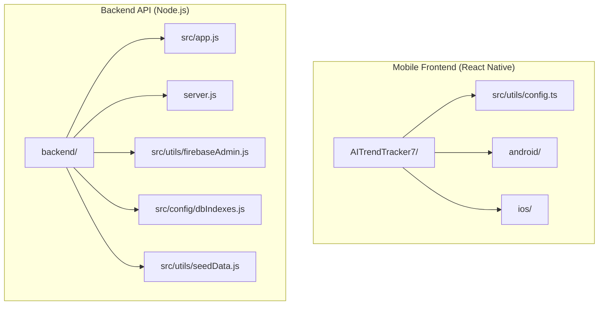
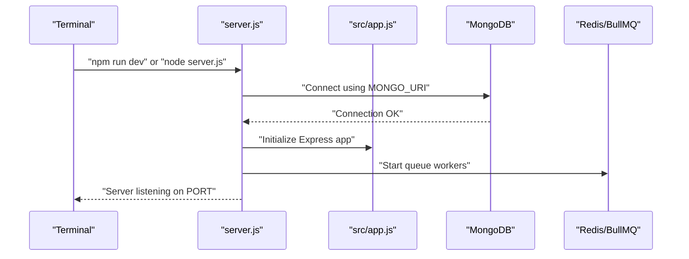
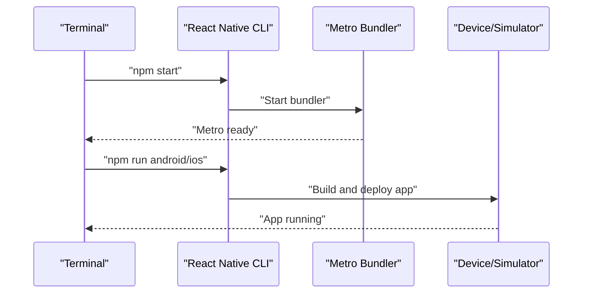

# Getting Started

<cite>
**Referenced Files in This Document**
- [package.json](file://package.json)
- [AITrendTracker7/package.json](file://AITrendTracker7/package.json)
- [AITrendTracker7/README.md](file://AITrendTracker7/README.md)
- [AITrendTracker7/src/utils/config.ts](file://AITrendTracker7/src/utils/config.ts)
- [AITrendTracker7/android/app/google-services.json](file://AITrendTracker7/android/app/google-services.json)
- [backend/package.json](file://backend/package.json)
- [backend/server.js](file://backend/server.js)
- [backend/src/app.js](file://backend/src/app.js)
- [backend/src/utils/firebaseAdmin.js](file://backend/src/utils/firebaseAdmin.js)
- [backend/src/config/dbIndexes.js](file://backend/src/config/dbIndexes.js)
- [backend/src/utils/seedData.js](file://backend/src/utils/seedData.js)
- [AITrendTracker7/babel.config.js](file://AITrendTracker7/babel.config.js)
</cite>

## Table of Contents
1. [Introduction](#introduction)
2. [Project Structure](#project-structure)
3. [Prerequisites](#prerequisites)
4. [Environment Setup](#environment-setup)
5. [Environment Variables](#environment-variables)
6. [Database Setup and Seeding](#database-setup-and-seeding)
7. [Development Server Startup](#development-server-startup)
8. [IDE Setup and Debugging](#ide-setup-and-debugging)
9. [Quick Start Examples](#quick-start-examples)
10. [Verification Steps](#verification-steps)
11. [Troubleshooting Guide](#troubleshooting-guide)
12. [Conclusion](#conclusion)

## Introduction
This guide walks you through setting up the AITrendTracker development environment for both the mobile (React Native) frontend and the Node.js backend. It covers prerequisites, environment configuration, database setup, initial seeding, starting development servers, IDE recommendations, debugging, and verification steps to ensure a smooth local development experience.

## Project Structure
The repository is organized into two primary areas:
- Mobile application: A React Native project under AITrendTracker7/
- Backend API and services: A Node.js/Express application under backend/

**Diagram sources**
- [AITrendTracker7/src/utils/config.ts:1-8](file://AITrendTracker7/src/utils/config.ts#L1-L8)
- [backend/src/app.js:1-88](file://backend/src/app.js#L1-L88)
- [backend/server.js:1-51](file://backend/server.js#L1-L51)
- [backend/src/utils/firebaseAdmin.js:1-23](file://backend/src/utils/firebaseAdmin.js#L1-L23)
- [backend/src/config/dbIndexes.js:1-31](file://backend/src/config/dbIndexes.js#L1-L31)
- [backend/src/utils/seedData.js:1-117](file://backend/src/utils/seedData.js#L1-L117)

**Section sources**
- [AITrendTracker7/package.json:1-70](file://AITrendTracker7/package.json#L1-L70)
- [backend/package.json:1-45](file://backend/package.json#L1-L45)

## Prerequisites
Before starting, ensure your system meets the following requirements:
- Node.js: The React Native project requires Node.js version as specified in its engines field.
- React Native CLI: Installed globally to run the React Native application.
- Android Studio: Required for Android builds and emulators.
- Xcode: Required for iOS builds and simulators.
- MongoDB: Required for the backend database.
- Redis: Required for queue workers and caching.
- Firebase Admin SDK: Required for backend Firebase integration.

Notes:
- The React Native project specifies a Node.js engine requirement.
- The backend depends on MongoDB and Redis for persistence and background processing.
- Firebase configuration is included for mobile and backend services.

**Section sources**
- [AITrendTracker7/package.json:66-68](file://AITrendTracker7/package.json#L66-L68)
- [backend/package.json:14-38](file://backend/package.json#L14-L38)
- [AITrendTracker7/android/app/google-services.json:1-47](file://AITrendTracker7/android/app/google-services.json#L1-L47)

## Environment Setup
Follow these steps to prepare your development environment:

### Install Node.js and React Native CLI
- Install Node.js matching the React Native project’s engine requirement.
- Install the React Native CLI globally to enable react-native commands.

### Android Studio Setup
- Install Android Studio and set up an Android Virtual Device (AVD).
- Ensure Android SDK, Build Tools, and Platform Tools are installed.
- Configure environment variables for Android SDK paths if needed.

### Xcode Setup
- Install Xcode from the Mac App Store.
- Open Xcode once to accept agreements and install additional components.
- Ensure CocoaPods is installed for iOS dependency management.

### MongoDB Setup
- Install and start MongoDB locally or use a cloud-hosted MongoDB instance.
- Ensure the MongoDB URI is accessible from your backend.

### Redis Setup
- Install and start Redis locally or use a managed Redis instance.
- Ensure the Redis connection is reachable from the backend.

### Firebase Admin Setup
- The backend expects a Firebase Admin credentials JSON file located in the backend directory.
- Confirm the file exists and is readable by the backend process.

**Section sources**
- [AITrendTracker7/package.json:66-68](file://AITrendTracker7/package.json#L66-L68)
- [backend/package.json:14-38](file://backend/package.json#L14-L38)
- [backend/src/utils/firebaseAdmin.js:1-23](file://backend/src/utils/firebaseAdmin.js#L1-L23)

## Environment Variables
Configure environment variables for both frontend and backend.

### Backend Environment Variables
Create a .env file in the backend/ directory with the following keys:
- MONGO_URI: MongoDB connection string
- REDIS_URL: Redis connection string
- ADMIN_SECRET: Secret used to protect the queue monitoring dashboard
- PORT: Backend server port (default used if unset)

The backend loads .env early in the server startup process and uses these variables for database connections, queue adapters, and admin authentication.

**Section sources**
- [backend/server.js:1-11](file://backend/server.js#L1-L11)
- [backend/src/app.js:51-57](file://backend/src/app.js#L51-L57)

### Frontend Environment Variables
The mobile app uses a runtime base URL configuration that defaults to a development address suitable for Android Emulator loopback. Update this to point to your backend when running on physical devices or custom networks.

- BASE_URL: Development base URL for API requests

**Section sources**
- [AITrendTracker7/src/utils/config.ts:1-8](file://AITrendTracker7/src/utils/config.ts#L1-L8)

## Database Setup and Seeding
The backend includes a seed script to populate initial trends data into MongoDB.

### Seed Initial Data
- Ensure MongoDB is running and accessible.
- From the backend/ directory, run the seed script to connect to MongoDB, drop existing trends, and insert predefined sample data.
- The script exits after seeding completes.

Verification:
- After seeding, confirm that documents were inserted into the trends collection.

**Section sources**
- [backend/src/utils/seedData.js:1-117](file://backend/src/utils/seedData.js#L1-L117)

## Development Server Startup
Start the development servers for both frontend and backend.

### Backend Server
- Navigate to the backend/ directory.
- Start the development server using the provided scripts.
- The server connects to MongoDB, initializes indexes, starts background workers, and exposes queue monitoring endpoints protected by an admin secret.

**Diagram sources**
- [backend/server.js:1-51](file://backend/server.js#L1-L51)
- [backend/src/app.js:1-88](file://backend/src/app.js#L1-L88)

**Section sources**
- [backend/package.json:6-10](file://backend/package.json#L6-L10)
- [backend/server.js:1-51](file://backend/server.js#L1-L51)

### Frontend Server (Metro Bundler)
- Navigate to the AITrendTracker7/ directory.
- Start the Metro bundler to serve the React Native app.
- Use the provided scripts to run on Android or iOS.

**Diagram sources**
- [AITrendTracker7/README.md:7-59](file://AITrendTracker7/README.md#L7-L59)
- [AITrendTracker7/package.json:5-11](file://AITrendTracker7/package.json#L5-L11)

**Section sources**
- [AITrendTracker7/README.md:7-59](file://AITrendTracker7/README.md#L7-L59)
- [AITrendTracker7/package.json:5-11](file://AITrendTracker7/package.json#L5-L11)

## IDE Setup and Debugging
Recommended IDE setup and debugging configurations:

### IDE Recommendations
- VS Code: Install recommended extensions for React Native, TypeScript, ESLint, Prettier, and React DevTools.
- Android Studio: Use for Android development and emulator management.
- Xcode: Use for iOS development and simulator management.

### Debugging Configurations
- React Native Debugger: Attach to Metro for frontend debugging.
- Chrome DevTools: Enable remote debugging for the React Native app.
- VS Code Launch Configurations: Set breakpoints and debug sessions for both platforms.
- Backend Debugging: Use Node.js debugger with nodemon for backend development.

### Additional Notes
- The React Native project includes Babel configuration for the Reanimated plugin.
- Ensure your IDE recognizes TypeScript and ESLint configurations for accurate linting and formatting.

**Section sources**
- [AITrendTracker7/babel.config.js:1-5](file://AITrendTracker7/babel.config.js#L1-L5)
- [AITrendTracker7/README.md:65-75](file://AITrendTracker7/README.md#L65-L75)

## Quick Start Examples
Run the application locally with the following steps:

### Start Backend
- From the backend/ directory:
  - Install dependencies if needed.
  - Start the development server using the dev script.

### Start Frontend
- From the AITrendTracker7/ directory:
  - Start the Metro bundler.
  - Run on Android or iOS using the provided scripts.

### Access Queue Monitoring Dashboard
- The backend exposes a queue monitoring dashboard at /admin/queues.
- Access requires a bearer token configured via ADMIN_SECRET.

**Section sources**
- [backend/package.json:6-10](file://backend/package.json#L6-L10)
- [AITrendTracker7/package.json:5-11](file://AITrendTracker7/package.json#L5-L11)
- [backend/src/app.js:33-57](file://backend/src/app.js#L33-L57)

## Verification Steps
Confirm successful setup with these checks:

- Backend Health Check
  - Call the /health endpoint to verify the backend is running.
  - Expected response indicates the API is healthy.

- Database Connectivity
  - Confirm MongoDB connection logs appear during backend startup.
  - Verify that indexes are ensured at startup.

- Queue Monitoring
  - Access /admin/queues with the correct bearer token.
  - Confirm queue adapters are registered and visible.

- Frontend Connectivity
  - Ensure the frontend resolves BASE_URL to the backend server.
  - Test API calls from the app to the backend endpoints.

**Section sources**
- [backend/src/app.js:23-26](file://backend/src/app.js#L23-L26)
- [backend/server.js:16-22](file://backend/server.js#L16-L22)
- [backend/src/config/dbIndexes.js:13-28](file://backend/src/config/dbIndexes.js#L13-L28)
- [AITrendTracker7/src/utils/config.ts:5-7](file://AITrendTracker7/src/utils/config.ts#L5-L7)

## Troubleshooting Guide
Common setup issues and resolutions:

- Node.js Version Mismatch
  - Ensure Node.js matches the React Native project’s engine requirement.
  - Downgrade or upgrade Node.js accordingly.

- Android Emulator Issues
  - Verify AVD is created and running.
  - Ensure Android SDK paths are configured correctly.
  - Reinstall or update Android Studio components if needed.

- iOS Build Issues
  - Install and run CocoaPods setup as described in the React Native README.
  - Ensure Xcode and command-line tools are up to date.

- MongoDB Connection Failures
  - Confirm MongoDB is running locally or reachable via the provided URI.
  - Check firewall and network settings if connecting remotely.

- Redis Connection Failures
  - Confirm Redis is running and accessible.
  - Verify REDIS_URL matches the running Redis instance.

- Firebase Admin Initialization Errors
  - Ensure the Firebase Admin credentials JSON file exists in the backend directory.
  - Check file permissions and path correctness.

- Port Conflicts
  - Change PORT in .env if the default port is in use.
  - Update frontend BASE_URL to match the new backend port.

- Queue Monitoring Unauthorized Access
  - Set ADMIN_SECRET in .env and use the same value in the Authorization header for /admin/queues.

**Section sources**
- [AITrendTracker7/package.json:66-68](file://AITrendTracker7/package.json#L66-L68)
- [AITrendTracker7/README.md:35-59](file://AITrendTracker7/README.md#L35-L59)
- [backend/server.js:1-11](file://backend/server.js#L1-L11)
- [backend/src/utils/firebaseAdmin.js:1-23](file://backend/src/utils/firebaseAdmin.js#L1-L23)
- [backend/src/app.js:51-57](file://backend/src/app.js#L51-L57)

## Conclusion
You now have the foundational steps to set up and run AITrendTracker locally. By configuring environment variables, preparing MongoDB and Redis, seeding initial data, and starting both the backend and frontend servers, you can develop and iterate efficiently. Use the verification steps and troubleshooting guide to resolve common issues quickly and maintain a smooth development workflow.