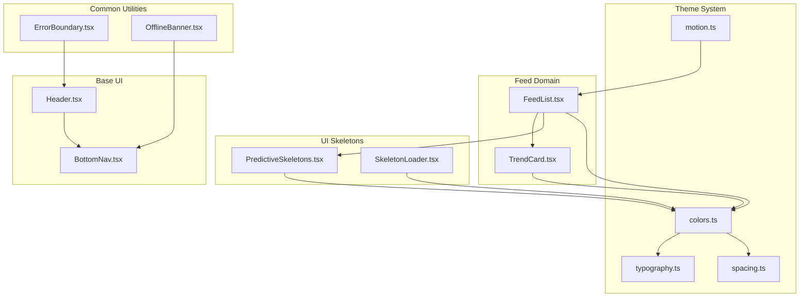
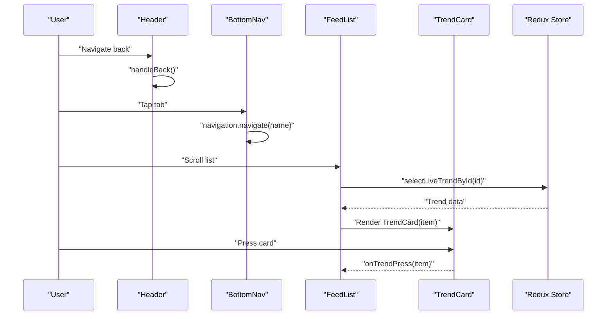
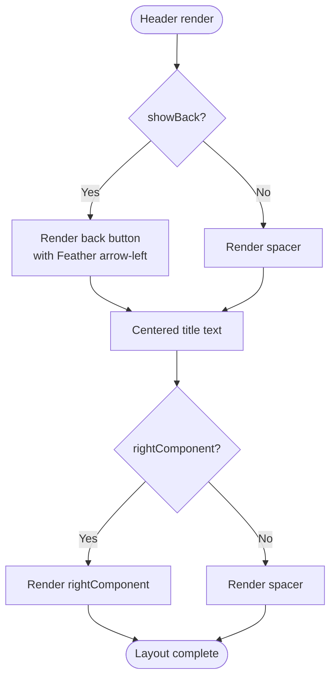
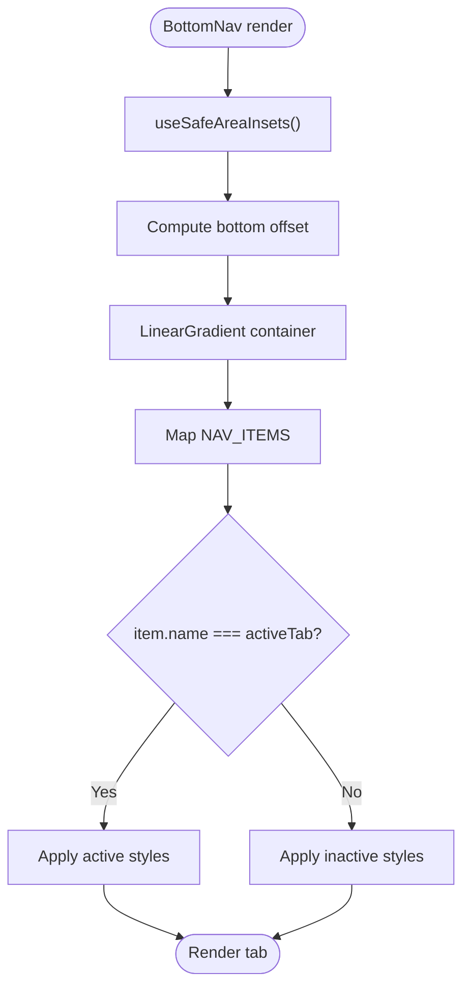
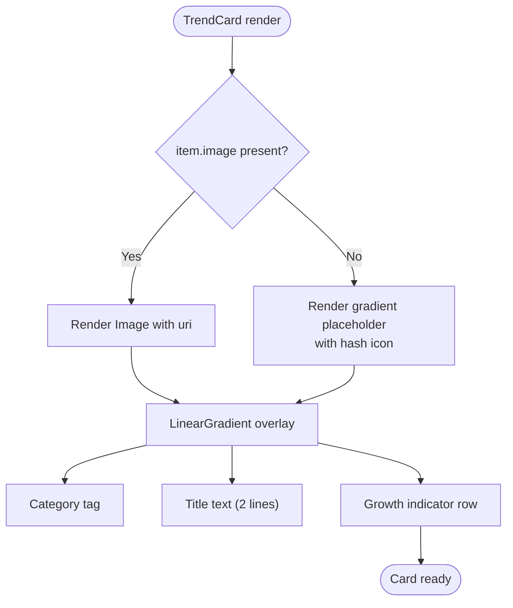
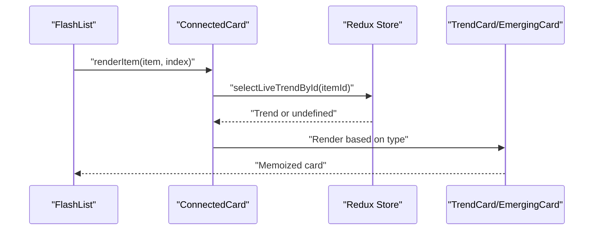
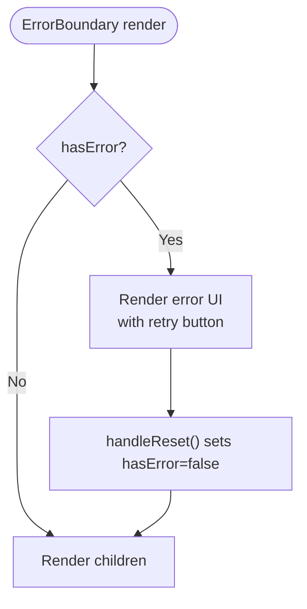
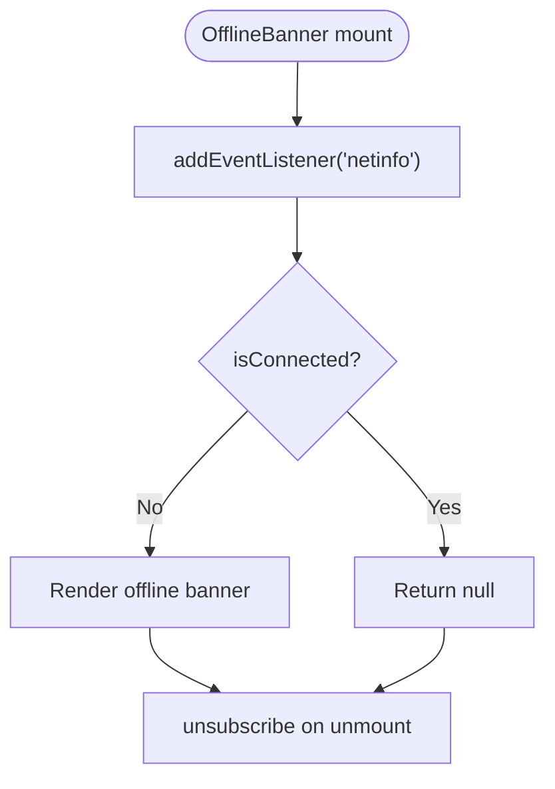
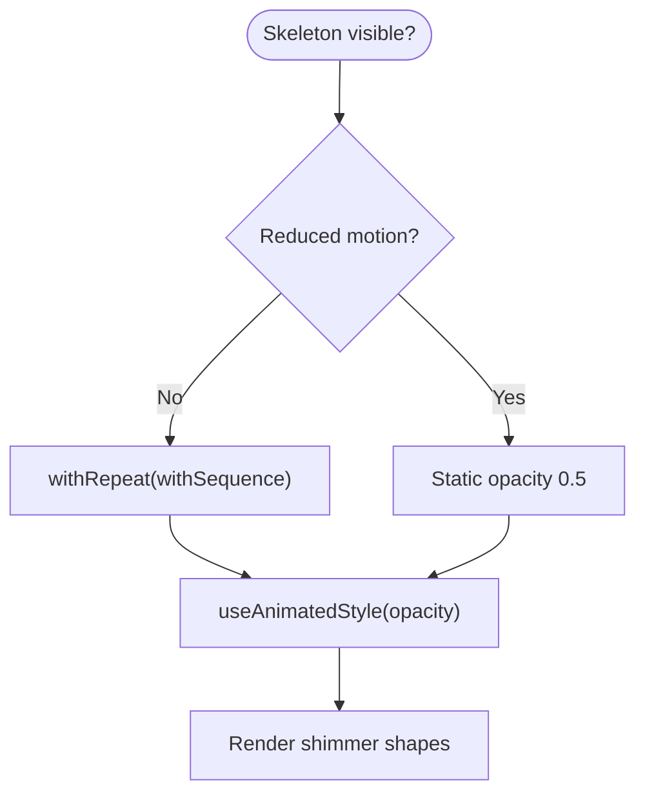
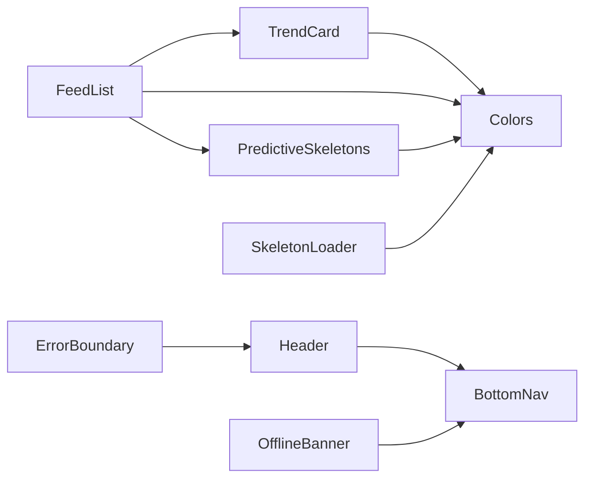

# Component Architecture and UI System

<cite>
**Referenced Files in This Document**
- [Header.tsx](file://AITrendTracker7/src/components/Header.tsx)
- [BottomNav.tsx](file://AITrendTracker7/src/components/BottomNav.tsx)
- [TrendCard.tsx](file://AITrendTracker7/src/components/feed/TrendCard.tsx)
- [FeedList.tsx](file://AITrendTracker7/src/components/feed/FeedList.tsx)
- [ErrorBoundary.tsx](file://AITrendTracker7/src/components/common/ErrorBoundary.tsx)
- [OfflineBanner.tsx](file://AITrendTracker7/src/components/common/OfflineBanner.tsx)
- [SkeletonLoader.tsx](file://AITrendTracker7/src/components/ui/SkeletonLoader.tsx)
- [PredictiveSkeletons.tsx](file://AITrendTracker7/src/components/ui/PredictiveSkeletons.tsx)
- [colors.ts](file://AITrendTracker7/src/theme/colors.ts)
- [typography.ts](file://AITrendTracker7/src/theme/typography.ts)
- [spacing.ts](file://AITrendTracker7/src/theme/spacing.ts)
- [motion.ts](file://AITrendTracker7/src/theme/motion.ts)
</cite>

## Table of Contents
1. [Introduction](#introduction)
2. [Project Structure](#project-structure)
3. [Core Components](#core-components)
4. [Architecture Overview](#architecture-overview)
5. [Detailed Component Analysis](#detailed-component-analysis)
6. [Dependency Analysis](#dependency-analysis)
7. [Performance Considerations](#performance-considerations)
8. [Accessibility Implementations](#accessibility-implementations)
9. [Testing Strategies](#testing-strategies)
10. [Troubleshooting Guide](#troubleshooting-guide)
11. [Conclusion](#conclusion)

## Introduction
This document describes the component architecture and UI system of the AITrendTracker mobile application. It explains the component hierarchy from foundational UI elements (Header, BottomNav) to specialized feed components (TrendCard, FeedList), and common utilities (ErrorBoundary, OfflineBanner). It also documents the theming system covering colors, typography, spacing, and motion tokens, along with composition patterns, prop interfaces, state management, lifecycle considerations, performance optimizations, accessibility features, and testing strategies.

## Project Structure
The UI system is organized by feature domains:
- Base UI: Header, BottomNav
- Feed domain: TrendCard, FeedList, EmergingCard, GestureSwipeWrapper
- Common utilities: ErrorBoundary, OfflineBanner
- UI skeletons: SkeletonLoader, PredictiveSkeletons
- Theme system: colors, typography, spacing, motion

**Diagram sources**
- [Header.tsx:1-84](file://AITrendTracker7/src/components/Header.tsx#L1-L84)
- [BottomNav.tsx:1-100](file://AITrendTracker7/src/components/BottomNav.tsx#L1-L100)
- [TrendCard.tsx:1-99](file://AITrendTracker7/src/components/feed/TrendCard.tsx#L1-L99)
- [FeedList.tsx:1-145](file://AITrendTracker7/src/components/feed/FeedList.tsx#L1-L145)
- [ErrorBoundary.tsx:1-83](file://AITrendTracker7/src/components/common/ErrorBoundary.tsx#L1-L83)
- [OfflineBanner.tsx:1-45](file://AITrendTracker7/src/components/common/OfflineBanner.tsx#L1-L45)
- [PredictiveSkeletons.tsx:1-151](file://AITrendTracker7/src/components/ui/PredictiveSkeletons.tsx#L1-L151)
- [SkeletonLoader.tsx:1-61](file://AITrendTracker7/src/components/ui/SkeletonLoader.tsx#L1-L61)
- [colors.ts:1-46](file://AITrendTracker7/src/theme/colors.ts#L1-L46)
- [typography.ts:1-32](file://AITrendTracker7/src/theme/typography.ts#L1-L32)
- [spacing.ts:1-20](file://AITrendTracker7/src/theme/spacing.ts#L1-L20)
- [motion.ts:1-61](file://AITrendTracker7/src/theme/motion.ts#L1-L61)

**Section sources**
- [Header.tsx:1-84](file://AITrendTracker7/src/components/Header.tsx#L1-L84)
- [BottomNav.tsx:1-100](file://AITrendTracker7/src/components/BottomNav.tsx#L1-L100)
- [TrendCard.tsx:1-99](file://AITrendTracker7/src/components/feed/TrendCard.tsx#L1-L99)
- [FeedList.tsx:1-145](file://AITrendTracker7/src/components/feed/FeedList.tsx#L1-L145)
- [ErrorBoundary.tsx:1-83](file://AITrendTracker7/src/components/common/ErrorBoundary.tsx#L1-L83)
- [OfflineBanner.tsx:1-45](file://AITrendTracker7/src/components/common/OfflineBanner.tsx#L1-L45)
- [PredictiveSkeletons.tsx:1-151](file://AITrendTracker7/src/components/ui/PredictiveSkeletons.tsx#L1-L151)
- [SkeletonLoader.tsx:1-61](file://AITrendTracker7/src/components/ui/SkeletonLoader.tsx#L1-L61)
- [colors.ts:1-46](file://AITrendTracker7/src/theme/colors.ts#L1-L46)
- [typography.ts:1-32](file://AITrendTracker7/src/theme/typography.ts#L1-L32)
- [spacing.ts:1-20](file://AITrendTracker7/src/theme/spacing.ts#L1-L20)
- [motion.ts:1-61](file://AITrendTracker7/src/theme/motion.ts#L1-L61)

## Core Components
This section documents the foundational and specialized components, their props, composition patterns, and state management.

- Header
  - Purpose: Provides a consistent top bar with optional back navigation and a right-side action area.
  - Key props: title, showBack, onBack, rightComponent.
  - Composition: Uses navigation hook to support programmatic back behavior; renders a back button and title with flexible right slot.
  - Accessibility: Back button uses touch target sizing and activeOpacity for feedback.

- BottomNav
  - Purpose: Navigation bar with gradient styling and safe-area awareness.
  - Key props: activeTab, navigation.
  - Composition: Renders four tab items with icons and labels; applies active styling based on current tab; integrates with linear gradient and safe-area insets.
  - State: Local state via safe-area insets; active tab is controlled externally.

- TrendCard
  - Purpose: Horizontal card representing a trending topic with image overlay and growth indicator.
  - Key props: item (Trend), onPress.
  - Composition: Conditionally renders image or gradient placeholder; overlay displays category tag, title, and growth metrics.
  - Performance: Memoized to prevent re-renders in lists.

- FeedList
  - Purpose: High-performance list for displaying trending content with horizontal and vertical modes.
  - Key props: data (normalized IDs or Trend objects), onRefresh, refreshing, onTrendPress, isHorizontal, type, isLoading.
  - Composition: Normalized wrapper selects live data from store; supports emerging vs standard cards; integrates swipe gestures; skeleton loading.
  - Performance: Uses FlashList, memoized renderers, and precomputed data to minimize layout thrashing.

- ErrorBoundary
  - Purpose: Graceful error handling at the component boundary.
  - Key props: children.
  - State: Tracks error state and provides reset action; renders a friendly UI with retry button.

- OfflineBanner
  - Purpose: Non-intrusive banner indicating offline mode.
  - Key props: none.
  - State: Monitors network connectivity via NetInfo; conditionally renders at top of viewport.

- SkeletonLoader and PredictiveSkeletons
  - Purpose: Provide loading states with minimal layout shift and reduced motion support.
  - Composition: Uses Reanimated shared values and animated styles; PredictiveSkeletons adapts to visibility and reduced motion preferences.

**Section sources**
- [Header.tsx:6-48](file://AITrendTracker7/src/components/Header.tsx#L6-L48)
- [BottomNav.tsx:9-56](file://AITrendTracker7/src/components/BottomNav.tsx#L9-L56)
- [TrendCard.tsx:7-99](file://AITrendTracker7/src/components/feed/TrendCard.tsx#L7-L99)
- [FeedList.tsx:12-145](file://AITrendTracker7/src/components/feed/FeedList.tsx#L12-L145)
- [ErrorBoundary.tsx:5-48](file://AITrendTracker7/src/components/common/ErrorBoundary.tsx#L5-L48)
- [OfflineBanner.tsx:6-24](file://AITrendTracker7/src/components/common/OfflineBanner.tsx#L6-L24)
- [SkeletonLoader.tsx:7-61](file://AITrendTracker7/src/components/ui/SkeletonLoader.tsx#L7-L61)
- [PredictiveSkeletons.tsx:16-75](file://AITrendTracker7/src/components/ui/PredictiveSkeletons.tsx#L16-L75)

## Architecture Overview
The UI architecture follows a layered composition pattern:
- Base UI components (Header, BottomNav) provide global affordances.
- FeedList orchestrates data fetching, normalization, and rendering of individual cards.
- TrendCard and specialized cards encapsulate presentation logic.
- Common utilities (ErrorBoundary, OfflineBanner) handle resilience and user feedback.
- Theme system supplies design tokens consumed across components.

**Diagram sources**
- [Header.tsx:13-27](file://AITrendTracker7/src/components/Header.tsx#L13-L27)
- [BottomNav.tsx:21-55](file://AITrendTracker7/src/components/BottomNav.tsx#L21-L55)
- [FeedList.tsx:25-81](file://AITrendTracker7/src/components/feed/FeedList.tsx#L25-L81)
- [TrendCard.tsx:12-39](file://AITrendTracker7/src/components/feed/TrendCard.tsx#L12-L39)

## Detailed Component Analysis

### Header Component
- Props interface: title (string), showBack (boolean), onBack (function), rightComponent (ReactNode).
- Behavior: Back navigation prioritizes custom handler, falls back to navigation stack; centers title; aligns right component.
- Styling: Uses StyleSheet constants for paddings, typography, and layout.

**Diagram sources**
- [Header.tsx:29-47](file://AITrendTracker7/src/components/Header.tsx#L29-L47)

**Section sources**
- [Header.tsx:6-48](file://AITrendTracker7/src/components/Header.tsx#L6-L48)

### BottomNav Component
- Props interface: activeTab (Tab union), navigation (any).
- Behavior: Renders four tabs with Feather icons; active tab receives accent color and bold label; integrates safe-area insets for bottom offset.
- Styling: Gradient background, rounded container, label styling, and shadow tokens.

**Diagram sources**
- [BottomNav.tsx:21-55](file://AITrendTracker7/src/components/BottomNav.tsx#L21-L55)

**Section sources**
- [BottomNav.tsx:9-99](file://AITrendTracker7/src/components/BottomNav.tsx#L9-L99)

### TrendCard Component
- Props interface: item (Trend), onPress (function).
- Behavior: Touchable wrapper triggers parent callback; renders image or gradient placeholder; overlay displays category tag, title, and growth metrics.
- Performance: Memoized to avoid re-renders in FlashList.

**Diagram sources**
- [TrendCard.tsx:12-39](file://AITrendTracker7/src/components/feed/TrendCard.tsx#L12-L39)

**Section sources**
- [TrendCard.tsx:7-99](file://AITrendTracker7/src/components/feed/TrendCard.tsx#L7-L99)

### FeedList Component
- Props interface: data (string | Trend[]), onRefresh, refreshing, onTrendPress, isHorizontal, type, isLoading.
- Behavior: Normalized card wrapper selects from Redux store when receiving IDs; supports emerging vs standard cards; integrates swipe gestures; shows predictive skeletons when loading.
- Performance: FlashList with estimated sizes, memoized renderers, and precomputed data.

**Diagram sources**
- [FeedList.tsx:25-57](file://AITrendTracker7/src/components/feed/FeedList.tsx#L25-L57)
- [FeedList.tsx:59-122](file://AITrendTracker7/src/components/feed/FeedList.tsx#L59-L122)

**Section sources**
- [FeedList.tsx:12-145](file://AITrendTracker7/src/components/feed/FeedList.tsx#L12-L145)

### ErrorBoundary Component
- Props interface: children (ReactNode).
- Behavior: Catches errors via static getDerivedStateFromError; logs error info; renders friendly UI with reset button.

**Diagram sources**
- [ErrorBoundary.tsx:14-47](file://AITrendTracker7/src/components/common/ErrorBoundary.tsx#L14-L47)

**Section sources**
- [ErrorBoundary.tsx:5-48](file://AITrendTracker7/src/components/common/ErrorBoundary.tsx#L5-L48)

### OfflineBanner Component
- Props interface: none.
- Behavior: Subscribes to NetInfo events; sets local state when offline; renders banner at top of viewport.

**Diagram sources**
- [OfflineBanner.tsx:9-23](file://AITrendTracker7/src/components/common/OfflineBanner.tsx#L9-L23)

**Section sources**
- [OfflineBanner.tsx:6-24](file://AITrendTracker7/src/components/common/OfflineBanner.tsx#L6-L24)

### SkeletonLoader and PredictiveSkeletons
- Props interface: isVisible (boolean), type ('card' | 'featured'), width/height/borderRadius/style (SkeletonShimmer).
- Behavior: Animated opacity transitions; PredictiveSkeletons pauses when offscreen or reduced motion is enabled; both use theme tokens for colors and spacing.

**Diagram sources**
- [PredictiveSkeletons.tsx:25-75](file://AITrendTracker7/src/components/ui/PredictiveSkeletons.tsx#L25-L75)
- [SkeletonLoader.tsx:14-35](file://AITrendTracker7/src/components/ui/SkeletonLoader.tsx#L14-L35)

**Section sources**
- [PredictiveSkeletons.tsx:16-151](file://AITrendTracker7/src/components/ui/PredictiveSkeletons.tsx#L16-L151)
- [SkeletonLoader.tsx:7-61](file://AITrendTracker7/src/components/ui/SkeletonLoader.tsx#L7-L61)

## Dependency Analysis
Component dependencies and coupling:
- FeedList depends on Redux selectors for normalized data and FlashList for performance.
- TrendCard is a leaf component depending on theme tokens for colors and gradients.
- Header and BottomNav are independent UI primitives; they compose at the screen level.
- ErrorBoundary wraps subtrees to improve resilience.
- OfflineBanner is a standalone observer component.
- Skeleton loaders depend on theme tokens and Reanimated for animations.

**Diagram sources**
- [FeedList.tsx:5-10](file://AITrendTracker7/src/components/feed/FeedList.tsx#L5-L10)
- [TrendCard.tsx:4-5](file://AITrendTracker7/src/components/feed/TrendCard.tsx#L4-L5)
- [Header.tsx:3-4](file://AITrendTracker7/src/components/Header.tsx#L3-L4)
- [BottomNav.tsx:3-5](file://AITrendTracker7/src/components/BottomNav.tsx#L3-L5)
- [ErrorBoundary.tsx:3](file://AITrendTracker7/src/components/common/ErrorBoundary.tsx#L3)
- [OfflineBanner.tsx:3](file://AITrendTracker7/src/components/common/OfflineBanner.tsx#L3)
- [PredictiveSkeletons.tsx:12](file://AITrendTracker7/src/components/ui/PredictiveSkeletons.tsx#L12)
- [SkeletonLoader.tsx:4](file://AITrendTracker7/src/components/ui/SkeletonLoader.tsx#L4)

**Section sources**
- [FeedList.tsx:1-145](file://AITrendTracker7/src/components/feed/FeedList.tsx#L1-L145)
- [TrendCard.tsx:1-99](file://AITrendTracker7/src/components/feed/TrendCard.tsx#L1-L99)
- [Header.tsx:1-84](file://AITrendTracker7/src/components/Header.tsx#L1-L84)
- [BottomNav.tsx:1-100](file://AITrendTracker7/src/components/BottomNav.tsx#L1-L100)
- [ErrorBoundary.tsx:1-83](file://AITrendTracker7/src/components/common/ErrorBoundary.tsx#L1-L83)
- [OfflineBanner.tsx:1-45](file://AITrendTracker7/src/components/common/OfflineBanner.tsx#L1-L45)
- [PredictiveSkeletons.tsx:1-151](file://AITrendTracker7/src/components/ui/PredictiveSkeletons.tsx#L1-L151)
- [SkeletonLoader.tsx:1-61](file://AITrendTracker7/src/components/ui/SkeletonLoader.tsx#L1-L61)

## Performance Considerations
- List virtualization: FeedList uses FlashList with estimated item sizes to maintain smooth scrolling.
- Memoization: TrendCard and FeedList are memoized to prevent unnecessary re-renders.
- Normalized data access: ConnectedCard selects live data from Redux store using shallow equality checks to avoid re-renders.
- Skeleton loading: PredictiveSkeletons and SkeletonLoader use opacity animations and pause when offscreen or reduced motion is enabled.
- Gesture thresholds: Motion tokens define swipe activation distance and velocity thresholds to reduce accidental actions.
- Network monitoring: OfflineBanner subscribes to NetInfo to avoid redundant work when offline.

[No sources needed since this section provides general guidance]

## Accessibility Implementations
- Touch targets: Header back button and BottomNav items use adequate sizing and activeOpacity for feedback.
- Reduced motion: PredictiveSkeletons respects reduced motion preferences by pausing animations.
- Focus and semantics: While explicit focus management is not shown, using TouchableOpacity and Text ensures basic native accessibility support.
- Contrast and readability: Theme tokens emphasize AAA contrast with dark backgrounds and neon accents for readability.

[No sources needed since this section provides general guidance]

## Testing Strategies
- Unit tests for components: Use React Native testing library to render components with mocked navigation and Redux providers.
- Snapshot tests: Capture rendered output of Header, BottomNav, and skeleton components to detect regressions.
- Interaction tests: Simulate back navigation, tab switching, and card presses; verify callbacks are invoked.
- Error boundary tests: Wrap a component tree with ErrorBoundary and simulate thrown errors to verify fallback UI.
- Network tests: Mock NetInfo to verify OfflineBanner visibility under offline conditions.
- Performance tests: Measure scroll frames with FeedList and verify stable FPS with FlashList and memoization.

[No sources needed since this section provides general guidance]

## Troubleshooting Guide
- Header back navigation not working:
  - Verify showBack flag and onBack handler; ensure navigation stack is not empty.
- BottomNav active state not updating:
  - Confirm activeTab prop matches one of the NAV_ITEMS names and navigation is passed correctly.
- TrendCard not rendering data:
  - Check that item prop is provided and image URLs are valid; confirm normalized IDs resolve via Redux selectors.
- FeedList not scrolling:
  - Ensure data is not empty and estimatedItemSize is set; verify horizontal/vertical orientation and padding.
- ErrorBoundary not resetting:
  - Confirm handleReset is called and state transitions back to normal render.
- OfflineBanner not appearing:
  - Validate NetInfo subscription and isConnected state; ensure banner is rendered at top of viewport.

**Section sources**
- [Header.tsx:13-27](file://AITrendTracker7/src/components/Header.tsx#L13-L27)
- [BottomNav.tsx:21-55](file://AITrendTracker7/src/components/BottomNav.tsx#L21-L55)
- [FeedList.tsx:59-122](file://AITrendTracker7/src/components/feed/FeedList.tsx#L59-L122)
- [ErrorBoundary.tsx:28-30](file://AITrendTracker7/src/components/common/ErrorBoundary.tsx#L28-L30)
- [OfflineBanner.tsx:9-14](file://AITrendTracker7/src/components/common/OfflineBanner.tsx#L9-L14)

## Conclusion
The AITrendTracker UI system combines modular base components (Header, BottomNav), a high-performance feed renderer (FeedList), specialized cards (TrendCard), and resilient utilities (ErrorBoundary, OfflineBanner). The theming system provides a cohesive design language across colors, typography, spacing, and motion tokens. Composition patterns, memoization, and virtualized lists ensure performance, while skeleton loaders and reduced-motion support enhance UX. The architecture supports scalable enhancements and consistent accessibility.