# Mobile Application Architecture

<cite>
**Referenced Files in This Document**
- [App.tsx](file://AITrendTracker7/App.tsx)
- [AuthNavigator.tsx](file://AITrendTracker7/src/navigations/AuthNavigator.tsx)
- [HomeScreen.tsx](file://AITrendTracker7/src/navigations/screens/HomeScreen.tsx)
- [LoginScreen.tsx](file://AITrendTracker7/src/navigations/screens/LoginScreen.tsx)
- [socketService.ts](file://AITrendTracker7/src/services/socketService.ts)
- [index.ts](file://AITrendTracker7/src/store/index.ts)
- [apiSlice.ts](file://AITrendTracker7/src/store/apiSlice.ts)
- [authSlice.ts](file://AITrendTracker7/src/store/slices/authSlice.ts)
- [trendsSlice.ts](file://AITrendTracker7/src/store/slices/trendsSlice.ts)
- [hooks.ts](file://AITrendTracker7/src/store/hooks.ts)
- [storage.ts](file://AITrendTracker7/src/store/storage.ts)
- [OfflineBanner.tsx](file://AITrendTracker7/src/components/common/OfflineBanner.tsx)
- [FeedList.tsx](file://AITrendTracker7/src/components/feed/FeedList.tsx)
- [colors.ts](file://AITrendTracker7/src/theme/colors.ts)
- [typography.ts](file://AITrendTracker7/src/theme/typography.ts)
- [config.ts](file://AITrendTracker7/src/utils/config.ts)
- [savedStorage.ts](file://AITrendTracker7/src/utils/savedStorage.ts)
- [package.json](file://AITrendTracker7/package.json)
</cite>

## Table of Contents
1. [Introduction](#introduction)
2. [Project Structure](#project-structure)
3. [Core Components](#core-components)
4. [Architecture Overview](#architecture-overview)
5. [Detailed Component Analysis](#detailed-component-analysis)
6. [Dependency Analysis](#dependency-analysis)
7. [Performance Considerations](#performance-considerations)
8. [Troubleshooting Guide](#troubleshooting-guide)
9. [Conclusion](#conclusion)
10. [Appendices](#appendices)

## Introduction
This document describes the mobile application architecture for a React Native application focused on real-time trend analytics. It covers high-level design patterns including Redux Toolkit for state management, React Navigation for screen routing, and Socket.IO client for real-time updates. The document traces the component hierarchy from the root App component down to navigator stacks and individual screens, and explains mobile-specific architectural decisions such as native module integration, platform-specific styling, performance optimizations, offline behavior, theming, and accessibility.

## Project Structure
The application follows a feature-based structure with clear separation of concerns:
- Root entry point initializes providers, navigation, and real-time connectivity.
- Navigation stack defines screens and transitions.
- Store organizes Redux slices, RTK Query API, and persistence.
- Services encapsulate network and real-time integrations.
- Components are grouped by feature areas (feed, geo, prediction, UI).
- Theme and utilities provide design tokens and shared helpers.

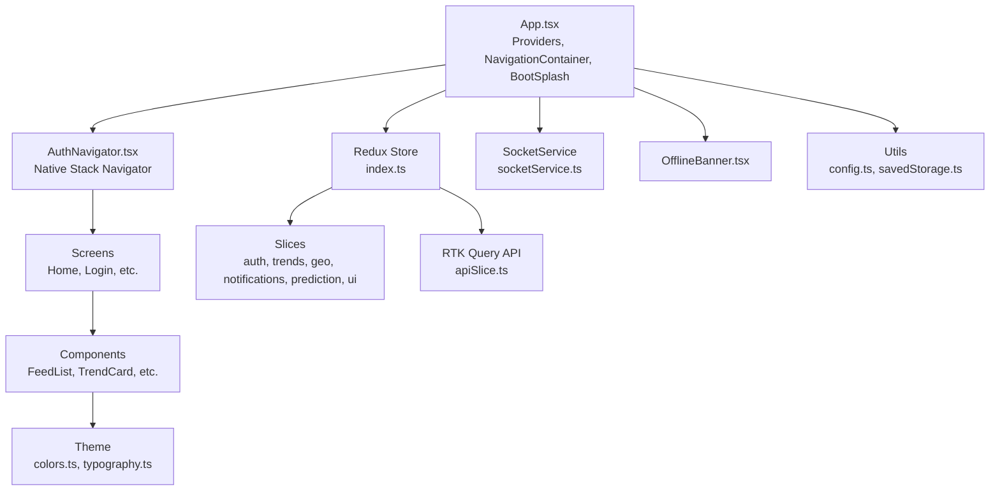

**Diagram sources**
- [App.tsx:15-59](file://AITrendTracker7/App.tsx#L15-L59)
- [AuthNavigator.tsx:23-62](file://AITrendTracker7/src/navigations/AuthNavigator.tsx#L23-L62)
- [index.ts:1-46](file://AITrendTracker7/src/store/index.ts#L1-L46)
- [apiSlice.ts:1-40](file://AITrendTracker7/src/store/apiSlice.ts#L1-L40)
- [socketService.ts:1-110](file://AITrendTracker7/src/services/socketService.ts#L1-L110)
- [OfflineBanner.tsx:1-45](file://AITrendTracker7/src/components/common/OfflineBanner.tsx#L1-L45)
- [FeedList.tsx:1-145](file://AITrendTracker7/src/components/feed/FeedList.tsx#L1-L145)
- [colors.ts:1-46](file://AITrendTracker7/src/theme/colors.ts#L1-L46)
- [typography.ts:1-32](file://AITrendTracker7/src/theme/typography.ts#L1-L32)
- [config.ts:1-8](file://AITrendTracker7/src/utils/config.ts#L1-L8)
- [savedStorage.ts:1-79](file://AITrendTracker7/src/utils/savedStorage.ts#L1-L79)

**Section sources**
- [App.tsx:15-59](file://AITrendTracker7/App.tsx#L15-L59)
- [AuthNavigator.tsx:23-62](file://AITrendTracker7/src/navigations/AuthNavigator.tsx#L23-L62)
- [index.ts:1-46](file://AITrendTracker7/src/store/index.ts#L1-L46)
- [apiSlice.ts:1-40](file://AITrendTracker7/src/store/apiSlice.ts#L1-L40)
- [socketService.ts:1-110](file://AITrendTracker7/src/services/socketService.ts#L1-L110)
- [OfflineBanner.tsx:1-45](file://AITrendTracker7/src/components/common/OfflineBanner.tsx#L1-L45)
- [FeedList.tsx:1-145](file://AITrendTracker7/src/components/feed/FeedList.tsx#L1-L145)
- [colors.ts:1-46](file://AITrendTracker7/src/theme/colors.ts#L1-L46)
- [typography.ts:1-32](file://AITrendTracker7/src/theme/typography.ts#L1-L32)
- [config.ts:1-8](file://AITrendTracker7/src/utils/config.ts#L1-L8)
- [savedStorage.ts:1-79](file://AITrendTracker7/src/utils/savedStorage.ts#L1-L79)

## Core Components
- App root initializes providers, boot splash, error boundary, toast provider, offline banner, navigation container, and real-time socket service lifecycle.
- AuthNavigator defines the native stack with initial route and screen options.
- Redux store composes reducers, persists selected slices, and integrates RTK Query middleware.
- SocketService manages WebSocket connections, event subscriptions, and batching for real-time updates.
- OfflineBanner monitors connectivity and displays a persistent banner.
- FeedList leverages FlashList and normalized entity adapters for efficient rendering.
- Theme system provides color and typography tokens.

**Section sources**
- [App.tsx:15-59](file://AITrendTracker7/App.tsx#L15-L59)
- [AuthNavigator.tsx:23-62](file://AITrendTracker7/src/navigations/AuthNavigator.tsx#L23-L62)
- [index.ts:1-46](file://AITrendTracker7/src/store/index.ts#L1-L46)
- [socketService.ts:1-110](file://AITrendTracker7/src/services/socketService.ts#L1-L110)
- [OfflineBanner.tsx:1-45](file://AITrendTracker7/src/components/common/OfflineBanner.tsx#L1-L45)
- [FeedList.tsx:1-145](file://AITrendTracker7/src/components/feed/FeedList.tsx#L1-L145)
- [colors.ts:1-46](file://AITrendTracker7/src/theme/colors.ts#L1-L46)
- [typography.ts:1-32](file://AITrendTracker7/src/theme/typography.ts#L1-L32)

## Architecture Overview
The application follows a layered architecture:
- Presentation Layer: App root, navigators, and screens.
- Domain Layer: Redux slices and RTK Query endpoints.
- Infrastructure Layer: SocketService, persistence, and utilities.
- Native Integrations: Firebase Auth, NetInfo, Gesture Handler, BootSplash.

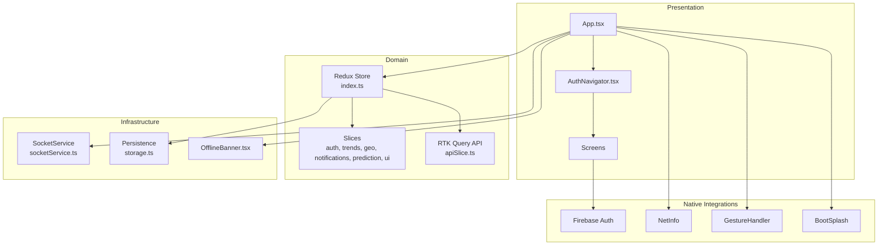

**Diagram sources**
- [App.tsx:15-59](file://AITrendTracker7/App.tsx#L15-L59)
- [AuthNavigator.tsx:23-62](file://AITrendTracker7/src/navigations/AuthNavigator.tsx#L23-L62)
- [index.ts:1-46](file://AITrendTracker7/src/store/index.ts#L1-L46)
- [apiSlice.ts:1-40](file://AITrendTracker7/src/store/apiSlice.ts#L1-L40)
- [socketService.ts:1-110](file://AITrendTracker7/src/services/socketService.ts#L1-L110)
- [storage.ts:1-23](file://AITrendTracker7/src/store/storage.ts#L1-L23)
- [OfflineBanner.tsx:1-45](file://AITrendTracker7/src/components/common/OfflineBanner.tsx#L1-L45)

## Detailed Component Analysis

### App Root and Providers
- Initializes AppState listener to reconnect sockets on foreground and disconnect on background.
- Wraps the app with Redux Provider and PersistGate using MMKV-backed persistence.
- Provides ToastProvider and ErrorBoundary for global UX and resilience.
- Uses NavigationContainer with BootSplash hide on ready.

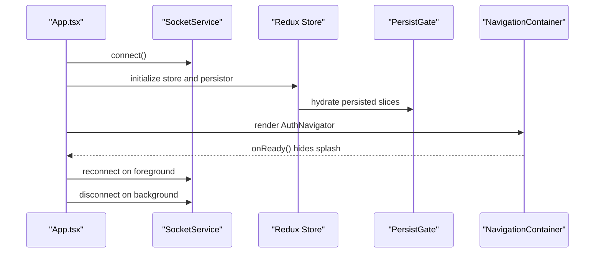

**Diagram sources**
- [App.tsx:18-41](file://AITrendTracker7/App.tsx#L18-L41)
- [socketService.ts:17-68](file://AITrendTracker7/src/services/socketService.ts#L17-L68)
- [index.ts:32-42](file://AITrendTracker7/src/store/index.ts#L32-L42)

**Section sources**
- [App.tsx:15-59](file://AITrendTracker7/App.tsx#L15-L59)
- [socketService.ts:1-110](file://AITrendTracker7/src/services/socketService.ts#L1-L110)
- [index.ts:1-46](file://AITrendTracker7/src/store/index.ts#L1-L46)

### Navigation Architecture
- AuthNavigator uses createNativeStackNavigator with gesture-enabled screens and a defined initial route.
- Screens include authentication flows and main application screens.

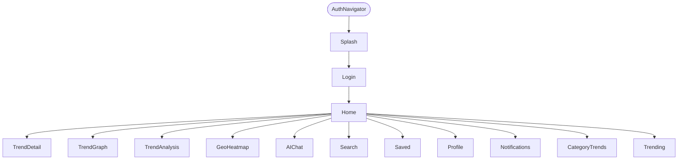

**Diagram sources**
- [AuthNavigator.tsx:23-62](file://AITrendTracker7/src/navigations/AuthNavigator.tsx#L23-L62)

**Section sources**
- [AuthNavigator.tsx:23-62](file://AITrendTracker7/src/navigations/AuthNavigator.tsx#L23-L62)

### Redux Toolkit State Management
- Central store combines RTK Query reducer and domain slices.
- Persistence configured with whitelist and MMKV storage.
- Hooks provide strongly-typed access to dispatch and selectors.

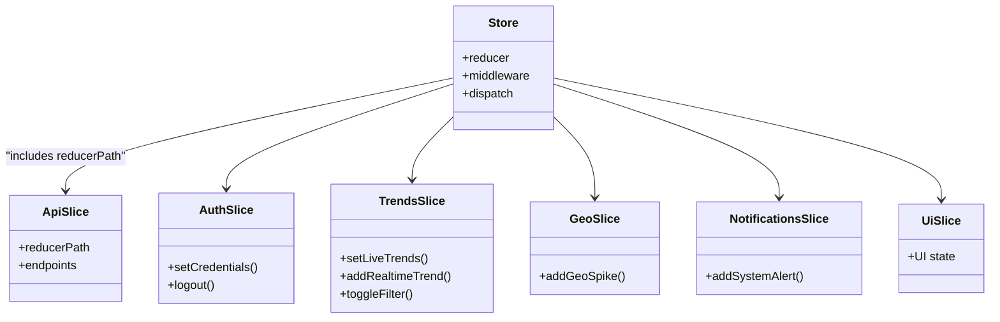

**Diagram sources**
- [index.ts:20-30](file://AITrendTracker7/src/store/index.ts#L20-L30)
- [apiSlice.ts:4-33](file://AITrendTracker7/src/store/apiSlice.ts#L4-L33)
- [authSlice.ts:22-47](file://AITrendTracker7/src/store/slices/authSlice.ts#L22-L47)
- [trendsSlice.ts:36-66](file://AITrendTracker7/src/store/slices/trendsSlice.ts#L36-L66)

**Section sources**
- [index.ts:1-46](file://AITrendTracker7/src/store/index.ts#L1-L46)
- [apiSlice.ts:1-40](file://AITrendTracker7/src/store/apiSlice.ts#L1-L40)
- [authSlice.ts:1-63](file://AITrendTracker7/src/store/slices/authSlice.ts#L1-L63)
- [trendsSlice.ts:1-80](file://AITrendTracker7/src/store/slices/trendsSlice.ts#L1-L80)
- [hooks.ts:1-7](file://AITrendTracker7/src/store/hooks.ts#L1-L7)

### Real-Time Communication with Socket.IO
- SocketService connects to the backend with WebSocket transport and automatic reconnection.
- Subscribes to multiple events: emerging trends, geo spikes, system alerts, and AI predictions.
- Batches live trend updates to mitigate layout thrashing during high-frequency updates.

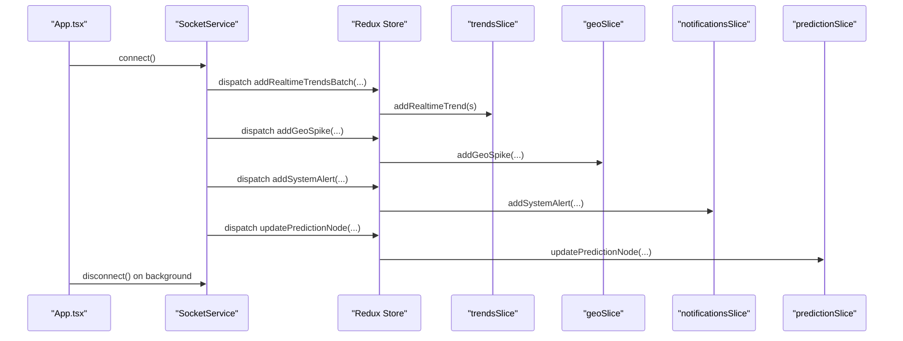

**Diagram sources**
- [socketService.ts:17-68](file://AITrendTracker7/src/services/socketService.ts#L17-L68)
- [trendsSlice.ts:49-54](file://AITrendTracker7/src/store/slices/trendsSlice.ts#L49-L54)
- [index.ts:32-42](file://AITrendTracker7/src/store/index.ts#L32-L42)

**Section sources**
- [socketService.ts:1-110](file://AITrendTracker7/src/services/socketService.ts#L1-L110)
- [trendsSlice.ts:1-80](file://AITrendTracker7/src/store/slices/trendsSlice.ts#L1-L80)

### Data Flow: RTK Query and UI
- HomeScreen uses RTK Query to fetch home feed data and updates normalized live trends and pulse score.
- FeedList renders lists efficiently using FlashList and normalized entities.

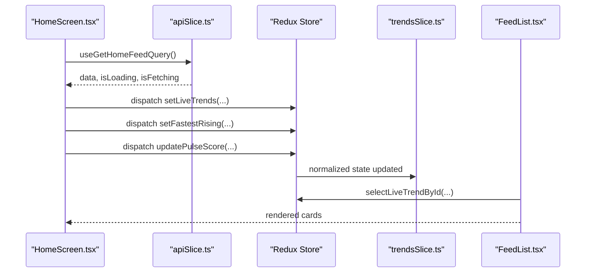

**Diagram sources**
- [HomeScreen.tsx:37-52](file://AITrendTracker7/src/navigations/screens/HomeScreen.tsx#L37-L52)
- [apiSlice.ts:18-22](file://AITrendTracker7/src/store/apiSlice.ts#L18-L22)
- [trendsSlice.ts:40-54](file://AITrendTracker7/src/store/slices/trendsSlice.ts#L40-L54)
- [FeedList.tsx:69-81](file://AITrendTracker7/src/components/feed/FeedList.tsx#L69-L81)

**Section sources**
- [HomeScreen.tsx:1-199](file://AITrendTracker7/src/navigations/screens/HomeScreen.tsx#L1-L199)
- [apiSlice.ts:1-40](file://AITrendTracker7/src/store/apiSlice.ts#L1-L40)
- [trendsSlice.ts:1-80](file://AITrendTracker7/src/store/slices/trendsSlice.ts#L1-L80)
- [FeedList.tsx:1-145](file://AITrendTracker7/src/components/feed/FeedList.tsx#L1-L145)

### Authentication Flow
- LoginScreen integrates Firebase Auth and Google Sign-In, navigating to Home upon success.

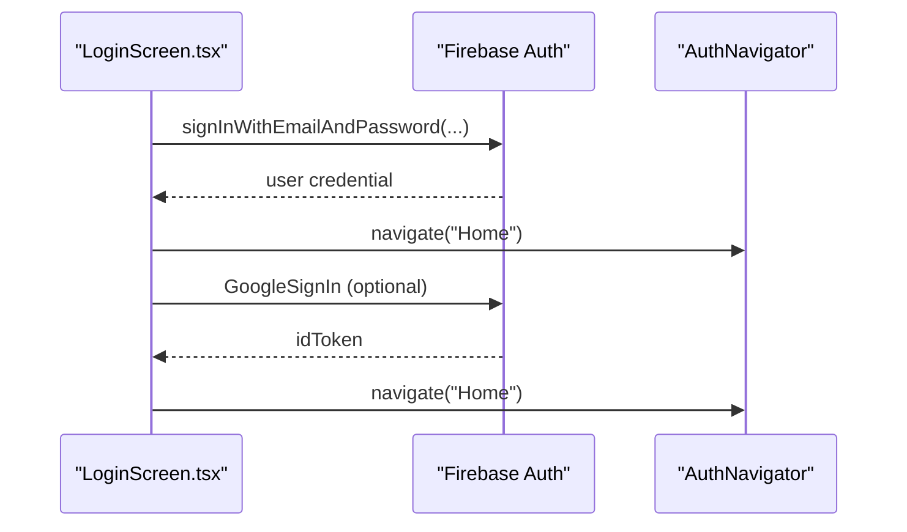

**Diagram sources**
- [LoginScreen.tsx:40-102](file://AITrendTracker7/src/navigations/screens/LoginScreen.tsx#L40-L102)

**Section sources**
- [LoginScreen.tsx:1-364](file://AITrendTracker7/src/navigations/screens/LoginScreen.tsx#L1-L364)

### Offline Functionality
- OfflineBanner subscribes to NetInfo to display a persistent offline banner.
- RTK Query caches responses and can be combined with background/foreground lifecycle to refetch on reconnect.

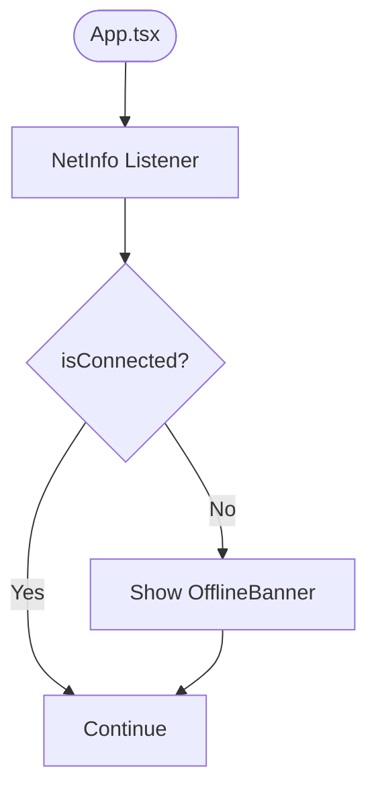

**Diagram sources**
- [OfflineBanner.tsx:9-14](file://AITrendTracker7/src/components/common/OfflineBanner.tsx#L9-L14)
- [App.tsx:22-35](file://AITrendTracker7/App.tsx#L22-L35)

**Section sources**
- [OfflineBanner.tsx:1-45](file://AITrendTracker7/src/components/common/OfflineBanner.tsx#L1-L45)
- [App.tsx:18-41](file://AITrendTracker7/App.tsx#L18-L41)

### Theming and Responsive Design
- Theme provides color tokens and typography scales.
- Screens use StyleSheet with responsive sizing and safe area contexts.
- Components leverage gradients and animated transitions for polished UI.

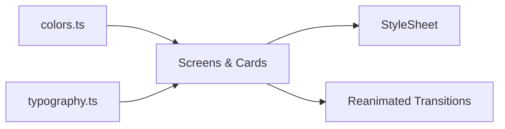

**Diagram sources**
- [colors.ts:5-45](file://AITrendTracker7/src/theme/colors.ts#L5-L45)
- [typography.ts:7-31](file://AITrendTracker7/src/theme/typography.ts#L7-L31)
- [HomeScreen.tsx:171-198](file://AITrendTracker7/src/navigations/screens/HomeScreen.tsx#L171-L198)
- [FeedList.tsx:4-5](file://AITrendTracker7/src/components/feed/FeedList.tsx#L4-L5)

**Section sources**
- [colors.ts:1-46](file://AITrendTracker7/src/theme/colors.ts#L1-L46)
- [typography.ts:1-32](file://AITrendTracker7/src/theme/typography.ts#L1-L32)
- [HomeScreen.tsx:1-199](file://AITrendTracker7/src/navigations/screens/HomeScreen.tsx#L1-L199)
- [FeedList.tsx:1-145](file://AITrendTracker7/src/components/feed/FeedList.tsx#L1-L145)

### Accessibility and Platform-Specific Styling
- SafeAreaView and StatusBar configurations improve safe area handling.
- Platform-specific keyboardAvoidingView behavior and input paddings.
- GestureHandlerRootView enables gesture-based navigation and swipes.

**Section sources**
- [HomeScreen.tsx:10-12](file://AITrendTracker7/src/navigations/screens/HomeScreen.tsx#L10-L12)
- [LoginScreen.tsx:10-16](file://AITrendTracker7/src/navigations/screens/LoginScreen.tsx#L10-L16)
- [App.tsx:44](file://AITrendTracker7/App.tsx#L44)

### Push Notifications and Permissions
- Firebase dependencies indicate integration points for push notifications and cloud messaging.
- No explicit notification handling code is present in the reviewed files; typical implementation would involve Firebase Cloud Messaging and platform permission flows.

**Section sources**
- [package.json:15-18](file://AITrendTracker7/package.json#L15-L18)

## Dependency Analysis
The application relies on a curated set of libraries for navigation, state, persistence, networking, and native integrations.

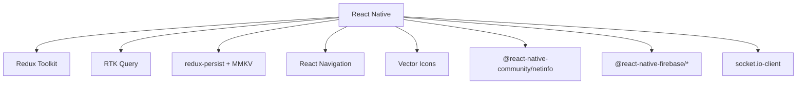

**Diagram sources**
- [package.json:12-43](file://AITrendTracker7/package.json#L12-L43)

**Section sources**
- [package.json:1-70](file://AITrendTracker7/package.json#L1-L70)

## Performance Considerations
- FlashList is used for efficient virtualized rendering of lists.
- Entity normalization reduces re-renders and improves lookup performance.
- Batching of real-time trend updates prevents layout thrashing.
- Persistence with MMKV reduces cold-start hydration overhead.
- RTK Query caching and tag-based invalidation minimize redundant network calls.
- GestureHandlerRootView and Reanimated enable smooth animations.

[No sources needed since this section provides general guidance]

## Troubleshooting Guide
- Socket connection lifecycle: Verify AppState events trigger connect/disconnect appropriately.
- Offline banner: Confirm NetInfo subscription and banner visibility logic.
- Redux hydration: Ensure whitelist matches intended persisted slices and MMKV keys.
- RTK Query errors: Check Authorization header injection and endpoint URLs.
- Authentication: Validate Firebase configuration and Google Sign-In setup.

**Section sources**
- [App.tsx:18-41](file://AITrendTracker7/App.tsx#L18-L41)
- [OfflineBanner.tsx:9-14](file://AITrendTracker7/src/components/common/OfflineBanner.tsx#L9-L14)
- [index.ts:14-18](file://AITrendTracker7/src/store/index.ts#L14-L18)
- [apiSlice.ts:8-14](file://AITrendTracker7/src/store/apiSlice.ts#L8-L14)
- [LoginScreen.tsx:34-38](file://AITrendTracker7/src/navigations/screens/LoginScreen.tsx#L34-L38)

## Conclusion
The application employs a robust, layered architecture leveraging Redux Toolkit for predictable state, React Navigation for seamless routing, and Socket.IO for real-time updates. Mobile-specific optimizations include persistence, offline awareness, responsive theming, and native integrations. The component hierarchy from App to AuthNavigator to screens, combined with normalized entities and virtualized lists, yields a scalable and performant mobile experience.

[No sources needed since this section summarizes without analyzing specific files]

## Appendices

### Data Model Overview
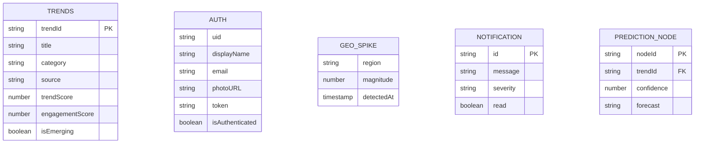

**Diagram sources**
- [trendsSlice.ts:4-15](file://AITrendTracker7/src/store/slices/trendsSlice.ts#L4-L15)
- [authSlice.ts:4-11](file://AITrendTracker7/src/store/slices/authSlice.ts#L4-L11)
- [socketService.ts:54-67](file://AITrendTracker7/src/services/socketService.ts#L54-L67)