# Mobile-Specific Features and Integrations

<cite>
**Referenced Files in This Document**
- [ToastProvider.tsx](file://AITrendTracker7/src/context/ToastProvider.tsx)
- [haptics.ts](file://AITrendTracker7/src/utils/haptics.ts)
- [animationPresets.ts](file://AITrendTracker7/src/theme/animationPresets.ts)
- [motion.ts](file://AITrendTracker7/src/theme/motion.ts)
- [storage.ts](file://AITrendTracker7/src/utils/storage.ts)
- [store/storage.ts](file://AITrendTracker7/src/store/storage.ts)
- [savedStorage.ts](file://AITrendTracker7/src/utils/savedStorage.ts)
- [OfflineBanner.tsx](file://AITrendTracker7/src/components/common/OfflineBanner.tsx)
- [GestureSwipeWrapper.tsx](file://AITrendTracker7/src/components/feed/GestureSwipeWrapper.tsx)
- [socketService.ts](file://AITrendTracker7/src/services/socketService.ts)
- [AndroidManifest.xml](file://AITrendTracker7/android/app/src/main/AndroidManifest.xml)
- [google-services.json](file://AITrendTracker7/android/app/google-services.json)
- [PrivacyInfo.xcprivacy](file://AITrendTracker7/ios/AITrendTracker7/PrivacyInfo.xcprivacy)
- [package.json](file://AITrendTracker7/package.json)
</cite>

## Table of Contents
1. [Introduction](#introduction)
2. [Project Structure](#project-structure)
3. [Core Components](#core-components)
4. [Architecture Overview](#architecture-overview)
5. [Detailed Component Analysis](#detailed-component-analysis)
6. [Dependency Analysis](#dependency-analysis)
7. [Performance Considerations](#performance-considerations)
8. [Troubleshooting Guide](#troubleshooting-guide)
9. [Conclusion](#conclusion)
10. [Appendices](#appendices)

## Introduction
This document focuses on mobile-specific features and integrations implemented in the project. It explains how user feedback is delivered via a toast system, how haptic feedback enhances touch interactions, and how local data persistence is achieved using high-performance storage. It also documents the animation system with motion design patterns and presets, mobile UX patterns such as gesture handling, and platform-specific optimizations. Examples of push notification integration, device permission handling, offline functionality, and performance considerations are included, along with guidance on integrating with native modules and platform APIs.

## Project Structure
The mobile stack centers around React Native with Reanimated and Gesture Handler for animations and gestures, MMKV for high-speed local storage, Firebase/Firestore for authentication and cloud services, and Socket.IO for real-time updates. The Android and iOS platforms are configured with permissions and privacy manifests.

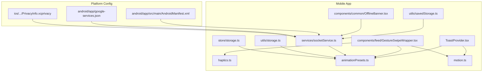

**Diagram sources**
- [ToastProvider.tsx:17-62](file://AITrendTracker7/src/context/ToastProvider.tsx#L17-L62)
- [haptics.ts:16-43](file://AITrendTracker7/src/utils/haptics.ts#L16-L43)
- [animationPresets.ts:8-44](file://AITrendTracker7/src/theme/animationPresets.ts#L8-L44)
- [motion.ts:8-60](file://AITrendTracker7/src/theme/motion.ts#L8-L60)
- [utils/storage.ts:9-95](file://AITrendTracker7/src/utils/storage.ts#L9-L95)
- [store/storage.ts:1-23](file://AITrendTracker7/src/store/storage.ts#L1-L23)
- [utils/savedStorage.ts:1-79](file://AITrendTracker7/src/utils/savedStorage.ts#L1-L79)
- [components/common/OfflineBanner.tsx:6-24](file://AITrendTracker7/src/components/common/OfflineBanner.tsx#L6-L24)
- [components/feed/GestureSwipeWrapper.tsx:25-108](file://AITrendTracker7/src/components/feed/GestureSwipeWrapper.tsx#L25-L108)
- [services/socketService.ts:9-110](file://AITrendTracker7/src/services/socketService.ts#L9-L110)
- [android/app/src/main/AndroidManifest.xml:1-35](file://AITrendTracker7/android/app/src/main/AndroidManifest.xml#L1-L35)
- [android/app/google-services.json:1-47](file://AITrendTracker7/android/app/google-services.json#L1-L47)
- [ios/AITrendTracker7/PrivacyInfo.xcprivacy:1-38](file://AITrendTracker7/ios/AITrendTracker7/PrivacyInfo.xcprivacy#L1-L38)

**Section sources**
- [package.json:12-44](file://AITrendTracker7/package.json#L12-L44)
- [android/app/src/main/AndroidManifest.xml:1-35](file://AITrendTracker7/android/app/src/main/AndroidManifest.xml#L1-L35)
- [ios/AITrendTracker7/PrivacyInfo.xcprivacy:1-38](file://AITrendTracker7/ios/AITrendTracker7/PrivacyInfo.xcprivacy#L1-L38)

## Core Components
- ToastProvider: A global toast system with animated entrance/exit and icon/color differentiation by type.
- Haptics: A throttled haptic engine for impact, notification, and selection feedback.
- Animation system: Motion tokens and presets for springs, easing, durations, and reusable animation sequences.
- Gesture handling: A swipe wrapper component with pan gestures, thresholds, and Reanimated animations.
- Local storage: Encrypted MMKV for fast JSON caching, offline snapshots, and Redux persistence.
- Real-time updates: Socket service with batching and throttling to avoid UI thrashing.
- Offline UX: A banner indicating offline mode and cached data usage.
- Push notifications: Firebase configuration and backend throttling for FCM.

**Section sources**
- [ToastProvider.tsx:17-62](file://AITrendTracker7/src/context/ToastProvider.tsx#L17-L62)
- [haptics.ts:16-43](file://AITrendTracker7/src/utils/haptics.ts#L16-L43)
- [animationPresets.ts:8-44](file://AITrendTracker7/src/theme/animationPresets.ts#L8-L44)
- [motion.ts:8-60](file://AITrendTracker7/src/theme/motion.ts#L8-L60)
- [GestureSwipeWrapper.tsx:25-108](file://AITrendTracker7/src/components/feed/GestureSwipeWrapper.tsx#L25-L108)
- [utils/storage.ts:9-95](file://AITrendTracker7/src/utils/storage.ts#L9-L95)
- [store/storage.ts:1-23](file://AITrendTracker7/src/store/storage.ts#L1-L23)
- [services/socketService.ts:9-110](file://AITrendTracker7/src/services/socketService.ts#L9-L110)
- [components/common/OfflineBanner.tsx:6-24](file://AITrendTracker7/src/components/common/OfflineBanner.tsx#L6-L24)
- [android/app/google-services.json:1-47](file://AITrendTracker7/android/app/google-services.json#L1-L47)

## Architecture Overview
The mobile app integrates UI feedback, gestures, animations, storage, and real-time updates. The toast provider injects a persistent overlay, haptics enriches interactions, and gestures drive actions with Reanimated animations. Local storage leverages MMKV for speed and encryption, while the socket service batches updates to maintain responsiveness. Offline UX informs users and uses cached data.

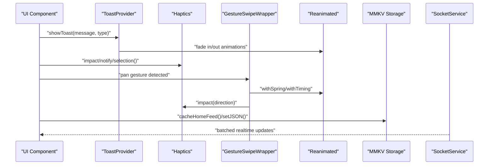

**Diagram sources**
- [ToastProvider.tsx:17-62](file://AITrendTracker7/src/context/ToastProvider.tsx#L17-L62)
- [haptics.ts:16-43](file://AITrendTracker7/src/utils/haptics.ts#L16-L43)
- [GestureSwipeWrapper.tsx:25-108](file://AITrendTracker7/src/components/feed/GestureSwipeWrapper.tsx#L25-L108)
- [animationPresets.ts:8-44](file://AITrendTracker7/src/theme/animationPresets.ts#L8-L44)
- [utils/storage.ts:45-69](file://AITrendTracker7/src/utils/storage.ts#L45-L69)
- [services/socketService.ts:46-76](file://AITrendTracker7/src/services/socketService.ts#L46-L76)

## Detailed Component Analysis

### ToastProvider Implementation
ToastProvider offers a lightweight, animated toast with contextual icons and colors. It uses Animated with native driver for smoothness and a simple lifecycle: show, delay, hide. The provider exposes a hook for consumption across the app.

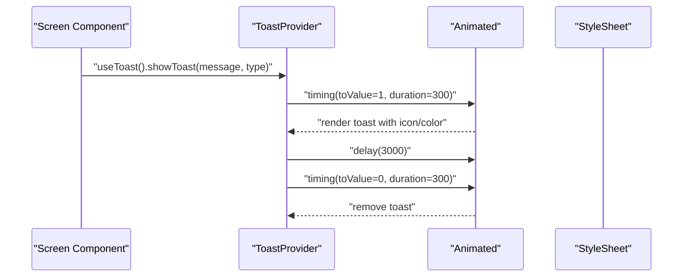

**Diagram sources**
- [ToastProvider.tsx:17-62](file://AITrendTracker7/src/context/ToastProvider.tsx#L17-L62)

**Section sources**
- [ToastProvider.tsx:17-62](file://AITrendTracker7/src/context/ToastProvider.tsx#L17-L62)
- [ToastProvider.tsx:64-85](file://AITrendTracker7/src/context/ToastProvider.tsx#L64-L85)

### Haptic Feedback System
The haptics module centralizes feedback with a cooldown to prevent spamming during rapid gestures or real-time bursts. It supports three categories: impact for physical gestures, notification for incoming events, and selection for UI toggles.

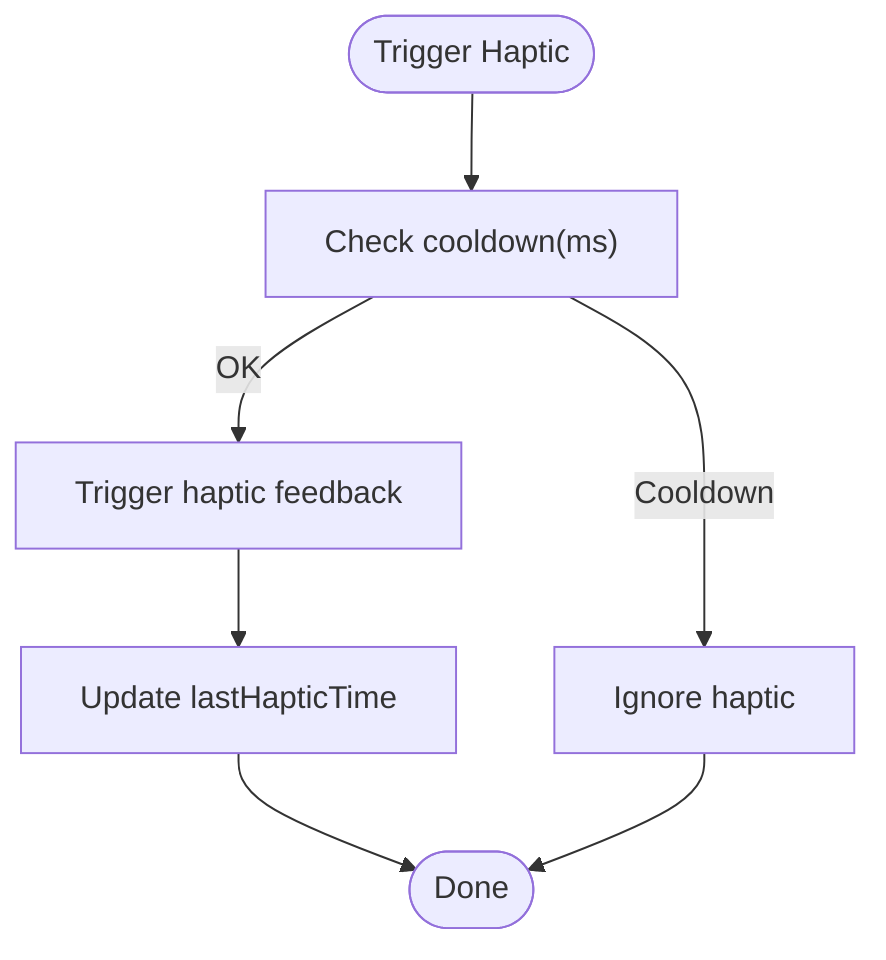

**Diagram sources**
- [haptics.ts:16-43](file://AITrendTracker7/src/utils/haptics.ts#L16-L43)

**Section sources**
- [haptics.ts:16-43](file://AITrendTracker7/src/utils/haptics.ts#L16-L43)

### Animation System and Motion Design Patterns
The animation system defines reusable presets and motion tokens:
- Presets: timing, spring, pulse glow, fade in/out.
- Tokens: spring configs, easing curves, gesture thresholds, cooldowns, and durations.

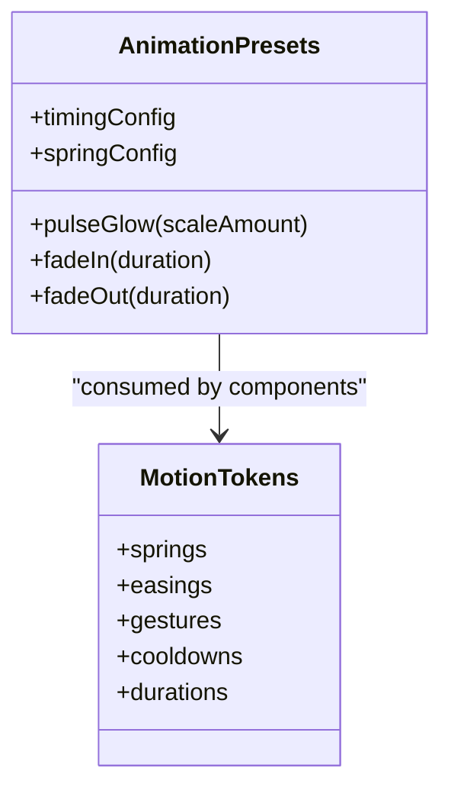

**Diagram sources**
- [animationPresets.ts:8-44](file://AITrendTracker7/src/theme/animationPresets.ts#L8-L44)
- [motion.ts:8-60](file://AITrendTracker7/src/theme/motion.ts#L8-L60)

**Section sources**
- [animationPresets.ts:8-44](file://AITrendTracker7/src/theme/animationPresets.ts#L8-L44)
- [motion.ts:8-60](file://AITrendTracker7/src/theme/motion.ts#L8-L60)

### Gesture Handling and Touch Interactions
The swipe wrapper encapsulates pan gestures with thresholds and clamps translation. It integrates haptics for directional feedback and uses Reanimated springs for satisfying animations. A UI-thread cooldown prevents gesture spam.

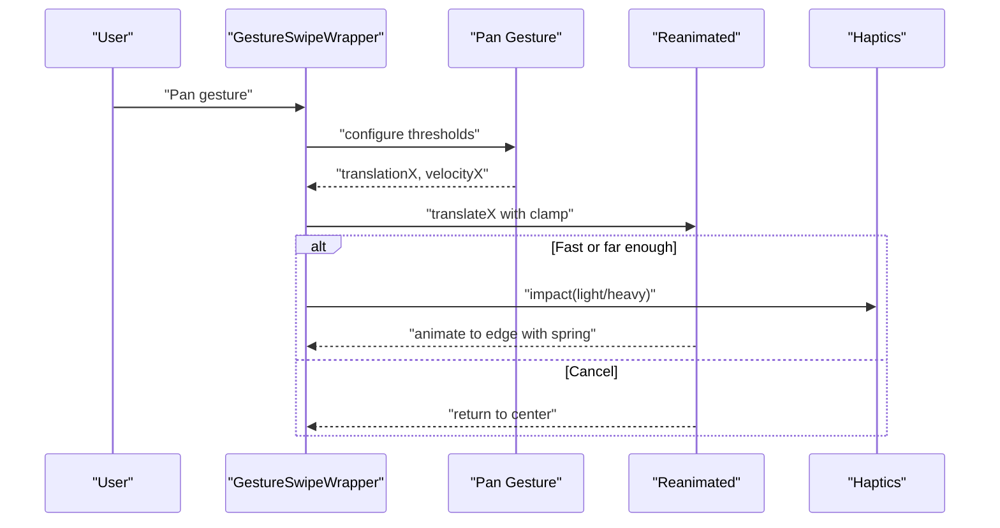

**Diagram sources**
- [GestureSwipeWrapper.tsx:46-91](file://AITrendTracker7/src/components/feed/GestureSwipeWrapper.tsx#L46-L91)
- [haptics.ts:20-25](file://AITrendTracker7/src/utils/haptics.ts#L20-L25)

**Section sources**
- [GestureSwipeWrapper.tsx:25-108](file://AITrendTracker7/src/components/feed/GestureSwipeWrapper.tsx#L25-L108)
- [motion.ts:42-52](file://AITrendTracker7/src/theme/motion.ts#L42-L52)

### Storage Solutions for Local Data Persistence
Two storage layers co-exist:
- Application storage: Encrypted MMKV for JSON caching, offline snapshots, and auth/profile caches.
- Redux persistence: MMKV-backed storage adapter for persisted Redux state.

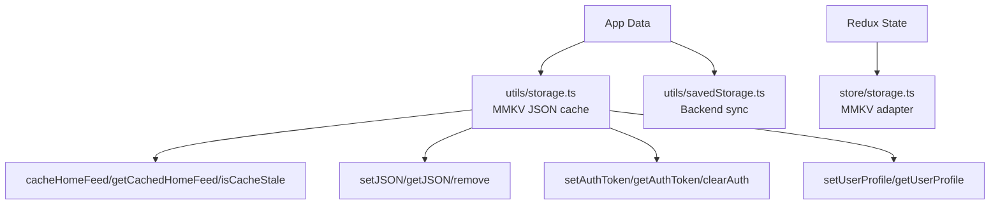

**Diagram sources**
- [utils/storage.ts:9-95](file://AITrendTracker7/src/utils/storage.ts#L9-L95)
- [store/storage.ts:1-23](file://AITrendTracker7/src/store/storage.ts#L1-L23)
- [utils/savedStorage.ts:12-79](file://AITrendTracker7/src/utils/savedStorage.ts#L12-L79)

**Section sources**
- [utils/storage.ts:9-95](file://AITrendTracker7/src/utils/storage.ts#L9-L95)
- [store/storage.ts:1-23](file://AITrendTracker7/src/store/storage.ts#L1-L23)
- [utils/savedStorage.ts:12-79](file://AITrendTracker7/src/utils/savedStorage.ts#L12-L79)

### Offline Functionality and Network Awareness
The offline banner monitors connectivity via NetInfo and displays a prominent banner when offline. The storage layer persists home feed snapshots with staleness checks to serve cached data.

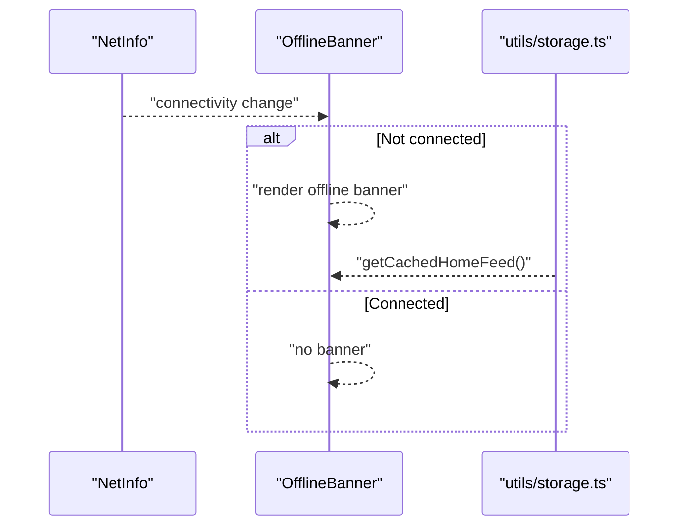

**Diagram sources**
- [components/common/OfflineBanner.tsx:6-24](file://AITrendTracker7/src/components/common/OfflineBanner.tsx#L6-L24)
- [utils/storage.ts:45-69](file://AITrendTracker7/src/utils/storage.ts#L45-L69)

**Section sources**
- [components/common/OfflineBanner.tsx:6-24](file://AITrendTracker7/src/components/common/OfflineBanner.tsx#L6-L24)
- [utils/storage.ts:45-69](file://AITrendTracker7/src/utils/storage.ts#L45-L69)

### Real-Time Updates and Throttling
The socket service connects to the backend and listens to multiple event channels. It batches live trend updates to avoid layout thrashing and dispatches to Redux slices. It also cleans up listeners and timers on disconnect.

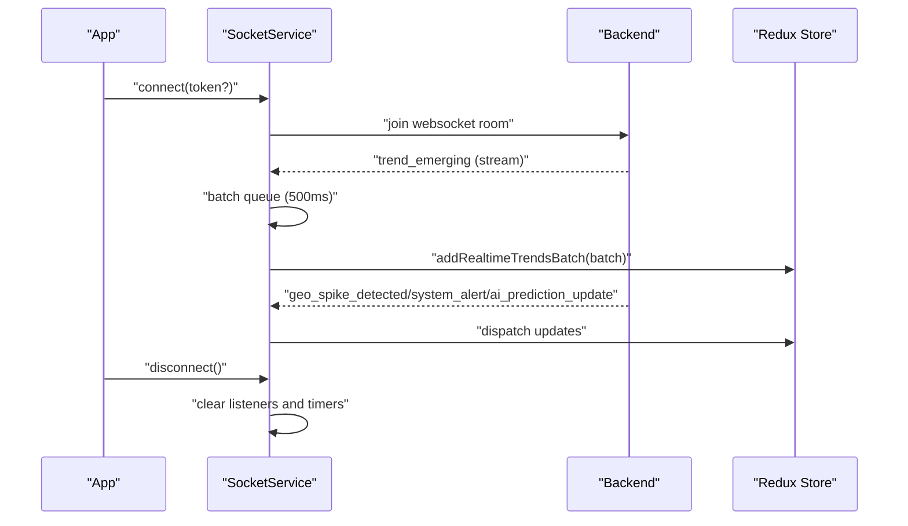

**Diagram sources**
- [services/socketService.ts:17-102](file://AITrendTracker7/src/services/socketService.ts#L17-L102)

**Section sources**
- [services/socketService.ts:17-102](file://AITrendTracker7/src/services/socketService.ts#L17-L102)

### Push Notification Integration and Permissions
Firebase configuration is present for Android. The backend implements FCM throttling and channel configuration for high-priority alerts. On iOS, the privacy manifest declares accessed APIs.

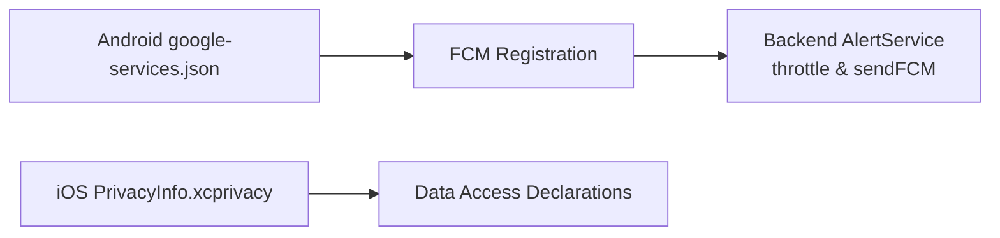

**Diagram sources**
- [android/app/google-services.json:1-47](file://AITrendTracker7/android/app/google-services.json#L1-L47)
- [backend/src/services/alertService.js:174-242](file://backend/src/services/alertService.js#L174-L242)
- [ios/AITrendTracker7/PrivacyInfo.xcprivacy:1-38](file://AITrendTracker7/ios/AITrendTracker7/PrivacyInfo.xcprivacy#L1-L38)

**Section sources**
- [android/app/google-services.json:1-47](file://AITrendTracker7/android/app/google-services.json#L1-L47)
- [backend/src/services/alertService.js:174-242](file://backend/src/services/alertService.js#L174-L242)
- [ios/AITrendTracker7/PrivacyInfo.xcprivacy:1-38](file://AITrendTracker7/ios/AITrendTracker7/PrivacyInfo.xcprivacy#L1-L38)

### Device Permission Handling
Android permissions are declared in the manifest for network and optional camera/storage capabilities. These should be requested at runtime where applicable.

**Section sources**
- [android/app/src/main/AndroidManifest.xml:3-6](file://AITrendTracker7/android/app/src/main/AndroidManifest.xml#L3-L6)

## Dependency Analysis
The mobile stack relies on several key libraries:
- Reanimated and Gesture Handler for animations and gestures.
- MMKV for high-performance local storage.
- Firebase modules for authentication and cloud services.
- Socket.IO client for real-time updates.

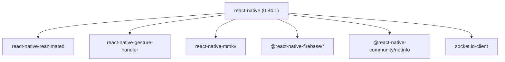

**Diagram sources**
- [package.json:25-43](file://AITrendTracker7/package.json#L25-L43)

**Section sources**
- [package.json:12-44](file://AITrendTracker7/package.json#L12-L44)

## Performance Considerations
- Use native drivers for animations to keep UI thread responsive.
- Batch real-time updates to reduce layout thrashing.
- Apply throttling for haptics and gestures to avoid UI spam.
- Prefer MMKV for local caching to minimize IO overhead.
- Keep gesture thresholds and cooldowns tuned for device performance.
- Avoid unnecessary re-renders by memoizing gesture wrappers and toast providers.

[No sources needed since this section provides general guidance]

## Troubleshooting Guide
- Toast not appearing: Verify provider wraps the app root and that Animated uses native driver.
- Haptics not firing: Confirm cooldown threshold and device support; ensure options are enabled.
- Gestures feel sluggish: Adjust spring configs and easing; verify UI thread cooldowns.
- Storage not persisting: Check MMKV initialization keys and encryption; confirm write/read paths.
- Real-time updates lagging: Inspect batch timer and socket connection status; verify Redux dispatches.
- Offline banner not showing: Ensure NetInfo listener is registered and banner is rendered above content.

**Section sources**
- [ToastProvider.tsx:17-62](file://AITrendTracker7/src/context/ToastProvider.tsx#L17-L62)
- [haptics.ts:16-43](file://AITrendTracker7/src/utils/haptics.ts#L16-L43)
- [GestureSwipeWrapper.tsx:46-91](file://AITrendTracker7/src/components/feed/GestureSwipeWrapper.tsx#L46-L91)
- [utils/storage.ts:9-95](file://AITrendTracker7/src/utils/storage.ts#L9-L95)
- [services/socketService.ts:46-76](file://AITrendTracker7/src/services/socketService.ts#L46-L76)
- [components/common/OfflineBanner.tsx:6-24](file://AITrendTracker7/src/components/common/OfflineBanner.tsx#L6-L24)

## Conclusion
The mobile stack combines a robust toast system, throttled haptics, hardware-accelerated animations, gesture-driven interactions, and high-performance local storage. Real-time updates are batched to preserve responsiveness, while offline UX and Firebase integration provide a seamless cross-platform experience. Adhering to the outlined patterns and performance tips ensures a polished, efficient mobile application.

[No sources needed since this section summarizes without analyzing specific files]

## Appendices
- Example integrations:
  - Toast: Wrap the app root with the provider and call the hook to show messages.
  - Haptics: Trigger impact for swipe actions, notification for incoming events, selection for toggles.
  - Gestures: Wrap actionable cards with the swipe wrapper and wire callbacks.
  - Storage: Use JSON helpers for offline snapshots and auth/profile caching.
  - Socket: Connect with an optional token; rely on batching for live feeds.
  - Offline: Render the banner and load cached data when connectivity is lost.
  - Push: Configure Firebase on Android/iOS and rely on backend throttling and channels.

[No sources needed since this section provides general guidance]