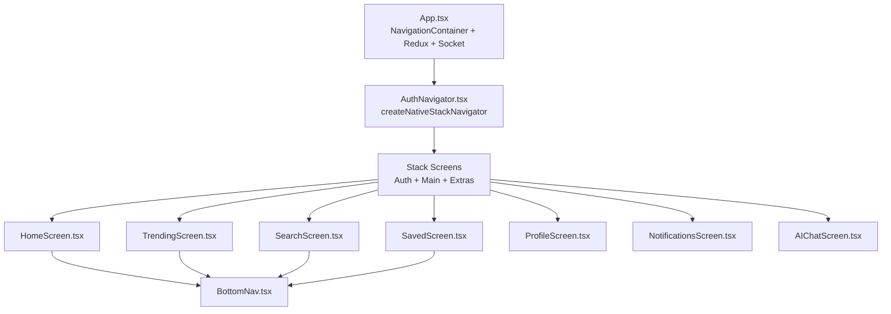
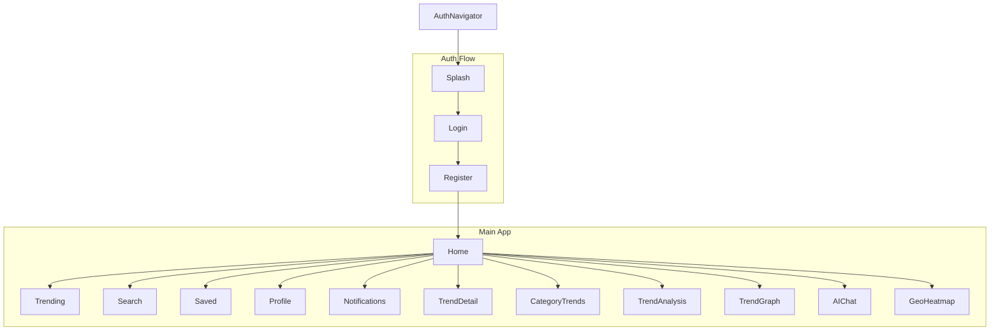
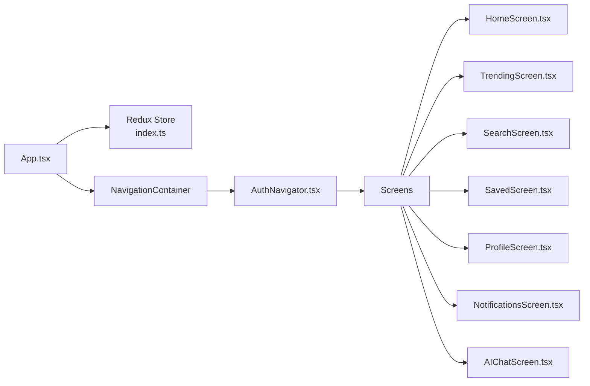

# Navigation and Routing System

<cite>
**Referenced Files in This Document**
- [App.tsx](file://AITrendTracker7/App.tsx)
- [AuthNavigator.tsx](file://AITrendTracker7/src/navigations/AuthNavigator.tsx)
- [BottomNav.tsx](file://AITrendTracker7/src/components/BottomNav.tsx)
- [HomeScreen.tsx](file://AITrendTracker7/src/navigations/screens/HomeScreen.tsx)
- [LoginScreen.tsx](file://AITrendTracker7/src/navigations/screens/LoginScreen.tsx)
- [RegisterScreen.tsx](file://AITrendTracker7/src/navigations/screens/RegisterScreen.tsx)
- [TrendingScreen.tsx](file://AITrendTracker7/src/navigations/screens/TrendingScreen.tsx)
- [ProfileScreen.tsx](file://AITrendTracker7/src/navigations/screens/ProfileScreen.tsx)
- [SearchScreen.tsx](file://AITrendTracker7/src/navigations/screens/SearchScreen.tsx)
- [NotificationsScreen.tsx](file://AITrendTracker7/src/navigations/screens/NotificationsScreen.tsx)
- [SavedScreen.tsx](file://AITrendTracker7/src/navigations/screens/SavedScreen.tsx)
- [AIChatScreen.tsx](file://AITrendTracker7/src/navigations/screens/AIChatScreen.tsx)
- [index.ts](file://AITrendTracker7/src/store/index.ts)
</cite>

## Table of Contents
1. [Introduction](#introduction)
2. [Project Structure](#project-structure)
3. [Core Components](#core-components)
4. [Architecture Overview](#architecture-overview)
5. [Detailed Component Analysis](#detailed-component-analysis)
6. [Dependency Analysis](#dependency-analysis)
7. [Performance Considerations](#performance-considerations)
8. [Troubleshooting Guide](#troubleshooting-guide)
9. [Conclusion](#conclusion)

## Introduction
This document explains the React Navigation system used in the AITrendTracker mobile application. It covers the AuthNavigator setup for authentication and main app flows, screen component organization, navigation patterns, and integration with Redux state. It also documents navigation parameters, transitions, tab navigation, stack navigation, programmatic navigation, deep linking considerations, and performance optimization strategies.

## Project Structure
The navigation system centers around a single native stack navigator that orchestrates both authentication and main application screens. The main entry point initializes the Redux store and wraps the app with NavigationContainer and gesture handlers. Bottom navigation is implemented as a reusable component integrated into several screens.

**Diagram sources**
- [App.tsx:15-59](file://AITrendTracker7/App.tsx#L15-L59)
- [AuthNavigator.tsx:23-61](file://AITrendTracker7/src/navigations/AuthNavigator.tsx#L23-L61)
- [BottomNav.tsx:21-56](file://AITrendTracker7/src/components/BottomNav.tsx#L21-L56)

**Section sources**
- [App.tsx:15-59](file://AITrendTracker7/App.tsx#L15-L59)
- [AuthNavigator.tsx:23-61](file://AITrendTracker7/src/navigations/AuthNavigator.tsx#L23-L61)

## Core Components
- AuthNavigator: Defines the primary stack navigator with initial route set to Splash and a set of screens for authentication and main app flows.
- App: Wraps the app with Redux Provider, PersistGate, NavigationContainer, gesture handler root, toast provider, offline banner, and boot splash hide on navigation ready.
- BottomNav: A reusable bottom tab bar component used by Home, Trending, Search, and Saved screens.

Key navigation patterns:
- Programmatic navigation via navigation.navigate and navigation.replace.
- Passing parameters (e.g., TrendDetail expects an item object).
- Conditional navigation based on user state and Redux selectors.

**Section sources**
- [AuthNavigator.tsx:23-61](file://AITrendTracker7/src/navigations/AuthNavigator.tsx#L23-L61)
- [App.tsx:15-59](file://AITrendTracker7/App.tsx#L15-L59)
- [BottomNav.tsx:21-56](file://AITrendTracker7/src/components/BottomNav.tsx#L21-L56)

## Architecture Overview
The navigation architecture is a single native stack navigator that manages two major groups:
- Authentication flow: Splash, Login, Register.
- Main app flow: Home, Trending, Search, Saved, Profile, Notifications, plus extra screens like TrendDetail, CategoryTrends, TrendAnalysis, TrendGraph, AIChat, GeoHeatmap.

**Diagram sources**
- [AuthNavigator.tsx:38-57](file://AITrendTracker7/src/navigations/AuthNavigator.tsx#L38-L57)

## Detailed Component Analysis

### AuthNavigator Setup
- Uses createNativeStackNavigator to define a single stack.
- Disables headers globally and sets slide-from-right animation with gesture support.
- Groups screens into three blocks: Auth Flow, Main App, and Extra Screens.

Programmatic navigation highlights:
- Login and Register screens replace to Home after successful auth.
- Home screen navigates to Profile, Search, Notifications, TrendDetail, CategoryTrends, and AIChat.
- Trending and Search screens navigate to TrendDetail.
- Notifications screen navigates to TrendDetail when a notification targets a trend.
- Saved screen navigates to TrendDetail for bookmarked items.

**Section sources**
- [AuthNavigator.tsx:23-61](file://AITrendTracker7/src/navigations/AuthNavigator.tsx#L23-L61)
- [LoginScreen.tsx:49](file://AITrendTracker7/src/navigations/screens/LoginScreen.tsx#L49)
- [RegisterScreen.tsx:90](file://AITrendTracker7/src/navigations/screens/RegisterScreen.tsx#L90)
- [HomeScreen.tsx:69-94](file://AITrendTracker7/src/navigations/screens/HomeScreen.tsx#L69-L94)
- [HomeScreen.tsx:126-136](file://AITrendTracker7/src/navigations/screens/HomeScreen.tsx#L126-L136)
- [HomeScreen.tsx:159](file://AITrendTracker7/src/navigations/screens/HomeScreen.tsx#L159)
- [TrendingScreen.tsx:75](file://AITrendTracker7/src/navigations/screens/TrendingScreen.tsx#L75)
- [SearchScreen.tsx:133](file://AITrendTracker7/src/navigations/screens/SearchScreen.tsx#L133)
- [NotificationsScreen.tsx:162-166](file://AITrendTracker7/src/navigations/screens/NotificationsScreen.tsx#L162-L166)
- [SavedScreen.tsx:79](file://AITrendTracker7/src/navigations/screens/SavedScreen.tsx#L79)

### HomeScreen
- Integrates Redux hooks to read user, unread notifications, and live/fastest rising trends.
- Fetches home feed via RTK Query with refetch-on-focus and reconnection behavior.
- Navigates to TrendDetail with an item parameter and to CategoryTrends.
- Uses BottomNav with activeTab "Home".
- Provides quick navigation to Profile, Search, Notifications, and AIChat.

Navigation parameters:
- TrendDetail expects an item object containing trend metadata.

**Section sources**
- [HomeScreen.tsx:27-56](file://AITrendTracker7/src/navigations/screens/HomeScreen.tsx#L27-L56)
- [HomeScreen.tsx:126-136](file://AITrendTracker7/src/navigations/screens/HomeScreen.tsx#L126-L136)
- [HomeScreen.tsx:159](file://AITrendTracker7/src/navigations/screens/HomeScreen.tsx#L159)
- [BottomNav.tsx:21-56](file://AITrendTracker7/src/components/BottomNav.tsx#L21-L56)

### LoginScreen
- Handles email/password login and Google Sign-In.
- On success, replaces current screen to Home.

Navigation pattern:
- Uses navigation.replace to move from Login to Home.

**Section sources**
- [LoginScreen.tsx:40-63](file://AITrendTracker7/src/navigations/screens/LoginScreen.tsx#L40-L63)
- [LoginScreen.tsx:49](file://AITrendTracker7/src/navigations/screens/LoginScreen.tsx#L49)

### RegisterScreen
- Handles account creation and Google Sign-In.
- Syncs user profile with backend after registration or Google sign-in.
- Replaces to Home on success.

Navigation pattern:
- Uses navigation.replace to move from Register to Home.

**Section sources**
- [RegisterScreen.tsx:69-105](file://AITrendTracker7/src/navigations/screens/RegisterScreen.tsx#L69-L105)
- [RegisterScreen.tsx:90](file://AITrendTracker7/src/navigations/screens/RegisterScreen.tsx#L90)

### TrendingScreen
- Fetches top trends from backend and renders a ranked list.
- Navigates to TrendDetail with an item parameter.
- Uses BottomNav with activeTab "Trending".

**Section sources**
- [TrendingScreen.tsx:19-38](file://AITrendTracker7/src/navigations/screens/TrendingScreen.tsx#L19-L38)
- [TrendingScreen.tsx:75](file://AITrendTracker7/src/navigations/screens/TrendingScreen.tsx#L75)
- [BottomNav.tsx:21-56](file://AITrendTracker7/src/components/BottomNav.tsx#L21-L56)

### SearchScreen
- Implements debounced search against backend.
- Renders chips for recent and suggested topics.
- Navigates to TrendDetail with an item parameter.

**Section sources**
- [SearchScreen.tsx:22-47](file://AITrendTracker7/src/navigations/screens/SearchScreen.tsx#L22-L47)
- [SearchScreen.tsx:133](file://AITrendTracker7/src/navigations/screens/SearchScreen.tsx#L133)

### NotificationsScreen
- Fetches notifications on focus and supports marking as read and clearing.
- Navigates to TrendDetail when a notification references a trend.

Lifecycle integration:
- Uses useFocusEffect to refresh data when the screen gains focus.

**Section sources**
- [NotificationsScreen.tsx:21-64](file://AITrendTracker7/src/navigations/screens/NotificationsScreen.tsx#L21-L64)
- [NotificationsScreen.tsx:154-166](file://AITrendTracker7/src/navigations/screens/NotificationsScreen.tsx#L154-L166)

### SavedScreen
- Loads saved items from local storage on focus and supports removing items.
- Navigates to TrendDetail for saved items.

Lifecycle integration:
- Uses useFocusEffect to refresh saved items when the screen gains focus.

**Section sources**
- [SavedScreen.tsx:20-33](file://AITrendTracker7/src/navigations/screens/SavedScreen.tsx#L20-L33)
- [SavedScreen.tsx:79](file://AITrendTracker7/src/navigations/screens/SavedScreen.tsx#L79)

### ProfileScreen
- Displays and updates user profile, toggles settings, and handles logout.
- Logs out via Firebase and replaces to Login.

Navigation pattern:
- Uses navigation.replace to move from Profile to Login after logout.

**Section sources**
- [ProfileScreen.tsx:85-97](file://AITrendTracker7/src/navigations/screens/ProfileScreen.tsx#L85-L97)
- [ProfileScreen.tsx:93](file://AITrendTracker7/src/navigations/screens/ProfileScreen.tsx#L93)

### AIChatScreen
- Accepts optional trendContext from route params.
- Streams AI replies via backend API and renders a chat interface.
- Uses a FlatList with gradient-styled bubbles and typing indicators.

Navigation parameters:
- Optional route.params.trendContext can be passed to pre-seed AI context.

**Section sources**
- [AIChatScreen.tsx:20-36](file://AITrendTracker7/src/navigations/screens/AIChatScreen.tsx#L20-L36)
- [AIChatScreen.tsx:59-94](file://AITrendTracker7/src/navigations/screens/AIChatScreen.tsx#L59-L94)

### BottomNav Component
- Provides four bottom tabs: Home, Trending, Search, Saved.
- Highlights the active tab and triggers navigation via navigation.navigate.

Integration:
- Used by HomeScreen, TrendingScreen, SearchScreen, and SavedScreen.

**Section sources**
- [BottomNav.tsx:21-56](file://AITrendTracker7/src/components/BottomNav.tsx#L21-L56)

## Dependency Analysis
- App initializes Redux store and persists selected slices, then mounts NavigationContainer.
- AuthNavigator defines the global stack and screen routing.
- Screen components depend on:
  - NavigationContainer for imperative navigation APIs.
  - Redux store for state and selectors.
  - Backend APIs for data fetching and user actions.

**Diagram sources**
- [App.tsx:15-59](file://AITrendTracker7/App.tsx#L15-L59)
- [index.ts:32-42](file://AITrendTracker7/src/store/index.ts#L32-L42)
- [AuthNavigator.tsx:23-61](file://AITrendTracker7/src/navigations/AuthNavigator.tsx#L23-L61)

**Section sources**
- [App.tsx:15-59](file://AITrendTracker7/App.tsx#L15-L59)
- [index.ts:32-42](file://AITrendTracker7/src/store/index.ts#L32-L42)
- [AuthNavigator.tsx:23-61](file://AITrendTracker7/src/navigations/AuthNavigator.tsx#L23-L61)

## Performance Considerations
- Navigation animations: The stack navigator uses slide_from_right with gesture support; keep transitions minimal for smooth UX on lower-end devices.
- Data fetching:
  - Home uses RTK Query with refetch-on-focus and reconnection behavior; avoid excessive polling intervals.
  - Trending and Search use backend APIs; implement throttling/debouncing as seen in SearchScreen.
- Rendering:
  - FlatList is used in AIChatScreen for efficient message rendering.
  - Skeleton loaders are used in several screens to improve perceived performance.
- State persistence:
  - Redux persist is configured to whitelist specific slices, reducing unnecessary serialization overhead.

[No sources needed since this section provides general guidance]

## Troubleshooting Guide
Common issues and resolutions:
- Navigation not working after auth:
  - Ensure navigation.replace is used after successful Login or Register to move past auth screens.
- Notifications not updating:
  - NotificationsScreen uses useFocusEffect to refresh; verify focus events trigger and network requests succeed.
- Saved items not appearing:
  - SavedScreen uses useFocusEffect to reload; confirm AsyncStorage reads succeed and items are present.
- AI chat errors:
  - AIChatScreen handles API errors gracefully; check network connectivity and backend endpoint availability.

**Section sources**
- [LoginScreen.tsx:49](file://AITrendTracker7/src/navigations/screens/LoginScreen.tsx#L49)
- [RegisterScreen.tsx:90](file://AITrendTracker7/src/navigations/screens/RegisterScreen.tsx#L90)
- [NotificationsScreen.tsx:59-64](file://AITrendTracker7/src/navigations/screens/NotificationsScreen.tsx#L59-L64)
- [SavedScreen.tsx:24-28](file://AITrendTracker7/src/navigations/screens/SavedScreen.tsx#L24-L28)
- [AIChatScreen.tsx:82-94](file://AITrendTracker7/src/navigations/screens/AIChatScreen.tsx#L82-L94)

## Conclusion
The navigation system is centered on a single native stack navigator that cleanly separates authentication and main app flows. Programmatic navigation is consistently applied across screens, with parameters passed for detail views. Integration with Redux enables state-driven navigation decisions, while lifecycle hooks ensure data freshness. Performance is optimized through debounced search, skeleton loaders, and efficient list rendering. The modular design of BottomNav promotes reuse and maintainability.