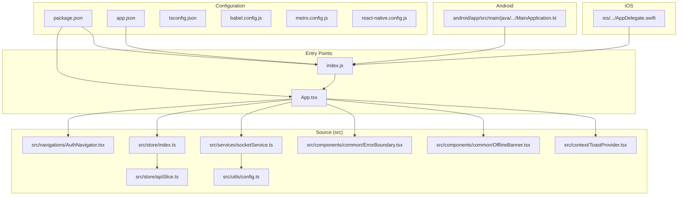
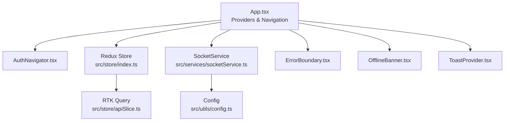
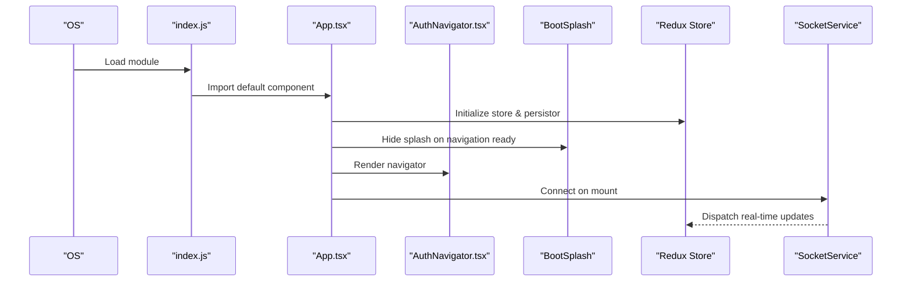
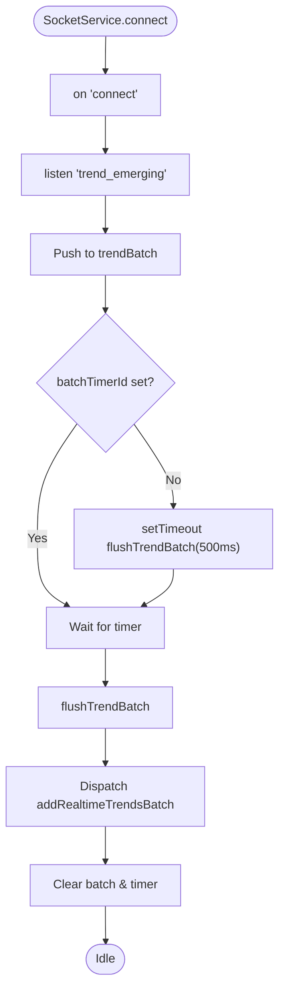
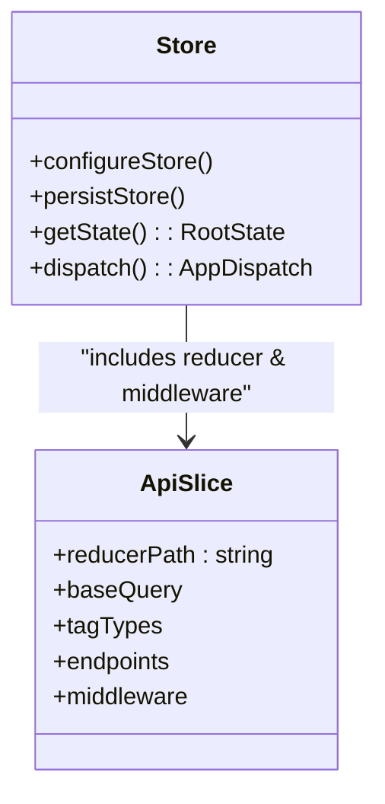

# React Native Application Structure

<cite>
**Referenced Files in This Document**
- [App.tsx](file://AITrendTracker7/App.tsx)
- [index.js](file://AITrendTracker7/index.js)
- [app.json](file://AITrendTracker7/app.json)
- [tsconfig.json](file://AITrendTracker7/tsconfig.json)
- [babel.config.js](file://AITrendTracker7/babel.config.js)
- [metro.config.js](file://AITrendTracker7/metro.config.js)
- [package.json](file://AITrendTracker7/package.json)
- [react-native.config.js](file://AITrendTracker7/react-native.config.js)
- [src/store/index.ts](file://AITrendTracker7/src/store/index.ts)
- [src/store/apiSlice.ts](file://AITrendTracker7/src/store/apiSlice.ts)
- [src/services/socketService.ts](file://AITrendTracker7/src/services/socketService.ts)
- [src/utils/config.ts](file://AITrendTracker7/src/utils/config.ts)
- [src/context/ToastProvider.tsx](file://AITrendTracker7/src/context/ToastProvider.tsx)
- [src/components/common/ErrorBoundary.tsx](file://AITrendTracker7/src/components/common/ErrorBoundary.tsx)
- [src/components/common/OfflineBanner.tsx](file://AITrendTracker7/src/components/common/OfflineBanner.tsx)
- [src/navigations/AuthNavigator.tsx](file://AITrendTracker7/src/navigations/AuthNavigator.tsx)
- [android/app/src/main/java/com/aitrendtracker7/MainApplication.kt](file://AITrendTracker7/android/app/src/main/java/com/aitrendtracker7/MainApplication.kt)
- [ios/AITrendTracker7/AppDelegate.swift](file://AITrendTracker7/ios/AITrendTracker7/AppDelegate.swift)
</cite>

## Table of Contents
1. [Introduction](#introduction)
2. [Project Structure](#project-structure)
3. [Core Components](#core-components)
4. [Architecture Overview](#architecture-overview)
5. [Detailed Component Analysis](#detailed-component-analysis)
6. [Dependency Analysis](#dependency-analysis)
7. [Performance Considerations](#performance-considerations)
8. [Troubleshooting Guide](#troubleshooting-guide)
9. [Conclusion](#conclusion)
10. [Appendices](#appendices)

## Introduction
This document explains the React Native application structure and configuration for the AITrendTracker7 project. It covers the entry points, native module registration, platform-specific initialization, TypeScript and Babel configuration, Metro bundler setup, and file organization patterns. It also outlines the initialization flow, platform-specific behaviors, build processes, development workflow, debugging setup, and native module integration patterns.

## Project Structure
The project follows a conventional React Native layout with a clear separation of concerns:
- Entry points: App.tsx (application shell) and index.js (native registration)
- Configuration: app.json (CLI metadata), tsconfig.json (TypeScript), babel.config.js (transformations), metro.config.js (bundler), react-native.config.js (assets)
- Source code: src/ containing features, navigation, store, services, context, theme, and utilities
- Platform code: android/ and ios/ with platform-specific initialization and assets
- Scripts and dependencies: package.json



**Diagram sources**
- [index.js:1-10](file://AITrendTracker7/index.js#L1-L10)
- [App.tsx:1-59](file://AITrendTracker7/App.tsx#L1-L59)
- [app.json:1-5](file://AITrendTracker7/app.json#L1-L5)
- [tsconfig.json:1-9](file://AITrendTracker7/tsconfig.json#L1-L9)
- [babel.config.js:1-5](file://AITrendTracker7/babel.config.js#L1-L5)
- [metro.config.js:1-12](file://AITrendTracker7/metro.config.js#L1-L12)
- [react-native.config.js:1-3](file://AITrendTracker7/react-native.config.js#L1-L3)
- [src/navigations/AuthNavigator.tsx:1-62](file://AITrendTracker7/src/navigations/AuthNavigator.tsx#L1-L62)
- [src/store/index.ts:1-46](file://AITrendTracker7/src/store/index.ts#L1-L46)
- [src/store/apiSlice.ts:1-40](file://AITrendTracker7/src/store/apiSlice.ts#L1-L40)
- [src/services/socketService.ts:1-110](file://AITrendTracker7/src/services/socketService.ts#L1-L110)
- [src/utils/config.ts:1-8](file://AITrendTracker7/src/utils/config.ts#L1-L8)
- [src/components/common/ErrorBoundary.tsx:1-83](file://AITrendTracker7/src/components/common/ErrorBoundary.tsx#L1-L83)
- [src/components/common/OfflineBanner.tsx:1-45](file://AITrendTracker7/src/components/common/OfflineBanner.tsx#L1-L45)
- [src/context/ToastProvider.tsx:1-86](file://AITrendTracker7/src/context/ToastProvider.tsx#L1-L86)
- [android/app/src/main/java/com/aitrendtracker7/MainApplication.kt:1-28](file://AITrendTracker7/android/app/src/main/java/com/aitrendtracker7/MainApplication.kt#L1-L28)
- [ios/AITrendTracker7/AppDelegate.swift:1-49](file://AITrendTracker7/ios/AITrendTracker7/AppDelegate.swift#L1-L49)

**Section sources**
- [package.json:1-70](file://AITrendTracker7/package.json#L1-L70)
- [index.js:1-10](file://AITrendTracker7/index.js#L1-L10)
- [App.tsx:1-59](file://AITrendTracker7/App.tsx#L1-L59)

## Core Components
This section documents the primary building blocks that initialize and orchestrate the application.

- Application Shell (App.tsx)
  - Initializes global providers: Redux with persistence, navigation container, gesture handling, boot splash, toast provider, offline banner, and error boundary.
  - Manages lifecycle events via AppState to reconnect sockets when returning to the foreground and disconnect when moving to the background.
  - Integrates a socket service for real-time updates and dispatches actions to Redux slices.

- Native Registration (index.js)
  - Registers the React Native component with the platform using the app name from app.json.

- Navigation (AuthNavigator.tsx)
  - Defines a native stack navigator with multiple screens organized by feature domains (auth, home, trending, search, saved, profile, notifications, analytics, AI chat, geo heatmap).

- Store and API (store/index.ts, store/apiSlice.ts)
  - Configures Redux Toolkit with persisted slices and RTK Query middleware.
  - Exposes typed RootState and AppDispatch.
  - Provides API endpoints for home feed, heatmap payload, and user profile with automatic caching and tag invalidation.

- Real-time Service (services/socketService.ts)
  - Establishes WebSocket connections to the backend with reconnection logic.
  - Batches live trend updates to avoid layout thrashing.
  - Dispatches domain-specific updates to Redux slices for trends, geospatial spikes, alerts, and AI predictions.

- Utilities and Providers (utils/config.ts, context/ToastProvider.tsx, components/common/*)
  - Base URL configuration switches between development and production.
  - Toast provider renders animated toasts with icon and color-coded feedback.
  - Error boundary displays a friendly error UI with reset capability.
  - Offline banner informs users when network connectivity is lost.

**Section sources**
- [App.tsx:15-59](file://AITrendTracker7/App.tsx#L15-L59)
- [index.js:5-9](file://AITrendTracker7/index.js#L5-L9)
- [src/navigations/AuthNavigator.tsx:23-61](file://AITrendTracker7/src/navigations/AuthNavigator.tsx#L23-L61)
- [src/store/index.ts:1-46](file://AITrendTracker7/src/store/index.ts#L1-L46)
- [src/store/apiSlice.ts:1-40](file://AITrendTracker7/src/store/apiSlice.ts#L1-L40)
- [src/services/socketService.ts:9-107](file://AITrendTracker7/src/services/socketService.ts#L9-L107)
- [src/utils/config.ts:5-7](file://AITrendTracker7/src/utils/config.ts#L5-L7)
- [src/context/ToastProvider.tsx:17-61](file://AITrendTracker7/src/context/ToastProvider.tsx#L17-L61)
- [src/components/common/ErrorBoundary.tsx:14-47](file://AITrendTracker7/src/components/common/ErrorBoundary.tsx#L14-L47)
- [src/components/common/OfflineBanner.tsx:6-23](file://AITrendTracker7/src/components/common/OfflineBanner.tsx#L6-L23)

## Architecture Overview
The application follows a layered architecture:
- Presentation Layer: App.tsx orchestrates UI providers and navigation.
- Feature Layer: src/navigations, src/components, and src/screens define screens and reusable components.
- State Layer: Redux store with persisted slices and RTK Query for API.
- Service Layer: Socket service for real-time updates and utilities for configuration.
- Platform Layer: Android and iOS native entry points register and bootstrap the RN runtime.



**Diagram sources**
- [App.tsx:43-58](file://AITrendTracker7/App.tsx#L43-L58)
- [src/navigations/AuthNavigator.tsx:23-61](file://AITrendTracker7/src/navigations/AuthNavigator.tsx#L23-L61)
- [src/store/index.ts:32-42](file://AITrendTracker7/src/store/index.ts#L32-L42)
- [src/store/apiSlice.ts:4-33](file://AITrendTracker7/src/store/apiSlice.ts#L4-L33)
- [src/services/socketService.ts:17-68](file://AITrendTracker7/src/services/socketService.ts#L17-L68)
- [src/utils/config.ts:5-7](file://AITrendTracker7/src/utils/config.ts#L5-L7)
- [src/components/common/ErrorBoundary.tsx:32-46](file://AITrendTracker7/src/components/common/ErrorBoundary.tsx#L32-L46)
- [src/components/common/OfflineBanner.tsx:16-23](file://AITrendTracker7/src/components/common/OfflineBanner.tsx#L16-L23)
- [src/context/ToastProvider.tsx:51-60](file://AITrendTracker7/src/context/ToastProvider.tsx#L51-L60)

## Detailed Component Analysis

### Application Initialization Flow
This sequence shows how the app boots on both platforms and connects to real-time services.



**Diagram sources**
- [index.js:5-9](file://AITrendTracker7/index.js#L5-L9)
- [App.tsx:15-59](file://AITrendTracker7/App.tsx#L15-L59)
- [src/navigations/AuthNavigator.tsx:23-61](file://AITrendTracker7/src/navigations/AuthNavigator.tsx#L23-L61)
- [src/store/index.ts:32-42](file://AITrendTracker7/src/store/index.ts#L32-L42)
- [src/services/socketService.ts:17-68](file://AITrendTracker7/src/services/socketService.ts#L17-L68)

**Section sources**
- [index.js:5-9](file://AITrendTracker7/index.js#L5-L9)
- [App.tsx:18-41](file://AITrendTracker7/App.tsx#L18-L41)

### Real-Time Updates Pipeline
The socket service batches live trend emissions and dispatches them to Redux.



**Diagram sources**
- [src/services/socketService.ts:46-76](file://AITrendTracker7/src/services/socketService.ts#L46-L76)

**Section sources**
- [src/services/socketService.ts:46-76](file://AITrendTracker7/src/services/socketService.ts#L46-L76)

### Redux Store and RTK Query
The store combines persisted reducers and RTK Query middleware, exposing typed state and dispatch.



**Diagram sources**
- [src/store/index.ts:32-42](file://AITrendTracker7/src/store/index.ts#L32-L42)
- [src/store/apiSlice.ts:4-33](file://AITrendTracker7/src/store/apiSlice.ts#L4-L33)

**Section sources**
- [src/store/index.ts:14-42](file://AITrendTracker7/src/store/index.ts#L14-L42)
- [src/store/apiSlice.ts:8-32](file://AITrendTracker7/src/store/apiSlice.ts#L8-L32)

### Platform-Specific Initialization
- Android
  - MainApplication registers the React host and loads packages.
- iOS
  - AppDelegate sets up ReactNativeDelegate and starts React Native with the module name.

```mermaid
sequenceDiagram
participant AND as "Android MainApplication.kt"
participant IOS as "iOS AppDelegate.swift"
participant IDX as "index.js"
participant APP as "App.tsx"
AND->>IDX : Native entry point
IOS->>IDX : Native entry point
IDX->>APP : registerComponent(appName, App)
APP-->>APP : Initialize providers & navigation
```

**Diagram sources**
- [android/app/src/main/java/com/aitrendtracker7/MainApplication.kt:10-26](file://AITrendTracker7/android/app/src/main/java/com/aitrendtracker7/MainApplication.kt#L10-L26)
- [ios/AITrendTracker7/AppDelegate.swift:13-33](file://AITrendTracker7/ios/AITrendTracker7/AppDelegate.swift#L13-L33)
- [index.js:5-9](file://AITrendTracker7/index.js#L5-L9)
- [App.tsx:43-58](file://AITrendTracker7/App.tsx#L43-L58)

**Section sources**
- [android/app/src/main/java/com/aitrendtracker7/MainApplication.kt:10-26](file://AITrendTracker7/android/app/src/main/java/com/aitrendtracker7/MainApplication.kt#L10-L26)
- [ios/AITrendTracker7/AppDelegate.swift:13-48](file://AITrendTracker7/ios/AITrendTracker7/AppDelegate.swift#L13-L48)

## Dependency Analysis
The project relies on React Native 0.84.1, React 19, Redux Toolkit, RTK Query, React Navigation, and several community libraries. The scripts in package.json define the development and testing workflows.

```mermaid
graph TB
PJ["package.json"]
RN["react-native"]
RRN["@react-navigation/native*"]
RRD["react-redux / redux-persist"]
RTK["@reduxjs/toolkit"]
SOCK["socket.io-client"]
NET["@react-native-community/netinfo"]
ICONS["react-native-vector-icons"]
MAPS["react-native-maps"]
REANIM["react-native-reanimated"]
GS["react-native-gesture-handler"]
SAFE["react-native-safe-area-context"]
SCREENS["react-native-screens"]
MMKV["react-native-mmkv"]
PJ --> RN
PJ --> RRN
PJ --> RRD
PJ --> RTK
PJ --> SOCK
PJ --> NET
PJ --> ICONS
PJ --> MAPS
PJ --> REANIM
PJ --> GS
PJ --> SAFE
PJ --> SCREENS
PJ --> MMKV
```



**Diagram sources**
- [package.json:12-44](file://AITrendTracker7/package.json#L12-L44)

**Section sources**
- [package.json:5-11](file://AITrendTracker7/package.json#L5-L11)
- [package.json:12-44](file://AITrendTracker7/package.json#L12-L44)

## Performance Considerations
- Real-time batching: SocketService batches trend emissions to reduce UI thrashing.
- Caching strategy: RTK Query endpoints specify keepUnusedDataFor to prune memory usage.
- Persistence: Only selected slices are persisted to minimize IO overhead.
- Native animations: Toast animations use native driver for smoothness.
- Network awareness: Offline banner prevents unnecessary requests when offline.

[No sources needed since this section provides general guidance]

## Troubleshooting Guide
- Real-time connectivity
  - Verify BASE_URL resolves to the backend in development and production environments.
  - Confirm socket events are handled and batch flushing occurs.
- Redux state
  - Ensure persisted slices are whitelisted and serializable checks are configured.
  - Validate RTK Query endpoints and tag invalidation behavior.
- Navigation
  - Confirm AuthNavigator screens are registered and initialRouteName is correct.
- Platform bootstrapping
  - Android: Ensure MainApplication loads React Native and packages are registered.
  - iOS: Confirm AppDelegate starts React Native with the correct module name.
- Assets and fonts
  - react-native.config.js includes vector icons fonts for asset linking.

**Section sources**
- [src/utils/config.ts:5-7](file://AITrendTracker7/src/utils/config.ts#L5-L7)
- [src/services/socketService.ts:17-76](file://AITrendTracker7/src/services/socketService.ts#L17-L76)
- [src/store/index.ts:14-42](file://AITrendTracker7/src/store/index.ts#L14-L42)
- [src/store/apiSlice.ts:18-32](file://AITrendTracker7/src/store/apiSlice.ts#L18-L32)
- [src/navigations/AuthNavigator.tsx:23-61](file://AITrendTracker7/src/navigations/AuthNavigator.tsx#L23-L61)
- [android/app/src/main/java/com/aitrendtracker7/MainApplication.kt:10-26](file://AITrendTracker7/android/app/src/main/java/com/aitrendtracker7/MainApplication.kt#L10-L26)
- [ios/AITrendTracker7/AppDelegate.swift:26-30](file://AITrendTracker7/ios/AITrendTracker7/AppDelegate.swift#L26-L30)
- [react-native.config.js:1-3](file://AITrendTracker7/react-native.config.js#L1-L3)

## Conclusion
The application is structured around a clean separation of concerns with robust configuration for TypeScript, Babel, and Metro. The initialization flow integrates Redux, navigation, real-time updates, and platform-specific bootstrapping. The architecture supports scalable feature development, efficient state management, and responsive UX through batching and caching strategies.

[No sources needed since this section summarizes without analyzing specific files]

## Appendices

### Build and Development Workflow
- Start the dev server and run on Android or iOS using scripts defined in package.json.
- Use Metro bundler defaults with minimal overrides in metro.config.js.
- Configure TypeScript via tsconfig.json extending the RN TS preset.
- Apply Babel transformations with the RN preset and reanimated plugin.

**Section sources**
- [package.json:5-11](file://AITrendTracker7/package.json#L5-L11)
- [metro.config.js:1-12](file://AITrendTracker7/metro.config.js#L1-L12)
- [tsconfig.json:1-9](file://AITrendTracker7/tsconfig.json#L1-L9)
- [babel.config.js:1-5](file://AITrendTracker7/babel.config.js#L1-L5)

### Debugging Setup
- Use Flipper or React DevTools for component inspection.
- Enable remote JS debugging in developer menu on device/emulator.
- Leverage console logging from AppState, socket service, and error boundaries.
- Validate network connectivity and offline banner behavior.

[No sources needed since this section provides general guidance]