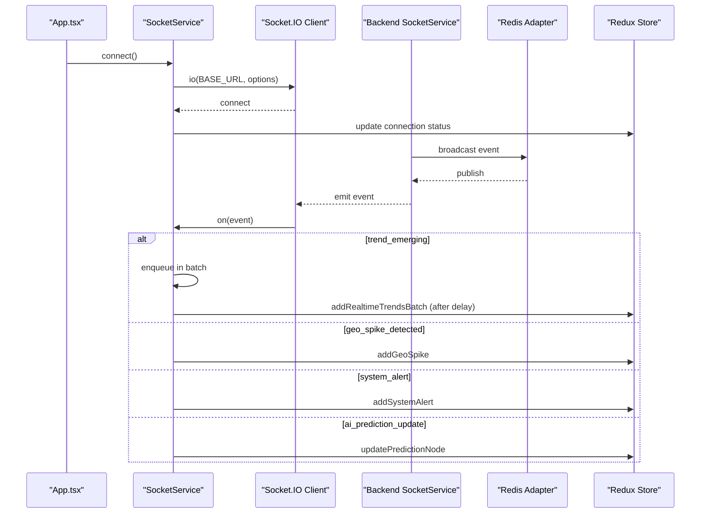
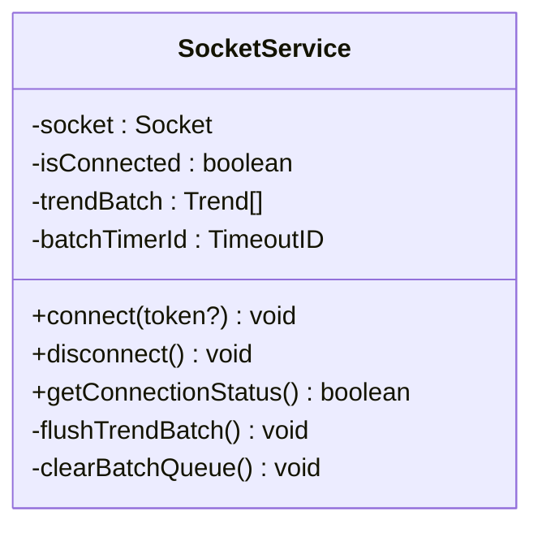
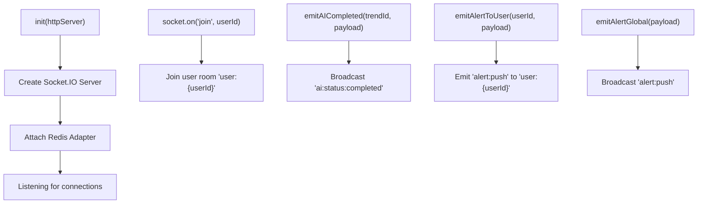
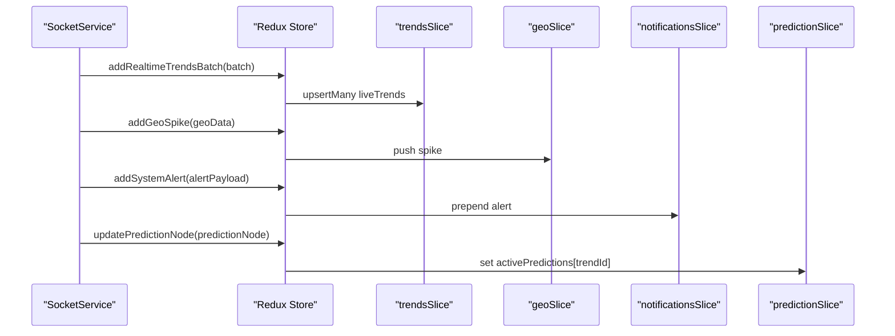
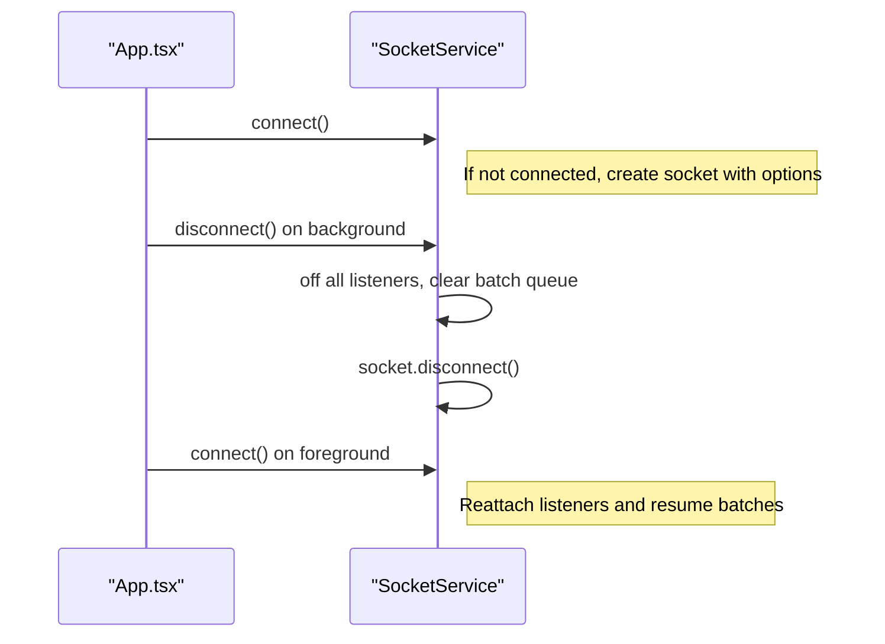

# Real-time Communication Layer

<cite>
**Referenced Files in This Document**
- [socketService.ts](file://AITrendTracker7/src/services/socketService.ts)
- [App.tsx](file://AITrendTracker7/App.tsx)
- [config.ts](file://AITrendTracker7/src/utils/config.ts)
- [index.ts](file://AITrendTracker7/src/store/index.ts)
- [trendsSlice.ts](file://AITrendTracker7/src/store/slices/trendsSlice.ts)
- [geoSlice.ts](file://AITrendTracker7/src/store/slices/geoSlice.ts)
- [notificationsSlice.ts](file://AITrendTracker7/src/store/slices/notificationsSlice.ts)
- [predictionSlice.ts](file://AITrendTracker7/src/store/slices/predictionSlice.ts)
- [HomeScreen.tsx](file://AITrendTracker7/src/navigations/screens/HomeScreen.tsx)
- [socketService.js](file://backend/src/services/socketService.js)
- [socketAdapter.js](file://backend/src/services/socketAdapter.js)
</cite>

## Table of Contents
1. [Introduction](#introduction)
2. [Project Structure](#project-structure)
3. [Core Components](#core-components)
4. [Architecture Overview](#architecture-overview)
5. [Detailed Component Analysis](#detailed-component-analysis)
6. [Dependency Analysis](#dependency-analysis)
7. [Performance Considerations](#performance-considerations)
8. [Troubleshooting Guide](#troubleshooting-guide)
9. [Conclusion](#conclusion)

## Introduction
This document explains the real-time communication implementation powered by Socket.IO on the React Native client and the backend server. It covers socket configuration, connection establishment, event handling, automatic reconnection strategies, and how real-time updates synchronize with Redux state. It also documents communication patterns for trend updates, geo-spike detection, system alerts, and AI prediction updates. Guidance is included for performance optimization, memory leak prevention, and debugging techniques for WebSocket connections.

## Project Structure
The real-time layer spans three primary areas:
- Frontend client: Socket.IO client setup, connection lifecycle, and event handlers
- Backend server: Socket.IO server with Redis adapter for horizontal scaling
- Redux store: Real-time event dispatching and state synchronization

```mermaid
graph TB
subgraph "Frontend"
APP["App.tsx<br/>Lifecycle & AppState"]
SVC["socketService.ts<br/>Client Socket Manager"]
CFG["config.ts<br/>BASE_URL"]
STORE["Redux Store<br/>index.ts"]
SL_T["trendsSlice.ts"]
SL_G["geoSlice.ts"]
SL_N["notificationsSlice.ts"]
SL_P["predictionSlice.ts"]
end
subgraph "Backend"
WS_SRV["socketService.js<br/>Server & Events"]
WS_AD["socketAdapter.js<br/>Redis Adapter"]
end
APP --> SVC
SVC --> CFG
SVC --> STORE
STORE --> SL_T
STORE --> SL_G
STORE --> SL_N
STORE --> SL_P
WS_SRV --> WS_AD
SVC <- --> WS_SRV
```

**Diagram sources**
- [App.tsx:15-41](file://AITrendTracker7/App.tsx#L15-L41)
- [socketService.ts:17-68](file://AITrendTracker7/src/services/socketService.ts#L17-L68)
- [config.ts:5-7](file://AITrendTracker7/src/utils/config.ts#L5-L7)
- [index.ts:32-42](file://AITrendTracker7/src/store/index.ts#L32-L42)
- [trendsSlice.ts:36-66](file://AITrendTracker7/src/store/slices/trendsSlice.ts#L36-L66)
- [geoSlice.ts:23-40](file://AITrendTracker7/src/store/slices/geoSlice.ts#L23-L40)
- [notificationsSlice.ts:24-47](file://AITrendTracker7/src/store/slices/notificationsSlice.ts#L24-L47)
- [predictionSlice.ts:21-34](file://AITrendTracker7/src/store/slices/predictionSlice.ts#L21-L34)
- [socketService.js:20-54](file://backend/src/services/socketService.js#L20-L54)
- [socketAdapter.js:10-19](file://backend/src/services/socketAdapter.js#L10-L19)

**Section sources**
- [App.tsx:15-41](file://AITrendTracker7/App.tsx#L15-L41)
- [socketService.ts:17-68](file://AITrendTracker7/src/services/socketService.ts#L17-L68)
- [config.ts:5-7](file://AITrendTracker7/src/utils/config.ts#L5-L7)
- [index.ts:32-42](file://AITrendTracker7/src/store/index.ts#L32-L42)
- [socketService.js:20-54](file://backend/src/services/socketService.js#L20-L54)
- [socketAdapter.js:10-19](file://backend/src/services/socketAdapter.js#L10-L19)

## Core Components
- SocketService (client): Manages connection, reconnection, event listeners, and batching for high-frequency updates.
- Redux store: Centralized state for trends, geo spikes, notifications, and AI predictions.
- Backend socket service: Initializes the Socket.IO server, attaches Redis adapter, and emits transactional events.

Key responsibilities:
- Establish WebSocket transport over TCP with automatic reconnection.
- Throttle high-frequency trend updates to reduce layout thrashing.
- Dispatch Redux actions for geo spikes, system alerts, and AI prediction updates.
- Support background/foreground lifecycle transitions with reconnect/disconnect.

**Section sources**
- [socketService.ts:9-107](file://AITrendTracker7/src/services/socketService.ts#L9-L107)
- [index.ts:32-42](file://AITrendTracker7/src/store/index.ts#L32-L42)
- [socketService.js:20-54](file://backend/src/services/socketService.js#L20-L54)

## Architecture Overview
The real-time pipeline integrates the client and server:



**Diagram sources**
- [App.tsx:18-41](file://AITrendTracker7/App.tsx#L18-L41)
- [socketService.ts:17-68](file://AITrendTracker7/src/services/socketService.ts#L17-L68)
- [socketService.js:62-91](file://backend/src/services/socketService.js#L62-L91)
- [socketAdapter.js:10-19](file://backend/src/services/socketAdapter.js#L10-L19)
- [trendsSlice.ts:52-54](file://AITrendTracker7/src/store/slices/trendsSlice.ts#L52-L54)
- [geoSlice.ts:33-35](file://AITrendTracker7/src/store/slices/geoSlice.ts#L33-L35)
- [notificationsSlice.ts:28-35](file://AITrendTracker7/src/store/slices/notificationsSlice.ts#L28-L35)
- [predictionSlice.ts:28-30](file://AITrendTracker7/src/store/slices/predictionSlice.ts#L28-L30)

## Detailed Component Analysis

### SocketService (Client)
Responsibilities:
- Configure Socket.IO client with WebSocket transport, auto connect, and robust reconnection.
- Listen to connection lifecycle events and clean up listeners on disconnect.
- Batch high-frequency trend updates to avoid layout thrashing.
- Dispatch Redux actions for geo spikes, system alerts, and AI prediction updates.

Configuration highlights:
- Transport: WebSocket only
- Reconnection: enabled with exponential backoff
- Authentication: optional JWT token passed during connect
- Event handlers: connect, disconnect, connect_error, and four real-time channels

Batching mechanism:
- Collect incoming trend_emerging events into an internal array.
- Schedule a 500 ms flush timer; on expiry, dispatch a batched update and clear the queue.

Connection lifecycle:
- connect(): initialize socket with options and attach listeners.
- disconnect(): remove all listeners, disconnect socket, reset state, and clear batch queue.
- getConnectionStatus(): expose current connection state.



**Diagram sources**
- [socketService.ts:9-107](file://AITrendTracker7/src/services/socketService.ts#L9-L107)

**Section sources**
- [socketService.ts:17-68](file://AITrendTracker7/src/services/socketService.ts#L17-L68)
- [socketService.ts:70-84](file://AITrendTracker7/src/services/socketService.ts#L70-L84)
- [socketService.ts:86-107](file://AITrendTracker7/src/services/socketService.ts#L86-L107)

### Backend SocketService and Redis Adapter
Responsibilities:
- Initialize Socket.IO server with CORS and heartbeat settings.
- Attach Redis adapter for multi-instance horizontal scaling.
- Support user-specific rooms and targeted broadcasts.
- Emit transactional events for AI completion and alerts.

Event emission patterns:
- ai:status:completed: emitted when an AI enrichment job completes.
- alert:push: emitted globally or to a specific user room.

Redis adapter:
- Uses ioredis pub/sub clients for cross-node broadcasting.
- Logs errors on adapter initialization failures.



**Diagram sources**
- [socketService.js:20-54](file://backend/src/services/socketService.js#L20-L54)
- [socketService.js:62-91](file://backend/src/services/socketService.js#L62-L91)
- [socketAdapter.js:10-19](file://backend/src/services/socketAdapter.js#L10-L19)

**Section sources**
- [socketService.js:20-54](file://backend/src/services/socketService.js#L20-L54)
- [socketService.js:62-91](file://backend/src/services/socketService.js#L62-L91)
- [socketAdapter.js:10-19](file://backend/src/services/socketAdapter.js#L10-L19)

### Redux Integration and State Synchronization
Communication channels and their Redux effects:
- trend_emerging → addRealtimeTrendsBatch (batched)
- geo_spike_detected → addGeoSpike
- system_alert → addSystemAlert
- ai_prediction_update → updatePredictionNode

State slices involved:
- trendsSlice: maintains live trends, fastest rising, filters, and pulse score; supports batched upserts.
- geoSlice: tracks user location, radius metric, and heatmap spikes.
- notificationsSlice: manages system alerts and unread counts.
- predictionSlice: stores AI prediction nodes keyed by trendId.

Integration points:
- SocketService dispatches actions directly to the Redux store upon receiving events.
- HomeScreen relies on WebSocket for real-time updates and disables polling via RTK Query.



**Diagram sources**
- [socketService.ts:46-67](file://AITrendTracker7/src/services/socketService.ts#L46-L67)
- [trendsSlice.ts:52-54](file://AITrendTracker7/src/store/slices/trendsSlice.ts#L52-L54)
- [geoSlice.ts:33-35](file://AITrendTracker7/src/store/slices/geoSlice.ts#L33-L35)
- [notificationsSlice.ts:28-35](file://AITrendTracker7/src/store/slices/notificationsSlice.ts#L28-L35)
- [predictionSlice.ts:28-30](file://AITrendTracker7/src/store/slices/predictionSlice.ts#L28-L30)

**Section sources**
- [socketService.ts:46-67](file://AITrendTracker7/src/services/socketService.ts#L46-L67)
- [trendsSlice.ts:36-66](file://AITrendTracker7/src/store/slices/trendsSlice.ts#L36-L66)
- [geoSlice.ts:23-40](file://AITrendTracker7/src/store/slices/geoSlice.ts#L23-L40)
- [notificationsSlice.ts:24-47](file://AITrendTracker7/src/store/slices/notificationsSlice.ts#L24-L47)
- [predictionSlice.ts:21-34](file://AITrendTracker7/src/store/slices/predictionSlice.ts#L21-L34)
- [HomeScreen.tsx:37-41](file://AITrendTracker7/src/navigations/screens/HomeScreen.tsx#L37-L41)

### Connection Establishment and Lifecycle Management
- App.tsx connects the socket on mount and reconnects when the app becomes active again.
- On background/inactive transitions, the socket disconnects to conserve resources.
- The service avoids duplicate connections and cleans up listeners on teardown.



**Diagram sources**
- [App.tsx:18-41](file://AITrendTracker7/App.tsx#L18-L41)
- [socketService.ts:86-102](file://AITrendTracker7/src/services/socketService.ts#L86-L102)

**Section sources**
- [App.tsx:18-41](file://AITrendTracker7/App.tsx#L18-L41)
- [socketService.ts:86-107](file://AITrendTracker7/src/services/socketService.ts#L86-L107)

### Automatic Reconnection Strategies
- Enabled with exponential backoff and capped maximum delay.
- On connect_error, the client relies on built-in reconnection; logs are provided for visibility.
- On disconnect, the client clears the trend batch queue to prevent stale updates.

Best practices:
- Keep reconnection attempts infinite for resilience.
- Avoid manual reconnection triggers; let the library manage it.
- Clear timers and queues on disconnect to prevent leaks.

**Section sources**
- [socketService.ts:20-28](file://AITrendTracker7/src/services/socketService.ts#L20-L28)
- [socketService.ts:35-43](file://AITrendTracker7/src/services/socketService.ts#L35-L43)
- [socketService.ts:78-84](file://AITrendTracker7/src/services/socketService.ts#L78-L84)

### Communication Patterns
- Trend updates: high-frequency, batched to reduce UI thrash.
- Geo spikes: immediate updates to the heatmap spikes list.
- System alerts: prepend to the alerts list and increment unread count.
- AI prediction updates: update a specific trend’s prediction node in a dictionary keyed by trendId.

**Section sources**
- [socketService.ts:46-67](file://AITrendTracker7/src/services/socketService.ts#L46-L67)
- [trendsSlice.ts:52-54](file://AITrendTracker7/src/store/slices/trendsSlice.ts#L52-L54)
- [geoSlice.ts:33-35](file://AITrendTracker7/src/store/slices/geoSlice.ts#L33-L35)
- [notificationsSlice.ts:28-35](file://AITrendTracker7/src/store/slices/notificationsSlice.ts#L28-L35)
- [predictionSlice.ts:28-30](file://AITrendTracker7/src/store/slices/predictionSlice.ts#L28-L30)

## Dependency Analysis
- Client depends on:
  - Socket.IO client library
  - Redux store and slice actions
  - Base URL configuration
- Backend depends on:
  - Socket.IO server
  - Redis adapter via ioredis
  - Logger service for diagnostics

```mermaid
graph LR
CFG["config.ts"] --> SVC["socketService.ts"]
SVC --> STORE["Redux Store"]
STORE --> SL_T["trendsSlice.ts"]
STORE --> SL_G["geoSlice.ts"]
STORE --> SL_N["notificationsSlice.ts"]
STORE --> SL_P["predictionSlice.ts"]
WS_SRV["socketService.js"] --> WS_AD["socketAdapter.js"]
SVC < --> WS_SRV
```

**Diagram sources**
- [config.ts:5-7](file://AITrendTracker7/src/utils/config.ts#L5-L7)
- [socketService.ts:1-7](file://AITrendTracker7/src/services/socketService.ts#L1-L7)
- [index.ts:32-42](file://AITrendTracker7/src/store/index.ts#L32-L42)
- [socketService.js:11-13](file://backend/src/services/socketService.js#L11-L13)
- [socketAdapter.js:6-8](file://backend/src/services/socketAdapter.js#L6-L8)

**Section sources**
- [config.ts:5-7](file://AITrendTracker7/src/utils/config.ts#L5-L7)
- [socketService.ts:1-7](file://AITrendTracker7/src/services/socketService.ts#L1-L7)
- [index.ts:32-42](file://AITrendTracker7/src/store/index.ts#L32-L42)
- [socketService.js:11-13](file://backend/src/services/socketService.js#L11-L13)
- [socketAdapter.js:6-8](file://backend/src/services/socketAdapter.js#L6-L8)

## Performance Considerations
- Batch high-frequency events: The 500 ms batch window prevents layout thrashing during trend storms.
- Minimal UI updates: Use entity adapters and memoized components to limit re-renders.
- Resource management: Disconnect on background to save CPU and battery; reconnect on foreground.
- Network efficiency: Prefer WebSocket transport and rely on built-in reconnection rather than polling.
- State normalization: Use entity adapters to keep updates O(log n) where possible.

[No sources needed since this section provides general guidance]

## Troubleshooting Guide
Common issues and remedies:
- Connection fails immediately:
  - Verify BASE_URL correctness for the environment.
  - Check backend CORS and server availability.
- Frequent reconnections:
  - Inspect network stability; adjust reconnection delays if needed.
  - Review backend Redis adapter health.
- Stale or missing real-time updates:
  - Confirm event names match between client and server.
  - Ensure listeners are attached after connect and removed on disconnect.
- Memory leaks:
  - Always call disconnect() and clear batch timers in cleanup.
  - Avoid adding listeners inside loops or callbacks without removing them.
- Debugging:
  - Enable logging on both client and server.
  - Use AppState transitions to trigger reconnects and verify connectivity.
  - Monitor Redux state changes for timely updates.

**Section sources**
- [config.ts:5-7](file://AITrendTracker7/src/utils/config.ts#L5-L7)
- [socketService.ts:86-107](file://AITrendTracker7/src/services/socketService.ts#L86-L107)
- [App.tsx:18-41](file://AITrendTracker7/App.tsx#L18-L41)

## Conclusion
The real-time layer combines a resilient Socket.IO client with a scalable backend server and efficient Redux state synchronization. The client batches high-frequency updates, cleanly manages lifecycle transitions, and dispatches targeted Redux actions. The backend leverages Redis for multi-instance consistency and emits transactional events for AI and alerts. Together, these components deliver responsive, reliable real-time experiences while maintaining performance and reliability.