# Redux Toolkit State Management

<cite>
**Referenced Files in This Document**
- [index.ts](file://AITrendTracker7/src/store/index.ts)
- [storage.ts](file://AITrendTracker7/src/store/storage.ts)
- [hooks.ts](file://AITrendTracker7/src/store/hooks.ts)
- [apiSlice.ts](file://AITrendTracker7/src/store/apiSlice.ts)
- [authSlice.ts](file://AITrendTracker7/src/store/slices/authSlice.ts)
- [trendsSlice.ts](file://AITrendTracker7/src/store/slices/trendsSlice.ts)
- [geoSlice.ts](file://AITrendTracker7/src/store/slices/geoSlice.ts)
- [notificationsSlice.ts](file://AITrendTracker7/src/store/slices/notificationsSlice.ts)
- [predictionSlice.ts](file://AITrendTracker7/src/store/slices/predictionSlice.ts)
- [uiSlice.ts](file://AITrendTracker7/src/store/slices/uiSlice.ts)
- [aiSelectors.ts](file://AITrendTracker7/src/store/selectors/aiSelectors.ts)
- [geoSelectors.ts](file://AITrendTracker7/src/store/selectors/geoSelectors.ts)
- [predictionSelectors.ts](file://AITrendTracker7/src/store/selectors/predictionSelectors.ts)
</cite>

## Table of Contents
1. [Introduction](#introduction)
2. [Project Structure](#project-structure)
3. [Core Components](#core-components)
4. [Architecture Overview](#architecture-overview)
5. [Detailed Component Analysis](#detailed-component-analysis)
6. [Dependency Analysis](#dependency-analysis)
7. [Performance Considerations](#performance-considerations)
8. [Troubleshooting Guide](#troubleshooting-guide)
9. [Conclusion](#conclusion)
10. [Appendices](#appendices)

## Introduction
This document explains the Redux Toolkit state management implementation in the AITrendTracker mobile application. It covers store configuration, slice creation patterns, entity adapter usage for normalized data, and the integration with React components via typed hooks. It documents each slice (auth, trends, notifications, prediction, geo, ui), including reducers, selectors, and state updates. It also describes performance optimizations, persistence strategies, and debugging approaches.

## Project Structure
The state management is organized under the store directory with the following key parts:
- Store configuration and persistence
- Slice definitions for domain-specific state
- RTK Query API slice for server communication
- Typed React hooks for component integration
- Memoized selectors for derived state and performance

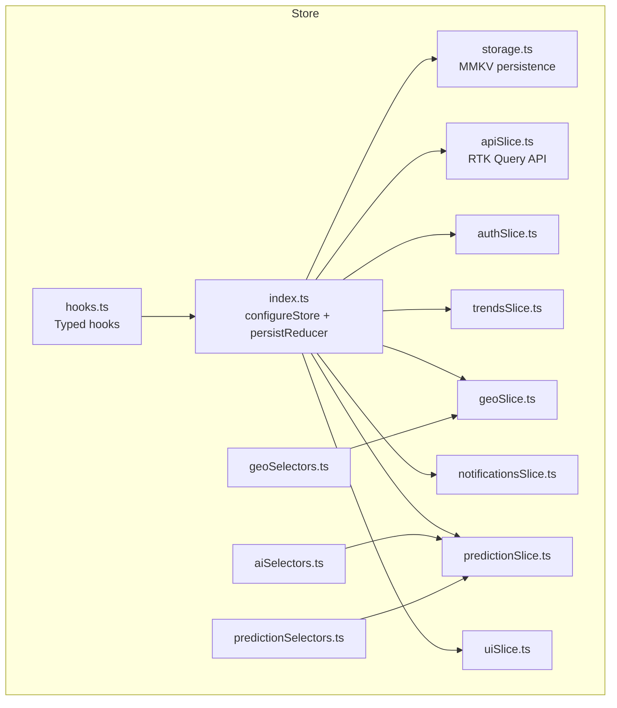

**Diagram sources**
- [index.ts:1-46](file://AITrendTracker7/src/store/index.ts#L1-L46)
- [storage.ts:1-23](file://AITrendTracker7/src/store/storage.ts#L1-L23)
- [hooks.ts:1-7](file://AITrendTracker7/src/store/hooks.ts#L1-L7)
- [apiSlice.ts:1-40](file://AITrendTracker7/src/store/apiSlice.ts#L1-L40)
- [authSlice.ts:1-63](file://AITrendTracker7/src/store/slices/authSlice.ts#L1-L63)
- [trendsSlice.ts:1-80](file://AITrendTracker7/src/store/slices/trendsSlice.ts#L1-L80)
- [geoSlice.ts:1-50](file://AITrendTracker7/src/store/slices/geoSlice.ts#L1-L50)
- [notificationsSlice.ts:1-57](file://AITrendTracker7/src/store/slices/notificationsSlice.ts#L1-L57)
- [predictionSlice.ts:1-48](file://AITrendTracker7/src/store/slices/predictionSlice.ts#L1-L48)
- [uiSlice.ts:1-43](file://AITrendTracker7/src/store/slices/uiSlice.ts#L1-L43)
- [aiSelectors.ts:1-63](file://AITrendTracker7/src/store/selectors/aiSelectors.ts#L1-L63)
- [geoSelectors.ts:1-45](file://AITrendTracker7/src/store/selectors/geoSelectors.ts#L1-L45)
- [predictionSelectors.ts:1-35](file://AITrendTracker7/src/store/selectors/predictionSelectors.ts#L1-L35)

**Section sources**
- [index.ts:1-46](file://AITrendTracker7/src/store/index.ts#L1-L46)
- [storage.ts:1-23](file://AITrendTracker7/src/store/storage.ts#L1-L23)
- [hooks.ts:1-7](file://AITrendTracker7/src/store/hooks.ts#L1-L7)

## Core Components
- Store configuration: Centralized store with Redux Persist using MMKV storage and RTK Query middleware.
- Slice reducers: Domain-specific reducers manage local state for auth, trends, geo, notifications, prediction, and UI.
- Entity adapters: Normalized collections for trends to enable efficient updates and lookups.
- Selectors: Memoized selectors compute derived data and reduce re-renders.
- Hooks: Typed hooks simplify dispatching and selecting state in components.

**Section sources**
- [index.ts:14-42](file://AITrendTracker7/src/store/index.ts#L14-L42)
- [trendsSlice.ts:17-34](file://AITrendTracker7/src/store/slices/trendsSlice.ts#L17-L34)
- [trendsSlice.ts:68-79](file://AITrendTracker7/src/store/slices/trendsSlice.ts#L68-L79)
- [hooks.ts:4-7](file://AITrendTracker7/src/store/hooks.ts#L4-L7)

## Architecture Overview
The store composes multiple slices and integrates RTK Query for API communication. Persistence is applied selectively to sensitive slices to balance performance and user experience.

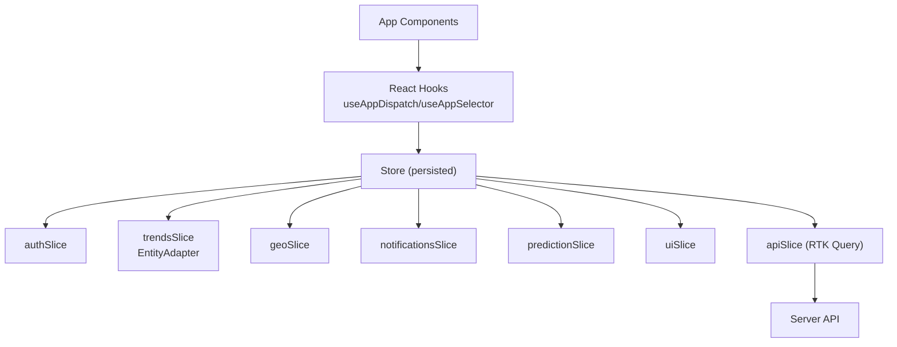

**Diagram sources**
- [index.ts:20-30](file://AITrendTracker7/src/store/index.ts#L20-L30)
- [apiSlice.ts:4-33](file://AITrendTracker7/src/store/apiSlice.ts#L4-L33)

## Detailed Component Analysis

### Store Configuration and Persistence
- Root reducer composes RTK Query’s reducer path and all slice reducers.
- Persist configuration whitelists selected slices and ignores others to minimize persistence overhead.
- Serializability checks ignore Redux Persist lifecycle actions.
- MMKV-backed storage provides secure, fast persistence on native platforms.

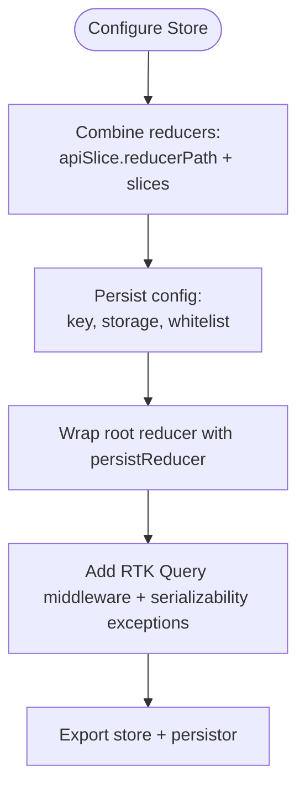

**Diagram sources**
- [index.ts:20-42](file://AITrendTracker7/src/store/index.ts#L20-L42)
- [storage.ts:9-22](file://AITrendTracker7/src/store/storage.ts#L9-L22)

**Section sources**
- [index.ts:14-42](file://AITrendTracker7/src/store/index.ts#L14-L42)
- [storage.ts:1-23](file://AITrendTracker7/src/store/storage.ts#L1-L23)

### Auth Slice
- Purpose: Manage user identity and authentication state.
- State shape: Includes identifiers, profile fields, token, and authentication flag.
- Reducers:
  - setCredentials: Updates user and token, marks authenticated.
  - logout: Clears credentials and sets unauthenticated.
- Selectors:
  - selectAuth, selectIsAuthenticated, selectUser, selectAuthToken.

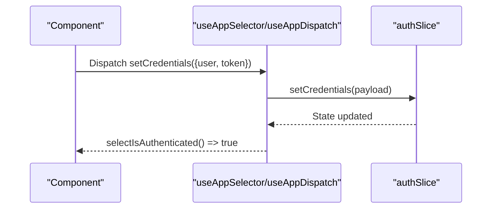

**Diagram sources**
- [authSlice.ts:22-47](file://AITrendTracker7/src/store/slices/authSlice.ts#L22-L47)
- [authSlice.ts:51-60](file://AITrendTracker7/src/store/slices/authSlice.ts#L51-L60)

**Section sources**
- [authSlice.ts:4-20](file://AITrendTracker7/src/store/slices/authSlice.ts#L4-L20)
- [authSlice.ts:25-47](file://AITrendTracker7/src/store/slices/authSlice.ts#L25-L47)
- [authSlice.ts:51-60](file://AITrendTracker7/src/store/slices/authSlice.ts#L51-L60)

### Trends Slice (Normalized Collections with Entity Adapter)
- Purpose: Manage trending topics with normalized collections and real-time updates.
- State shape:
  - liveTrends: Normalized collection via Entity Adapter.
  - fastestRising: Array of top trends.
  - activeFilters: Applied category filters.
  - pulseScore: Global pulse indicator.
- Entity Adapter:
  - selectId: trendId
  - sortComparer: sorts by trendScore descending
- Reducers:
  - setLiveTrends: replaces entire collection.
  - setFastestRising: replaces array.
  - updatePulseScore: updates numeric metric.
  - addRealtimeTrend/addRealtimeTrendsBatch: upserts normalized entries.
  - toggleFilter: toggles category filter presence.
- Selectors:
  - Entity selectors for live trends (selectAll, selectIds, selectById).
  - Additional selectors for fastestRising, pulseScore, activeFilters.

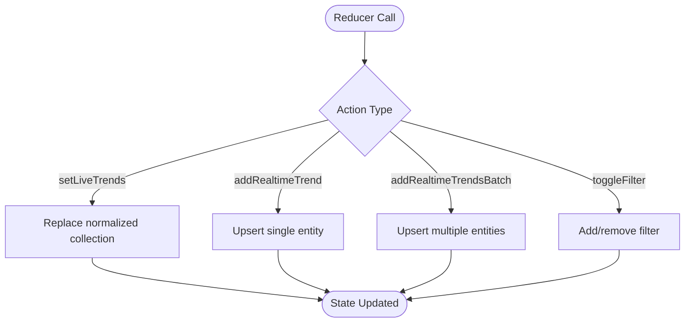

**Diagram sources**
- [trendsSlice.ts:36-64](file://AITrendTracker7/src/store/slices/trendsSlice.ts#L36-L64)

**Section sources**
- [trendsSlice.ts:4-34](file://AITrendTracker7/src/store/slices/trendsSlice.ts#L4-L34)
- [trendsSlice.ts:17-20](file://AITrendTracker7/src/store/slices/trendsSlice.ts#L17-L20)
- [trendsSlice.ts:39-63](file://AITrendTracker7/src/store/slices/trendsSlice.ts#L39-L63)
- [trendsSlice.ts:68-79](file://AITrendTracker7/src/store/slices/trendsSlice.ts#L68-L79)

### Geo Slice
- Purpose: Manage user location, proximity radius, and geographic heatmap spikes.
- State shape:
  - userLocation: nullable coordinates and optional labels.
  - radiusMetric: search radius in kilometers.
  - heatmapSpikes: array of spike events.
- Reducers:
  - setUserLocation, setRadiusMetric, addGeoSpike, clearGeoSpikes.
- Selectors:
  - selectUserLocation, selectRadiusMetric, selectHeatmapSpikes.

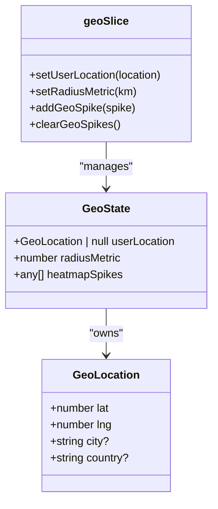

**Diagram sources**
- [geoSlice.ts:11-21](file://AITrendTracker7/src/store/slices/geoSlice.ts#L11-L21)
- [geoSlice.ts:23-40](file://AITrendTracker7/src/store/slices/geoSlice.ts#L23-L40)

**Section sources**
- [geoSlice.ts:4-21](file://AITrendTracker7/src/store/slices/geoSlice.ts#L4-L21)
- [geoSlice.ts:26-39](file://AITrendTracker7/src/store/slices/geoSlice.ts#L26-L39)
- [geoSlice.ts:44-47](file://AITrendTracker7/src/store/slices/geoSlice.ts#L44-L47)

### Notifications Slice
- Purpose: Manage system alerts and unread counts.
- State shape:
  - alerts: array of notification payloads.
  - unreadCount: integer count of unread items.
- Reducers:
  - addSystemAlert: prepends new alert with computed timestamp and increments unread.
  - markAsRead: marks a specific alert read and decrements unread if newly read.
  - markAllAsRead: marks all alerts read and resets unread count.
- Selectors:
  - selectAllAlerts, selectUnreadCount.

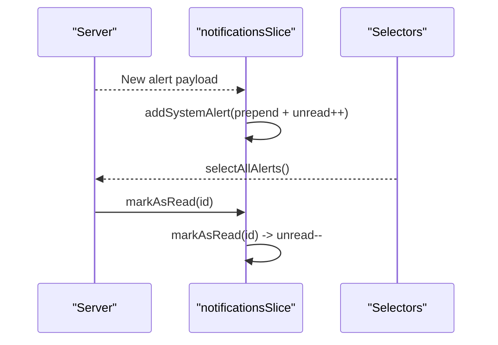

**Diagram sources**
- [notificationsSlice.ts:24-47](file://AITrendTracker7/src/store/slices/notificationsSlice.ts#L24-L47)
- [notificationsSlice.ts:52-54](file://AITrendTracker7/src/store/slices/notificationsSlice.ts#L52-L54)

**Section sources**
- [notificationsSlice.ts:14-22](file://AITrendTracker7/src/store/slices/notificationsSlice.ts#L14-L22)
- [notificationsSlice.ts:27-46](file://AITrendTracker7/src/store/slices/notificationsSlice.ts#L27-L46)
- [notificationsSlice.ts:52-54](file://AITrendTracker7/src/store/slices/notificationsSlice.ts#L52-L54)

### Prediction Slice
- Purpose: Store AI prediction nodes and global confidence thresholds.
- State shape:
  - globalConfidenceThreshold: numeric threshold for filtering.
  - activePredictions: record keyed by trendId.
- Reducers:
  - updateConfidenceThreshold: updates global threshold.
  - updatePredictionNode: stores or updates a prediction node.
  - clearPredictions: clears stored predictions.
- Selectors:
  - selectGlobalConfidence, selectAllPredictions, selectPredictionForTrend(trendId).

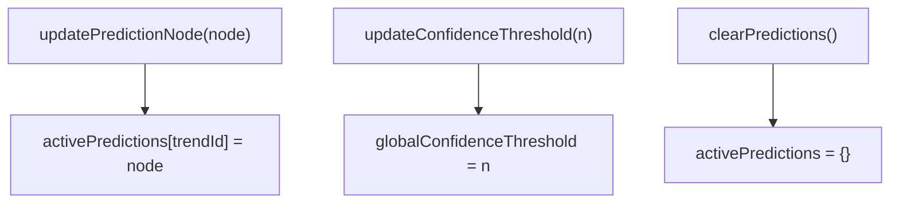

**Diagram sources**
- [predictionSlice.ts:21-35](file://AITrendTracker7/src/store/slices/predictionSlice.ts#L21-L35)

**Section sources**
- [predictionSlice.ts:11-19](file://AITrendTracker7/src/store/slices/predictionSlice.ts#L11-L19)
- [predictionSlice.ts:24-34](file://AITrendTracker7/src/store/slices/predictionSlice.ts#L24-L34)
- [predictionSlice.ts:39-45](file://AITrendTracker7/src/store/slices/predictionSlice.ts#L39-L45)

### UI Slice
- Purpose: Manage theme mode, global loading state, and modal visibility.
- State shape:
  - themeMode: dark, light, or system.
  - isGlobalLoading: boolean flag.
  - activeModal: string id or null.
- Reducers:
  - setThemeMode, setGlobalLoading, openModal, closeModal.
- Selectors:
  - selectThemeMode, selectIsGlobalLoading, selectActiveModal.

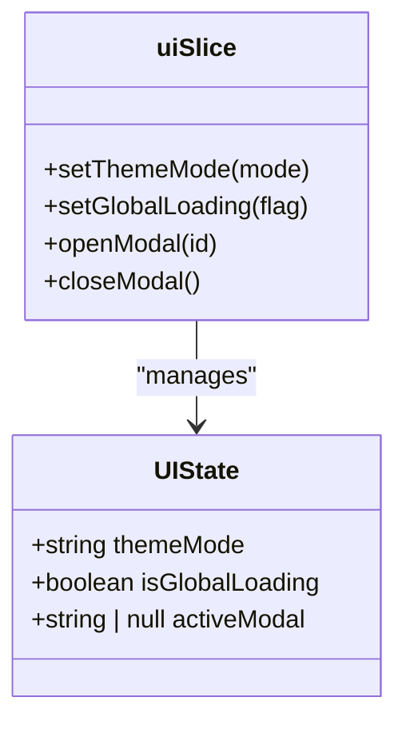

**Diagram sources**
- [uiSlice.ts:4-14](file://AITrendTracker7/src/store/slices/uiSlice.ts#L4-L14)
- [uiSlice.ts:16-33](file://AITrendTracker7/src/store/slices/uiSlice.ts#L16-L33)

**Section sources**
- [uiSlice.ts:10-14](file://AITrendTracker7/src/store/slices/uiSlice.ts#L10-L14)
- [uiSlice.ts:19-32](file://AITrendTracker7/src/store/slices/uiSlice.ts#L19-L32)
- [uiSlice.ts:37-40](file://AITrendTracker7/src/store/slices/uiSlice.ts#L37-L40)

### API Integration (RTK Query)
- Purpose: Centralized data fetching with caching, tagging, and automatic refetching.
- Configuration:
  - baseQuery with Authorization header from auth token.
  - Tag types for cache invalidation.
  - Endpoints: home feed, heatmap payload, user profile.
- Hooks:
  - useGetHomeFeedQuery, useGetHeatmapPayloadQuery, useGetUserProfileQuery.

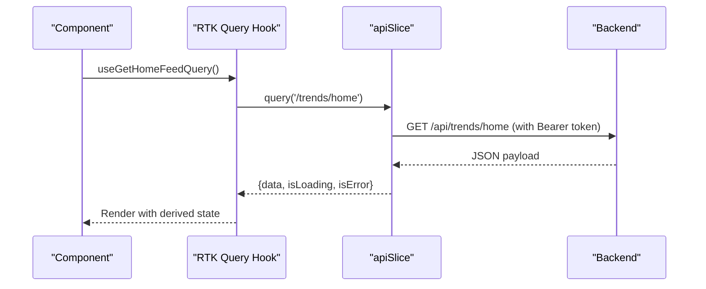

**Diagram sources**
- [apiSlice.ts:4-39](file://AITrendTracker7/src/store/apiSlice.ts#L4-L39)
- [index.ts:32-42](file://AITrendTracker7/src/store/index.ts#L32-L42)

**Section sources**
- [apiSlice.ts:1-40](file://AITrendTracker7/src/store/apiSlice.ts#L1-L40)
- [index.ts:32-42](file://AITrendTracker7/src/store/index.ts#L32-L42)

### Selectors and Derived State
- AI Selectors:
  - Throttled decay engine computes time-decayed confidence with exponential decay and floor detection.
  - Memoized factory selector prevents recomputation within a throttle window.
- Geo Selectors:
  - selectSpikesInRadius: client-side spatial filtering using coordinate bounds.
  - selectHeatmapNodes: transforms spike data to map-compatible format.
  - selectHasActiveSpikes: quick boolean check for spikes presence.
- Prediction Selectors:
  - selectHighConfidencePredictions: filters by global threshold.
  - selectViralPredictions: filters by lifecycle states.
  - selectTimelineForPrediction: retrieves migration matrix for a trend.

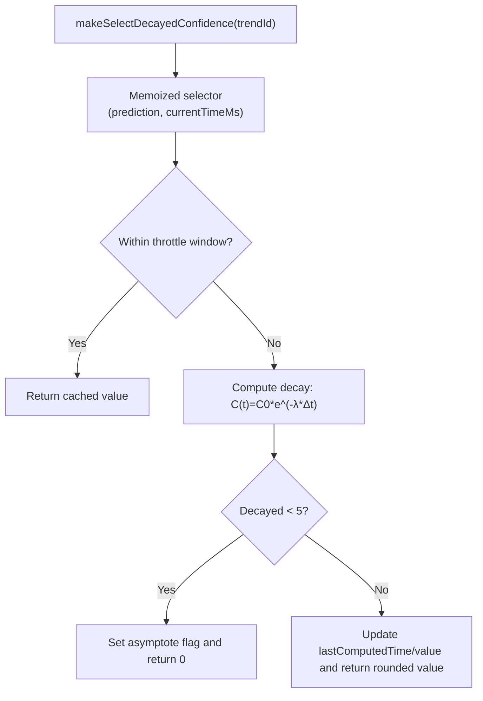

**Diagram sources**
- [aiSelectors.ts:23-62](file://AITrendTracker7/src/store/selectors/aiSelectors.ts#L23-L62)

**Section sources**
- [aiSelectors.ts:1-63](file://AITrendTracker7/src/store/selectors/aiSelectors.ts#L1-L63)
- [geoSelectors.ts:1-45](file://AITrendTracker7/src/store/selectors/geoSelectors.ts#L1-L45)
- [predictionSelectors.ts:1-35](file://AITrendTracker7/src/store/selectors/predictionSelectors.ts#L1-L35)

### Integration with React Components (Custom Hooks)
- Typed hooks:
  - useAppDispatch: strongly-typed dispatch.
  - useAppSelector: strongly-typed selector hook.
- Usage pattern:
  - Components import hooks and select state via memoized selectors.
  - Dispatch actions from reducers or RTK Query hooks.

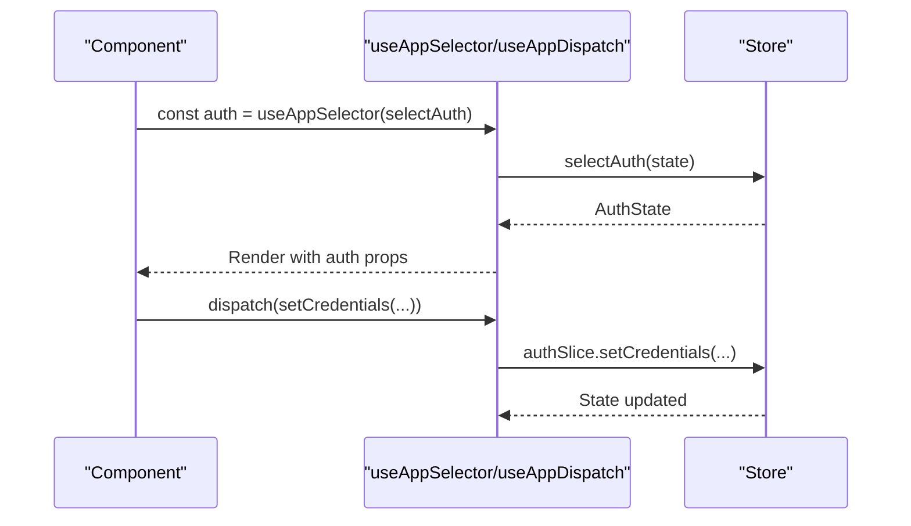

**Diagram sources**
- [hooks.ts:4-7](file://AITrendTracker7/src/store/hooks.ts#L4-L7)
- [authSlice.ts:51-60](file://AITrendTracker7/src/store/slices/authSlice.ts#L51-L60)

**Section sources**
- [hooks.ts:1-7](file://AITrendTracker7/src/store/hooks.ts#L1-L7)

## Dependency Analysis
- Coupling:
  - Slices are loosely coupled; selectors compose data from multiple slices.
  - RTK Query is integrated at the root level and accessed by components via generated hooks.
- Cohesion:
  - Each slice encapsulates a cohesive domain area with dedicated reducers and selectors.
- External Dependencies:
  - Redux Persist for persistence.
  - RTK Query for API integration.
  - react-native-mmkv for secure storage.

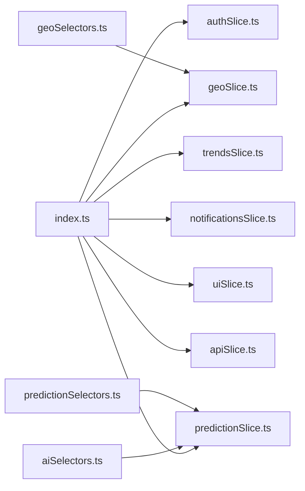

**Diagram sources**
- [index.ts:20-28](file://AITrendTracker7/src/store/index.ts#L20-L28)
- [aiSelectors.ts:7](file://AITrendTracker7/src/store/selectors/aiSelectors.ts#L7)
- [geoSelectors.ts:2](file://AITrendTracker7/src/store/selectors/geoSelectors.ts#L2)
- [predictionSelectors.ts:2](file://AITrendTracker7/src/store/selectors/predictionSelectors.ts#L2)

**Section sources**
- [index.ts:20-28](file://AITrendTracker7/src/store/index.ts#L20-L28)

## Performance Considerations
- Normalized Collections:
  - Entity Adapter reduces duplication and improves update performance for lists.
- Memoized Selectors:
  - createSelector minimizes recomputation and avoids unnecessary renders.
  - AI selectors throttle expensive computations and asymptote to zero to save CPU.
- RTK Query Caching:
  - keepUnusedDataFor limits memory retention for frequently changing datasets.
- Persistence Scope:
  - Whitelisting slices reduces persistence overhead and improves cold-start performance.
- UI State:
  - Minimal global loading flags avoid cascading re-renders.

[No sources needed since this section provides general guidance]

## Troubleshooting Guide
- Authentication Token Propagation:
  - Verify Authorization header is attached to requests using the token from auth state.
- Selector Memoization Issues:
  - Ensure selector arguments remain referentially stable; use memoized factories for dynamic inputs.
- Real-time Updates:
  - Confirm entity adapter upserts are used for live trend updates to maintain normalized integrity.
- Persistence Hydration:
  - Check whitelist and ignored actions for serializability warnings during hydration.
- Network Requests:
  - Inspect RTK Query endpoint configurations and tag invalidation strategies.

**Section sources**
- [apiSlice.ts:8-14](file://AITrendTracker7/src/store/apiSlice.ts#L8-L14)
- [index.ts:34-39](file://AITrendTracker7/src/store/index.ts#L34-L39)

## Conclusion
The Redux Toolkit implementation in AITrendTracker follows best practices for modern React Native applications. It leverages normalized collections, memoized selectors, selective persistence, and RTK Query for scalable data flow. The modular slice architecture enables clear separation of concerns, while typed hooks streamline component integration. Performance optimizations and debugging strategies are embedded throughout the design to support long-term maintainability and responsiveness.

[No sources needed since this section summarizes without analyzing specific files]

## Appendices
- Practical Examples (by file reference):
  - Auth state updates: [authSlice.ts:25-47](file://AITrendTracker7/src/store/slices/authSlice.ts#L25-L47)
  - Live trends updates: [trendsSlice.ts:39-63](file://AITrendTracker7/src/store/slices/trendsSlice.ts#L39-L63)
  - Geo spikes filtering: [geoSelectors.ts:11-26](file://AITrendTracker7/src/store/selectors/geoSelectors.ts#L11-L26)
  - Prediction filtering: [predictionSelectors.ts:9-25](file://AITrendTracker7/src/store/selectors/predictionSelectors.ts#L9-L25)
  - Decayed confidence computation: [aiSelectors.ts:23-62](file://AITrendTracker7/src/store/selectors/aiSelectors.ts#L23-L62)
  - Typed hooks usage: [hooks.ts:4-7](file://AITrendTracker7/src/store/hooks.ts#L4-L7)
  - API queries: [apiSlice.ts:17-32](file://AITrendTracker7/src/store/apiSlice.ts#L17-L32)

[No sources needed since this section aggregates references without analyzing specific files]