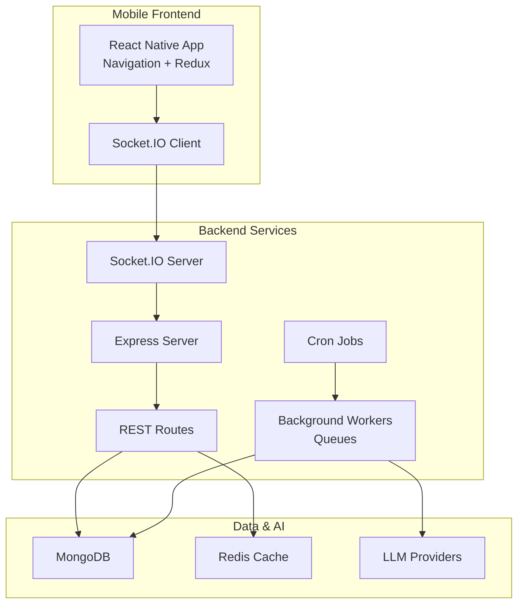
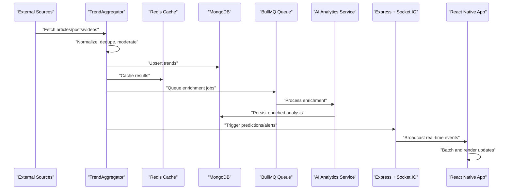
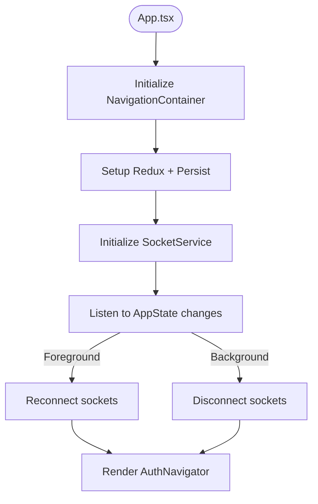
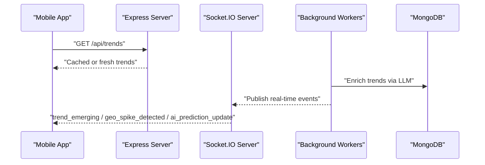
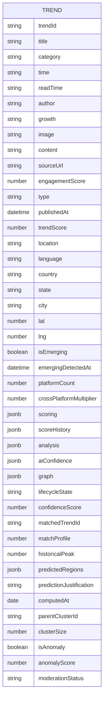
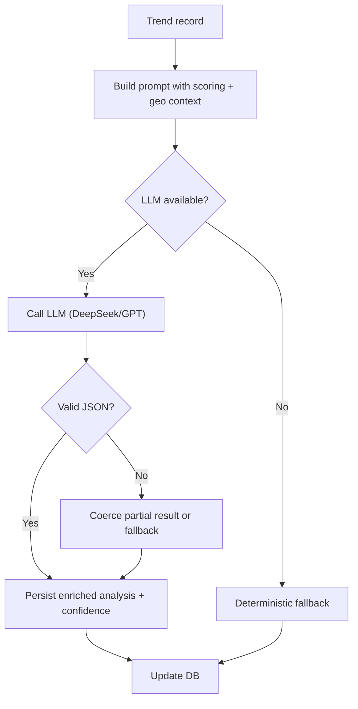
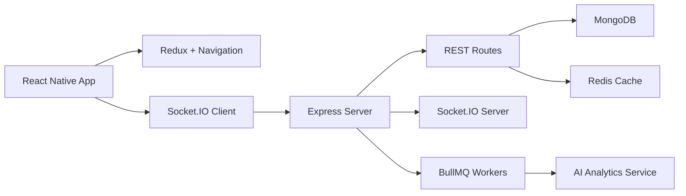

# Project Overview

<cite>
**Referenced Files in This Document**
- [README.md](file://AITrendTracker7/README.md)
- [package.json](file://AITrendTracker7/package.json)
- [App.tsx](file://AITrendTracker7/App.tsx)
- [socketService.ts](file://AITrendTracker7/src/services/socketService.ts)
- [index.ts](file://AITrendTracker7/src/store/index.ts)
- [config.ts](file://AITrendTracker7/src/utils/config.ts)
- [AuthNavigator.tsx](file://AITrendTracker7/src/navigations/AuthNavigator.tsx)
- [trendsData.ts](file://AITrendTracker7/src/data/trendsData.ts)
- [server.js](file://backend/server.js)
- [app.js](file://backend/src/app.js)
- [package.json](file://backend/package.json)
- [dbIndexes.js](file://backend/src/config/dbIndexes.js)
- [Trend.js](file://backend/src/models/Trend.js)
- [trendAggregator.js](file://backend/src/services/trendAggregator.js)
- [aiAnalyticsService.js](file://backend/src/services/aiAnalyticsService.js)
</cite>

## Table of Contents
1. [Introduction](#introduction)
2. [Project Structure](#project-structure)
3. [Core Components](#core-components)
4. [Architecture Overview](#architecture-overview)
5. [Detailed Component Analysis](#detailed-component-analysis)
6. [Dependency Analysis](#dependency-analysis)
7. [Performance Considerations](#performance-considerations)
8. [Troubleshooting Guide](#troubleshooting-guide)
9. [Conclusion](#conclusion)

## Introduction
AITrendTracker is a real-time AI-powered trend discovery platform designed to surface emerging cultural, social, and news phenomena by aggregating signals from diverse sources, enriching them with AI analysis, and delivering predictive insights to users. The platform targets three primary audiences:
- Trend researchers who need structured, explainable insights into the drivers and lifecycle of trends
- Marketers and brand strategists who require forward-looking signals to inform campaigns and positioning
- General users interested in cultural intelligence and understanding what is gaining traction across the web

The platform’s core value proposition lies in transforming raw social media, news, and video signals into actionable intelligence through automated aggregation, AI-driven enrichment, and real-time delivery via a responsive mobile application.

## Project Structure
AITrendTracker follows a modern full-stack architecture:
- Mobile front-end built with React Native 0.84.1 and TypeScript, featuring a native navigation stack, Redux Toolkit for state management, and Socket.IO for real-time updates
- Backend built with Node.js/Express, serving REST APIs, managing background jobs, and powering real-time communication via Socket.IO
- Data persistence using MongoDB with performance-focused indexing and caching layers
- AI/ML integrations leveraging external LLM providers and internal orchestration services for trend enrichment and prediction

**Diagram sources**
- [App.tsx:15-59](file://AITrendTracker7/App.tsx#L15-L59)
- [socketService.ts:9-107](file://AITrendTracker7/src/services/socketService.ts#L9-L107)
- [server.js:13-46](file://backend/server.js#L13-L46)
- [app.js:28-62](file://backend/src/app.js#L28-L62)

**Section sources**
- [README.md:1-98](file://AITrendTracker7/README.md#L1-L98)
- [package.json:12-44](file://AITrendTracker7/package.json#L12-L44)
- [server.js:11-51](file://backend/server.js#L11-L51)
- [package.json:14-38](file://backend/package.json#L14-L38)

## Core Components
- React Native mobile application
  - Bootstrapped with React Native 0.84.1 and TypeScript
  - Navigation managed via @react-navigation/native-stack
  - State management via Redux Toolkit with persisted slices
  - Real-time updates via Socket.IO client connecting to the backend
- Backend API and services
  - Express server with middleware for security, logging, and rate limiting
  - REST endpoints for trends, users, notifications, and AI chat
  - Background job processing via BullMQ queues and cron-based tasks
  - Socket.IO server for real-time event broadcasting
- Data and AI pipeline
  - MongoDB models for trends and user data with compound indexes
  - Trend aggregator orchestrating multi-source ingestion, deduplication, ranking, and enrichment
  - AI analytics service integrating external LLMs with validation and fallbacks
- Real-time delivery
  - Socket.IO events for live trend emissions, geo spikes, system alerts, and AI predictions
  - Mobile app batches and throttles incoming real-time updates to maintain smooth UX

**Section sources**
- [AuthNavigator.tsx:23-61](file://AITrendTracker7/src/navigations/AuthNavigator.tsx#L23-L61)
- [index.ts:32-42](file://AITrendTracker7/src/store/index.ts#L32-L42)
- [socketService.ts:17-107](file://AITrendTracker7/src/services/socketService.ts#L17-L107)
- [app.js:19-26](file://backend/src/app.js#L19-L26)
- [app.js:59-62](file://backend/src/app.js#L59-L62)
- [dbIndexes.js:13-28](file://backend/src/config/dbIndexes.js#L13-L28)
- [Trend.js:45-187](file://backend/src/models/Trend.js#L45-L187)
- [trendAggregator.js:21-173](file://backend/src/services/trendAggregator.js#L21-L173)
- [aiAnalyticsService.js:29-56](file://backend/src/services/aiAnalyticsService.js#L29-L56)

## Architecture Overview
AITrendTracker’s end-to-end data flow:
1. External sources: News APIs, Reddit, GNews, and YouTube are polled concurrently by the backend trend aggregator
2. Ingestion and normalization: Titles, metadata, and engagement metrics are normalized and deduplicated
3. Moderation and fusion: Content is filtered for spam and merged across platforms to form unified trend records
4. Scoring and ranking: Composite trend scores are computed and trends are ranked and limited
5. Persistence and caching: Results are upserted to MongoDB and cached in Redis for fast retrieval
6. AI enrichment: Selected trends are queued for enrichment via LLMs, validated, and persisted with explainability and confidence metrics
7. Predictive modeling: Lifecycle predictions and relationship graphs are computed asynchronously
8. Real-time delivery: Socket.IO broadcasts live events to connected clients, which batch and render updates in the mobile app

**Diagram sources**
- [trendAggregator.js:39-173](file://backend/src/services/trendAggregator.js#L39-L173)
- [aiAnalyticsService.js:29-56](file://backend/src/services/aiAnalyticsService.js#L29-L56)
- [server.js:27-46](file://backend/server.js#L27-L46)
- [socketService.ts:46-67](file://AITrendTracker7/src/services/socketService.ts#L46-L67)

## Detailed Component Analysis

### Mobile Application (React Native)
- Entry point initializes navigation, Redux store with persistence, toast provider, offline banner, and Socket.IO connection lifecycle
- Navigation container wraps the app with a native stack navigator supporting splash, auth, and main screens
- SocketService manages connection, event subscriptions, and batching to avoid UI thrashing during real-time bursts

**Diagram sources**
- [App.tsx:15-59](file://AITrendTracker7/App.tsx#L15-L59)
- [socketService.ts:17-107](file://AITrendTracker7/src/services/socketService.ts#L17-L107)

**Section sources**
- [App.tsx:15-59](file://AITrendTracker7/App.tsx#L15-L59)
- [AuthNavigator.tsx:23-61](file://AITrendTracker7/src/navigations/AuthNavigator.tsx#L23-L61)
- [socketService.ts:9-107](file://AITrendTracker7/src/services/socketService.ts#L9-L107)
- [index.ts:14-42](file://AITrendTracker7/src/store/index.ts#L14-L42)
- [config.ts:5-7](file://AITrendTracker7/src/utils/config.ts#L5-L7)

### Backend API and Real-Time Services
- Express server with Helmet, CORS, Morgan, and rate limiters; exposes health checks and admin queue dashboard
- REST routes for trends, users, notifications, and AI chat
- Socket.IO server initialized on HTTP server for real-time event broadcasting
- Background workers and cron jobs handle enrichment, clustering, predictions, and periodic scans

**Diagram sources**
- [app.js:28-62](file://backend/src/app.js#L28-L62)
- [server.js:27-46](file://backend/server.js#L27-L46)
- [socketService.ts:46-67](file://AITrendTracker7/src/services/socketService.ts#L46-L67)

**Section sources**
- [app.js:19-26](file://backend/src/app.js#L19-L26)
- [app.js:59-62](file://backend/src/app.js#L59-L62)
- [server.js:13-46](file://backend/server.js#L13-L46)

### Data Model and Indexing
- The Trend model captures ingestion metadata, scoring metrics, geographic context, AI analysis, confidence, predictions, and relationship graph fields
- Compound indexes optimize queries for category sorting, geospatial filtering, anomaly detection, and moderation workflows

**Diagram sources**
- [Trend.js:45-187](file://backend/src/models/Trend.js#L45-L187)

**Section sources**
- [Trend.js:13-28](file://backend/src/models/Trend.js#L13-L28)
- [Trend.js:174-187](file://backend/src/models/Trend.js#L174-L187)
- [dbIndexes.js:13-28](file://backend/src/config/dbIndexes.js#L13-L28)

### AI/ML Enrichment Pipeline
- The AI analytics service orchestrates LLM calls with structured prompts, validates outputs, and falls back deterministically when needed
- Enrichment integrates scoring context, velocity deltas, and geographic context to produce explainability, sentiment, target audience, and confidence metrics
- Confidence sub-objects capture source consistency and completeness for downstream trust scoring

**Diagram sources**
- [aiAnalyticsService.js:29-96](file://backend/src/services/aiAnalyticsService.js#L29-L96)
- [aiAnalyticsService.js:101-140](file://backend/src/services/aiAnalyticsService.js#L101-L140)
- [aiAnalyticsService.js:182-199](file://backend/src/services/aiAnalyticsService.js#L182-L199)

**Section sources**
- [aiAnalyticsService.js:24-56](file://backend/src/services/aiAnalyticsService.js#L24-L56)
- [aiAnalyticsService.js:101-140](file://backend/src/services/aiAnalyticsService.js#L101-L140)
- [aiAnalyticsService.js:182-199](file://backend/src/services/aiAnalyticsService.js#L182-L199)

### Technology Stack Summary
- Mobile: React Native 0.84.1, Redux Toolkit, Socket.IO client, React Navigation, TypeScript
- Backend: Node.js/Express, Socket.IO server, BullMQ queues, cron jobs, rate limiting, logging
- Data: MongoDB with compound indexes, Redis cache
- AI/ML: OpenRouter/OpenAI-compatible clients, structured JSON validation, deterministic fallbacks
- DevOps: NPM scripts, environment variables, Docker-friendly server initialization

**Section sources**
- [package.json:12-44](file://AITrendTracker7/package.json#L12-L44)
- [package.json:14-38](file://backend/package.json#L14-L38)
- [server.js:11-17](file://backend/server.js#L11-L17)

## Dependency Analysis
The system exhibits clear separation of concerns:
- Mobile app depends on Redux for state, Socket.IO for real-time, and navigation for routing
- Backend depends on Express for HTTP, Socket.IO for real-time, BullMQ for async processing, and MongoDB/Redis for persistence/caching
- AI enrichment is decoupled behind queue workers and validation layers

**Diagram sources**
- [index.ts:20-28](file://AITrendTracker7/src/store/index.ts#L20-L28)
- [socketService.ts:20-28](file://AITrendTracker7/src/services/socketService.ts#L20-L28)
- [server.js:27-46](file://backend/server.js#L27-L46)
- [app.js:59-62](file://backend/src/app.js#L59-L62)

**Section sources**
- [index.ts:14-42](file://AITrendTracker7/src/store/index.ts#L14-L42)
- [socketService.ts:9-107](file://AITrendTracker7/src/services/socketService.ts#L9-L107)
- [app.js:19-26](file://backend/src/app.js#L19-L26)

## Performance Considerations
- Real-time batching: The mobile app batches incoming trend events to reduce layout thrashing during spikes
- Caching: Redis caches aggregated results with short TTLs to minimize database load while keeping feeds fresh
- Asynchronous enrichment: LLM enrichment runs behind queues with cost-aware gating to balance quality and throughput
- Indexing: Compound indexes on Trend model accelerate common queries for category, geospatial filters, and moderation
- Rate limiting: Distributed rate limiting protects endpoints under load and ensures fair usage

[No sources needed since this section provides general guidance]

## Troubleshooting Guide
- Real-time connectivity
  - Verify Socket.IO client connection lifecycle and reconnection behavior
  - Confirm base URL configuration for development vs production environments
- API errors
  - Check Express error handling middleware and server logs for unhandled exceptions
  - Review rate limiter configuration and Redis-backed limits
- Data freshness and staleness
  - Inspect cache keys and TTLs; confirm fallback to database when upstream APIs fail
  - Validate index creation and logging during server startup
- AI enrichment failures
  - Monitor LLM availability and fallback paths; inspect validation errors and coerced results

**Section sources**
- [socketService.ts:30-43](file://AITrendTracker7/src/services/socketService.ts#L30-L43)
- [config.ts:5-7](file://AITrendTracker7/src/utils/config.ts#L5-L7)
- [app.js:81-85](file://backend/src/app.js#L81-L85)
- [dbIndexes.js:13-28](file://backend/src/config/dbIndexes.js#L13-L28)
- [aiAnalyticsService.js:30-56](file://backend/src/services/aiAnalyticsService.js#L30-L56)

## Conclusion
AITrendTracker delivers a robust, real-time trend intelligence platform that combines multi-source aggregation, AI-powered explainability, and predictive modeling with a seamless mobile experience. Its layered architecture—frontend state and real-time, backend services and queues, and AI/ML validation—enables scalability, reliability, and actionable insights for researchers, marketers, and general users seeking cultural intelligence.