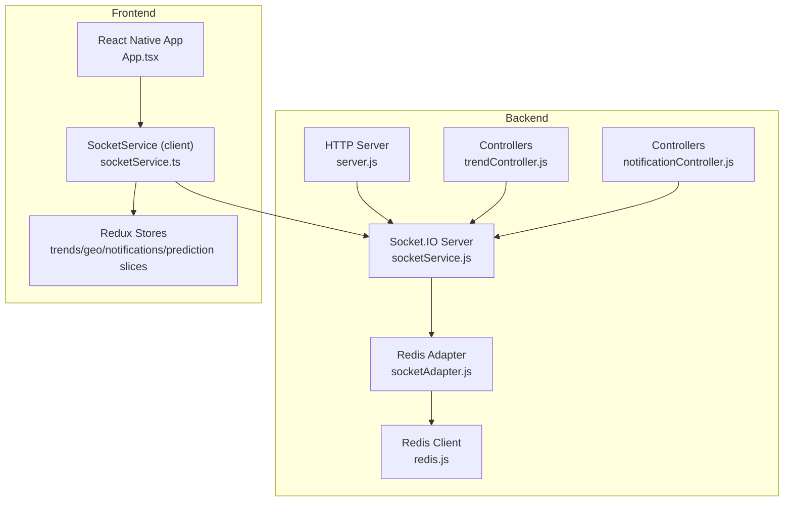
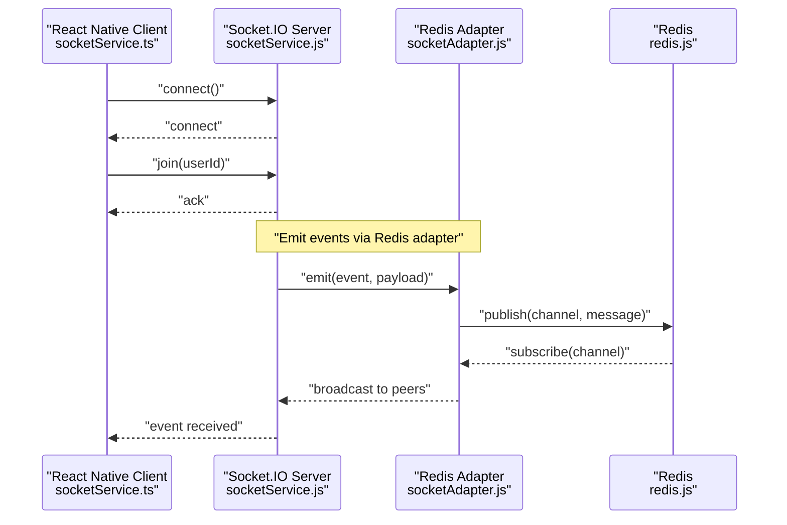
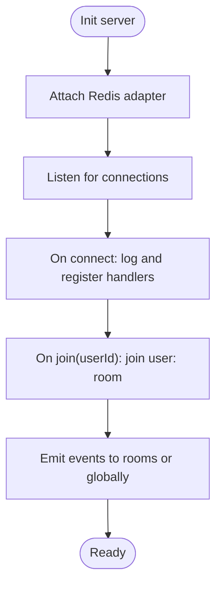
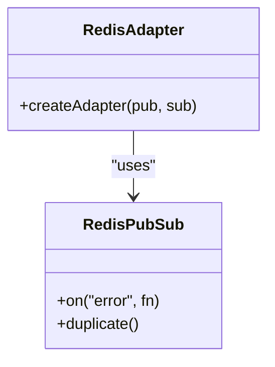
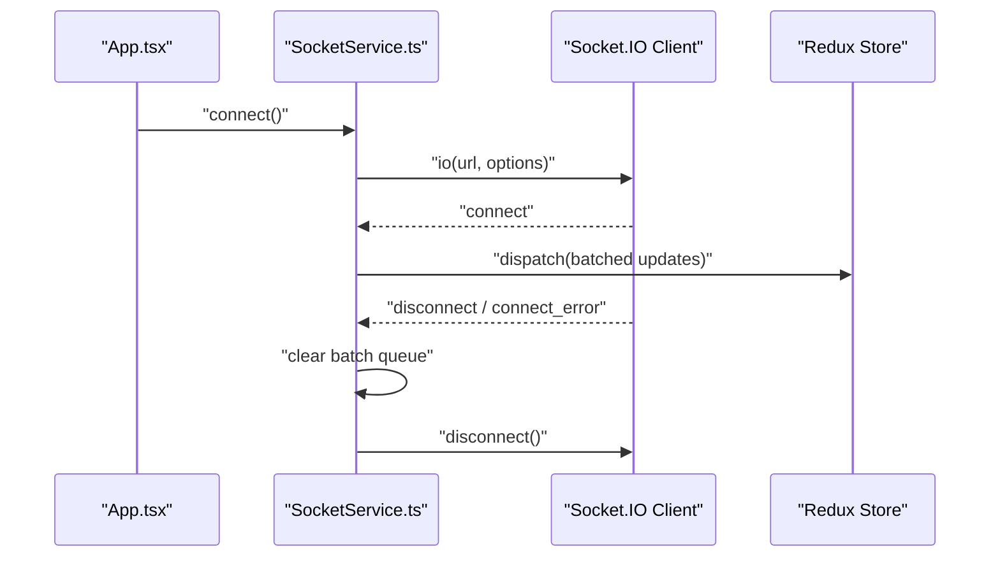
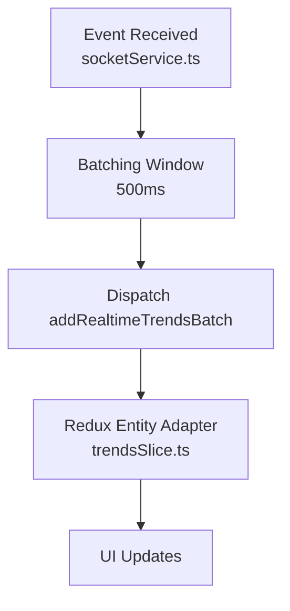
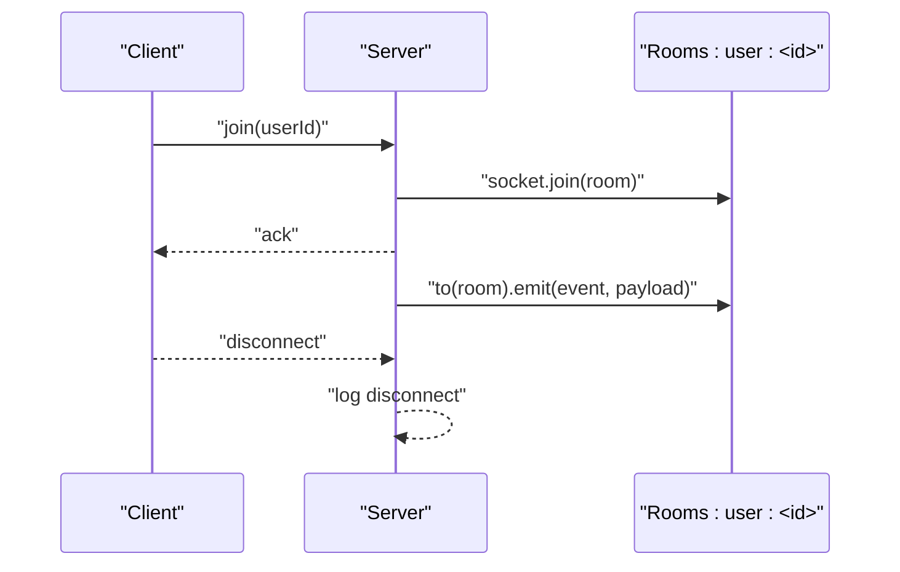
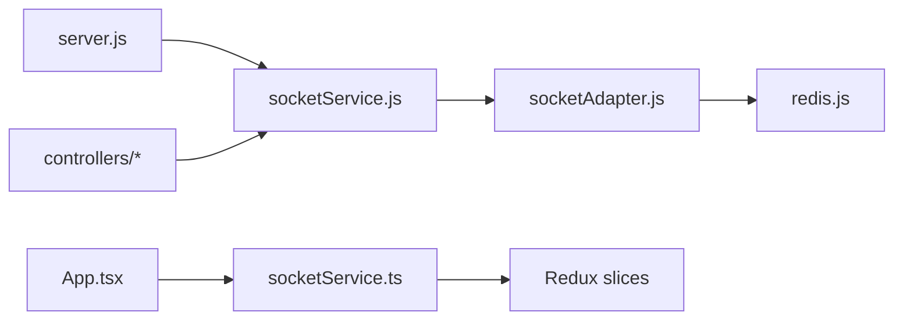

# Real-time Communication

<cite>
**Referenced Files in This Document**
- [server.js](file://backend/server.js)
- [socketService.js](file://backend/src/services/socketService.js)
- [socketAdapter.js](file://backend/src/services/socketAdapter.js)
- [redis.js](file://backend/src/config/redis.js)
- [socketService.ts](file://AITrendTracker7/src/services/socketService.ts)
- [App.tsx](file://AITrendTracker7/App.tsx)
- [trendsSlice.ts](file://AITrendTracker7/src/store/slices/trendsSlice.ts)
- [geoSlice.ts](file://AITrendTracker7/src/store/slices/geoSlice.ts)
- [notificationsSlice.ts](file://AITrendTracker7/src/store/slices/notificationsSlice.ts)
- [predictionSlice.ts](file://AITrendTracker7/src/store/slices/predictionSlice.ts)
- [trendController.js](file://backend/src/controllers/trendController.js)
- [notificationController.js](file://backend/src/controllers/notificationController.js)
</cite>

## Table of Contents
1. [Introduction](#introduction)
2. [Project Structure](#project-structure)
3. [Core Components](#core-components)
4. [Architecture Overview](#architecture-overview)
5. [Detailed Component Analysis](#detailed-component-analysis)
6. [Dependency Analysis](#dependency-analysis)
7. [Performance Considerations](#performance-considerations)
8. [Troubleshooting Guide](#troubleshooting-guide)
9. [Conclusion](#conclusion)

## Introduction
This document explains AITrendTracker’s real-time communication system built on Socket.IO. It covers server initialization and Redis adapter configuration for horizontal scaling, event broadcasting patterns, message serialization, client-side integration in React Native, state synchronization strategies, server-side event handling, room management, user presence tracking, error handling and reconnection strategies, performance optimization, and operational monitoring.

## Project Structure
The real-time system spans two layers:
- Backend: HTTP server with Socket.IO, Redis adapter, and controllers/services that emit real-time events.
- Frontend (React Native): Socket.IO client service that connects to the backend, batches updates, and synchronizes Redux stores.

**Diagram sources**
- [server.js:1-51](file://backend/server.js#L1-L51)
- [socketService.js:1-107](file://backend/src/services/socketService.js#L1-L107)
- [socketAdapter.js:1-22](file://backend/src/services/socketAdapter.js#L1-L22)
- [redis.js:1-19](file://backend/src/config/redis.js#L1-L19)
- [trendController.js:1-407](file://backend/src/controllers/trendController.js#L1-L407)
- [notificationController.js:1-93](file://backend/src/controllers/notificationController.js#L1-L93)
- [App.tsx:1-59](file://AITrendTracker7/App.tsx#L1-L59)
- [socketService.ts:1-110](file://AITrendTracker7/src/services/socketService.ts#L1-L110)
- [trendsSlice.ts:1-80](file://AITrendTracker7/src/store/slices/trendsSlice.ts#L1-L80)
- [geoSlice.ts:1-50](file://AITrendTracker7/src/store/slices/geoSlice.ts#L1-L50)
- [notificationsSlice.ts:1-57](file://AITrendTracker7/src/store/slices/notificationsSlice.ts#L1-L57)
- [predictionSlice.ts:1-48](file://AITrendTracker7/src/store/slices/predictionSlice.ts#L1-L48)

**Section sources**
- [server.js:1-51](file://backend/server.js#L1-L51)
- [socketService.js:1-107](file://backend/src/services/socketService.js#L1-L107)
- [socketAdapter.js:1-22](file://backend/src/services/socketAdapter.js#L1-L22)
- [redis.js:1-19](file://backend/src/config/redis.js#L1-L19)
- [App.tsx:1-59](file://AITrendTracker7/App.tsx#L1-L59)
- [socketService.ts:1-110](file://AITrendTracker7/src/services/socketService.ts#L1-L110)
- [trendsSlice.ts:1-80](file://AITrendTracker7/src/store/slices/trendsSlice.ts#L1-L80)
- [geoSlice.ts:1-50](file://AITrendTracker7/src/store/slices/geoSlice.ts#L1-L50)
- [notificationsSlice.ts:1-57](file://AITrendTracker7/src/store/slices/notificationsSlice.ts#L1-L57)
- [predictionSlice.ts:1-48](file://AITrendTracker7/src/store/slices/predictionSlice.ts#L1-L48)

## Core Components
- Backend Socket.IO server: Initializes the server, attaches Redis adapter, handles connection lifecycle, and exposes event emission helpers.
- Redis adapter: Provides horizontal scaling via Redis pub/sub for multi-instance deployments.
- Frontend Socket.IO client: Manages connection, reconnection, event listeners, batching, and Redux integration.
- Redux slices: Persist and synchronize real-time updates for trends, geospatial spikes, system alerts, and AI predictions.

Key responsibilities:
- Server emits transactional events (e.g., AI enrichment completion, priority alerts) to targeted rooms or globally.
- Client listens to events, batches high-frequency updates, and dispatches Redux actions.
- Room-based targeting ensures per-user delivery of sensitive or personalized alerts.

**Section sources**
- [socketService.js:17-55](file://backend/src/services/socketService.js#L17-L55)
- [socketAdapter.js:10-19](file://backend/src/services/socketAdapter.js#L10-L19)
- [socketService.ts:17-68](file://AITrendTracker7/src/services/socketService.ts#L17-L68)
- [trendsSlice.ts:36-66](file://AITrendTracker7/src/store/slices/trendsSlice.ts#L36-L66)
- [geoSlice.ts:23-40](file://AITrendTracker7/src/store/slices/geoSlice.ts#L23-L40)
- [notificationsSlice.ts:24-47](file://AITrendTracker7/src/store/slices/notificationsSlice.ts#L24-L47)
- [predictionSlice.ts:21-35](file://AITrendTracker7/src/store/slices/predictionSlice.ts#L21-L35)

## Architecture Overview
The system uses a publish-subscribe model across multiple server instances via Redis. Controllers trigger emissions; clients receive and integrate updates into Redux.

**Diagram sources**
- [socketService.ts:17-68](file://AITrendTracker7/src/services/socketService.ts#L17-L68)
- [socketService.js:38-51](file://backend/src/services/socketService.js#L38-L51)
- [socketAdapter.js:10-19](file://backend/src/services/socketAdapter.js#L10-L19)
- [redis.js:1-19](file://backend/src/config/redis.js#L1-L19)

## Detailed Component Analysis

### Backend Socket.IO Server
- Initialization: Creates a Socket.IO server with CORS and heartbeat settings, then attaches the Redis adapter.
- Connection handling: Logs connections/disconnections and supports a join protocol to subscribe to user-specific rooms.
- Event emission: Provides helpers to emit AI completion and priority alerts, with timestamps and structured payloads.

**Diagram sources**
- [socketService.js:20-55](file://backend/src/services/socketService.js#L20-L55)

**Section sources**
- [socketService.js:20-55](file://backend/src/services/socketService.js#L20-L55)
- [socketService.js:62-91](file://backend/src/services/socketService.js#L62-L91)

### Redis Adapter Configuration
- Uses ioredis clients for pub/sub duplication and binds them to the Socket.IO adapter.
- Centralized logging for Redis errors to aid debugging.
- Environment-driven Redis URL for flexibility across environments.

**Diagram sources**
- [socketAdapter.js:6-19](file://backend/src/services/socketAdapter.js#L6-L19)
- [redis.js:1-19](file://backend/src/config/redis.js#L1-L19)

**Section sources**
- [socketAdapter.js:10-19](file://backend/src/services/socketAdapter.js#L10-L19)
- [redis.js:1-19](file://backend/src/config/redis.js#L1-L19)

### Frontend Socket.IO Client
- Connection lifecycle: Establishes WebSocket transport, enables automatic reconnection with exponential backoff, and authenticates with optional token.
- Event listeners: Handles multiple event types (e.g., emerging trends, geo spikes, system alerts, AI prediction updates).
- Batching: Coalesces frequent updates into batches to reduce UI thrashing.
- Cleanup: Removes listeners and disconnects cleanly on app background or shutdown.

**Diagram sources**
- [App.tsx:18-41](file://AITrendTracker7/App.tsx#L18-L41)
- [socketService.ts:17-68](file://AITrendTracker7/src/services/socketService.ts#L17-L68)

**Section sources**
- [socketService.ts:17-68](file://AITrendTracker7/src/services/socketService.ts#L17-L68)
- [socketService.ts:78-102](file://AITrendTracker7/src/services/socketService.ts#L78-L102)

### State Synchronization Strategies
- Trends: Batches incoming live trends and upserts into an entity adapter keyed by trendId.
- Geospatial: Adds spikes to a list for immediate UI rendering.
- Notifications: Inserts new alerts at the head with unread counters.
- Predictions: Updates a record keyed by trendId for confidence and lifecycle state.

**Diagram sources**
- [socketService.ts:46-76](file://AITrendTracker7/src/services/socketService.ts#L46-L76)
- [trendsSlice.ts:52-54](file://AITrendTracker7/src/store/slices/trendsSlice.ts#L52-L54)

**Section sources**
- [trendsSlice.ts:36-66](file://AITrendTracker7/src/store/slices/trendsSlice.ts#L36-L66)
- [geoSlice.ts:23-40](file://AITrendTracker7/src/store/slices/geoSlice.ts#L23-L40)
- [notificationsSlice.ts:24-47](file://AITrendTracker7/src/store/slices/notificationsSlice.ts#L24-L47)
- [predictionSlice.ts:21-35](file://AITrendTracker7/src/store/slices/predictionSlice.ts#L21-L35)

### Server-Side Event Handling and Room Management
- Room management: Clients join a room named after the user identifier; server logs joins and supports targeted emits.
- Presence tracking: Basic logging on connect/disconnect; presence can be extended via additional metadata if needed.
- Event broadcasting: Emits AI completion and priority alerts with timestamps and structured payloads.

**Diagram sources**
- [socketService.js:41-50](file://backend/src/services/socketService.js#L41-L50)

**Section sources**
- [socketService.js:38-51](file://backend/src/services/socketService.js#L38-L51)

### Message Serialization and Payload Patterns
- Timestamped payloads: Events include a timestamp field for ordering and diagnostics.
- Structured payloads: AI completion and alerts carry domain-specific fields; clients parse and dispatch accordingly.
- Room-targeted emits: Alerts are sent to user-specific rooms to avoid cross-user exposure.

**Section sources**
- [socketService.js:64-68](file://backend/src/services/socketService.js#L64-L68)
- [socketService.js:76-80](file://backend/src/services/socketService.js#L76-L80)
- [socketService.js:87-91](file://backend/src/services/socketService.js#L87-L91)

### Client-Side Integration Patterns
- App lifecycle integration: Connects on app launch and reconnects on foreground; disconnects on background to conserve resources.
- Redux integration: Dispatches actions to update live feeds, geospatial spikes, alerts, and AI predictions.
- Batching: Prevents layout thrashing during bursts of live events.

**Section sources**
- [App.tsx:18-41](file://AITrendTracker7/App.tsx#L18-L41)
- [socketService.ts:46-76](file://AITrendTracker7/src/services/socketService.ts#L46-L76)

### Controllers and Triggers
- Trend controller: Provides personalized and geo-personalized feeds; emits can be wired here when live events occur.
- Notification controller: Manages user notifications; can trigger real-time alerts via the Socket.IO service.

Note: The current controllers primarily serve REST endpoints. Real-time triggers are implemented in the Socket.IO service and can be extended to controllers as needed.

**Section sources**
- [trendController.js:192-244](file://backend/src/controllers/trendController.js#L192-L244)
- [notificationController.js:7-21](file://backend/src/controllers/notificationController.js#L7-L21)

## Dependency Analysis
- Backend depends on Socket.IO and Redis adapter for clustering; controllers depend on the Socket.IO service to emit events.
- Frontend depends on Socket.IO client and Redux for state management; App.tsx coordinates connection lifecycle.

**Diagram sources**
- [server.js:14-28](file://backend/server.js#L14-L28)
- [socketService.js:11-13](file://backend/src/services/socketService.js#L11-L13)
- [socketAdapter.js:6-7](file://backend/src/services/socketAdapter.js#L6-L7)
- [redis.js:1](file://backend/src/config/redis.js#L1)
- [App.tsx:13](file://AITrendTracker7/App.tsx#L13)
- [socketService.ts:1](file://AITrendTracker7/src/services/socketService.ts#L1)

**Section sources**
- [server.js:14-28](file://backend/server.js#L14-L28)
- [socketService.js:11-13](file://backend/src/services/socketService.js#L11-L13)
- [socketAdapter.js:6-7](file://backend/src/services/socketAdapter.js#L6-L7)
- [redis.js:1](file://backend/src/config/redis.js#L1)
- [App.tsx:13](file://AITrendTracker7/App.tsx#L13)
- [socketService.ts:1](file://AITrendTracker7/src/services/socketService.ts#L1)

## Performance Considerations
- Batching: The client batches live trend updates to reduce render churn and improve responsiveness during high-frequency events.
- Transport: Forces WebSocket transport and disables long polling to minimize overhead.
- Heartbeats: Configured ping interval and timeout balance reliability and resource usage.
- Redis adapter: Enables horizontal scaling without increasing per-instance load.
- Memory management: Clear batch queue on disconnect to prevent stale timers and arrays.
- Connection pooling: ioredis maintains a pool; ensure appropriate retry and timeout settings for production.

Recommendations:
- Tune batch window duration based on device performance.
- Monitor Redis pub/sub latency and throughput.
- Consider rate-limiting or throttling for extremely high-volume events.

**Section sources**
- [socketService.ts:70-76](file://AITrendTracker7/src/services/socketService.ts#L70-L76)
- [socketService.ts:20-28](file://AITrendTracker7/src/services/socketService.ts#L20-L28)
- [socketService.js:26-27](file://backend/src/services/socketService.js#L26-L27)
- [socketAdapter.js:10-19](file://backend/src/services/socketAdapter.js#L10-L19)
- [redis.js:1-19](file://backend/src/config/redis.js#L1-L19)

## Troubleshooting Guide
Common issues and resolutions:
- Redis adapter failure: The server falls back to single-instance mode and logs a warning. Verify Redis connectivity and credentials.
- Connection drops: The client automatically reconnects with exponential backoff; check network stability and server heartbeat settings.
- No events received: Ensure the client emitted a join(userId) event and that the user room exists on the server.
- Stale UI: Confirm batching is functioning and Redux actions are dispatched; verify store selectors and component subscriptions.
- Memory leaks: Ensure cleanup removes listeners and clears batch timers on disconnect.

Debugging steps:
- Enable verbose logging on the Socket.IO server and Redis adapter.
- Inspect client connection status and reconnection attempts.
- Validate event payloads and timestamps.
- Monitor Redis pub/sub channels and adapter logs.

**Section sources**
- [socketService.js:34-36](file://backend/src/services/socketService.js#L34-L36)
- [socketService.ts:35-43](file://AITrendTracker7/src/services/socketService.ts#L35-L43)
- [socketService.ts:86-102](file://AITrendTracker7/src/services/socketService.ts#L86-L102)

## Conclusion
AITrendTracker’s real-time communication system leverages Socket.IO with a Redis adapter for reliable, horizontally scalable messaging. The backend emits transactional events to user rooms and globally, while the React Native client integrates seamlessly with Redux, batches updates, and manages connection lifecycles. With proper monitoring, batching, and adapter configuration, the system delivers responsive, resilient real-time experiences across devices and server instances.