# Testing Strategy

<cite>
**Referenced Files in This Document**
- [jest.config.js](file://AITrendTracker7/jest.config.js)
- [App.test.tsx](file://AITrendTracker7/__tests__/App.test.tsx)
- [package.json](file://AITrendTracker7/package.json)
- [package.json](file://backend/package.json)
- [corePipeline.test.js](file://backend/src/tests/corePipeline.test.js)
- [feedCacheService.test.js](file://backend/src/tests/feedCacheService.test.js)
- [trendClusteringEngine.test.js](file://backend/src/tests/trendClusteringEngine.test.js)
- [geoAlertAndHeatmap.test.js](file://backend/src/tests/geoAlertAndHeatmap.test.js)
- [testPersonalization.js](file://backend/src/tests/testPersonalization.js)
- [socketService.js](file://backend/src/services/socketService.js)
- [socketAdapter.js](file://backend/src/services/socketAdapter.js)
- [trendService.js](file://backend/src/services/trendService.js)
</cite>

## Table of Contents
1. [Introduction](#introduction)
2. [Project Structure](#project-structure)
3. [Core Components](#core-components)
4. [Architecture Overview](#architecture-overview)
5. [Detailed Component Analysis](#detailed-component-analysis)
6. [Dependency Analysis](#dependency-analysis)
7. [Performance Considerations](#performance-considerations)
8. [Troubleshooting Guide](#troubleshooting-guide)
9. [Conclusion](#conclusion)
10. [Appendices](#appendices)

## Introduction
This document defines AITrendTracker’s comprehensive testing strategy across the frontend (React Native), backend (Node.js), and shared integration points. It covers the testing pyramid, Jest configuration, React Native testing patterns, backend test execution environments, mocking strategies for external dependencies and AI services, database operations, test coverage expectations, CI patterns, automated workflows, best practices for real-time communication and background jobs, performance and load testing, regression methodologies, and maintainability guidelines.

## Project Structure
AITrendTracker comprises:
- Frontend (React Native): Jest-based unit tests for UI rendering and component behavior.
- Backend (Node.js): Jest-based unit/integration tests for services, engines, and workers; plus a standalone personalization test runner script.

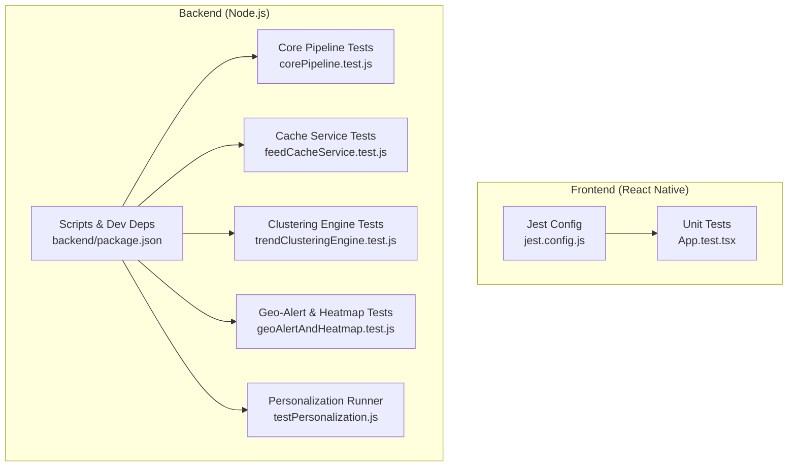

**Diagram sources**
- [jest.config.js:1-4](file://AITrendTracker7/jest.config.js#L1-L4)
- [App.test.tsx:1-14](file://AITrendTracker7/__tests__/App.test.tsx#L1-L14)
- [package.json:1-45](file://backend/package.json#L1-L45)
- [corePipeline.test.js:1-961](file://backend/src/tests/corePipeline.test.js#L1-L961)
- [feedCacheService.test.js:1-177](file://backend/src/tests/feedCacheService.test.js#L1-L177)
- [trendClusteringEngine.test.js:1-388](file://backend/src/tests/trendClusteringEngine.test.js#L1-L388)
- [geoAlertAndHeatmap.test.js:1-232](file://backend/src/tests/geoAlertAndHeatmap.test.js#L1-L232)
- [testPersonalization.js:1-152](file://backend/src/tests/testPersonalization.js#L1-L152)

**Section sources**
- [jest.config.js:1-4](file://AITrendTracker7/jest.config.js#L1-L4)
- [App.test.tsx:1-14](file://AITrendTracker7/__tests__/App.test.tsx#L1-L14)
- [package.json:1-70](file://AITrendTracker7/package.json#L1-L70)
- [package.json:1-45](file://backend/package.json#L1-L45)

## Core Components
- Frontend testing framework: Jest with React Native preset.
- Backend testing framework: Jest for unit and integration tests; a Node script for personalization validation.
- Real-time communication: Socket.IO with Redis adapter for multi-instance broadcasting.
- Background jobs: BullMQ-based workers and scheduled tasks.
- AI services: OpenAI/Gemini clients integrated via services; validated with deterministic tests and schema enforcement.
- Database: MongoDB via Mongoose; tested with model mocks and lean queries.

**Section sources**
- [jest.config.js:1-4](file://AITrendTracker7/jest.config.js#L1-L4)
- [package.json:1-70](file://AITrendTracker7/package.json#L1-L70)
- [package.json:1-45](file://backend/package.json#L1-L45)
- [socketService.js:1-107](file://backend/src/services/socketService.js#L1-L107)
- [socketAdapter.js:1-22](file://backend/src/services/socketAdapter.js#L1-L22)

## Architecture Overview
The testing architecture aligns with a layered pyramid:
- Unit tests: Pure-function logic, schema validation, and service computations.
- Integration tests: External dependencies (Redis, MongoDB), AI services, and real-time channels.
- End-to-end tests: Not present in the repository; recommended for critical flows (e.g., login, feed consumption, alerts).

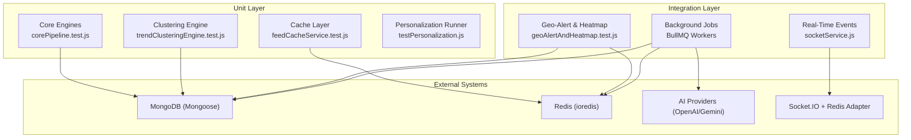

**Diagram sources**
- [corePipeline.test.js:1-961](file://backend/src/tests/corePipeline.test.js#L1-L961)
- [trendClusteringEngine.test.js:1-388](file://backend/src/tests/trendClusteringEngine.test.js#L1-L388)
- [feedCacheService.test.js:1-177](file://backend/src/tests/feedCacheService.test.js#L1-L177)
- [geoAlertAndHeatmap.test.js:1-232](file://backend/src/tests/geoAlertAndHeatmap.test.js#L1-L232)
- [socketService.js:1-107](file://backend/src/services/socketService.js#L1-L107)
- [socketAdapter.js:1-22](file://backend/src/services/socketAdapter.js#L1-L22)

## Detailed Component Analysis

### Frontend Testing (React Native)
- Jest configuration uses the React Native preset.
- A minimal render test ensures the root App component mounts without throwing.
- Recommended patterns:
  - Snapshot tests for stable UI trees.
  - Mock navigation and Redux providers for isolated component tests.
  - Use act wrappers for async rendering updates.

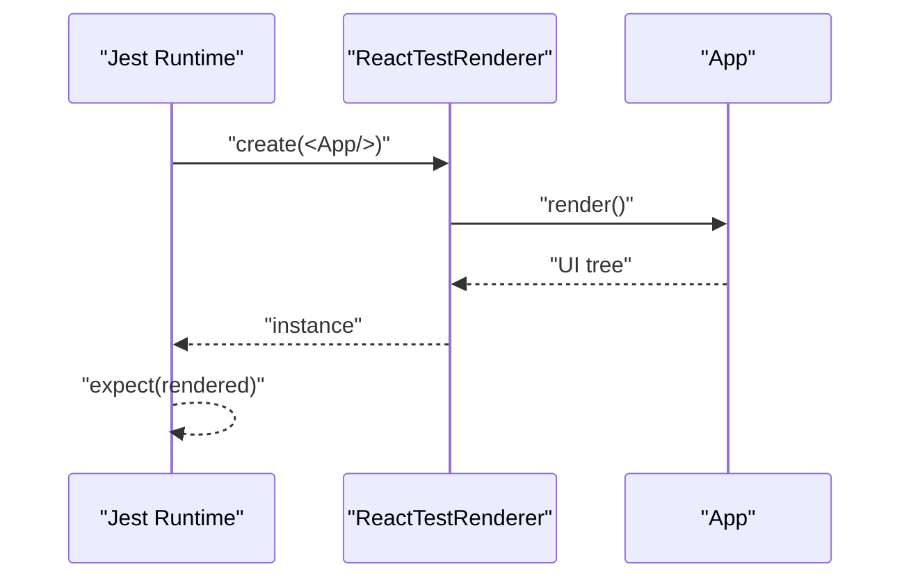

**Diagram sources**
- [jest.config.js:1-4](file://AITrendTracker7/jest.config.js#L1-L4)
- [App.test.tsx:1-14](file://AITrendTracker7/__tests__/App.test.tsx#L1-L14)

**Section sources**
- [jest.config.js:1-4](file://AITrendTracker7/jest.config.js#L1-L4)
- [App.test.tsx:1-14](file://AITrendTracker7/__tests__/App.test.tsx#L1-L14)
- [package.json:1-70](file://AITrendTracker7/package.json#L1-L70)

### Backend Testing Execution Environments
- Scripts:
  - Frontend: npm/yarn test runs Jest in watch mode.
  - Backend: npm/yarn test runs Jest with verbose output and forced exit.
- Dependencies:
  - Frontend: Jest, React, React Native, React Test Renderer.
  - Backend: Jest, BullMQ, Socket.IO, ioredis, mongoose, OpenAI/Gemini, Winston logging.

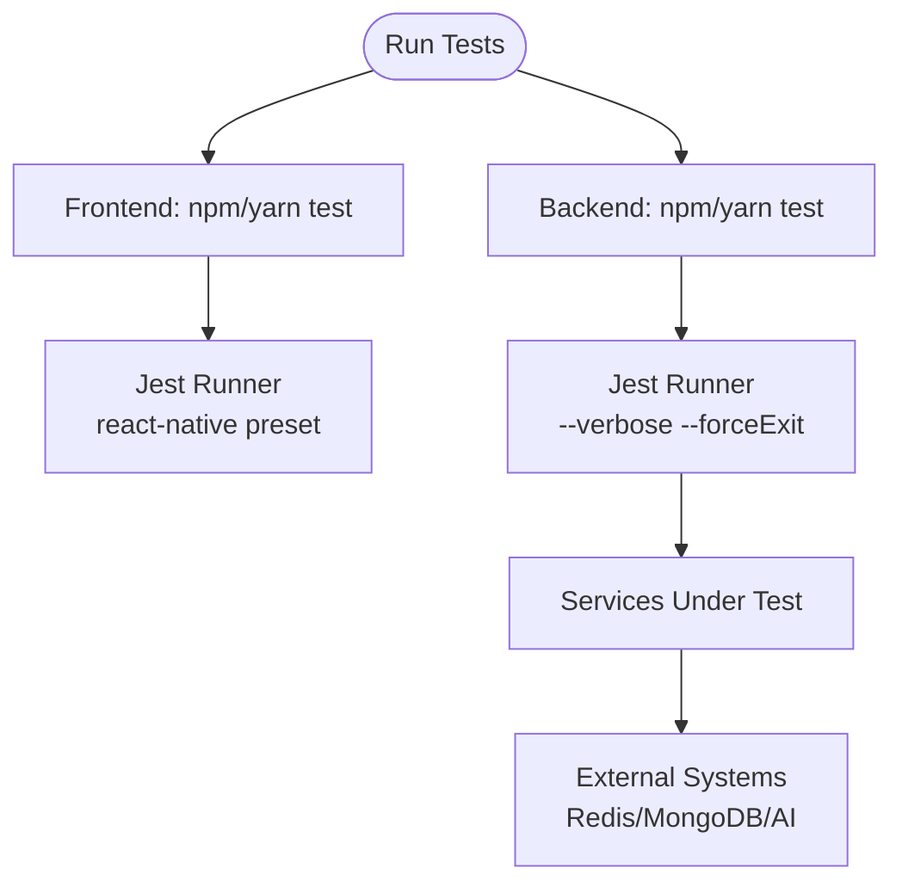

**Diagram sources**
- [package.json:1-70](file://AITrendTracker7/package.json#L1-L70)
- [package.json:1-45](file://backend/package.json#L1-L45)

**Section sources**
- [package.json:1-70](file://AITrendTracker7/package.json#L1-L70)
- [package.json:1-45](file://backend/package.json#L1-L45)

### Core Pipeline Integration Tests
- Scope: TrendScoreEngine, TrendModerationService, AIOptimizationService, Zod schema validation, AIAnalyticsService coercion, GeoProfileService, GeoTrendEngine, RecommendationEngine, PlatformFusionEngine, GraphEngine, TrendPredictionEngine (lifecycle, historical memory, confidence calibration, geopolitical migration).
- Approach: Deterministic synthetic data; pure computation tests; schema enforcement; lifecycle state transitions; confidence math; regional migration predictions.
- Coverage focus: Mathematical correctness, thresholds, and cross-service orchestration without DB calls.

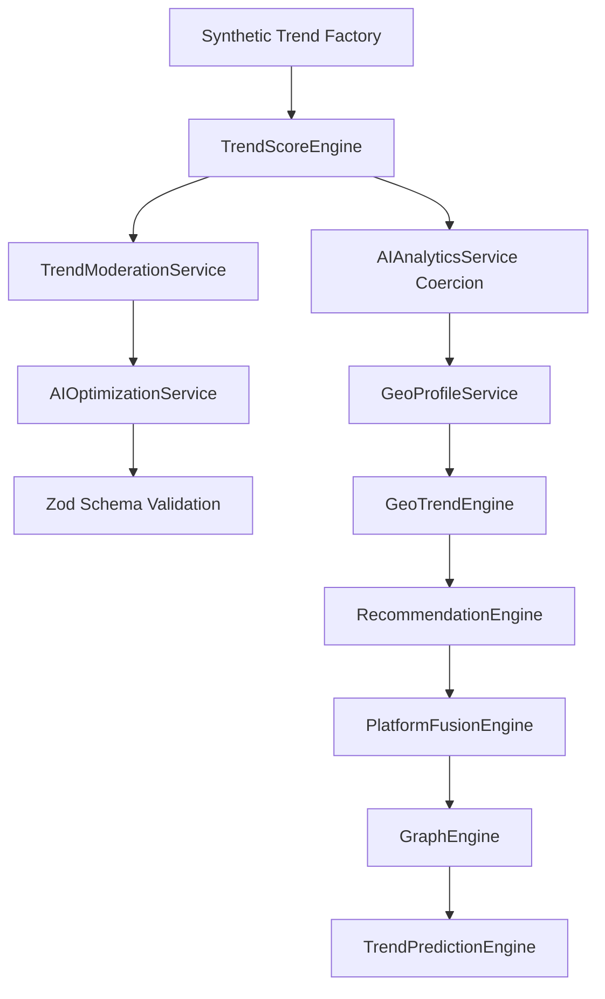

**Diagram sources**
- [corePipeline.test.js:1-961](file://backend/src/tests/corePipeline.test.js#L1-L961)

**Section sources**
- [corePipeline.test.js:1-961](file://backend/src/tests/corePipeline.test.js#L1-L961)

### Feed Cache Service Tests (Redis)
- Scope: Multi-tenant cache key generation, cache retrieval/set/invalidation, adaptive diversity overrides, skip counters, and TTL handling.
- Strategy: Mock ioredis and logger; simulate scan streams and error conditions; validate TTL and key normalization.

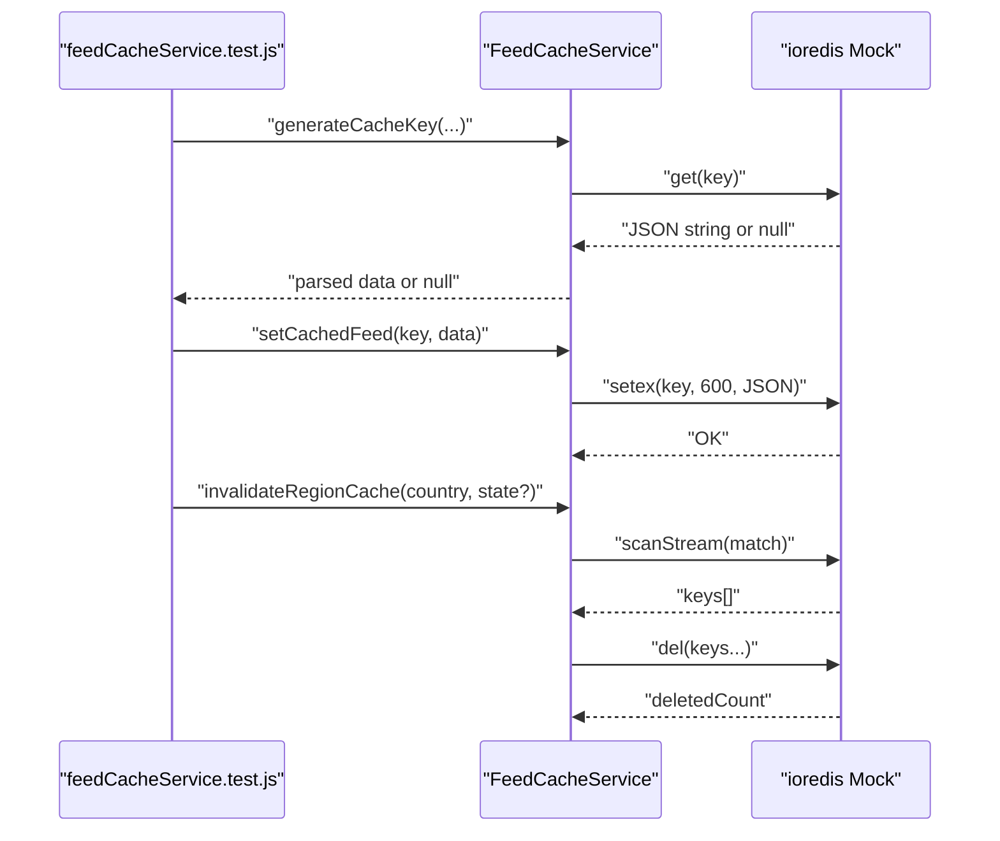

**Diagram sources**
- [feedCacheService.test.js:1-177](file://backend/src/tests/feedCacheService.test.js#L1-L177)

**Section sources**
- [feedCacheService.test.js:1-177](file://backend/src/tests/feedCacheService.test.js#L1-L177)

### Trend Clustering Engine Tests (Pure Computation + Model Mocks)
- Scope: Keyword extraction, overlap computation, clustering thresholds, geo-anomaly detection, anomaly firewall quarantine, and full pipeline processing.
- Strategy: Mock Mongoose models and cache service; synthetic trends; assert clustering and quarantine outcomes.

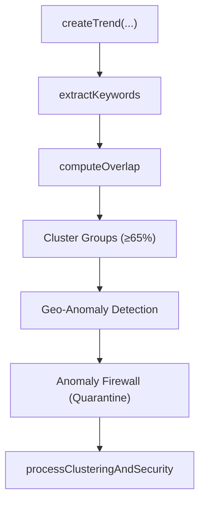

**Diagram sources**
- [trendClusteringEngine.test.js:1-388](file://backend/src/tests/trendClusteringEngine.test.js#L1-L388)

**Section sources**
- [trendClusteringEngine.test.js:1-388](file://backend/src/tests/trendClusteringEngine.test.js#L1-L388)

### Geo-Alert & Heatmap Tests (Integration)
- Scope: Geo-trend scanning, mild/major breakout classification, FCM throttling, dynamic geocoding fallback, Redis caching for heatmaps.
- Strategy: Mock models (Trend, User, Notification), cache service, alert service, and socket service; validate notifications and event emissions.

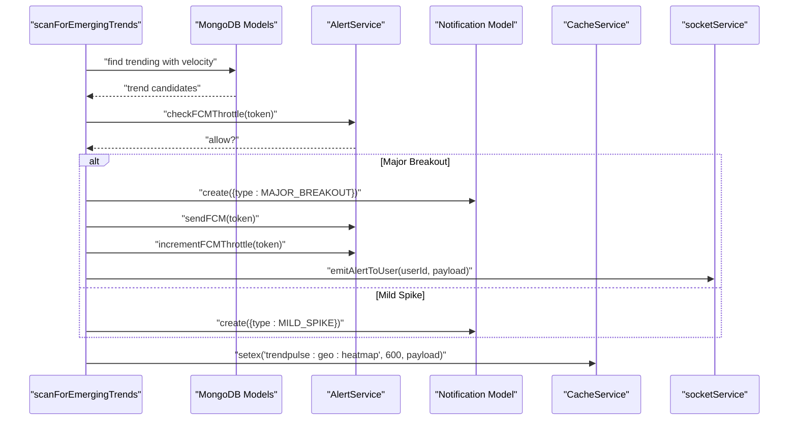

**Diagram sources**
- [geoAlertAndHeatmap.test.js:1-232](file://backend/src/tests/geoAlertAndHeatmap.test.js#L1-L232)
- [socketService.js:1-107](file://backend/src/services/socketService.js#L1-L107)

**Section sources**
- [geoAlertAndHeatmap.test.js:1-232](file://backend/src/tests/geoAlertAndHeatmap.test.js#L1-L232)
- [socketService.js:1-107](file://backend/src/services/socketService.js#L1-L107)

### Personalization Engine Runner (Standalone)
- Scope: Validates personalization logic with a custom test harness; demonstrates interest boosting, source filtering, sorting, and safety checks.
- Strategy: Console-based assertions; exits with failure code on any failing assertion.

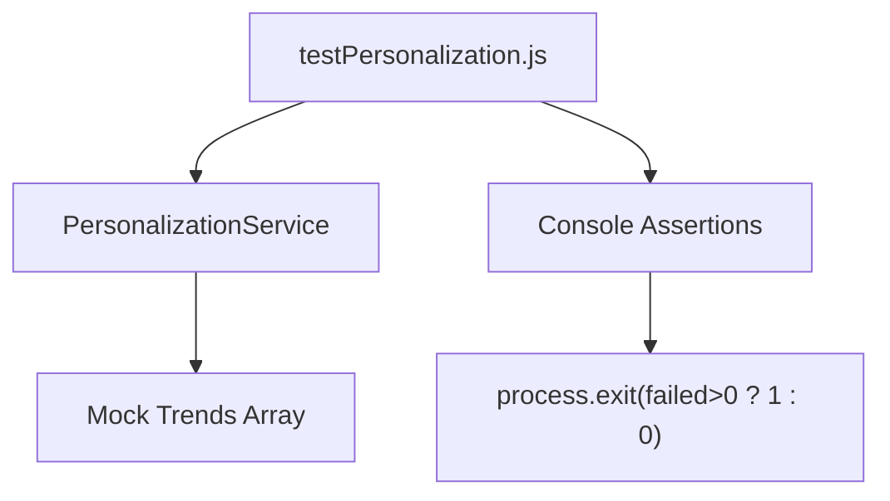

**Diagram sources**
- [testPersonalization.js:1-152](file://backend/src/tests/testPersonalization.js#L1-L152)

**Section sources**
- [testPersonalization.js:1-152](file://backend/src/tests/testPersonalization.js#L1-L152)

### Real-Time Communication Testing Patterns
- Socket.IO initialization and rooms:
  - Join user-specific rooms and emit targeted alerts.
  - Global and per-user broadcasts for priority signals.
- Redis adapter:
  - Horizontal scaling via pub/sub; graceful fallback when unavailable.
- Testing approach:
  - Mock Socket.IO server and adapter.
  - Verify room joins, event emissions, and error logging paths.
  - Validate multi-instance broadcast consistency indirectly via adapter creation and error handling.

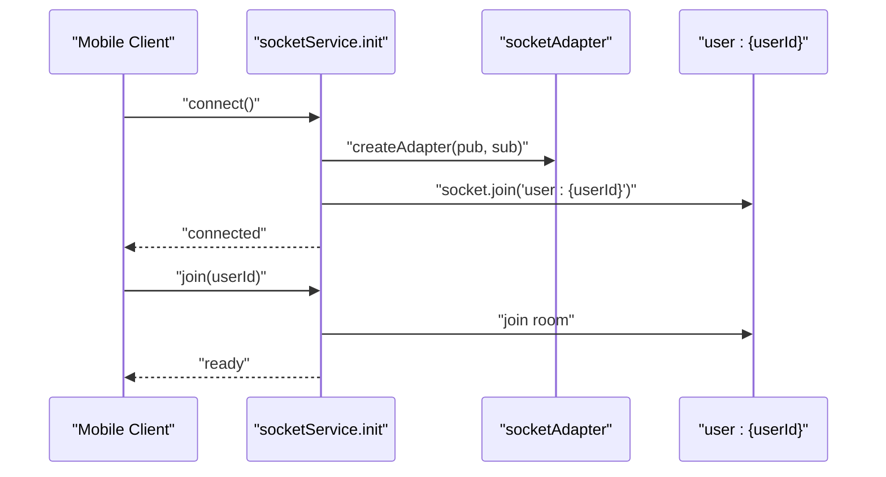

**Diagram sources**
- [socketService.js:1-107](file://backend/src/services/socketService.js#L1-L107)
- [socketAdapter.js:1-22](file://backend/src/services/socketAdapter.js#L1-L22)

**Section sources**
- [socketService.js:1-107](file://backend/src/services/socketService.js#L1-L107)
- [socketAdapter.js:1-22](file://backend/src/services/socketAdapter.js#L1-L22)

### Background Jobs and Workers
- Workers:
  - AI enrichment worker and trend aggregation worker.
  - Queues powered by BullMQ; Redis transport.
- Testing approach:
  - Isolate worker logic with queue mocks.
  - Validate job processing, retries, and persistence.
  - Use deterministic inputs and assert emitted events or DB updates.

[No sources needed since this section provides general guidance]

### Mocking Strategies
- External dependencies:
  - ioredis: Mock constructor and methods (get/set/del/incr/expire/scanStream).
  - Mongoose models: Mock find/sort/limit/update/aggregate/lean/bulkWrite.
  - Cache service: Mock get/setex.
  - Alert service: Mock FCM throttle checks and sends.
  - Logger service: Mock info/warn/error.
  - Socket service: Mock emit functions.
- AI services:
  - Use deterministic synthetic inputs and outputs.
  - Validate schema enforcement and fallback enrichment.
- Database operations:
  - Prefer lean queries and bulk writes in tests.
  - Avoid real DB connections by mocking models.

**Section sources**
- [feedCacheService.test.js:1-177](file://backend/src/tests/feedCacheService.test.js#L1-L177)
- [trendClusteringEngine.test.js:1-388](file://backend/src/tests/trendClusteringEngine.test.js#L1-L388)
- [geoAlertAndHeatmap.test.js:1-232](file://backend/src/tests/geoAlertAndHeatmap.test.js#L1-L232)

### Test Coverage Requirements
- Target: Maintain high coverage for core engines and services (>80% line/branch).
- Priorities:
  - Core computation engines (TrendPredictionEngine, GeoTrendEngine, PlatformFusionEngine).
  - Data validation (Zod schemas, coercion).
  - Real-time pathways (socket emissions, adapter behavior).
  - Cache and geo-alert flows.
- Tools: Jest coverage reporting; integrate with CI to enforce thresholds.

[No sources needed since this section provides general guidance]

### Continuous Integration Patterns
- Trigger: Run backend tests on pull requests and pushes to main.
- Steps:
  - Install dependencies.
  - Execute backend Jest suite with verbose output.
  - Optionally run frontend tests in CI.
- Artifacts: Store coverage reports and test logs.

**Section sources**
- [package.json:1-45](file://backend/package.json#L1-L45)

### Automated Testing Workflows
- Local development:
  - Frontend: jest (watch mode).
  - Backend: jest (single run with forceExit).
- CI:
  - Use scripts to run backend tests.
  - Parallelize suites if needed.
- Recommendations:
  - Add a lint-staged pre-commit hook to run tests locally.
  - Integrate coverage thresholds to gate merges.

**Section sources**
- [package.json:1-70](file://AITrendTracker7/package.json#L1-L70)
- [package.json:1-45](file://backend/package.json#L1-L45)

### Best Practices for Real-Time Communication
- Always initialize Socket.IO with Redis adapter in tests.
- Mock room joins and emits; assert correct payloads and timestamps.
- Validate graceful degradation when Redis is unavailable.
- Test multi-instance scenarios by verifying adapter creation and error logging.

**Section sources**
- [socketService.js:1-107](file://backend/src/services/socketService.js#L1-L107)
- [socketAdapter.js:1-22](file://backend/src/services/socketAdapter.js#L1-L22)

### Best Practices for Background Jobs
- Mock BullMQ queue and worker logic.
- Validate job scheduling, retries, and persistence.
- Assert emitted events and downstream effects (notifications, cache updates).

[No sources needed since this section provides general guidance]

### Mobile-Specific Scenarios
- Rendering stability: Snapshot tests for critical views.
- Navigation and state: Mock navigation and Redux providers.
- Network and offline: Test offline banner and retry logic.
- Haptics and gestures: Unit-test logic without native bridges.

[No sources needed since this section provides general guidance]

### Performance Testing Approaches
- Load testing:
  - Use synthetic trend batches to measure throughput of clustering and prediction engines.
  - Benchmark Redis operations (cache hit rates, TTLs).
- Stress testing:
  - Simulate high-frequency socket emissions and validate adapter scalability.
- Regression testing:
  - Maintain deterministic fixtures and assert mathematical thresholds.

[No sources needed since this section provides general guidance]

### Regression Testing Methodologies
- Keep deterministic fixtures (synthetic trends) to reproduce edge cases.
- Version Zod schemas and validation logic; assert rejection of malformed outputs.
- Track breaking changes in AI enrichment fallbacks and prediction thresholds.

**Section sources**
- [corePipeline.test.js:1-961](file://backend/src/tests/corePipeline.test.js#L1-L961)

### Guidelines for Writing Maintainable Tests
- Descriptive test names and focused assertions.
- Centralize synthetic data factories.
- Prefer deterministic mocks over flaky network calls.
- Group related tests by describe blocks; use beforeEach to reset mocks.
- Document assumptions and edge cases explicitly.

[No sources needed since this section provides general guidance]

### Debugging Test Failures
- Enable verbose output in Jest for backend tests.
- Use console logs sparingly; rely on assertion messages.
- Isolate failing suites and run them individually.
- Verify mock setups and ensure no state leaks between tests.

**Section sources**
- [package.json:1-45](file://backend/package.json#L1-L45)

## Dependency Analysis
- Frontend depends on React Native and Jest for UI rendering tests.
- Backend depends on Jest, BullMQ, Socket.IO, ioredis, mongoose, and AI SDKs.
- Real-time and background systems depend on Redis; database on MongoDB.

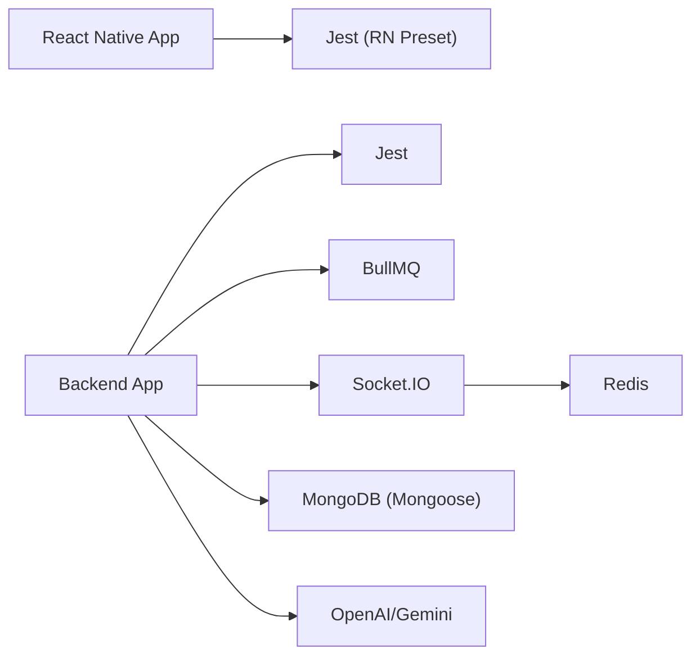

**Diagram sources**
- [package.json:1-70](file://AITrendTracker7/package.json#L1-L70)
- [package.json:1-45](file://backend/package.json#L1-L45)

**Section sources**
- [package.json:1-70](file://AITrendTracker7/package.json#L1-L70)
- [package.json:1-45](file://backend/package.json#L1-L45)

## Performance Considerations
- Favor deterministic tests over network-bound ones.
- Use lightweight mocks for Redis and MongoDB.
- Validate mathematical thresholds and early exits to reduce computation time.
- Cache warm-up in tests to avoid cold-start penalties.

[No sources needed since this section provides general guidance]

## Troubleshooting Guide
- Jest timeouts or hanging processes:
  - Use forceExit in backend Jest scripts.
  - Clear timers and mocks between tests.
- Socket.IO adapter errors:
  - Expect graceful fallback when Redis is unavailable.
  - Verify adapter creation and error logs.
- Redis connectivity:
  - Ensure ioredis mocks return expected values.
  - Validate TTL and key normalization.

**Section sources**
- [package.json:1-45](file://backend/package.json#L1-L45)
- [socketAdapter.js:1-22](file://backend/src/services/socketAdapter.js#L1-L22)
- [feedCacheService.test.js:1-177](file://backend/src/tests/feedCacheService.test.js#L1-L177)

## Conclusion
AITrendTracker’s testing strategy emphasizes robust unit and integration tests across core engines, real-time pathways, and background jobs. By leveraging deterministic fixtures, comprehensive mocking, and schema-driven validations, the team can maintain reliability as the system scales. Extending to end-to-end tests and formalizing CI gates will further strengthen quality assurance.

## Appendices
- Example test references:
  - Frontend: [App.test.tsx:1-14](file://AITrendTracker7/__tests__/App.test.tsx#L1-L14)
  - Backend core: [corePipeline.test.js:1-961](file://backend/src/tests/corePipeline.test.js#L1-L961)
  - Cache layer: [feedCacheService.test.js:1-177](file://backend/src/tests/feedCacheService.test.js#L1-L177)
  - Clustering: [trendClusteringEngine.test.js:1-388](file://backend/src/tests/trendClusteringEngine.test.js#L1-L388)
  - Geo-alerts: [geoAlertAndHeatmap.test.js:1-232](file://backend/src/tests/geoAlertAndHeatmap.test.js#L1-L232)
  - Personalization: [testPersonalization.js:1-152](file://backend/src/tests/testPersonalization.js#L1-L152)
  - Real-time: [socketService.js:1-107](file://backend/src/services/socketService.js#L1-L107), [socketAdapter.js:1-22](file://backend/src/services/socketAdapter.js#L1-L22)
  - Data access: [trendService.js:1-64](file://backend/src/services/trendService.js#L1-L64)