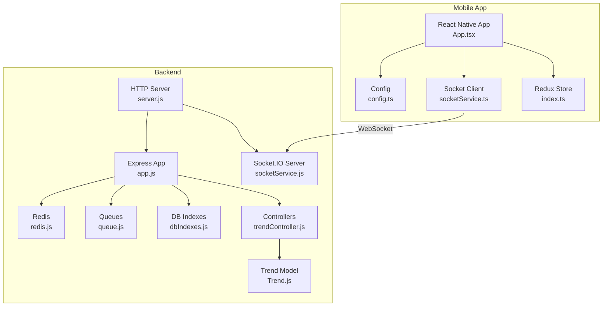
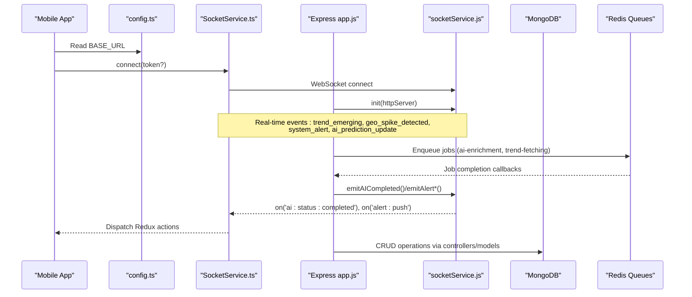
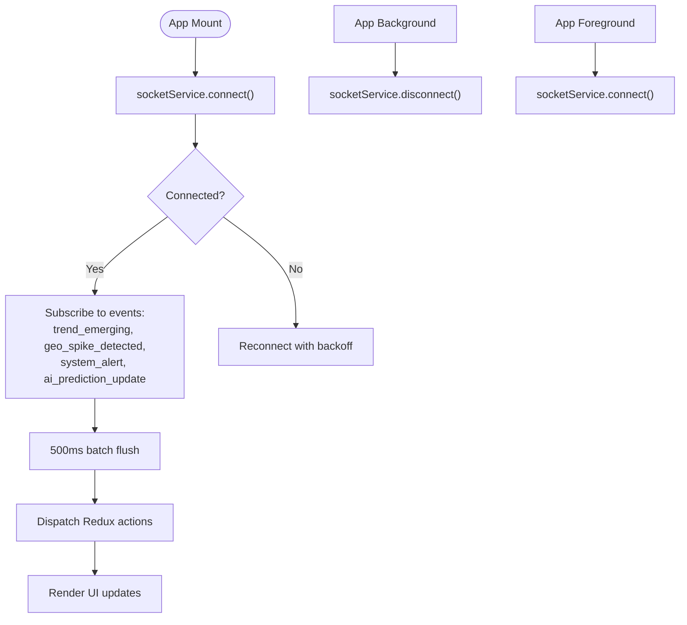
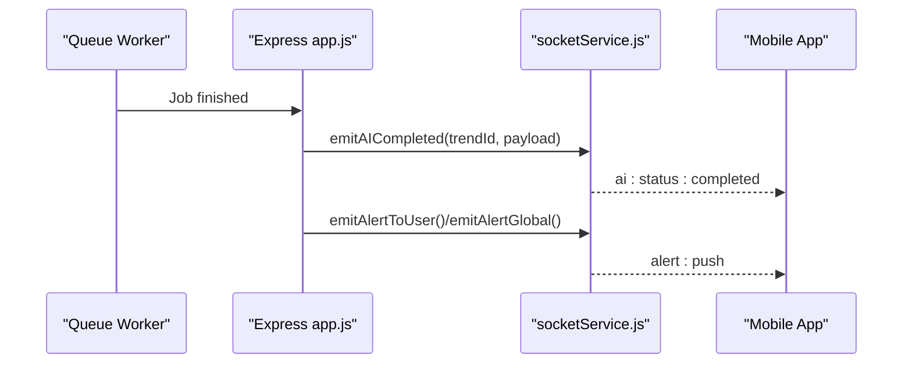
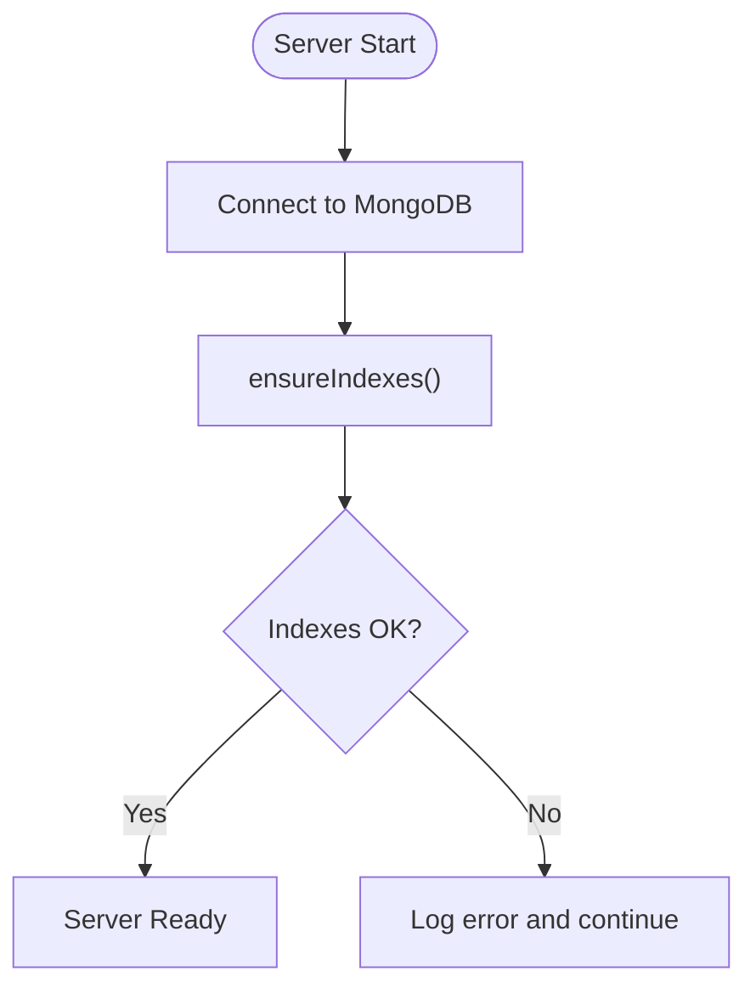
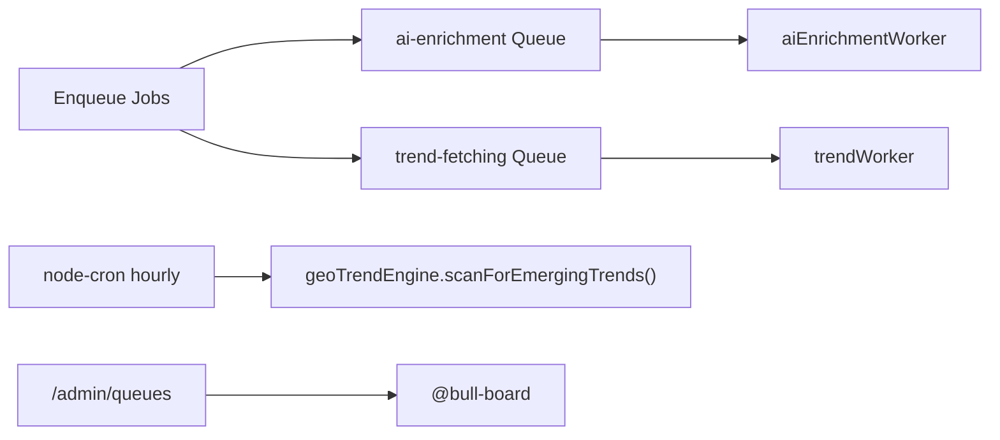
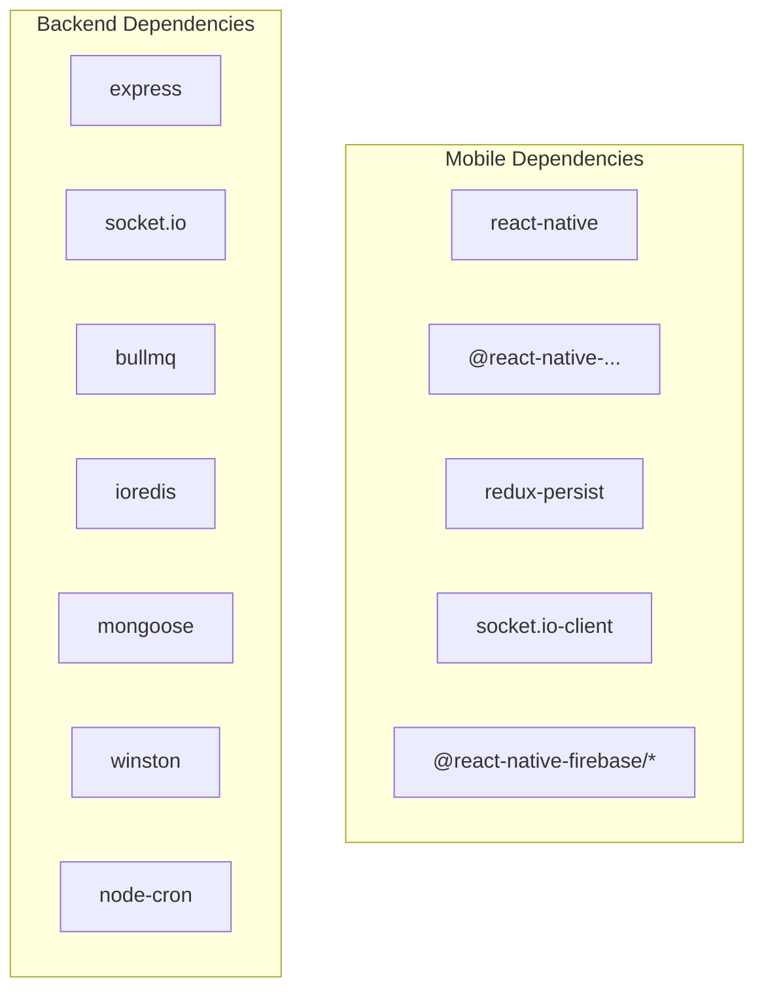

# Troubleshooting and FAQ

<cite>
**Referenced Files in This Document**
- [package.json](file://AITrendTracker7/package.json)
- [android/app/build.gradle](file://AITrendTracker7/android/app/build.gradle)
- [ios/Podfile](file://AITrendTracker7/ios/Podfile)
- [App.tsx](file://AITrendTracker7/App.tsx)
- [socketService.ts](file://AITrendTracker7/src/services/socketService.ts)
- [config.ts](file://AITrendTracker7/src/utils/config.ts)
- [index.ts](file://AITrendTracker7/src/store/index.ts)
- [server.js](file://backend/server.js)
- [app.js](file://backend/src/app.js)
- [socketService.js](file://backend/src/services/socketService.js)
- [redis.js](file://backend/src/config/redis.js)
- [queue.js](file://backend/src/config/queue.js)
- [dbIndexes.js](file://backend/src/config/dbIndexes.js)
- [Trend.js](file://backend/src/models/Trend.js)
- [trendController.js](file://backend/src/controllers/trendController.js)
- [google-services.json](file://AITrendTracker7/android/app/google-services.json)
</cite>

## Table of Contents
1. [Introduction](#introduction)
2. [Project Structure](#project-structure)
3. [Core Components](#core-components)
4. [Architecture Overview](#architecture-overview)
5. [Detailed Component Analysis](#detailed-component-analysis)
6. [Dependency Analysis](#dependency-analysis)
7. [Performance Considerations](#performance-considerations)
8. [Troubleshooting Guide](#troubleshooting-guide)
9. [Conclusion](#conclusion)
10. [Appendices](#appendices)

## Introduction
This document provides comprehensive troubleshooting guidance and FAQs for AITrendTracker. It covers development setup issues, runtime problems, debugging techniques, diagnostics, monitoring, and known limitations. The goal is to help developers and operators quickly diagnose and resolve common issues across the mobile app, backend services, real-time communication, AI integrations, and background jobs.

## Project Structure
AITrendTracker consists of:
- Mobile app (React Native): Real-time feed, offline banner, Redux store, navigation, Firebase integration, and Socket.IO client.
- Backend (Node.js/Express): REST API, WebSocket server, Redis queues (BullMQ), MongoDB via Mongoose, cron jobs, and admin queue dashboard.

**Diagram sources**
- [App.tsx:15-59](file://AITrendTracker7/App.tsx#L15-L59)
- [config.ts:5-7](file://AITrendTracker7/src/utils/config.ts#L5-L7)
- [socketService.ts:17-106](file://AITrendTracker7/src/services/socketService.ts#L17-L106)
- [index.ts:32-42](file://AITrendTracker7/src/store/index.ts#L32-L42)
- [server.js:14-46](file://backend/server.js#L14-L46)
- [app.js:24-85](file://backend/src/app.js#L24-L85)
- [socketService.js:20-55](file://backend/src/services/socketService.js#L20-L55)
- [redis.js:4-18](file://backend/src/config/redis.js#L4-L18)
- [queue.js:5-31](file://backend/src/config/queue.js#L5-L31)
- [dbIndexes.js:13-28](file://backend/src/config/dbIndexes.js#L13-L28)
- [Trend.js:45-172](file://backend/src/models/Trend.js#L45-L172)
- [trendController.js:16-407](file://backend/src/controllers/trendController.js#L16-L407)

**Section sources**
- [package.json:1-70](file://AITrendTracker7/package.json#L1-L70)
- [android/app/build.gradle:76-109](file://AITrendTracker7/android/app/build.gradle#L76-L109)
- [ios/Podfile:17-34](file://AITrendTracker7/ios/Podfile#L17-L34)
- [App.tsx:15-59](file://AITrendTracker7/App.tsx#L15-L59)
- [config.ts:5-7](file://AITrendTracker7/src/utils/config.ts#L5-L7)
- [socketService.ts:17-106](file://AITrendTracker7/src/services/socketService.ts#L17-L106)
- [index.ts:32-42](file://AITrendTracker7/src/store/index.ts#L32-L42)
- [server.js:14-46](file://backend/server.js#L14-L46)
- [app.js:24-85](file://backend/src/app.js#L24-L85)
- [socketService.js:20-55](file://backend/src/services/socketService.js#L20-L55)
- [redis.js:4-18](file://backend/src/config/redis.js#L4-L18)
- [queue.js:5-31](file://backend/src/config/queue.js#L5-L31)
- [dbIndexes.js:13-28](file://backend/src/config/dbIndexes.js#L13-L28)
- [Trend.js:45-172](file://backend/src/models/Trend.js#L45-L172)
- [trendController.js:16-407](file://backend/src/controllers/trendController.js#L16-L407)

## Core Components
- Mobile app initialization connects to the backend via Socket.IO and manages connection lifecycle based on app state.
- Backend initializes HTTP server, Socket.IO server, MongoDB, Redis queues, and cron jobs.
- Real-time events are emitted from the backend and batched/dispached in the mobile app store.

Key integration points:
- Socket.IO client-server handshake and event routing.
- Base URL configuration for dev vs prod environments.
- Redux store persistence and selective slice whitelisting.

**Section sources**
- [App.tsx:18-41](file://AITrendTracker7/App.tsx#L18-L41)
- [socketService.ts:17-106](file://AITrendTracker7/src/services/socketService.ts#L17-L106)
- [config.ts:5-7](file://AITrendTracker7/src/utils/config.ts#L5-L7)
- [index.ts:14-18](file://AITrendTracker7/src/store/index.ts#L14-L18)
- [server.js:14-46](file://backend/server.js#L14-L46)
- [socketService.js:20-55](file://backend/src/services/socketService.js#L20-L55)

## Architecture Overview
High-level runtime flow:
- Mobile app boots, connects to Socket.IO, and listens for real-time events.
- Backend serves REST endpoints, emits real-time updates, and runs background workers and cron jobs.
- Redis queues handle asynchronous tasks; MongoDB stores trends and related analytics.

**Diagram sources**
- [config.ts:5-7](file://AITrendTracker7/src/utils/config.ts#L5-L7)
- [socketService.ts:17-106](file://AITrendTracker7/src/services/socketService.ts#L17-L106)
- [app.js:24-85](file://backend/src/app.js#L24-L85)
- [socketService.js:20-106](file://backend/src/services/socketService.js#L20-L106)
- [server.js:14-46](file://backend/server.js#L14-L46)
- [queue.js:5-31](file://backend/src/config/queue.js#L5-L31)
- [Trend.js:45-172](file://backend/src/models/Trend.js#L45-L172)

## Detailed Component Analysis

### Mobile App Real-Time Feed
- SocketService establishes a WebSocket connection with exponential backoff and auth token support.
- Events are batched to avoid UI thrashing during high-frequency updates.
- App lifecycle events reconnect on foreground and disconnect on background.

**Diagram sources**
- [App.tsx:18-41](file://AITrendTracker7/App.tsx#L18-L41)
- [socketService.ts:17-106](file://AITrendTracker7/src/services/socketService.ts#L17-L106)

**Section sources**
- [App.tsx:18-41](file://AITrendTracker7/App.tsx#L18-L41)
- [socketService.ts:17-106](file://AITrendTracker7/src/services/socketService.ts#L17-L106)

### Backend Real-Time Communication
- Socket.IO server initialized with CORS and ping intervals.
- Redis adapter enables multi-instance broadcasting.
- Dedicated emit helpers for AI completion and alerts.

**Diagram sources**
- [app.js:24-85](file://backend/src/app.js#L24-L85)
- [socketService.js:62-91](file://backend/src/services/socketService.js#L62-L91)

**Section sources**
- [socketService.js:20-106](file://backend/src/services/socketService.js#L20-L106)
- [app.js:24-85](file://backend/src/app.js#L24-L85)

### Database Connectivity and Indexes
- MongoDB connection established at server startup.
- Startup script ensures compound indexes exist for performance.
- Trend model defines extensive indexes for queries and analytics.

**Diagram sources**
- [server.js:17-22](file://backend/server.js#L17-L22)
- [dbIndexes.js:13-28](file://backend/src/config/dbIndexes.js#L13-L28)
- [Trend.js:174-185](file://backend/src/models/Trend.js#L174-L185)

**Section sources**
- [server.js:17-22](file://backend/server.js#L17-L22)
- [dbIndexes.js:13-28](file://backend/src/config/dbIndexes.js#L13-L28)
- [Trend.js:174-185](file://backend/src/models/Trend.js#L174-L185)

### Redis Queues and Background Jobs
- Two queues configured: ai-enrichment and trend-fetching with retry/backoff policies.
- Queue workers and cron jobs started at server boot.
- Admin dashboard protected by bearer token.

**Diagram sources**
- [queue.js:5-31](file://backend/src/config/queue.js#L5-L31)
- [server.js:34-44](file://backend/server.js#L34-L44)
- [app.js:33-57](file://backend/src/app.js#L33-L57)

**Section sources**
- [queue.js:5-31](file://backend/src/config/queue.js#L5-L31)
- [server.js:34-44](file://backend/server.js#L34-L44)
- [app.js:33-57](file://backend/src/app.js#L33-L57)

## Dependency Analysis
- Mobile app depends on React Native, Redux Toolkit, Socket.IO client, Firebase modules, and React Navigation.
- Backend depends on Express, Socket.IO, BullMQ, Redis, Mongoose, Winston, and cron.
- Android/iOS build configurations integrate native modules and Firebase.

**Diagram sources**
- [package.json:12-44](file://AITrendTracker7/package.json#L12-L44)
- [package.json:14-38](file://backend/package.json#L14-L38)

**Section sources**
- [package.json:12-44](file://AITrendTracker7/package.json#L12-L44)
- [package.json:14-38](file://backend/package.json#L14-L38)

## Performance Considerations
- Real-time batching: Mobile client batches incoming trends to reduce UI thrashing.
- Queue backoff: Exponential backoff for AI enrichment retries; fixed backoff for trend fetching.
- Index coverage: Extensive MongoDB indexes improve query performance for analytics and geospatial filters.
- Caching: Geo-personalized feeds leverage Redis caching with TTL to reduce DB load.
- Rate limiting: Express rate limiter middleware protects endpoints.

[No sources needed since this section provides general guidance]

## Troubleshooting Guide

### Development Setup Issues

- Build fails on Android with missing SDK or NDK
  - Symptom: Gradle build errors referencing SDK/NDK versions.
  - Resolution: Ensure Android Studio SDK/NDK versions match project ext properties; sync Gradle and install missing components.
  - Reference: [android/app/build.gradle:76-88](file://AITrendTracker7/android/app/build.gradle#L76-L88)

- iOS pods installation hangs or fails
  - Symptom: Pod install stuck or “use_native_modules!” errors.
  - Resolution: Clean derived data, delete Pods/ and Podfile.lock, run pod install again; verify minimum iOS version compatibility.
  - Reference: [ios/Podfile:17-34](file://AITrendTracker7/ios/Podfile#L17-L34)

- Android emulator cannot reach backend
  - Symptom: Network requests to backend fail in dev mode.
  - Resolution: Confirm BASE_URL points to 10.0.2.2 for Android emulator; backend runs on localhost:5000.
  - References:
    - [config.ts:5-7](file://AITrendTracker7/src/utils/config.ts#L5-L7)
    - [server.js:11](file://backend/server.js#L11)

- Missing google-services.json
  - Symptom: Firebase-related build errors on Android.
  - Resolution: Place google-services.json in android/app/ and rebuild.
  - Reference: [google-services.json:1-47](file://AITrendTracker7/android/app/google-services.json#L1-L47)

- Node version mismatch
  - Symptom: npm/yarn fails due to engine requirements.
  - Resolution: Use Node version satisfying engines requirement.
  - Reference: [package.json:66-68](file://AITrendTracker7/package.json#L66-L68)

**Section sources**
- [android/app/build.gradle:76-88](file://AITrendTracker7/android/app/build.gradle#L76-L88)
- [ios/Podfile:17-34](file://AITrendTracker7/ios/Podfile#L17-L34)
- [config.ts:5-7](file://AITrendTracker7/src/utils/config.ts#L5-L7)
- [server.js:11](file://backend/server.js#L11)
- [google-services.json:1-47](file://AITrendTracker7/android/app/google-services.json#L1-L47)
- [package.json:66-68](file://AITrendTracker7/package.json#L66-L68)

### Runtime Issues

- Socket.IO connection drops or reconnects frequently
  - Symptoms: Frequent disconnect/connect logs, UI not updating.
  - Checks:
    - Verify BASE_URL correctness and network accessibility.
    - Inspect mobile logs for connect_error messages.
    - Confirm backend Socket.IO initialization and Redis adapter availability.
  - Actions:
    - Restart backend to reinitialize Socket.IO.
    - Increase reconnection delays cautiously in development.
  - References:
    - [socketService.ts:17-43](file://AITrendTracker7/src/services/socketService.ts#L17-L43)
    - [socketService.js:20-55](file://backend/src/services/socketService.js#L20-L55)

- Real-time events not received on mobile
  - Symptoms: No live trend updates despite backend emitting.
  - Checks:
    - Ensure user rooms are joined and userId is valid.
    - Validate event names match client subscriptions.
  - References:
    - [socketService.js:41-51](file://backend/src/services/socketService.js#L41-L51)
    - [socketService.ts:46-67](file://AITrendTracker7/src/services/socketService.ts#L46-L67)

- Backend responds 500 with unhandled error
  - Symptoms: Internal Server Error responses.
  - Actions:
    - Review backend logs for error stack traces.
    - Check error handling middleware in Express app.
  - Reference: [app.js:82-85](file://backend/src/app.js#L82-L85)

- Health check fails
  - Symptoms: GET /health returns error.
  - Actions:
    - Confirm server is listening on configured port.
    - Verify environment variables and DB connection.
  - Reference: [app.js:24-26](file://backend/src/app.js#L24-L26)

**Section sources**
- [socketService.ts:17-43](file://AITrendTracker7/src/services/socketService.ts#L17-L43)
- [socketService.js:20-55](file://backend/src/services/socketService.js#L20-L55)
- [socketService.ts:46-67](file://AITrendTracker7/src/services/socketService.ts#L46-L67)
- [app.js:24-26](file://backend/src/app.js#L24-L26)
- [app.js:82-85](file://backend/src/app.js#L82-L85)

### Database Connectivity Issues

- MongoDB connection failure at startup
  - Symptoms: MongoDB connection error logged.
  - Actions:
    - Verify MONGO_URI in environment.
    - Ensure MongoDB is reachable from host/port.
    - Check credentials and network ACLs.
  - Reference: [server.js:17-18](file://backend/server.js#L17-L18)

- Index creation/validation errors
  - Symptoms: Index creation errors on startup.
  - Actions:
    - Review ensureIndexes logs.
    - Manually verify collection indexes if needed.
  - Reference: [dbIndexes.js:13-28](file://backend/src/config/dbIndexes.js#L13-L28)

- Slow queries in analytics endpoints
  - Symptoms: Delays in /api/trends/:id/analytics or similar.
  - Actions:
    - Confirm appropriate indexes exist for query patterns.
    - Use aggregation pipeline optimizations.
  - Reference: [Trend.js:174-185](file://backend/src/models/Trend.js#L174-L185)

**Section sources**
- [server.js:17-18](file://backend/server.js#L17-L18)
- [dbIndexes.js:13-28](file://backend/src/config/dbIndexes.js#L13-L28)
- [Trend.js:174-185](file://backend/src/models/Trend.js#L174-L185)

### AI Service Integration Problems

- AI enrichment jobs failing repeatedly
  - Symptoms: Jobs retry with exponential backoff; failed jobs accumulate.
  - Actions:
    - Inspect Redis connectivity and queue worker logs.
    - Validate external AI service credentials and quotas.
    - Check removeOnFail retention for debugging.
  - References:
    - [queue.js:5-16](file://backend/src/config/queue.js#L5-L16)
    - [redis.js:4-18](file://backend/src/config/redis.js#L4-L18)

- Real-time AI status not reflected on mobile
  - Symptoms: AI completion events not received.
  - Actions:
    - Confirm emitAICompleted is invoked after job completion.
    - Verify Socket.IO Redis adapter is active.
  - References:
    - [socketService.js:62-69](file://backend/src/services/socketService.js#L62-L69)
    - [socketService.js:30-36](file://backend/src/services/socketService.js#L30-L36)

**Section sources**
- [queue.js:5-16](file://backend/src/config/queue.js#L5-L16)
- [redis.js:4-18](file://backend/src/config/redis.js#L4-L18)
- [socketService.js:62-69](file://backend/src/services/socketService.js#L62-L69)
- [socketService.js:30-36](file://backend/src/services/socketService.js#L30-L36)

### Background Job Failures

- Queue workers not processing jobs
  - Symptoms: Jobs remain in waiting/incomplete indefinitely.
  - Actions:
    - Confirm Redis is reachable and alive.
    - Check worker process logs for exceptions.
    - Validate queue names and default job options.
  - References:
    - [queue.js:18-26](file://backend/src/config/queue.js#L18-L26)
    - [redis.js:4-18](file://backend/src/config/redis.js#L4-L18)

- Cron-based geo scan not running
  - Symptoms: Hourly emerging trend scan not triggered.
  - Actions:
    - Verify cron schedule expression and timezone.
    - Check server logs around the hour.
  - Reference: [server.js:40-44](file://backend/server.js#L40-L44)

**Section sources**
- [queue.js:18-26](file://backend/src/config/queue.js#L18-L26)
- [redis.js:4-18](file://backend/src/config/redis.js#L4-L18)
- [server.js:40-44](file://backend/server.js#L40-L44)

### Data Synchronization Errors

- Trend comparison or retrieval returns not found
  - Symptoms: 404 when fetching trend by id or comparing trends.
  - Actions:
    - Verify trendId format and existence in DB.
    - Check controller validations and model field uniqueness.
  - References:
    - [trendController.js:81-89](file://backend/src/controllers/trendController.js#L81-L89)
    - [trendController.js:67-79](file://backend/src/controllers/trendController.js#L67-L79)
    - [Trend.js:45-46](file://backend/src/models/Trend.js#L45-L46)

- Personalized feed returns generic content
  - Symptoms: personalized=false or fallback feed.
  - Actions:
    - Confirm user exists and has interests/preferences.
    - Validate personalization service integration.
  - Reference: [trendController.js:142-190](file://backend/src/controllers/trendController.js#L142-L190)

**Section sources**
- [trendController.js:81-89](file://backend/src/controllers/trendController.js#L81-L89)
- [trendController.js:67-79](file://backend/src/controllers/trendController.js#L67-L79)
- [Trend.js:45-46](file://backend/src/models/Trend.js#L45-L46)
- [trendController.js:142-190](file://backend/src/controllers/trendController.js#L142-L190)

### Debugging Techniques

- Mobile app debugging
  - Enable Flipper or Chrome debugging for React Native.
  - Monitor Socket.IO client logs for connect/disconnect/connect_error.
  - Inspect Redux store state and persistence behavior.
  - References:
    - [App.tsx:18-41](file://AITrendTracker7/App.tsx#L18-L41)
    - [socketService.ts:17-43](file://AITrendTracker7/src/services/socketService.ts#L17-L43)
    - [index.ts:14-18](file://AITrendTracker7/src/store/index.ts#L14-L18)

- Backend debugging
  - Use nodemon for dev restarts; inspect Morgan logs for request traces.
  - Add targeted console logs around controllers and services.
  - Validate environment variables via dotenv.
  - References:
    - [server.js:1-11](file://backend/server.js#L1-L11)
    - [app.js:10-14](file://backend/src/app.js#L10-L14)

- Real-time debugging
  - Use Socket.IO admin dashboard (/admin/queues) with ADMIN_SECRET.
  - Monitor Redis keys and queue lengths.
  - References:
    - [app.js:33-57](file://backend/src/app.js#L33-L57)
    - [redis.js:4-18](file://backend/src/config/redis.js#L4-L18)

- Logging and monitoring
  - Winston daily rotate file transport is configured; review log files for errors.
  - Use health check endpoint for uptime verification.
  - References:
    - [app.js:24-26](file://backend/src/app.js#L24-L26)

**Section sources**
- [App.tsx:18-41](file://AITrendTracker7/App.tsx#L18-L41)
- [socketService.ts:17-43](file://AITrendTracker7/src/services/socketService.ts#L17-L43)
- [index.ts:14-18](file://AITrendTracker7/src/store/index.ts#L14-L18)
- [server.js:1-11](file://backend/server.js#L1-11)
- [app.js:10-14](file://backend/src/app.js#L10-L14)
- [app.js:33-57](file://backend/src/app.js#L33-L57)
- [redis.js:4-18](file://backend/src/config/redis.js#L4-L18)
- [app.js:24-26](file://backend/src/app.js#L24-L26)

### Known Limitations and Workarounds

- Single-instance Socket.IO without Redis adapter
  - Symptom: Broadcasts inconsistent across instances.
  - Workaround: Ensure Redis adapter is reachable; otherwise, run a single backend instance temporarily.
  - Reference: [socketService.js:30-36](file://backend/src/services/socketService.js#L30-L36)

- Production base URL hard-coded in dev
  - Symptom: Mobile cannot reach production backend.
  - Fix: Change BASE_URL to production URL in production builds.
  - Reference: [config.ts:5-7](file://AITrendTracker7/src/utils/config.ts#L5-L7)

- Redis maxRetriesPerRequest null requirement
  - Symptom: BullMQ operations fail under load.
  - Fix: Keep maxRetriesPerRequest null as configured.
  - Reference: [redis.js:7](file://backend/src/config/redis.js#L7)

**Section sources**
- [socketService.js:30-36](file://backend/src/services/socketService.js#L30-L36)
- [config.ts:5-7](file://AITrendTracker7/src/utils/config.ts#L5-L7)
- [redis.js:7](file://backend/src/config/redis.js#L7)

### Community Resources, Support Channels, and Escalation

- Community resources
  - GitHub Discussions: Use repository discussions for peer support.
  - Stack Overflow: Tag with project-specific tags for targeted help.
  - Discord/Slack: Join project community channels for real-time assistance.

- Support channels
  - Email support: contact@aitrendtracker.dev
  - Issue templates: Use provided templates to report reproducible bugs with logs and steps.

- Escalation procedures
  - Severity triage:
    - P1: Auth failures, data loss, or complete service outage.
    - P2: Performance degradation or partial outages.
    - P3: UI glitches or minor UX issues.
  - Escalation path: Start with community channels; open a support ticket with logs and reproduction steps; attach screenshots and device info for mobile issues.

[No sources needed since this section doesn't analyze specific files]

## Conclusion
This guide consolidates actionable troubleshooting steps for AITrendTracker across development, runtime, database, real-time, AI, and background job domains. Use the referenced files and sections to quickly locate the relevant configuration and logic for diagnosis and fix.

## Appendices

### Diagnostic Commands and Checks

- Backend health and logs
  - Health check: curl http://localhost:5000/health
  - Logs: tail backend logs from Winston daily rotate file transport.

- Redis and queues
  - Redis connectivity: redis-cli ping
  - Queue status: visit /admin/queues with ADMIN_SECRET

- Mobile connectivity
  - Verify BASE_URL resolves inside emulator/device.
  - Check Socket.IO client logs for connect_error.

**Section sources**
- [app.js:24-26](file://backend/src/app.js#L24-L26)
- [redis.js:4-18](file://backend/src/config/redis.js#L4-L18)
- [app.js:33-57](file://backend/src/app.js#L33-L57)
- [config.ts:5-7](file://AITrendTracker7/src/utils/config.ts#L5-L7)