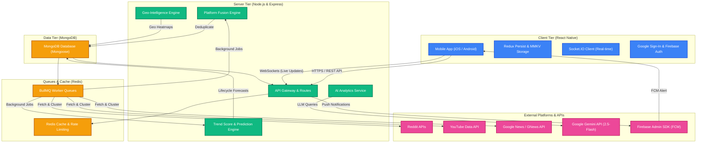

# ⚡ TrendPulse (AI Trend Tracker)

Welcome to **TrendPulse**, an enterprise-grade, real-time, AI-powered Trend Intelligence platform. TrendPulse ingests, clusters, de-duplicates, and analyzes trending topics from multiple global networks (Reddit, YouTube, and Google News), tracks their lifecycle (emerging, viral, declining), predicts their regional migration pathways with mathematical precision, and serves real-time insights to a beautiful glassmorphic React Native mobile application.

---

## 🗺️ System Architecture



---

## ✨ Key Features

### 💻 Backend Intelligence Server

1. **Cross-Platform Trend Fusion & Deduplication:**
   * Utilizes a **30-minute deduplication radar window** to detect semantic overlaps.
   * Performs Jaccard-like keyword overlap scanning (≥85% threshold) to merge raw feeds from YouTube, Reddit, and Google News into unified trend documents.
   * Applies a custom `crossPlatformMultiplier` (1.8x) to boost composite scores for trends validated across multiple independent networks.

2. **Trend Prediction & Lifecycle State Machine:**
   * Automates transitions across five lifecycle states: `emerging` ➔ `accelerating` ➔ `viral` ➔ `declining` ➔ `dead`.
   * Evaluates rolling velocity metrics over snapshot histories.
   * Conductes **6-month historical semantic memory scans** for pattern matching to calibrate prediction confidence scores.
   * Compiles explainable, human-readable justification strings outlining the exact analytics behind each trend forecast.

3. **Layered Geo-Intelligence Matrix:**
   * Implements empirical propagation matrices matching Category ➔ Regional Migration pathways.
   * Projects country-and-state level propagation probabilities alongside estimated time-lags (in hours), dynamically tuned based on platform dispersion and composite velocities.
   * Tracks user interaction history to deliver localized geo-targeted interest profiles.

4. **Autonomously Scalable Queues:**
   * Driven by **BullMQ** and **Redis** for distributed task management, ensuring API scrapers and AI processors run completely out-of-band without blocking Express HTTP routes.
   * Integrates Google Gemini (`gemini-2.5-flash`) via strict batch processing templates for ultra-fast, cost-effective semantic categorization and summarization.

5. **Real-time WebSockets Integration:**
   * Connects via **Socket.IO** (with Redis Adapter for horizontal scalability) to stream live telemetry updates and newly emerging trends to clients instantly.

---

### 📱 Premium React Native Mobile Client

1. **Advanced State Management & Storage:**
   * Built with **Redux Toolkit** and **Redux Persist** to ensure highly organized state slices and reliable offline fallback capabilities.
   * Utilizes **MMKV**—an ultra-fast, native key-value storage engine—replacing standard AsyncStorage for near-instant profile reads and cached feeds.

2. **Smooth, Premium UX (Glassmorphism & Micro-animations):**
   * Employs **React Native Reanimated** for smooth 60fps micro-interactions, spring transitions, and interactive visual feedback.
   * Visualizes trend lists using Shopify's **FlashList** for high-velocity scrolling with zero layout thrashing or stutter.
   * Incorporates shimmering Skeleton Loaders to provide elegant perceived latency feedback.

3. **Geo-location Mapping:**
   * Visualizes active global heatmaps using **React Native Maps**, providing a visually immersive way to track where trends are exploding in real time.

4. **Graph-based Relationship Explorer:**
   * Features a dedicated Trend Network screen illustrating semantic and topical connections between active trends.

5. **Seamless Push Notification Flow:**
   * Fully integrated with Firebase Cloud Messaging (FCM) to trigger critical alerts when emerging trends enter the user's regional migration path.

---

## 🛠️ Technological Stack

| Tier | Component | Technology | Description |
| :--- | :--- | :--- | :--- |
| **Mobile** | Framework | React Native (CLI v20.1) | Premium TypeScript cross-platform app engine. |
| | Navigation | React Navigation v7 | Seamless stack, tab, and deep-linking handlers. |
| | Performance Lists | `@shopify/flash-list` | High performance list rendering. |
| | Storage | `react-native-mmkv` | High-speed C++ based key-value storage. |
| | Animations | `react-native-reanimated` | Declarative, thread-blocking-free animations. |
| | Maps | `react-native-maps` | Google/Apple Map geo-visualization layer. |
| | Real-time Client | `socket.io-client` | Live websocket telemetry subscription. |
| **Backend**| Runtime & Framework | Node.js (v22+) & Express.js | Robust, scalable HTTP gateway. |
| | Database | MongoDB & Mongoose | Flexible document model with strict indexes. |
| | Queues | Redis, ioredis, BullMQ | Resilient background job queueing. |
| | Cron Scheduler | `node-cron` | Schedules hourly scans and aggregations. |
| | AI Engines | Google Gemini (`@google/generative-ai`) | Batch summarization and topic clustering. |
| | Real-time Server | Socket.IO | Push-based event architecture. |
| | Logging & Security | Winston, Helmet, Express-Rate-Limit | Enterprise logging, security headers, and rate limit protections. |

---

## 📦 Directory Structure

```txt
trend-pulse/               # Workspace Monorepo
├── AITrendTracker7/       # React Native TypeScript Client
│   ├── src/
│   │   ├── components/    # Skeleton, TrendCard, UI elements
│   │   ├── navigations/   # Splash, Login, Main Tabs, AI Chat, Heatmap screens
│   │   ├── store/         # Redux Slices, MMKV store configs
│   │   └── services/      # Socket client, FCM notification listeners
│   ├── App.tsx            # Main App entry point & socket lifecycle listener
│   └── package.json       # Mobile application dependencies
├── backend/               # Express.js Analytics Backend
│   ├── src/
│   │   ├── app.js         # Express app initialization
│   │   ├── controllers/   # Controllers for auth, trends, analytics, AI Chat
│   │   ├── models/        # Mongoose Models (Trend, TrendHistory, User, Activity)
│   │   ├── queues/        # BullMQ Worker configurations
│   │   ├── routes/        # API route files
│   │   └── services/      # Engines (Prediction, platform fusion, recommendation, geo)
│   ├── server.js          # Server setup, Cron bindings, graceful exit handlers
│   └── package.json       # Backend runtime dependencies
├── package.json           # Workspace helper
└── README.md              # Main project documentation
```

---

## ⚡ Getting Started

### 📂 Prerequisites

Ensure you have the following installed on your machine:
* **Node.js** (v22.11.0 or higher recommended)
* **MongoDB** (Local instance or Atlas Connection URI)
* **Redis** (Local instance or Redis Cloud Server)
* **CocoaPods** (For iOS setup on macOS)
* **Android Studio & SDK** (For Android builds)

---

### 🌐 1. Backend Server Setup

Navigate to the `backend` folder:
```sh
cd backend
```

#### Install dependencies:
```sh
npm install
```

#### Set up Environment Variables:
Create a `.env` file in the `backend/` directory:
```env
# Server configuration
PORT=5000
NODE_ENV=development

# Database & Cache
MONGO_URI=mongodb://localhost:27017/trendpulse
REDIS_URL=redis://localhost:6379

# External APIs & LLMs
GEMINI_API_KEY=your_gemini_api_key
OPENAI_API_KEY=your_openai_api_key

# Third Party Scrapers / Developers (Optional)
REDDIT_CLIENT_ID=your_reddit_client_id
REDDIT_CLIENT_SECRET=your_reddit_client_secret
YOUTUBE_API_KEY=your_youtube_api_key
NEWS_API_KEY=your_news_api_key

# JWT Credentials
JWT_SECRET=your_jwt_signing_secret_key
```

#### Database Compound Indexes setup:
The backend automatically verifies and configures all composite compound indexes on startup (via `src/config/dbIndexes.js`).

#### Launch in Development Mode:
```sh
npm run dev
```

#### Start Production Server:
```sh
npm start
```

---

### 📱 2. Mobile App Setup

Navigate to the mobile app folder:
```sh
cd AITrendTracker7
```

#### Install dependencies:
```sh
npm install
```

#### Set up Environment Variables:
Create a `.env` file in the `AITrendTracker7/` directory:
```env
API_URL=http://localhost:5000/api
WS_URL=http://localhost:5000
GOOGLE_SIGN_IN_WEB_CLIENT_ID=your_google_sign_in_web_client_id
```

#### iOS Installation (macOS only):
Install CocoaPods:
```sh
bundle install
bundle exec pod install
```

#### Run the App:
First, start the React Native Metro bundler:
```sh
npm start
```

In a new terminal window, build the platform-specific build:

* **Android:**
  ```sh
  npm run android
  ```
* **iOS:**
  ```sh
  npm run ios
  ```

---

## 🧠 Core Engineering Highlights

### ⚡ Platfrom Fusion Deduplication Radar
When raw items are fetched, the `PlatformFusionEngine` performs high-speed comparisons inside a 30-minute sliding window:
$$\text{Jaccard Overlap} = \frac{|K_{\text{incoming}} \cap K_{\text{existing}}|}{\min(|K_{\text{incoming}}|, |K_{\text{existing}}|)}$$
If this overlap ratio is $\ge 0.85$, the items are fused. A multi-platform verification boosts the scoring profile of the trend document using a $1.8\text{x}$ multiplier, capturing cross-network virality dynamically!

### 🔮 Lifecycle State Machine & History Memory Scan
A rolling record of historical snapshots tracks velocities over time. When predicting virality potential, the `TrendPredictionEngine` performs a $6\text{-month}$ semantic match lookup over existing historical profiles. This allows it to calibrate the confidence metrics of predictions dynamically, rather than guessing in a vacuum:
* If a similar trend previously reached viral scores $\ge 80$, the confidence factor increases.
* Predictions are accompanied by detailed explanation strings (`predictionJustification`) clarifying the underlying variables for full end-user transparency.

### 🗺️ Category-based Regional Migration Matrix
Propagating trends don't move randomly. TrendPulse relies on a category-keyed matrix detailing empirical migration rules (e.g., an `AI` trend originating in `US-CA` historically maps to `US-NY` within $2\text{h}$ with a base probability of $82\%$, and then to Bangalore (`IN-KA`) with $70\%$ probability). We adjust these base rules using rolling factors:
$$\text{Adjusted Prob} = \text{Base Prob} \times \text{Lifecycle Multiplier} \times \text{Confidence Adj} \times \text{Platform Spread Factor}$$
This is the math behind TrendPulse's predictive geographical tracking!

---

## 🔒 Security & Performance Features

* **Graceful Shutsown Handling:** The Express server traps `SIGTERM`/`SIGINT` signals to gracefully close active HTTP connections, wait for pending database operations, safely flush Winston logging logs, and disconnect from Redis queues before exiting.
* **Rate Limiting:** Protects heavy operations (like AI-based chat threads) with Redis-backed rate-limit counters (`rate-limit-redis`) to prevent brute-force attacks and control LLM API expenses.
* **Security Headers:** Powered by **Helmet** to block cross-site scripting (XSS), clickjacking, and mime-type sniffing out of the box.

---

## 📄 License
This repository is licensed under the ISC License. See the [LICENSE](LICENSE) file for more information.

Developed with ❤️ by the TrendPulse team.

